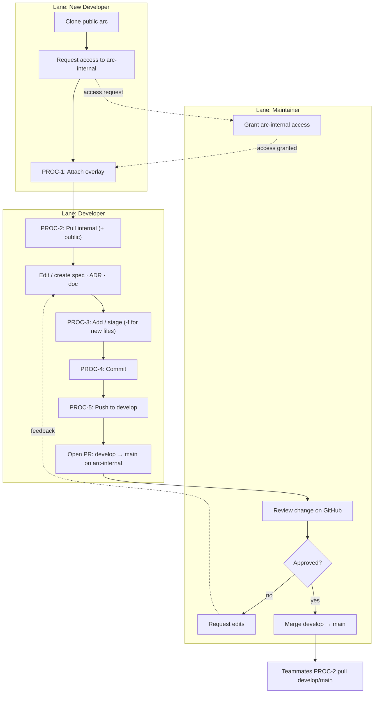
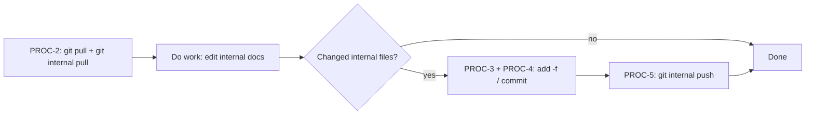

# arc-internal — Procedures & Processes

The private `arc-internal` overlay shares the `arc` working tree via a separate
git dir (`.git-internal`) and is driven with the `git internal` alias. The
public repo git-ignores every internal path, so nothing here leaks to
open-source users.

- **Procedures** = single role, single point in time. One person, one sitting.
- **Processes** = multiple roles and/or multiple points in time — a collection
  of procedures to one end, drawn as a swim-lane flow (one lane per role).

**Roles**
| Role | Who | Scope |
|------|-----|-------|
| New Developer | A dev setting up a machine for the first time | Attach the overlay |
| Developer | Any dev with access, day to day | Pull, add, commit, push internal knowledge |
| Maintainer | Repo owner (Josh) | Grants access, reviews, merges `develop → main` |

**Conventions**
- Public code → plain `git`. Internal knowledge → `git internal`.
- Day-to-day work lands on `develop`; `main` is the reviewed/stable line.
- The two repos share files but have **independent branches** — moving one does
  not move the other.

---

## PROCEDURES

### PROC-1 — Attach the Internal Overlay

- **Description:** Wire the private `arc-internal` overlay onto an existing
  public `arc` clone so internal knowledge (specs, ADRs, steering, `.claude/`)
  appears in place and is drivable via `git internal`.
- **Outcome (done & correct):** `git internal branch -a` lists `main` and
  `develop`; `ls .claude/specs` shows content; **and** `git status` (public)
  lists *no* `.claude` files and *no* `.git-internal/`. If any internal file
  shows up under public `git status`, it is **not** correct — stop and check the
  public `.gitignore`.
- **Resources needed:** an existing `arc` clone; read access to
  `git@github.com:joshuamschultz/arc-internal.git`; an SSH key registered on
  GitHub; bash; git ≥ 2.30.
- **Trigger:** first-time setup on a new machine, or a freshly cloned `arc`.
- **Role:** New Developer.
- **Steps:**
  1. `cd` into your `arc` clone.
  2. Confirm access: `git ls-remote git@github.com:joshuamschultz/arc-internal.git`
     should return refs (not a permission error).
  3. Run the attach commands (self-contained — no local files required yet):
     ```bash
     ROOT="$(git rev-parse --show-toplevel)"
     git config --global alias.internal \
       '!git --git-dir="$(git rev-parse --show-toplevel)/.git-internal" --work-tree="$(git rev-parse --show-toplevel)"'
     git --git-dir="$ROOT/.git-internal" init -b main
     git --git-dir="$ROOT/.git-internal" config core.bare false
     git --git-dir="$ROOT/.git-internal" config core.worktree "$ROOT"
     git --git-dir="$ROOT/.git-internal" remote add origin git@github.com:joshuamschultz/arc-internal.git
     git internal fetch origin
     git internal checkout -f develop
     ```
  4. Verify: `git internal status` (clean) and `git status` (no internal leak).
  5. From now on, the helper script is available at
     `.claude/internal-repo/attach.sh` for re-runs.

---

### PROC-2 — Pull Internal Updates (Update Local)

- **Description:** Bring your local internal knowledge up to date with the
  shared `arc-internal` remote.
- **Outcome (done & correct):** `git internal status` reports
  "Your branch is up to date with 'origin/<branch>'"; any new/changed specs are
  present on disk.
- **Resources needed:** attached overlay (PROC-1 complete); network; read
  access.
- **Trigger:** start of a work session; before editing internal docs; after a
  teammate announces a push.
- **Role:** Developer.
- **Steps:**
  1. `git internal fetch origin`
  2. `git internal status` — see whether you are behind.
  3. `git internal pull --ff-only` (use plain `git internal pull` if you expect
     to merge).
  4. If you also want the latest public code: `git pull`.
  > Public and internal are separate pulls. See PROC-6 to keep both branches in
  > sync, or the combined-pull alias at the bottom.

---

### PROC-3 — Add / Stage Internal Files

- **Description:** Mark internal changes for the next commit, handling the
  public-`.gitignore` quirk that hides brand-new internal files.
- **Outcome (done & correct):** `git internal diff --cached --name-only` lists
  exactly the files you intend — and *nothing* under `worktrees/`, `.venv/`,
  `node_modules/`, `/src/`, or any `settings.local.json`.
- **Resources needed:** attached overlay; edited/created internal files.
- **Trigger:** after editing or creating internal docs, before committing.
- **Role:** Developer.
- **Steps:**
  1. **New file** (never tracked before): `git internal add -f <path>`.
     The `-f` is required **once** because the public `.gitignore` hides the
     path; after it is tracked, the flag is no longer needed.
  2. **Edited tracked file:** `git internal add -u` (or `git internal add <path>`).
  3. Verify the staged set: `git internal diff --cached --name-only`.
  4. Leak check (optional but recommended):
     ```bash
     git internal diff --cached --name-only | grep -E 'worktrees/|settings\.local|\.venv/|/src/' && echo "STOP: junk staged" || echo "clean"
     ```

---

### PROC-4 — Commit Internal Changes

- **Description:** Record the staged internal changes into the overlay history.
- **Outcome (done & correct):** `git internal log -1 --stat` shows your commit
  and lists **only** internal files.
- **Resources needed:** staged changes (PROC-3 complete).
- **Trigger:** after staging a coherent unit of work.
- **Role:** Developer.
- **Steps:**
  1. `git internal status` — confirm the staged set is what you mean to commit.
  2. `git internal commit -m "<type>: <summary>"`
     (types: `feat`, `fix`, `docs`, `chore` — same convention as public code).
  3. Verify: `git internal log -1 --stat`.

---

### PROC-5 — Push Internal Changes (Publish)

- **Description:** Publish committed internal changes to the shared remote so
  teammates can pull them.
- **Outcome (done & correct):** `git internal push` reports the updated ref
  (`<old>..<new>  <branch> -> <branch>`); the commit is visible on GitHub
  `arc-internal`; a teammate running PROC-2 receives it.
- **Resources needed:** write access to `arc-internal`; committed changes;
  network.
- **Trigger:** after committing, when the work is ready to share.
- **Role:** Developer.
- **Steps:**
  1. Confirm branch: `git internal branch --show-current` (day-to-day: `develop`).
  2. `git internal push origin develop` (first push of a new branch: add `-u`).
  3. Verify: `git internal log origin/develop -1 --oneline` or check GitHub.

---

### PROC-6 — Switch Branch With Parity (optional)

- **Description:** Move the overlay to the same branch as the public repo so the
  two lines stay aligned.
- **Outcome (done & correct):** `git branch --show-current` and
  `git internal branch --show-current` report the same name.
- **Resources needed:** attached overlay; clean working tree on both contexts.
- **Trigger:** when you switch the public repo to a different mainline
  (`develop` ↔ `main`) and want internal knowledge to match.
- **Role:** Developer.
- **Steps:**
  1. `git checkout <branch>` (public).
  2. `git internal checkout <branch>` (overlay).
  3. Verify both `--show-current` match.

---

## PROCESSES

### PROCESS A — Publish an Internal Knowledge Change (multi-role)

**End / goal:** a spec, ADR, or doc authored locally is reviewed and lands on
`arc-internal` `main`, available to every dev, with zero leak to the public
repo.

**Lanes (roles):** New Developer · Developer · Maintainer.



**Numbered narrative (procedures in sequence):**
1. *(New Developer)* Clone public `arc`, request access, run **PROC-1** once.
2. *(Maintainer)* Grant `arc-internal` access so the attach succeeds.
3. *(Developer)* **PROC-2** pull → edit the doc → **PROC-3** stage →
   **PROC-4** commit → **PROC-5** push to `develop`.
4. *(Developer)* Open a PR `develop → main` on `arc-internal`.
5. *(Maintainer)* Review; on approval, merge `develop → main`.
6. *(All Developers)* **PROC-2** pull to receive the change.

---

### PROCESS B — Daily Solo Sync (single role → plain flowchart)

**End / goal:** start a session current and finish with your internal work
shared. One role (Developer), so the swim lanes collapse to a single flow.



---

## Quick reference

| Action | Public code | Internal knowledge |
|--------|-------------|--------------------|
| Update local | `git pull` | `git internal pull` |
| Stage new file | `git add <f>` | `git internal add -f <f>` |
| Stage edits | `git add -u` | `git internal add -u` |
| Commit | `git commit -m …` | `git internal commit -m …` |
| Push | `git push` | `git internal push` |
| Status | `git status` | `git internal status` |

**Optional combined-pull alias** (shell rc):
```bash
alias arcpull='git pull && git internal pull'
```
