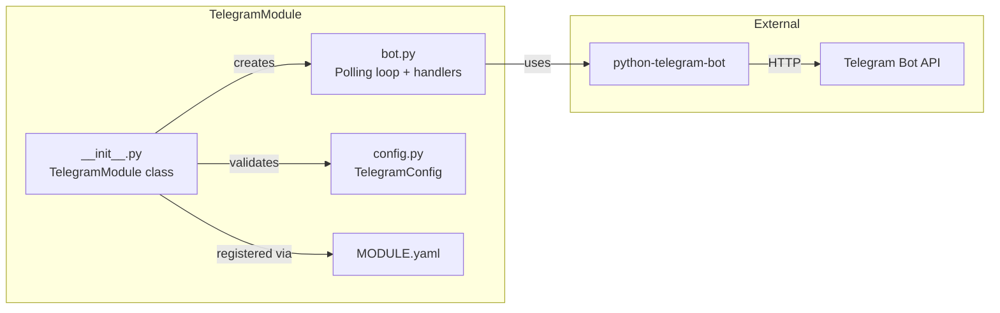
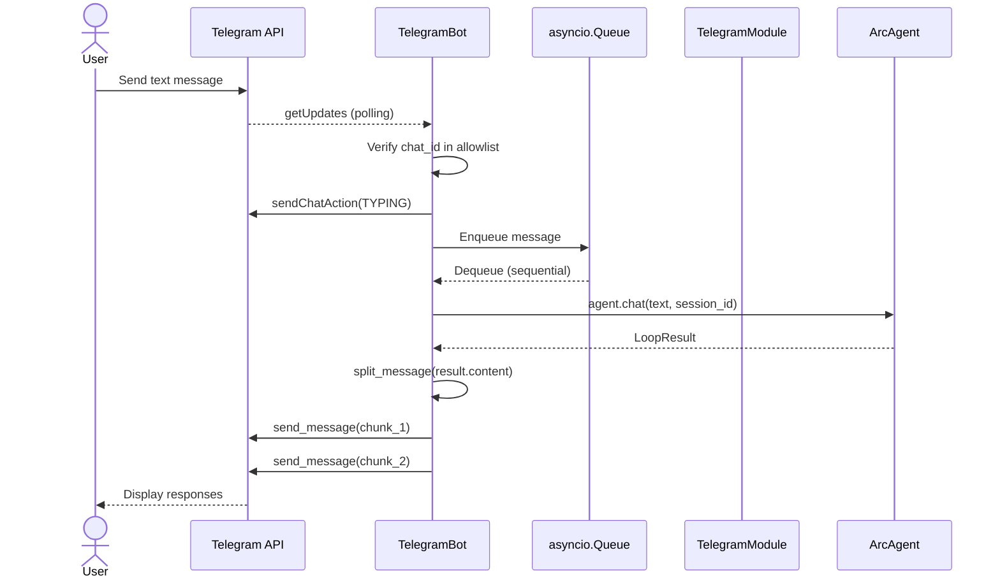
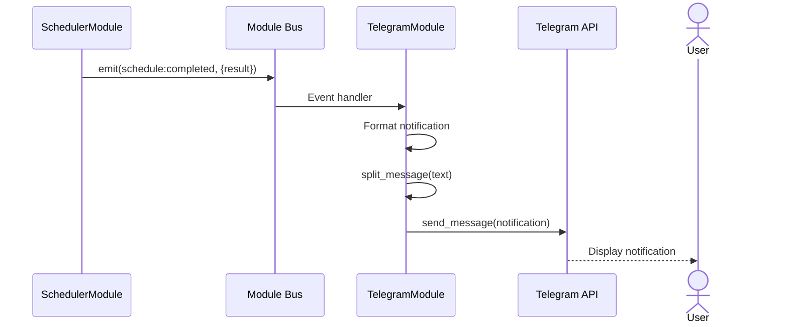
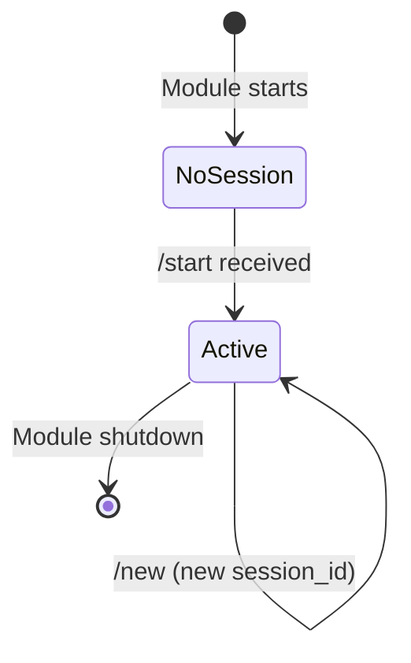

# Solution Design Document: Telegram Messaging Module

## Validation Checklist

- [x] All required sections are complete
- [x] No [NEEDS CLARIFICATION] markers remain
- [x] Steering docs loaded and referenced
- [x] All context sources listed with relevance ratings
- [x] Architecture aligns with steering/structure.md pattern
- [x] Every component has directory mapping (NEW/MODIFIED only)
- [x] Every interface has specification
- [x] Error handling follows steering/tech.md pattern
- [x] Quality requirements reference steering thresholds
- [x] All ADRs confirmed by user (via /build)
- [x] A developer could implement from this design

---

## Context References

### Steering Doc Links

- **Tech Stack**: `packages/arcagent/.claude/steering/tech.md#technology-stack`
- **Commands**: `packages/arcagent/.claude/steering/tech.md#project-commands`
- **Quality Thresholds**: `packages/arcagent/.claude/steering/tech.md#quality-thresholds`
- **Architecture**: `packages/arcagent/.claude/steering/structure.md#architecture-pattern`
- **Boundaries**: `packages/arcagent/.claude/steering/structure.md#implementation-boundaries`

### PRD Reference

- **Requirements**: `.claude/specs/S005-telegram-messaging/PRD.md`

---

## Constraints

### From Steering (Applicable)

| ID | Constraint | Source |
|----|------------|--------|
| CON-1 | Core < 3,000 LOC (module code excluded) | tech.md#technical-constraints |
| CON-5 | Credentials vault-backed in production | tech.md#technical-constraints |
| CON-6 | Every action is an audit event | tech.md#technical-constraints |

### Feature-Specific Constraints

| ID | Constraint | Type |
|----|------------|------|
| CON-F1 | Telegram message limit: 4096 chars | Platform |
| CON-F2 | `python-telegram-bot` v20+ (async) | Dependency |
| CON-F3 | Must follow Module protocol exactly | Architecture |
| CON-F4 | No core modifications beyond wiring `set_agent_chat_fn` | Architecture |
| CON-F5 | Bot token via env var only | Security |

---

## Implementation Context

### Required Context Sources

```yaml
internal:
  - doc: packages/arcagent/.claude/steering/structure.md
    relevance: HIGH
    why: "Module directory conventions, naming, architecture pattern"

  - doc: packages/arcagent/.claude/steering/tech.md
    relevance: HIGH
    why: "Quality thresholds, testing approach, error handling pattern"

  - doc: .claude/decisions-log.md > Feature: Telegram Messaging Module
    relevance: HIGH
    why: "All 14 design decisions for this feature"

source_files:
  - file: arcagent/modules/scheduler/__init__.py
    relevance: HIGH
    why: "Reference module pattern — same deferred binding, same lifecycle, same constructor DI"

  - file: arcagent/modules/scheduler/config.py
    relevance: HIGH
    why: "ModuleConfig base class, config schema pattern"

  - file: arcagent/modules/scheduler/MODULE.yaml
    relevance: HIGH
    why: "Module manifest format"

  - file: arcagent/core/agent.py:464-476
    relevance: HIGH
    why: "Deferred binding pattern (_wire_scheduler_run_fn)"

  - file: arcagent/core/module_loader.py:179-209
    relevance: HIGH
    why: "Convention-based DI — available params: config, eval_config, llm_config, telemetry, workspace"

  - file: arcagent/core/module_bus.py
    relevance: MEDIUM
    why: "EventContext, subscribe/emit API, Module protocol"

external:
  - doc: python-telegram-bot v22.6 docs
    relevance: HIGH
    why: "Bot API, Application builder, MessageHandler, filters"
```

### Implementation Boundaries

From `packages/arcagent/.claude/steering/structure.md#implementation-boundaries`:

- **Must Preserve**: Module Bus events contract, Module protocol, constructor DI pattern
- **Can Modify**: `arcagent/modules/` (add new module), `arcagent/core/agent.py` (add deferred binding wiring)
- **Must Not Touch**: ArcLLM internals, ArcRun internals, core component logic

---

## Solution Strategy

- **Architecture Pattern**: Module Bus participant (same as scheduler, memory, policy modules)
- **Integration Approach**: Deferred binding -- module gets `agent.chat()` callback via `set_agent_chat_fn()`, wired by `agent.py` after startup. Same proven pattern as scheduler's `set_agent_run_fn()`.
- **Justification**: Follows existing conventions exactly. Module is self-contained, removable, and doesn't modify core beyond a 5-line wiring method in `agent.py`.
- **Key Dependency**: `python-telegram-bot` v20+ (async, well-maintained, 18k+ star ecosystem)

---

## Building Block View

### System Context Diagram

```mermaid
graph TB
    User[User Phone / Telegram App]
    Bot[Telegram Bot API]
    Module[TelegramModule]
    Agent[ArcAgent]
    Bus[Module Bus]
    Scheduler[SchedulerModule]

    User -->|text message| Bot
    Bot -->|getUpdates polling| Module
    Module -->|agent.chat()| Agent
    Agent -->|result.content| Module
    Module -->|send_message()| Bot
    Bot -->|text message| User

    Scheduler -->|schedule:completed event| Bus
    Bus -->|event notification| Module
    Module -->|send notification| Bot
```

### Component Diagram



### Directory Map (NEW/MODIFIED Only)

```
packages/arcagent/
├── arcagent/
│   ├── core/
│   │   └── agent.py                          # MODIFY: Add _wire_telegram_chat_fn() (5 lines)
│   └── modules/
│       └── telegram/
│           ├── __init__.py                   # NEW: TelegramModule class
│           ├── bot.py                        # NEW: Bot polling, handlers, message splitting
│           ├── config.py                     # NEW: TelegramConfig (Pydantic)
│           └── MODULE.yaml                   # NEW: Module manifest
├── tests/
│   ├── unit/
│   │   └── modules/
│   │       └── telegram/
│   │           ├── __init__.py               # NEW: Package init
│   │           ├── conftest.py               # NEW: Shared fixtures
│   │           ├── test_module.py            # NEW: Module lifecycle tests
│   │           ├── test_bot.py               # NEW: Bot handler tests
│   │           └── test_config.py            # NEW: Config validation tests
│   └── integration/
│       └── test_telegram_integration.py      # NEW: Real agent + mocked Telegram
└── pyproject.toml                            # MODIFY: Add python-telegram-bot dependency
```

---

## Interface Specifications

### TelegramModule Class

```python
class TelegramModule:
    """Telegram messaging module — Module Bus participant."""

    def __init__(
        self,
        config: dict[str, Any] | None = None,
        telemetry: AgentTelemetry | None = None,
        workspace: Path = Path("."),
    ) -> None: ...

    @property
    def name(self) -> str:
        return "telegram"

    async def startup(self, ctx: ModuleContext) -> None:
        """Subscribe to events, start polling loop."""

    async def shutdown(self) -> None:
        """Stop polling loop, drain queue."""

    def set_agent_chat_fn(
        self, fn: Callable[[str, str | None], Awaitable[Any]]
    ) -> None:
        """Bind agent.chat(message, session_id=...) callback. Deferred binding."""
```

### TelegramConfig (Pydantic)

```python
class TelegramConfig(ModuleConfig):
    """Config from [modules.telegram.config] in arcagent.toml."""

    enabled: bool = False
    allowed_chat_ids: list[int] = []        # Empty = accept none (fail-closed)
    poll_interval: float = 1.0              # Seconds between getUpdates
    max_message_length: int = 4096          # Telegram hard limit
    bot_token_env_var: str = "ARCAGENT_TELEGRAM_BOT_TOKEN"
```

### Bot Handlers (bot.py)

```python
class TelegramBot:
    """Manages polling loop, message routing, and response delivery."""

    def __init__(
        self,
        config: TelegramConfig,
        telemetry: AgentTelemetry | None,
        workspace: Path,
    ) -> None: ...

    def set_agent_chat_fn(
        self, fn: Callable[[str, str | None], Awaitable[Any]]
    ) -> None: ...

    async def start(self) -> None:
        """Start long-polling in background asyncio task."""

    async def stop(self) -> None:
        """Stop polling, drain message queue, close connections."""

    async def send_notification(self, text: str) -> None:
        """Send proactive message to stored chat_id."""
```

### Message Splitting Function

```python
def split_message(text: str, max_length: int = 4096) -> list[str]:
    """Split text into chunks respecting boundaries.

    Priority:
    1. Double-newline (paragraph boundary)
    2. Single newline
    3. Sentence boundary (. ! ?)
    4. Hard split at max_length
    """
```

### Module Manifest (MODULE.yaml)

```yaml
name: telegram
version: 0.1.0
description: Bidirectional Telegram messaging for human-agent interaction
author: ArcAgent
entry_point: arcagent.modules.telegram:TelegramModule
dependencies:
  - arcagent.core.module_bus
  - arcagent.core.config
events:
  subscribes:
    - agent:shutdown
    - schedule:completed
    - schedule:failed
  emits:
    - telegram:message_received
    - telegram:message_sent
    - telegram:notification_sent
    - telegram:auth_rejected
    - telegram:polling_started
    - telegram:polling_stopped
    - telegram:error
```

### TOML Config Example

```toml
[modules.telegram]
enabled = true
priority = 100

[modules.telegram.config]
allowed_chat_ids = [123456789]
poll_interval = 1.0
max_message_length = 4096
```

Token via environment: `ARCAGENT_TELEGRAM_BOT_TOKEN=<token-from-BotFather>`

### Agent.py Wiring Addition

```python
def _wire_telegram_chat_fn(self) -> None:
    """Bind agent.chat() into the telegram module after startup."""
    if self._bus is None:
        return
    telegram = self._bus.get_module("telegram")
    if telegram is not None and hasattr(telegram, "set_agent_chat_fn"):
        telegram.set_agent_chat_fn(self.chat)
        _logger.info("Bound agent_chat_fn to telegram module")
```

---

## Runtime View

### Primary Flow: Inbound Message



### Proactive Notification Flow



### Session Lifecycle



### Error Handling

Following pattern from `packages/arcagent/.claude/steering/tech.md#error-handling-pattern`:

| Error Type | Code | Response | Recovery |
|------------|------|----------|----------|
| No bot token | TELEGRAM_NO_TOKEN | Module stays dormant, logs warning | Set env var and restart |
| Unauthorized chat_id | TELEGRAM_AUTH_REJECTED | Silent ignore, audit log | Add chat_id to allowlist |
| Agent.chat() failure | TELEGRAM_AGENT_ERROR | Send "Error processing message" to user | Retry on next message |
| Telegram API error | TELEGRAM_API_ERROR | Log error, skip message | Auto-retry by python-telegram-bot |
| Message send failure | TELEGRAM_SEND_FAILED | Log, retry once | Manual resend |
| Queue full (shouldn't happen) | TELEGRAM_QUEUE_FULL | Log, drop message | asyncio.Queue is unbounded by default |

---

## Architecture Decisions

All decisions were confirmed interactively during `/build` (14 decisions in `.claude/decisions-log.md`). Key ones summarized:

### ADR-1: Long Polling Over Webhooks

- **Status**: Confirmed (D-002)
- **Context**: Need to receive inbound Telegram messages
- **Decision**: Long polling via `getUpdates` only. No webhook support.
- **Rationale**: No HTTPS, no domain, no reverse proxy needed. Works on Mac and AWS. Proactive outbound via `send_message()` works regardless. OpenClaw also defaults to polling.
- **Trade-offs**: Slightly higher latency (poll_interval) vs real-time webhooks. Acceptable for personal use.

### ADR-2: Deferred Binding for Agent Access

- **Status**: Confirmed (D-004)
- **Context**: Module needs `agent.chat()` but can't receive it during construction (chicken-and-egg)
- **Decision**: `set_agent_chat_fn(agent.chat)` wired by `agent.py` after startup
- **Rationale**: Same proven pattern as scheduler's `set_agent_run_fn()`. Zero coupling to agent internals. Module is removable without core changes.

### ADR-3: Sequential Message Processing

- **Status**: Confirmed (D-012)
- **Context**: Multiple messages could arrive while one is being processed
- **Decision**: `asyncio.Queue` with single consumer task
- **Rationale**: Prevents session state race conditions. Same approach as OpenClaw's per-chat sequencing. FIFO ordering preserves conversational context.

### ADR-4: Single Chat Model

- **Status**: Confirmed (D-006)
- **Context**: How many chats does one bot serve?
- **Decision**: 1 bot = 1 user = 1 chat. `allowed_chat_ids` enforces this.
- **Rationale**: Day-1 is single-user. No mapping store needed. Module tracks one active `session_id`. Multi-tenant is a future concern.

---

## Quality Requirements

From `packages/arcagent/.claude/steering/tech.md#quality-thresholds`:

| Aspect | Threshold | Feature Target | Measurement |
|--------|-----------|----------------|-------------|
| Line Coverage | >= 80% | >= 85% | `pytest --cov` |
| Branch Coverage | >= 75% | >= 75% | `pytest --cov` |
| Ruff Errors | 0 | 0 | `ruff check .` |
| mypy Errors | 0 | 0 | `mypy arcagent/` |
| Complexity | <= 10 per function | <= 8 | Manual review |

---

## Test Specifications

### Critical Test Scenarios

**Scenario 1: Happy Path — Inbound Message**
```gherkin
Given: TelegramModule started with valid config and agent_chat_fn bound
And: chat_id is in allowed_chat_ids
When: User sends "hello" via Telegram
Then: Module calls agent.chat("hello", session_id=<current>)
And: Response is sent back via bot.send_message()
And: telegram:message_received event emitted
And: telegram:message_sent event emitted
```

**Scenario 2: Unauthorized Access**
```gherkin
Given: TelegramModule started with allowed_chat_ids = [111]
When: Message arrives from chat_id 999
Then: Message is silently ignored
And: telegram:auth_rejected event emitted with chat_id=999
And: No agent.chat() call made
```

**Scenario 3: Long Response Splitting**
```gherkin
Given: agent.chat() returns a 6000-character response
When: Module prepares to send response
Then: split_message() produces 2 chunks (each <= 4096 chars)
And: Chunks split at paragraph boundary (double-newline)
And: Both chunks sent sequentially
```

**Scenario 4: Proactive Notification**
```gherkin
Given: TelegramModule subscribed to schedule:completed
And: A stored chat_id exists
When: schedule:completed event fires with result data
Then: Module sends formatted notification to stored chat_id
And: telegram:notification_sent event emitted
```

**Scenario 5: No Bot Token**
```gherkin
Given: ARCAGENT_TELEGRAM_BOT_TOKEN is not set
When: TelegramModule starts up
Then: Module logs warning and does not start polling loop
And: Module remains dormant (no errors, no crashes)
```

**Scenario 6: /start Command**
```gherkin
Given: TelegramModule started
When: User sends /start from chat_id 123
Then: Module stores chat_id 123
And: Creates new session
And: Replies with welcome message
```

**Scenario 7: /new Command**
```gherkin
Given: Active session exists
When: User sends /new
Then: New session_id created
And: Old session preserved in history
And: User receives confirmation
```

---

## Glossary Additions

| Term | Definition | Context |
|------|------------|---------|
| **TelegramModule** | Module Bus participant providing Telegram messaging | Primary module class |
| **TelegramBot** | Internal class managing polling loop and message handlers | bot.py |
| **TelegramConfig** | Pydantic config for `[modules.telegram.config]` | config.py |
| **Deferred Binding** | Pattern where callback is provided after startup | Module lifecycle |
| **Smart Split** | Algorithm breaking text at paragraph/sentence boundaries | Response delivery |
| **chat_id** | Telegram integer identifier for a private chat | Authorization key |
