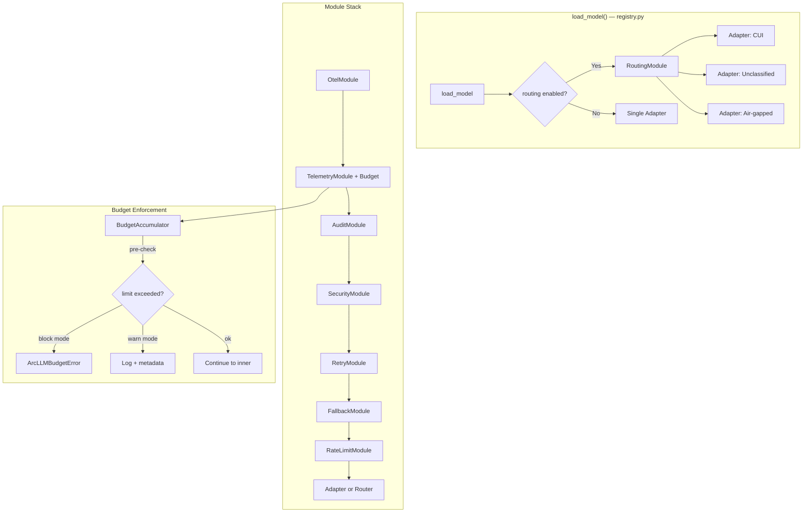
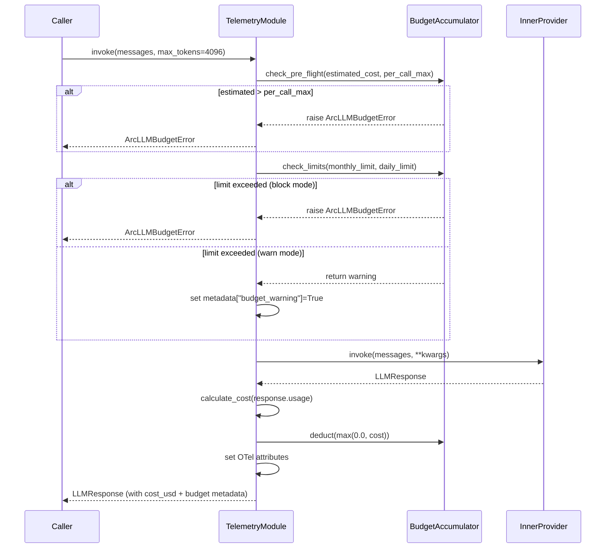
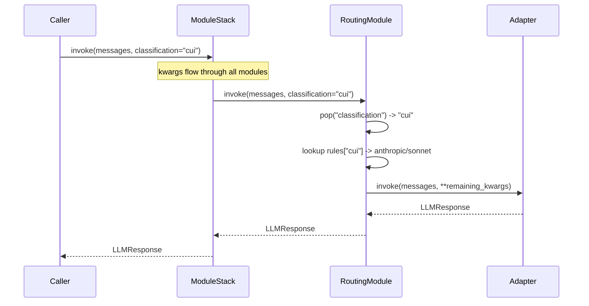

# SDD: Budget Control & Compliance-Aware Routing

## Implementation Context

### Required Context Sources

```yaml
internal:
  - doc: packages/arcllm/CLAUDE.md
    relevance: HIGH
    why: "Build standards, security posture, quality gates"

  - doc: .claude/decisions-log.md
    relevance: HIGH
    why: "14 build decisions + research insights for this feature"

source_files:
  - file: packages/arcllm/src/arcllm/modules/telemetry.py
    relevance: HIGH
    why: "Primary file to extend with budget tracking"

  - file: packages/arcllm/src/arcllm/registry.py
    relevance: HIGH
    why: "load_model() — add routing/budget_scope kwargs, wire Router"

  - file: packages/arcllm/src/arcllm/types.py
    relevance: HIGH
    why: "LLMProvider protocol that Router must implement"

  - file: packages/arcllm/src/arcllm/exceptions.py
    relevance: HIGH
    why: "Add ArcLLMBudgetError to exception hierarchy"

  - file: packages/arcllm/src/arcllm/modules/rate_limit.py
    relevance: MEDIUM
    why: "_bucket_registry pattern — model for budget accumulator registry"

  - file: packages/arcllm/src/arcllm/modules/base.py
    relevance: MEDIUM
    why: "BaseModule contract — Router extends this"

  - file: packages/arcllm/src/arcllm/config.py
    relevance: MEDIUM
    why: "Config loading, _validate_provider_name pattern for scope validation"

  - file: packages/arcllm/src/arcllm/config.toml
    relevance: MEDIUM
    why: "Add budget fields to [modules.telemetry], routing rules section"

  - file: packages/arcllm/src/arcllm/adapters/base.py
    relevance: MEDIUM
    why: "BaseAdapter — Router creates multiple instances"
```

### Implementation Boundaries

- **Must Preserve**: All existing module behavior, test suite, module stacking order for non-Router paths
- **Can Modify**: `telemetry.py` (add budget), `registry.py` (add kwargs), `exceptions.py` (add error), `config.toml` (add config)
- **Must Not Touch**: Adapter implementations, other modules (audit, security, otel, retry, fallback, rate_limit)

---

## Solution Strategy

- **Budget**: Extend `TelemetryModule` with `BudgetAccumulator` — pre-check before `self._inner.invoke()`, post-deduct after response
- **Routing**: New `RoutingModule` implementing `LLMProvider` — holds multiple adapters, selects by `classification` kwarg
- **Integration**: Both features share the `enforcement` config toggle (`"warn"` or `"block"`)

---

## Building Block View

### Component Diagram



### Directory Map (NEW/MODIFIED Only)

```
packages/arcllm/src/arcllm/
├── exceptions.py              # MODIFY: Add ArcLLMBudgetError
├── config.toml                # MODIFY: Add budget fields to [modules.telemetry], add [modules.routing]
├── registry.py                # MODIFY: Add budget_scope + routing kwargs to load_model()
├── modules/
│   ├── telemetry.py           # MODIFY: Add BudgetAccumulator, pre/post hooks, scope validation
│   └── routing.py             # NEW: RoutingModule (~150 LOC)
packages/arcllm/tests/
├── test_budget.py             # NEW: Budget accumulator, enforcement, validation
├── test_routing.py            # NEW: Routing selection, classification, lifecycle
├── test_budget_telemetry.py   # NEW: Integration — budget inside telemetry stack
├── test_routing_stack.py      # NEW: Integration — router with full module stack
├── security/
│   ├── test_budget_security.py  # NEW: Scope injection, negative cost, overflow
│   └── test_routing_security.py # NEW: Classification downgrade, adapter isolation
```

---

## Interface Specifications

### New Exception

```python
# exceptions.py
class ArcLLMBudgetError(ArcLLMError):
    """Raised when a budget limit would be exceeded."""
    scope: str
    limit_type: str       # "monthly", "daily", "per_call"
    limit_usd: float
    current_usd: float
    estimated_usd: float | None
```

### BudgetAccumulator (internal to telemetry.py)

```python
class BudgetAccumulator:
    """Per-scope spend tracker with calendar period resets."""
    monthly_spend: float    # Resets on UTC month boundary
    daily_spend: float      # Resets on UTC day boundary
    current_month: int      # YYYYMM integer key
    current_day: int        # YYYYMMDD integer key

    def check_and_deduct(self, cost: float, monthly_limit: float,
                         daily_limit: float) -> None: ...
    def check_pre_flight(self, estimated: float, per_call_max: float) -> None: ...
```

### Budget Config (added to telemetry config)

```toml
[modules.telemetry]
enabled = true
log_level = "INFO"
# Budget fields (all optional — budget disabled if none present)
monthly_limit_usd = 500.00
daily_limit_usd = 50.00
per_call_max_usd = 5.00
alert_threshold_pct = 80
enforcement = "block"       # "block" or "warn"
```

### Routing Config

```toml
[modules.routing]
enabled = true
enforcement = "warn"                    # "block" or "warn"
default_classification = "unclassified"

[modules.routing.rules.cui]
provider = "anthropic"
model = "claude-sonnet-4-6"

[modules.routing.rules.unclassified]
provider = "openai"
model = "gpt-4o-mini"

[modules.routing.rules.air_gapped]
provider = "ollama"
model = "llama3"
```

### Updated load_model() Signature

```python
def load_model(
    provider: str,
    model: str | None = None,
    *,
    budget_scope: str | None = None,      # NEW: required when budget enabled
    routing: bool | dict[str, Any] | None = None,  # NEW: RoutingModule toggle
    retry: bool | dict[str, Any] | None = None,
    fallback: bool | dict[str, Any] | None = None,
    rate_limit: bool | dict[str, Any] | None = None,
    telemetry: bool | dict[str, Any] | None = None,
    audit: bool | dict[str, Any] | None = None,
    security: bool | dict[str, Any] | None = None,
    otel: bool | dict[str, Any] | None = None,
) -> LLMProvider:
```

### RoutingModule Interface

```python
class RoutingModule(LLMProvider):
    """Routes invoke() calls to provider+model based on classification kwarg."""

    def __init__(self, config: dict[str, Any]) -> None:
        # Eagerly loads all adapters from routing rules
        # Validates all provider configs at init

    @property
    def name(self) -> str:
        # Returns default route's provider name

    @property
    def model_name(self) -> str:
        # Returns default route's model name

    async def invoke(self, messages, tools=None, **kwargs) -> LLMResponse:
        # Pop classification from kwargs
        # Select adapter by classification
        # Delegate to selected adapter

    def validate_config(self) -> bool:
        # All adapters valid

    async def close(self) -> None:
        # Close ALL adapters
```

### OTel Span Attributes

```yaml
Budget spans (on arcllm.telemetry span):
  arcllm.budget.scope: "agent:agent-007"
  arcllm.budget.enforcement: "block"
  arcllm.budget.monthly_spend_usd: 42.50
  arcllm.budget.daily_spend_usd: 8.30
  arcllm.budget.monthly_limit_usd: 500.00
  arcllm.budget.daily_limit_usd: 50.00
  arcllm.budget.per_call_max_usd: 5.00
  arcllm.budget.action: "allowed"  # "allowed", "warned", "blocked"
  arcllm.budget.alert_threshold_crossed: false

Budget events (OTel span events):
  - name: "budget_alert"
    attrs: {scope, monthly_spend_usd, monthly_limit_usd, threshold_pct}
  - name: "budget_exceeded"
    attrs: {scope, limit_type, limit_usd, current_usd, estimated_usd}

Routing spans (on arcllm.routing span — inside RoutingModule):
  arcllm.routing.classification: "cui"
  arcllm.routing.selected_provider: "anthropic"
  arcllm.routing.selected_model: "claude-sonnet-4-6"
  arcllm.routing.enforcement: "block"
  arcllm.routing.action: "routed"  # "routed", "defaulted", "blocked"
```

---

## Runtime View

### Budget Enforcement Flow



### Routing Flow



---

## Error Handling

| Error | Condition | Response | Recovery |
|-------|-----------|----------|----------|
| `ArcLLMBudgetError` | Spend limit exceeded (block mode) | Raise with scope, limit_type, amounts | Caller handles: wait for period reset or increase limit |
| `ArcLLMConfigError` | Invalid budget_scope format | Raise at `load_model()` time | Caller fixes scope string |
| `ArcLLMConfigError` | Unknown classification (block mode) | Raise at `invoke()` time | Caller provides valid classification |
| `ArcLLMConfigError` | Invalid routing rule (missing provider/model) | Raise at `RoutingModule.__init__()` | Fix config.toml |
| `ArcLLMConfigError` | budget_scope required but not provided | Raise at `load_model()` time | Caller adds budget_scope kwarg |

---

## Architecture Decisions

### ADR-1: Budget Extends Telemetry (Not Separate Module)

- **Status**: Confirmed (D-001)
- **Context**: Budget tracking needs cost calculation. TelemetryModule already calculates cost.
- **Decision**: Extend TelemetryModule rather than creating BudgetModule
- **Rationale**: One module, one cost concern. Can't bypass budget without bypassing telemetry. No shared mutable state between modules.
- **Trade-offs**: TelemetryModule grows from 106 to ~186 LOC

### ADR-2: Float for Cost Accumulation (Not Decimal)

- **Status**: Confirmed (deepen research)
- **Context**: Floating-point arithmetic could drift over many accumulations
- **Decision**: Keep `float` (IEEE 754 double)
- **Rationale**: At $0.001/call, 10k calls = $10. Float64 drift is ~1e-12 — irrelevant. Decimal would break `cost_usd: float` on LLMResponse and all OTel attributes. Accumulator is for enforcement, not billing. OTel spans have exact per-call amounts.

### ADR-3: Router Creates Own Adapters (Not Reusing load_model Adapter)

- **Status**: Confirmed (D-010)
- **Context**: Could Router reuse the adapter that `load_model()` creates?
- **Decision**: Router creates its own adapter instances from config
- **Rationale**: Router needs multiple adapters (one per classification rule). Each needs its own httpx client and vault-resolved API key. Fail-fast at init validates all provider configs upfront.

---

## Quality Requirements

| Aspect | Threshold | Feature Target | Measurement |
|--------|-----------|----------------|-------------|
| Line coverage | >= 80% | >= 90% | `pytest --cov` |
| Branch coverage | >= 75% | >= 85% | `pytest --cov` |
| Cyclomatic complexity | <= 10 | <= 8 | `ruff check` |
| mypy | 0 errors | 0 errors | `mypy --strict` |
| ruff | 0 errors | 0 errors | `ruff check` |
| Security tests | n/a | 6 attack categories | `pytest tests/security/` |

---

## Test Specifications

### Budget: Happy Path
```gherkin
Given: TelemetryModule configured with monthly_limit_usd=100, enforcement="block"
And: Budget accumulator at $0 spend
When: Caller invokes with a call costing $0.01
Then: Call succeeds, accumulator shows $0.01, OTel attributes set
```

### Budget: Block at Limit
```gherkin
Given: TelemetryModule with monthly_limit_usd=1.00, enforcement="block"
And: Budget accumulator at $0.99
When: Caller invokes (any cost)
Then: ArcLLMBudgetError raised with limit_type="monthly"
And: No API call made (pre-check blocks)
```

### Budget: Warn at Limit
```gherkin
Given: TelemetryModule with monthly_limit_usd=1.00, enforcement="warn"
And: Budget accumulator at $0.99
When: Caller invokes
Then: Call succeeds, response.metadata["budget_warning"]=True
And: OTel event "budget_exceeded" emitted
```

### Routing: Classification Routing
```gherkin
Given: RoutingModule with rules {cui: anthropic/sonnet, unclassified: openai/gpt-4o-mini}
When: Caller invokes with classification="cui"
Then: Request routed to Anthropic adapter
And: OTel attributes show arcllm.routing.selected_provider="anthropic"
```

### Routing: Unknown Classification (Block)
```gherkin
Given: RoutingModule with enforcement="block"
When: Caller invokes with classification="secret_squirrel"
Then: ArcLLMConfigError raised
And: No API call made
```

### Security: Negative Cost Injection
```gherkin
Given: Budget accumulator at $50 monthly spend
When: Adapter returns Usage with output_tokens=-1000 (negative)
Then: Cost clamped to max(0.0, calculated_cost)
And: Accumulator does not decrease
```
