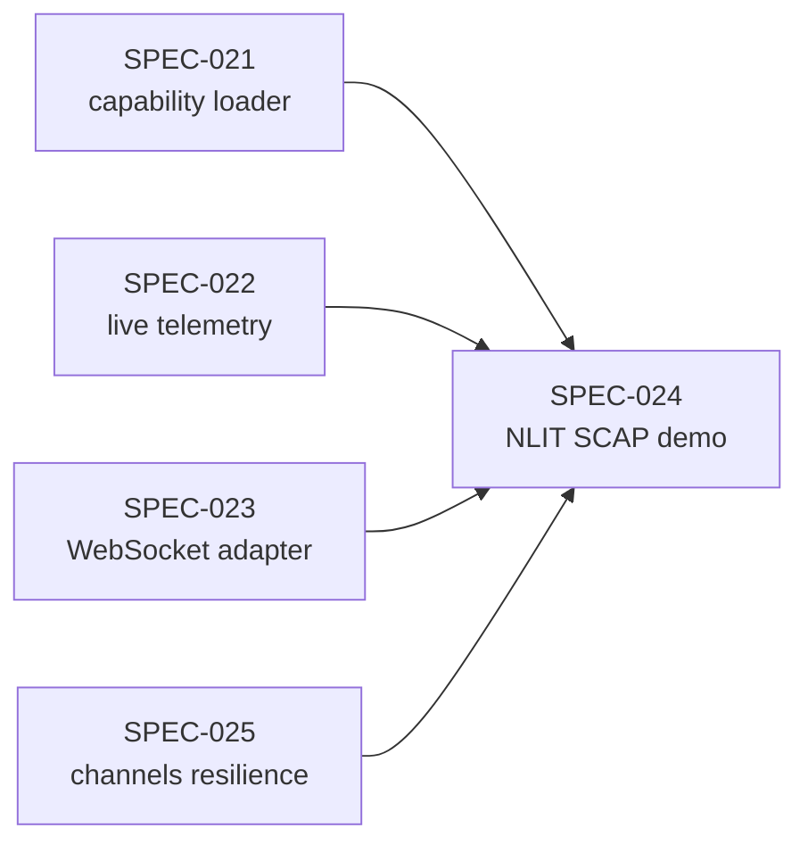

# Product Roadmap — Arc

> Implementation planning context that informs feature execution.
> Feature-specific tasks go in `.claude/specs/{feature}/PLAN.md`.

## Validation Checklist

- [x] Current phase defined
- [x] Phase goals clear
- [x] Dependencies mapped
- [x] Parallel work identified
- [x] Success criteria defined
- [x] No `[NEEDS CLARIFICATION]` markers

---

## Roadmap Overview

> The canonical roadmap **is the spec sequence** in `.claude/specs/SPEC-NNN-*`. This document groups specs into phases for context. The decision journal (`.claude/decisions-log.md`, D-001..D-NNN) captures the running history.

## Current Phase

- **Phase**: 3 — Distribution & supply-chain hardening
- **Driver**: Federal deployments must be able to *not install* a capability, not merely disable it, and an operator must be able to sign a capability through a documented command.
- **Active branch**: `feat/gateway-messaging-media`
- **Active spec**: `SPEC-066-module-bundles` (signed module bundles + capability signing surfaces)
- **Phase 2 status**: `SPEC-024-nlit-scap-demo` is still `draft` and its NLIT 2026 driver date (May 2026) has passed. Phase 2 was overtaken by the Phase 3/4 work that shipped through SPEC-055–SPEC-065 (ArcFlow, connectors, blueprints v2, arcprompt, Mission Control, gateway messaging). Treat SPEC-024 as unstarted, not in-flight.

## Phase Definitions

| Phase | Theme | Status | Anchor specs |
|-------|-------|--------|--------------|
| 0 | Core foundation | ✅ Complete | arcrun ≤ 0.5, arcllm ≤ 0.4, arctrust ≤ 0.2, arcagent ≤ 0.4 |
| 1 | Monorepo refactor + Four Pillars universality | ✅ Complete (2026-04-26) | SPEC-017 (core hardening), SPEC-021 (capability system) |
| 1.5 | **Security foundation hardening** — Four Pillars from claim to enforced reality | ✅ **Complete** | SPEC-033 (sign), SPEC-034 (policy pipeline), SPEC-035 (goal-lock + lethal trifecta), SPEC-036 (code-exec sandbox), SPEC-037 (asymmetric + FIPS signing), SPEC-038 (budgets + classification), SPEC-053 (audit-authority independence), SPEC-039 (docs truthfulness pass) |
| 2 | NLIT demo + SCAP tooling | ⏸️ Unstarted (driver date passed) | SPEC-022, SPEC-023, **SPEC-024** (`draft`), SPEC-025 |
| 3 | Distribution & supply-chain hardening | 🔨 **In progress** | **SPEC-066** (module bundles + capability signing); prior: SPEC-033 (sign), connector bundles, blueprints v2 |
| 4 | Multi-agent fleet | 🔨 Largely shipped ahead of Phase 3 | SPEC-055/056 (mention triage, Mission Control), SPEC-061 (ArcFlow), SPEC-065 (gateway messaging) |

---

## Implementation Philosophy

### Specification Compliance

> All implementation must follow approved specifications.

#### Before each feature

1. Read spec in `.claude/specs/SPEC-NNN-*/`.
2. Confirm PRD requirements understood.
3. Confirm SDD design (esp. threat-surface mapping).
4. Load PLAN tasks into TodoWrite.
5. Map at least one OWASP LLM/Agentic threat ID to the work.

#### Deviation protocol

If implementation cannot follow spec exactly:

1. **Document** the deviation in the spec's `README.md` decision log.
2. **Get approval** before proceeding.
3. **Update spec** if the deviation is an improvement.
4. **Never deviate silently.**

### TDD Discipline

```
For each task:
1. Read relevant spec sections + existing patterns.
2. Write the failing test (verify it fails for the RIGHT reason).
3. Implement the minimum to make it pass.
4. Run quality gates (ruff, mypy, coverage).
5. Update decision log if a non-obvious choice was made.
```

### Concern Separation (non-negotiable)

Per `CLAUDE.md`:
- LLM calls live in `arcllm`.
- Loop execution lives in `arcrun`.
- Agent orchestration / tools / skills / extensions live in `arcagent`.

If a PR blurs these, it is wrong by construction. Architecture regression tests (`make architecture-tests`) detect violations.

### Clean & Lean

Per `CLAUDE.md`:
- **No legacy / back-compat shims.** Local-only repo. Delete the old code in the same edit.
- **One line beats five.** Smallest correct change wins.
- **Leave it correct.** Fix any pre-existing lint / type / test errors surfaced during the work.

---

## Phase Details

### Phase 0 — Core Foundation (✅ Complete)

#### Goals

- Establish the four-package skeleton (arctrust, arcllm, arcrun, arcagent).
- Provide direct-HTTP LLM access (no vendor SDKs).
- Implement the async ReAct loop and basic tool dispatch.
- Make agent identity (DID) mandatory.

#### Outcome

- 16 LLM providers via `arcllm`.
- ReAct loop in `arcrun` with strict separation from agent concerns.
- Agent nucleus in `arcagent` with DID-required construction.

---

### Phase 1 — Monorepo Refactor & Four Pillars Universality (✅ Complete — 2026-04-26)

#### Goals

- Promote `arctrust` to canonical leaf.
- Move audit emission to a single chokepoint (`arctrust.audit.emit`).
- Split orchestration concerns: `arcrun` = pure loop, `arcagent` = spawn primitives.
- Deliver the 5-layer policy pipeline at sub-millisecond p95.
- Establish defense-in-depth sandbox for agent-authored code.
- Lift `arcskill` to public release with Sigstore + Rekor + AST scan + sandboxed dry-run.
- Affirm Four Pillars (Identity, Sign, Authorize, Audit) as **universal** across all tiers — tier is stringency metadata, not a feature gate.

#### Anchor Specs

| Spec | Theme | Result |
|------|-------|--------|
| SPEC-017 | Arc core hardening | 5-layer policy pipeline, dynamic-tool sandbox, parallel dispatch |
| SPEC-021 | Unified capability system | One loader, 4 scan roots, explicit precedence |
| ADR-019 (referenced) | Four Pillars universality | Every tier enforces all four |
| ADR-017A..D | Policy + sandbox decisions | Accepted |

#### Outcome

- arctrust 0.2.0 (176 tests, 99% coverage).
- arcllm 0.4.0 (885 tests, 99% coverage).
- arcrun 0.5.0 (513 tests).
- arcagent 0.4.0 (3,136+ tests, core ≥90%).
- arcskill 0.1.0 (342 tests, 86%).
- arcgateway 0.2.0 (494 tests, 94%).

---

### Phase 1.5 — Security Foundation Hardening (✅ Complete)

Phase 1 *claimed* the Four Pillars were universal. Phase 1.5 made that claim true and enforced, closing the gaps a truthfulness pass surfaced between what the docs said and what the code did.

#### Goals

- Enforce the Sign pillar on agent-writable capability roots (not just the trusted builtins).
- Make the policy pipeline's Provider/Team/Sandbox/Classification layers real, wired implementations instead of always-ALLOW placeholders.
- Lock agent goals (`identity.md`, policy, `context.md`) against self-modification, and arm the lethal-trifecta gate.
- Replace subprocess-only code execution with a real, tier-enforced sandbox.
- Replace HMAC request/audit signing with asymmetric (Ed25519 / ECDSA-P256 FIPS) signing, with out-of-process key custody as the default at enterprise/federal.
- Enforce token/cost budgets and Bell-LaPadula classification as real gates, not aspirational config.
- Separate audit-signing authority from agent identity so no agent can forge its own audit trail.

#### Anchor Specs

| Spec | Theme | Result |
|------|-------|--------|
| SPEC-033 | Enforce Sign pillar | Agent-authored capabilities (workspace, global, per-agent roots) signed on write, re-verified at load, TOFU-gated above personal; only first-party builtins/module code stay trust-by-supply-chain |
| SPEC-034 | Complete policy pipeline | `arctrust.policy.PolicyPipeline` — Identity, Global, Classification, Provider, Agent, Team, Sandbox layers are real; tier composition: personal (2 layers) / enterprise (6) / federal (7, all) |
| SPEC-035 | Goal-lock + lethal trifecta | `identity.md`/policy/`context.md` immutable to the agent via inode-identity checks; trifecta gate (private-data + external-comms + untrusted-input) armed in `arctrust.GlobalLayer`, fed by arcagent's capability-tag ledger; bash confined to workspace sandbox at enterprise/federal |
| SPEC-036 | Code-exec sandbox | Tier-routed real sandbox: Firecracker microVM (federal) → Docker container (enterprise / personal default) → stripped local subprocess (personal, explicit opt-in only) |
| SPEC-037 | Asymmetric + FIPS signing | HMAC removed everywhere (arcllm request signing, arcteam/arctrust audit chains); dual-algo Ed25519 default + ECDSA-P256 FIPS; out-of-process `vault_transit` custody (seed never enters the agent process) is the enterprise/federal default — `FileNotaryTransit` is the local dev/CI reference, a real HSM/vault backend is the production swap |
| SPEC-038 | Budgets + classification | Token/cost circuit-breaker default-on above personal tier; Bell-LaPadula classification layer (no-read-up / no-write-down / no-exfil) enforced at enterprise/federal, fail-closed once a call carries clearance labels |
| SPEC-053 | Audit-authority independence | WORM audit chains signed by the **operator's** key, never the agent's own DID — an agent cannot forge or re-sign its own audit trail; federal adds an external witness anchor over the chain head |
| SPEC-039 | Docs truthfulness pass | Package READMEs and public docstrings corrected to match the above — no HMAC references, no "stubbed" language for real layers, no overclaiming module-signing beyond what's actually verified at load |

#### Outcome

- The Four Pillars are no longer aspirational: every tier verifies, signs, authorizes, and audits — the difference between tiers is stringency, not whether the pillar exists.
- Known, documented scope limits (not gaps to hide): the trifecta gate only fires on tools actually tagged with a capability leg — new comms/network surfaces (e.g. SPEC-045/gateway work) must be tagged as they land; arcagent's own built-in `modules/` (bio_memory, pulse, scheduler, etc.) are trusted via ordinary Python supply chain, not signature-verified at load — only agent-authored workspace/operator-placed capabilities go through the Sign/TOFU gate.

---

### Phase 2 — NLIT Demo + SCAP Compliance Tooling (🔨 In Progress)

#### Goals

- Deliver a defensible 5-minute live demo for NLIT 2026 Kansas City.
- Show two-act narrative: CCRI workflow on stage; SOC workflow ran overnight; the two cross-link automatically.
- Real SCAP data, real federal mappings (NIST 800-53, FedRAMP, MITRE ATT&CK).
- Produce auditor-grade evidence pack (PDF) via WeasyPrint.
- Live multi-agent telemetry surfaced in `arcui`.

#### Features in Scope

| Feature | Spec | Priority | Status |
|---------|------|----------|--------|
| arcui live agent telemetry | SPEC-022-arcui-agents-live | P0 | In progress |
| arcui web platform adapter (WebSocket) | SPEC-023-arcui-web-platform-adapter | P0 | In progress |
| **NLIT SCAP demo** | **SPEC-024-nlit-scap-demo** | **P0** | **Active** |
| arc channels resilience | SPEC-025-arc-channels-resilience | P1 | Recently spec'd |

#### Out of Scope (this phase)

- Production-grade signed-bundle distribution (deferred to Phase 3).
- NATS-backed multi-agent fleet at scale (deferred to Phase 4).
- New LLM providers beyond what NLIT requires.

#### Dependencies



#### Parallel Opportunities

| Stream | Owner | Work |
|--------|-------|------|
| SCAP tooling | `demo-extensions/scap/` | XCCDF parser, crosswalk, evidence pack PDF |
| arcui telemetry | `packages/arcui/` | WebSocket dashboard, multi-agent view |
| Demo agents | `team/nlit_*` | CORA / SOC / ISSO agent identities + capabilities |
| Synthetic data | `demo-data/` | 4-host SCAP scans (Palo Alto NDM, Cisco NX-OS NDM, RHEL workstation, Windows Server 2019) |

---

### Phase 3 — Distribution & Supply-Chain Hardening (📋 Planned)

#### Provisional Goals

- Mature `arcskill` Sigstore + Rekor lifecycle (publish → verify → install → revoke).
- TOFU (trust-on-first-use) approval flows.
- Signed bundle distribution + per-tier allowlists.
- SBOM generation per package on release.

(Anchor specs not yet authored.)

---

### Phase 4 — Multi-Agent Fleet (📋 Planned)

#### Provisional Goals

- NATS-backed `arcteam` messaging at scale.
- mTLS hardening across the fleet.
- Cascading-failure containment (circuit breakers between agents).
- Fleet-level audit + replay.
- Behavioral anomaly detection.

(Anchor specs not yet authored.)

---

## Task Execution Framework

### Task Metadata Tags (PLAN.md)

| Tag | Purpose | Example |
|-----|---------|---------|
| `[parallel: true]` | Can run concurrently | DB + API stream |
| `[component: pkg]` | Package / module grouping | `[component: arcagent.core]` |
| `[ref: doc/section]` | Spec reference | `[ref: SDD/Components#policy]` |
| `[activity: type]` | Agent selection hint | `[activity: backend-development]` (see `tech.md`) |
| `[blocked-by: id]` | Dependency | `[blocked-by: T1.2]` |
| `[threat: id]` | OWASP threat ID covered | `[threat: ASI04]` |

### Task States

| State | Meaning | Next Action |
|-------|---------|-------------|
| `[ ]` | Not started | Begin when deps complete |
| `[~]` | In progress | Continue or hand off |
| `[x]` | Complete | Validate, move on |
| `[!]` | Blocked | Resolve blocker |
| `[-]` | Skipped | Document reason |

### Task Template

```markdown
- [ ] **T{phase}.{n}** {Task name} `[activity: type]` `[component: pkg]` `[threat: ID]`
  - [ ] T{phase}.{n}.1 Write failing test
  - [ ] T{phase}.{n}.2 Implement
  - [ ] T{phase}.{n}.3 Quality gates (ruff + mypy + coverage)
  - _Requirements: {PRD ref}_
  - _Design: {SDD ref}_
```

---

## Success Criteria Framework

### Automated Verification

> Run before considering a feature complete.

```bash
# Lint
make lint

# Strict typing
make typecheck

# Full test suite
make test

# Coverage thresholds (G1.7)
make coverage

# Race-condition stress (G1.3)
make race-stress

# Architecture regressions (TX.1)
make architecture-tests

# LOC budgets (G1.5, G1.6)
make loc-budgets

# All M1 acceptance gates
make m1-gates

# Vulnerability audit
pip-audit
```

### Quality Gates Reference

| Gate | Threshold |
|------|-----------|
| Line coverage | ≥ 80% |
| Branch coverage | ≥ 75% |
| Core component coverage | ≥ 90% |
| Cyclomatic complexity | ≤ 10 per function |
| Ruff errors | 0 |
| mypy `--strict` errors | 0 |
| Critical / high CVEs | 0 |
| Core LOC (`arcagent.core`) | < 3,500 |
| Policy pipeline p95 | < 1 ms |
| Agent cold start | < 500 ms |
| Per-agent baseline memory | < 50 MB |

### Manual Verification

| Category | Criteria | Reviewer |
|----------|----------|----------|
| Threat-surface coverage | Each new feature maps to ≥1 OWASP LLM/Agentic threat ID with mitigation | Author + reviewer |
| Audit completeness | Every state-mutating path has matching `audit.emit` | Reviewer |
| Concern separation | No LLM logic in arcrun/arcagent; no loop logic in arcllm/arcagent; no agent logic in arcrun/arcllm | Architecture review |
| Clean delete | Old code removed in same edit (no `_deprecated`, `_legacy`, `_v1`) | Reviewer |
| Decision-log update | Non-obvious choices recorded in `.claude/specs/{spec}/README.md` | Author |

---

## Phase Transition Checklist

### Completing a Phase

- [ ] All phase specs marked complete (`README.md` finalized).
- [ ] All M1 acceptance gates pass on a clean checkout.
- [ ] CHANGELOG.md updated with the phase summary.
- [ ] ADRs authored for any non-obvious architectural choices.
- [ ] Decision log entries cross-referenced from spec READMEs.
- [ ] Demo / acceptance scenario re-runs end-to-end.

### Starting a Phase

- [ ] Previous phase complete (or explicit overlap documented).
- [ ] Anchor specs authored and approved (PRD → SDD → PLAN).
- [ ] Threat-surface mapping updated for new attack vectors.
- [ ] Steering docs (`.claude/steering/`) reviewed and updated where needed.

---

## Risk Register

| Risk | Impact | Likelihood | Mitigation |
|------|--------|------------|------------|
| NLIT demo timeline (May 2026) slips | High | Medium | Phase 2 demos are the priority; defer Phase 3/4 work; daily smoke-run of demo path |
| Concern bleed (LLM/loop/agent boundaries) | High | Low | TX.1 architecture regression tests block merge |
| Audit-completeness regression | High | Low | Test invariant: every state-mutating call has matching `audit.emit` |
| Sandbox bypass | Critical | Low | ADR-017C defense in depth; adversarial security tests |
| Single-maintainer bandwidth | Medium | High | Spec-driven development; ADRs for context preservation; daily decision-log entries |

### Risk Response Strategies

| Strategy | When to use |
|----------|-------------|
| Mitigate | Reduce probability or impact |
| Avoid | Re-scope / re-plan to eliminate |
| Transfer | (rare; mostly N/A for solo OSS) |
| Accept | Monitor; document; don't act |

---

## Milestones

| Milestone | Target | Criteria | Status |
|-----------|--------|----------|--------|
| Phase 1 complete | 2026-04-26 | Monorepo refactor, Four Pillars universal, arcskill 0.1.0 | ✅ |
| SPEC-024 NLIT demo dry-run | Pre-NLIT | End-to-end 5-minute demo runs cleanly on a fresh clone | 🟡 In progress |
| NLIT 2026 live demo | May 2026 | Demo delivered on stage in Kansas City | 🟡 |
| Phase 3 kickoff | Post-NLIT | Sigstore lifecycle spec authored | 🔴 Not started |

### Status Legend

- 🟢 On track
- 🟡 At risk / in progress
- 🔴 Blocked / not started
- ✅ Complete

---

## Out-of-Scope

> Explicitly deferred items for the current phase (Phase 2 — NLIT Demo + SCAP Compliance Tooling), restated from the Phase Details section below. Naming them prevents scope creep mid-phase.

- Production-grade signed-bundle distribution (deferred to Phase 3 — Distribution & Supply-Chain Hardening).
- NATS-backed multi-agent fleet at scale (deferred to Phase 4 — Multi-Agent Fleet).
- New LLM providers beyond what NLIT requires.

Phase 3 and Phase 4 themselves are 📋 Planned, not yet anchor-spec'd (see Phase Definitions) — their scope is provisional, not committed, until anchor specs are authored.

---

## Open Questions (Roadmap)

- [ ] Should the spec sequence be the only roadmap, or should we maintain a separate `ROADMAP.md` at repo root with the public-facing version (different audience: customers vs maintainers)?
- [ ] At what point do `arcmodel`, `arcprompt`, `arctui` (currently 0.0.x scaffolding) get a phase commitment, or should they be removed until we're ready?

---

## References

- `.claude/specs/` — canonical roadmap (spec-by-spec)
- `.claude/decisions-log.md` — running decision journal (D-001..D-NNN)
- `.claude/adrs/` — accepted architectural decisions
- `CHANGELOG.md` — version history per package
- `Makefile` — acceptance gates (`make m1-gates`)
- `CLAUDE.md` — build standards (canonical)
- `.claude/steering/product.md` — product context
- `.claude/steering/tech.md` — technical context
- `.claude/steering/structure.md` — architecture
- `.claude/NLIT2026-Demo-PRD.md` — current phase demo target
