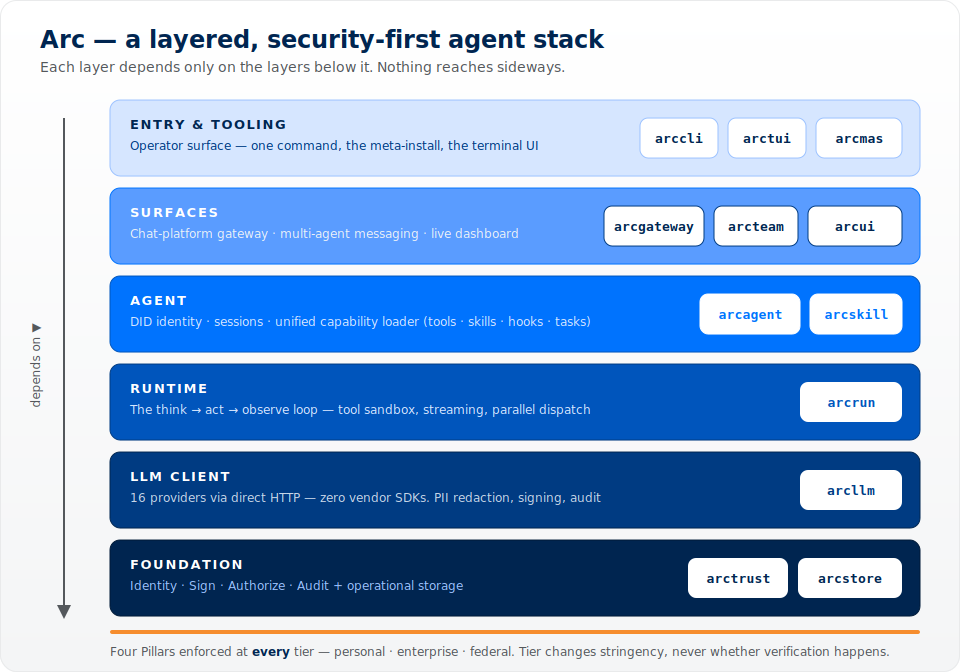
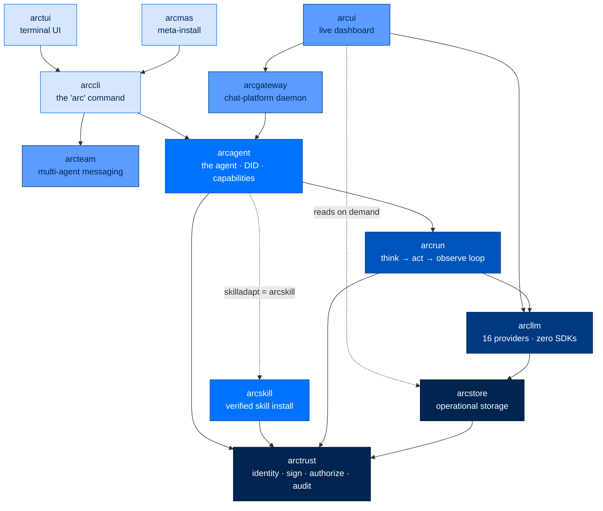

<div align="center">

```
╭───────────────────────────────────────────────────────────╮
│ arc                                                 ● ● ● │
├───────────────────────────────────────────────────────────┤
│                                                           │
│                  █████╗ ██████╗  ██████╗                  │
│                 ██╔══██╗██╔══██╗██╔════╝                  │
│                 ███████║██████╔╝██║                       │
│                 ██╔══██║██╔══██╗██║                       │
│                 ██║  ██║██║  ██║╚██████╗                  │
│                 ╚═╝  ╚═╝╚═╝  ╚═╝ ╚═════╝                  │
│                                                           │
│         the security-first autonomous agent stack         │
│            identity · sign · authorize · audit            │
│                                                           │
╰───────────────────────────────────────────────────────────╯
```

### **The Security-First Autonomous Agent Stack**
*For environments where trust is non-negotiable.*

[](https://opensource.org/licenses/Apache-2.0)
[](https://www.python.org/downloads/)
[](#-status)
[](#-status)
[](#-supported-llm-providers)
[](#-air-gapped-and-on-premises)
[](#-compliance-mapping)
[](#zero-provider-sdks)

**[Quick Start](#-quick-start)** ·
**[Architecture](#-architecture)** ·
**[Security](#%EF%B8%8F-security-architecture)** ·
**[Compliance](#-compliance-mapping)** ·
**[CLI Reference](docs/cli.md)**

</div>

---

## ✨ What is Arc?

Arc is a stack of small Python packages for building AI agents you can actually deploy in places that take trust seriously — banks, hospitals, classified networks, regulated labs, anywhere "show me the audit trail" is the start of a conversation.

You can use just the bottom layer (a clean LLM client), the middle layer (a tool-using agent loop), or the whole thing (a fleet of cryptographically-identified agents talking through a signed message bus). Pick how much you need. Each layer is independently installable.

> 🛡️ **Every LLM call attributable. Every tool call authorized. Every action audited. Every byte traceable.**

---

## 🎯 Why Arc Exists

Most agent frameworks optimize for "look how fast I can wire up a chatbot." Arc optimizes for *"show me, line by line, what this agent did, who told it to do it, and prove nothing was tampered with."*

That changes a lot of design decisions:

| Most frameworks | Arc |
|---|---|
| Pull in a vendor SDK per provider | Direct HTTP to **every** provider — readable, auditable, no transitive risk |
| Implicit tool access ("just call any function") | Deny-by-default with parameter-level policy on every call |
| Tokens and conversation state hidden inside SDK objects | Stateless model layer — you own and serialize state explicitly |
| Logs as an afterthought | Non-optional event emission + dual hash-chained audit trails |
| PII flows wherever the model wants it to | Bidirectional redaction at the trust boundary |
| One identity, shared by everything | Each agent gets its own Ed25519 keypair + DID |

If you need to *demonstrate* compliance — not just claim it — Arc gives you the receipts.

---

## ⚖️ How Arc Compares

A few self-hosted agent projects get mentioned in the same breath as Arc. They're good at what they do — but they're built for a different job. **NanoClaw, Hermes, and OpenClaw are personal assistants you wire into your chat apps.** Arc is an **accountable agent stack for environments that have to prove what happened.**

| | **Arc** | **NanoClaw** | **Hermes Agent** | **OpenClaw** |
|---|---|---|---|---|
| **Built for** | Accountable agent fleets in regulated / federal environments | Lightweight personal assistant, one container per chat group | Self-improving personal agent with persistent memory | Self-hosted personal assistant, 50+ chat integrations |
| **Language** | Python | TypeScript | Python | TypeScript |
| **Source LOC** ¹ | **~92K** (11-package modular stack) | ~39K | ~550K (incl. bundled skills) | ~1.2M + ~190K native (iOS / Android / macOS) |
| **License** | Apache 2.0 | MIT | MIT | MIT |
| **Shape** | Layered — install one layer or the whole stack | Fork-and-customize monolith | Monolith | Large monorepo |
| **LLM access** | Direct HTTP, **zero vendor SDKs** | Anthropic Agent SDK | Provider clients / OpenRouter | Provider SDKs |
| **Providers** | 16 (cloud + on-prem) | Anthropic (via SDK) | 200+ via routers | Multi (Anthropic / OpenAI / …) |
| **Cryptographic agent identity** | ✅ Ed25519 DID per agent | ❌ | ❌ | ❌ |
| **Authorization** | ✅ Deny-by-default 5-layer policy, parameter-level | Container mount isolation | App-level | Gateway = trust boundary (config-driven) |
| **Audit trail** | ✅ Dual, hash-chained (tamper-evident) | App logs | App logs | App logs |
| **PII redaction** | ✅ Bidirectional at the trust boundary | ❌ | ❌ | ❌ |
| **Supply-chain integrity** | ✅ Signed skills (Sigstore + Rekor), signed agent-authored capabilities (SPEC-033), AST scan, no SDKs | Container sandbox | — | `THIRD_PARTY_NOTICES`, hardening guide |
| **Code-exec sandbox** | Tier-routed: Firecracker microVM (federal) → Docker container (enterprise/personal default) → stripped local subprocess (personal, explicit opt-in) | Linux container | Docker | Docker + loopback-by-default |
| **Air-gapped / on-prem** | ✅ Ollama · vLLM · TGI, no API key | ❌ needs Anthropic API | Partial (local models) | Partial (needs model API) |
| **Compliance mapping** | ✅ NIST 800-53 · FedRAMP · CMMC · OWASP LLM/Agentic | ❌ | ❌ | ❌ |

**Where each one wins:** NanoClaw is the leanest way to get a sandboxed Claude into WhatsApp — it offloads the hard parts to Anthropic's SDK (which is also why its small line count is a little misleading; the complexity lives in a closed dependency). Hermes is the most autonomous — agent-curated memory and DSPy/GEPA self-evolution. OpenClaw has the widest integration surface — 50+ messaging platforms and native mobile apps. **Arc wins when "show me the audit trail" is the start of the conversation:** cryptographic identity, a real policy engine, tamper-evident logs, and line-by-line compliance mapping that the others simply don't carry.

> ¹ Source lines of the primary language, excluding tests, `node_modules`, vendored dependencies, generated lockfiles, and documentation sites. Measured June 2026 from each project's `main` branch; competitor counts will drift as those projects evolve.

---

## 🏗️ Architecture

Arc is a layered stack. Each box is an independently-installable Python package. **Each layer depends only on the layers below it — dependencies point straight down, never sideways.**

<div align="center">



</div>

The same stack as a dependency graph — every edge is a real `import`, and they all point down toward the `arctrust` / `arcstore` foundation:



| Layer | Package | What It Does |
|-------|---------|-------------|
| Entry | [**arccli**](packages/arccli/) | The unified `arc` command-line tool |
| Entry | [**arctui**](packages/arctui/) · [**arcmas**](packages/arcmas/) | Terminal UI · the `pip install arcmas` meta-package that pulls the whole stack |
| Surface | [**arcgateway**](packages/arcgateway/) | Long-running daemon — chat-platform adapters, session routing, operator-approved pairing |
| Surface | [**arcteam**](packages/arcteam/) | Multi-agent messaging — entity registry, channels, DMs, operator-key-signed audit trail |
| Surface | [**arcui**](packages/arcui/) | Multi-agent dashboard — reads on demand from the shared `arcstore` record, two-token auth (viewer/operator), layer/agent/team filtering, plus a per-agent Knowledge view (memories + entities, operator edit/delete), a workspace file editor with signature-stale honesty, live channel management, a Capabilities view rendering the loader's own trust verdicts, and a team-wide task kanban (Mission Control, SPEC-056) |
| Agent | [**arcagent**](packages/arcagent/) | The agent itself — requires a DID at construction, runs the unified capability loader (tools · skills · hooks · background tasks), sessions, module bus |
| Agent | [**arcskill**](packages/arcskill/) *(optional)* | Skill supercharger — verified install (Sigstore + Rekor), static scan, sandboxed dry-run, atomic activation, revocation list, plus golden-task-gated self-improvement (`arcskill.improver`). arcagent runs skills fine without it. |
| Runtime | [**arcrun**](packages/arcrun/) | The async loop that runs the agent — tool sandbox, streaming, parallel tool calls, hash-chained event log |
| LLM | [**arcllm**](packages/arcllm/) | Talk to 16 LLM providers via direct HTTP — no SDKs. PII/secret redaction, prompt-injection + output guardrails, full encrypted trace capture, load balancing, request signing, OpenTelemetry, audit |
| Foundation | [**arctrust**](packages/arctrust/) | The cryptographic leaf — Ed25519 keypairs, DID identity, audit emission, the deny-by-default policy pipeline |
| Foundation | [**arcstore**](packages/arcstore/) | Operational storage — the durable backing store layers read from and write to |
| — | 🧪 arcprompt · arcmodel | Strategy prompts · model routing (early scaffolding) |

---

## 🚀 Quick Start

### 1. Install

```bash
# the whole stack
pip install arcmas

# or just the layers you need
pip install arctrust      # identity + audit + policy only
pip install arcllm        # LLM client only
pip install arcrun        # arcllm + the agent loop
pip install arc-agent     # full agent (arcrun + arcllm + arctrust)
```

From source:

```bash
git clone https://github.com/joshuamschultz/Arc.git
cd Arc
uv sync --all-packages
```

### 2. First-Time Setup (60 seconds)

The wizard asks a few questions and writes a sensible config:

```bash
arc init
```

Pick a tier — this is the **only** dial that controls strictness:

| Tier | Telemetry | Audit | Retry | Fallback | OpenTelemetry | PII redaction + signing |
|---|---|---|---|---|---|---|
| `personal` | ✅ | off | off | off | off | off |
| `enterprise` | ✅ | ✅ | ✅ (3x) | ✅ | off | off |
| `federal` | ✅ | ✅ | ✅ (3x) | ✅ | ✅ (OTLP) | ✅ |

> Telemetry is on at every tier because it drives the always-on `arcstore`
> operational spool the dashboard's **ArcLLM / Observe** page reads — a personal
> deployment still sees its own LLM calls. OpenTelemetry export stays off below
> `federal`, so personal stays lightweight.

Or fully non-interactive:

```bash
arc init --tier enterprise --provider anthropic
```

### 3. Create Your First Agent

```bash
arc agent create my-agent --model anthropic/claude-sonnet-4-5-20250929
```

This scaffolds:

```
my-agent/
├── arcagent.toml          # config
├── identity.md            # the agent's identity card (immutable to the agent)
├── capabilities/          # per-agent capabilities — trusted, operator-curated
└── workspace/
    ├── .capabilities/     # agent-authored capabilities — UNTRUSTED, AST-validated
    └── sessions/          # JSONL transcripts of past conversations
```

It also generates a fresh Ed25519 keypair and writes the public DID into `arcagent.toml`. See [Capability Loading](#-capability-loading) below for how the four scan roots compose.

### 4. Validate It

```bash
arc agent build my-agent --check
```

Reads the config, checks the workspace, verifies the DID resolves to a keypair, confirms the model is reachable.

> ⚠️ Always pass `--check`. Bare `arc agent build` rewrites `arcagent.toml` (it's the interactive scaffold).

### 5. Talk To It

```bash
# Interactive chat:
arc agent chat my-agent

# One-shot task:
arc agent run my-agent "Read the CSVs in workspace/data/ and summarize the trends"
```

Inside the chat REPL: `/help`, `/tools`, `/cost`, `/skills`, `/sessions`, `/switch <id>`, `/identity`, `/quit`.

### 6. (Optional) Watch It Run — and Message It — in a Browser

The dashboard **is** the gateway (SPEC-023) — one process serves the UI, live
telemetry, and a per-agent web chat box, and it loads agents from
`--team-root` **on demand**. There's no separate daemon to start per agent:

```bash
# --team-root turns on the in-process web chat platform; agents load lazily
# the first time you open one, not up front.
arc ui start --team-root ./team --show-tokens
#    Prints a viewer token + operator token and the URL (default 127.0.0.1:8420).

# Open the printed http://127.0.0.1:8420/ URL with the viewer token
# (on a loopback bind the browser opens pre-authenticated) and message the agent.
```

There is no `--agent-token` and no agent-side `--ui` push flag — `arcui` reads everything
from `arcstore` and instantiates each agent itself, so a fresh clone with zero agents
running still shows a working chat box the moment you open one. Prefer the terminal?

```bash
arc ui tail --viewer-token <token> --layer llm
```

> For a full node — systemd unit, secrets, Telegram/Slack, verification —
> see [`docs/deploy/single-node.md`](docs/deploy/single-node.md) and
> `scripts/deploy-node.sh`. `scripts/arc-stack.sh` is a separate,
> non-canonical dev-convenience wrapper around the older per-agent
> `arc agent serve` pattern — see its header comment before reaching for it.

---

## 🧑‍🤝‍🧑 Stand Up a Fleet (Multi-Agent Team)

The single-agent flow above scales to a whole team in one self-contained,
isolated folder — "start up, config identities, add tools, and go." Same
embedded pattern as above, no separate daemon per agent — **one
`arc ui start --team-root` process serves the whole fleet, on demand.**

> For a full node — systemd, secrets, remote platforms (Telegram/Slack),
> multiple agents, a real team + channels — skip straight to
> [`scripts/deploy-node.sh`](scripts/deploy-node.sh) (bootstraps everything
> below in one idempotent run) and
> [`docs/deploy/team-building.md`](docs/deploy/team-building.md) (the
> validated team/channel/persona flow, with example department rosters).
> The steps here are the manual walkthrough.

**1. Lay out a deployment folder.** Keep everything (config, keys, agents) in one
directory so it's isolated from `~/.arc` and portable:

```
mfg-deploy/
├── config/            # ARC_CONFIG_DIR points here
│   ├── .env           # provider keys — auto-loaded (see below)
│   ├── arcagent.toml  # tier = "personal"
│   └── arcllm.toml
└── agents/
    ├── procurement/   # each is a normal `arc agent create` dir
    ├── picking/
    ├── demand-planning/
    └── inventory/
```

**2. Initialize + create each agent.** `arc agent create` scaffolds the dir,
identity card, DID/keypair, and auto-registers it so it appears in the dashboard:

```bash
export ARC_CONFIG_DIR="$PWD/config"
arc init --tier personal --provider anthropic

for a in procurement picking demand-planning inventory; do
  arc agent create "$a" --dir ./agents --model anthropic/claude-sonnet-5
done
```

**3. Configure keys + memory.** Drop provider keys in `config/.env` — Arc
auto-loads `${ARC_CONFIG_DIR}/.env` (plus cwd and `~`), so no manual `export`:

```bash
echo 'ANTHROPIC_API_KEY=sk-ant-...' > config/.env
# Optional: keep this fleet's telemetry in its own store (clean Observe view)
echo "ARCSTORE_DATA_DIR=$PWD/data-store" >> config/.env
```

Each agent ships `[modules.memory].config.brain = "arcmemory"` by default, so
durable semantic memory (episodic index + entity graph + a daily log) is on out
of the box — no extra wiring.

**4. Validate the fleet:**

```bash
for a in agents/*/; do arc agent build --check "$a"; done
```

**5. Spin up the dashboard over the whole fleet:**

```bash
arc ui start --team-root ./agents
```

`--team-root` discovers every `agents/*/arcagent.toml` (bare `<name>/` or legacy
`<name>_agent/`), auto-starts NATS JetStream, and turns on the in-process web
chat. Open the printed `#auth=<token>` URL and click any agent. You get, per
agent, out of the box:

- **Chat that persists** — reopen an agent or come back later and the
  conversation is still there (replayed from `workspace/sessions/<chat_id>.jsonl`).
- **Live LLM calls** in the **ArcLLM / Observe** tab (scoped to this fleet via
  `ARCSTORE_DATA_DIR`).
- **Memory** written under each `workspace/memory/`, browsable (and, with the
  operator token, editable) in the **Knowledge** tab.
- **Capabilities** — a per-agent view of every skill/tool across all four scan
  roots, with the loader's own trust verdict (loaded / denied / unsigned) —
  what actually loaded, not what's configured.
- **Tasks** — every agent's task list, plus a team-wide kanban. Agents create
  tasks for themselves, assign them to a teammate (single owner, atomic claim —
  no double-grab), claim from the shared backlog, and decompose into sub-tasks.
  The human edits an at-rest task or reprioritizes it from the board; steering
  an in-progress task is "message the owner," not an edit. Same operations are
  available from the terminal via `arc task` (see the cheat sheet below).

**6. (Optional) Team collaboration — agents in channels:**

Step 5 makes every agent reachable for *human*-initiated chat via the
dashboard, on demand. Autonomous *agent-to-agent* collaboration — agents
independently reacting to team-channel messages without a human opening a
chat — is a different concern and needs each member actively running:

```bash
arc team create mfg --channel ops --members "procurement,picking,demand-planning,inventory"
arc team up mfg          # boot members as supervised daemons on NATS
# watch them talk in the dashboard's "Messages" tab, or:  arc team read ops
```

Once the team exists, day-to-day channel work — adding a channel, adding or
removing a member — doesn't need the CLI: the dashboard's **Channels** tab
does the same thing live, gated to the operator token (viewer sees the
roster read-only).

> `scripts/arc-stack.sh` is a non-canonical, dev-convenience start/stop/status
> wrapper predating the embedded gateway (SPEC-023) — it runs every agent as
> its own `arc agent serve` daemon rather than the on-demand pattern above.
> See its header comment before reaching for it; prefer `arc ui start
> --team-root` (or `scripts/deploy-node.sh` for a full node) for anything
> serving real traffic.

---

## 🧱 What You Can Build

Arc is built for organizations where AI works *alongside* humans as accountable team members, not opaque chatbots.

🔬 **Research teams** — split a complex question into parallel workstreams, each agent investigates an angle, synthesize into a unified brief.

⚙️ **Operations teams** — one agent decomposes a mission into tasks, hands them to execution agents with the right tools, tracks progress to completion.

🚨 **Monitoring teams** — watch systems, correlate anomalies across sources, escalate to humans, execute approved remediation playbooks.

📚 **Knowledge teams** — ingest, classify, cross-reference documents — surface connections across thousands of pages humans would never spot.

Agents can self-improve through a plain-text policy file. Good behaviors get reinforced. Harmful patterns get suppressed. The policy is human-readable, auditable, and version-controlled.

---

## 🛡️ What You Always Control

Every capability an agent has is explicitly granted, logged, and revocable. Nothing happens implicitly.

| Control | What You Get |
|---|---|
| **Tool access** | Deny-by-default. Every tool must be on the allowlist. Each call is checked at the parameter level — not just "can it use this tool" but "with these arguments?" |
| **LLM provider** | Choose what models the agent can talk to. Run fully air-gapped with Ollama, vLLM, or HuggingFace TGI |
| **Data flow** | Bidirectional PII scanning — SSN, credit card, email, phone, IP redacted before crossing the trust boundary. Pluggable for CUI/FOUO/classification markings |
| **Identity** | Each agent has its own Ed25519 keypair + DID. No shared credentials. No privilege inheritance |
| **Code execution** | Subprocess sandbox: stripped env, process group isolation, two-phase timeout, fresh workspace destroyed afterward |
| **Extensions** | Three sandbox modes: `workspace`, `paths`, or `strict` (no subprocess, no network) |
| **Inter-agent comms** | Signed messages, replay protection, no plaintext between agents |
| **Observability** | Structured event emission on every action. Two parallel audit trails (OpenTelemetry + JSONL) so a single failure can't erase history |
| **Policy** | Behavioral rules enforced on every tool call. Agents cannot edit their own policy. Kill switches available |
| **Secrets** | Vault-backed, TTL-cached. Keys never on disk in plaintext. Env var override blocked for security paths |

---

## 🏛️ The Four Pillars (Universal — Every Tier, Every Deployment)

Every Arc agent operates under four guarantees, no matter how it's deployed:

1. **🪪 Identity** — Each agent has a unique Ed25519 cryptographic identity in the form `did:arc:{org}:{type}/{hash}`. The agent class refuses to start without one.
2. **✍️ Sign** — Every loaded artifact (skill, extension, backend, pairing) is verified before use. No "skip this for testing" backdoors.
3. **✅ Authorize** — Every tool call goes through a deny-by-default policy pipeline. First DENY wins. Exceptions fail closed.
4. **📜 Audit** — Every operation emits a structured audit event. One emission point. Multiple sinks (JSONL for compliance, hash-chained for tamper-evidence, WebSocket for live dashboards).

The deployment tier (Personal / Enterprise / Federal) only changes how *strict* the verification is — not whether it happens. Federal requires FIPS-validated crypto, signed allowlists, hard turn caps, and all 5 policy layers. Personal allows self-signed bundles and dynamic tool creation. **Every tier still verifies, authorizes, audits, and identifies.**

---

## 🌐 Supported LLM Providers

All 16 providers go through direct HTTP — never a vendor SDK.

| Cloud | On-Prem (air-gapped) |
|---|---|
| Anthropic · OpenAI · Azure OpenAI | Ollama (`localhost:11434`) |
| Google · Cohere · Mistral | vLLM (`localhost:8000`) |
| Groq · DeepSeek · Together · Fireworks | HuggingFace TGI (`localhost:8080`) |
| OpenRouter · NVIDIA · xAI · Moonshot · HuggingFace | |

`arc llm providers` lists every configured provider. `arc llm validate` tests each one's API key and connectivity.

---

## ⚙️ Configuration: `arcagent.toml`

Every agent is configured through a single TOML file. This is the entire surface area.

```toml
[agent]
name = "my-agent"
org = "acme"
type = "executor"
workspace = "./workspace"

[llm]
model = "anthropic/claude-sonnet-4-5-20250929"
max_tokens = 8192
temperature = 0.7

[identity]
did = "did:arc:acme:executor/abc123..."   # filled in by `arc agent create`
key_dir = "~/.arcagent/keys"

[vault]
backend = ""                              # vault URL, or empty to fall back to env vars

[tools.policy]
allow = ["read_file", "write_file", "execute_python"]
deny = []
timeout_seconds = 30

[telemetry]
enabled = true
service_name = "my-agent"
log_level = "INFO"
export_traces = false                     # flip on for OpenTelemetry export

[context]
max_tokens = 128000

[session]
retention_count = 50
retention_days = 30

[security]
tier = "personal"                         # "personal" | "enterprise" | "federal"

[security.validators]
auto_run_agent_code = false               # personal-only escape hatch; federal/enterprise require TOFU

[modules.memory]
enabled = true

[modules.policy]
enabled = true
```

**A few rules worth knowing:**
- 🛑 The agent will **refuse to start** without a valid DID under `[identity]`.
- 🛑 The tool allowlist is **deny-by-default**. If a tool isn't in `allow`, the agent can't call it.
- 🛑 These config paths **cannot be overridden by environment variables**: `vault.backend`, `tools.native`, `tools.process`, `identity.key_dir`. They must be set in this file. Prevents runtime injection.

---

## 🧩 Capability Loading

Tools, skills, hooks, and background tasks are all **capabilities** — picked up by a single loader (`SPEC-021`) from four scan roots, in order:

| # | Root | Trust | Source | Purpose |
|---|------|-------|--------|---------|
| 1 | `arcagent/builtins/capabilities/` | trusted | ships with the package | `bash`, `read`, `write`, `edit`, `find`, `grep`, `ls`, `reload` + the self-mod tools and skill folders |
| 2 | `~/.arc/capabilities/` | trusted | the human operator | global, opt-in capabilities shared across every agent |
| 3 | `<agent>/capabilities/` | trusted | the human operator | per-agent capabilities |
| 4 | `<agent>/workspace/.capabilities/` | **untrusted** | the agent itself, at runtime | passes through AST validator + (future) TOFU + OS sandbox before import |

Plus: any module under `arcagent/modules/<mod>/` with `[modules.<mod>].enabled = true` and a `capabilities.py` is added as an extra root (`module:<mod>`). Disabled modules are silently skipped.

### How overrides work

| Kind | Conflict policy |
|------|-----------------|
| `@tool`, `@capability` class, skill folder | **last-wins** — same name at a later root replaces the earlier one. The reload diff names it: `~1 replaced (web_search 1.0.0→1.1.0)`. |
| `@hook` | **fan-out** — every handler keeps firing, ordered by `priority` (lower = first). |
| `@background_task` | **drain-then-replace** — old task is cancelled and awaited before the replacement starts. |

So to override a built-in `web_search` tool with a stricter version, write a `web_search.py` at root 2 or 3 with the same `name=` in its `@tool(...)` decorator. To extend behavior without replacing it, register a `@hook` instead.

### What lives in a capability file

```python
# my-agent/capabilities/web_search.py
from arcagent.tools._decorator import tool, hook, background_task, capability

@tool(name="web_search", description="...", classification="read_only", version="1.0.0")
async def web_search(query: str) -> str:
    ...

@hook(name="log_tool_calls", event="tool:invoked", priority=200)
async def log_tool_calls(ctx) -> None:
    ...

@background_task(name="poll_inbox", interval=60.0)
async def poll_inbox() -> None:
    ...

@capability(name="browser", depends_on=())
class BrowserCapability:
    async def setup(self, ctx) -> None: ...
    async def teardown(self) -> None: ...
```

Skills are folders containing a `SKILL.md` with frontmatter (`name`, `version`, `description`, `triggers`, `required_tools`) plus optional `references/`, `scripts/`, and `templates/`. The frontmatter is injected into the system prompt; the body is read lazily via the built-in `read` tool when the model decides to use it.

### Reload

`/reload` (REPL) and `arc agent reload` re-walk all four roots and emit one diff line:

```
reload: +2 added (web_search, log_tool_calls), ~1 replaced (data-analysis 1.0.0→1.1.0), -1 removed (legacy_scraper), 0 errors
```

Failures append one indented line per error and emit `capability:registration_failed` on the bus + an audit event.

### Verified install (optional)

For supply-chain-secure third-party skills (Sigstore + Rekor + static scan + sandboxed dry-run + CRL check + atomic activation), enable the **arcskill hub**:

```toml
[skills.hub]
enabled = true
```

Verified skills land under `~/.arc/capabilities/` (root 2) — same precedence rules apply.

---

## 📟 CLI Cheat Sheet

```bash
# Setup
arc init                                                  # tier wizard
arc agent create my-agent --model <provider/model>        # scaffold
arc agent build my-agent --check                          # validate

# Run
arc agent chat my-agent                                   # interactive REPL
arc agent run my-agent "task description"                 # one-shot
arc agent serve my-agent                                  # long-running daemon

# Inspect
arc agent status my-agent                                 # DID, model, tool/skill/extension counts
arc agent config my-agent --json                          # full parsed config
arc agent tools my-agent                                  # what tools it can call
arc agent skills my-agent                                 # discovered skills
arc agent sessions my-agent                               # past conversation transcripts
arc agent reload my-agent                                 # re-walk all four capability scan roots

# LLM introspection
arc llm providers                                         # configured providers
arc llm provider anthropic                                # one provider's models + pricing
arc llm models --tools                                    # all models that support tool calling
arc llm validate                                          # test API key + connectivity per provider

# Multi-agent dashboard
arc ui start --show-tokens                                # start dashboard (prints tokens)
arc ui tail --viewer-token <t> --layer llm                # stream events as JSONL
arc ui tail --viewer-token <t> --agent did:arc:acme:.../  # filter by agent

# Skills + extensions
arc skill list --agent my-agent
arc ext list --agent my-agent

# Team messaging (multi-agent)
arc team init                                             # create team data dir + operator audit key
arc team register agent-1 --name "Analyst" --type agent
arc team entities

# Tasks (Mission Control, multi-agent)
arc task create "Draft the Q3 report" --actor @lead --priority high  # unowned -> team backlog
arc task list --scope mine --actor @analyst-1               # omit --scope for the team-wide view
arc task assign <task_id> @analyst-1 --actor @lead           # notifies + wakes the assignee
arc task talk <task_id> "any update?" --actor @lead          # steer an in-progress owner, not an edit

# Chat-platform gateway
arc gateway pair list                                     # show pending DM pairings
arc gateway pair approve ABCD1234                         # approve a pairing code
```

Full reference: [docs/cli.md](docs/cli.md).

---

## 🔌 Air-Gapped and On-Premises

Three providers run entirely on-prem with no internet, no API key:

| Provider | Default URL | Use Case |
|----------|------------|----------|
| **Ollama** | `localhost:11434` | Local open-weight models (Llama, Mistral, etc.) |
| **vLLM** | `localhost:8000` | High-throughput GPU serving |
| **HuggingFace TGI** | `localhost:8080` | Text generation inference server |

Combined with vault-backed secrets, HTTPS enforcement, and zero external SDK dependencies, Arc works in fully air-gapped environments without code changes.

---

## 🛡️ Security Architecture

If you're evaluating Arc for a regulated environment, this section earns the framework its keep.

### Zero Provider SDKs

Arc never imports a provider's official SDK. Every call to OpenAI, Anthropic, Google, Cohere, Mistral, Groq, etc. is a direct HTTP request via `httpx`. This eliminates an entire class of supply-chain risk: you can't be compromised by a transitive dependency in an SDK you didn't audit.

**arcllm runtime dependencies:** `pydantic`, `httpx`, `opentelemetry-api`. That's it.

### PII Redaction (Bidirectional)

The security module scans messages going **out** to the LLM and coming **back** from it. Detected patterns get replaced with `[PII:TYPE]` placeholders before they cross the trust boundary.

Out of the box: SSN, credit card, email, phone, IP. The detector is a Protocol — plug in custom patterns for CUI, FOUO, classification markings, internal project codenames, anything.

### Request Signing

Every LLM request can be cryptographically signed. Messages, tools, and model name are serialized to canonical JSON (`sort_keys=True`, compact separators), hashed, and signed through an arctrust `Signer` — asymmetric, not symmetric: Ed25519 by default, ECDSA-P256 on the FIPS/federal path. Symmetric (HMAC) signing has been removed; selecting it is a hard config error. The signature and algorithm are attached to the response metadata so downstream systems can verify what was actually asked. Key custody is `in_process` at personal (dev) and `vault_transit` (out-of-process — the seed never enters the agent process) by default at enterprise/federal; `FileNotaryTransit` is the local dev/CI reference notary, swapped for a real HSM or vault backend (Vault Transit, PKCS#11, cloud KMS) in production.

### Cryptographic Agent Identity

Each agent generates an Ed25519 keypair (libsodium via PyNaCl) and derives a DID:

```
did:arc:{org}:{agent_type}/{sha256_prefix}
```

Private keys live on disk with `0600` permissions. Loading a key file with group- or world-readable bits is a hard error. Identity changes are tracked through a dual audit trail — OpenTelemetry spans **and** an append-only JSONL file. If one is tampered with, the other catches it.

### Deny-by-Default Tool Sandbox (Layered Policy Pipeline)

Tools aren't callable unless explicitly allowed. Every tool call flows through arctrust's `PolicyPipeline` — a real, tier-scoped stack of layers (not stubs):

1. **Identity layer** — runs at every tier; enterprise/federal additionally deny agents outside the admitted-agent registry.
2. **Global layer** — tenant-wide denylist + check for forbidden capability combinations (the lethal-trifecta gate — see below).
3. **Classification layer** *(enterprise/federal)* — Bell-LaPadula no-read-up / no-write-down / no-exfil enforcement on labeled data; federal forces this to a non-relaxable, fail-closed floor.
4. **Provider layer** *(enterprise/federal)* — LLM provider budget (token/cost circuit-breaker) and rate-limit gates; default-on above personal tier.
5. **Agent layer** *(enterprise/federal)* — per-agent allowlist (keyed on the agent's DID).
6. **Team layer** *(federal only)* — team-scoped delegation rules.
7. **Sandbox layer** *(enterprise/federal)* — runtime constraints on dynamically-created tools.

Evaluation is **first-DENY-wins** with **fail-closed** exception handling. If a layer crashes, the call is denied. Sub-1 ms p95 latency thanks to an LRU cache keyed on `(agent_did, tool_name, classification, input_hash)`.

A **shadow mode** lets operators stage a new rule set without enforcing it (so you can see what *would* have been denied before flipping the switch). A **restricted mode** kicks in automatically when the policy bundle ages past its freshness window — important for air-gapped deployments where you can't always pull a fresh bundle on demand.

Per-tier composition: **Personal** runs Identity + Global (2 layers). **Enterprise** adds Classification, Provider, Agent, Sandbox (6). **Federal** adds Team on top (7, all layers). Classification, Provider, and Sandbox are real, wired implementations that are no-op-safe when unconfigured — not development stubs — and fail closed the moment a call actually carries the state they gate.

#### The Lethal-Trifecta Gate (SPEC-035)

Private-data-read + external-comms + untrusted-input must never co-occur in a session without human approval. arcagent tags every tool with capability legs (`private_data`, `external_comms`, `untrusted_input`) and accumulates the session-wide union; arctrust's `GlobalLayer` denies the call that would complete the forbidden set. **This is armed and enforced today, but it only fires on tools that are actually tagged** — currently file/memory reads, network egress, web/browser fetches and navigation, and subprocess output. Tools added by future network-facing features (e.g. the gateway/messaging surface, SPEC-045) get covered as they're tagged, not automatically.

#### Goal-Lock (SPEC-035)

An agent's `identity.md`, its policy configuration, and `context.md` are immutable to the agent itself — enforced at the filesystem level (inode identity checks catch swap-and-replace tricks, not just content diffs). At enterprise/federal tiers, shell execution (`bash`) is additionally confined to the workspace sandbox.

### Dynamic Tool Safety (Four Defense Layers)

The four defenses gate the **untrusted scan root only** — `<workspace>/.capabilities/`, where the agent itself can write Python. Builtins, `~/.arc/capabilities/`, and `<agent>/capabilities/` are operator-curated and skip the AST gate.

1. **Source encoding check** — reject non-UTF-8 coding declarations. Codec attacks have to lose **before** the AST parser sees the source.
2. **AST validator** — rejects 9 categories of bypass: privileged imports (`os`, `ctypes`, `subprocess`, `pickle`, `sys`, ...), frame traversal (`gi_frame`, `f_back`, `__subclasses__`), dynamic execution (`eval`, `exec`, `compile`, `__import__`), `sys.modules` subscription, `__builtins__` assignment, `__init_subclass__` definitions, starred `__builtins__` unpacking. Cites real CVEs (2023-37271, 2025-68668, 2025-22153).
3. **Restricted builtins** — execute with a scrubbed `__builtins__` dict (36 safe names). `__import__`, `eval`, `exec`, `compile`, `open` are deliberately **not** present.
4. **Egress proxy** — network only via `ToolContext.http`, which enforces a per-tool origin allowlist (scheme + host + port). Deny-by-default. Every request audit-logged.

Tier gates sit on top: **Federal** refuses agent-authored capabilities entirely. **Enterprise** allows them only after a human records approval via `arc trust approve` (persisted under `[security.validators.approved]`). **Personal** allows them with `[security.validators] auto_run_agent_code = true`.

### Sandboxed Code Execution (SPEC-036)

The built-in `execute_python` tool is **tier-routed** — the deployment tier picks the isolation floor, and arcrun's `resolve_execution_backend()` maps it to a concrete backend. This is a real, enforced sandbox, not a subprocess-only story:

| Tier | Backend | Isolation |
|---|---|---|
| `federal` | Firecracker microVM (`VmBackend`), jailer + seccomp-L2 | Own guest kernel behind a KVM boundary. Refuses to run (never downgrades) if `/dev/kvm` isn't available |
| `enterprise` | Docker container (`DockerBackend`) | Container boundary — cannot be relaxed below this floor |
| `personal` (default) | Docker container (`DockerBackend`) | Container boundary |
| `personal` (`relax_isolation` opted down) | Local stripped subprocess (`LocalBackend`) | No container/VM boundary — full host access on the operator's own machine, explicit opt-in only |

Every backend selection, and every tier-permitted downgrade, emits an audit event before the first line of agent code runs. `LocalBackend` — used at `isolation="none"` and as the container backend's underlying process model — still hardens the process itself:

- **Minimal environment** — only `PATH=/usr/bin:/bin`, `HOME=/tmp`, `LANG=en_US.UTF-8`. The host environment is never inherited.
- **Process group isolation** — `start_new_session=True`, two-phase timeout (SIGTERM, 5-second grace, then SIGKILL).
- **Fresh workspace** — each execution gets a temp directory, destroyed afterward.
- **Output truncation** — stdout/stderr capped at 64 KB so a runaway loop can't fill your disk through the audit log.

### Workspace Path Validation

Every file-based tool routes through `resolve_workspace_path()`:

- Null byte injection guard.
- Symlink traversal prevention (walks each path component instead of trusting the final result).
- Workspace boundary enforcement via `Path.relative_to()`.

### Vault Integration

API keys and signing secrets resolve from an external vault with TTL-cached lookups. The vault interface is a Protocol — any backend that implements `get_secret(path) -> str` works (HashiCorp Vault, AWS Secrets Manager, Azure Key Vault, anything you write yourself). Environment variable fallback is automatic when the vault is unreachable.

### HTTPS Enforcement

Provider base URLs are validated at config load. HTTP is rejected for all remote hosts. HTTP is permitted only for `localhost`, `127.0.0.1`, `[::1]` (so local model servers like Ollama and vLLM still work).

### Log Injection Prevention

All structured log output sanitizes control characters (`\n`, `\r`, `\t`). Error bodies in exceptions are truncated to 500 characters. Audit logs emit metadata only (provider, model, token counts) by default — raw message content requires explicit DEBUG-level opt-in.

### Self-Improving Policy Engine

Implements the ACE framework (arXiv:2510.04618). A reflector model critiques agent behavior every N turns. Good behaviors score up, harmful ones score down. Bullets below score 2 are auto-removed. The policy file is atomically written via tmp+rename, capped at 200 rules, sorted by effectiveness. Every change is audited.

### Module Bus with Priority and Veto

Inside arcagent, events flow through a module bus with priority ordering: `10=policy`, `50=security`, `100=default`, `200=logging`. Same-priority handlers run concurrently. Cross-priority groups run sequentially. Any handler can veto an action (e.g., deny a tool call), but **all handlers still execute** so the audit record stays complete.

### Progressive Context Management

| Context Window | Action |
|---|---|
| < 70% | No action |
| 70–95% | Observation masking — old tool outputs replaced with `[output pruned]` placeholders |
| > 95% | Emergency truncation |

Recent messages are always protected within a 40% window so the model never loses immediate context.

### Cooperative Cancellation and Mid-Execution Steering

Running tasks support three intervention points:

- **Steer** — inject a message mid-turn, skipping remaining tool calls.
- **Follow-up** — inject a message at end-of-turn, preventing the loop from exiting.
- **Cancel** — cooperative cancellation via `asyncio.Event`.

---

## 📋 Compliance Mapping

This isn't a marketing checklist. Every line below corresponds to actual code in the framework.

### NIST SP 800-53

| Control | Family | Arc Implementation |
|---------|--------|-------------------|
| **AC-3** Access Enforcement | Access Control | Deny-by-default sandbox; per-agent tool allowlists keyed on DID |
| **AC-4** Information Flow Enforcement | Access Control | PII redaction on input and output; isolated context transforms; Bell-LaPadula classification layer (no-read-up / no-write-down / no-exfil) on labeled calls at enterprise/federal |
| **AC-6** Least Privilege | Access Control | Explicit tool allowlists; extension sandbox modes; no privilege inheritance |
| **AU-2** Event Logging | Audit | Non-optional event emission on every action |
| **AU-3** Content of Audit Records | Audit | Events carry timestamp, run_id, actor DID, tool name, arguments, duration, outcome |
| **AU-4** Audit Storage Capacity | Audit | Output truncation (64 KB), structured JSONL rotation |
| **AU-5** Response to Audit Failures | Audit | Sink failures swallowed by `emit()` so a broken sink can't crash an agent |
| **AU-8** Time Stamps | Audit | `time.time()` on every event; UTC ISO in session records |
| **AU-9** Protection of Audit Information | Audit | Dual audit trail (OpenTelemetry spans + independent JSONL); operator-signed, hash-chained `WormSink` for tamper-evidence |
| **AU-10** Non-Repudiation | Audit | WORM chain is signed with the **operator's** key, never the agent's own DID — an agent cannot forge or re-sign its own audit trail (SPEC-053); federal adds an external witness anchor over the chain head |
| **AU-12** Audit Generation | Audit | Events emitted inline, cannot be deferred or skipped |
| **CM-5** Access Restrictions for Change | Configuration Management | Federal tier refuses dynamic tool/extension creation |
| **CM-7** Least Functionality | Configuration Management | Tools are opt-in; minimal subprocess environment |
| **CM-8** System Component Inventory | Configuration Management | Skill lock file records every installed skill with hash, Rekor UUID, SLSA level |
| **IA-3** Device Identification | Identification & Authentication | Ed25519 agent identity with DID |
| **IA-5** Authenticator Management | Identification & Authentication | Vault-backed secrets, TTL caching, no plaintext keys on disk |
| **SC-8** Transmission Confidentiality | System & Comms Protection | HTTPS enforcement; mTLS supported on internal channels |
| **SC-12** Cryptographic Key Establishment | System & Comms Protection | Ed25519 via libsodium; HKDF-SHA256 for child identity derivation |
| **SC-13** Cryptographic Protection | System & Comms Protection | Ed25519 (default) / ECDSA-P256 (FIPS/federal) asymmetric signing, hash-chained audit |
| **SC-28** Protection of Information at Rest | System & Comms Protection | Ephemeral run state; `0600` key file permissions enforced |
| **SI-4** System Monitoring | System & Information Integrity | Full event bus, token/cost tracking, OpenTelemetry export |
| **SI-7** Software, Firmware, Information Integrity | System & Information Integrity | Sigstore + Rekor signature verification on skills; CRL lifecycle |
| **SI-7(15)** Code Authentication | System & Information Integrity | Federal tier requires signed allowlists; refuses dynamic code |
| **SI-10** Information Input Validation | System & Information Integrity | JSON Schema on every tool call; null byte and symlink traversal guards |
| **SI-11** Error Handling | System & Information Integrity | Errors returned as structured results; never leaked to caller; bodies truncated to 500 chars |

### OWASP Top 10 for LLM Applications (2025)

| Code | Threat | Arc Mitigation |
|------|--------|----------------|
| **LLM01** | Prompt Injection | Input validation on every tool call; system prompt isolation; instruction hierarchy enforcement; PII redaction strips many injection vectors before the model sees them |
| **LLM02** | Sensitive Information Disclosure | Bidirectional PII detection (SSN, credit card, email, phone, IP); pluggable for CUI/FOUO; audit-safe logging that emits metadata only by default |
| **LLM03** | Supply Chain | Zero provider SDKs; signed skills (Sigstore + Rekor); CRL revocation checks; SBOM-friendly dependency tree |
| **LLM04** | Data and Model Poisoning | Request signing with canonical JSON; checksums on installed skills; isolation between agent workspaces |
| **LLM05** | Improper Output Handling | Sandboxed `execute_python`; never run raw LLM output; output truncation; path validation routes everything through `resolve_workspace_path()` |
| **LLM06** | Excessive Agency | Deny-by-default sandbox; per-agent allowlists; parameter-level policy validation; human-in-the-loop pairing approval for chat-platform agents |
| **LLM07** | System Prompt Leakage | No secrets in prompts; vault-backed credentials; security-sensitive config paths blocked from env var override |
| **LLM08** | Vector and Embedding Weaknesses | Skills carry frontmatter and verified signatures; per-agent skill workspaces prevent cross-tenant leakage |
| **LLM09** | Misinformation | Audit trail makes it possible to trace any agent claim back to the LLM call that produced it; metadata-only logging captures provenance |
| **LLM10** | Unbounded Consumption | Token/cost circuit-breaker, default-on above personal tier; per-call USD cost calculation; rate limiting; two-phase timeouts on code execution |

### OWASP Top 10 for Agentic Applications (2026)

| Code | Threat | Arc Mitigation |
|------|--------|----------------|
| **ASI01** | Agent Goal Hijack | Goal-lock (SPEC-035): `identity.md`, policy config, and `context.md` are read-only to the agent, enforced via inode identity checks (not just content diffs); policy engine enforces behavioral boundaries; kill switches via DID revocation |
| **ASI02** | Tool Misuse & Exploitation | Tool-level allowlists; parameter validation on every call; 5-layer policy pipeline; full audit on every tool invocation |
| **ASI03** | Identity & Privilege Abuse | Per-agent DID; HKDF-derived child identities for spawned subagents; no shared credentials; no privilege inheritance without explicit grant |
| **ASI04** | Agentic Supply Chain | Sigstore + Rekor verified skill installs; static scan (regex + AST + semgrep + bandit); sandboxed dry-run before activation; CRL lifecycle |
| **ASI05** | Unexpected Code Execution (RCE) | Sandboxed subprocess; restricted builtins (no `eval`/`exec`/`compile`/`__import__`/`open`); AST validator rejects 9 bypass categories; egress proxy |
| **ASI06** | Memory & Context Poisoning | Workspace boundary enforcement; symlink traversal guards; null byte injection guards; observation masking with protected recent-message window |
| **ASI07** | Insecure Inter-Agent Communication | Ed25519-signed messages; operator-signed (not agent-DID-signed) asymmetric audit chain so no agent can forge its own trail; replay protection via nonce + timestamp; mTLS on internal channels |
| **ASI08** | Cascading Failures | TaskGroup isolation in the gateway (one adapter crash doesn't kill siblings); circuit breakers; shared-nothing per agent |
| **ASI09** | Human-Agent Trust Exploitation | Agents never impersonate humans; dashboard surfaces every action with attribution; pairing requires operator approval |
| **ASI10** | Rogue Agents | Behavioral monitoring via telemetry; policy violations trigger high-priority audit events; agent revocation via identity service; anomaly detection on action patterns |

### FedRAMP, CMMC

The audit trail (AU family), continuous monitoring (SI-4), and boundary enforcement (SC family) implementations satisfy security control requirements for **FedRAMP Moderate** baseline assessments and **CMMC Level 2 / Level 3** maturity levels.

---

## 👀 Observability — Three Levels

All three can run simultaneously.

| Level | What | Cost |
|---|---|---|
| **1 — Event Bus** | Every tool call, LLM invocation, turn boundary emits a structured event with timestamp, run_id, metrics. Available in every `LoopResult`. | Always on, zero overhead |
| **2 — Telemetry Module** | Wall-clock timing, per-call USD cost calculation from provider pricing metadata, structured logging | Opt-in |
| **3 — OpenTelemetry** | Full distributed tracing with GenAI semantic conventions. OTLP gRPC + HTTP exporters. Configurable sampling. Batch span processing. mTLS support | Opt-in |

---

## 🧪 Status

| Package | Tests | Coverage |
|---|---|---|
| arctrust | 346 | 99% |
| arcllm | 1,209 | 99% |
| arcrun | 531 | high (spawn 92%) |
| arcagent | 2,301+ | core ≥ 90% |
| arcgateway | 566 | 94% |
| arcskill | 642 | 86% |
| arcteam | 364 | — |
| arcui | 386 | — |
| arccli | 333 | — |

`uv run --no-sync pytest` runs the full suite. Per-package: `uv run --no-sync pytest packages/<pkg>/tests`.

---

## 🙏 Acknowledgments

Arc was inspired by [pi-mono](https://github.com/badlogic/pi-mono) by Mario Zechner — a clean TypeScript AI agent toolkit with a unified LLM API and minimal design philosophy. We studied its architecture, learned from its decisions, and built something purpose-fit for Python, federal environments, and autonomous agent fleets. Credit where it's due.

---

## 📄 License

[Apache License 2.0](LICENSE).

Copyright © 2025-2026 BlackArc Systems.
