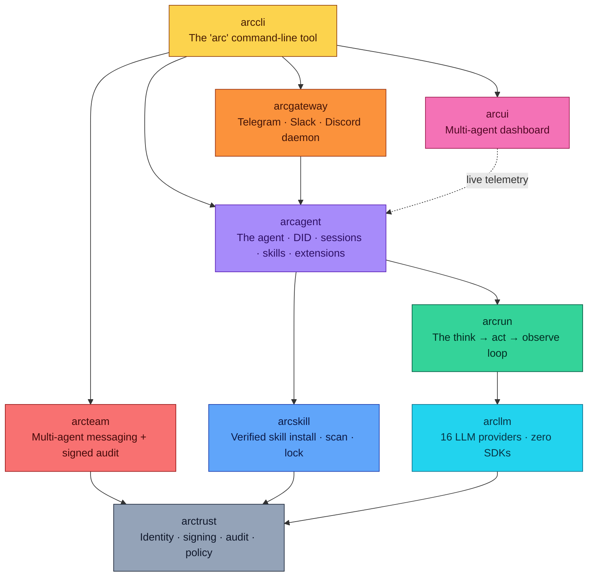

<div align="center">

```
       █████╗ ██████╗  ██████╗
      ██╔══██╗██╔══██╗██╔════╝
      ███████║██████╔╝██║
      ██╔══██║██╔══██╗██║
      ██║  ██║██║  ██║╚██████╗
      ╚═╝  ╚═╝╚═╝  ╚═╝ ╚═════╝
```

### **The Security-First Autonomous Agent Framework**
*For environments where trust is non-negotiable.*

[](https://opensource.org/licenses/Apache-2.0)
[](https://www.python.org/downloads/)
[](#status)
[](#status)
[](#supported-llm-providers)
[](#air-gapped-and-on-premises)
[](#nist-sp-800-53)
[](#zero-provider-sdks)

**[Quick Start](#-quick-start)** ·
**[Architecture](#-architecture)** ·
**[Security](#%EF%B8%8F-security-architecture)** ·
**[Compliance](#-compliance-mapping)** ·
**[CLI Reference](docs/cli.md)**

</div>

---

## ✨ What is Arc?

Arc is a stack of small Python packages for building AI agents you can actually deploy in places that take trust seriously — banks, hospitals, classified networks, regulated labs, anywhere "show me the audit trail" is the start of a conversation.

You can use just the bottom layer (a clean LLM client), the middle layer (a tool-using agent loop), or the whole thing (a fleet of cryptographically-identified agents talking through a signed message bus). Pick how much you need. Each layer is independently installable.

> 🛡️ **Every LLM call attributable. Every tool call authorized. Every action audited. Every byte traceable.**

---

## 🎯 Why Arc Exists

Most agent frameworks optimize for "look how fast I can wire up a chatbot." Arc optimizes for *"show me, line by line, what this agent did, who told it to do it, and prove nothing was tampered with."*

That changes a lot of design decisions:

| Most frameworks | Arc |
|---|---|
| Pull in a vendor SDK per provider | Direct HTTP to **every** provider — readable, auditable, no transitive risk |
| Implicit tool access ("just call any function") | Deny-by-default with parameter-level policy on every call |
| Tokens and conversation state hidden inside SDK objects | Stateless model layer — you own and serialize state explicitly |
| Logs as an afterthought | Non-optional event emission + dual hash-chained audit trails |
| PII flows wherever the model wants it to | Bidirectional redaction at the trust boundary |
| One identity, shared by everything | Each agent gets its own Ed25519 keypair + DID |

If you need to *demonstrate* compliance — not just claim it — Arc gives you the receipts.

---

## 🏗️ Architecture

Arc is a layered stack. Each box is an independently-installable Python package. Each layer only depends on the layers below it. Nothing reaches sideways.



| Package | What It Does |
|---------|-------------|
| 🟫 [**arctrust**](packages/arctrust/) | The cryptographic foundation — Ed25519 keypairs, DID identity, audit emission, the deny-by-default policy pipeline |
| 🟦 [**arcllm**](packages/arcllm/) | Talk to 16 LLM providers via direct HTTP — no SDKs. PII redaction, request signing, OpenTelemetry, audit |
| 🟩 [**arcrun**](packages/arcrun/) | The async loop that runs the agent — tool sandbox, streaming, parallel tool calls, hash-chained event log |
| 🟪 [**arcagent**](packages/arcagent/) | The agent itself — requires a DID at construction, manages skills, extensions, sessions, module bus |
| 🟦 [**arcskill**](packages/arcskill/) | Skill hub — verified install (Sigstore + Rekor), static scan, sandboxed dry-run, atomic activation, revocation list |
| 🟧 [**arcgateway**](packages/arcgateway/) | Long-running daemon — chat-platform adapters, session routing, operator-approved pairing |
| 🟥 [**arcteam**](packages/arcteam/) | Multi-agent messaging — entity registry, channels, DMs, HMAC-signed audit trail |
| 🟪 [**arcui**](packages/arcui/) | Multi-agent dashboard — live WebSocket telemetry, three-token auth, layer/agent/team filtering |
| 🟨 [**arccli**](packages/arccli/) | The unified `arc` command-line tool |
| 🎁 [**arcmas**](packages/arcmas/) | Meta-package — `pip install arcmas` installs everything |
| 🧪 arcprompt · arcmodel · arctui | Strategy prompts · model routing · terminal UI (early scaffolding) |

---

## 🚀 Quick Start

### 1. Install

```bash
# the whole stack
pip install arcmas

# or just the layers you need
pip install arctrust      # identity + audit + policy only
pip install arcllm        # LLM client only
pip install arcrun        # arcllm + the agent loop
pip install arc-agent     # full agent (arcrun + arcllm + arctrust)
```

From source:

```bash
git clone https://github.com/joshuamschultz/Arc.git
cd Arc
uv sync --all-packages
```

### 2. First-Time Setup (60 seconds)

The wizard asks a few questions and writes a sensible config:

```bash
arc init
```

Pick a tier — this is the **only** dial that controls strictness:

| Tier | Telemetry | Audit | Retry | Fallback | OpenTelemetry | PII redaction + signing |
|---|---|---|---|---|---|---|
| `open` | off | off | off | off | off | off |
| `enterprise` | ✅ | ✅ | ✅ (3x) | ✅ | off | off |
| `federal` | ✅ | ✅ | ✅ (3x) | ✅ | ✅ (OTLP) | ✅ |

Or fully non-interactive:

```bash
arc init --tier enterprise --provider anthropic
```

### 3. Create Your First Agent

```bash
arc agent create my-agent --model anthropic/claude-sonnet-4-5-20250929
```

This scaffolds:

```
my-agent/
├── arcagent.toml          # config
├── identity.md            # the agent's identity card (immutable to the agent)
└── workspace/
    ├── extensions/        # Python extensions that register tools
    ├── skills/            # markdown skills with YAML frontmatter
    └── sessions/          # JSONL transcripts of past conversations
```

It also generates a fresh Ed25519 keypair and writes the public DID into `arcagent.toml`.

### 4. Validate It

```bash
arc agent build my-agent --check
```

Reads the config, checks the workspace, verifies the DID resolves to a keypair, confirms the model is reachable.

> ⚠️ Always pass `--check`. Bare `arc agent build` rewrites `arcagent.toml` (it's the interactive scaffold).

### 5. Talk To It

```bash
# Interactive chat:
arc agent chat my-agent

# One-shot task:
arc agent run my-agent "Read the CSVs in workspace/data/ and summarize the trends"
```

Inside the chat REPL: `/help`, `/tools`, `/cost`, `/skills`, `/sessions`, `/switch <id>`, `/identity`, `/quit`.

### 6. (Optional) Watch It Run in a Browser

```bash
# Terminal 1
arc ui start --show-tokens          # prints viewer / operator / agent tokens

# Terminal 2
arc agent serve my-agent --ui       # runs the agent as a daemon, streams events
```

Open http://127.0.0.1:8420 with the viewer token. You'll see live LLM calls, tool invocations, costs, and audit events.

Stream to terminal instead:

```bash
arc ui tail --viewer-token <token> --layer llm
```

---

## 🧱 What You Can Build

Arc is built for organizations where AI works *alongside* humans as accountable team members, not opaque chatbots.

🔬 **Research teams** — split a complex question into parallel workstreams, each agent investigates an angle, synthesize into a unified brief.

⚙️ **Operations teams** — one agent decomposes a mission into tasks, hands them to execution agents with the right tools, tracks progress to completion.

🚨 **Monitoring teams** — watch systems, correlate anomalies across sources, escalate to humans, execute approved remediation playbooks.

📚 **Knowledge teams** — ingest, classify, cross-reference documents — surface connections across thousands of pages humans would never spot.

Agents can self-improve through a plain-text policy file. Good behaviors get reinforced. Harmful patterns get suppressed. The policy is human-readable, auditable, and version-controlled.

---

## 🛡️ What You Always Control

Every capability an agent has is explicitly granted, logged, and revocable. Nothing happens implicitly.

| Control | What You Get |
|---|---|
| **Tool access** | Deny-by-default. Every tool must be on the allowlist. Each call is checked at the parameter level — not just "can it use this tool" but "with these arguments?" |
| **LLM provider** | Choose what models the agent can talk to. Run fully air-gapped with Ollama, vLLM, or HuggingFace TGI |
| **Data flow** | Bidirectional PII scanning — SSN, credit card, email, phone, IP redacted before crossing the trust boundary. Pluggable for CUI/FOUO/classification markings |
| **Identity** | Each agent has its own Ed25519 keypair + DID. No shared credentials. No privilege inheritance |
| **Code execution** | Subprocess sandbox: stripped env, process group isolation, two-phase timeout, fresh workspace destroyed afterward |
| **Extensions** | Three sandbox modes: `workspace`, `paths`, or `strict` (no subprocess, no network) |
| **Inter-agent comms** | Signed messages, replay protection, no plaintext between agents |
| **Observability** | Structured event emission on every action. Two parallel audit trails (OpenTelemetry + JSONL) so a single failure can't erase history |
| **Policy** | Behavioral rules enforced on every tool call. Agents cannot edit their own policy. Kill switches available |
| **Secrets** | Vault-backed, TTL-cached. Keys never on disk in plaintext. Env var override blocked for security paths |

---

## 🏛️ The Four Pillars (Universal — Every Tier, Every Deployment)

Every Arc agent operates under four guarantees, no matter how it's deployed:

1. **🪪 Identity** — Each agent has a unique Ed25519 cryptographic identity in the form `did:arc:{org}:{type}/{hash}`. The agent class refuses to start without one.
2. **✍️ Sign** — Every loaded artifact (skill, extension, backend, pairing) is verified before use. No "skip this for testing" backdoors.
3. **✅ Authorize** — Every tool call goes through a deny-by-default policy pipeline. First DENY wins. Exceptions fail closed.
4. **📜 Audit** — Every operation emits a structured audit event. One emission point. Multiple sinks (JSONL for compliance, hash-chained for tamper-evidence, WebSocket for live dashboards).

The deployment tier (Personal / Enterprise / Federal) only changes how *strict* the verification is — not whether it happens. Federal requires FIPS-validated crypto, signed allowlists, hard turn caps, and all 5 policy layers. Personal allows self-signed bundles and dynamic tool creation. **Every tier still verifies, authorizes, audits, and identifies.**

---

## 🌐 Supported LLM Providers

All 16 providers go through direct HTTP — never a vendor SDK.

| Cloud | On-Prem (air-gapped) |
|---|---|
| Anthropic · OpenAI · Azure OpenAI | Ollama (`localhost:11434`) |
| Google · Cohere · Mistral | vLLM (`localhost:8000`) |
| Groq · DeepSeek · Together · Fireworks | HuggingFace TGI (`localhost:8080`) |
| OpenRouter · NVIDIA · xAI · Moonshot · HuggingFace | |

`arc llm providers` lists every configured provider. `arc llm validate` tests each one's API key and connectivity.

---

## ⚙️ Configuration: `arcagent.toml`

Every agent is configured through a single TOML file. This is the entire surface area.

```toml
[agent]
name = "my-agent"
org = "acme"
type = "executor"
workspace = "./workspace"

[llm]
model = "anthropic/claude-sonnet-4-5-20250929"
max_tokens = 8192
temperature = 0.7

[identity]
did = "did:arc:acme:executor/abc123..."   # filled in by `arc agent create`
key_dir = "~/.arcagent/keys"

[vault]
backend = ""                              # vault URL, or empty to fall back to env vars

[tools.policy]
allow = ["read_file", "write_file", "execute_python"]
deny = []
timeout_seconds = 30

[telemetry]
enabled = true
service_name = "my-agent"
log_level = "INFO"
export_traces = false                     # flip on for OpenTelemetry export

[context]
max_tokens = 128000

[session]
retention_count = 50
retention_days = 30

[extensions]
global_dir = "~/.arcagent/extensions"

[modules.memory]
enabled = true

[modules.policy]
enabled = true
```

**A few rules worth knowing:**
- 🛑 The agent will **refuse to start** without a valid DID under `[identity]`.
- 🛑 The tool allowlist is **deny-by-default**. If a tool isn't in `allow`, the agent can't call it.
- 🛑 These config paths **cannot be overridden by environment variables**: `vault.backend`, `tools.native`, `tools.process`, `identity.key_dir`. They must be set in this file. Prevents runtime injection.

---

## 🧩 Adding Extensions and Skills

### Extensions (Python tools)

An extension is a Python file exporting an `extension()` factory. Drop it in `workspace/extensions/` (per-agent) or `~/.arcagent/extensions/` (shared).

```bash
arc ext create web-search --dir my-agent/workspace/extensions
arc ext validate my-agent/workspace/extensions/web-search.py
arc ext install ./my_extension.py        # copies to ~/.arcagent/extensions/
```

Extensions run in a sandbox. Pick the mode in `arcagent.toml`:

| Mode | Filesystem | Subprocess | Network |
|------|-----------|------------|---------|
| `workspace` | unrestricted | ✅ | ✅ |
| `paths` | workspace + explicitly allowed paths | ✅ | ✅ |
| `strict` | workspace only | 🚫 | 🚫 |

`strict` mode patches `subprocess.run`, `os.system`, and `urllib.request.urlopen` while loading, then restores them in a `finally` block.

### Skills (markdown instructions)

A skill is a markdown file with YAML frontmatter describing how to do a specific task. The agent discovers skills automatically and adds them to context.

```bash
arc skill create data-analysis --dir my-agent/workspace/skills
arc skill search "data analysis" --agent my-agent
```

Verified skill install through the **arcskill hub** adds Sigstore + Rekor signature verification, a Certificate Revocation List check, static analysis (regex + AST + optional semgrep + bandit), and a sandboxed dry-run before activation:

```toml
[skills.hub]
enabled = true
```

---

## 📟 CLI Cheat Sheet

```bash
# Setup
arc init                                                  # tier wizard
arc agent create my-agent --model <provider/model>        # scaffold
arc agent build my-agent --check                          # validate

# Run
arc agent chat my-agent                                   # interactive REPL
arc agent run my-agent "task description"                 # one-shot
arc agent serve my-agent                                  # long-running daemon
arc agent serve my-agent --ui                             # daemon + push events to dashboard

# Inspect
arc agent status my-agent                                 # DID, model, tool/skill/extension counts
arc agent config my-agent --json                          # full parsed config
arc agent tools my-agent                                  # what tools it can call
arc agent skills my-agent                                 # discovered skills
arc agent sessions my-agent                               # past conversation transcripts
arc agent reload my-agent                                 # hot-reload skills + extensions

# LLM introspection
arc llm providers                                         # configured providers
arc llm provider anthropic                                # one provider's models + pricing
arc llm models --tools                                    # all models that support tool calling
arc llm validate                                          # test API key + connectivity per provider

# Multi-agent dashboard
arc ui start --show-tokens                                # start dashboard (prints tokens)
arc ui tail --viewer-token <t> --layer llm                # stream events as JSONL
arc ui tail --viewer-token <t> --agent did:arc:acme:.../  # filter by agent

# Skills + extensions
arc skill list --agent my-agent
arc ext list --agent my-agent

# Team messaging (multi-agent)
arc team init                                             # create team data dir + HMAC key
arc team register agent-1 --name "Analyst" --type agent
arc team entities

# Chat-platform gateway
arc gateway pair list                                     # show pending DM pairings
arc gateway pair approve ABCD1234                         # approve a pairing code
```

Full reference: [docs/cli.md](docs/cli.md).

---

## 🔌 Air-Gapped and On-Premises

Three providers run entirely on-prem with no internet, no API key:

| Provider | Default URL | Use Case |
|----------|------------|----------|
| **Ollama** | `localhost:11434` | Local open-weight models (Llama, Mistral, etc.) |
| **vLLM** | `localhost:8000` | High-throughput GPU serving |
| **HuggingFace TGI** | `localhost:8080` | Text generation inference server |

Combined with vault-backed secrets, HTTPS enforcement, and zero external SDK dependencies, Arc works in fully air-gapped environments without code changes.

---

## 🛡️ Security Architecture

If you're evaluating Arc for a regulated environment, this section earns the framework its keep.

### Zero Provider SDKs

Arc never imports a provider's official SDK. Every call to OpenAI, Anthropic, Google, Cohere, Mistral, Groq, etc. is a direct HTTP request via `httpx`. This eliminates an entire class of supply-chain risk: you can't be compromised by a transitive dependency in an SDK you didn't audit.

**arcllm runtime dependencies:** `pydantic`, `httpx`, `opentelemetry-api`. That's it.

### PII Redaction (Bidirectional)

The security module scans messages going **out** to the LLM and coming **back** from it. Detected patterns get replaced with `[PII:TYPE]` placeholders before they cross the trust boundary.

Out of the box: SSN, credit card, email, phone, IP. The detector is a Protocol — plug in custom patterns for CUI, FOUO, classification markings, internal project codenames, anything.

### Request Signing

Every LLM request can be cryptographically signed. Messages, tools, and model name are serialized to canonical JSON (`sort_keys=True`, compact separators), hashed, and signed with HMAC-SHA256. The signature and algorithm are attached to the response metadata so downstream systems can verify what was actually asked. ECDSA P-256 support is in progress.

### Cryptographic Agent Identity

Each agent generates an Ed25519 keypair (libsodium via PyNaCl) and derives a DID:

```
did:arc:{org}:{agent_type}/{sha256_prefix}
```

Private keys live on disk with `0600` permissions. Loading a key file with group- or world-readable bits is a hard error. Identity changes are tracked through a dual audit trail — OpenTelemetry spans **and** an append-only JSONL file. If one is tampered with, the other catches it.

### Deny-by-Default Tool Sandbox (5-Layer Policy Pipeline)

Tools aren't callable unless explicitly allowed. Every tool call flows through a 5-layer policy pipeline:

1. **Global layer** — tenant-wide denylist + check for forbidden capability combinations (e.g., "read sensitive file" + "send external email" in the same turn).
2. **Provider layer** — LLM provider budget and rate limit gates.
3. **Agent layer** — per-agent allowlist (keyed on the agent's DID).
4. **Team layer** *(Federal tier)* — team-scoped delegation rules.
5. **Sandbox layer** *(Federal tier)* — runtime constraints on dynamically-created tools.

Evaluation is **first-DENY-wins** with **fail-closed** exception handling. If a layer crashes, the call is denied. Sub-1 ms p95 latency thanks to an LRU cache keyed on `(agent_did, tool_name, classification, input_hash)`.

A **shadow mode** lets operators stage a new rule set without enforcing it (so you can see what *would* have been denied before flipping the switch). A **restricted mode** kicks in automatically when the policy bundle ages past its freshness window — important for air-gapped deployments where you can't always pull a fresh bundle on demand.

Per-tier composition: **Federal** uses all 5. **Enterprise** drops Team. **Personal** runs Global alone.

### Dynamic Tool Safety (Four Defense Layers)

Agents can register new tools at runtime. The loader applies four defenses, in order:

1. **Source encoding check** — reject non-UTF-8 coding declarations. Codec attacks have to lose **before** the AST parser sees the source.
2. **AST validator** — rejects 9 categories of bypass: privileged imports (`os`, `ctypes`, `subprocess`, `pickle`, `sys`, ...), frame traversal (`gi_frame`, `f_back`, `__subclasses__`), dynamic execution (`eval`, `exec`, `compile`, `__import__`), `sys.modules` subscription, `__builtins__` assignment, `__init_subclass__` definitions, starred `__builtins__` unpacking. Cites real CVEs (2023-37271, 2025-68668, 2025-22153).
3. **Restricted builtins** — execute with a scrubbed `__builtins__` dict (36 safe names). `__import__`, `eval`, `exec`, `compile`, `open` are deliberately **not** present.
4. **Egress proxy** — network only via `ToolContext.http`, which enforces a per-tool origin allowlist (scheme + host + port). Deny-by-default. Every request audit-logged.

Tier gates sit on top: Federal refuses dynamic tool creation entirely. Enterprise allows it but emits a high-priority approval audit. Personal allows it freely.

### Sandboxed Code Execution

The built-in `execute_python` tool runs code in a stripped subprocess:

- **Minimal environment** — only `PATH=/usr/bin:/bin`, `HOME=/tmp`, `LANG=en_US.UTF-8`. The host environment is never inherited.
- **Process group isolation** — `start_new_session=True`, two-phase timeout (SIGTERM, 5-second grace, then SIGKILL).
- **Fresh workspace** — each execution gets a temp directory, destroyed afterward.
- **Output truncation** — stdout/stderr capped at 64 KB so a runaway loop can't fill your disk through the audit log.

### Workspace Path Validation

Every file-based tool routes through `resolve_workspace_path()`:

- Null byte injection guard.
- Symlink traversal prevention (walks each path component instead of trusting the final result).
- Workspace boundary enforcement via `Path.relative_to()`.

### Vault Integration

API keys and signing secrets resolve from an external vault with TTL-cached lookups. The vault interface is a Protocol — any backend that implements `get_secret(path) -> str` works (HashiCorp Vault, AWS Secrets Manager, Azure Key Vault, anything you write yourself). Environment variable fallback is automatic when the vault is unreachable.

### HTTPS Enforcement

Provider base URLs are validated at config load. HTTP is rejected for all remote hosts. HTTP is permitted only for `localhost`, `127.0.0.1`, `[::1]` (so local model servers like Ollama and vLLM still work).

### Log Injection Prevention

All structured log output sanitizes control characters (`\n`, `\r`, `\t`). Error bodies in exceptions are truncated to 500 characters. Audit logs emit metadata only (provider, model, token counts) by default — raw message content requires explicit DEBUG-level opt-in.

### Self-Improving Policy Engine

Implements the ACE framework (arXiv:2510.04618). A reflector model critiques agent behavior every N turns. Good behaviors score up, harmful ones score down. Bullets below score 2 are auto-removed. The policy file is atomically written via tmp+rename, capped at 200 rules, sorted by effectiveness. Every change is audited.

### Module Bus with Priority and Veto

Inside arcagent, events flow through a module bus with priority ordering: `10=policy`, `50=security`, `100=default`, `200=logging`. Same-priority handlers run concurrently. Cross-priority groups run sequentially. Any handler can veto an action (e.g., deny a tool call), but **all handlers still execute** so the audit record stays complete.

### Progressive Context Management

| Context Window | Action |
|---|---|
| < 70% | No action |
| 70–95% | Observation masking — old tool outputs replaced with `[output pruned]` placeholders |
| > 95% | Emergency truncation |

Recent messages are always protected within a 40% window so the model never loses immediate context.

### Cooperative Cancellation and Mid-Execution Steering

Running tasks support three intervention points:

- **Steer** — inject a message mid-turn, skipping remaining tool calls.
- **Follow-up** — inject a message at end-of-turn, preventing the loop from exiting.
- **Cancel** — cooperative cancellation via `asyncio.Event`.

---

## 📋 Compliance Mapping

This isn't a marketing checklist. Every line below corresponds to actual code in the framework.

### NIST SP 800-53

| Control | Family | Arc Implementation |
|---------|--------|-------------------|
| **AC-3** Access Enforcement | Access Control | Deny-by-default sandbox; per-agent tool allowlists keyed on DID |
| **AC-4** Information Flow Enforcement | Access Control | PII redaction on input and output; isolated context transforms |
| **AC-6** Least Privilege | Access Control | Explicit tool allowlists; extension sandbox modes; no privilege inheritance |
| **AU-2** Event Logging | Audit | Non-optional event emission on every action |
| **AU-3** Content of Audit Records | Audit | Events carry timestamp, run_id, actor DID, tool name, arguments, duration, outcome |
| **AU-4** Audit Storage Capacity | Audit | Output truncation (64 KB), structured JSONL rotation |
| **AU-5** Response to Audit Failures | Audit | Sink failures swallowed by `emit()` so a broken sink can't crash an agent |
| **AU-8** Time Stamps | Audit | `time.time()` on every event; UTC ISO in session records |
| **AU-9** Protection of Audit Information | Audit | Dual audit trail (OpenTelemetry spans + independent JSONL); hash-chained `SignedChainSink` for tamper-evidence |
| **AU-12** Audit Generation | Audit | Events emitted inline, cannot be deferred or skipped |
| **CM-5** Access Restrictions for Change | Configuration Management | Federal tier refuses dynamic tool/extension creation |
| **CM-7** Least Functionality | Configuration Management | Tools are opt-in; minimal subprocess environment |
| **CM-8** System Component Inventory | Configuration Management | Skill lock file records every installed skill with hash, Rekor UUID, SLSA level |
| **IA-3** Device Identification | Identification & Authentication | Ed25519 agent identity with DID |
| **IA-5** Authenticator Management | Identification & Authentication | Vault-backed secrets, TTL caching, no plaintext keys on disk |
| **SC-8** Transmission Confidentiality | System & Comms Protection | HTTPS enforcement; mTLS supported on internal channels |
| **SC-12** Cryptographic Key Establishment | System & Comms Protection | Ed25519 via libsodium; HKDF-SHA256 for child identity derivation |
| **SC-13** Cryptographic Protection | System & Comms Protection | Ed25519, HMAC-SHA256, hash-chained audit |
| **SC-28** Protection of Information at Rest | System & Comms Protection | Ephemeral run state; `0600` key file permissions enforced |
| **SI-4** System Monitoring | System & Information Integrity | Full event bus, token/cost tracking, OpenTelemetry export |
| **SI-7** Software, Firmware, Information Integrity | System & Information Integrity | Sigstore + Rekor signature verification on skills; CRL lifecycle |
| **SI-7(15)** Code Authentication | System & Information Integrity | Federal tier requires signed allowlists; refuses dynamic code |
| **SI-10** Information Input Validation | System & Information Integrity | JSON Schema on every tool call; null byte and symlink traversal guards |
| **SI-11** Error Handling | System & Information Integrity | Errors returned as structured results; never leaked to caller; bodies truncated to 500 chars |

### OWASP Top 10 for LLM Applications (2025)

| Code | Threat | Arc Mitigation |
|------|--------|----------------|
| **LLM01** | Prompt Injection | Input validation on every tool call; system prompt isolation; instruction hierarchy enforcement; PII redaction strips many injection vectors before the model sees them |
| **LLM02** | Sensitive Information Disclosure | Bidirectional PII detection (SSN, credit card, email, phone, IP); pluggable for CUI/FOUO; audit-safe logging that emits metadata only by default |
| **LLM03** | Supply Chain | Zero provider SDKs; signed skills (Sigstore + Rekor); CRL revocation checks; SBOM-friendly dependency tree |
| **LLM04** | Data and Model Poisoning | Request signing with canonical JSON; checksums on installed skills; isolation between agent workspaces |
| **LLM05** | Improper Output Handling | Sandboxed `execute_python`; never run raw LLM output; output truncation; path validation routes everything through `resolve_workspace_path()` |
| **LLM06** | Excessive Agency | Deny-by-default sandbox; per-agent allowlists; parameter-level policy validation; human-in-the-loop pairing approval for chat-platform agents |
| **LLM07** | System Prompt Leakage | No secrets in prompts; vault-backed credentials; security-sensitive config paths blocked from env var override |
| **LLM08** | Vector and Embedding Weaknesses | Skills carry frontmatter and verified signatures; per-agent skill workspaces prevent cross-tenant leakage |
| **LLM09** | Misinformation | Audit trail makes it possible to trace any agent claim back to the LLM call that produced it; metadata-only logging captures provenance |
| **LLM10** | Unbounded Consumption | Token budget tracking; per-call USD cost calculation; rate limiting; circuit breakers; two-phase timeouts on subprocess execution |

### OWASP Top 10 for Agentic Applications (2026)

| Code | Threat | Arc Mitigation |
|------|--------|----------------|
| **ASI01** | Agent Goal Hijack | Immutable identity card (`identity.md`) is read-only to the agent; policy engine enforces behavioral boundaries; kill switches via DID revocation |
| **ASI02** | Tool Misuse & Exploitation | Tool-level allowlists; parameter validation on every call; 5-layer policy pipeline; full audit on every tool invocation |
| **ASI03** | Identity & Privilege Abuse | Per-agent DID; HKDF-derived child identities for spawned subagents; no shared credentials; no privilege inheritance without explicit grant |
| **ASI04** | Agentic Supply Chain | Sigstore + Rekor verified skill installs; static scan (regex + AST + semgrep + bandit); sandboxed dry-run before activation; CRL lifecycle |
| **ASI05** | Unexpected Code Execution (RCE) | Sandboxed subprocess; restricted builtins (no `eval`/`exec`/`compile`/`__import__`/`open`); AST validator rejects 9 bypass categories; egress proxy |
| **ASI06** | Memory & Context Poisoning | Workspace boundary enforcement; symlink traversal guards; null byte injection guards; observation masking with protected recent-message window |
| **ASI07** | Insecure Inter-Agent Communication | Ed25519-signed messages; HMAC audit chain; replay protection via nonce + timestamp; mTLS on internal channels |
| **ASI08** | Cascading Failures | TaskGroup isolation in the gateway (one adapter crash doesn't kill siblings); circuit breakers; shared-nothing per agent |
| **ASI09** | Human-Agent Trust Exploitation | Agents never impersonate humans; dashboard surfaces every action with attribution; pairing requires operator approval |
| **ASI10** | Rogue Agents | Behavioral monitoring via telemetry; policy violations trigger high-priority audit events; agent revocation via identity service; anomaly detection on action patterns |

### FedRAMP, CMMC

The audit trail (AU family), continuous monitoring (SI-4), and boundary enforcement (SC family) implementations satisfy security control requirements for **FedRAMP Moderate** baseline assessments and **CMMC Level 2 / Level 3** maturity levels.

---

## 👀 Observability — Three Levels

All three can run simultaneously.

| Level | What | Cost |
|---|---|---|
| **1 — Event Bus** | Every tool call, LLM invocation, turn boundary emits a structured event with timestamp, run_id, metrics. Available in every `LoopResult`. | Always on, zero overhead |
| **2 — Telemetry Module** | Wall-clock timing, per-call USD cost calculation from provider pricing metadata, structured logging | Opt-in |
| **3 — OpenTelemetry** | Full distributed tracing with GenAI semantic conventions. OTLP gRPC + HTTP exporters. Configurable sampling. Batch span processing. mTLS support | Opt-in |

---

## 🧪 Status

| Package | Tests | Coverage |
|---|---|---|
| arctrust | 176 | 99% |
| arcllm | 885 | 99% |
| arcrun | 513 | high (spawn 92%) |
| arcagent | 3,136+ | core ≥ 90% |
| arcgateway | 494 | 94% |
| arcskill | 342 | 86% |
| arcteam | 307 | — |
| arcui | 300 | — |
| arccli | 283 | — |

`uv run --no-sync pytest` runs the full suite. Per-package: `uv run --no-sync pytest packages/<pkg>/tests`.

---

## 🙏 Acknowledgments

Arc was inspired by [pi-mono](https://github.com/badlogic/pi-mono) by Mario Zechner — a clean TypeScript AI agent toolkit with a unified LLM API and minimal design philosophy. We studied its architecture, learned from its decisions, and built something purpose-fit for Python, federal environments, and autonomous agent fleets. Credit where it's due.

---

## 📄 License

[Apache License 2.0](LICENSE).

Copyright © 2025-2026 BlackArc Systems.
