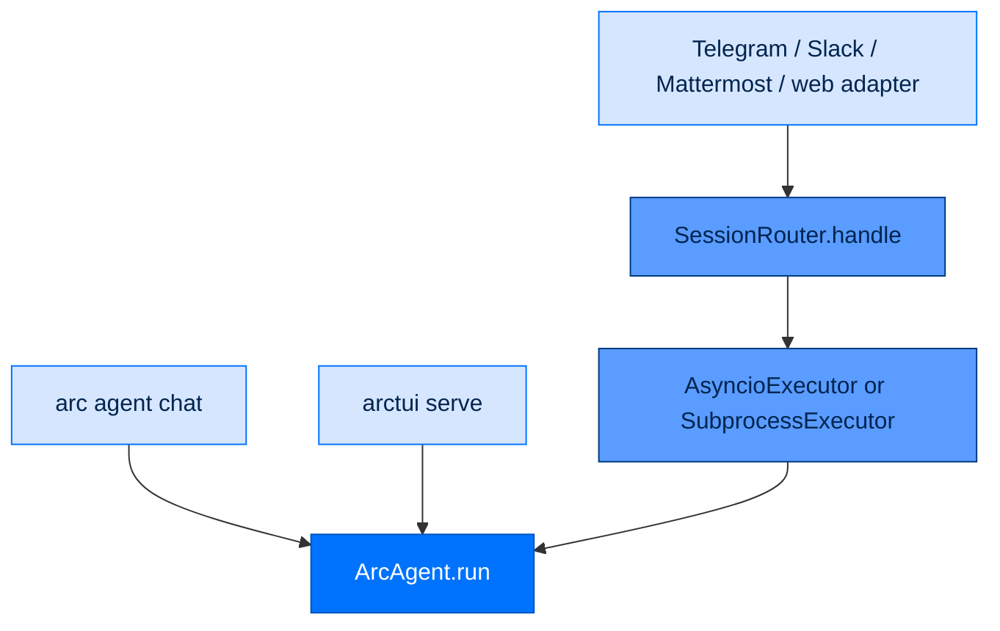
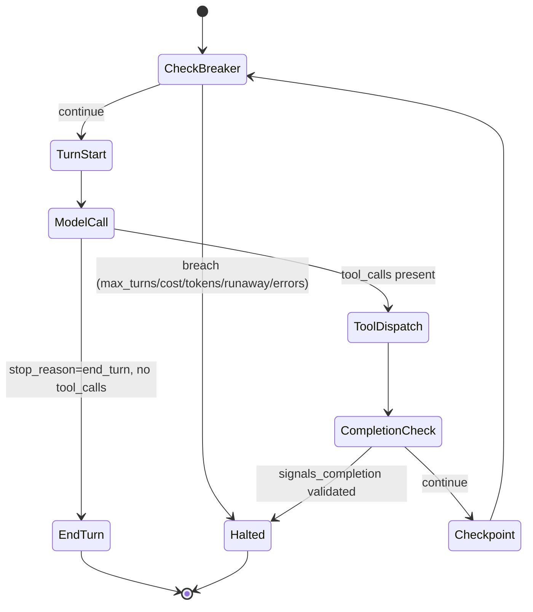
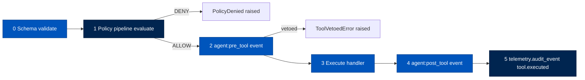
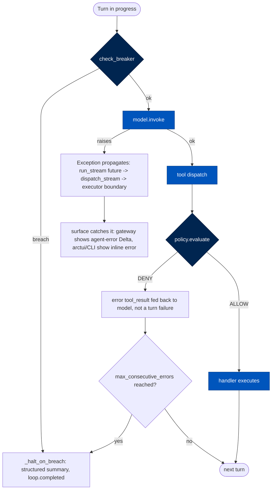

# 3. Anatomy of a Turn — One Request, End to End

> **Who this is for:** any contributor who needs to know what actually happens
> between a user hitting Enter and Arc's reply appearing — the spine every
> other doc in this set hangs off of.
> **Read this after:** [`02-architecture.md`](02-architecture.md) · **Read this next:** [`04-the-unified-adapter.md`](04-the-unified-adapter.md)
> **Plain-language summary lives in:** the "In one breath" section below.

---

## In one breath

A message can arrive three ways — typed into the `arc` CLI, typed into the
`serve` terminal app, or sent from Slack/Telegram/Mattermost/the web widget —
but all three roads merge onto the same street. Every one of them ends up
calling the exact same function, `ArcAgent.run()`, which starts one "turn."
Inside that turn, Arc builds a system prompt and a locked, unchangeable list
of tools, hands both to the execution loop, and the loop talks to the model
in rounds: ask the model something, let it call tools if it wants to, feed
the results back, repeat, until the model gives a final answer or a limit is
hit. Every tool call is checked against a permission policy *before* it runs
and logged *after* it runs — no exceptions, no bypass flag. Everything that
happens — every model call, every tool call, every decision — is written to
a durable, append-only record as it happens, not reconstructed afterward.
When the model is done, the answer streams back out through the same door
the message came in.

## How it actually works

### 1. Arrival — three doors, one hallway

The three entry surfaces converge on the same function almost immediately.
This is a deliberate design decision, not an accident:

> "arcrun is the execution loop and the single runtime path to arcllm.
> Routing is already unified — chat from any channel goes `adapter →
> SessionRouter → executor → agent → arcrun`, and the CLI goes `agent.run →
> arcrun`." — [`docs/architecture/decisions/ADR-024-unified-streaming-run-entry.md`](architecture/decisions/ADR-024-unified-streaming-run-entry.md)

**`arc` CLI.** `arc agent chat` is the interactive entry a human actually
types a message into. It loads the agent's config, opens a session, and
drives the one streaming entry directly:

```python
session = await arc_agent.session(current_session_id)
result = await collect(arc_agent.run(user_input, session=session))
```
`packages/arccli/src/arccli/commands/agent/chat.py:234-235`

`collect()` is a small adapter (`packages/arcrun/src/arcrun/streams.py:134`)
that drains a `StreamEvent` iterator into one final `RunResult` for callers
that don't want to handle tokens one at a time. A second CLI path,
`arc run task`, drives `arcrun.run()` directly without an agent directory at
all (`packages/arccli/src/arccli/commands/run.py:454`) — useful for testing
arcrun/arcllm in isolation, not the normal path a real agent takes.

**The `serve` TUI.** `packages/arctui` holds its own `ArcAgent` instance
in-process and calls the identical entry point when the user submits text:

```python
session = await self._agent.session("tui:main")
async for event in self._agent.run(text, session=session):
    if isinstance(event, TokenEvent):
        self._transcript.append_delta(event.text)
```
`packages/arctui/src/arctui/app.py:260-263`

Two small arctui modules sit around this path but don't touch the turn
itself: `roster.py` enumerates which agent directories are available to
attach to, and `trust.py` gates whether the launch directory is granted to
the agent's workspace before startup — both are one-time, pre-turn concerns.

**A gateway channel.** This is the path with the most moving parts, because
a gateway serves many users across many platforms concurrently. Using
Telegram as the concrete example (Slack and Mattermost adapters follow the
same shape as sibling packages — `packages/arcgateway-slack`,
`packages/arcgateway-mattermost`):

1. `TelegramAdapter` receives a platform webhook/poll update, normalizes it
   into an `InboundEvent` (`platform`, `user_did`, `agent_did`,
   `session_key`, `message`), and calls the callback it was wired with:
   `await self._on_message(event)` — `packages/arcgateway-telegram/src/arcgateway_telegram/adapter.py:702`.
2. That callback is always `SessionRouter.handle()`
   (`packages/arcgateway/src/arcgateway/session.py:321`), wired by
   `GatewayRunner` at startup. `handle()` resolves the canonical,
   cross-platform-stable session key (`build_session_key`,
   `packages/arcgateway/src/arcgateway/session.py:105`), runs the pairing
   allowlist check, checks for a queued turn on this session
   (`QueueManager`, `packages/arcgateway/src/arcgateway/session_queue.py:33`),
   and — if the session is idle — spawns `_process_session` →
   `_run_turn` (`session.py:417`, `session.py:443`).
3. `_run_turn` calls `await self._executor.run(event)`
   (`session.py:461`) and streams the result back through
   `StreamBridge.consume()` to the adapter that owns the reply channel
   (`session.py:466`).
4. Which `Executor` runs is picked once, at gateway startup, by tier —
   never per-message:

   ```python
   if tier == "federal":
       return SubprocessExecutor(worker_cmd=[sys.executable, "-m", "arccli.agent_worker"], team_root=team_root)
   return AsyncioExecutor(agent_factory)
   ```
   `packages/arcgateway/src/arcgateway/bootstrap.py:170-179`

   `AsyncioExecutor` (personal/enterprise) runs `ArcAgent` in the same
   process — `agent = await self._agent_factory(event.agent_did)`, then
   `async for stream_event in agent.run(event.message, session=session)`
   (`packages/arcgateway/src/arcgateway/executor.py:261-263`), the same
   entry point every other surface uses. `SubprocessExecutor` (federal)
   spawns one OS subprocess per session — `arc-agent-worker` — over a
   JSON-lines stdin/stdout protocol
   (`packages/arccli/src/arccli/agent_worker.py:169-282`); the worker
   builds its *own* `ArcAgent` from the DID-matched config and calls
   `await collect(agent.run(message, session=session))` — same entry point,
   across a process boundary. A third executor,
   `packages/arcgateway/src/arcgateway/executor_nats.py`'s `NATSExecutor`
   for multi-instance fan-out, is not wired into `_build_executor` anywhere
   and its `run()` unconditionally raises `NotImplementedError` —
   "Implementation deferred — no ETA". A documented gap, not a working third
   tier. It lives only in `executor_nats.py`; `arcgateway.executor` does not
   re-export it.



### 2. Assembly — arcagent builds the turn

`ArcAgent.run()` is intentionally thin — "the only execution entry, always
session-bound, always streaming"
(`packages/arcagent/src/arcagent/core/agent.py:604-647`). It appends the
inbound message to the session and immediately delegates to
`dispatch_stream()`:

```python
async def run(self, input_text, *, session, tool_choice=None, max_tokens=None,
              max_cost_usd=None, run_id=None) -> AsyncIterator[StreamEvent]:
    async for event in dispatch_stream(self, input_text, session=session, ...):
        yield event
```
`packages/arcagent/src/arcagent/core/agent.py:604-647`

`dispatch_stream()`, in `agent_dispatch.py`, is where the turn actually gets
built. Per its own module docstring: "There is exactly one dispatch path
(SPEC-027) — no blocking/async/chat fork"
(`packages/arcagent/src/arcagent/core/agent_dispatch.py:1-13`). It calls
`build_run_context()` (`agent_dispatch.py:42-127`), which does four things in
order:

| Step | What happens | Where |
|---|---|---|
| Resolve tools | `tool_registry.to_arcrun_tools()` — the agent's *policy-wrapped* dispatchable tool set | `tool_registry.py:269` |
| Assemble the system prompt | Strategy guidance + spawn guidance + skills merged via `context.assemble_system_prompt()` | `session_internal/context.py:75` |
| Attach spawn | If enabled, a `spawn_task` tool is built with a closure over the model, tools, and a shared token budget | `agent_dispatch.py:81-104` |
| Wrap the capability surface | Tools + skills + spawn are merged into one `AgentCapabilityProvider`, carrying `caller_did=agent._identity.did` | `agent_dispatch.py:115-124` |

`agent_lifecycle.py` owns the startup/shutdown side of this (binding
runtime components, activating capability providers) rather than per-turn
work; `module_bus.py`'s `ModuleBus.emit()`
(`packages/arcagent/src/arcagent/core/module_bus.py:127`) is the pub/sub
spine both sides ride: `agent:pre_respond` fires once turn assembly starts
(`agent_dispatch.py:126`), `agent:pre_tool` / `agent:post_tool` fire around
every tool dispatch (detailed in §6), and `agent:post_respond` fires once
the stream is fully drained (`agent_dispatch.py:312-323`). Prompts, tools,
and skills are covered in depth in
[`06-prompts-tools-skills.md`](06-prompts-tools-skills.md); this is only the
*where* in the turn.

Identity is not bolted on afterward — it is a field on the handoff object
from the moment that object is constructed
(`caller_did=agent._identity.did if agent._identity else "did:arc:unknown"`,
`agent_dispatch.py:120`). That is the first hop of the `caller_did` thread
traced fully in §6.

### 3. Handoff to the loop

`dispatch_stream()` calls `arcrun.run_stream()` with the assembled context:

```python
raw_stream = await arcrun_run_stream(
    model=model, capabilities=provider, system_prompt=system_prompt,
    task=input_text, messages=history, on_event=bridge,
    transform_context=transform, tool_choice=tool_choice,
    actor_did=agent._identity.did if agent._identity else None,
    store_raw_bodies=agent._config.telemetry.capture_tool_io,
    max_tokens=run_max_tokens, max_cost_usd=run_max_cost_usd,
    run_id=run_id, on_handle=on_handle, **build_loop_controls(agent, session),
)
```
`packages/arcagent/src/arcagent/core/agent_dispatch.py:279-295`

The handoff object carries: the model, the unified `CapabilityProvider`
(tools + skills + spawn), the system prompt, full session history, the
recording bridge (`on_event`), the caller's DID (`actor_did`), a per-run
token/cost budget (config floor tightened by any caller-pinned ceiling —
"the lower ceiling always wins," `agent_dispatch.py:261-268`), an optional
pinned `run_id`, and loop controls (approval gates, checkpoint hook,
sandbox) resolved once per tier in
`packages/arcagent/src/arcagent/tools/approval_policy.py:85-129`.

**The tool-set freeze.** Immediately after arcrun builds its internal
`RunState`, it calls `registry.freeze()`
(`packages/arcrun/src/arcrun/streams.py:69`, inside the shared `_build_state`
helper). This matches
[`ADR-027`](architecture/decisions/ADR-027-per-run-tool-set-freeze-security-invariant.md)
exactly: after `freeze()`, `add`/`remove` raise `RuntimeError` and emit a
`tool.mutation_denied` anomaly audit event. No tool can be injected mid-run —
not by a prompt-injected instruction, not by any code path — because the
capability review that happened before the loop started is the only
capability review that ever happens for this run.

**Run entry unification.** `run_stream`, `run`, and `run_collected` are not
three independent code paths — `run()` wraps `run_async()`
(`packages/arcrun/src/arcrun/loop.py:160-191`), and `run_stream()` wraps
`run()` in a queue-fed async generator
(`packages/arcrun/src/arcrun/streams.py:307-354`). This matches
[`ADR-024`](architecture/decisions/ADR-024-unified-streaming-run-entry.md),
which explicitly deleted the old `chat` / `run_async` / `run_stream` fork at
the *agent* layer in favor of one streaming `agent.run()` — the ADR's own
before/after table documents the fork it closed.

**`run_id` pinning.** A caller *may* pin the run's correlation id; if it
doesn't, arcrun mints one:

```python
run_id = run_id or str(uuid.uuid4())
```
`packages/arcrun/src/arcrun/streams.py:252` (mirrored in
`packages/arcrun/src/arcrun/loop.py:55` for the non-streaming entry). This
matters because the pinned (or minted) id becomes **both** the stream's
audit `request_id` and the loop's `EventBus.run_id` — "unifying the stream
audit and the loop's spooled events under one run_id"
(`streams.py:234-236, 248-252`). A task dispatcher pins it so a task's
durable record links to its run *before* the loop starts
(`agent.py:633-635`); when nobody pins it, every hop still shares one
freshly-minted id.

```mermaid
sequenceDiagram
    autonumber
    participant Agent as ArcAgent.run
    participant Dispatch as dispatch_stream
    participant RunStream as arcrun.run_stream
    participant Loop as loop._build_state

    Agent->>Dispatch: input_text, session, run_id?
    Dispatch->>Dispatch: build_run_context (prompt, tools, provider)
    Dispatch->>RunStream: model, capabilities, system_prompt, actor_did, run_id?
    RunStream->>Loop: same run_id (mint if None)
    Loop->>Loop: registry.freeze()
    Loop-->>RunStream: RunState (run_id fixed for the whole run)
    RunStream-->>Dispatch: AsyncIterator[StreamEvent]
```

### 4. The loop — arcrun

The actual turn-by-turn mechanics live in a **strategy** function, selected
once per run (`_select_and_emit`, `packages/arcrun/src/arcrun/streams.py`
via `loop.py:256`); the default is `react_loop`
(`packages/arcrun/src/arcrun/strategies/react.py:239`). Strategy selection
and the steering-vs-strategy tradeoffs are covered in
[`05-steering-and-strategies.md`](05-steering-and-strategies.md) — here is
the shape of one pass through the `while True:` loop:

1. **Cancel check** — an operator kill-switch can set `cancel_event`;
   checked at the top of every turn (`react.py:258-259`).
2. **Circuit breaker** — `check_breaker()` folds token/cost/turn caps and
   the runaway-loop / error-cascade detectors into one O(1) check
   (`react.py:50-71`, called at `react.py:264-266`).
3. **`turn.start` emitted** (`react.py:268`).
4. **Steer drain** — a mid-run teammate message injected at the turn
   boundary (`react.py:271-272`).
5. **Context transform** — an optional, append-only hook (compaction is
   explicitly *not* this hook — see §11) (`react.py:277-282`).
6. **The model call** — `response = await model.invoke(messages, tools=tools, **invoke_kwargs)`
   (`react.py:291`), timed, then `llm.call` emitted with tokens/latency/cost
   (`react.py:296-305`).
7. **End-turn check** — if the model stopped without requesting a tool, the
   loop returns a result (`react.py:317-323`).
8. **Tool dispatch** — otherwise, `_execute_tool_calls()` runs this turn's
   tool calls through the one gated dispatch path (`react.py:326-328`,
   detailed in §6).
9. **Completion check** — if a `signals_completion` tool call both fired
   *and* validated, the loop ends with that tool's structured payload
   (`react.py:350-357`).
10. **`turn.end` emitted + checkpoint** — `_end_turn()` increments the turn
    counter and, if a checkpoint hook is wired, hands it a serializable
    `LoopCheckpoint` (`react.py:445-459`).



`packages/arcrun/src/arcrun/executor.py` sits one level below the strategy:
`_execute_tool_calls()` hands each dispatchable call to
`execute_tool_call(tc, state, sandbox)`
(`packages/arcrun/src/arcrun/strategies/react.py:182-236`, calling into
`packages/arcrun/src/arcrun/executor.py:41`). This arcrun-level executor
owns schema validation, sandbox allow/deny, timeout enforcement, and
`tool.start`/`tool.end`/`tool.error` event emission — it is generic over
*any* tool. The arcagent-level policy pipeline (§6) runs one layer further
in, inside the tool's own `execute()` closure, because policy decisions
need agent identity and session state that arcrun deliberately does not
carry.

`packages/arcrun/src/arcrun/state.py`'s `RunState` is the mutable record one
run threads through every turn: `messages`, `registry`, `event_bus`,
`turn_count`, `tokens_used`, `cost_usd`, `run_id`, `cancel_event`,
`steer_queue`/`followup_queue`, `runaway_signature`/`runaway_count`,
`consecutive_tool_errors`, and the resolved breaker thresholds
(`max_turns`, `max_tokens`, `max_cost_usd`, `max_repeat`,
`max_consecutive_errors`) — one struct, one source of truth for "where is
this run right now."

### 5. The model call — the arcllm boundary

The loop's only contract with arcllm is `LLMProvider.invoke()`:

```python
async def invoke(self, messages: list[Message], tools: list[Tool] | None = None,
                  *, response_format: ResponseFormat | None = None, **kwargs) -> LLMResponse
```
`packages/arcllm/src/arcllm/types.py:193-209`

The request is messages + tool schemas + optional `tool_choice`/
`response_format`; the response (`LLMResponse`,
`packages/arcllm/src/arcllm/types.py:160-173`) carries `content`,
`tool_calls`, `usage`, `stop_reason`, and `cost_usd`. Everything about *how*
that call reaches a specific provider (Anthropic, OpenAI, 14 others) is
deferred to [`04-the-unified-adapter.md`](04-the-unified-adapter.md).

What matters for the turn's anatomy is *where the module pipeline sits*:
`load_model()` wraps the raw provider adapter in a fixed stack, outermost
first —

```text
Otel → Queue → Telemetry → Audit → Guardrails → Injection →
Security → CircuitBreaker → Retry → Fallback → RateLimit →
[Router|LoadBalancer|Adapter]
```
`packages/arcllm/src/arcllm/registry.py:420-425`

— so the single `model.invoke()` call the loop makes is actually a call
into the *outermost* module, which threads down through retry/fallback/
circuit-breaking/redaction/guardrail layers before it ever reaches an HTTP
request. The loop never sees any of this; it sees one coroutine that either
returns an `LLMResponse` or raises. `TelemetryModule` is also where each
individual model call gets written to the operational spool as a
`kind="llm_call"` record (`packages/arcllm/src/arcllm/modules/telemetry.py:922-971`)
— separately from, and in addition to, the loop's own `run_event`/
`tool_event` records (§7).

### 6. Tool execution — the four pillars, in code

This is where CLAUDE.md's "Authorize" and "Audit" pillars stop being
assertions and become a specific, verifiable call order. The dispatchable
tools arcrun invokes are not raw handlers — they are wrapped once, at
`ArcAgent` startup, by `ToolRegistry._create_wrapped_execute()`, whose own
docstring states the order:

> "Dispatch order — each layer is a single, named guard: 0. Argument schema
> validation 1. Policy pipeline … first-DENY-wins, fail-closed. Denied calls
> never reach `execute()`. 2. Pre-tool event (may veto …) 3. Execute with
> timeout + telemetry span 4. Post-tool event 5. Audit"
> `packages/arcagent/src/arcagent/core/tool_registry.py:384-395`



**Authorize.** Step 1 builds a signed `ToolCall` (`tool_name`, `arguments`,
`agent_did`, `session_id`, `classification`, the trifecta legs this call
would contribute) and signs it with the agent's own identity key —
`call = sign_call(call, identity)` — so the policy pipeline can authenticate
that the dispatch really came from the key-holding agent, not an injected
call (`tool_registry.py:479-491`). It then calls the real evaluator:

```python
decision = await pipeline.evaluate(call, ctx_pol)
```
`packages/arcagent/src/arcagent/core/tool_registry.py:514`, against
`arctrust.policy.PolicyPipeline` (`packages/arctrust/src/arctrust/policy.py:963`).
The pipeline's own module docstring names it "the ordered,
short-circuiting, fail-closed evaluator" (`arctrust/policy.py:9`); its
`evaluate()` loop calls each configured layer in order and returns on the
first `DENY` (`arctrust/policy.py:1081`). A denied call raises
`PolicyDenied` (`packages/arcagent/src/arcagent/core/tool_policy.py:59`)
**before** step 3 — the handler's `execute()` is never called. One
exception: a deny specifically on the `global.forbidden_composition` rule
can be escalated to a human operator for a one-shot, signed approval
(`tool_registry.py:343-382`) rather than failing outright; every other deny
is final.

**Audit.** Step 5 always runs after a successful execute — `tool.executed`
is written with `actor_did`, `tier`, `transport`, and duration
(`tool_registry.py:566-588`), through `AgentTelemetry.audit_event()`
(`packages/arcagent/src/arcagent/core/telemetry.py:79`), down to
`arctrust.audit.emit(event: AuditEvent, sink: AuditSink) -> None`
(`packages/arctrust/src/arctrust/audit.py:506-525`) — which is fail-open by
design: "the audit system must never interrupt the operation being audited"
(NIST AU-5, same docstring). The durable sink is
`arctrust.audit.WormSink` (`packages/arctrust/src/arctrust/audit.py:176`), a
hash-chained append-only JSONL file (see §7). `NullSink`
(`arctrust/audit.py:137`) is the explicit no-op used in tests and
unconfigured agents.

> ⚠️ **Naming correction:** CLAUDE.md's Four Pillars description names
> separate `JsonlSink`, `SignedChainSink`, and `arcui.bridge.UIBridgeSink`
> classes. In the code, `arctrust.audit` exposes only `WormSink` (a
> single class that is both the JSONL writer and the hash chain) and
> `NullSink`. `UIBridgeSink` existed historically but was deliberately torn
> out — arcui now *reads* from the arcstore spool instead of receiving a
> live push (see §7 and `packages/arcui/tests/test_no_push_pipeline.py`,
> whose name records the invariant). Treat the three-sink description as
> historical intent, not current code.

**`caller_did` threaded, hop by hop.** The DID originates in
`arctrust.identity.AgentIdentity`, loaded once at agent startup:

```python
self._identity = AgentIdentity.from_config(self._config.identity, ...)
```
`packages/arcagent/src/arcagent/core/agent.py:389-395`. From there:

| Hop | Field | Location |
|---|---|---|
| Agent | `agent._identity.did` | `agent.py:836-842` (public `.did` property) |
| Capability provider | `caller_did=agent._identity.did` | `agent_dispatch.py:120` |
| arcrun handoff | `actor_did=agent._identity.did if agent._identity else None` | `agent_dispatch.py:288` |
| Loop `EventBus` | `spool_actor_did=actor_did` | `streams.py:57-63` (via `_build_state`) |
| Tool dispatch | `agent_did = self._agent_did` → `ToolCall(agent_did=agent_did, ...)` → `sign_call(call, identity)` | `tool_registry.py:400, 479-491` |
| Policy decision | `PolicyContext` carries the signed call to every layer | `tool_registry.py:506-514` |
| Audit record | `"actor_did": agent_did` on every `tool.executed` event | `tool_registry.py:585` |

This confirms the identity thread is wired end-to-end through arcrun's tool
dispatch for the primary path. It is **not** unconditional: if
`agent._identity` is `None` (a bare/test agent with no configured identity),
`actor_did` degrades to `None`, and inside `tool_registry.py` an unattributed
call still dispatches — but is called out with its own audit event,
`security.unidentified_tool_call`, precisely because `"did:arc:unknown"` is a
flagged condition, not a silent default (`tool_registry.py:569-578`).

**Sign** (artifact verification before load — detail in
[`10-security-model.md`](10-security-model.md)) happens earlier, at
capability-loading time rather than per-tool-call time:
`CapabilityLoader` re-verifies a capability's detached signature at load and
consults the TOFU trust layer before registering it —
`signed = self._trust_backend.verify(...)`
(`packages/arcagent/src/arcagent/capabilities/capability_loader.py:328-365`).
A tier with `require_signature=True` and no pinned trusted key denies the
capability outright before it ever becomes a dispatchable tool.

### 7. The record — run_events, LLM calls, and audit, as they happen

Three parallel write paths fire during a turn, not after it:

1. **`run_event` / `tool_event` records.** `EventBus.emit()`
   (`packages/arcrun/src/arcrun/events.py:150-178`) appends every event to
   an in-memory SHA-256 hash chain (`_compute_event_hash`,
   `events.py:60-62`) *and*, when an actor DID is configured, mirrors
   lifecycle events (`strategy.selected`, `turn.start`, `turn.end`,
   `loop.complete`, `loop.completed`) and tool events (`tool.start`,
   `tool.end`, `tool.error`) to the arcstore spool via
   `arcstore.spool.record()` (`packages/arcstore/src/arcstore/spool.py:73`,
   called from `events.py:194-249`). Every one of those spool records
   carries `request_id=self._run_id` — **the spool's `request_id` is
   literally the arcrun `run_id`**, not a separately generated id
   (`events.py:198, 239`). This is the join key the whole observability
   surface depends on.
2. **`llm_call` records.** Independently, arcllm's `TelemetryModule`
   writes one `kind="llm_call"` spool record per model call, carrying
   provider/model/token counts/cost/latency
   (`packages/arcllm/src/arcllm/modules/telemetry.py:922-971`) — not routed
   through arcrun's `EventBus` at all, a second, parallel spool writer.
3. **Audit events.** `tool.executed`, `security.*`, and stream-lifecycle
   events (`stream.start`/`stream.end`, emitted at the top and bottom of
   `run_stream()`, `packages/arcrun/src/arcrun/streams.py:254-262, 405-413`)
   go through `arctrust.audit.emit()` to `WormSink`, a hash-chained,
   append-once JSONL file — the write-once-read-many trail (detail on
   format and segment rotation in
   [`08-data-and-storage.md`](08-data-and-storage.md)).

**The read path.** `arcui` does not receive a live push of any of this — it
queries the arcstore spool after the fact, through `arcstore.query`
(imported as `store_query` in `packages/arcui/src/arcui/observe.py:20`) and
route handlers like `list_traces`/`get_trace`
(`packages/arcui/src/arcui/routes/traces.py:44-72`). This is the direct
result of a deliberate "full UI push teardown" — a prior parallel push path
(`UIBridgeSink` and friends) was removed in favor of one pull query surface,
so arcui, the CLI's `--show-events`, and the task board are all reading the
same durable spool rather than maintaining separate live feeds.

```mermaid
sequenceDiagram
    autonumber
    participant User
    participant GW as Gateway adapter
    participant Router as SessionRouter
    participant Exec as Executor
    participant Agent as ArcAgent
    participant Loop as arcrun loop
    participant LLM as arcllm
    participant Tool as Tool (policy-wrapped)
    participant Spool as arcstore spool
    participant UI as arcui

    User->>GW: message
    GW->>Router: InboundEvent
    Router->>Exec: run(event)
    Exec->>Agent: agent.run(text, session)
    Agent->>Loop: run_stream(model, capabilities, actor_did, run_id)
    loop each turn
        Loop->>LLM: model.invoke(messages, tools)
        LLM-->>Loop: LLMResponse
        LLM->>Spool: llm_call record (request_id=run_id)
        Loop->>Tool: dispatch tool_call
        Tool->>Tool: policy.evaluate (DENY short-circuits)
        Tool-->>Loop: tool_result
        Loop->>Spool: run_event / tool_event (request_id=run_id)
        Tool->>Spool: audit tool.executed (WormSink)
    end
    Loop-->>Agent: TokenEvent... TurnEndEvent
    Agent-->>Exec: StreamEvent stream
    Exec-->>Router: Delta stream
    Router-->>GW: deliver via adapter
    GW-->>User: reply
    UI->>Spool: query (list_traces / get_trace)
```

### 8. The reply — back out the same door

The reply never takes a shortcut back to the channel; it retraces the exact
path the request came in on, because the streaming contract
(`AsyncIterator[StreamEvent]`) is the same object at every hop:

- Inside `dispatch_stream()`, every `StreamEvent` arcrun yields is
  `yield`-ed straight through to whatever is consuming `agent.run()`
  (`agent_dispatch.py:296-299`) — no buffering, no re-assembly.
- `AsyncioExecutor._stream()` consumes that iterator and converts each
  `TokenEvent` into a `Delta(kind="token", ...)`, finishing with
  `Delta(kind="done", is_final=True)`
  (`packages/arcgateway/src/arcgateway/executor.py:263-289`) — this closes
  what the code calls "the M2 fake-streaming TODO": chat used to wrap the
  whole reply as one fake token; now it streams for real.
- `SessionRouter._run_turn()` hands that `Delta` stream to
  `StreamBridge.consume(delta_stream, target, adapter)`
  (`packages/arcgateway/src/arcgateway/session.py:461-466`), which delivers
  progressively to whichever platform adapter owns the event's source
  channel — resolved by `event.platform`, never hardcoded, so a Slack
  message can never be delivered to Telegram.
- For arctui and the CLI, there is no gateway hop at all — `app.py:261-266`
  and `chat.py:234-235` consume the same `StreamEvent` iterator directly and
  render/print as it arrives.

The spool write (§7) and the reply delivery are the **same event stream
observed twice**, not two separate paths that could drift: `on_event=bridge`
is passed into `run_stream()` alongside the `_stream_generator` that feeds
the reply, so recording and delivery are two consumers of one produced
sequence (`streams.py:277-301`, `agent_dispatch.py:285`).

## Where a turn can fail

| Failure | Where it's raised | What the user sees | Where it's recorded |
|---|---|---|---|
| Policy DENY on a tool call | `PolicyDenied` raised inside the wrapped `execute()`, before the handler runs (`tool_registry.py:361,374,381`) | **Not** a turn failure — arcrun's `execute_tool_call()` catches it as a generic exception and returns an error `tool_result` to the model (`packages/arcrun/src/arcrun/executor.py:105-117`); the model sees the denial and can explain it, retry differently, or stop | `policy.*` decision + (on repeat) `security.unidentified_tool_call` / audit events; if denials repeat enough to trip `max_consecutive_errors`, the loop halts via the breaker (next row) |
| Circuit breaker: `max_turns` / `max_tokens` / `max_cost` / `runaway_loop` / `error_cascade` | `check_breaker()` at the top of every turn (`react.py:50-71`) | A graceful final answer — `_halt_on_breach()` builds a structured `completion_payload` and surfaces its `summary` as the loop's own final text, so every consumer gets human-readable words, not a crash (`react.py:385-404`) | `loop.completed` (and, for `max_turns` specifically, the legacy `loop.max_turns` event) written to the spool as a `run_event` |
| Provider/LLM error (timeout, API error, malformed response) | Raised inside `model.invoke()`; not caught by `react_loop` itself | Depends on the surface: `run_stream`'s background task catches it and stores it on the `loop_future` (`streams.py:341-345`), re-raised when the stream is awaited (`streams.py:374`); `dispatch_stream` emits `agent:error` then re-raises (`agent_dispatch.py:300-305`); `AsyncioExecutor._stream` is the first layer that actually converts it to user-visible text — `[agent-error] the run failed; see server logs` (`executor.py:274-289`). arctui and `arc-agent-worker` each have their own equivalent catch (`arctui/app.py:267-270`; `agent_worker.py:263-282`) | Exception is logged (`_logger.exception`) at whichever boundary catches it; no dedicated spool record for the raw exception itself |
| Human-in-the-loop timeout/deny on a `forbidden_composition` escalation | `_resolve_forbidden_composition()` — approval `None` or expired re-raises `PolicyDenied` (`tool_registry.py:372-374`) | Same as a plain policy DENY (see row 1) | Approval request/outcome audited by the `HumanGate` implementation (detail in `10-security-model.md`) |
| Operator cancel | `cancel_event` checked at the top of every turn (`react.py:258-259`) | `_halt_on_cancel()` — same structured-halt shape as a breaker trip, attributed to the cancelling operator | `loop.cancelled` audit event |
| Compaction | **Never mid-turn.** `maybe_compact()` runs only after `dispatch_stream`'s stream is fully drained and the assistant turn committed (`agent_dispatch.py:310-311`); arcrun's `transform_context` hook is explicitly append-only between turns and is a *different* mechanism (`react.py:274-282`) | No user-visible effect on the turn that triggered it; the *next* turn sees a compacted history | Compaction is a session-level operation, detailed in `07-memory-lifecycle.md` |



## Where to look in the code

| Path | What lives there | Start here if you're changing... |
|---|---|---|
| `packages/arccli/src/arccli/commands/agent/chat.py` | Interactive CLI entry to a real agent | The `arc agent chat` UX |
| `packages/arccli/src/arccli/agent_worker.py` | Federal-tier subprocess worker (JSON-lines IPC) | Federal isolation behavior |
| `packages/arctui/src/arctui/app.py` | TUI's direct `agent.run()` consumer | The terminal UI's turn rendering |
| `packages/arcgateway/src/arcgateway/session.py` | `SessionRouter`, session-key derivation, per-session queueing | Gateway session routing/ordering |
| `packages/arcgateway/src/arcgateway/executor.py` | `AsyncioExecutor`/`SubprocessExecutor`, `Delta` streaming | How a channel consumes the agent stream |
| `packages/arcgateway/src/arcgateway/executor_subprocess.py` | Federal `SubprocessExecutor` | Subprocess isolation, resource limits |
| `packages/arcagent/src/arcagent/core/agent.py` | `ArcAgent.run` / `run_collected`, identity, `.did` | The public agent entry surface |
| `packages/arcagent/src/arcagent/core/agent_dispatch.py` | `dispatch_stream`, `build_run_context` — turn assembly | System prompt / tool set / capability wiring per turn |
| `packages/arcagent/src/arcagent/core/tool_registry.py` | The 6-step dispatch pipeline: schema → policy → pre-event → execute → post-event → audit | Tool authorization/audit behavior |
| `packages/arcrun/src/arcrun/streams.py` | `run_stream`, tool-set freeze, run_id minting/pinning | The streaming contract itself |
| `packages/arcrun/src/arcrun/loop.py` | `run`/`run_async`, strategy selection | Blocking vs. steerable entry points |
| `packages/arcrun/src/arcrun/strategies/react.py` | The default turn loop: model call, tool dispatch, breaker, checkpoint | Turn-level control flow |
| `packages/arcrun/src/arcrun/executor.py` | Generic tool execution: schema, sandbox, timeout, events | Tool timeout/sandbox behavior |
| `packages/arcllm/src/arcllm/types.py` | `LLMProvider.invoke`, `LLMResponse` | The model-call contract |
| `packages/arcllm/src/arcllm/registry.py` | `load_model`, module stacking order | Which module wraps which |
| `packages/arctrust/src/arctrust/policy.py` | `PolicyPipeline.evaluate` | Authorization layer ordering |
| `packages/arctrust/src/arctrust/audit.py` | `emit`, `WormSink`, `AuditEvent` | Durable audit behavior |
| `packages/arcstore/src/arcstore/spool.py` | `record`, `request_context`, spool read functions | The append-only operational record |
| `packages/arcui/src/arcui/observe.py`, `routes/traces.py` | Spool query/read path for the trace dashboard | How recorded turns get displayed |
