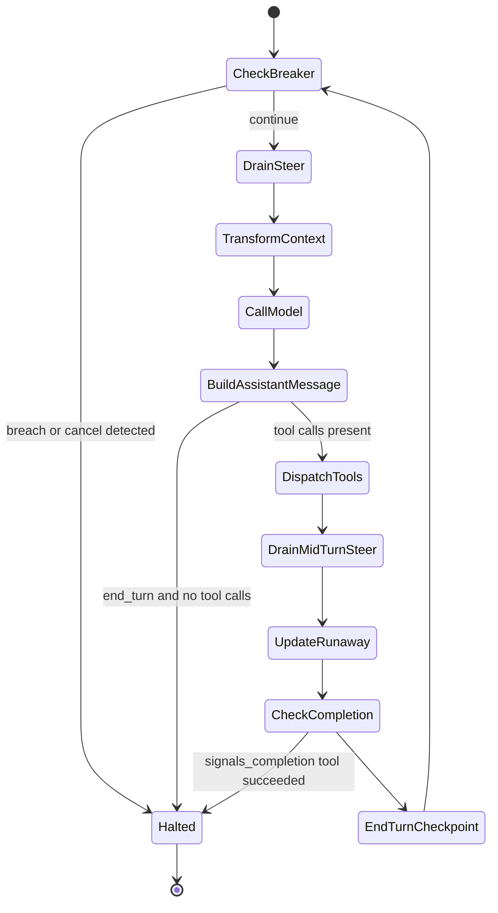
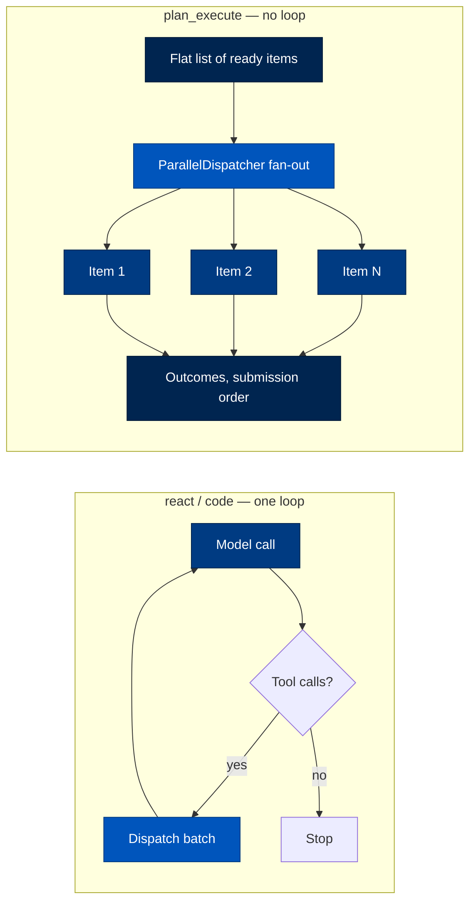
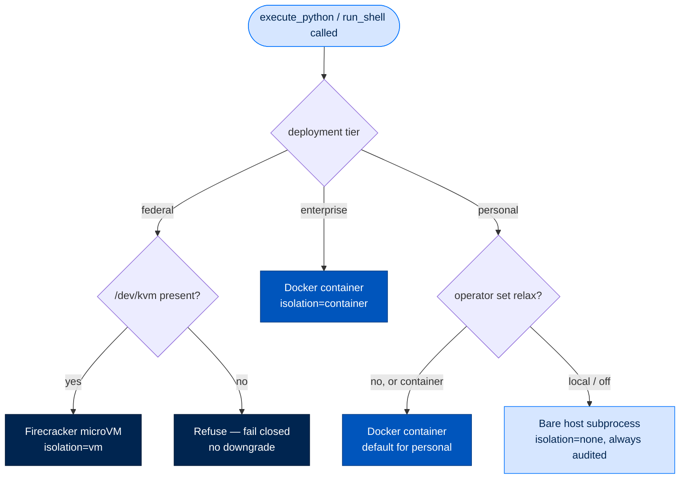

# 5. The Agentic Run — Strategies, Steering, and Budgets

> **Section:** 2. System Walkthroughs · **Topic:** The Engine
> **Who this is for:** anyone who needs to understand how Arc decides when to
> call the model again, when to run a tool, and when to stop — contributors
> touching `packages/arcrun`, and reviewers who need to know what "the loop"
> actually guarantees.
> **Read this after:** [`docs/03-anatomy-of-a-turn.md`](03-anatomy-of-a-turn.md) ·
> **Read this next:** [`docs/06-prompts-tools-skills.md`](06-prompts-tools-skills.md)
> **Plain-language summary lives in:** the "In one breath" section below.
> **See also:** [DATA_FLOW.md](DATA_FLOW.md), [API_REFERENCE.md](API_REFERENCE.md), [PACKAGE_INDEX.md](packages/arcrun.md)

---

## In one breath

`arcrun` is the engine that keeps a model working until a job is actually
done. Think of it as the part of an assembly line that decides "call the
worker again," "hand them a tool," or "we're finished, stop the line" — it
owns that decision loop and nothing else. It doesn't know what a "tool" does
internally, doesn't talk to the model provider directly, and doesn't manage
memory or skills; every tool it runs was handed to it, sealed, by whoever
started the run. Its whole job is: ask the model what's next, do what it
asks for, feed the result back, and know when to quit — safely, on a budget,
and in a way an operator can interrupt or a machine can replay.

---

## The core loop

The public surface is small and lives in `packages/arcrun/src/arcrun/loop.py`.
Three entry points share one setup path (`_build_state`):

| Function | Blocking? | Returns |
|---|---|---|
| `run(...)` | Yes — awaits to completion | `LoopResult` |
| `run_async(...)` | No | `RunHandle` (steerable) |
| `run(..., on_handle=...)` | Yes, but exposes the live handle before awaiting | `LoopResult` |

`run()` is implemented as `run_async()` followed by `await handle.result()` —
there is one real implementation (`loop.py:122-191`). `_build_state` (`loop.py:25-107`)
does the setup every run needs: mints or accepts a pinned `run_id`, builds the
`EventBus`, turns the caller's `CapabilityProvider` into a `ToolRegistry` and
**freezes it before turn 0** (see [tool-set freeze](#the-per-run-tool-set-freeze)),
constructs the `Sandbox`, and — if `messages` (prior session history) is
supplied — prepends a freshly-built system prompt rather than trusting one
carried in the history. If `resume_from` is set, `apply_checkpoint` restores
the saved turn (see [checkpoints](#steering-a-run-in-flight)).

### What a turn actually does

The default and only fully-general strategy is ReAct
(`packages/arcrun/src/arcrun/strategies/react.py`, function `react_loop`).
Every turn, in order:

1. **Cancel check** — if `state.cancel_event` is set, halt immediately.
2. **Circuit breaker** — `check_breaker(state)`, the *single* top-of-turn gate
   (`react.py:50-71`, see [Budgets](#budgets-and-stop-guards)).
3. **Drain a pending steer** — appended as a `user`-role message (the
   top-of-loop drain point; a steer arriving mid-turn drains after tool
   results, step 8).
4. **`transform_context` hook** — the caller's context hook runs against the
   message list (append-only contract, see [Context handling](#context-handling)).
5. **Call the model** — `model.invoke(messages, tools=..., tool_choice=...)`;
   `tool_choice` is only forced on turn 0, if the caller set one.
6. **Build the assistant message** — text content and any `ToolUseBlock`s are
   appended to `state.messages`.
7. **Stop or dispatch** — `stop_reason == "end_turn"` with no tool calls ends
   the run (draining a pending `follow_up` first, if any). Otherwise the
   turn's tool calls go through the one gated dispatch path,
   `parallel_dispatch.dispatch_batch` (see [Parallel dispatch](#parallel-dispatch)).
8. **Tool results re-enter the message list**, in original order. A mid-turn
   steer drains only now — never between an assistant `tool_use` block and
   its `tool_result`, since provider APIs reject that ordering.
9. **Runaway tracking, completion check, checkpoint** — `_update_runaway`
   feeds the repeated-call breaker; `_extract_completion_payload` checks
   whether a `signals_completion=True` tool (e.g. `task_complete`) actually
   ran; `_end_turn` increments `turn_count`, emits `turn.end`, and calls
   `state.on_checkpoint` if set.

### Stop conditions

A run ends exactly one of five ways, and every one of them routes through the
same terminator vocabulary (`arcrun.builtins.task_complete`) so a caller reads
one shape regardless of cause:

| Reason | Trigger | Result content |
|---|---|---|
| Clean finish | `stop_reason == "end_turn"`, no tool calls, no pending follow-up | `response.content` |
| Structured completion | A tool with `signals_completion=True` (e.g. `task_complete`) executes successfully | The tool's `summary` arg |
| Budget breach | `check_breaker` trips (`max_turns`, `max_tokens`, `max_cost_usd`, `max_repeat`, `max_consecutive_errors`) | Synthesized via `make_budget_breach_args` |
| Operator cancel | `RunHandle.cancel()` sets `cancel_event` | Synthesized via `make_cancel_args`, names the caller |

Every exit calls `_build_result`. `LoopResult` (`types.py:76-105`) always
carries `completion_payload`/`completion_tool` when a structured terminator
fired, plus `events` (the full signed event chain) and `verify_integrity()`.

### Messages, types, and state

`_messages.py` wraps `arcllm.types.Message`/`TextBlock`/`ToolUseBlock`/
`ToolResultBlock` directly — arcrun reuses arcllm's wire types
(`user_message`, `system_message`, `assistant_message`, `tool_result`) rather
than defining its own schema. `types.py` defines the loop's own contracts:
`Tool` (name, schema, `execute`, `classification` for dispatch,
`signals_completion`), `ToolContext` (`run_id`, `cancelled` event,
`parent_state` for depth/budget introspection), `SandboxConfig`, `LoopResult`.

`state.py`'s `RunState` is the single mutable object threaded through a run —
messages, the frozen `ToolRegistry`, the `EventBus`, turn/token/cost
counters, the two steering queues, the cancel event, breaker thresholds and
their running counters (`runaway_signature`, `runaway_count`,
`consecutive_tool_errors`), and `on_checkpoint`. It is explicitly **not**
part of the public API — callers interact through `RunHandle`.



---

## Strategies

A `Strategy` (`strategies/__init__.py`) is an ABC with `name`, `description`,
`prompt_guidance` (model-facing text explaining when to use it), and
`__call__(model, state, sandbox, max_turns) -> LoopResult`. Three ship today,
registered lazily in `STRATEGIES`:

| Strategy | What it is | Loop shape | Selected via `run()`? |
|---|---|---|---|
| `react` | Reason → Act → Observe → Repeat, one tool batch per turn | `react_loop` directly | Yes — the default |
| `code` | Same loop, with the system prompt augmented to bias the model toward writing and running code instead of many small tool calls | Delegates straight to `react_loop` after prompt injection | Yes |
| `plan_execute` | The parallel *Executor* half of an LLMCompiler-style split (arXiv 2312.04511) | No loop — a single concurrent fan-out/fan-in of independent items | **No** — see below |

### react

`ReactStrategy.__call__` is a one-line wrapper around `react_loop` — it *is*
the loop described above. Pick it whenever the task needs the model to
observe a tool's actual output before deciding the next step. Cost profile:
one model call per turn, up to `max_turns`; tool calls in a turn may run
concurrently if [classified read-only](#parallel-dispatch).

### code

`CodeExecStrategy.__call__` (`strategies/code.py:35-54`) rewrites
`state.messages[0]` by prepending the `code_exec_prefix` stock prompt, emits
`code.prompt.augmented` recording the before/after length, then calls
`react_loop` — **the exact same function** `react` uses. There is no separate
execution path; `code` is a prompt bias, not a different engine. Pick it when
the task is naturally "write a script that does X" rather than "call five
tools in sequence" — it pairs with the `execute_python` /
`contained_execute_python` builtin tools (see [Sandboxing](#code-execution-and-sandboxing)).

### plan_execute

`PlanExecuteStrategy` is architecturally different, and its docstring is
explicit about the boundary: it **never sees a `Plan`, `depends_on`, or a
replan decision** — those live in arcagent's `PlanOrchestrator`. It receives
a **flat list of already-independent, ready items** (opaque to arcrun) plus a
caller-supplied `runner`, and dispatches them concurrently through the same
`ParallelDispatcher` the react loop's tool batches use — one gather
implementation in the whole engine.

> ⚠️ Selecting `plan_execute` through the generic `run()` entry does **not**
> run a plan — `__call__` returns an immediate empty `LoopResult` (a no-op,
> so a plan with no ready frontier doesn't crash). The strategy is actually
> invoked by calling `PlanExecuteStrategy().run_ready(items, runner,
> max_parallel=...)` directly, from arcagent's `PlanOrchestrator` — not
> through `run(allowed_strategies=["plan_execute"])`.

Cost profile: `N` items dispatched with `max_parallel` concurrency; a failing
item is its own outcome (never aborts a sibling); submission order is
preserved regardless of completion order.

### Selecting a strategy

`select_strategy` (`strategies/__init__.py:54-137`): `allowed=None` → always
`react`. A single-element `allowed` list is used directly, no model call. A
multi-element list asks the model itself to choose, via a dedicated
`select_strategy` tool call against a short strategy-description prompt; a
malformed or missing choice, or any exception, falls back to `react`
(fail-open, logged as `strategy.selection.fallback`).



Runnable reference: `walkthroughs/arcrun/01-core-react.ipynb`.

---

## Steering a run in flight

`run_async()` returns a `RunHandle` (`loop.py:261-313`) — the only way a
caller influences a live run. All three methods require a non-empty
`caller_did`; arcrun **records** the identity into the audit chain but does
not authorize it — that policy decision belongs to the caller (arcagent).

| Method | Effect | Landing point |
|---|---|---|
| `steer(caller_did, message)` | Interrupt: injected as the *next* `user`-role message | Top-of-loop drain, or right after tool results if mid-turn |
| `follow_up(caller_did, message)` | Queued: injected only once the model reaches `end_turn`, then the loop keeps going | Just before what would have been the clean-finish stop |
| `cancel(caller_did, reason=None)` | Hard stop, attributed | Both queues are drained, `cancel_event` is set, the loop halts at its next check |

Both `steer_queue` and `followup_queue` are bounded (`maxsize=16`) and every
`Injection` carries a `message_id` minted at enqueue time so the later audit
event (`steer.injected` / `followup.injected`) can be correlated. Injections
land as **`user`-role data, never `system`** — a deliberate LLM01/ASI06
mitigation: an injected message can never masquerade as an instruction from
the operator layer above the model.

### Checkpoints and resume

`checkpoint.py`'s `LoopCheckpoint` is a serializable snapshot taken at every
turn boundary (`_end_turn` calls `state.on_checkpoint(to_checkpoint(state))`
if a hook is set — zero cost when it isn't). arcrun **never persists** the
checkpoint itself; the caller (arcagent's `SessionManager`) writes it
durably. Resume (`apply_checkpoint`) is **fail-closed on a changed tool
set**: if the reconstructed registry's tool names don't match the
checkpoint's, resume is refused outright (ASI06 — a poisoned resume must not
silently continue with a different capability surface). Because the message
transcript already contains every completed turn, resume re-executes no
tool call and redoes no work — it is a genuine re-entry, not a replay.

### The operator kill switch

`RunHandle.cancel()` is the mechanism; the **operator-facing** path that
calls it lives outside arcrun, in `packages/arcagent/src/arcagent/modules/runcontrol/`.
The problem it solves: an operator surface (`arc stop`, arcui) runs in a
*separate process* from the agent, so it cannot hold an in-process
`RunHandle` reference directly.

1. The operator surface writes a `CancelRequest` (`packages/arcstore/src/arcstore/cancellations.py`)
   into the shared `cancellations` collection — `status="pending"`, named by
   `run_id` and/or `session_key`, attributed to `requested_by`.
2. `runcontrol`'s `@background_task` watcher (3-second tick) polls pending
   requests, resolves the matching live handle from the agent's
   `_active_runs` map (populated for both tracked and streaming runs — the
   latter via `run_stream`'s `on_handle` seam), and calls
   `handle.cancel(req.requested_by, req.reason)`.
3. `CancelStore.resolve` applies the request via a **race-safe conditional
   update** (`status == "pending"`), so two overlapping watcher ticks can't
   double-apply it.
4. A pending request that never matches a live run ages out to `expired`
   after a configured TTL (`_sweep_stale`), so it doesn't sit forever.

This is fully wired, not aspirational — both the store-signalled path and the
`RunHandle.cancel()` it calls are live. The operational detail worth
knowing: kill latency is bounded by the watcher's 3-second poll interval, not
instantaneous.

```mermaid
sequenceDiagram
    participant Op as Operator (arc stop / arcui)
    participant Store as CancelStore
    participant Watcher as runcontrol watcher
    participant Handle as RunHandle
    participant Loop as react_loop

    Op->>Store: create(CancelRequest, requested_by, run_id)
    loop every 3s
        Watcher->>Store: list(status="pending")
        Store-->>Watcher: [request]
        Watcher->>Watcher: resolve request to live handle via agent._active_runs
        Watcher->>Handle: cancel(caller_did, reason)
        Handle->>Loop: set cancel_event, drain steer/follow_up queues
        Watcher->>Store: resolve(status="applied")
    end
    Loop->>Loop: next cancel_event check trips
    Loop-->>Op: LoopResult (completion_payload from make_cancel_args)
```

---

## Streaming and events

`streams.py` implements ADR-024's "one streaming entry" decision — every
surface (chat, CLI, scheduler) drives an agent through a stream, collecting
it when only the final answer matters.

- **`run_stream(...)`** wraps the full `run()` loop, bridging its `EventBus`
  into typed `StreamEvent`s (`ToolStartEvent`, `ToolEndEvent`, one final
  `TokenEvent` with the complete response text, then exactly one
  `TurnEndEvent`). There is no synthetic per-word typing effect — SPEC-043
  cut that as misleading fabricated progress; the real final content lands
  as a single block. `on_handle` forwards to `run()`, which is how a
  streaming caller gets a cancellable `RunHandle` (the seam the runcontrol
  watcher relies on).
- **`stream_llm_response(...)`** is a separate, lower-level primitive: one
  `model.invoke_stream` call, no loop, no tool dispatch — the primitive
  behind a chat-typing-effect demo, not agentic execution.
- **`collect(stream)`** drains any `StreamEvent` iterator into a `RunResult`
  for one-shot callers that don't want to hold an async generator open.

`events.py`'s `EventBus` is the audit backbone: every `emit()` call computes
a SHA-256 hash chaining `prev_hash` + canonical event bytes, so
`verify_chain(events)` (also reachable via `LoopResult.verify_integrity()`)
can detect a self-hash mismatch, a broken chain link, or a sequence gap.
Loop-lifecycle events (`turn.start`, `turn.end`, `loop.complete`, ...) and
tool-lifecycle events (`tool.start`, `tool.end`, `tool.error`) are optionally
mirrored to the arcstore operational spool when a `spool_actor_did` is
configured — entirely fail-open, so a spool write failure never breaks the
run it's observing.

Runnable references: `walkthroughs/arcrun/04-streaming.ipynb`,
`walkthroughs/arcrun/07-event-chain-verification.ipynb`.

---

## Parallel dispatch

Every tool call, from every strategy, funnels through one function:
`parallel_dispatch.dispatch_batch` (`parallel_dispatch.py:167-184`). It first
asks a `BatchClassifier` whether the batch is safe to run concurrently, in
order: (1) any tool whose `classification != "read_only"` → sequential; (2)
any tool the registry can't classify → sequential — **fail-closed by
construction**, since `ToolRegistry.get_classification` returns
`"state_modifying"` for an unknown name (SPEC-043 REQ-034); (3) two calls
sharing a path-like argument value (contains `/` or `\`) → sequential, a
cheap heuristic against an implicit write-then-read dependency that can
false-positive but never false-negative into a race; (4) otherwise →
parallel, via `ParallelDispatcher` (an `asyncio.Semaphore` bounded by
`max_parallel`, default 10).

The invariant that makes this safe: **submission order is always preserved
in the returned result list, regardless of completion order**, and a
runner's exception is captured as that call's own result rather than
aborting the batch (`gather(..., return_exceptions=True)` semantics,
implemented manually so a bare exception becomes a typed failure, not a
crash). `plan_execute`'s `run_ready` uses the identical `ParallelDispatcher`
class for its item fan-out — one concurrency primitive in the whole engine.

Runnable reference: `walkthroughs/arcrun/05-parallel-dispatch.ipynb`.

---

## The per-run tool-set freeze

`registry.py`'s `ToolRegistry` is mutable during construction (`add`/`remove`)
and then **frozen** by `_build_state` before turn 0. After `freeze()`, any
`add`/`remove` raises `RuntimeError` and emits a `tool.mutation_denied`
anomaly event instead of silently no-op'ing.

ADR-027 names the attack this closes: without the freeze, a mid-run mutation
(e.g. triggered by a prompt-injected instruction reaching some code path)
could inject a tool **after** the point a human or policy review fixed the
set — an ASI04 (agentic supply chain) / LLM06 (excessive agency) opening. The
freeze also makes `list_schemas()` memoizable: the tool-definitions block a
provider's prompt cache keys on stays byte-stable for the whole run, so the
cache-hit benefit is an emergent side effect of a security invariant, not a
caching concern living in the loop.

---

## Context handling

Two unrelated things live near each other here and are easy to conflate.
**`arcrun/context/`** is just a directory of markdown prompt bodies
(`strategy_react.md`, `code_exec_prefix.md`, etc.) loaded via
`arcprompt.load_stock` and surfaced through `prompts.py`'s
`get_strategy_prompts()` — model-facing *guidance text*, not context-window
management.

**`transform_context`** (a callable on `RunState`, supplied by the caller) is
the real context-window control point, and it carries a hard contract:
**append-only between turns** (ADR-026). The provider prompt cache reuses the
longest stable prefix across consecutive requests; a hook that rewrites or
reorders earlier messages every turn busts that cache on every call.
`transform_context`'s only in-loop action is a **last-resort emergency
truncation** if a run reaches a hard ceiling before a real compaction
boundary — a strictly *shorter* list (a one-time reduction), never a
same-length-or-longer list with a mutated prefix.

> **arcrun does not compact.** All real compaction — token-based splitting,
> structured summarization, observation masking — is owned by
> `SessionManager.compact` in arcagent, triggered *between* dispatches, not
> mid-run. This is a boundary contributors violate in practice: ADR-026
> exists because an earlier version added "smarter" per-turn pruning inside
> `transform_context` and silently defeated prompt caching for every
> long-running agent.

Enforcement is deliberately **debug-gated, not always-on** (ADR-028): setting
`ARCRUN_ASSERT_APPEND_ONLY=1` makes `_check_append_only` (`react.py:122-136`)
raise if a turn's transformed list is same-length-or-longer but its prefix
changed. In production this costs nothing — an O(context) scan every turn
would violate the sub-500ms cold-start budget at fleet scale — so a
misbehaving hook degrades cache hit rate silently instead of failing; a
performance regression, not a correctness bug, since arcagent's own
`transform_context` is append-only by construction.

---

## Code execution and sandboxing

Two independent gates apply to every tool call, plus one tier-routed ladder
specific to code execution. **`sandbox.py`**'s `Sandbox.check(tool_name,
params)` runs before every dispatch (`executor.py:65`): no config → allow; an
`allowed_tools` allowlist that excludes the tool → deny; an optional `check`
callback for custom per-call policy, whose exceptions count as a denial
(fail-safe). Every denial emits `tool.denied`.

**Execution backends** (`backends/`) are a separate concern: how
`execute_python`/`run_shell` isolate arbitrary code. `base.py` defines the
`ExecutorBackend` Protocol every backend must satisfy (`run`, `stream`,
`cancel`, `close`) plus `BackendCapabilities` — file copy, persistent
workspace, port forward, separated stdout/stderr streams, cold-start budget,
max output bytes, isolation level. Three built-ins ship:

| Backend | Isolation | Cold start | Used at |
|---|---|---|---|
| `LocalBackend` | `none` — bare host subprocess | ~10ms | Personal, explicit opt-in only |
| `DockerBackend` | `container` | ~800ms first run, ~30ms after | Enterprise, and personal by default |
| `VmBackend` (Firecracker) | `vm` | ~200ms | Federal, always |

`builtins/execute.py`'s `resolve_execution_backend(tier, relax, platform_supports_vm)`
is the pure router (no I/O, no audit — testable in isolation):

- **Federal** — always VM. `relax` is not accepted at all; if the platform
  has no `/dev/kvm`, it **refuses** rather than downgrading.
- **Enterprise** — always container; a `relax` value below `"container"` is
  rejected.
- **Personal** — container by default; an operator may explicitly relax to
  `"local"`/`"none"`/`"off"` (bare host subprocess). Every relaxation is
  audited (`code_exec.isolation.downgraded`) — it's never silent.

Backend loading itself is signed-to-load (`loader.py`, Phase C supply-chain
lockdown): built-ins (`local`, `docker`, `vm`) are always trusted — they're
the package. Anything else must be a dotted import path plus a **signed
`allowed_backends` manifest**, verified (Ed25519 signature + per-backend
SHA-256 content hash, `_verifier.py`) **at every tier, not just federal** —
this closed a real bypass where non-federal tiers could previously load an
unsigned third-party backend via a setuptools entry point. Entry-point
discovery is now permanently disabled everywhere (`policy.py`'s
`allow_entry_points` always returns `False`); the tier knob now controls
*which issuers* are trusted (federal: operator-signed only; enterprise/
personal: operator- or self-signed), not *whether* a backend gets verified.



Runnable reference: `walkthroughs/arcrun/03-codeexec.ipynb`.

---

## Budgets and stop-guards

`check_breaker(state)` (`react.py:50-71`) is the single top-of-turn gate —
"one hook point, one terminator vocabulary," a handful of `O(1)` comparisons
run every turn:

| Guard | Threshold field | Trips when |
|---|---|---|
| Cost ceiling | `max_cost_usd` | `state.cost_usd >= max_cost_usd` |
| Token ceiling | `max_tokens` | `state.tokens_used["total"] >= max_tokens` |
| Turn ceiling | `max_turns` | `state.turn_count >= max_turns` |
| Runaway loop | `max_repeat` | Same tool-call signature (`sha256(name + canonical args)`) repeats `max_repeat` turns in a row — a batch of *distinct* signatures resets the streak, since that's legitimate parallel fan-out, not a stuck loop |
| Error cascade | `max_consecutive_errors` | That many consecutive tool failures in a row |

Every threshold is `None`-disable-able; personal tier may relax them, while
federal is expected to supply non-relaxable floors above arcrun (arcrun
itself enforces whatever it's handed — it doesn't know about tiers).

Two more budget mechanisms sit outside `check_breaker`:

- **Per-tool timeout** — `executor.execute_tool_call` wraps `tool.execute`
  in `asyncio.wait_for(..., timeout=tool_def.timeout_seconds or state.tool_timeout)`;
  a timeout produces a structured tool error, not a crash.
- **`max_parallel`** — the semaphore ceiling on concurrent in-flight tool
  calls (default 10), enforced by `ParallelDispatcher` regardless of which
  strategy is dispatching.

Every breach — budget, runaway, cascade, or operator cancel — is synthesized
through the **same** `TaskCompleteArgs` factory the `task_complete` builtin
tool itself produces (`make_budget_breach_args` / `make_cancel_args`,
`builtins/task_complete.py`), so a caller reading `LoopResult.completion_payload`
sees one consistent shape (`status`, `summary`, `error`) no matter which
terminator fired.

Runnable reference: `walkthroughs/arcrun/06-task-completion-budgets.ipynb`.

---

## Where to look in the code

| Path | What lives there |
|---|---|
| `packages/arcrun/src/arcrun/loop.py`, `state.py` | Entry points, `RunHandle`, `RunState` — start here for anything touching how a run starts, stops, or is interrupted. |
| `packages/arcrun/src/arcrun/strategies/react.py` | The ReAct loop, `check_breaker`, injection handling, completion extraction. Start here for turn-structure changes. |
| `packages/arcrun/src/arcrun/strategies/code.py`, `plan_execute.py`, `__init__.py` | The other two strategies and the `Strategy` ABC / selection logic. |
| `packages/arcrun/src/arcrun/checkpoint.py` | `LoopCheckpoint`, `apply_checkpoint` — resumable state, fail-closed on tool-set drift. |
| `packages/arcrun/src/arcrun/streams.py`, `events.py` | The streaming surface (`run_stream`, `collect`, ADR-024) and the `EventBus` hash chain / `verify_chain`. |
| `packages/arcrun/src/arcrun/parallel_dispatch.py` | `BatchClassifier`, `ParallelDispatcher`, `dispatch_batch` — the one concurrency path. |
| `packages/arcrun/src/arcrun/registry.py`, `capabilities.py` | `ToolRegistry.freeze()` (ADR-027) and the `CapabilityProvider` Protocol / lazy `use_skill` loading (ADR-023). |
| `packages/arcrun/src/arcrun/sandbox.py`, `executor.py` | Per-call permission checks and the shared tool execution pipeline. |
| `packages/arcrun/src/arcrun/context/`, `prompts.py` | Model-facing prompt bodies for strategies and builtin tools (not context-window management). |
| `packages/arcrun/src/arcrun/backends/` | `base.py` (Protocol), `local.py`/`docker.py`/`vm.py` (implementations), `loader.py`/`policy.py`/`_verifier.py`/`_manifest.py`/`_audit.py` (signed discovery). |
| `packages/arcrun/src/arcrun/builtins/execute.py`, `task_complete.py` | Tier-routed `execute_python`/`run_shell`, and the one terminator vocabulary (success, budget breach, cancel). |
| `packages/arcagent/src/arcagent/modules/runcontrol/`, `packages/arcstore/src/arcstore/cancellations.py` | The operator kill-switch watcher and the `CancelRequest`/`CancelStore` it polls. |
| `docs/architecture/decisions/ADR-023-*.md`, `ADR-024-*.md`, `ADR-026-*.md`, `ADR-027-*.md`, `ADR-028-*.md` | Design rationale for capability resolution, the unified streaming entry, the append-only context contract, and the tool-set freeze. |
