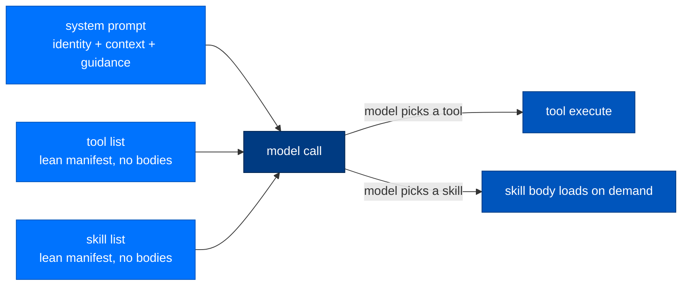
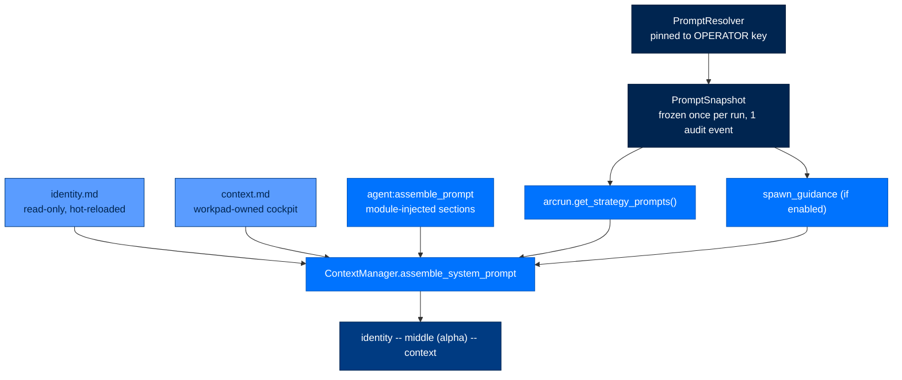
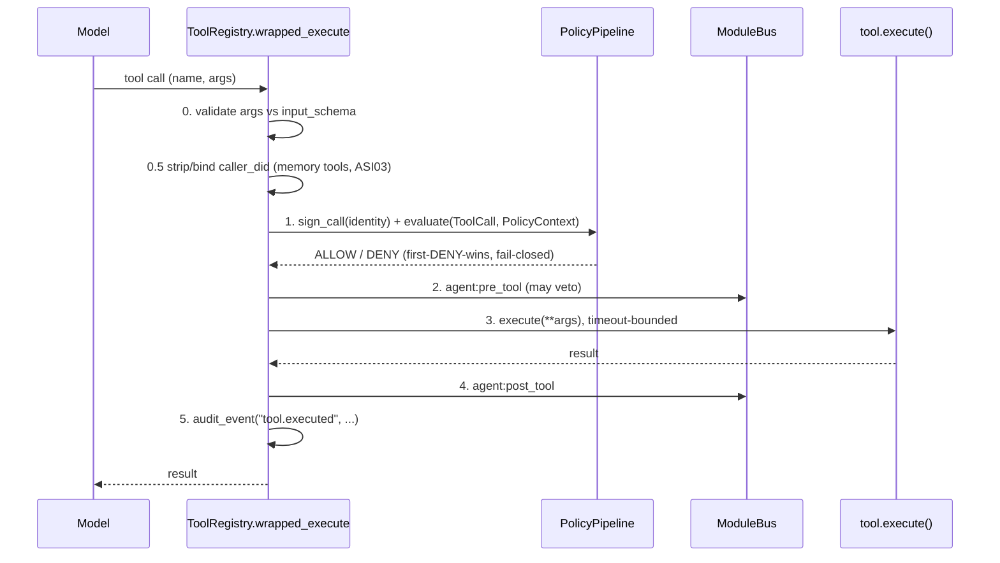
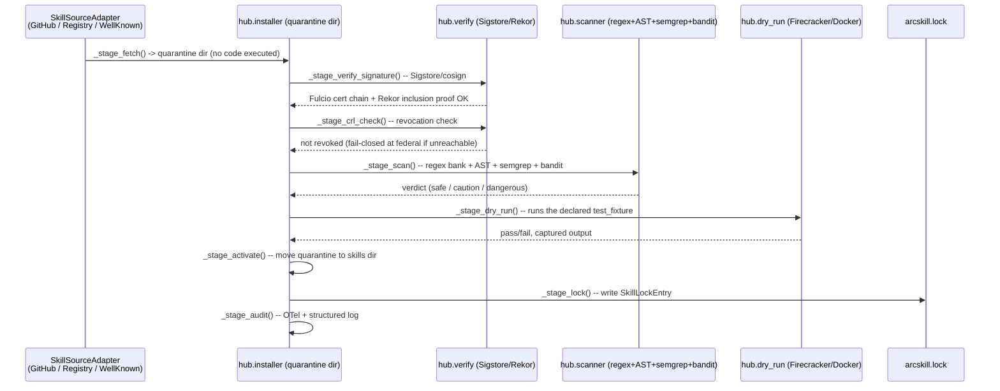
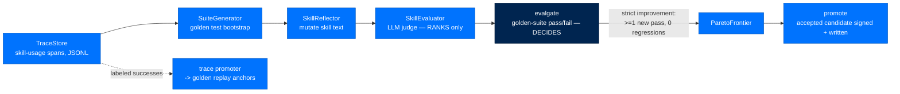

# 6. How System Prompts, Tools, and Skills Get Loaded

> **Who this is for:** anyone about to write or debug what an agent "knows" or
> "can do" — a new contributor, a security reviewer, or an operator writing an
> `identity.md`.
> **Read this after:** [`docs/05-steering-and-strategies.md`](05-steering-and-strategies.md) · **Read this next:** [`docs/07-memory-lifecycle.md`](07-memory-lifecycle.md)
> **Plain-language summary lives in:** the "In one breath" section below.

---

## In one breath

Every agent turn sends the model three things: a **system prompt** (who it is
and what's happened so far), a **tool list** (what it can do right now), and,
lazily, **skill bodies** (deeper how-to it only pays for when it reaches for
them). The system prompt is assembled fresh each turn from a handful of files
and modules — never hand-typed once and forgotten. Tools are Python functions
wrapped in a security envelope (schema check → authorization → execute →
audit) before the model ever sees them. Skills are optional, sandboxed,
signed folders of instructions an agent can install, use, and — if the
`arcskill` package is present — improve over time. Nothing reaches the model
unverified: every overlay, every dynamically-authored tool, and every
installed skill is checked against a signature before it can speak.



---

## Part A — the system prompt

### How it actually works

Prompt storage and resolution is owned by a dedicated leaf package,
**`arcprompt`** (`packages/arcprompt/src/arcprompt/`). "Leaf" is load-bearing:
`arcprompt` depends only on `arctrust`, and most consumers — `arcskill` in
particular — **never import it**. Instead, `arcagent` builds the resolver and
hands each consumer a plain `(package, name) -> body` closure
(`agent_prompt_resolve`, `packages/arcagent/src/arcagent/core/prompt_context.py:71`).
`arcskill/src/arcskill/context/__init__.py:9` states the invariant directly:
*"arcskill never imports arcprompt: it merely uses the resolver it is
handed."* This is dependency inversion applied to prompts — an operator can
override arcskill's improver prompts without arcskill ever knowing arcprompt
exists.

**The five pieces of `arcprompt`:**

| Module | Role |
|---|---|
| `catalog.py` (`PromptCatalog`) | Discovers every stock `.md` prompt shipped by installed packages (`context/` dir convention), read-only. |
| `document.py` (`PromptDocument`) | Parses a prompt file (YAML frontmatter + body) into a frozen, validated model. Identity is a `sha256` **derived from raw bytes**, never an authored `version:` field. |
| `resolver.py` (`PromptResolver`) | Two-layer, first-match resolution: agent overlay, else stock. A present-but-broken overlay raises — it never silently falls back to stock. |
| `verifier.py` (`SignatureVerifier`) | Verifies an overlay's detached signature against a **pinned** key. `None` pin fails closed — an unpinned floor is no floor. |
| `snapshot.py` (`PromptSnapshot`) | Freezes the whole prompt set once per run and emits one audit event enumerating every prompt's source, digest, and signer. |

**Overlay layout:** `<agent_root>/context/<package>/<name>.md` plus a
detached `<name>.md.arcsig` sidecar (`arcprompt/resolver.py:16`). A prompt
with no overlay silently resolves to the packaged stock — the normal path
most of the time.

**Overlays are pinned to the OPERATOR key, not the agent's own key.**
`prompt_context.py:35` loads `OperatorKey.load(default_operator_key_path())`
and pins that public key into the resolver. `OperatorKey`
(`packages/arctrust/src/arctrust/operator.py:89`) is deliberately **not** an
`AgentIdentity` — it has no `sign()`, no `did`, so the type system prevents
an agent from ever being mistaken for the audit/prompt authority that reviews
it: an agent cannot self-sign its own prompt overrides, only whoever holds
the deployment operator key can. Absent an operator key, the resolver still
resolves stock prompts — it just refuses every overlay.

### Assembly at turn time

`build_run_context` (`packages/arcagent/src/arcagent/core/agent_dispatch.py:42`)
is where the pieces converge for one turn:

1. **Freeze the prompt snapshot.** `_run_prompt_resolve` resolves the full
   catalog once via the agent's `PromptResolver` and emits one
   `prompt.snapshot` audit event (`agent_dispatch.py:130`). A bare/test agent
   with no resolver degrades to `arcprompt.load_stock` — stock-only, no crash.
2. **Strategy guidance.** `arcrun.get_strategy_prompts(tool_names=..., resolve=resolve)`
   supplies the ReAct/strategy-specific sections (arcrun-owned; see
   [`docs/05-steering-and-strategies.md`](05-steering-and-strategies.md)).
3. **Spawn guidance** (if `spawn.enabled`) is resolved and merged in.
4. **`ContextManager.assemble_system_prompt`**
   (`packages/arcagent/src/arcagent/core/session_internal/context.py:75`) does
   the actual assembly:
   - Reads `identity.md` and `context.md` from the workspace
     (`_CORE_PROMPT_FILES`, `context.py:33`) — re-read from disk **every
     call** (hot-reload contract) so an edit shows up next turn without a
     restart.
   - Emits `agent:assemble_prompt` on the module bus so any subscribed module
     can inject its own named section, query-conditioned on the current
     turn's task text. This is also **how the tool list reaches the prompt**:
     `agent_lifecycle.py:375` subscribes `_inject_capabilities` at priority
     85, writing `sections["capabilities"] = registry.format_for_prompt()`
     (the tool+skill XML manifest from Part B), and `:381` subscribes
     `_inject_skill_usage` at priority 91, adding a `skill_usage` section
     when any skills are registered. Memory recall and planning guidance
     inject the same way at their own priorities.
   - Merges the caller-supplied `extra_sections` (strategy + spawn guidance)
     in after the bus handlers run.
   - **Final order:** `identity` first, `context` last, everything else
     sorted alphabetically in between (`context.py:129-141`).



**Assembled prompt skeleton** (labels are the `--- name ---` markers
`context.py` emits):

```text
--- identity ---
<identity.md content — the agent's immutable goal charter>

--- <module-injected sections, sorted alphabetically> ---
<e.g. capabilities (tool+skill XML manifest, prio 85), memory recall,
 planning guidance, skill_usage (prio 91)>

--- spawn_guidance ---
<only if spawn.enabled>

--- strategy: react (or whichever strategy is active) ---
<arcrun strategy prompt>

--- context ---
<context.md content — the workpad's open-loops cockpit>
```

### `identity.md` is read-only; `context.md` is workpad-owned

Both claims are enforced in code, not just convention.
`DEFAULT_PROTECTED_NAMES = ("identity.md", "policy.md", "context.md")`
(`packages/arcagent/src/arcagent/tools/_validation.py:23`) is checked by the
built-in `write`/`edit` tools before every write
(`builtins/capabilities/write.py`, via `_runtime.check_protected`) — no tool
path lets the agent rewrite `identity.md` (ASI01 goal-hijack defense) or
touch `context.md` directly. `context.md` is instead rewritten by exactly
one thing: `packages/arcagent/src/arcagent/modules/workpad/__init__.py:3`
states it plainly, *"Sole writer of `context.md`."* A background eval-model
call rewrites it as a curated cockpit of open loops every `every_n_runs`
runs (`modules/workpad/_runtime.py`), with cadence counters persisted to
`.workpad-state.json` so a restart resumes mid-cadence, and DID-keyed,
fail-closed isolation (`WorkpadIsolationError`) against cross-agent state
bleed in a process hosting many agents (`_runtime.py:7-25`).

### Where to look — prompts

| Path | What lives there |
|---|---|
| `packages/arcprompt/src/arcprompt/catalog.py` | Stock-prompt discovery across installed packages |
| `packages/arcprompt/src/arcprompt/resolver.py` | Overlay-over-stock resolution, signature-gated |
| `packages/arcprompt/src/arcprompt/document.py` | Frontmatter + body model, byte-derived digest |
| `packages/arcprompt/src/arcprompt/snapshot.py` | Per-run freeze + provenance audit event |
| `packages/arcprompt/src/arcprompt/verifier.py` | Pinned-key signature verification |
| `packages/arctrust/src/arctrust/operator.py` | `OperatorKey` — the audit/overlay signing authority, distinct from any agent DID |
| `packages/arcagent/src/arcagent/core/prompt_context.py` | Builds the resolver, hands out the closure, snapshots at run start |
| `packages/arcagent/src/arcagent/core/session_internal/context.py` | `ContextManager.assemble_system_prompt` — the actual turn-time assembly |
| `packages/arcagent/src/arcagent/modules/workpad/` | Sole writer of `context.md` |
| `packages/arcagent/src/arcagent/context/*.md` | arcagent's own stock prompt bodies (spawn guidance, planner system, etc.) |
| `docs/prompts.md` | Full inventory of all 31 stock prompts across arcrun/arcagent/arcmemory/arcskill — read this for the complete catalog |

If you're changing what the model sees every turn, start in
`session_internal/context.py`. If you're changing *which bytes* a given
prompt resolves to, start in `arcprompt/resolver.py`.

---

## Part B — tools

### How it actually works

`ToolRegistry` (`packages/arcagent/src/arcagent/core/tool_registry.py:91`)
is the single place a tool becomes callable by the model. Its docstring
advertises **4 transports** — `ToolTransport` is a real enum with four
members (`packages/arcagent/src/arcagent/tools/_transport.py:27`).

> ⚠️ **Naming collision.** `arcagent.core.tool_registry.ToolRegistry`
> (startup-built, policy/audit-wrapping — described below) and
> `arcrun.registry.ToolRegistry` (`packages/arcrun/src/arcrun/registry.py:22`,
> per-run, freeze-on-construct) are two unrelated classes sharing a name in
> different packages; ADR-027 means the `arcrun` one. The `arcrun` registry
> is built fresh from arcagent's tool list and `freeze()`-d
> (`registry.py:32-34`) by `arcrun.loop` before turn 0 of every run
> (`packages/arcrun/src/arcrun/loop.py:66-69`) — `add()`/`remove()` raise
> `RuntimeError` after that point, so the tool set is byte-stable for the
> whole run (keeps the provider's prompt-cache prefix intact, and blocks a
> mid-run tool injection, ASI04/LLM06).

| Transport | Enum value | Status |
|---|---|---|
| Native (in-process, `@tool`-decorated) | `NATIVE` | **Wired.** Every real registration path (`builtins`, capability-loaded tools) constructs `RegisteredTool(transport=ToolTransport.NATIVE, ...)`. |
| MCP | `MCP` | **Enum + config only.** `MCPServerEntry` exists in `ToolsConfig` (`core/config.py:152-194`); nothing reads `mcp_servers` to spawn a connection or dispatch a call. `ADR-018-no-mcp-no-migration-no-acp.md` explicitly excludes an MCP client from scope. |
| HTTP | `HTTP` | **Enum + config only.** `HTTPToolEntry` is declared (`core/config.py:161`); no dispatch path constructs `transport=ToolTransport.HTTP`. |
| Process | `PROCESS` | **Enum + config only.** Same pattern — `ProcessToolEntry` is declared, never wired. |

> ⚠️ This is the "producers unwired" pattern named in `CLAUDE.md`: the shape
> exists for a future transport, but today only `NATIVE` tools run. Building
> an HTTP- or process-backed tool means writing the wiring, not configuring it.

**Builtins split across two packages, by ownership (`CLAUDE.md`'s "don't mix
concerns" rule):**

| Package | Path | Contents |
|---|---|---|
| `arcagent` | `packages/arcagent/src/arcagent/builtins/capabilities/` | Agent-identity-aware tools: `bash`, `read`, `write`, `edit`, `grep`, `find`, `ls`, `reload`, `store_secret`, plus the self-modification pair `create_skill`/`update_skill`/`create_tool`/`update_tool` |
| `arcrun` | `packages/arcrun/src/arcrun/builtins/` | Loop-primitive tools with no agent identity concept: `execute`, `contained_execute`, `task_complete` |

`arcrun`'s builtins are loop mechanics (how a ReAct turn signals completion or
runs a sandboxed command); `arcagent`'s are everything that needs an
identity, a workspace, or a signature.

**Schema and naming.** The `@tool` decorator (`tools/_transport.py`,
`tools/_decorator.py`) builds a JSON-schema `input_schema` from the Python
function signature via `_PY_TYPE_MAP`, producing a `RegisteredTool` dataclass
(`_transport.py:35`) with `transport`, `execute`, `capability_tags`,
`skill_backed`, `signals_completion`, and — the field policy keys off —
`classification` (`"read_only"` / `"state_modifying"`, **fail-closed default
`state_modifying`**). `ToolRegistry.register()` (`tool_registry.py:205`)
applies allow/deny policy filtering **at registration time** (startup or
reload), not per turn; `ToolRegistry.format_for_prompt()` renders the
allowed set into an XML `<available-tools>` block — name, description,
`when_to_use`, optional `example` — cached and invalidated on
`register()`/`unregister()`. `to_arcrun_tools()` (`tool_registry.py:269-314`)
is the separate, **per-turn** conversion step: it wraps each tool's execute
with the dispatch pipeline below and returns the `list[arcrun.Tool]` that
gets frozen into `arcrun.registry.ToolRegistry` for that run.

**Dispatch order** (`tool_registry.py:384-395`, every tool call, every
transport):



A `DENY` on the lethal-trifecta "forbidden composition" rule specifically can
pause for a one-shot, operator-signed human approval
(`_resolve_forbidden_composition`, `tool_registry.py:343`) rather than dying
outright — every other `DENY` is terminal. See
[`docs/10-security-model.md`](10-security-model.md) for the full policy-layer
and trifecta model; this doc only covers where authorization sits in the
dispatch path. The engine (`PolicyPipeline`, `Decision`, per-tier layers)
lives in `arctrust.policy` and is re-exported through
`packages/arcagent/src/arcagent/core/tool_policy.py` — arcagent does not
reimplement it. `tool_policy_bridge.py` owns one narrow defense: stripping
LLM-injected identity arguments (`caller_did`, `user_did`, `owner_did`) from
memory-tool calls before they reach policy or execution, so a prompt-injected
argument can never impersonate another identity.

**Capabilities — the resolution layer above the registry.**
`packages/arcagent/src/arcagent/capabilities/` is where tools and skills get
*discovered* before `ToolRegistry` ever sees them. `CapabilityLoader`
(`capabilities/capability_loader.py:1-34`) scans four roots in precedence
order — `arcagent/builtins/capabilities/` (package-internal), `~/.arc/capabilities/`
(global extensions), `<agent_root>/capabilities/` (agent-declared), and
`<agent_root>/workspace/capabilities/` (agent-authored at runtime). Only
root 1 (plus `builtins-skills`) is trusted outright; the other three are
**untrusted** (`_UNTRUSTED_ROOTS`, `capability_loader.py:84-93`) and go
through AST validation, the Sign/TOFU gate, and restricted builtins before
anything imports. `CapabilityRegistry` holds the resolved set;
`bridge_capability_tools_to_registry`
(`packages/arcagent/src/arcagent/core/agent_lifecycle.py:281`) registers
each capability tool into `ToolRegistry` as `ToolTransport.NATIVE` — the
seam where "discovered capability" becomes "model-callable tool."
`inventory.py` (`capabilities/inventory.py:1-14`) is the **one read seam
arcui is allowed to import**, enumerating every skill/tool with the
loader's verbatim verdict (`loaded`, `unsigned`, `invalid`, a TOFU decision)
so the UI never globs capability directories itself.

`ADR-023-capability-resolution-and-arcrun-provider.md` is the design record
for the layer above the loader: a unified `CapabilityProvider` Protocol
(owned by `arcrun`, implemented by `arcagent`'s `AgentCapabilityProvider`,
`capabilities/provider.py:52`) that advertises a **lean manifest** (name,
kind, "use when", schema — no bodies) and lazily `load()`s a skill's full
body only when the model calls for it. Precedence across the four roots is
**last-wins**, but trust is a separate axis: last-wins governs *who wins a
name collision*, signature + policy governs *what may load at all* — an
unsigned workspace file can never silently shadow a builtin.

**Dynamic capabilities must be signed (SPEC-033).** An agent can author its
own tools and skills at runtime via the `create_skill`/`create_tool` builtins.
Both call `_runtime.sign_artifact_file` on write and, if signing fails,
append an explicit unsigned-artifact warning to the returned message rather
than reporting a bare "Created." `resign_if_previously_signed` also catches
a plain `write`/`edit` call later mutating an already-signed artifact and
leaving a stale `.arcsig` sidecar — it refreshes the signature so the next
load-time verify doesn't fail closed on a self-inflicted mismatch.

### Where to look — tools

| Path | What lives there |
|---|---|
| `packages/arcagent/src/arcagent/core/tool_registry.py` | The registry: register, policy-wrap, dispatch, audit |
| `packages/arcagent/src/arcagent/tools/_transport.py` | `ToolTransport` enum, `RegisteredTool`, `@native_tool` schema builder |
| `packages/arcagent/src/arcagent/core/tool_policy.py` | arcagent's re-export of `arctrust.policy` (the pipeline lives there) |
| `packages/arcagent/src/arcagent/core/tool_policy_bridge.py` | Caller-DID stripping/binding for memory-scoped tools |
| `packages/arcagent/src/arcagent/builtins/capabilities/` | Identity-aware built-in tools (bash, file I/O, self-modification) |
| `packages/arcrun/src/arcrun/builtins/` | Loop-primitive tools (execute, contained_execute, task_complete) |
| `packages/arcagent/src/arcagent/capabilities/capability_loader.py` | Four-root discovery, AST validation, Sign/TOFU gate |
| `packages/arcagent/src/arcagent/capabilities/capability_registry.py` | Where discovered tools/skills/hooks land |
| `packages/arcagent/src/arcagent/capabilities/inventory.py` | Read-only enumeration seam for arcui |
| `packages/arcagent/src/arcagent/capabilities/provider.py` | `AgentCapabilityProvider` — arcrun's `CapabilityProvider` contract |
| `docs/architecture/decisions/ADR-018-no-mcp-no-migration-no-acp.md` | Why MCP client support is explicitly out of scope |
| `docs/architecture/decisions/ADR-023-capability-resolution-and-arcrun-provider.md` | Lazy-load contract, precedence, trust axis |
| `walkthroughs/arcagent/02-tool-integration.ipynb` | Runnable walkthrough of registering and calling a tool |

If you're adding a tool, start in `builtins/capabilities/` (identity-aware)
or `arcrun/builtins/` (pure loop mechanic) depending on which side of the
`CLAUDE.md` concern boundary it falls on. If you're changing authorization,
start in `arctrust.policy` (the engine), not `tool_registry.py` (the
integration point) — see `docs/10-security-model.md`.

---

## Part C — skills

### How it actually works

Skills are optional. `arcagent` ships **improver-less by default**
(`packages/arcagent/src/arcagent/skilladapt/protocol.py:3`): the structural
`SkillAdapter` Protocol and its no-op `NullSkillAdapter` mean `pip install
arcagent` alone runs end-to-end with skill improvement silently doing
nothing — zero files written. Turning it on means selecting the `arcskill`
adapter in `[modules.skills] adapter = "arcskill"`
(`skilladapt/select.py:8`), which lazily imports
`arcskill.improver.ArcSkillImprover`. This is the ruling behind "arcskill is
an optional supercharger, not a hard dependency": arcagent manages the
skill *catalog* (discovery, loading, invocation) entirely on its own via
`CapabilityLoader`; arcskill only adds self-improvement on top, in exactly
one package (`arcskill.improver`) — never a separate `arcevolve`-style
package.

**`arcskill`'s three areas** (`packages/arcskill/src/arcskill/`):

| Dir | Owns |
|---|---|
| `context/` | arcskill's own stock prompts (judge rubric, suitegen prompt, reflection prompt, ...) — resolved through the handed-in closure described in Part A, never through a direct `arcprompt` import |
| `hub/` | The install pipeline: fetch → verify → scan → sandbox → activate → lock → audit |
| `improver/` | The self-improvement loop: trace collection, mutation, evaluation, gating, promotion |

A skill is authored and read as a `SKILL.md` bundle throughout — the
improver's `build_bundle_view(skill_name, skill_dir / "SKILL.md")`
(`improver/improver.py:82`, `improver/sandbox_runner.py:154`) is the same
file shape `create_skill` scaffolds (Part B) and the hub installs.

`lock.py` (`packages/arcskill/src/arcskill/lock.py`) records every
hub-installed skill in `~/.arc/skills/.hub/lock.json` — content hash, Rekor
UUID, SLSA level, scanner verdict — written atomically (temp file +
`os.replace`) so a crash never leaves a partial record.

### The load path — hub install pipeline

`hub/installer.py`'s `install()` runs its stages inside a **quarantine
directory** (`installer.py:1-13`) over an `InstallContext`, cleaning up that
directory on any exception:



Each stage is fail-closed at federal tier: `SigstoreUnavailable` aborts
install rather than skipping verification; `SandboxRequired` aborts if
Firecracker is unavailable rather than falling back to an unsandboxed dry
run. Personal/enterprise degrade with a logged warning instead of aborting.
`install_path = "cli_only"` in config is a hard gate — **no agent-driven
install path exists**; only the CLI may call `hub.installer.install()`
(`hub/installer.py:22`).

**Signing.** Hub-installed skills are verified with **Sigstore + Rekor**
(`hub/verify.py:1-67`): Fulcio certificate chain check, Rekor
transparency-log inclusion proof, SLSA in-toto attestation parsing, and a
CRL revocation check (fail-closed at federal if unreachable).
Personal/enterprise sources with no configured signer identity still get
full chain + Rekor verification — only the SAN/issuer check relaxes, with
an audit warning. Self-signed bundles are allowed at personal tier with
that same warning, never a silent pass. This is a **separate signing path**
from the Ed25519/DID signing `create_skill`/`create_tool` use
(`arcagent.capabilities.artifact_signing`, Part B) — two mechanisms for two
provenance stories: an agent's own hand-authored artifact vs. a bundle that
arrived with real external OIDC provenance.

`CapabilityLoader` bridges the two through a structural `TrustBackend`
Protocol (`arcagent/capabilities/trust_backend.py:26`) so the verification
mechanism is swappable per source: `Ed25519TrustBackend` for self-authored
artifacts (the default), or `HubTrustBackend`
(`arcskill/hub/trust_backend.py:36`) — re-running Sigstore/Rekor at load
time, since a signed bundle can be tampered on disk between install and
load — for hub-sourced skills.

> ⚠️ Per `hub/trust_backend.py:15-17`'s own TODO, the loader currently
> holds **one** `trust_backend` for all untrusted roots; per-root selection
> (Ed25519 for agent/workspace, `HubTrustBackend` for the hub-sourced global
> root) is not wired by default — another instance of the producers-unwired
> pattern, this one on the load-time re-verification path specifically.

**Post-install**, discovery goes through the same four-root `CapabilityLoader`
scan from Part B — an installed skill's `SKILL.md` gets AST-validated and
Sign/TOFU-gated like any other capability, then enters progressive
disclosure: the body only reaches the model when it calls `use_skill` (or a
`requires_skill`-tagged tool activates it, per ADR-023).

### The improver loop

The optimization loop (`packages/arcskill/src/arcskill/improver/engine.py`,
`SkillOptimizer.optimize`) is wired into the running agent, not a standalone
script: `modules/skills/_runtime.py` configures a per-agent Curator
background sweep (`sweep_poll_seconds`, default hourly) that drives
`ArcSkillImprover` through its `SkillAdapter` Protocol methods —
`observe()` on every tool call, `on_turn_end()` at turn boundaries,
`maybe_improve()` when usage warrants a pass, and `review_lifecycle()` /
`sweep_suites()` on the proactive tick.



The load-bearing design point (`improver/evalgate.py:1-22`): the LLM judge
only *ranks* the Pareto frontier of candidates; a deterministic golden-task
suite *decides* acceptance. A mutation is accepted only when it makes at
least one previously-failing golden case pass **and regresses none** — ties
and neutral drift are rejected, not just losses. A `code`-mutation candidate
with no golden suite at all is blocked at **every** tier, personal included
— self-modifying code without a test oracle never ships. A `prose`-only
mutation with no suite is allowed at personal (audit-warned) but blocked at
enterprise/federal.

When a skill has no suite, `SuiteGenerator` (`improver/suitegen.py`)
proposes candidate golden cases from the skill's own
Contract/Examples/Validation prose, runs each through AST-parse →
anti-tautology check → sandboxed flake runs → a negative-control mutation
probe, and adopts only survivors — quarantining the rest as improvement
targets. Provenance is structural: adopted cases carry an `@generated`
docstring marker cross-checked against a harness-written
`evals/.manifest.json`; a human edit changes the hash and reclassifies the
case as human-authored, so the model can never self-assert authorship it
doesn't have (`evalgate.py:14-18`). Every mutated skill the engine writes is
signed by the same agent-DID `Signer` seam `create_skill` uses
(`engine.py:51-54`), so the hub re-verifies it identically on reload.

### Where to look — skills

| Path | What lives there |
|---|---|
| `packages/arcagent/src/arcagent/skilladapt/protocol.py` | The `SkillAdapter` Protocol + `NullSkillAdapter` default |
| `packages/arcagent/src/arcagent/skilladapt/select.py` | Config-driven adapter selection (`none` / `arcskill` / BYO dotted path) |
| `packages/arcagent/src/arcagent/modules/skills/` | The thin arcagent-side wiring: signer, audit sink, approval provider, outcome classifier |
| `packages/arcskill/src/arcskill/hub/installer.py` | The 8-stage install pipeline orchestrator |
| `packages/arcskill/src/arcskill/hub/verify.py` | Sigstore/Rekor/SLSA/CRL verification |
| `packages/arcskill/src/arcskill/hub/scanner.py`, `_ast_scanner.py`, `_secret_patterns.py` | Multi-layer static security scanning |
| `packages/arcskill/src/arcskill/hub/dry_run.py`, `_docker.py`, `_firecracker.py` | Sandboxed dry-run backends |
| `packages/arcskill/src/arcskill/hub/sources.py` | Pluggable fetch adapters (GitHub release, HTTP registry, `agentskills.io`-style well-known endpoint) |
| `packages/arcskill/src/arcskill/lock.py` | Install ledger (`~/.arc/skills/.hub/lock.json`) |
| `packages/arcskill/src/arcskill/improver/engine.py` | `SkillOptimizer` — the orchestrator |
| `packages/arcskill/src/arcskill/improver/suitegen.py` | Golden-suite bootstrap for suite-less skills |
| `packages/arcskill/src/arcskill/improver/evalgate.py` | The hard acceptance gate |
| `packages/arcskill/src/arcskill/improver/promote.py` | Verified traces → golden replay anchors |
| `packages/arcskill/src/arcskill/improver/pareto.py` | Multi-objective candidate frontier |
| `walkthroughs/arcskill/01-skill-self-improvement.ipynb` | Runnable walkthrough of the improver loop |

If you're adding a skill by hand, start with `create_skill`
(`packages/arcagent/src/arcagent/builtins/capabilities/create_skill.py`) —
it scaffolds the required seven sections and signs the result. If you're
changing what makes a mutation acceptable, start in `improver/evalgate.py`,
not `improver/evaluator.py` (that's the ranker, not the gate).

---

## Unverified / out of scope for this doc

- `SkillAdapter.sweep_suites()`'s cadence relative to the hourly Curator
  sweep was read from `modules/skills/_runtime.py`'s constants, not traced
  through a live run — treat `sweep_poll_seconds` as source, not observation.
- Whether any deployed `arcagent.toml` in this repo sets
  `[modules.skills] adapter = "arcskill"` was not checked; this doc
  describes the mechanism, not current deployment state.
- HTTP/process/MCP transport wiring was confirmed absent by exhaustive grep
  for `ToolTransport.HTTP` / `.PROCESS` / `.MCP` construction sites as of
  this writing; a future change could add one without updating this doc.
