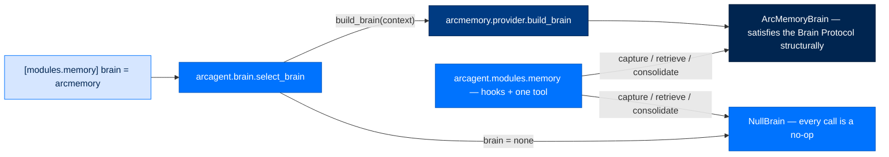
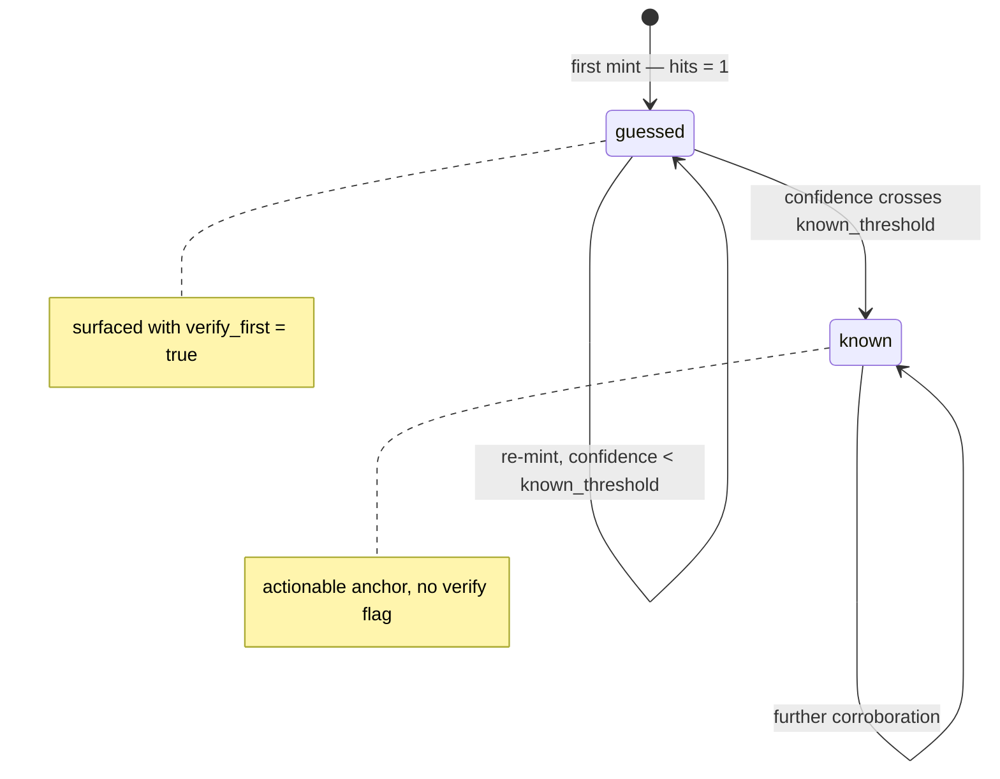
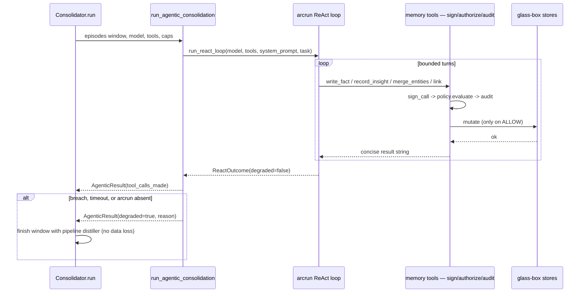
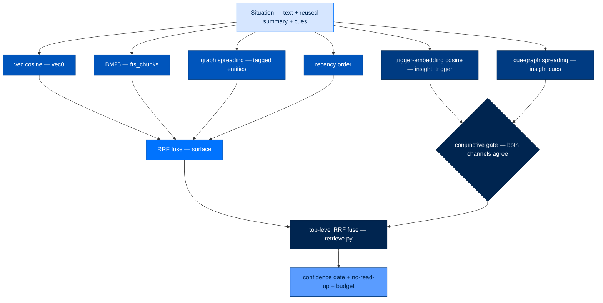
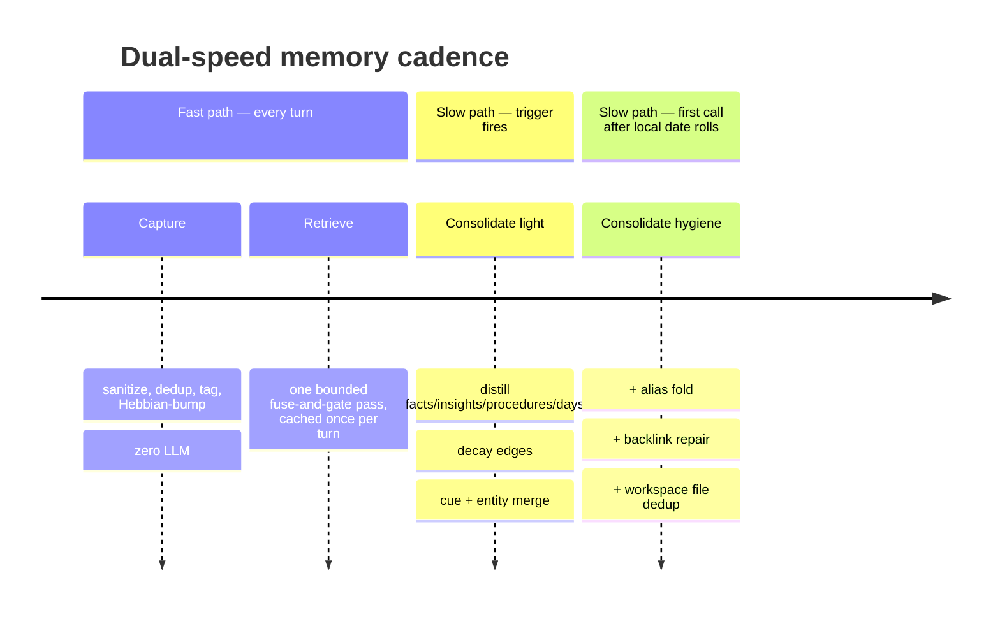
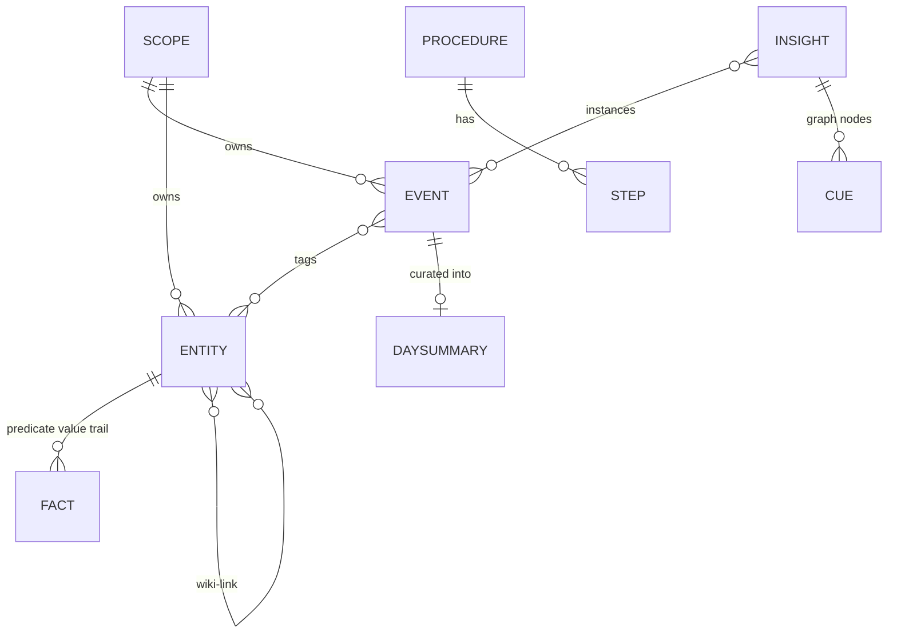

# 7. The Memory Lifecycle — How Information Gets In, and How It Comes Back

> **Section:** 2. System Walkthroughs · **Topic:** The Engine
> **Who this is for:** anyone extending or auditing Arc's memory package — the
> question this doc answers is "when the agent sees or says something, how does
> that become durable memory, and how does it come back later?"
> **Read this after:** [`docs/06-prompts-tools-skills.md`](06-prompts-tools-skills.md) · **Read this next:** [`docs/08-data-storage.md`](08-data-storage.md)
> **Plain-language summary lives in:** the "In one breath" section below.
> **See also:** [DATA_FLOW.md](DATA_FLOW.md), [PACKAGE_INDEX.md](packages/arcmemory.md)

---

## In one breath

Think of Arc's memory like a person who jots quick notes all day, then — while
they sleep — rereads those notes, decides what's actually worth remembering,
writes it into a tidy notebook, and notices patterns across days ("every time a
vendor stalls, I should escalate by day three"). The next time a similar
situation comes up, they don't just search the notebook for matching words —
they recognize the *shape* of the situation, even if none of the words match.
In Arc, the "quick notes" step is cheap and instant; the "reread and organize"
step is the only part that costs an LLM call and it runs on a schedule, not on
every turn; and the "recognize the shape" step is what makes recall useful
across genuinely different-sounding conversations. Everything below is the
mechanics of those three steps, plus who is allowed to read what.

The memory package is **arcmemory** — a standalone dependency arcagent talks to
through one narrow interface. arcagent itself remembers nothing.

---

## How it actually works

### The structural invariant: arcagent is a memory socket, not a brain

The single rule nobody may break: **all memory cadence, scheduling, and logic
live in arcmemory. arcagent holds a structural interface and nothing else.**

arcagent defines `Brain` as a `Protocol` — four async methods (`capture`,
`retrieve`, `consolidate`, `rebuild_index`) speaking only primitives
(`str`/`int`/`float`) — plus a `NullBrain` that no-ops every one of them
(`packages/arcagent/src/arcagent/brain/protocol.py:26`). With `NullBrain`
active (the default — `brain = "none"` in config), memory is a silent no-op:
no files, no LLM calls, no capture. arcagent's own source contains **zero**
memory logic; the thin wiring module
(`packages/arcagent/src/arcagent/modules/memory/capabilities.py`) only calls
whichever `Brain` is configured and reacts to its `authorize` verdict.

arcmemory satisfies that Protocol *structurally* — `ArcMemoryBrain`
(`packages/arcmemory/src/arcmemory/brain.py:61`) never imports `arcagent`. This
isn't a convention, it's enforced:
`packages/arcmemory/tests/architecture/test_no_arcagent_import.py`
statically parses every `arcmemory` source file and fails the build if any
module imports `arcagent`. The same test confines the one exception —
`arcrun`, used for the bounded agentic sleep pass — to a single file,
`react_adapter.py`, so a future harness (openclaw, Hermes) can add a sibling
adapter instead of touching the rest of the package.

The two sides meet at one factory call. arcagent's `select_brain`
(`packages/arcagent/src/arcagent/brain/select.py:44`) resolves the
`[modules.memory] brain` config string — `"none"`, a backend package name, or
a dotted `module:Class` BYO path — and, for a named backend, lazily imports it
and calls its well-known `build_brain(context)` entrypoint. arcmemory's side of
that contract is `packages/arcmemory/src/arcmemory/provider.py:37`, which reads
an opaque `context["backend_config"]` dict arcagent never inspects and wires up
`ArcMemoryBrain` with an arcllm-backed embedder/distiller. Neither module knows
the other's internal field names — the seam is genuinely generic.

### Dual-speed, per-scope stores

Every memory operation is keyed by a `Scope` — an `agent_did`, optionally
narrowed by `session_id` (`packages/arcmemory/src/arcmemory/types.py:43`). No
table or file ever mixes two scopes' content; this is the shared-nothing
isolation boundary (OWASP LLM08).

Two speeds, over five on-disk stores (`packages/arcmemory/src/arcmemory/stores/`):

| Speed | Module | What it does | Cost |
|---|---|---|---|
| Fast | `capture.py` — `FastCapture` | sanitize → dedup → tag → Hebbian-bump → append | zero LLM, zero embedding, constant time |
| Fast (read) | `retrieve.py` — `Retriever` | one bounded fuse-and-gate pass, no re-query | zero-to-one embed call, no LLM |
| Slow ("sleep") | `consolidate.py` — `Consolidator` | distill, decay, dedup, reindex | one bounded LLM pass (or a ReAct agent), on a cadence |

| Store | File | Holds | Written by | Read for |
|---|---|---|---|---|
| Episodic | `stores/episodic.py` | the raw event stream (SQLite `episodic` table) — every capture, append-only, per-scope monotonic `seq` | `FastCapture.capture` | consolidation input, enrichment context |
| Semantic | `stores/semantic.py` | entity cards (`memory/entities/<slug>.md`) — `predicate: value` fact triplets + wiki-links | distillation (`write_fact`), the agentic tools | facts, structural enrichment |
| Insight | `stores/insight.py` | minted abstractions (`memory/insights/<id>.md`) — the analogical-retrieval centerpiece | `mint_insights` / the agentic `record_insight` tool | structural recall |
| Procedural | `stores/procedural.py` | how-to cards (`memory/procedures/<slug>.md`) — reusable methods, not tool sequences | `extract_procedures` / `record_procedure` | recall, skill improvement |
| Daily notes | `stores/daily.py` | curated per-day rollup (`memory/daily-log/YYYY-MM-DD.md`) — meeting-minutes bullets, **not** a transcript | `_summarize_days` | human/operator review, surface index source |

The raw episodic stream is the only place a full transcript ever lands; the
daily-notes file is a distilled *summary* built from it, never a copy of it —
`capture.py`'s own docstring is explicit that "the human-readable curated
daily-notes are written by the slow consolidation path, not here."

### The information path — the centerpiece

This is the walk from "the agent said or did something" to "a later, unrelated
turn recalls the *pattern* of it."

```mermaid
flowchart LR
    See["1 See — FastCapture.capture"]:::entry --> Curate["2 Curate — curate_for_distillation"]:::agent
    Curate --> Distill["3 Distill — Distiller extract_facts / mint_insights / extract_procedures"]:::llm
    Distill --> Consolidate["Consolidator.run — orchestrates 3-7"]:::agent
    Consolidate --> Dedup["4 Dedup / hygiene — merge_entities, merge_cues, dedup_workspace"]:::agent
    Dedup --> Index["5 Index — SurfaceIndex + StructuralIndex"]:::runtime
    Index --> Retrieve["6 Retrieve / fuse — Retriever.retrieve"]:::runtime
    Retrieve --> Enrich["7 Enrich — spot then enrich"]:::runtime
    Enrich --> Prompt["boundary-marked memory-result block"]:::surface

    classDef entry   fill:#D6E6FF,stroke:#0073FE,color:#002550
    classDef surface fill:#5A9CFF,stroke:#003B82,color:#002550
    classDef agent   fill:#0073FE,stroke:#0055BC,color:#FFFFFF
    classDef runtime fill:#0055BC,stroke:#003B82,color:#FFFFFF
    classDef llm     fill:#003B82,stroke:#002550,color:#FFFFFF
    classDef found   fill:#002550,stroke:#001A38,color:#FFFFFF
```

#### 1. See — capture

Capture hooks fire on `agent:post_tool`, `agent:pre_respond` (the user's task
text), and `agent:post_respond` (the assistant's reply) —
`packages/arcagent/src/arcagent/modules/memory/capabilities.py:183`. Each
becomes one `FastCapture.capture()` call
(`packages/arcmemory/src/arcmemory/capture.py:64`): `sanitize → privacy_filter
→ dedup` (injection-pattern stripping, secret redaction, windowed content-hash
dedup), a deterministic entity-tag pass, then a Hebbian bump on the weighted
graph for every co-tagged entity pair. **This step sees only what it's
handed** — one event's text at a time, zero LLM, zero embedding — never "the
whole transcript." Low-signal tool results are filtered before they're worth
capturing at all (`_worth_capturing_tool`, min 24 chars, excludes
`memory_search`'s own output so recall never feeds back into itself).

#### 2. Curate — the first filter, before any LLM sees anything

`curate_for_distillation` (`packages/arcmemory/src/arcmemory/curate.py:26`) is
a pure, deterministic kind-based filter run on the whole window *before*
distillation. **Verified: distillation learns from the session conversation
only** — by default it keeps events whose `kind` is `user` or `respond`
(`_DEFAULT_CONVERSATION_KINDS`, `config.py:29`) and drops every `tool` frame
and other operational kind. This is not the LLM being told to ignore
noise — the noise is removed before the call exists, so the model cannot mint
a fact about the agent's own tool-running mechanics even if it tried.

#### 3. Distill — the one LLM path

`distill.py` defines the `Distiller` Protocol (`packages/arcmemory/src/arcmemory/distill.py:145`):
five bounded, single-shot structured completions, no agentic loop —
`extract_facts`, `mint_insights`, `extract_procedures`, `summarize_day`,
`confirm_entity_merges`/`disambiguate_entity`. Production wires
`ArcLLMDistiller` (`arcllm_seam.py:86`); each call is one JSON-mode completion
through `arcllm`, loaded fresh per call so it rides arcllm's own budget/circuit
breaker.

What comes out and where it lands:

- **Facts** — semantic triplets applied *additively*: a changed value never
  overwrites, it folds the prior into a `| was: prior .conf` trail
  (`SemanticStore.write_fact`), and confidence grows with corroboration
  (`confidence_from_hits`, `1 - e^(-gamma*hits)`).
- **Insights** — the centerpiece. Each carries a `trigger` (the situation
  stated at the *mechanism* level, surface stripped), `cues[]` (abstract tags
  from the controlled vocabulary — real graph nodes), and `instances[]`
  (episode ids it generalizes). A first mint is `guessed`; re-minting
  accumulates hits until confidence crosses `known_threshold`, promoting to
  `known`.
- **Procedures** — verified: these are LLM-derived reusable *methods*
  ("how a stock is analyzed," "how a customer is quoted"), not recorded tool
  sequences — `stores/procedural.py`'s own docstring states this explicitly.
  A re-extracted procedure bumps `use_count` rather than duplicating.
- **Day summaries** — meeting-minutes bullets (timeline, discussions,
  decisions, people, goals, tasks), merged additively into the existing day's
  file so a later run grows the notes instead of clobbering them. People
  bullets are wiki-linked to entity cards.

Every entity write goes through `resolve_entity` (search-before-write,
`distill.py:198`) first: an exact canonical-slug or alias hit wins outright; an
embedder lets a same-type name at/above `entity_merge_threshold` fold
automatically; a distiller lets an *ambiguous* near match (a narrower band) get
one bounded disambiguation call. Absent both, the candidate is new.

#### The sleep pass — agentic by default, pipeline as fallback

`Consolidator.run()` (`packages/arcmemory/src/arcmemory/consolidate.py:181`) is
the orchestrator. The DISTILL step (facts/insights/procedures) routes through
one of two engines, controlled by `consolidate_engine` (default `"agentic"`):

- **Agentic** (default, when a `model` is wired): a *bounded ReAct loop* runs
  over the memory tools (`agent_consolidate.py:49`) — it reads recent
  episodes, searches before writing, extracts durable facts/insights/
  procedures, merges duplicates, links related memories, and stops. Every tool
  call is individually signed, authorized, and audited (see Security, below),
  so partial progress is always safe.
- **Pipeline** (fallback, or `consolidate_engine = "pipeline"`): the
  deterministic single-shot `Distiller` calls described above, run directly.

The agentic engine reaches arcrun through exactly one seam,
`react_adapter.run_react_loop` (`packages/arcmemory/src/arcmemory/react_adapter.py:95`)
— the *only* file in arcmemory allowed to import `arcrun` (enforced by the
architecture test above). A wall-clock timeout, a bounded-loop breach
(`max_turns`/`max_tokens`/`runaway_loop`/`error_cascade`), or arcrun simply not
being installed all collapse to the same `degraded=True` signal — never a
crash — and the caller finishes the same window with the pipeline distiller.
This is also why arcmemory could run under a different harness (openclaw,
Hermes) some day: only this one adapter would need a sibling.

The cadence is arcmemory's decision, not arcagent's: arcagent's background
task (`memory_consolidate_loop`, polling every 300s) calls `Brain.consolidate()`
on a trigger (event-count threshold, idle seconds, or a time interval — any
one fires it), but arcmemory internally decides *which* pass actually runs —
the light per-interval pass (`due()`, gated by a persisted `.consolidate-last-run`
stamp, default 60 min) or, on the first call after the local date rolls over,
the heavier nightly **hygiene** pass.

#### 4. Dedup / hygiene — two distinct mechanisms, correctly separated

There are two different dedup concerns in this codebase, and it matters to
keep them apart:

1. **Same-real-world-entity merge** (`consolidate.py`'s `merge_entities()`,
   run on *every* consolidation pass, not just nightly hygiene). Same-type
   entity names are embedded and clustered at a **wide** candidate threshold
   (`entity_merge_candidate_threshold`, 0.80 personal / 0.85 federal) into
   *possible*-duplicate clusters — never merged on that alone. Each cluster of
   ≥2 goes to one bounded LLM call (`EntityMergeConfirmer.confirm_entity_merges`)
   that conservatively decides which cards are genuinely the same entity; only
   confirmed sub-groups fold, into the richest survivor (most facts wins), with
   graph edges repointed. A card with no same-type neighbor above the bar costs
   no LLM call. **Verified — this degrades loud, not silent:** with no embedder
   or no confirmer wired, `_emit_dedup_skipped` logs a `WARNING` and emits a
   `memory.dedup_skipped` audit event rather than quietly merging nothing.
   `_merge_entities_deterministic()` separately folds any card whose slug
   matches a recorded alias — no embedder needed.
2. **Pre-canonicalization file dedup** (`hygiene.py`, nightly hygiene only).
   Before slug canonicalization existed, the distiller sometimes wrote the
   same real thing under several free-text slugs ("Custom ERP.md",
   "custom-erp.md"). `dedup_workspace()` groups files by canonical slug,
   unions their content (highest-confidence fact per predicate wins), writes
   one canonical file, deletes the variants — file-level, no LLM, idempotent.
   `repair_backlinks()` (also hygiene-only) writes the reciprocal edge into a
   wiki-link's *target* card, since `[[dst]]` only writes `links_to` source-side.

Cue merging (`consolidate.py`'s `merge_cues()`) is a third, separate routine:
near-duplicate abstract cues (e.g. two insights independently minting
"vendor-stall" vs "vendor-delay") are embedding-clustered at a fixed 0.92
cosine and collapsed to one canonical cue, with every referencing insight and
graph edge repointed.

#### 5. Index — surface vs. structural

Two channels, over two separate indices, is the differentiator worth
understanding precisely:

| | Surface (`index/surface.py`) | Structural (`index/structural.py`) |
|---|---|---|
| Question answered | "what past text *looks like* this query" | "what past *pattern* does this instance, even with zero surface overlap" |
| Space | raw chunk text | abstraction — an insight's `trigger` + `cues` |
| Channels fused | vec cosine (`vec0`) + BM25 (`fts_chunks`) + graph spreading + recency, all RRF-fused | (a) trigger-embedding cosine against `insight_trigger` (kept apart from `vec0`) + (b) cue-graph spreading activation over the same weighted graph |
| Gating | none — RRF rank alone | **conjunctive**: a candidate must clear *both* channels before promotion (false-positive control); if the trigger channel is unavailable, cue-graph alone stands in (degrade) |
| Cost | brute-force cosine over tens-of-thousands of chunks, <20ms, no ANN needed | zero-LLM; embeds only the abstraction text (reused turn summary, no new LLM call — see below) |

The structural channel is the "recognize the shape" step from the opening
analogy: an insight's `cues` are graph nodes, so a *completely different*
situation whose tagged entities happen to be graph-neighbors of those cues can
still light the insight through spreading activation — the raw text never has
to share a token with any instance episode. Once both sides are stated at the
mechanism level, the trigger-embedding channel closes the surface-distance gap
that would defeat a raw-text embedding comparison.

Both indices index the *same* underlying units — curated markdown files under
`entities/insights/procedures/daily-log`, then every raw episodic event
(`index/source.py`'s `iter_source_chunks`) — walked identically by the
incremental indexer and the deterministic rebuilder so the two can never
drift. Indexing is content-hash-gated: only new/changed chunks are re-embedded.

Degrade, both channels: no `sqlite-vec` extension loaded, or no embedder
wired, drops the vec/trigger list and emits a `recall.degraded` audit event —
BM25 + graph (surface) or cue-graph alone (structural) still answer. Nothing
raises.

#### 6. Retrieve / fuse — the single bounded read path

`Retriever.retrieve()` (`packages/arcmemory/src/arcmemory/retrieve.py:86`) is
deliberately **not** an agentic loop: one pass, top-k + token budget, no
re-query (bounded consumption, OWASP LLM10). It fuses the surface and
structural result lists with RRF again at the top level, flags `guessed`
insights `verify_first`, drops anything the caller's clearance doesn't
dominate (`gate_no_read_up` — see Security), and truncates to a token budget,
dropping the lowest-ranked items first. The result is either the injectable
`Bundle.text` (a boundary-marked `<memory-result>` block, framed as data, never
instructions — LLM01) or, via `recall_cards()`, structured `RecallCard`s
carrying provenance and outbound `[[links]]` for the agent-facing `recall`
surface. **`memory_search` is the one agent-facing tool** — it's the only
`@tool` the memory wiring module registers
(`packages/arcagent/src/arcagent/modules/memory/capabilities.py:240`), and it
delegates straight to `Brain.retrieve`. The dozen `recall_surface` /
`write_fact` / `record_insight` / etc. tools built by `tools.py`'s
`build_memory_tools` are a *separate* set, used only internally by the
agentic sleep-pass ReAct loop — they are never exposed to the main agent's turn.

Retrieval also reuses the turn's already-computed summary rather than making a
new LLM call to abstract the query (`summary` param, threaded from
`ctx.data["summary"]` down to `Situation.summary`) — a design choice that keeps
the structural channel cheap on every turn.

#### 7. Enrich — "spot, then enrich"

Once an insight is promoted, `StructuralIndex.enrich()`
(`packages/arcmemory/src/arcmemory/index/structural.py:242`) — called
automatically inside `match()`, or directly by a consumer like arcui — bundles
it with the episodes it generalizes (`instances`), the entities those episodes
mention, adjacent insights reachable through its cue nodes (bounded hops), and
the raw-stream events immediately surrounding each instance
(`enrich_stream_radius`). Only neighbors the insight's own classification
already dominates are folded in, so enrichment can never smuggle a
higher-classified fact past a caller who was already cleared for less.

### Data-shape reference

## Security & isolation

**Cross-agent isolation — the DID guard.** A single process runs many agents
concurrently (the embedded gateway caches instances). arcagent's memory
runtime state (`packages/arcagent/src/arcagent/modules/memory/_runtime.py`)
holds one agent's private `Brain`; handing it to a different agent's turn is a
cross-agent private-data bleed into an LLM prompt (ASI03/LLM02) — a
**confirmed real defect** (process-global last-writer-wins state). The fix,
verified in the current code: state lives in a **DID-keyed registry**
(`_registry: dict[str, _State]`, never a single clobberable slot), and
`state()` resolves against a `contextvars.ContextVar` bound to the *running
turn's* DID. Any missing binding, missing registration, or DID mismatch raises
`MemoryIsolationError` and audits the fault — it never falls back to ambient
state. Every turn-dispatch entry point rebinds this via `bind()`, since a turn
runs in a fresh sibling `asyncio.Task` that doesn't inherit the startup
binding; the fail-closed check is what actually guarantees isolation even if a
rebind is ever missed.

**Classification / no-read-up.** `arcmemory` defines no comparator of its
own — `security.py`'s `gate_no_read_up` imports `dominates` and
`parse_classification` directly from `arctrust` (the same predicate SPEC-038
established elsewhere in Arc), and
`packages/arcmemory/tests/architecture/test_reuses_arctrust_comparator.py`
statically fails the build if any arcmemory module ever redefines them. A
derived memory (an insight generalizing several episodes) inherits the *most
restrictive* known classification of its sources (`dominating_classification`);
a genuinely unlabeled memory fails closed at the federal tier (`strict=True`).
Every dropped recall emits a `recall.dropped` audit event carrying a content
*hash* only, never plaintext. Every returned recall is also wrapped in a
`<memory-result>` block framed as untrusted DATA, never instructions (LLM01),
with any forged boundary marker inside stored content defanged before render.

**Cross-session ACL.** `acl.py`'s `SessionACL` is a separate, narrower
concern: whether one session's memory is visible to *another session of the
same agent* (`private` / `shared-with-agent` / `shared-with-others-via-agent`,
tier-defaulted — federal defaults `private`). This is arcmemory's own policy,
distinct from the DID isolation guard above, which is about never leaking
between *different agents*.

**Agentic writes are signed, authorized, and audited.** Every tool the sleep
pass can call is wrapped by `tools.py`'s `_wrap` template
(`packages/arcmemory/src/arcmemory/tools.py:115`): build a `ToolCall`, `sign_call`
it with the memory-agent's identity, `await policy_pipeline.evaluate(...)`
(first-DENY-wins; any exception denies), and only on ALLOW does the store
mutation run — one `AuditEvent` either way. A state-modifying call that cannot
be signed and authorized under a *configured* pipeline never mutates;
read-only calls may run without authorization but still audit. The one
relaxation is no pipeline configured at all — writes then run, still audited.

**`operator.py` — the read/mutation facade for arcui.** `MemoryOperator` is
the single seam arcui's Knowledge view consumes; no consumer runs raw SQL
against `index.db`. It projects entries/entities into typed records (a 1–10
"importance" score that is a faithful projection of stored
`salience`/`confidence`, never invented), delegates search to the same
production `Retriever` so operator search ranks identically to runtime recall,
and every mutation returns an honest `applied`/`error` result — no `partial`
status, and a no-op (missing entry) is an error, not a silent success.

## Honest gaps

- **No per-tier structural retrieval threshold (SDD R-9 gap, confirmed).**
  `MemoryConfig.for_tier()` overrides `alpha`/`beta`/`gamma`/`forget_floor`/the
  entity-merge thresholds/the agentic caps for `federal` and `enterprise`, but
  `struct_trigger_min`, `struct_activation_min`, `rerank_margin`, and
  `enrich_stream_radius` are **not** varied by tier anywhere in
  `packages/arcmemory/src/arcmemory/config.py` — every tier runs the same
  structural-match sensitivity. This is a real, unclosed gap, not a design choice.
- **The vector channel is layered, and the layering is easy to misdescribe.**
  `sqlite-vec` is now a **base dependency** of `arcmemory` (not an optional
  extra — `pyproject.toml`'s `[vec]` extra is kept only as a no-op alias), so
  the `vec0` table is always present. What still gates the channel is whether
  an `Embedder` is actually wired (`embed_backend != "none"`) *and* that
  backend can produce vectors — e.g. `embed_backend = "local"` needs arcllm's
  separate optional `[local]` extra (`sentence-transformers`) installed, or an
  `ArcLLMEmbeddingUnavailableError` degrades the whole channel to BM25 + graph.
- **`memory_search` is confirmed as the sole agent-facing memory tool.** The
  dozen read/write tools in `tools.py` exist only for the internal agentic
  consolidation loop and are never registered on the main agent's tool surface.
- **A brain can be selected with no distiller wired.** If `[modules.memory]`
  sets `brain` but leaves `distill_provider` empty, `provider.py`'s
  `build_distiller` returns `None`, `ArcMemoryBrain._bundle()` builds no
  `Consolidator` for that scope, and `consolidate()` silently returns an empty
  result forever — capture and recall both keep working, but no fact/insight/
  procedure is ever mined. This has bitten a live deployment before; the
  scaffold now sets sane defaults, but a hand-edited TOML can still hit it.

## Configuration

The `[modules.memory]` config surface (brain selection, tier, `top_k`/`budget`,
the consolidation trigger thresholds, and the `backend` passthrough for
`embed_backend`/`distill_provider`/`dynamics`) is documented in full in
[`docs/12-configuration.md`](12-configuration.md). The two fields worth
knowing before you read that table: `brain` picks the implementation
(`"none"` | a backend package name | a dotted BYO path), and everything under
`backend` is opaque to arcagent — arcmemory's own `MemoryConfig.for_tier()` +
`provider.build_brain` are what actually validate it.

## Where to look in the code

| Path | What lives there |
|---|---|
| `packages/arcagent/src/arcagent/brain/protocol.py` | the `Brain` Protocol + `NullBrain` — the whole arcagent-side contract |
| `packages/arcagent/src/arcagent/brain/select.py` | config-driven Brain selection (`select_brain`) |
| `packages/arcagent/src/arcagent/modules/memory/` | the *only* memory code in arcagent: hooks, one tool, DID-isolated runtime state |
| `packages/arcmemory/src/arcmemory/provider.py` | the `build_brain(context)` factory arcagent calls |
| `packages/arcmemory/src/arcmemory/brain.py` | `ArcMemoryBrain` — wires capture/retrieve/consolidate over the stores |
| `packages/arcmemory/src/arcmemory/capture.py` | fast path: sanitize → tag → Hebbian-bump → append |
| `packages/arcmemory/src/arcmemory/curate.py` | the conversation-only filter that runs before any LLM call |
| `packages/arcmemory/src/arcmemory/distill.py` | the `Distiller` Protocol + fact/insight/procedure extraction logic |
| `packages/arcmemory/src/arcmemory/consolidate.py` | the sleep-pass orchestrator: distill, decay, cue/entity merge, reindex |
| `packages/arcmemory/src/arcmemory/agent_consolidate.py` + `react_adapter.py` | the agentic engine + its sole arcrun seam |
| `packages/arcmemory/src/arcmemory/hygiene.py` | file-level dedup + backlink repair (nightly hygiene only) |
| `packages/arcmemory/src/arcmemory/index/surface.py` | vec + BM25 + graph + recency, RRF-fused |
| `packages/arcmemory/src/arcmemory/index/structural.py` | trigger-embedding + cue-graph, conjunctive-gated, enrich |
| `packages/arcmemory/src/arcmemory/retrieve.py` + `fusion.py` | the single bounded read path + the shared RRF combiner |
| `packages/arcmemory/src/arcmemory/security.py` | sanitize, privacy filter, no-read-up gate, boundary marking |
| `packages/arcmemory/src/arcmemory/acl.py` | cross-session (not cross-agent) visibility policy |
| `packages/arcmemory/src/arcmemory/tools.py` | the sign→authorize→audit wrapped tool set for the agentic sleep pass |
| `packages/arcmemory/src/arcmemory/operator.py` | the arcui-facing read/mutation facade |
| `packages/arcmemory/src/arcmemory/stores/` | the five glass-box stores (episodic, semantic, insight, procedural, daily) |
| `packages/arcmemory/tests/architecture/` | the two static gates: no-arcagent-import, reuses-arctrust-comparator |

If you're changing memory dynamics (decay, confidence growth, merge
thresholds), start in `config.py`. If you're changing *what* gets captured or
distilled, start in `capture.py` / `curate.py` / `distill.py`. If you're
changing how recall ranks or gates, start in `retrieve.py` and the two
`index/` modules — but read `security.py`'s `gate_no_read_up` first, since it
is not yours to reimplement.
