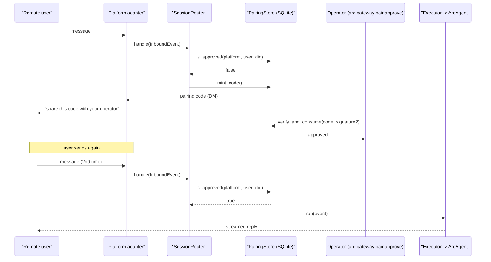
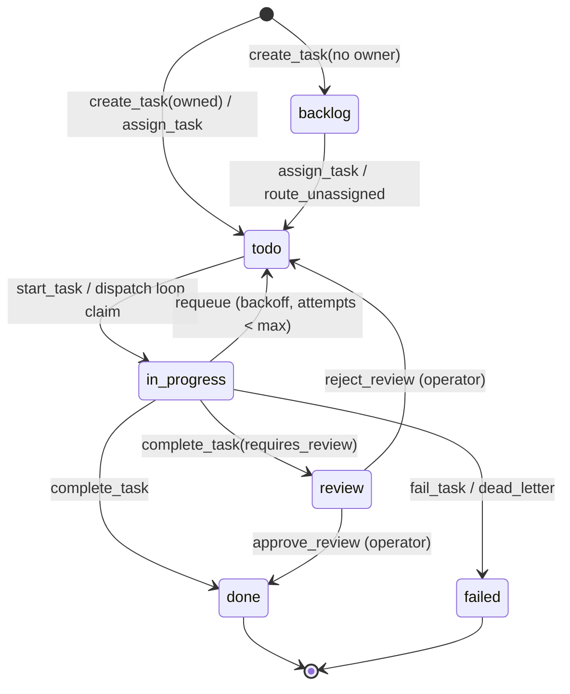
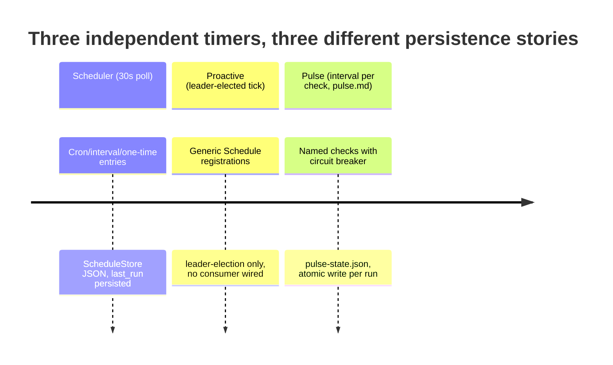
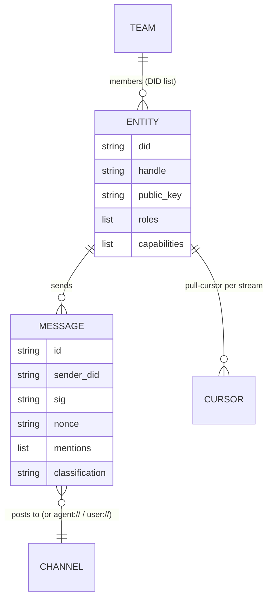
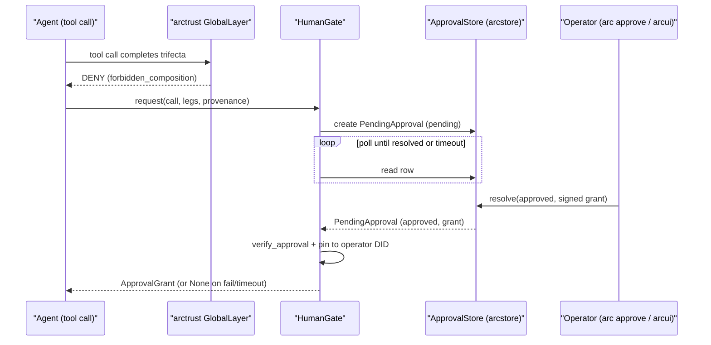
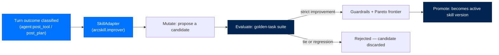
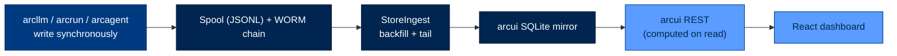

# 9. The Workflows — What Arc Actually Does, Day to Day

> **Section:** 2. System Walkthroughs · **Topic:** The Record
> **Who this is for:** anyone who needs to know what happens *between* turns —
> how a message finds its way to an agent, how work gets scheduled, and how a
> human gets pulled in when something needs their say-so.
> **Read this after:** [`docs/03-anatomy-of-a-turn.md`](03-anatomy-of-a-turn.md) · **Read this next:** [`docs/10-security-model.md`](10-security-model.md)
> **Plain-language summary lives in:** the "In one breath" section below.
> **See also:** [DATA_FLOW.md](DATA_FLOW.md), [IMPLEMENTATION_GUIDES.md](IMPLEMENTATION_GUIDES.md)

---

## In one breath

`docs/03-anatomy-of-a-turn.md` explains what happens during one exchange with
an agent. This document is everything else Arc does around that exchange: how
a message from Slack or Telegram finds the right agent and the right
conversation before a turn even starts; how a task gets handed to an agent and
actually gets worked, retried, or escalated; what fires on a timer instead of
waiting for a human; how an agent's memory gets tidied up while it sleeps; how
two agents talk to each other; how a human gets pulled in for a decision the
agent isn't allowed to make alone; how a skill gets rewritten by its own
usage; and how everything Arc ever did becomes visible in the dashboard,
even work that happened while nobody was watching.

---

## How it actually works

### 9.1 Chat through a gateway channel

**Trigger:** an inbound message on Telegram, Slack, Mattermost, or the web
console. **Actors:** a platform adapter, `SessionRouter`, an `Executor`,
`ArcAgent`. **Durable artifacts:** the per-session `.jsonl` transcript, the
always-on spool, pairing state in SQLite. **Failure/retry:** per-adapter
reconnect with backoff; a crashed adapter never takes down its siblings.

Each remote platform is its own installable package —
`arcgateway-slack`, `arcgateway-telegram`, `arcgateway-mattermost` — that
implements the `BasePlatformAdapter` Protocol
(`packages/arcgateway/src/arcgateway/adapters/base.py:29`): `connect()`,
`disconnect()`, `send()`. The gateway core names none of them; an operator
adds one with `arc gateway adapter install <name>`, which shells out to
`uv pip install`/`pip install` against a fixed allowlist
(`packages/arcgateway/src/arcgateway/adapters/install.py:41`), never a
user-controlled string.

`GatewayRunner` (`packages/arcgateway/src/arcgateway/runner.py:113`) is the
daemon that supervises adapters: one `asyncio.TaskGroup` task per adapter (a
crash in one never kills the others — ASI08), a reconnect watcher polling
every 5s, and a pairing-cleanup sweep every 600s. It writes `gateway.pid`
atomically and a `.clean_shutdown` marker on graceful exit so a supervisor can
tell a clean stop from a crash. The same wiring runs two ways: standalone
(`arc gateway start`) or embedded in-process inside `arc ui start`, built by
`arcgateway.bootstrap.build_for_embedded`
(`packages/arcgateway/src/arcgateway/bootstrap.py:1`) — the embedded path is
what a normal single-box deployment uses.

Every adapter normalizes its platform's payload into one shape,
`InboundEvent` (`packages/arcgateway/src/arcgateway/executor.py:49`), and
calls `SessionRouter.handle()`. The router does four things, in order, and the
first two matter most for correctness:

1. **Identity resolution.** Fold the platform's raw user id and the target
   `agent_did` into one deterministic, cross-platform `session_key`
   (`build_session_key`, `session.py:105`) — a truncated SHA-256 hash of
   `agent_did:user_did`, optionally salted with a rotation generation so `/new`
   mints a fresh session (`SessionEpochStore`,
   `packages/arcgateway/src/arcgateway/session_epoch.py:40`, persisted to
   SQLite so a restart doesn't un-rotate a session).
2. **Pairing intercept.** `PairingInterceptor.is_user_approved()`
   (`packages/arcgateway/src/arcgateway/session_pairing.py:104`) checks a
   static allowlist first, then falls through to a live SQLite read against
   `PairingStore`. An unapproved user never reaches the agent — see §9.1.1.
3. **The pre-await race guard.** Whether a session is "already active" is
   checked and the `_active_sessions` dict is written to *synchronously*, with
   no `await` in between (`session.py:377-398`) — Python's cooperative
   scheduling guarantees no other coroutine can interleave between two
   synchronous statements. A second message for the same session while a turn
   is in flight is queued by `QueueManager`
   (`packages/arcgateway/src/arcgateway/session_queue.py:33`, bounded at 100
   events per session, idle-evicted after 1h) and replayed sequentially once
   the active turn finishes.
4. **Dispatch.** The chosen `Executor` runs the turn.
   `AsyncioExecutor` (`executor.py:147`) is used at personal/enterprise tier;
   `SubprocessExecutor` at federal tier spawns an isolated
   `arc-agent-worker` subprocess per session (OS-level isolation for
   CMMC/FedRAMP). Deltas stream back through `StreamBridge`
   (`packages/arcgateway/src/arcgateway/stream_bridge.py`) to whichever
   adapter's `name` matches `event.platform` — a reply always returns to the
   platform it arrived on.

#### 9.1.1 Pairing — how a remote user gets authorized at all

An unknown user's first message never reaches an agent. `PairingStore`
(`packages/arcgateway/src/arcgateway/pairing.py:291`) mints an 8-character
one-time code (unambiguous alphabet, no `0/O/1/I`), 1h TTL, max 3 pending
codes per platform, one mint per user per 10 minutes, and DMs it back through
the adapter. The operator resolves it with `arc gateway pair approve <code>`,
which writes an `approved` row into the *same* SQLite file the running
gateway reads — no in-memory allowlist to go stale, so approval takes effect
on the very next message. Five failed approval attempts lock the platform out
for 1h (`PairingThrottle`,
`packages/arcgateway/src/arcgateway/pairing_throttle.py:38`). At federal tier,
approval additionally requires an Ed25519 signature over
`sha256(code + minted_at_iso)` from the operator's key
(`PairingSignatureVerifier`, `pairing_signature.py`); enterprise warns when a
signature is absent but still allows the approval; personal ignores
signatures. `[platforms.<name>].allowed_user_ids` seeds a static allowlist so
known users skip the DM dance entirely
(`packages/arcgateway/src/arcgateway/pairing_allowlist.py:42`) — but only when
`[security].require_pairing = true`, otherwise pairing is a no-op by design
(every deployment's default until pairing is explicitly opted into). The
`web` platform is exempt from pairing outright: every `/ws/chat` connection is
already gated by arcui's own operator/viewer token before it reaches
`SessionRouter`, so a second pairing dance would lock the operator out of
their own dashboard (`_DEFAULT_TRUSTED_PLATFORMS`, `session_pairing.py:61`).



Full detail: [`docs/arcgateway/getting-started.md`](arcgateway/getting-started.md),
[`docs/arcgateway/multi-instance.md`](arcgateway/multi-instance.md),
[`docs/arcgateway/security.md`](arcgateway/security.md).

---

### 9.2 Tasks — Mission Control

**Trigger:** `create_task`/`assign_task` tool calls (an agent, a teammate, or
arcui's task board), plus two always-running background loops per agent.
**Actors:** the `tasks` module (`arcagent`), `TaskStore` (`arcstore`).
**Durable artifacts:** the arcstore `tasks` collection. **Failure/retry:**
exponential backoff, dead-letter after `max_attempts`, wall-clock timeout,
stuck-task reclaim on restart.

> ⚠️ **This module is DEAD by default.** Nothing in the tasks surface loads
> unless `[modules.tasks] enabled = true` is declared in the agent's
> `arcagent.toml` — a real instance of Arc's "producers unwired" pattern.
> `arc agent create`'s scaffold does declare `[modules.tasks]`
> (`packages/arccli/src/arccli/commands/agent/_common.py:397`), so a freshly
> created agent gets it; an agent built before that scaffold change, or hand-
> edited, may not. Verify the block is present before assuming a task will
> ever be picked up. Even with the module enabled, autonomous execution is a
> **second**, separately-gated opt-in: `[modules.tasks].dispatch = false` by
> default — a module that only exposes the ten tools (create/update/start/
> complete/fail/assign/claim/list/decompose/set_output) without ever
> self-driving a task, because auto-running assigned work is agency an
> operator must grant explicitly (LLM06/ASI01).

`Task` (`packages/arcstore/src/arcstore/tasks.py:102`) is a frozen Pydantic
model; every mutation goes through `TaskStore`, which reads the current row
and writes a fresh one under a status-conditional `update_if` (race-safe —
two concurrent claims can't both win). Status moves through
`backlog → todo → in_progress → done | failed`, with an opt-in `review` state
in between when a task carries `requires_review = True`.

When `dispatch = true`, two `@background_task` loops run per agent
(`packages/arcagent/src/arcagent/modules/tasks/capabilities.py:838`):

- **`tasks_dispatch_loop`** (every 15s): if this agent has no `in_progress`
  task already (a hard one-task-at-a-time cap), pick the highest-priority
  `todo` task whose dependencies are met, whose retry backoff has elapsed,
  and that has no subtasks of its own (a decomposition parent never runs
  directly — it rolls up from its children). Claim it atomically
  (`start_task`, stamping a `run_id` in the same write the arcui timeline
  joins on), then run it under a wall-clock timeout via the agent's own
  `run_collected` callback.
- **`tasks_reliability_watcher`** (every 5s, faster so an operator "stop"
  feels responsive): honors `cancel_requested` by cancelling the live
  `asyncio.Task` handle; reclaims an `in_progress` task with no live run
  (immediately on the first pass after a restart — a pre-restart orphan — or
  after `stuck_reclaim_seconds` thereafter); rolls decomposition parents up
  from their children (fail-fast on any failed child, all-done on every
  child done); and routes ownerless tasks to the least-loaded, capability-
  matching active agent in the registry (`[modules.tasks].routing`, on by
  default, no-op without a live `arcteam` registry).

Both loops are decorated `@background_task(..., interval=N)`, but the
decorator only spawns the coroutine once — it does not re-invoke it on a
timer. **The `while True: ... await asyncio.sleep(N)` has to live inside the
loop function itself, or it runs exactly one tick and dies silently** — the
source docstrings for both loops call this out explicitly as a known
one-shot trap (`capabilities.py:844`). Any other module registering a
`@background_task` should be checked for the same pattern before trusting it
fires more than once.

A failed attempt (exception, timeout, or an explicit `fail_task`) is retried
with exponential backoff (`retry_backoff_seconds * 2**(attempts-1)`) until
`max_attempts`, then dead-lettered — a terminal `failed` with the reason
preserved. `handle_task_assigned`, an earlier message-driven assignment
handler, no longer exists in the codebase; the poll-based dispatch loop
above is what actually runs assigned work today, because arcui's task board
writes to the same shared arcstore row an inter-agent message cannot reach
(arcui runs in a separate process and can't sign an inter-agent envelope).



---

### 9.3 Scheduled and proactive work

**Trigger:** wall-clock time, not a message. **Actors:** three independent
engines — `scheduler`, `proactive`, `pulse` — each its own module.
**Durable artifacts:** JSON schedule file, `pulse-state.json`.
**Failure/retry:** circuit breaker on repeated timer errors; each engine is
gated by its own config.

| Engine | Module | What it fires | Persistence |
|---|---|---|---|
| Scheduler | `packages/arcagent/src/arcagent/modules/scheduler/scheduler.py` (`SchedulerEngine`) | Operator-defined cron / interval / one-time entries created via tool calls | `ScheduleStore` — a JSON file (`scheduler/store.py:21`); each `ScheduleEntry` carries its own `last_run`, so a fired schedule isn't refired after a restart |
| Proactive | `packages/arcagent/src/arcagent/modules/proactive/engine.py` (`ProactiveEngine`) | Generic leader-elected tick loop; other modules can register a `Schedule` on it | Leader election only (`noop`/`redis`/`k8s` backend, `[modules.proactive].leader`) — the tick loop itself holds schedules in memory; no consumer module in this codebase currently registers against it |
| Pulse | `packages/arcagent/src/arcagent/modules/pulse/engine.py` (`PulseEngine`) | Checks parsed from a `pulse.md` file (`## <name>` sections with `**Interval:**`/`**Action:**`) | `pulse-state.json`, atomically written (`tempfile` + `os.replace`, 0600 perms) after every check — `last_run`/`consecutive_failures`/`last_result` per check |

`SchedulerEngine._timer_loop` polls every `check_interval_seconds` (default
30s), evaluates every stored entry against cron/interval/active-hours rules,
and enqueues firing entries onto a bounded `asyncio.Queue` that a single
sequential `_worker` drains — so schedules never run concurrently against
each other. Five consecutive timer-loop errors stop the engine outright
rather than spin forever (a fail-fast, not a fail-open, because a broken
timer loop silently means "nothing ever fires again").

The cadence-persistence invariant that matters here: an **in-memory** "every
N turns/ticks" counter is silently defeated by any process restart — and Arc
restarts its background processes on a roughly 1-5 minute cycle in normal
operation. Pulse gets this right by construction (state file, not memory).
Scheduler gets it right via `last_run` on the persisted entry itself. Proactive
has no persisted state of its own to lose, because nothing in this codebase
yet drives work through it — a leader-elected tick primitive waiting for a
consumer, not a producer of anything on its own.



---

### 9.4 The memory sleep / consolidation pass

**Trigger:** an event-count threshold, an idle-time threshold, or a hard
interval — whichever fires first. **Actors:** `memory_consolidate_loop`
(`arcagent`), `Brain.consolidate()` (`arcmemory`). **Durable artifacts:**
arcmemory's episodic/semantic/procedural/entity stores.

`memory_consolidate_loop`
(`packages/arcagent/src/arcagent/modules/memory/capabilities.py:261`) polls
on a fixed interval and calls `consolidate_poll_once()`, which checks three
independent triggers against the agent's live state: accumulated capture
events crossing `consolidate_event_threshold`, idle time past
`consolidate_idle_seconds`, or elapsed time past
`consolidate_interval_seconds`. Any one firing runs `Brain.consolidate()` —
by default, a **bounded arcrun ReAct agent**
(`packages/arcmemory/src/arcmemory/agent_consolidate.py:1`, capped by
`consolidate_agent_max_turns`) rather than a fixed pipeline, so consolidation
can reason about what's worth keeping instead of mechanically bucketing
everything. A breach, timeout, or missing arcrun degrades safely — progress
made before the cutoff is not lost. Consolidation emits `memory.consolidated`
on the module bus, which the policy module listens for
(`reflect_on_consolidation`,
`packages/arcagent/src/arcagent/modules/policy/capabilities.py:119`) to
re-evaluate standing policy in light of what was just learned.

Full detail on the four-store model, retrieval, and the distiller/dedup
pipeline: [`docs/07-memory-lifecycle.md`](07-memory-lifecycle.md).

```mermaid
sequenceDiagram
    participant Loop as "memory_consolidate_loop"
    participant Brain as "Brain.consolidate()"
    participant ReAct as "bounded arcrun ReAct agent"
    participant Stores as "episodic / semantic / procedural / entity"
    participant Bus as "module bus"

    loop every poll interval
        Loop->>Loop: check event/idle/interval trigger
    end
    Loop->>Brain: trigger fired
    Brain->>ReAct: run (max_turns capped)
    ReAct->>Stores: write consolidated memories
    ReAct-->>Brain: result (or safe degrade on timeout)
    Brain-->>Loop: episode_summary
    Loop->>Bus: emit "memory.consolidated"
```

---

### 9.5 Team / agent-to-agent messaging

**Trigger:** `messaging_send` tool call, or a durable inbox consumer waking
on delivery. **Actors:** `arcteam` (`EntityRegistry`, `MessagingService`,
`TeamStore`), the `messaging` module (`arcagent`). **Durable artifacts:** NATS
JetStream streams (or an in-memory bus with no NATS configured); per-entity
pull cursors. **Failure/retry:** durable consumers resume from their last ack
after a restart; `RetryableDeliveryError` leaves a message unacked for
redelivery.

Every entity (agent or human) is a DID-keyed row in `EntityRegistry`
(`packages/arcteam/src/arcteam/registry.py:77`) — the sole address resolver.
`resolve_ref()` turns any of `did:...`, `@handle`, `agent://handle`,
`user://handle`, or a bare handle into a canonical DID; `channel://` and
`role://` refs pass through unchanged, addressing a stream rather than an
identity. `TeamStore` (`team.py:43`) layers a named group of member DIDs plus
a default channel and optional goal reference on top of the same registry —
teams don't mint identities, they only reference them.

`MessagingService` (`packages/arcteam/src/arcteam/messenger.py:88`) is
pull-based: each entity has a durable NATS consumer per stream
(`_durable_name`, unique per `(entity, stream)`), so a running agent gets
messages pushed live and a restarted one resumes from its last acked
position — no message is lost or redelivered from the beginning. Every
message is Ed25519-signed on send and verified on consume
(`arcteam/crypto.py:73`, REQ-030) over a canonical field set that excludes
transport bookkeeping, and a `ReplayCache` (`crypto.py:93`) rejects a
resubmitted nonce or a stale timestamp within a sliding 5-minute window.
`apply_mentions()` (`arcteam/mentions.py:28`) extracts `@handle` tokens from
a message body, resolves them against the registry, and raises the message's
priority to at least `HIGH` with `action_required = True` when a mention
resolves — the mention-triage signal that decides whether an idle agent wakes
for this message.

On the `arcagent` side, `messaging_inbox_loop`
(`packages/arcagent/src/arcagent/modules/messaging/capabilities.py:578`, a
`@background_task`) subscribes over the entity's durable consumers once
`[modules.messaging] enabled = true`, hands each verified message to
`_handle_incoming`, and routes it through the steering gate so an
`action_required` message can interrupt an idle agent rather than wait for
its next turn. `arcagent/core/arcteam_bootstrap.py` is the one place backend
selection, signer construction, and self-registration happen, so the
capability runtime and any tool factory build byte-identical services.

> ⚠️ **Unverified as implemented:** `packages/arcteam/src/arcteam/backends/nats.py`
> connects with `nats.connect(servers, ...)` and no TLS/certificate options
> visible in that call — the CLAUDE.md invariant of mTLS on all inter-agent
> NATS traffic does not appear wired into the connection itself. Treat mTLS
> as a deployment-level expectation (a TLS-terminating NATS server / service
> mesh), not something this backend enforces in-process, until confirmed
> otherwise.

**Operational requirement:** a newly created agent does not appear in the
arcui trace dashboard or the roster automatically. Run `arc team register`
to add it to the shared registry, then restart `arc ui start` — the roster is
read at startup.



---

### 9.6 Operator approval — the human gate

**Trigger:** `arctrust`'s `GlobalLayer` denies a tool call with
`rule_id="global.forbidden_composition"` — the lethal-trifecta gate tripping
(private data + external comms + untrusted input, all present on one call
chain). **Actors:** `HumanGate` (`arcagent`), `ArcStoreApprovalChannel`,
`ApprovalStore` (`arcstore`), `arc approve` CLI / arcui Approvals panel.
**Durable artifacts:** the arcstore `approvals` collection. **This never
happens through chat** — see below for why that matters.

When a blocked call needs a human decision, `HumanGate.request()`
(`packages/arcagent/src/arcagent/tools/human_gate.py:164`) builds an
`ApprovalRequest` with a redacted, length-bounded preview of the call's
arguments (`redact_arguments`, PII-scrubbed via `arcllm`'s regex detector,
each value capped at 120 chars) and the provenance chain of which prior
calls lit each forbidden leg. At personal/enterprise tier, a *named* leg-set
in `[tools.human_gate].auto_approve` can skip the human entirely (an exact
match only — a subset match would silently authorize a wider composition
than the operator named); federal never auto-approves. Otherwise the request
goes to the configured `channel`.

The mechanical channel — `ArcStoreApprovalChannel`
(`packages/arcagent/src/arcagent/tools/approval_channel.py:28`) — writes a
`PendingApproval` row into the shared arcstore `approvals` collection
(`packages/arcstore/src/arcstore/approvals.py:33`) and polls it. This is the
whole reason the design works: the row is an operator-authenticated write to
a shared store, not a message an agent (or a prompt-injected foreign message
impersonating a human) could forge in the chat stream. The operator resolves
it out-of-band, either with `arc approve <id>` (`packages/arccli/src/arccli/
commands/approve.py`, which signs an `ApprovalGrant` with
`OperatorApprovalAuthority`) or the arcui Approvals panel
(`packages/arcui/src/arcui/routes/approvals.py`). `ApprovalStore.resolve()`
is status-conditional on `pending` inside one atomic write, so two operators
racing to resolve the same request can't both win.

Back in `HumanGate`, the returned grant is trusted only after it **both**
verifies cryptographically against the call hash it was requested for
**and** is pinned to the deployment's own operator DID
(`grant.approver_did != self._operator.did` fails closed) — `verify_approval`
alone would accept a signature from *any* non-agent key, so the DID pin is
what stops a foreign keypair from self-minting an approval. A denial or a
timeout (`[tools.human_gate].timeout_seconds`, default 300s) both fail
closed: the completing call never proceeds.



More on the trifecta model and the four pillars this gate enforces:
[`docs/10-security-model.md`](10-security-model.md).

---

### 9.7 Skill improvement

**Trigger:** per-turn outcome classification on `agent:post_tool` /
`agent:post_plan` hooks, feeding a background lifecycle sweep.
**Actors:** the `skills` module (thin wiring only) and
`arcskill.improver` (the actual optimizer, selected as a
`SkillAdapter`). **Durable artifacts:** per-skill `candidates/` directory,
`evals/` golden-task suites, a Pareto-frontier manifest.

The `skills` module (`packages/arcagent/src/arcagent/modules/skills/
capabilities.py`) owns no improvement logic itself — it classifies each
turn's outcome (`_classify_outcome`) and forwards the label to whichever
`SkillAdapter` is selected via `[modules.skills].adapter`: `"none"` (default,
off) or `"arcskill"` (the supported optimizer). A `@background_task`
(`skills_review_lifecycle_loop`) sweeps on a configurable cadence
(`sweep_poll_seconds`, default hourly) to retire skills past an inactivity
window.

The optimizer itself (`packages/arcskill/src/arcskill/improver/engine.py`,
`SkillOptimizer`) is a mutate → evaluate → guardrail-check → Pareto-select
loop, but the acceptance decision is not the LLM judge's to make: a
deterministic golden-task suite is the **hard gate**
(`evalgate.py:1`) — a candidate is only accepted when it makes at least one
previously-failing case pass **and regresses none** (strict improvement, no
ties). A code-mutation candidate with no eval suite is blocked at every tier;
a prose-mutation candidate with no suite is allowed at personal tier only
(audit-warned). Every eval case is provenance-tagged machine- vs.
human-authored (a hash mismatch against the harness-written manifest means a
human edited it), and enterprise/federal only count human-authored cases
toward the required minimum.



Full detail on how skills are loaded and structured:
[`docs/06-prompts-tools-skills.md`](06-prompts-tools-skills.md).

---

### 9.8 Observe — the read path

**Trigger:** none — arcui's own `StoreIngest` is always tailing, whether or
not arcui was running when the record was written. **Actors:** `StoreIngest`
(`arcstore`), arcui's SQLite mirror, the React dashboard over REST.
**Durable artifacts:** an arcui-owned SQLite database (`NFR-8`: shared-nothing
from every writer). **Failure/retry:** a torn tail (a record still being
written) is left unconsumed and picked up on the next tail cycle.

Every layer that does anything durable — `arcllm` on every model call,
`arcrun` on every loop event, `arcagent` on orchestration events — writes
directly to the shared, always-on JSONL spool
(`packages/arcstore/src/arcstore/spool.py`) and a hash-chained WORM audit
log, synchronously, in-process, with **no dependency on arcui or any server
being up**. This is what makes the UC-1 guarantee true: run
`arc llm "..."` from a cold shell with nothing else running, and the call is
still fully durable — arcui, started later, backfills and tails those files
into its own mirror and the call becomes visible in the dashboard exactly as
if arcui had been running the whole time.

`StoreIngest` (`packages/arcstore/src/arcstore/ingest.py:51`) is a pure file
tailer: `backfill()` does one full pass over the spool, WORM chains, and
skill-candidate directories on startup, then `start()` hands off to a
managed `_tail_loop` background task that continues reading from each
file's last offset. arcui runs its own `StoreIngest` instance
(`packages/arcui/src/arcui/observe.py:1`) into its own SQLite file — arcui
never receives a live push from any writer; it is a pure reader of the
durable record (SPEC-026 FR-5 tore out every prior push wire except
`/ws/chat`, which carries a live turn's tokens, not history). The REST layer
computes stats directly from the store on read — there's no separate rolling
aggregator that could drift out of sync with the underlying rows.

> ⚠️ **Operational gotcha:** arcui's server reads `static/index.html` **once**
> at process startup and caches it in `app.state.index_html`
> (`packages/arcui/src/arcui/server.py:240-264`). Rebuilding the `web/`
> frontend bundle has no effect on a running server — `arc ui start` (or an
> equivalent restart) is required before a rebuilt bundle is served.



Full detail on every durable format: [`docs/08-data-storage.md`](08-data-storage.md).

---

## Where to look in the code

| Path | What lives there | Start here if you're changing... |
|---|---|---|
| `packages/arcgateway/src/arcgateway/session.py` | `SessionRouter` — identity resolution, pairing gate, race guard, queueing | Session-key policy, message routing |
| `packages/arcgateway/src/arcgateway/pairing.py`, `pairing_throttle.py`, `pairing_signature.py`, `pairing_allowlist.py`, `pairing_postgres.py` | DM pairing store, throttle policy, federal signature verification, static allowlist wiring | Anything about who's allowed to talk to an agent |
| `packages/arcgateway/src/arcgateway/runner.py`, `bootstrap.py`, `fleet.py` | Standalone daemon, embedded composition root, always-on fleet registry | Gateway process lifecycle |
| `packages/arcgateway-telegram`, `-slack`, `-mattermost` | Platform-specific adapter packages | Adding or fixing a platform integration |
| `packages/arcstore/src/arcstore/tasks.py` | `Task`, `TaskStore` — the durable task directory | Task state machine, DAG/dependency logic |
| `packages/arcagent/src/arcagent/modules/tasks/capabilities.py`, `_runtime.py`, `config.py` | Ten task tools, dispatch loop, reliability watcher | Autonomous task execution, retry/backoff/routing |
| `packages/arcagent/src/arcagent/modules/scheduler/`, `proactive/`, `pulse/` | Three independent timer engines | Anything that should fire on a schedule |
| `packages/arcmemory/src/arcmemory/agent_consolidate.py`, `consolidate.py` | Consolidation trigger + the bounded ReAct sleep pass | Memory consolidation behavior |
| `packages/arcteam/src/arcteam/registry.py`, `team.py`, `messenger.py`, `mentions.py`, `crypto.py` | Entity registry, teams, pull-based messaging, mention triage, signing | Inter-agent communication |
| `packages/arcagent/src/arcagent/core/arcteam_bootstrap.py`, `modules/messaging/capabilities.py` | Shared arcteam service construction, the durable inbox loop | How an agent joins the team bus |
| `packages/arcagent/src/arcagent/tools/human_gate.py`, `approval_channel.py` | `HumanGate`, the mechanical arcstore channel | The human-in-the-loop pause/verify logic |
| `packages/arcstore/src/arcstore/approvals.py` | `PendingApproval`, `ApprovalStore` | The shared directory an operator resolves against |
| `packages/arccli/src/arccli/commands/approve.py` | `arc approve` CLI | Operator-side approval tooling |
| `packages/arcskill/src/arcskill/improver/` | `SkillOptimizer`, `evalgate.py`, `candidate_store.py` | Skill self-improvement mechanics |
| `packages/arcagent/src/arcagent/modules/skills/capabilities.py` | Turn-outcome classification, the thin `SkillAdapter` wiring | How improvement gets triggered |
| `packages/arcstore/src/arcstore/spool.py`, `ingest.py` | Always-on write path, `StoreIngest` tailer | The write-once/read-anytime guarantee |
| `packages/arcui/src/arcui/observe.py`, `server.py` | arcui's own `StoreIngest` instance, static asset caching | The dashboard's read path |

---

## Entry point, config key, and record location per workflow

| Workflow | Entry point | Module / toml key that must be enabled | Where records land |
|---|---|---|---|
| Gateway chat | `arc gateway start` (standalone) or embedded in `arc ui start` | `[platforms.<name>]` per platform, adapter package installed | Session `.jsonl`, spool, WORM chain |
| DM pairing | first unpaired message; `arc gateway pair approve <code>` | `[security].require_pairing`, `[pairing].db_path` | `pairing.db` (SQLite) |
| Tasks / Mission Control | `create_task`/`assign_task` tool calls, or the arcui task board | `[modules.tasks].enabled`, `.dispatch` | arcstore `tasks` collection |
| Scheduled work | tool-created schedule entries; `pulse.md` checks | `[modules.scheduler]`, `[modules.pulse]`, `[modules.proactive]` | `ScheduleStore` JSON, `pulse-state.json` |
| Memory consolidation | automatic (event/idle/interval trigger) | `[modules.memory]` with a `brain` provider configured | arcmemory episodic/semantic/procedural/entity stores |
| Team messaging | `arc team register`; `messaging_send` tool | `[modules.messaging].enabled`, `[team].root` | NATS JetStream streams (or in-memory bus) |
| Operator approval | a blocked trifecta call; `arc approve <id>` or the arcui Approvals panel | `[tools.human_gate]` | arcstore `approvals` collection |
| Skill improvement | automatic (turn-outcome hooks) | `[modules.skills].adapter = "arcskill"` | `<skill>/candidates/`, `evals/`, Pareto manifest |
| Observe / read path | `arc ui start` (always tailing) | none — always-on | arcui's own SQLite mirror |

Full config precedence and every key above: [`docs/12-configuration.md`](12-configuration.md).
