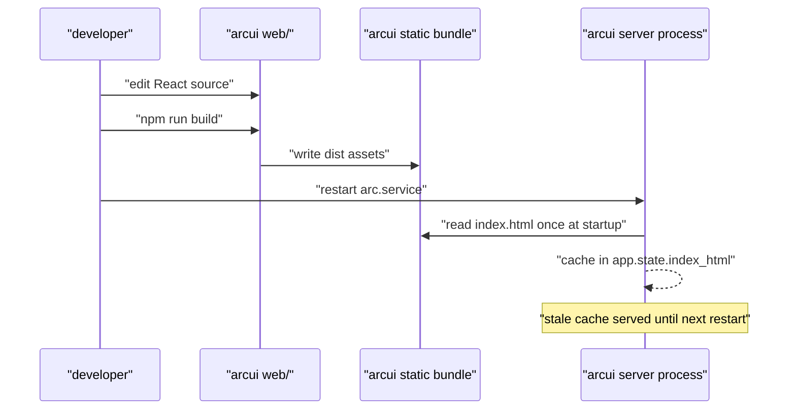
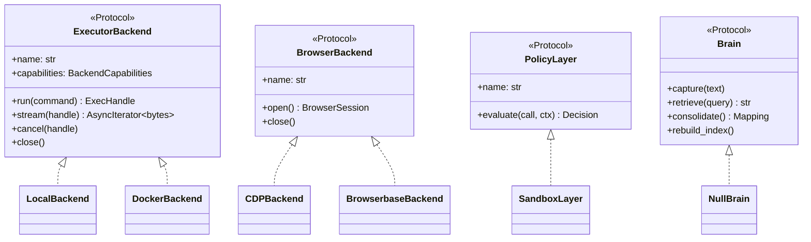
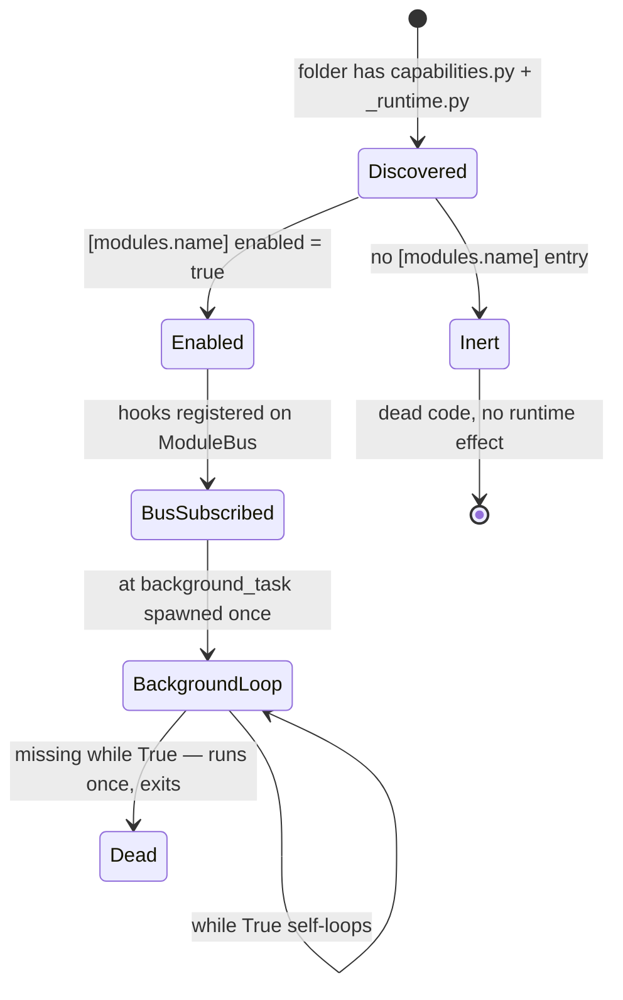

# 11. Extension Points — Every Seam You Can Hook Into

> **Who this is for:** anyone about to add a capability to Arc — a new chat
> platform, model provider, tool, memory backend, audit destination, or UI
> panel — and who needs to know which file to add, not which core file to edit.
> **Read this after:** [`docs/10-security-model.md`](10-security-model.md) · **Read this next:** [`docs/12-configuration.md`](12-configuration.md)
> **Plain-language summary lives in:** the "In one breath" section below.

---

## In one breath

Arc's core is deliberately small, so almost nothing you want to add lives
there. Think of Arc like a phone with labeled ports instead of a case you pry
open: a new chat app plugs into the gateway port, a new model plugs into the
LLM port, a new "thing the agent can do" plugs into the tool port. Every port
is one of three shapes — a Python `Protocol` your class must satisfy, a signed
file the loader discovers on disk, or a `[section]` in a TOML file that turns
an already-shipped capability on. You almost never edit a file inside
`core/`; you add a new file next to the others and point config at it. The
one hazard specific to Arc: a seam that is *coded* but not *declared* in
config is dead at runtime — this doc calls that out at every seam where it
applies.

```mermaid
flowchart TB
    CORE(["arcagent core<br/>nucleus"])
    MOD["modules/*<br/>event-driven capabilities"]
    EXT["extension/*<br/>select-one and scan-many"]
    BLU["blueprints/*<br/>signed config presets"]
    GW["arcgateway-*<br/>chat platform plugins"]
    LLMA["arcllm adapters<br/>model providers"]
    LLMM["arcllm modules<br/>request pipeline"]
    TOOL["tools/skills<br/>capability files"]
    BRAIN["brain/*<br/>memory backend"]
    STORE["arcstore backends<br/>storage"]
    AUDIT["arctrust sinks<br/>audit destinations"]
    POL["arctrust policy layers<br/>authorization rules"]
    SBX["arcrun backends<br/>sandbox / exec"]
    BROW["browser backends"]
    WEBP["web providers"]
    PROMPT["arcprompt overlays"]
    UI["arcui web/<br/>React frontend"]

    CORE --- MOD
    CORE --- EXT
    CORE --- BLU
    CORE --- GW
    CORE --- LLMA
    CORE --- LLMM
    CORE --- TOOL
    CORE --- BRAIN
    CORE --- STORE
    CORE --- AUDIT
    CORE --- POL
    CORE --- SBX
    CORE --- BROW
    CORE --- WEBP
    CORE --- PROMPT
    CORE --- UI

    class CORE agent
    class MOD,EXT,BLU,TOOL,BRAIN,BROW,WEBP,PROMPT agent
    class GW,UI surface
    class LLMA,LLMM llm
    class STORE,AUDIT,POL,SBX found
    classDef entry   fill:#D6E6FF,stroke:#0073FE,color:#002550
    classDef surface fill:#5A9CFF,stroke:#003B82,color:#002550
    classDef agent   fill:#0073FE,stroke:#0055BC,color:#FFFFFF
    classDef runtime fill:#0055BC,stroke:#003B82,color:#FFFFFF
    classDef llm     fill:#003B82,stroke:#002550,color:#FFFFFF
    classDef found   fill:#002550,stroke:#001A38,color:#FFFFFF
```



---

## How it actually works

### 11.1 Agent modules — the biggest seam

A module is a folder under `packages/arcagent/src/arcagent/modules/<name>/`
shipping a `capabilities.py` and a `_runtime.py`
(`packages/arcagent/src/arcagent/core/module_discovery.py:40-52`, the
`_is_module` check). Eighteen ship today: `browser`, `memory`, `messaging`,
`planning`, `policy`, `proactive`, `pulse`, `runcontrol`, `scheduler`,
`session`, `skills`, `slack`, `tasks`, `telegram`, `user_profile`, `voice`,
`web`, `workpad`.

A module talks to the rest of the agent through the **Module Bus**
(`packages/arcagent/src/arcagent/core/module_bus.py`) — an async
priority-ordered pub/sub with first-veto-wins semantics
(`module_bus.py:29-61`, `:127-162`). Handlers register via three decorators
in `packages/arcagent/src/arcagent/tools/_decorator.py`:

```python
from arcagent.tools._decorator import hook, tool, background_task

@hook(event="agent:post_tool", priority=100)
async def on_post_tool(ctx: EventContext) -> None: ...

@tool(description="...", classification="read_only")
async def my_tool(arg: str) -> str: ...

@background_task(interval=300.0)
async def poll() -> None:
    while True:                 # required — the loader awaits this ONCE
        try:
            await _tick()
        finally:
            await asyncio.sleep(300.0)
```

**The `while True` gotcha:** the loader spawns a `@background_task` function
a single time (`_decorator.py:245-267`, `BackgroundTaskMetadata`). If the
function body does not loop internally, it runs one tick and dies —
`packages/arcagent/src/arcagent/modules/tasks/capabilities.py:844-852`
documents this explicitly for the tasks-dispatch loop, and it is the single
most common way a new module silently stops working after the first tick.

**Discovered ≠ active.** `discover_modules()` finds every qualifying folder
on disk; `active_modules()` intersects that with a configured, enabled
`[modules.<name>]` entry (`module_discovery.py:98-105`). A module you wrote
and dropped in `modules/` is real, importable Python that **does nothing**
until an agent's `arcagent.toml` turns it on:

```toml
[modules.memory]
enabled = true

[modules.memory.config]
brain = "arcmemory"
```

(`packages/arcagent/src/arcagent/blueprints/personal-assistant.toml:13-17`.)
This is the "producers unwired" hazard by name — a correctly-coded module
with no config entry is dead code at runtime, and nothing fails loudly to
tell you.

Config keys are `extra="forbid"` Pydantic models
(`packages/arcagent/src/arcagent/core/module_config.py:14-21`) — a typo'd
key raises at load instead of being silently ignored. **Copy `modules/memory/`**
for a hook+background-task module, or `modules/browser/` for one with its own
backend seam (11.14).

### 11.2 Extensions — the select-one / scan-many framework

`packages/arcagent/src/arcagent/extension/` (SPEC-047) is a *different*
mechanism from a module. Where a module subscribes to bus events, an
extension point is either:

- **select-one** — one config setting picks exactly one implementation
  (`brain`, `skills`/improver-adapter), described by an
  `ExtensionPoint` descriptor (`extension/point.py:28-66`) and dispatched by
  the one shared `select_extension()` function.
- **scan-many** — a read-only *view* over the already-registered SPEC-021
  capability set, filtered by decorator kind (`tools`, `hook-builds`) — no
  separate loader (`extension/families.py:43-48`).

You rarely author against this package directly; it is the machinery behind
`arc ext inspect` and `arc ext verify`
(`packages/arccli/src/arccli/commands/agent/extensions.py:223-267`), which
report what each family resolved to and whether it would be **refused** at
load under the current tier — e.g. an unsigned scan-many capability above
`personal`, or a select-one BYO class that failed the allowlist gate
(`extensions.py:258-266`). Run `arc ext verify --agent <dir>` as a
pre-deploy gate; a non-zero exit means something you configured will not
actually load.

The same `arc ext` namespace also manages **capability files** — single
`.py` files stamped with `@tool` / `@hook` / `@background_task` — across four
scan roots, in precedence order: `arcagent/builtins/capabilities/` (package),
`~/.arc/capabilities/` (global), `<agent>/capabilities/` (per-agent,
trusted), `<agent>/workspace/capabilities/` (agent-authored, untrusted,
AST-validated) (`extensions.py:1-12`). This is the lightest-weight seam in
Arc: `arc ext create my_tool` scaffolds a `@tool`-decorated file, no
`[modules.*]` toml entry required — the `CapabilityLoader` scans the roots
directly (`packages/arcagent/src/arcagent/capabilities/capability_loader.py:11-34`).

**Signing.** The loader's load path re-verifies each file's `.arcsig`
sidecar at load and consults a `TofuLayer` (trust-on-first-use)
(`capability_loader.py:328-365`). `require_signature` is off by default;
when on, a missing pinned key or an invalid signature denies the load
outright (`capability_loader.py:339-356`). The sidecar convention itself —
`X.arcsig` beside `X`, Ed25519 over the file bytes — lives in
`packages/arcagent/src/arcagent/capabilities/artifact_signing.py:21-38`.

### 11.3 Blueprints — signed, versioned config presets

A blueprint (`packages/arcagent/src/arcagent/blueprints/loader.py`) is a
`[blueprint]`-headed TOML carrying a config overlay shaped like
`arcagent.toml`. It is **materialize-to-disk, not a runtime layer** — the
agent entrypoint flat-reads its own `arcagent.toml` and never merges a
blueprint at boot (`loader.py:6-10`). `arc init --blueprint` or
`arc blueprint apply` renders the overlay under the user's own values and
writes the concrete file.

Precedence is `packaged-defaults < blueprint < user`
(`loader.py:12-14`, `apply_blueprint` at `:137-151`). Tier is a **floor**,
never a ceiling: `effective_tier = stringency-max(deployment, blueprint,
user)` (`loader.py:16-19`, `:147-150`) — a `federal-analyst` blueprint
cannot be silently downgraded by a personal deployment's config, and a
personal blueprint cannot weaken a federal deployment.

Packaged presets (`personal-assistant.toml`, `enterprise-ops.toml`,
`federal-analyst.toml`, all in the same directory) ship inside the verified
wheel and are provenance-trusted with no sidecar. A **user** preset from
`~/.arc/blueprints/` must be signed and, above `personal`, its signature is
**pinned** to the deployment operator's key — an unpinned gate accepts any
self-signed forgery, so resolution denies fail-closed when the operator key
cannot be resolved (`loader.py:26-32`, `resolve_blueprint` at `:116-128`).
A fixed denylist blocks a blueprint from touching trusted-admin-only paths
(vault backend, native tool execution, key custody) even in the overlay
(`loader.py:60-69`).

### 11.4 Gateway platform adapters — remote chat platforms

The gateway core (`packages/arcgateway/`) ships **zero** platform-specific
code; `web` is the only adapter that lives in core
(`packages/arcgateway/src/arcgateway/adapters/web.py`). Every remote
platform — `arcgateway-telegram`, `arcgateway-slack`, `arcgateway-mattermost`
— is a separately-installed package registered under the
`arcgateway.adapters` Python entry-point group
(`packages/arcgateway/src/arcgateway/adapters/registry.py:1-33`). Adding a
platform means adding a new `arcgateway-<name>` package; you never edit the
registry.

The contract is `BasePlatformAdapter` — three required async methods
(`connect`, `disconnect`, `send`) plus an optional `send_with_id`
(`packages/arcgateway/src/arcgateway/adapters/base.py:29-115`). A plugin
package exports a module-level `PLUGIN = AdapterPlugin(name=..., build=...)`:

```python
# my_platform/plugin.py
from arcgateway.adapters.registry import AdapterBuildContext, AdapterPlugin

def build(ctx: AdapterBuildContext) -> "MyAdapter":
    token = ctx.raw_config.get("token")
    if not token:
        raise AdapterUnavailableError("token missing")
    return MyAdapter(token=token, on_message=ctx.on_message, agent_did=ctx.agent_did())

PLUGIN = AdapterPlugin(name="my_platform", build=build)
```

```toml
# pyproject.toml
[project.entry-points."arcgateway.adapters"]
my_platform = "my_platform.plugin:PLUGIN"
```

**Copy `packages/arcgateway-slack/src/arcgateway_slack/plugin.py`** end to
end. At `personal`/`enterprise` an unofficial (not in `OFFICIAL_ADAPTERS`)
plugin loads with an audit warning; at `federal` it is refused outright —
only `telegram`, `slack`, `mattermost` are on the signed allowlist
(`registry.py:61-65`, `:232-241`). A platform whose credentials are missing
raises `AdapterUnavailableError` and is skipped at personal/enterprise but a
**hard startup failure** at federal (`registry.py:262-269`) — a federal
deployment never silently serves a subset of its configured platforms.

> ⚠️ Note: remote chat platforms are gateway **adapter plugins**
> (`arcgateway-telegram`, `arcgateway-slack`, `arcgateway-mattermost`) — the
> single channel path. The agent owns no per-platform bot; it reaches the human
> through the gateway channel (the `notify_user` tool). The former in-process
> `arcagent/modules/telegram` and `.../slack` modules were removed in favor of
> this one seam.

See [ADR-020](architecture/decisions/ADR-020-arcgateway-as-data-plane.md)
and [`docs/arcgateway/`](arcgateway/getting-started.md) for the full data-plane design.

### 11.5 LLM providers — one adapter file plus one TOML

`packages/arcllm/src/arcllm/adapters/` holds one file per provider (16
today: `anthropic`, `openai`, `azure_openai`, `google`, `cohere`, `deepseek`,
`fireworks`, `groq`, `huggingface`, `huggingface_tgi`, `mistral`,
`moonshot`, `ollama`, `together`, `vllm`, `xai`), each paired with a
`providers/<name>.toml` describing its capabilities and pricing, resolved by
`packages/arcllm/src/arcllm/registry.py`. Full walkthrough:
[`docs/04-the-unified-adapter.md`](04-the-unified-adapter.md).

### 11.6 arcllm modules — the request pipeline

`packages/arcllm/src/arcllm/modules/base.py` is the transparent-wrapper seam
every cross-cutting LLM concern hangs off: retry, circuit breaker,
rate limiting, fallback, guardrails, injection detection, load balancing,
routing, telemetry/cost/budget, audit. Each is its own file in
`arcllm/modules/`; a new one follows the same `BaseModule` wrapper shape.
Detail in [`docs/04-the-unified-adapter.md`](04-the-unified-adapter.md).

### 11.7 Tools — four transports, one registry

`packages/arcagent/src/arcagent/core/tool_registry.py` wraps every tool call
with schema validation, policy, timeout, and audit before the model ever
sees it, over four `ToolTransport` values
(`packages/arcagent/src/arcagent/tools/_transport.py:27-33`): `NATIVE`
(Python `@tool`), `MCP`, `HTTP`, `PROCESS`. Builtin tools ship in
`arcagent/builtins/capabilities/`; registered tools come from any module's
`capabilities.py`; agent-authored tools land in
`<agent>/workspace/capabilities/`, AST-validated before import (11.2). Full
detail: [`docs/06-prompts-tools-skills.md`](06-prompts-tools-skills.md).

### 11.8 Skills — authoring, signing, the hub connector

A skill is a `SKILL.md`-headed folder validated by
`packages/arcagent/src/arcagent/capabilities/skill_validator.py`
(`validate_skill_folder` at `:89`). Loading and signing follow the same
`.arcsig` sidecar + `TofuLayer` convention as capability files (11.2) — see
[`docs/06-prompts-tools-skills.md`](06-prompts-tools-skills.md) for the full
lifecycle. The **hub** — remote skill discovery, install, scan-and-verify —
is `packages/arcskill/src/arcskill/hub/` (`scanner.py`, `installer.py`,
`verify.py`, `sources.py`). The website/marketplace behind it is a
**separate repository** (`skillvault`, not part of this codebase); arc holds
only this connector, never hub-server code.

### 11.9 The Brain port — bring-your-own memory

`packages/arcagent/src/arcagent/brain/protocol.py` defines a structural
`Brain` Protocol — `capture` / `retrieve` / `consolidate` / `rebuild_index`,
primitives only (`protocol.py:26-73`) — so arcagent never imports a memory
type. `NullBrain` (`:76-112`) is the default: every method is a true no-op,
and with it selected no memory file is ever written. A memory package (e.g.
`arcmemory`) supplies a class that structurally satisfies `Brain`; selection
is one config key, `[modules.memory.config] brain = "..."`
(11.1's example). This is dependency inversion by design: **external memory
packages cannot register as arcagent modules** — they integrate only through
this port, keeping arcagent a memory socket rather than a memory
implementation.

### 11.10 Storage backends

`packages/arcstore/src/arcstore/backends/base.py` defines `StorageBackend` —
async `start`/`stop`/`upsert`/`upsert_many`/`query`/`get_cursor`/`set_cursor`
(`base.py:56-104`). `SqliteBackend` is the shipped default; `FakeBackend` is
an in-memory conformance double proving no SQLite type leaks through the
Protocol. `packages/arcstore/src/arcstore/backends/__init__.py:29-43`'s
`open_backend(name, path)` factory is how callers select a backend *by
name*; `postgres`/`cloud` are declared but raise `NotImplementedError` —
deferred behind the Protocol rather than silently falling back to SQLite.

`arcui`'s Observe read path goes through this factory
(`packages/arcui/src/arcui/observe.py:21,158`) rather than importing
`SqliteBackend` directly — "swap storage is a config change." One honest
exception: the newer Task/Approval write path in
`packages/arcui/src/arcui/server.py:23,180` imports `SqliteBackend`
concretely, because `TaskStore`/`ApprovalStore` need mutable-record methods
that are not (yet) on the shared read-only `StorageBackend` Protocol.

### 11.11 Audit sinks

`packages/arctrust/src/arctrust/audit.py` defines `AuditSink` as a
structural Protocol — any object with `write(event: AuditEvent) -> None`
qualifies (`audit.py:121-129`). `NullSink` (`:137-151`) discards everything;
`WormSink` (`:176+`) is the durable, append-only, Ed25519 hash-chained log
every tier should route to for AU-9/10/11 compliance. `emit()` swallows sink
exceptions so a broken sink never breaks the calling path (AU-5). Writing a
new sink means one class with a `write` method — **copy the shape of**
`packages/arcui/src/arcui/audit.py:250` (`write(fields: MutationAuditFields)`
wrapping a `WormSink`), not a from-scratch implementation.

> ⚠️ Historical note: an earlier live-dashboard sink (`arcui.bridge.UIBridgeSink`)
> was torn out in the SPEC-026 FR-5 "no push pipeline" teardown —
> `packages/arcui/tests/test_no_push_pipeline.py` asserts `arcui.bridge`
> cannot even be imported. arcui is a read-only consumer of the durable
> `arcstore` record now, not a second audit fan-out target.

### 11.12 Policy layers

`packages/arctrust/src/arctrust/policy.py` defines `PolicyLayer` as a
structural Protocol — one `async def evaluate(call, ctx) -> Decision`
method, and layers **must not raise**: any exception the pipeline catches is
converted to `DENY` (`policy.py:340-352`). `PolicyPipeline` is the ordered,
first-DENY-wins evaluator (`:963`); `build_pipeline()` (`:1202`) assembles
the tier-specific layer set — federal runs 7 layers (Identity, Global,
Classification, Provider, Agent, Team, Sandbox), enterprise runs 6 (no
Team), personal runs 2 (Identity, Global) (`policy.py:25-30`).

**The configured-gate contract you must honor:** a layer that finds *no*
configured policy for a call is a no-op (ALLOW-through); a layer that finds
a policy but cannot evaluate it (missing telemetry, unparseable label) fails
**closed** (`policy.py:33-35`, echoed at `read_agent_tier`'s own doc,
`:80-82`: "a parse miss must never weaken a configured gate"). Blanket
fail-closed on *any* missing state is the wrong shape — it breaks every tier
below where the policy producer is wired. **Copy `SandboxLayer`**
(`policy.py:913`) for a new layer with this exact relaxable/no-op-safe
shape.

### 11.13 Sandbox / code-exec backends

`packages/arcrun/src/arcrun/backends/base.py` defines `ExecutorBackend` — a
`@runtime_checkable` Protocol with `run`/`stream`/`cancel`/`close` plus a
`BackendCapabilities` matrix (`isolation`, file-copy support, etc.)
(`base.py:47-160`). Shipped backends: `local.py`, `docker.py`, `vm.py`.

`packages/arcrun/src/arcrun/backends/loader.py` resolves backends in two
tiers: built-ins (`local`/`docker`/`vm`, always trusted, no manifest) and
dotted-path third-party backends. **Every non-builtin backend requires a
signed `allowed_backends` manifest at every tier, not just federal** —
`packages/arcrun/src/arcrun/backends/policy.py:62-82` (`require_manifest`
always returns `True`); the tier knob controls *which issuers are trusted*,
not *whether to verify*. Manifest verification
(`packages/arcrun/src/arcrun/backends/_verifier.py`) is Ed25519 over a
canonical-JSON payload plus a per-backend SHA-256 content-hash check that
catches a swapped wheel (`_verifier.py:206-262`). Setuptools entry-points
are **permanently disabled at all tiers** — no safe way to verify an
arbitrary installed package (`policy.py:19-25`).

```python
# my_backend.py
from arcrun.backends.base import BackendCapabilities, ExecHandle, ExecutorBackend

class MyBackend:
    name = "my_backend"
    capabilities = BackendCapabilities(isolation="container")
    async def run(self, command, *, cwd=None, env=None, timeout=120.0, stdin=None) -> ExecHandle: ...
    async def stream(self, handle): ...
    async def cancel(self, handle, *, grace=5.0) -> None: ...
    async def close(self) -> None: ...
```

Load with `load_backend("mypkg:MyBackend", tier=..., manifest_path=...)`
(`loader.py:75-175`).

### 11.14 Browser backends

`packages/arcagent/src/arcagent/modules/browser/backends/protocols.py`
defines `BrowserSession` (a live CDP session: `url` + `send()`) and
`BrowserBackend` (a source of sessions: `open()` + `close()`) — pure
duck-typing, "exactly like the web module's provider seam"
(`protocols.py:1-16`). `cdp` is the default (launches/attaches to Chrome
over raw CDP); `browserbase` is a managed-service connector
(`packages/arcagent/src/arcagent/modules/browser/backends/browserbase.py`).
Selection is one function, `build_backend()`
(`packages/arcagent/src/arcagent/modules/browser/backends/select.py:29-44`)
— **adding a service really is one new file plus one `if provider ==` branch
plus a name in `[modules.browser.config] provider`**, confirmed against
`select.py`'s own docstring and its two-branch body.

**`browser_task` is built, not just planned.** A separate agentic tool
(`packages/arcagent/src/arcagent/modules/browser/agentic.py:29-57`) hands a
natural-language goal to a bounded `browser-use` agent loop (an optional
extra, lazily imported) rather than driving the page element-by-element —
distinct from the 17 single-step `browser_*` CDP tools. It is **off by
default**, enabled per agent via
`[modules.browser.config.browser_use] enabled = true`, and **forbidden at
federal** because its internal per-step decisions are not individually
policy-gated (`agentic.py:8-16`, `errors.py:108-119`).

### 11.15 Web providers

`packages/arcagent/src/arcagent/modules/web/protocols.py` defines
`WebSearchProvider` (`search`) and `WebExtractProvider` (`extract`) as
duck-typed Protocols (`protocols.py:47-85`). Three providers ship:
`parallel`, `firecrawl`, `tavily`
(`packages/arcagent/src/arcagent/modules/web/config.py:43-44`) — **all
three require an API key; there is no keyless httpx-only provider today.**
Search defaults to `tavily`, extract defaults to `firecrawl`.

Honest fleet note: `browserbase` credentials, when present in an
operator's secret store, are consumed only by the **browser** module's
`browserbase` backend (11.14) — grepping the web module confirms no
reference to Browserbase there. A deployed agent has zero web capability
until an operator wires one of the three provider keys into
`[modules.web.config]`; nothing in the module degrades to a keyless mode
automatically.

### 11.16 Prompt overlays

`packages/arcprompt/` resolves system-prompt fragments with an
overlay-on-stock model: `PromptResolver.resolve(package, name)`
(`packages/arcprompt/src/arcprompt/resolver.py:36-60`) checks an
agent-rooted `context/` overlay before falling back to the stock package
copy. Every overlay is pinned to the deployment **operator's** signing key —
the same pattern as blueprints (11.3). arcagent never imports `arcprompt`'s
resolver directly into consumer code; instead it builds one resolver at
agent setup and hands callers a narrow closure,
`agent_prompt_resolve(agent_root, tier) -> Callable[[str, str], str]`
(`packages/arcagent/src/arcagent/core/prompt_context.py:66-71`) — so
`arcskill` and other consumers take a function, never an `arcprompt` import.

### 11.17 arcui frontend

The React app source lives in `packages/arcui/web/src/` (React 19, Vite,
TanStack Query/Table, Tailwind — see `packages/arcui/web/package.json:8`,
`"build": "tsc -b && vite build"`). The build output is committed static
assets served from `packages/arcui/src/arcui/static/`.

**Operational rule, verified against the server:** `index.html` is read
**once at process startup** into `app.state.index_html`
(`packages/arcui/src/arcui/server.py:240-264,416`) and served from that
in-memory cache on every request (`server.py:84-93`) — a `web/` source
change has zero effect until you run `npm run build` in `packages/arcui/web/`
**and** restart the `arc` service. There is no dev-mode file-watch fallback
in the production server path.



---

## Two more diagrams





---

## Where to look in the code

| Path | What lives there | Start here if changing... |
|---|---|---|
| `packages/arcagent/src/arcagent/modules/*` | 18 shipped modules | agent behavior, hooks, background loops |
| `packages/arcagent/src/arcagent/core/module_bus.py` | Module Bus event dispatch | event ordering, veto semantics |
| `packages/arcagent/src/arcagent/core/module_discovery.py` | discovered vs. enabled | why a module isn't loading |
| `packages/arcagent/src/arcagent/extension/` | select-one / scan-many framework | `arc ext inspect`/`verify` behavior |
| `packages/arcagent/src/arcagent/capabilities/capability_loader.py` | capability-file scan + signing | tool/hook authoring, signature gates |
| `packages/arcagent/src/arcagent/blueprints/` | signed config presets | new deployment preset |
| `packages/arcgateway/src/arcgateway/adapters/registry.py` | plugin discovery, tier gate | new chat platform |
| `packages/arcgateway-slack/` | reference platform plugin | copying the plugin shape |
| `packages/arcllm/src/arcllm/adapters/` | one file per model provider | new LLM provider |
| `packages/arcllm/src/arcllm/modules/base.py` | request-pipeline wrapper | retry/guardrails/routing |
| `packages/arcagent/src/arcagent/brain/protocol.py` | memory port | new memory backend |
| `packages/arcstore/src/arcstore/backends/` | `StorageBackend` Protocol + impls | new storage engine |
| `packages/arctrust/src/arctrust/audit.py` | `AuditSink` Protocol + `WormSink` | new audit destination |
| `packages/arctrust/src/arctrust/policy.py` | `PolicyLayer` Protocol + pipeline | new authorization rule |
| `packages/arcrun/src/arcrun/backends/` | `ExecutorBackend` Protocol + signing | new sandbox/exec target |
| `packages/arcagent/src/arcagent/modules/browser/backends/` | `BrowserBackend`/`BrowserSession` | new browser service |
| `packages/arcagent/src/arcagent/modules/web/` | search/extract providers | new web-content provider |
| `packages/arcprompt/` | overlay-able prompt resolution | operator-branded prompt text |
| `packages/arcui/web/src/` | React frontend source | UI panels, dashboards |
| `packages/arcui/src/arcui/server.py` | static bundle serving/caching | why a UI change isn't showing |

---

## Decision table: "I want to add..."

| I want to add... | Seam | File to copy | Must it be signed? |
|---|---|---|---|
| a chat platform (Discord, WhatsApp) | Gateway adapter (11.4) | `arcgateway-slack/src/arcgateway_slack/plugin.py` | Allowlisted at federal only; unofficial loads with audit-warn below federal |
| a model provider | LLM adapter (11.5) | any file in `arcllm/adapters/` + matching `providers/*.toml` | No sidecar; trust is provider-key custody, not artifact signing |
| a tool | Capability file (11.2/11.7) | `arc ext create <name>` template | Optional (`require_signature`); mandatory above `personal` for workspace-authored tools |
| a memory backend | Brain port (11.9) | implement `Brain` structurally, no base class | No — trust is the BYO allowlist gate, not a file signature |
| a new audit destination | Audit sink (11.11) | `arcui/src/arcui/audit.py:250`'s `write()` shape | No — sinks are trusted code, not artifacts |
| a policy rule | Policy layer (11.12) | `SandboxLayer` (`arctrust/policy.py:913`) | No — layers ship in-tree; BYO layers are not a supported seam |
| a scheduled behavior | `@background_task` in a module (11.1) | `modules/tasks/capabilities.py` | Follows the module's own capability-file signature rule |
| a UI panel | arcui frontend (11.17) | any `web/src/pages/*` component | No — rebuild + restart, not a signature |
| a sandbox target (new exec env) | ArcRun backend (11.13) | `arcrun/backends/docker.py` | Yes — signed `allowed_backends` manifest, all tiers |
| a browser automation service | Browser backend (11.14) | `browser/backends/browserbase.py` | No — gated by tier's URL/sandbox policy, not artifact signing |

---

## How NOT to extend Arc

| Anti-pattern | Rule it violates |
|---|---|
| Editing `arcgateway`'s registry to add a platform `if name == "discord"` branch | Gateway core ships **zero** platform code (11.4) — platforms are packages, discovered by entry point |
| Adding a second, ad-hoc audit fan-out (a new `emit_to_dashboard()` call site) | One emission point, sinks fan out (`arctrust.audit.emit()`); this is exactly the "no push pipeline" bug class SPEC-026 FR-5 tore out (11.11) |
| Importing `arcmemory` (or any concrete Brain) directly inside `arcagent/core/` | The Brain port is dependency inversion by design — arcagent depends on the `Brain` Protocol, never a concrete backend (11.9) |
| Letting `arcrun` decide *which* tool ran or *what* memory to write | "Don't mix concerns" — `arcrun` is loop execution only; agent/tool/memory concerns live in `arcagent` |
| Re-adding a `/ws` telemetry feed or event buffer to arcui | arcui is a **read-only consumer** of the durable arcstore record — any push wire trips `test_no_push_pipeline.py` (11.11, 11.17) |
| Shipping a module folder with no `[modules.<name>]` toml entry and calling it "done" | Discovered-but-not-enabled is inert by design — the module must be declared, not just present (11.1) |
| Writing a `@background_task` function without an internal `while True` | The loader spawns it once; without a self-loop it runs one tick and silently stops (11.1) |
| Trusting a third-party sandbox backend loaded via a bare short alias | Setuptools entry-points for backends are permanently disabled at every tier; only a signed manifest + dotted path is accepted (11.13) |

---

**See also:** [`docs/04-the-unified-adapter.md`](04-the-unified-adapter.md) ·
[`docs/06-prompts-tools-skills.md`](06-prompts-tools-skills.md) ·
[`docs/10-security-model.md`](10-security-model.md) ·
[ADR-020](architecture/decisions/ADR-020-arcgateway-as-data-plane.md) ·
[`docs/arcgateway/`](arcgateway/getting-started.md)
