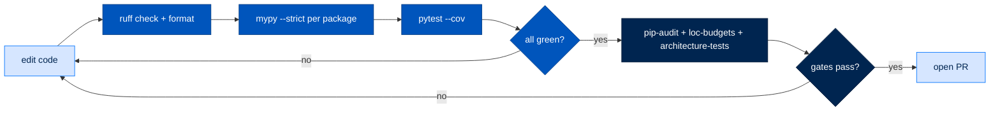
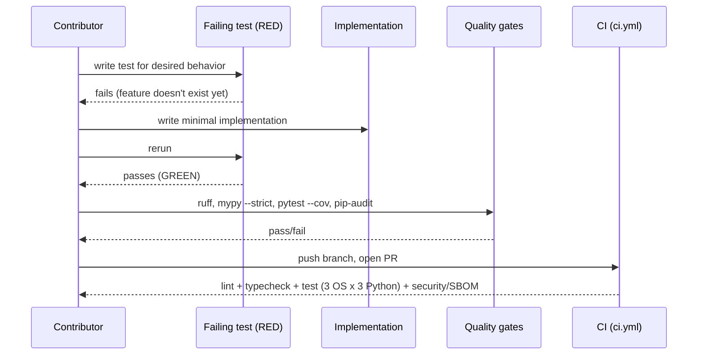
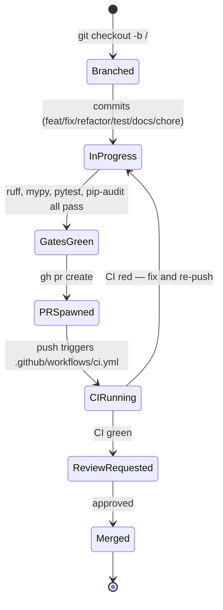

# 13. Contributing — Setup, Gates, and How Work Lands

> **Section:** 2. System Walkthroughs · **Topic:** Building on Arc
> **Who this is for:** anyone about to write, review, or merge code in this
> repository — a new contributor's first PR, or a returning one who forgot a
> flag.
> **Read this after:** [`docs/02-architecture.md`](02-architecture.md) ·
> **Read this next:** [`docs/14-glossary.md`](14-glossary.md)
> **Plain-language summary lives in:** the "In one breath" section below.
> **See also:** [CONTRIBUTING.md](CONTRIBUTING.md), [TESTING.md](TESTING.md)

---

## In one breath

Arc is 18 small Python packages that all live in one repository and share one
set of quality rules. To contribute: clone the repo, run one command to
install everything, make your change, run the same four checks the robot
reviewer (CI) runs, and open a pull request. There are two house rules that
matter more than any style guide: never leave old code lying around "just in
case," and never walk past a broken test or lint error because someone else
wrote it — if you see it, you fix it. Everything else in this document is the
mechanics of those two rules.

---

## How it actually works

### Setup

Arc is a `uv` workspace — one lockfile (`uv.lock`) and one root
`pyproject.toml` govern all 18 packages under `packages/*`
(`pyproject.toml:99-101`). Requires Python 3.11+ (`pyproject.toml:4`); CI
additionally verifies 3.12 and 3.13 (`.github/workflows/ci.yml:52`).

```bash
git clone git@github.com:joshuamschultz/Arc.git
cd Arc
uv sync --all-packages
```

`uv sync --all-packages` installs every workspace package in editable mode
plus the default dependency group, resolving them all against the single
lockfile — a change in `packages/arcllm` is immediately visible to
`packages/arcagent` without a reinstall. Add `--all-groups` to also pull in
`dev` (ruff, mypy, pytest, pip-audit) and `test` extras
(`pyproject.toml:32-49`); CI always runs with `--all-groups`
(`.github/workflows/ci.yml:25`).

```bash
uv sync --all-packages --all-groups
```

Three dependency groups exist beyond the default set (`pyproject.toml:32-56`):

| Group | Contents | When you need it |
|---|---|---|
| `dev` | ruff, mypy, pytest, pytest-cov, pip-audit, freezegun | Always, for local development |
| `test` | pytest-mock, faker, tomlkit | Pulled in automatically by `dev` workflows |
| `tutorial` | jupyter, nbformat, ipykernel | Only if you're editing a `walkthroughs/*.ipynb` notebook — deliberately excluded from the CI security audit scope (`pyproject.toml:50-55`) |

#### Docker vs local dev — which is canonical for what

Arc ships one Docker image as **the single install path for running Arc**
(local laptop, a single node, or a public cloud VM) — see
[`docs/deploy/docker.md`](deploy/docker.md). That path is canonical for
**deploying and using** Arc: `docker compose up -d` gets a working agent with
no `uv`, no manual `nats-server` download, no `arc init` (`Dockerfile:1-16`,
`docker-compose.yml:1-9`). It is not the contributor loop — the image bakes a
frozen `uv sync --frozen --no-dev` install (`Dockerfile:31`) and has no
mounted source tree to iterate on.

**For contributing, the local `uv` workspace above is canonical.** Edit
source, run tests, run the gates — all against your editable install, not
inside the container. Rebuild and test the Docker image only when your change
touches `Dockerfile`, `deploy/entrypoint.sh`, or `docker-compose.yml`
themselves.

### Running things locally

```bash
# Scaffold a new agent
arc agent create myagent --model anthropic/claude-sonnet-5

# Validate it (writes nothing)
arc agent build myagent --check

# Run one task
arc agent run myagent "Summarize workspace/reports/"

# Interactive chat
arc agent chat myagent

# Terminal UI (registered lazily by arctui; falls back to no-agent mode if
# arcagent.toml is missing)
arc tui

# Multi-agent dashboard
arc ui start --port 8420
```

`arc` is the console script installed by `arccli`
(`packages/arccli/pyproject.toml:33-34`). `arc tui` is the terminal client —
it runs in the same asyncio event loop as the agent (no subprocess, no
Node/Ink bridge) and degrades gracefully to a status-only view if no
`arcagent.toml` is found (`packages/arctui/README.md`). Full command
reference, including `arc llm`, `arc run`, `arc skill`, `arc ext`,
`arc blueprint`, `arc team`, and `arc gateway`: [`docs/cli.md`](cli.md).

> ⚠️ **`--force` is the destructive flag on `arc agent build`, not the bare
> command.** A bare `arc agent build` against an existing `arcagent.toml`
> refuses and exits 1 (`_run_scaffold`,
> `packages/arccli/src/arccli/commands/agent/build.py:152-158`). `--force`
> regenerates the file, preserving only `[agent].name` and `[identity].did` —
> every other hand-edited value is replaced with the template default.
> `arcllm.toml` and `arcrun.toml` are never touched either way. Use `--check`
> to validate; it writes nothing. See
> [`12-configuration.md`](12-configuration.md) for the full flag table.

### The quality gates

Every one of these is a real command, not aspirational — verified against
`Makefile`, `pyproject.toml`, and `.github/workflows/ci.yml`.

```bash
ruff check .                                     # lint — 0 errors required
ruff format --check .                            # format — CI checks, doesn't rewrite
mypy packages/<pkg>/src/<pkg>/ --strict           # type check — per package
pytest --cov=<pkg>                                # tests + coverage
pip-audit --no-deps -r sbom/requirements-gate.txt # dependency vulnerability scan
```

Make targets wrap the ones that have repo-specific plumbing
(`Makefile:1-141`):

| Target | What it runs | Gate |
|---|---|---|
| `make install` | Editable install of the 10 packages with public entry points | Canonical setup (older path; prefer `uv sync --all-packages`) |
| `make lint` | `ruff check` on `arcgateway/src`, `tests/`, `scripts/`, `arcagent/src` | — |
| `make typecheck` | `mypy packages/arcgateway/src/arcgateway/ --strict` | 0 mypy errors |
| `make test` | `pytest packages/arcgateway/tests/ tests/ -m "not slow"` | — |
| `make architecture-tests` | `pytest tests/architecture/ -v` | G1.2 |
| `make loc-budgets` | `scripts/check_loc_budgets.py` | G1.5 / G1.6 |
| `make coverage` | `scripts/coverage_report.py` | G1.7 |
| `make race-stress` | 100-run race regression stress test (marked `slow`) | G1.3 |
| `make m1-gates` | architecture-tests + loc-budgets + race-stress in sequence | G1.2/G1.3/G1.5/G1.6 |

These `make` targets only cover `arcgateway`, `arcagent`, and the root
`tests/`. For any other package, run `ruff`/`mypy`/`pytest` directly scoped to
that package's `src/`/`tests/` — that's what CI does per-package
(`.github/workflows/ci.yml:33-44,73-100`).

**mypy is run per-package in CI, not repo-wide** — currently `arcllm`,
`arcrun`, `arcagent`, and `arcmemory` are gated in `ci.yml`
(`.github/workflows/ci.yml:33-44`). If your change touches a package not yet
in that list, still run `mypy <pkg>/src/<pkg>/ --strict` locally and fix what
it finds — the project rule ("leave it correct") does not wait for CI to
catch up.

**Thresholds** (`CLAUDE.md`):

| Gate | Threshold |
|---|---|
| Line coverage | ≥ 80% |
| Branch coverage | ≥ 75% |
| Core component coverage | ≥ 90% |
| Cyclomatic complexity | ≤ 10 per function |
| Ruff errors | 0 |
| mypy errors | 0 |
| Critical/high vulnerabilities | 0 |
| Core LOC | < 3,500 |

**LOC is measured by `scripts/check_loc_budgets.py`** — a non-blank,
non-comment line counter (NCLOC) with two hard-coded budget tables
(`scripts/check_loc_budgets.py:1-60`): `arcagent/core/` capped at 3,500 lines,
`arcgateway`'s four core files capped at 1,200 lines combined, plus a
per-package foundation-tier ceiling (`arctrust` 3,600, `arcllm` 7,900,
`arcrun` 5,400, `arcprompt` 700 at time of writing — see the script for the
current numbers). Run it with `make loc-budgets` or
`uv run python scripts/check_loc_budgets.py`.

> ⚠️ If a budget check fails, the fix is almost never "raise the ceiling" — it
> is a signal the code belongs somewhere else. Move it before you widen the
> budget.

**Coverage is measured by `scripts/coverage_report.py`**, which shells out to
`pytest --cov` per package and fails honestly (0% reported, not skipped) if a
package has no tests yet (`scripts/coverage_report.py:1-38`). Run
`uv run python scripts/coverage_report.py`, add `--html` for a browsable
report, `--fail-fast` to stop at the first threshold miss.

**pip-audit is scoped to the runtime closure, not the dev toolchain.** CI
exports only what actually ships (`sbom/requirements-gate.txt`, excluding
`dev`/`test`/`tutorial` groups) before scanning
(`.github/workflows/ci.yml:118-137`), and honors documented exceptions in
`sbom/security-suppressions.txt`. Any new, un-suppressed vulnerability in that
runtime closure fails the build.



### The non-negotiable house rules

These get PRs rejected. Stated bluntly, from `CLAUDE.md`:

- **No legacy or backward-compat code.** This is a local-only repository, not
  a published library with external consumers to protect. Never write
  migration helpers, deprecation shims, vestigial stubs, or anything "kept
  for compatibility." When you change a behavior, **delete the old code in
  the same edit** — no commented-out blocks, no `_DELETE_ME_LATER`. One line
  beats five; don't replace a one-line fix with a resolver/helper/warner
  abstraction. See [[feedback_clean_lean_no_legacy]].
- **Leave it correct.** If `ruff check`, `mypy`, or any quality gate surfaces
  an error while you're working — even in code you didn't touch and didn't
  write — fix it now. "Pre-existing, not my problem" is never an accepted
  answer; the repository is left clean every session, every commit, every
  PR. If a fix is genuinely out of scope, say so explicitly and ask before
  deferring — the default is fix.
- No `# type: ignore` without a comment explaining why.
- No bare `except:` blocks.
- No mutable default arguments.
- No monkey-patching.
- No `print()` statements — use structured logging.
- No global state outside of config.
- No hardcoded secrets or plaintext credentials.
- Comment the WHY, not the WHAT. No comments narrating what changed or "the
  new way" — code reflects current reality, commit messages hold the history.

### Testing

The pyramid, from `CLAUDE.md`: unit 70% / integration 20% / e2e 10%, plus
dedicated security and performance suites. In practice:

| Location | What lives there |
|---|---|
| `packages/<pkg>/tests/` | Per-package unit + integration tests — most tests live here, next to the code they cover |
| `packages/<pkg>/tests/unit/` | Unit tests (present in most packages, e.g. `arcstore`, `arcmemory`) |
| `packages/<pkg>/tests/integration/` | Integration tests within a package |
| `packages/arcagent/tests/security/` | Adversarial / security-specific suite |
| `tests/architecture/` | Repo-wide architecture regression guards (13 tests at time of writing) |
| `tests/integration/` | Cross-package end-to-end specs (e.g. `test_spec056_e2e.py`) |
| `walkthroughs/<package>/*.ipynb` | Runnable notebook tutorials — not test suites, but the "does this actually work end to end" demonstration for a package |

Run a package's suite directly: `uv run pytest packages/arcllm/tests/ -v -m "not slow"`
(what CI does per package, `.github/workflows/ci.yml:69-70`). The `slow`
marker is reserved for tests that start a real `nats-server`
(`pyproject.toml:104-106`) and are skipped by default.

#### Hard-won testing lessons

**Architecture tests must be updated when the architecture evolves.** They
live in a per-package `tests/architecture/` directory — `arcagent`,
`arcgateway`, `arcmemory`, and `arcskill` each have one, and `arcllm`,
`arcrun`, `arcteam`, and `arcagent` also carry a top-level `architecture/`
directory (`test_no_arcagent_imports_arcgateway.py`,
`test_no_arcrun_imports_arcagent.py`, `test_no_global_tool_name_mutation.py`,
`test_no_unsigned_backends_at_federal.py`, and 9 others). A silently passing
architecture test after a real structural change is false confidence, not a
green light — the invariant it encodes may no longer be the invariant you
actually want. If you strengthen or change a layering rule, update the test
in the same PR, don't leave it checking the old rule.

**Concurrency tests must force real interleaving.** An instant mock makes
`asyncio.gather` run its tasks sequentially in practice, so a test can pass
even with the unsafe global/race condition it's supposed to catch fully
restored. Use `asyncio.Barrier` to force two coroutines to reach a contested
point at the same time — see
`packages/arcstore/tests/unit/test_tasks.py:579` (`barrier = asyncio.Barrier(2)
# forces real interleaving, not a sequential mock`) and the
`_ReadBarrierBackend` pattern at `packages/arcstore/tests/unit/test_tasks.py:837-868`.

**Don't patch only already-imported `sys.modules` keys.** Patching a module
reference that's already sitting in `sys.modules` leaves the *canonical*
import path untouched — in a fresh venv (like CI), that canonical path
resolves for real and makes a live network call your test thought it had
mocked out. Patch the canonical path to `None`, or construct and register a
fake module under its real name as
`packages/arcllm/tests/test_coverage_gaps.py:716-729` does
(`sys.modules["arcllm._fake_vault_backend"] = fake_mod`, cleaned up in a
`finally`). WebSocket tests specifically need explicit receive timeouts —
an un-timed-out `await ws.receive()` hangs the whole suite instead of failing
fast.

**Demand end-to-end-through-the-real-path tests.** Arc's most recurring
failure mode is a correct predicate with dead activating wiring — a feature
whose logic is right, sitting behind a switch nobody actually flips at
runtime ("producers unwired"). A unit test on the predicate in isolation
passes while the feature is completely inert in production. Before trusting a
new feature is live, trace it through its real entry point — the CLI command,
the config flag, the module registration — not just the function that
implements it. `tests/integration/test_spec056_e2e.py` and
`test_spec054_e2e.py` are examples of tests written specifically to catch
this: they exercise the real dispatch path, not a mocked-out shortcut around
it.



### How work lands

Branch naming: `<type>/<description>` (e.g. `feat/quick-deploy`,
`fix/login-redirect-bug`). Never commit directly to `main`. Conventional
commit types: `feat`, `fix`, `refactor`, `test`, `docs`, `chore`.

Specs live under `.claude/specs/<ID>/` as PRD → SDD → PLAN
(`SPEC-001-kimi-provider`, `SPEC-056-mission-control`, etc.) — `.claude/` is
gitignored, so specs are **local to your machine**, not part of the shared
history. They're a planning artifact, not a substitute for the commit
history or this doc set. A spec's status field must be committed together
with the implementation that closes it, or the two drift: don't mark a spec
`VERIFIED` in one session and commit the code that verifies it in a later,
separate one.



### ADRs

Write an Architecture Decision Record when a choice is non-obvious enough
that a future contributor will otherwise re-litigate it — a scope cut, a
layering rule, a storage split, a security invariant. They live in
`docs/architecture/decisions/ADR-NNN-<slug>.md`. Existing numbers, so you
know the next free one:

| ADR | Topic |
|---|---|
| ADR-018 | No MCP client, no migration tooling, no ACP adapter in SPEC-018 |
| ADR-019 | The Four Pillars (identity/sign/authorize/audit) are universal, not federal-only |
| ADR-020 | arcgateway as the data plane |
| ADR-021 | Agent self-description via TOML `[ui]` section |
| ADR-022 | Storage split: arctrust WORM vs arcstore operational |
| ADR-023 | Capability resolution and the arcrun provider |
| ADR-024 | Unified streaming run entry |
| ADR-025 | `cache_control` confined to the Anthropic adapter |
| ADR-026 | `transform_context` append-only with an emergency valve |
| ADR-027 | Per-run tool-set freeze security invariant |
| ADR-028 | Append-only prefix contract, debug-gated |

**Next free number: ADR-029.** Follow the existing template: `Status`,
`Date`, `Spec` (if applicable), `Context`, `Decision`, `Rationale`.

### Documentation duties

If your change alters behavior, update the affected doc in this set
(`docs/01-what-is-arc.md` through `docs/14-glossary.md` — see
[`docs/README.md`](README.md) for the full index and reading paths) in the
same PR. If the package has a runnable tutorial under
`walkthroughs/<package>/`, refresh it too — a walkthrough that no longer runs
is worse than no walkthrough, because it looks authoritative. Existing
walkthrough packages: `arcagent`, `arcgateway`, `arcllm`, `arcrun`,
`arcskill`, `arcteam`, `arctrust`, `arcui`.

### Deploying

Full runbooks — link, don't duplicate:

- [`docs/deploy/single-node.md`](deploy/single-node.md) — one
  `systemd --user` unit running `arc ui start` with the embedded gateway.
  The validated, canonical single-box pattern.
- [`docs/deploy/docker.md`](deploy/docker.md) — the containerized form of the
  same pattern; canonical for actually shipping/running Arc anywhere outside
  a dev loop.
- [`docs/deploy/team-building.md`](deploy/team-building.md) — standing up a
  multi-agent fleet on top of a single-node deployment.

The real runbook shape, condensed: push your branch → merge to `main` → on
the target box, pull `main` (or `develop`) → `uv sync` (on a box with
`uv.lock` conflicts, check out `uv.lock` from the branch first) →
`systemctl --user restart arc.service` → confirm `/api/health` on the
configured `ARC_UI_PORT`.

Two things bite people on a deployed box:

- **Team TOMLs are typically untracked on the box.** `team/<agent>/arcagent.toml`
  holds a minted DID and is generated per-deployment, not committed — don't
  expect `git pull` to update it, and don't overwrite a live one by hand
  without checking the DID first.
- **The committed `arcui` static bundle is served as-is.** If your change
  touches `packages/arcui/web/`, you must rebuild the static bundle and
  restart the service — a source change with no rebuild is invisible to
  anyone loading the dashboard.

### The knowledge graph

This repo has a `code-review-graph` MCP server providing a persistent,
incrementally-updated structural graph of the codebase (parsed with
Tree-sitter). Per the root `CLAUDE.md`, **use it before Grep/Glob/Read** when
exploring code — it's faster, cheaper in tokens, and gives you relationships
(callers, dependents, test coverage) that scanning files can't.

| Tool | Use when |
|---|---|
| `detect_changes` | Reviewing a diff — risk-scored analysis of what changed |
| `get_review_context` | Need source snippets for a review — token-efficient vs. reading whole files |
| `get_impact_radius` | Understanding the blast radius of a change before you make it |
| `get_affected_flows` | Which execution paths are impacted by a change |
| `query_graph` | Tracing callers, callees, imports, tests, dependencies |
| `semantic_search_nodes` | Finding functions/classes by name or keyword |
| `get_architecture_overview` | High-level codebase structure via community boundaries |

Typical flow: the graph auto-updates on file changes via hooks. Use
`detect_changes` before opening a review. Use `get_affected_flows` to see
what a change actually touches. Use `query_graph` with
`pattern="tests_for"` to check whether the code you're about to change has
coverage before you change it — falling back to Grep/Glob/Read only when the
graph doesn't cover what you need.

---

## Where to look in the code

| Path | What lives there | Start here if you're changing... |
|---|---|---|
| `pyproject.toml` | Workspace definition, ruff/mypy config, dependency groups | Adding a package, changing lint/type rules, adding a dependency |
| `Makefile` | M1 acceptance gate targets | Adding a new repo-wide gate |
| `.github/workflows/ci.yml` | The actual CI pipeline (lint, per-OS/version test matrix, security/SBOM) | Changing what CI checks or how it's scoped |
| `scripts/check_loc_budgets.py` | LOC budget definitions and enforcement | A package is bumping against its LOC ceiling |
| `scripts/coverage_report.py` | Per-package coverage thresholds | Coverage gate is failing or a new package needs a threshold |
| `tests/architecture/` | Repo-wide layering invariants | Any change to which package imports which |
| `docs/architecture/decisions/` | ADRs | Recording a non-obvious architectural choice |
| `docs/deploy/` | Deployment runbooks | Deploying, or changing how Arc is deployed |
| `Dockerfile`, `deploy/entrypoint.sh`, `docker-compose.yml` | The single install path | Changing what ships in the image or first-boot behavior |
| `sbom/security-suppressions.txt` | Documented, accepted vulnerability exceptions | A `pip-audit` finding needs a compensating-control writeup instead of a fix |
| `packages/<pkg>/CLAUDE.md` | Per-package build standards (mirrors the root, package-scoped) | Working inside one specific package |
