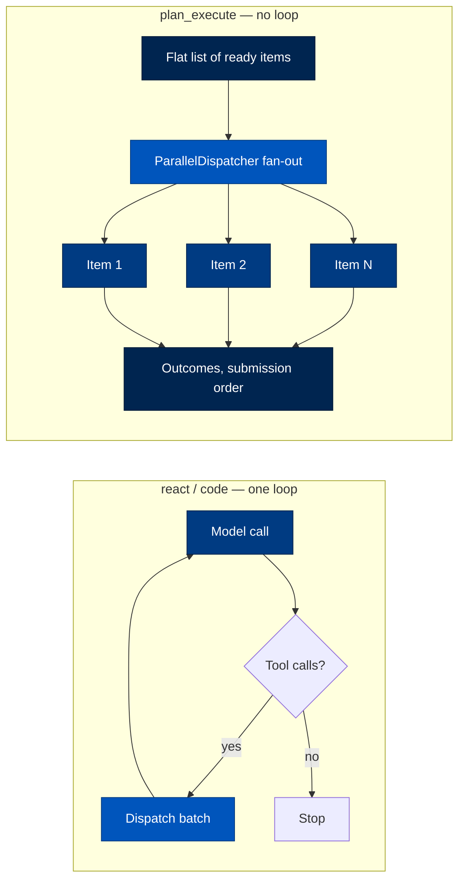
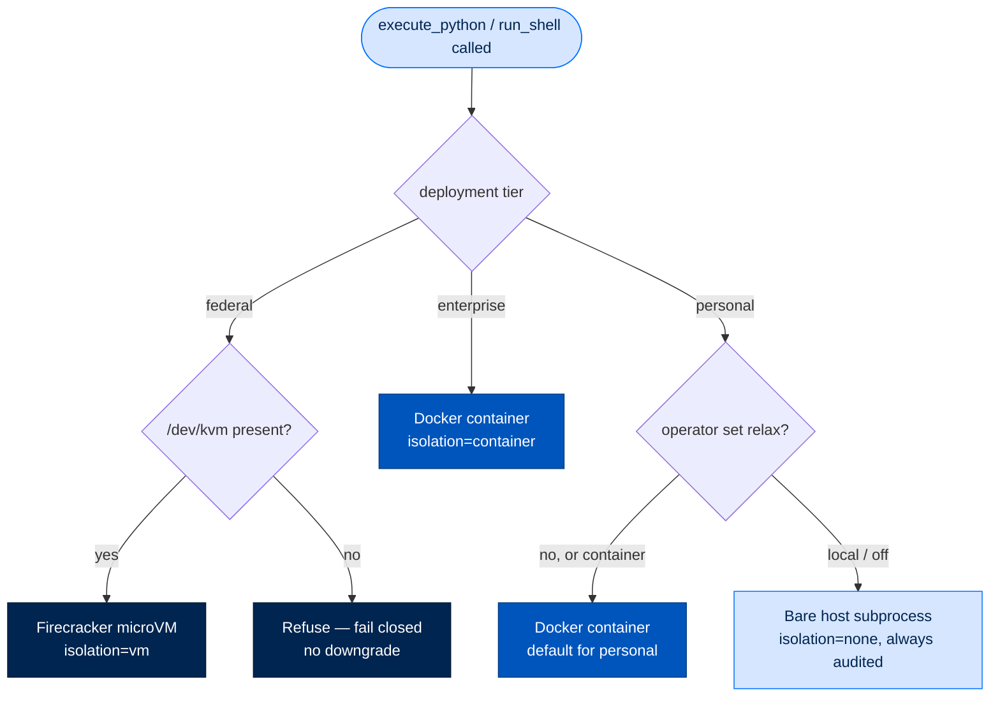
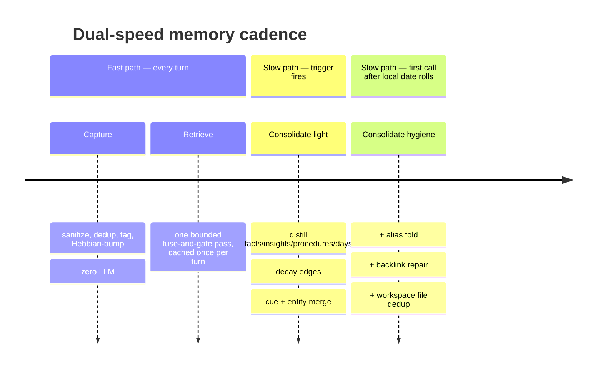
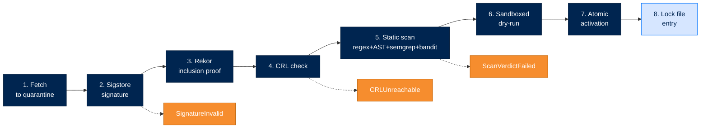

# API Reference

> **Section:** 3. Reference · **Topic:** Technical Reference
> **Who this is for:** Developers building on Arc who need detailed API documentation.
> **Read this after:** [DATA_FLOW.md](DATA_FLOW.md) · **Read this next:** [IMPLEMENTATION_GUIDES.md](IMPLEMENTATION_GUIDES.md)
> **See also:** [PACKAGE_INDEX.md](PACKAGE_INDEX.md), [IMPLEMENTATION_GUIDES.md](IMPLEMENTATION_GUIDES.md)

---

## Overview

This reference documents the core APIs for all Arc packages. For detailed package documentation, see [Package Index](PACKAGE_INDEX.md) and individual package docs in [docs/packages/](packages/).

## arctrust - Security Primitives

Foundation package providing cryptographic identity and audit capabilities.

### `DID` Class

```python
class DID:
    key: str                    # Base58-encoded public key
    did: str                    # did:key:z6Mk... format
    
    @classmethod
    def generate() -> DID:
        """Generate a new Ed25519 DID."""
    
    def sign(self, data: bytes) -> str:
        """Sign data with Ed25519 private key."""
    
    def verify(self, data: bytes, signature: str) -> bool:
        """Verify signature against this DID's public key."""
```

### `AuditLogger` Class

```python
class AuditLogger:
    def __init__(self, signer: Signer):
        """Initialize with operator's signing key."""
    
    def log(
        self,
        action: str,
        actor: str,          # DID string
        resource: str,
        outcome: str,        # "success" | "failure"
        metadata: dict = None
    ) -> AuditRecord:
        """Log an auditable action."""
    
    def verify_chain(self) -> bool:
        """Verify audit chain integrity."""
```

### `AuditRecord` Type

```python
class AuditRecord(TypedDict):
    id: str
    timestamp: str
    prev_signature: str
    action: str
    actor: str
    resource: str
    outcome: str
    metadata: dict
    operator_signature: str
```

### Signer Protocol

```python
class Signer(Protocol):
    def sign(self, data: bytes) -> str: ...
    def public_key(self) -> str: ...
```

---

## arcllm - LLM Client

Zero-SDK HTTP client for 16 LLM providers with telemetry, budgets, and circuit breakers.

### `LLMProvider` Abstract Base Class

```python
class LLMProvider(ABC):
    name: str
    model_name: str
    
    async def invoke(
        self,
        messages: list[Message],
        tools: list[Tool] | None = None,
        *,
        response_format: ResponseFormat | None = None,
        **kwargs
    ) -> LLMResponse
    
    async def invoke_stream(
        self,
        messages: list[Message],
        tools: list[Tool] | None = None,
        **kwargs
    ) -> AsyncIterator[Delta]
    
    def validate_config(self) -> None: ...
    async def close(self) -> None: ...
```

### Core Types

| Type | Description |
|---|---|
| `Message` | `role` + `content` (string or list of `ContentBlock`) |
| `ContentBlock` | Discriminated union: `TextBlock`, `ImageBlock`, `ToolUseBlock`, `ToolResultBlock` |
| `Tool` | `name`, `description`, `parameters` (JSON Schema) |
| `LLMResponse` | `content`, `tool_calls`, `usage`, `stop_reason`, `cost_usd` |
| `Delta` | Incremental frame of a streamed response |
| `ResponseFormat` | TypedDict for structured output hints |

### Provider Adapters

The 16 providers use two base implementations:

| Provider | Adapter | Extends | Notes |
|---|---|---|---|
| anthropic | `AnthropicAdapter` | `BaseAdapter` | Own wire format; prompt caching |
| openai | `OpenaiAdapter` | `BaseAdapter` | Own wire format; real SSE streaming |
| azure_openai | `Azure_OpenaiAdapter` | `OpenaiAdapter` | `api-key` header; no `?api-version` |
| cohere | `CohereAdapter` | `OpenaiAdapter` | Thin alias |
| deepseek | `DeepseekAdapter` | `OpenaiAdapter` | Thin alias |
| fireworks | `FireworksAdapter` | `OpenaiAdapter` | Thin alias |
| google | `GoogleAdapter` | `OpenaiAdapter` | URL path without `/v1/` |
| groq | `GroqAdapter` | `OpenaiAdapter` | Thin alias |
| huggingface | `HuggingfaceAdapter` | `OpenaiAdapter` | Thin alias |
| huggingface_tgi | `HuggingfaceTgiAdapter` | `OpenaiAdapter` | On-prem; self-hosted TGI |
| mistral | `MistralAdapter` | `OpenaiAdapter` | `tool_choice: "required"` → `"any"` |
| moonshot | `MoonshotAdapter` | `OpenaiAdapter` | Thin alias (Kimi models) |
| ollama | `OllamaAdapter` | `OpenaiAdapter` | On-prem; KV-cache warmth server-side |
| together | `TogetherAdapter` | `OpenaiAdapter` | Thin alias |
| vllm | `VllmAdapter` | `OpenaiAdapter` | On-prem; high-performance server |
| xai | `XaiAdapter` | `OpenaiAdapter` | Thin alias |

### Module Pipeline

`load_model()` wraps the adapter in a fixed stack of optional modules:

```
Otel → Queue → Telemetry → Audit → Guardrails → Injection →
Security → CircuitBreaker → Retry → Fallback → RateLimit →
[Router | LoadBalancer | Adapter]
```

| Module | Default | Purpose |
|---|---|---|
| `RetryModule` | **on** | Exponential backoff + jitter on transient failures (429/500/502/503/529) |
| `SecurityModule` | **on** | PII/secret redaction bidirectional; Ed25519/ECDSA-P256 request signing |
| `TelemetryModule` | **on** | Token/cost/budget tracking; `TraceRecord` emission |
| `QueueModule` | **on** | Bounded concurrency + backpressure (max_concurrent=2) |
| `FallbackModule` | off | Provider chain on exception |
| `CircuitBreakerModule` | off | Stops calling failing providers |
| `InjectionModule` | off | Scans for prompt injection |
| `GuardrailsModule` | off | Output validation (JSON schema, regex) |
| `AuditModule` | off | PII-safe metadata logging |
| `RateLimitModule` | off | Token-bucket per provider |
| `OtelModule` | off | OpenTelemetry tracing |

### Key Functions

```python
arcllm(provider, model, tools, **kwargs) -> LLMClient
LLMClient.chat(messages, tools, temperature, max_tokens) -> LLMResponse
LLMClient.embed(texts) -> list[list[float]]
LLMClient.count_tokens(text) -> int
```

---

## arcstore - Storage Backend

Unified storage interface for sessions, memory, and tasks.

### `Store` Class

```python
class Store:
    def __init__(self, root: Path):
        """Initialize store with root directory."""
    
    def sessions(self) -> SessionStore:
        """Get session storage interface."""
    
    def memory(self) -> MemoryStore:
        """Get memory storage interface."""
    
    def tasks(self) -> TaskStore:
        """Get task storage interface."""
```

### `SessionStore` Class

```python
class SessionStore:
    def list(self) -> list[SessionMeta]:
        """List all sessions."""
    
    def create(self) -> Session:
        """Create new session."""
    
    def get(self, session_id: str) -> Session:
        """Get session by ID."""
    
    def append_turn(self, session_id: str, turn: Turn) -> None:
        """Append a turn to session."""
```

### `MemoryStore` Class

```python
class MemoryStore:
    def get_entities(self) -> dict[str, Entity]:
        """Get all entities."""
    
    def upsert_entity(self, entity: Entity) -> None:
        """Insert or update entity."""
    
    def get_episodes(self, limit: int = 100) -> list[Episode]:
        """Get recent episodes."""
    
    def append_episode(self, episode: Episode) -> None:
        """Append episode to memory."""
    
    def get_daily(self, date: str) -> list[DailyEntry]:
        """Get daily log entries."""
```

### `TaskStore` Class

```python
class TaskStore:
    def list_todo(self) -> list[Task]:
        """List pending tasks."""
    
    def assign(self, task_id: str, owner: str) -> Task:
        """Atomically assign task to owner."""
    
    def complete(self, task_id: str, result: dict) -> Task:
        """Mark task complete."""
    
    def route(self, task: Task) -> Task:
        """Auto-route to least-loaded matching agent."""
```

---

## arcagent - Agent Framework

Main agent implementation with capabilities system.

### `ArcAgent` Class

```python
class ArcAgent:
    def __init__(self, config: AppConfig, config_path: Path = None):
        """Initialize agent with configuration."""
    
    async def startup(self) -> None:
        """Load capabilities, initialize memory."""
    
    async def run(self, task: str) -> Result:
        """Run a one-shot task."""
    
    async def chat(self, message: str) -> Reply:
        """Multi-turn chat."""
    
    async def shutdown(self) -> None:
        """Clean shutdown."""
    
    def capabilities(self) -> dict[str, Tool]:
        """Get available capabilities."""
    
    def skills(self) -> list[Skill]:
        """Get available skills."""
```

### `Result` Type

```python
class Result(TypedDict):
    content: str
    turns: int
    cost_usd: float
    session_id: str
    tool_calls: list[ToolCall]
```

### `AppConfig` Type

```python
class AppConfig(TypedDict):
    model: ModelConfig
    identity: IdentityConfig
    security: SecurityConfig
    modules: ModuleConfig
```

### Tool Decorator

```python
@tool(
    name: str,
    description: str,
    classification: str = "read_only",  # read_only | network | write | dangerous
    version: str = "1.0.0"
)
def my_tool(param: str) -> str:
    """Tool implementation."""
```

---

## arcrun - Execution Loop

Think-act-observe loop with strategies, steering, and sandboxing.

### Core Entry Points

```python
async def run(
    model,
    capabilities,
    task,
    messages=None,
    *,
    system_prompt=None,
    actor_did=None,
    run_id=None,
    max_turns=50,
    max_tokens=None,
    max_cost_usd=None,
    tool_choice=None,
    on_event=None,
    on_handle=None,
    **loop_controls
) -> LoopResult:
    """Blocking entry - awaits to completion."""

async def run_async(...) -> RunHandle:
    """Non-blocking entry - returns steerable handle."""

async def run_stream(...) -> AsyncIterator[StreamEvent]:
    """Streaming entry - yields events as they happen."""
```

### Strategies

| Strategy | Description | Loop Shape |
|---|---|---|
| `react` | Default: Reason → Act → Observe → Repeat | `react_loop` directly |
| `code` | Same loop with code-biased system prompt | Delegates to `react_loop` after prompt injection |
| `plan_execute` | Parallel fan-out of ready items | No loop - single concurrent gather |

**Strategy Selection Flow:**


### Steering a Run in Flight

```python
class RunHandle:
    async def steer(self, caller_did: str, message: str) -> None:
        """Interrupt: injected as next user-role message"""
    
    async def follow_up(self, caller_did: str, message: str) -> None:
        """Queued: injected only once model reaches end_turn"""
    
    async def cancel(self, caller_did: str, reason: str = None) -> None:
        """Hard stop, attributed to caller"""
```

### Budget Guards

```python
# check_breaker() runs at top of every turn
# All thresholds are O(1) comparisons

max_turns: int           # Turn ceiling
max_tokens: int           # Token ceiling  
max_cost_usd: float       # Cost ceiling
max_repeat: int           # Runaway loop (same tool sig repeats)
max_consecutive_errors: int  # Error cascade
```

### Sandboxing

```python
class Sandbox:
    def execute(
        self,
        code: str,
        timeout: int = 60,
        memory_limit: str = "512m"
    ) -> ExecutionResult:
        """Execute code in sandbox."""
```

#### Execution Backends

| Backend | Isolation | Cold Start | Used At |
|---|---|---|---|
| `LocalBackend` | none - bare host subprocess | ~10ms | Personal, explicit opt-in only |
| `DockerBackend` | container | ~800ms first, ~30ms after | Enterprise; Personal default |
| `VmBackend` (Firecracker) | vm | ~200ms | Federal, always |



### Tool Registry and Freeze

```python
class ToolRegistry:
    def add(self, tool: Tool) -> None: ...
    def remove(self, name: str) -> None: ...
    def freeze(self) -> None:
        """Lock tool set - no mutations after this point."""
```

The **per-run tool-set freeze** (ADR-027) is a security invariant: after `freeze()`, any `add`/`remove` raises `RuntimeError` and emits `tool.mutation_denied`. This prevents mid-run tool injection attacks.

### Parallel Dispatch

```python
# Every tool call funnels through dispatch_batch()
# BatchClassifier determines concurrency safety:

# Sequential if any:
# - classification != "read_only"
# - unknown tool name (defaults to "state_modifying")
# - shared path-like argument (heuristic: contains / or \)

# Otherwise: parallel via asyncio.Semaphore(max_parallel=10)
```

---

## arcmemory - Memory System

Dual-speed, four-store, analogical memory: markdown source + SQLite index.

### Brain Protocol

```python
class Brain(Protocol):
    async def capture(self, event: MemoryEvent) -> None: ...
    async def retrieve(self, query: str, k: int = 5) -> MemoryBundle: ...
    async def consolidate(self, scope: Scope) -> ConsolidationResult: ...
    async def rebuild_index(self) -> None: ...
```

**Structural invariant:** arcagent is a memory socket, not a brain. All memory logic lives in arcmemory; arcagent only holds a structural interface.

### MemoryService Class

```python
class MemoryService:
    def __init__(self, store: MemoryStore):
        """Initialize with store backend."""
    
    async def index(self, content: str, metadata: dict) -> str:
        """Index content into memory."""
    
    async def search(self, query: str, k: int = 5) -> list[MemoryHit]:
        """Search memory for relevant content."""
    
    async def get_entity(self, name: str) -> Entity:
        """Get entity by name."""
```

### Four Stores

| Store | Module | Purpose |
|---|---|---|
| Episodic | `stores/episodic.py` | Time-ordered events; raw transcript |
| Entity | `stores/semantic.py` | Structured knowledge graph |
| Insight | `stores/insight.py` | Durable lessons with triggers/cues |
| Procedural | `stores/procedural.py` | Reusable methods/procedures |
| Daily | `stores/daily.py` | Curated daily summaries |

### Dual-Speed Operation



### Index System

| Index | Purpose | Channels |
|---|---|---|
| Surface (`index/surface.py`) | "What past text looks like this query" | vec cosine + BM25 + graph spreading + recency (RRF-fused) |
| Structural (`index/structural.py`) | "What past pattern does this instance" | Trigger-embedding cosine + cue-graph spreading (conjunctive gate) |

### Security Features

- **DID guard:** Cross-agent isolation via DID-keyed registry
- **No-read-up:** Classification dominance checked via `arctrust.dominates()`
- **Boundary marking:** Memory results framed as `<memory-result>` data blocks
- **Signed writes:** Agentic sleep pass tools are sign→authorize→audit wrapped

### Data Types

```python
class Episode(TypedDict):
    id: str
    timestamp: str
    content: str
    embedding: list[float]
    metadata: dict

class Entity(TypedDict):
    id: str
    name: str
    type: str  # "person" | "organization" | "concept"
    observations: list[str]
    last_updated: str

class Insight(TypedDict):
    id: str
    trigger: str      # Situation at mechanism level
    cues: list[str]   # Abstract tags (graph nodes)
    instances: list[str]  # Episode IDs it generalizes
    confidence: float
    status: str       # "guessed" or "known"

class DailyEntry(TypedDict):
    date: str
    entries: list[str]
```

---

## arcteam - Multi-Agent Coordination

Entity registry and messaging service.

### `EntityRegistry` Class

```python
class EntityRegistry:
    async def register(self, entity: Entity) -> None:
        """Register an entity (agent or user)."""
    
    async def lookup(self, entity_id: str) -> Entity:
        """Get entity by ID."""
    
    async def list_entities(self) -> list[Entity]:
        """List all registered entities."""
```

### `MessagingService` Class

```python
class MessagingService:
    async def send(
        self,
        sender: str,
        to: list[str],
        body: str,
        msg_type: MsgType,
        priority: Priority = "normal"
    ) -> Message:
        """Send a message."""
    
    async def receive(
        self,
        recipient: str,
        cursor: Cursor = None
    ) -> list[Message]:
        """Receive messages."""
```

### Message Types

```python
class MsgType(Enum):
    info = "info"
    request = "request"
    task = "task"
    task_assigned = "task_assigned"
    result = "result"
    alert = "alert"
    ack = "ack"

class Priority(Enum):
    low = "low"
    normal = "normal"
    high = "high"
    critical = "critical"
```

---

## arcskill - Skill Hub

Verified skill installation with Sigstore/Rekor verification.

### Install Pipeline



### HubConfig

```python
class HubConfig(TypedDict):
    enabled: bool = False
    tier: str = "personal"
    allowed_sources: list[str] = None
    require_sigstore: bool = True
    require_rekor: bool = True
    require_crl: bool = True
    require_static_scan: bool = True
    require_sandbox: bool = True
```

### Key Functions

```python
async def install(skill_name: str, source_url: str, config: HubConfig) -> SkillMetadata:
    """Install through 8-gate verified pipeline."""

def scan(source: Path, rules: list[str] = None) -> ScanResult:
    """Static scan of capability/skill code."""

async def improve(skill: Skill, traces: list, config: ImproverConfig) -> ImprovementProposal:
    """Propose improvements via golden-task gate."""
```

### Scan Verdicts

```python
class ScanResult(TypedDict):
    verdict: str  # "pass" | "warn" | "fail"
    findings: list[Finding]
    score: float

class Finding(TypedDict):
    rule_id: str
    severity: str  # "info" | "warn" | "error" | "critical"
    message: str
    location: str
```

### Edit Budgets (Improver)

| Tier | Max Edits | Max Lines |
|---|---|---|
| Personal | 8 | 80 |
| Enterprise | 4 | 40 |
| Federal | 2 | 20 |

---

## arcskill.improver - Skill Self-Improvement

Code repair and optimization system.

### `improve()` Function

```python
async def improve(
    skill: Skill,
    failing_traces: list[ExecutionTrace],
    config: ImproverConfig
) -> ImprovementProposal:
    """Propose improvements to a skill."""
```

### `ImproverConfig` Type

```python
class ImproverConfig(TypedDict):
    max_edits: int = 4      # Enterprise default
    max_lines_changed: int = 40
    tier: str = "enterprise"
    golden_task_gate: bool = True
```

---

## arcprompt - Prompt Engine

Prompt building and management.

### `build_prompt()` Function

```python
def build_prompt(
    task: str,
    context: list[dict],
    system_prompt: str = None,
    skills: list[Skill] = None
) -> list[dict]:
    """Build prompt messages for LLM."""
```

### `PromptTemplate` Class

```python
class PromptTemplate:
    def render(self, variables: dict) -> str:
        """Render template with variables."""
```

---

## arccli - CLI Interface

Command-line interface for all operations.

### Commands

```bash
# Agent commands
arc agent create NAME [--blueprint] [--model]
arc agent build NAME [--check]
arc agent chat NAME [--session ID]
arc agent run NAME TASK
arc agent serve NAME
arc agent status NAME

# LLM commands
arc llm providers
arc llm models [--tools]
arc llm validate

# Skill commands
arc skill list [--agent NAME]
arc skill search QUERY
arc skill create NAME [--dir PATH]
arc skill validate PATH

# Capability commands
arc ext list [--agent NAME]
arc ext create NAME [--dir PATH]

# Team commands
arc team init [--root PATH]
arc team register ID [--name] [--type] [--roles]
arc team status
arc team entities [--role ROLE]
arc team channels

# UI commands
arc ui start [--show-tokens] [--port PORT]
arc ui tail [--viewer-token TOKEN] [--layer LAYER]

# Blueprint commands
arc blueprint list
arc blueprint verify PATH
arc blueprint publish PATH
```

---

## arctui - Terminal UI

Terminal interface for agent interaction.

### `TuiApp` Class

```python
class TuiApp:
    def run(self) -> None:
        """Start the TUI application."""
```

---

## arcui - Dashboard

Web dashboard for monitoring and control.

### `DashboardServer` Class

```python
class DashboardServer:
    def start(
        self,
        port: int = 8420,
        show_tokens: bool = False
    ) -> None:
        """Start dashboard server."""
```

---

## arcgateway - Chat Platform Daemon

Multi-platform chat integration.

### Platform Adapters

```python
class TelegramAdapter:
    async def handle_update(self, update: dict) -> None: ...

class SlackAdapter:
    async def handle_event(self, event: dict) -> None: ...

class MattermostAdapter:
    async def handle_posted(self, post: dict) -> None: ...
```

---

## Error Classes

### arctrust Errors

```python
class SecurityError(Exception):
    """Base security error."""

class SignatureInvalid(SecurityError):
    """Signature verification failed."""

class CRLUnreachable(SecurityError):
    """CRL fetch failed at required tier."""
```

### arcskill Errors

```python
class HubDisabled(Exception):
    """Skill hub not enabled in config."""

class SourceNotAllowed(Exception):
    """Source not in allowlist."""

class ScanVerdictFailed(Exception):
    """Static scan returned fail verdict."""

class SandboxRequired(Exception):
    """Sandbox unavailable but required."""
```

### arcagent Errors

```python
class ConfigurationError(Exception):
    """Invalid agent configuration."""

class CapabilityError(Exception):
    """Capability loading/execution error."""
```

---

## Type Definitions

### Core Types

```python
class Tool(TypedDict):
    name: str
    description: str
    parameters: dict
    classification: str

class ToolCall(TypedDict):
    id: str
    name: str
    arguments: dict

class Turn(TypedDict):
    id: str
    timestamp: str
    role: str  # "user" | "assistant" | "tool"
    content: str
    tool_calls: list[ToolCall]

class Session(TypedDict):
    id: str
    created_at: str
    turns: list[Turn]
```

---

## Next Steps

- [Implementation Guides](IMPLEMENTATION_GUIDES.md) - How to use these APIs
- [Package Index](PACKAGE_INDEX.md) - Package-specific documentation