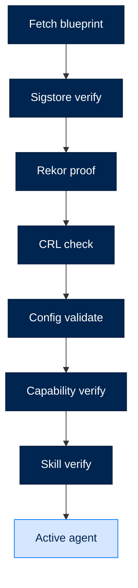

# Blueprints

> **Who this is for:** Users who want to use or create signed preset configurations for Arc agents.
> **Read this after:** [QUICKSTART.md](QUICKSTART.md) · **Read this next:** [SECURITY.md](SECURITY.md)
> **See also:** [IMPLEMENTATION_GUIDES.md](IMPLEMENTATION_GUIDES.md), [BLUEPRINTS.md](BLUEPRINTS.md#skills)

---

## What Are Blueprints?

Blueprints are **signed, versioned presets** that define how an Arc agent should be configured. They are:

- 🔐 **Signed** - Cryptographically verified with Sigstore/Rekor
- 📦 **Portable** - Single file containing full configuration
- 🎯 **Purpose-Built** - Optimized for specific use cases
- 🔄 **Updatable** - Version-controlled with upgrade paths


---

## Built-in Blueprints

Each blueprint is optimized for specific use cases. See [TIERS_AND_PRESETS.md](TIERS_AND_PRESETS.md) for tier comparisons.

### `researcher`

A research-oriented agent with web search and analysis tools.

```bash
arc agent create my-researcher --blueprint researcher
```

**Configuration:**
- Model: `anthropic/claude-sonnet-4-5-20250929`
- Tools: `web_search`, `read_file`, `bash`, `think`
- Skills: `literature-review`, `fact-check`, `citation-formatter`
- Preset: `tier = "enterprise"` (network access allowed)

### `coder`

A code-focused agent for software development tasks.

```bash
arc agent create my-coder --blueprint coder
```

**Configuration:**
- Model: `anthropic/claude-sonnet-4-5-20250929`
- Tools: `read_file`, `write_file`, `bash`, `think`
- Skills: `code-review`, `test-generation`, `refactor-assistant`
- Preset: `tier = "personal"` (sandboxed execution)

### `analyst`

A data analysis agent for CSV/Excel processing and visualization.

```bash
arc agent create my-analyst --blueprint analyst
```

**Configuration:**
- Model: `anthropic/claude-sonnet-4-5-20250929`
- Tools: `read_file`, `write_file`, `bash`, `think`
- Skills: `data-analysis`, `chart-generator`, `statistical-summary`
- Preset: `tier = "enterprise"`

### `assistant`

A general-purpose assistant for chat and productivity.

```bash
arc agent create my-assistant --blueprint assistant
```

**Configuration:**
- Model: `anthropic/claude-sonnet-4-5-20250929`
- Tools: `read_file`, `write_file`, `bash`
- Skills: `note-taker`, `meeting-summarizer`
- Preset: `tier = "personal"`

---

## Blueprint Structure

A blueprint is a signed JSON file with this structure:

```json
{
  "schema": "arc/blueprint/v1",
  "name": "researcher",
  "version": "1.3.0",
  "description": "Research-oriented agent with web search and analysis",
  "issuer": "did:key:z6Mk...",
  "issued_at": "2026-04-28T14:30:00Z",
  "config": {
    "model": {
      "provider": "anthropic",
      "id": "claude-sonnet-4-5-20250929",
      "max_turns": 50
    },
    "security": {
      "tier": "enterprise",
      "validators": {
        "auto_run_agent_code": false
      }
    },
    "modules": {
      "skills": {
        "adapter": "arcskill"
      }
    }
  },
  "capabilities": [
    {
      "name": "web_search",
      "source": "https://hub.arc.net/skills/web-search/v1.2.0",
      "version": "1.2.0"
    }
  ],
  "skills": [
    "literature-review",
    "fact-check"
  ]
}
```

---

## Using Blueprints

### List Available Blueprints

```bash
arc blueprint list
```

Output:
```
┌─────────────┬──────────┬─────────────────────────────────────────────┐
│ Name        │ Version  │ Description                                 │
├─────────────┼──────────┼─────────────────────────────────────────────┤
│ researcher  │ 1.3.0    │ Research-oriented agent                     │
│ coder       │ 1.1.2    │ Software development agent                  │
│ analyst     │ 1.0.5    │ Data analysis and visualization             │
│ assistant   │ 1.2.1    │ General purpose assistant                   │
└─────────────┴──────────┴─────────────────────────────────────────────┘
```

### Create Agent from Blueprint

```bash
# Use built-in blueprint
arc agent create my-agent --blueprint researcher

# Use specific version
arc agent create my-agent --blueprint researcher@1.2.0

# Override model
arc agent create my-agent --blueprint researcher --model ollama/llama3.2:latest
```

### Verify Blueprint Signature

```bash
arc blueprint verify my-agent/arcagent.toml
```

Output:
```
✓ Signature valid (Sigstore)
✓ Rekor inclusion proof verified
✓ Issuer: did:key:z6Mk... (BlackArc Systems)
✓ SLSA level: 3
```

---

## Creating Custom Blueprints

### Scaffold a Blueprint

```bash
arc blueprint create my-custom-agent
```

This creates:
```
my-custom-agent/
├── blueprint.arc              # Blueprint definition
├── capabilities/              # Custom capabilities
├── skills/                  # Custom skills
└── tests/                   # Golden tests
```

### Edit the Blueprint

```bash
code my-custom-agent/blueprint.arc
```

```json
{
  "schema": "arc/blueprint/v1",
  "name": "my-custom-agent",
  "version": "1.0.0",
  "description": "Custom agent for my use case",
  "config": {
    "model": {
      "provider": "anthropic",
      "id": "claude-sonnet-4-5-20250929"
    },
    "security": {
      "tier": "enterprise"
    }
  },
  "capabilities": [],
  "skills": []
}
```

### Add Capabilities

```bash
arc ext create custom-tool --blueprint my-custom-agent
```

### Add Skills

```bash
arc skill create custom-skill --dir my-custom-agent/skills/
```

### Test the Blueprint

```bash
# Build and test
arc agent build my-custom-agent --check

# Run golden tests
pytest my-custom-agent/tests/
```

### Publish the Blueprint

```bash
# Sign and publish
arc blueprint publish my-custom-agent/blueprint.arc
```

This:
1. Validates the blueprint structure
2. Signs with Sigstore
3. Uploads to Rekor transparency log
4. Publishes to hub (if configured)

---

## Blueprint Security Model



| Gate | Purpose |
|------|---------|
| **Sigstore verify** | Ensures blueprint is signed by trusted issuer |
| **Rekor proof** | Proves signature is in public transparency log |
| **CRL check** | Revoked certificates are rejected |
| **Config validate** | Ensures valid configuration structure |
| **Capability verify** | Each capability is verified (if signed) |
| **Skill verify** | Each skill is verified (if from hub) |

---

## Blueprint Distribution

### Local File

```bash
arc agent create my-agent --blueprint ./my-blueprint.arc
```

### URL

```bash
arc agent create my-agent --blueprint https://example.com/blueprints/my.arc
```

### Hub

```bash
arc agent create my-agent --blueprint hub://researcher
```

### Team Share

```bash
# Team blueprints are stored in ~/.arc/blueprints/
arc agent create my-agent --blueprint team://my-team/researcher
```

---

## Blueprint Versioning

```
researcher@1.0.0    # Exact version
researcher@1.x        # Minor version compatible
researcher@latest     # Most recent stable
researcher@canary     # Pre-release version
```

### Upgrade Agent

```bash
# Check for updates
arc agent upgrade my-agent --check

# Upgrade to latest
arc agent upgrade my-agent

# Upgrade to specific version
arc agent upgrade my-agent --blueprint researcher@1.3.0
```

---

## Compliance Mapping

| Standard | Blueprint Support |
|----------|-------------------|
| NIST 800-53 CM-5 | Tier restrictions in blueprint |
| NIST 800-53 CM-7 | Signed capabilities/skills |
| NIST 800-53 CM-8 | Lock file inventory |
| OWASP ASI04 | Sigstore + Rekor + CRL verification |

---

## Next Steps

- [Security Features](SECURITY.md) - Understand verification requirements
- [Implementation Guides](IMPLEMENTATION_GUIDES.md) - Create custom blueprints
- [Package Reference](PACKAGE_INDEX.md) - arcskill and arcagent details