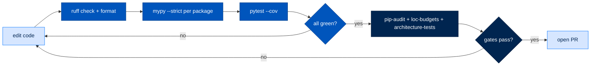

# Developer Contribution Guidelines

> **Section:** 3. Reference · **Topic:** Development
> **Who this is for:** Contributors to the Arc codebase.
> **Read this after:** [DEPLOYMENT.md](DEPLOYMENT.md) · **Read this next:** [TESTING.md](TESTING.md)
> **See also:** [CONTRIBUTING.md](CONTRIBUTING.md) for the core contribution doc

---

## Development Setup

### Prerequisites

```bash
# Required
python >= 3.11
uv >= 0.4.0
docker >= 24.0

# Optional (for full testing)
ollama >= 0.1.0  # For local models
nats-server >= 2.10  # For team testing
```

### Install Development Environment

```bash
# Clone repository
git clone https://github.com/joshuamschultz/Arc.git
cd Arc

# Install all packages in editable mode
uv sync --all-packages

# Install pre-commit hooks
pre-commit install
```

---

## Project Structure

```
Arc/
├── packages/
│   ├── arctrust/          # Security primitives
│   ├── arcstore/          # Storage backend
│   ├── arcllm/            # LLM client
│   ├── arcmodel/          # Model registry
│   ├── arcprompt/         # Prompt engine
│   ├── arcrun/            # Execution loop
│   ├── arcskill/          # Skill hub
│   ├── arcmemory/         # Memory system
│   ├── arcteam/           # Multi-agent
│   ├── arcagent/          # Agent framework
│   ├── arccli/            # CLI
│   ├── arctui/            # Terminal UI
│   ├── arcui/             # Dashboard
│   ├── arcgateway/        # Gateway daemon
│   ├── arcgateway-telegram/
│   ├── arcgateway-slack/
│   ├── arcgateway-mattermost/
│   └── arcmas/            # Metapackage
├── tests/
│   ├── architecture/      # Layering tests
│   └── integration/         # Integration tests
├── docs/
└── walkthroughs/            # Jupyter notebooks
```

---

## Architecture Rules

### Layering Constraints

```mermaid
flowchart TB
    classDef valid fill:#0073FE,stroke:#0055BC,color:#FFFFFF
    classDef invalid fill:#F68D2E,stroke:#C06000,color:#FFFFFF

    arctrust[arctrust]:::valid --> arcagent[arcagent]:::valid
    arcagent --> arctrust
    
    arcgateway[arcgateway]:::invalid -.-> arcagent[arcagent]:::invalid
    "❌ No arcagent imports":::invalid
```

### Valid Import Patterns

| Package | Can Import |
|---------|------------|
| `arctrust` | None |
| `arcstore` | `arctrust` |
| `arcllm` | `arctrust`, `arcstore` |
| `arcprompt` | None |
| `arcrun` | `arcllm`, `arctrust`, `arcstore` |
| `arcskill` | `arctrust` |
| `arcmemory` | `arcstore` |
| `arcteam` | `arctrust`, `arcstore` |
| `arcagent` | `arcrun`, `arcllm`, `arctrust`, `arcstore`, `arcskill`, `arcteam`, `arcmemory` |
| `arccli` | `arcagent`, `arcteam`, `arcskill` |
| `arctui` | `arcagent` |
| `arcui` | `arcagent` |
| `arcgateway` | `arcagent` |

---

## Code Standards

### Type Checking

```bash
# Run mypy strict
uv run mypy --strict packages/arctrust

# All packages must pass
uv run mypy --strict packages/*/
```

### Linting

```bash
# Run ruff
uv run ruff check packages/

# Fix issues
uv run ruff check --fix packages/
```

### Formatting

```bash
# Format with ruff
uv run ruff format packages/
```

### Pre-commit Hooks

```yaml
# .pre-commit-config.yaml
repos:
  - repo: https://github.com/astral-sh/ruff-pre-commit
    rev: v0.6.0
    hooks:
      - id: ruff
      - id: ruff-format
  - repo: https://github.com/pre-commit/mirrors-mypy
    rev: v1.11.0
    hooks:
      - id: mypy
```

---

## Testing

### Run Tests

```bash
# All tests
uv run pytest tests/

# Specific package
uv run pytest packages/arctrust/tests/

# With coverage
uv run pytest --cov=packages/arctrust --cov-report=html

# Watch mode
uv run pytest --watch
```

### Test Categories

```bash
# Unit tests
uv run pytest tests/unit/

# Integration tests
uv run pytest tests/integration/

# Architecture tests
uv run pytest tests/architecture/
```

### Writing Tests

```python
# tests/test_my_feature.py
import pytest
from arcagent import ArcAgent

@pytest.mark.asyncio
async def test_agent_startup():
    config = load_test_config()
    agent = ArcAgent(config)
    await agent.startup()
    assert agent.capabilities()

def test_my_function():
    result = my_function("input")
    assert result == "expected"
```

---

## Pull Request Process

### Before Submitting

```bash
# Run all checks
uv run pre-commit run --all-files

# Run tests
uv run pytest tests/

# Update documentation
# If changing public API, update docs/
```

### PR Checklist

- [ ] Tests pass (`uv run pytest`)
- [ ] Type check passes (`uv run mypy --strict`)
- [ ] Lint passes (`uv run ruff check`)
- [ ] Documentation updated
- [ ] Changelog updated (if applicable)

---

## Release Process

### Version Bump

```bash
# Update version in all packages
# packages/*/pyproject.toml

# Create tag
git tag v1.0.0
git push origin v1.0.0

# Build packages
uv build packages/*/
```

### Publishing

```bash
# Test PyPI
uv publish --publish-url https://test.pypi.org/legacy/

# Production PyPI
uv publish
```

---

## Documentation

### Documentation Structure

```
docs/
├── SETUP.md             # Installation and configuration
├── QUICKSTART.md        # Quick start guide
├── BLUEPRINTS.md        # Blueprints system
├── SECURITY.md          # Security architecture
├── DATA_FLOW.md         # Data flow pathways
├── API_REFERENCE.md     # API documentation
├── IMPLEMENTATION_GUIDES.md  # Implementation guides
├── TIERS_AND_PRESETS.md  # Tiers and presets
├── PACKAGE_INDEX.md     # Package index
├── TROUBLESHOOTING.md   # Troubleshooting
├── DEPLOYMENT.md        # Deployment guides
├── CONTRIBUTING.md      # Contribution guidelines
├── TESTING.md           # Testing guidelines
└── PERFORMANCE.md       # Performance optimization
```

### Adding Documentation

1. Create markdown file in `docs/`
2. Add to `docs/README.md` navigation
3. Include mermaid diagrams for architecture
4. Include code examples

---

## Development Commands

```bash
# Run specific package
uv run --package arcagent pytest packages/arcagent/tests/

# Run specific test
uv run pytest packages/arcagent/tests/test_agent.py::test_startup

# Type check specific package
uv run mypy packages/arctrust

# Lint specific package
uv run ruff check packages/arctrust

# Format specific package
uv run ruff format packages/arctrust
```

---

## Quality Gates

Every one of these is a real command, not aspirational — verified against `Makefile`, `pyproject.toml`, and `.github/workflows/ci.yml`.

```bash
ruff check .                                     # lint — 0 errors required
ruff format --check .                            # format — CI checks, doesn't rewrite
mypy packages/<pkg>/src/<pkg>/ --strict           # type check — per package
pytest --cov=<pkg>                                # tests + coverage
pip-audit --no-deps -r sbom/requirements-gate.txt # dependency vulnerability scan
```

### Make Targets

| Target | What it runs | Gate |
|---|---|---|
| `make install` | Editable install of packages with public entry points | Canonical setup (older path; prefer `uv sync --all-packages`) |
| `make lint` | `ruff check` on `arcgateway/src`, `tests/`, `scripts/` | — |
| `make typecheck` | `mypy packages/arcgateway/src/arcgateway/ --strict` | 0 mypy errors |
| `make test` | `pytest packages/arcgateway/tests/ -m "not slow"` | — |
| `make architecture-tests` | `pytest tests/architecture/ -v` | G1.2 |
| `make loc-budgets` | `scripts/check_loc_budgets.py` | G1.5 / G1.6 |
| `make coverage` | `scripts/coverage_report.py` | G1.7 |
| `make race-stress` | 100-run race regression stress test | G1.3 |
| `make m1-gates` | architecture-tests + loc-budgets + race-stress | G1.2/G1.3/G1.5/G1.6 |

### Thresholds

| Gate | Threshold |
|---|---|
| Line coverage | ≥ 80% |
| Branch coverage | ≥ 75% |
| Core component coverage | ≥ 90% |
| Cyclomatic complexity | ≤ 10 per function |
| Ruff errors | 0 |
| mypy errors | 0 |
| Critical/high vulnerabilities | 0 |
| Core LOC | < 3,500 |

> ⚠️ If a budget check fails, the fix is almost never "raise the ceiling" — it is a signal the code belongs somewhere else. Move it before you widen the budget.

### LOC Budgets

```bash
make loc-budgets
```

| Budget | Scope | Ceiling | Status |
|---|---|---|---|
| G1.5 — arcagent core | `packages/arcagent/src/arcagent/core/*.py` | 3,500 | 3,485 — OK |
| G1.6 — arcgateway core | `runner.py` + `session.py` + `executor.py` + `adapters/base.py` | 1,200 | 1,297 — OVER by 97 |
| G1.7 foundation — arctrust | `packages/arctrust/src/` (whole package) | 3,600 | 3,780 — OVER by 180 |
| G1.7 foundation — arcllm | `packages/arcllm/src/` | 7,900 | 7,396 — OK |
| G1.7 foundation — arcrun | `packages/arcrun/src/` | 5,400 | 5,065 — OK |
| G1.7 foundation — arcprompt | `packages/arcprompt/src/` | 700 | 490 — OK |

---

## Testing

### Test Structure

| Location | What lives there |
|---|---|
| `packages/<pkg>/tests/` | Per-package unit + integration tests |
| `packages/<pkg>/tests/unit/` | Unit tests |
| `packages/<pkg>/tests/integration/` | Integration tests within package |
| `packages/arcagent/tests/security/` | Adversarial/security suite |
| `tests/architecture/` | Repo-wide layering invariants (13 tests) |
| `tests/integration/` | Cross-package e2e specs |
| `walkthroughs/<package>/*.ipynb` | Runnable notebooks — end-to-end demonstrations |

### Hard-Won Testing Lessons

**Architecture tests must be updated when architecture evolves.** A silently passing architecture test after a real structural change is false confidence.

**Concurrency tests must force real interleaving.** Use `asyncio.Barrier` to force two coroutines to reach a contested point at the same time — sequential execution with mocks won't catch race conditions.

**Don't patch only already-imported `sys.modules` keys.** Patch the canonical path to `None`, or construct and register a fake module under its real name.

**Demand end-to-end-through-the-real-path tests.** The "producers unwired" pattern means a correct predicate with dead activating wiring passes unit tests while being completely inert in production.

---

## Pull Request Process

### Branch Naming

`<type>/<description>` (e.g. `feat/quick-deploy`, `fix/login-redirect-bug`)

Conventional commit types: `feat`, `fix`, `refactor`, `test`, `docs`, `chore`

### PR Workflow



### Non-Negotiable House Rules

These get PRs rejected:

- **No legacy or backward-compat code.** Delete old code in the same edit — no commented-out blocks, no `_DELETE_ME_LATER`.
- **Leave it correct.** Fix lint/type errors even if you didn't write them.
- No `# type: ignore` without a comment explaining why.
- No bare `except:` blocks.
- No mutable default arguments.
- No monkey-patching.
- No `print()` statements — use structured logging.
- No global state outside of config.
- No hardcoded secrets or plaintext credentials.
- Comment the WHY, not the WHAT.

---

## Architecture Decision Records

Write an ADR when a choice is non-obvious enough that a future contributor will otherwise re-litigate it. They live in `docs/architecture/decisions/`.

| ADR | Topic |
|---|---|
| ADR-018 | No MCP client, no migration tooling, no ACP adapter |
| ADR-019 | Four Pillars are universal, not federal-only |
| ADR-020 | arcgateway owns the data plane |
| ADR-021 | Agent self-description via TOML `[ui]` section |
| ADR-022 | Storage split: arctrust WORM vs arcstore operational |
| ADR-023 | Capability resolution and arcrun provider |
| ADR-024 | Unified streaming run entry |
| ADR-025 | Provider cache directives confined to Anthropic adapter |
| ADR-026 | `transform_context` append-only with emergency valve |
| ADR-027 | Per-run tool-set freeze security invariant |
| ADR-028 | Append-only prefix contract, debug-gated |

**Next free number: ADR-029.** Follow the template: `Status`, `Date`, `Spec`, `Context`, `Decision`, `Rationale`.

---

## Documentation Duties

If your change alters behavior, update the affected doc in this set in the same PR. If the package has a runnable tutorial under `walkthroughs/<package>/`, refresh it too — a walkthrough that no longer runs is worse than no walkthrough.

---

## Next Steps

- [TESTING](TESTING.md) - Testing guidelines
- [PERFORMANCE](PERFORMANCE.md) - Performance optimization