# Implementation Guides

> **Section:** 3. Reference · **Topic:** Building on Arc  
> **Who this is for:** Developers adding capabilities, skills, and integrations to Arc.  
> **Read this after:** [API_REFERENCE.md](API_REFERENCE.md) · **Read this next:** [TIERS_AND_PRESETS.md](TIERS_AND_PRESETS.md)  
> **See also:** [PACKAGE_INDEX.md](PACKAGE_INDEX.md), [SECURITY.md](SECURITY.md)

---

## In One Breath

Arc's core is deliberately small, so almost nothing you want to add lives there. Think of Arc like a phone with labeled ports instead of a case you pry open: a new chat app plugs into the gateway port, a new model plugs into the LLM port, a new "thing the agent can do" plugs into the tool port. Every port is one of three shapes — a Python `Protocol` your class must satisfy, a signed file the loader discovers on disk, or a `[section]` in a TOML file that turns an already-shipped capability on.

```mermaid
flowchart TB
    classDef entry   fill:#D6E6FF,stroke:#0073FE,color:#002550
    classDef surface fill:#5A9CFF,stroke:#003B82,color:#002550
    classDef agent   fill:#0073FE,stroke:#0055BC,color:#FFFFFF
    classDef runtime fill:#0055BC,stroke:#003B82,color:#FFFFFF
    classDef llm     fill:#003B82,stroke:#002550,color:#FFFFFF
    classDef found   fill:#002550,stroke:#001A38,color:#FFFFFF

    CORE(["arcagent core\nnucleus"])
    MOD["modules/*\nevent-driven capabilities"]
    EXT["extension/*\nselect-one and scan-many"]
    BLU["blueprints/*\nsigned config presets"]
    GW["arcgateway-*\nchat platform plugins"]
    LLMA["arcllm adapters\nmodel providers"]
    LLMM["arcllm modules\nrequest pipeline"]
    TOOL["tools/skills\ncapability files"]
    BRAIN["brain/*\nmemory backend"]
    STORE["arcstore backends\nstorage"]
    AUDIT["arctrust sinks\naudit destinations"]
    POL["arctrust policy layers\nauthorization rules"]
    SBX["arcrun backends\nisolation"]
    BROW["browser backends"]
    WEBP["web providers"]
    PROMPT["arcprompt overlays"]
    UI["arcui web/\nReact frontend"]

    CORE --- MOD
    CORE --- EXT
    CORE --- BLU
    CORE --- GW
    CORE --- LLMA
    CORE --- LLMM
    CORE --- TOOL
    CORE --- BRAIN
    CORE --- STORE
    CORE --- AUDIT
    CORE --- POL
    CORE --- SBX
    CORE --- BROW
    CORE --- WEBP
    CORE --- PROMPT
    CORE --- UI

    class CORE agent
    class MOD,EXT,BLU,TOOL,BRAIN,BROW,WEBP,PROMPT agent
    class GW,UI surface
    class LLMA,LLMM llm
    class STORE,AUDIT,POL,SBX found
```

---

## Agent Modules — The Biggest Seam

A module is a folder under `packages/arcagent/src/arcagent/modules/<name>/` shipping a `capabilities.py` and a `_runtime.py`.

### Module Structure

```
modules/my_module/
├── capabilities.py    # @tool, @hook, @background_task decorators
└── _runtime.py        # Module state, configure(), cleanup()
```

### Module Decorators

```python
from arcagent.tools._decorator import hook, tool, background_task

@hook(event="agent:post_tool", priority=100)
async def on_post_tool(ctx: EventContext) -> None:
    """React to tool completion."""
    ...

@tool(description="...", classification="read_only")
async def my_tool(arg: str) -> str:
    """A callable tool."""
    ...

@background_task(interval=300.0)
async def poll() -> None:
    """Runs every 300 seconds."""
    while True:                 # REQUIRED — runs once and dies without this
        try:
            await _tick()
        finally:
            await asyncio.sleep(300.0)
```

### Module Discovery

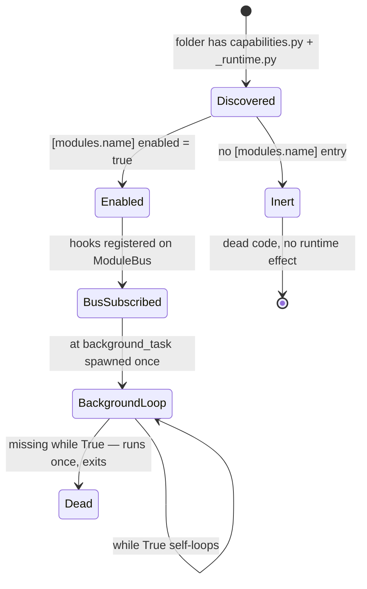

**Discovered ≠ Active.** A module you wrote is inert until an agent's `arcagent.toml` turns it on:

```toml
[modules.my_module]
enabled = true

[modules.my_module.config]
some_setting = "value"
```

---

## Extensions — Select-One / Scan-Many Framework

### Capability Files (Scan-Many)

The lightest-weight seam for adding tools/hooks/background tasks:

```
# Precedence order (highest wins):
<agent>/workspace/capabilities/     # Agent-authored, AST-validated
<agent>/capabilities/               # Per-agent, trusted
~/.arc/capabilities/               # Global user capabilities
arcagent/builtins/capabilities/      # Package built-ins
```

Create a capability file:

```bash
arc ext create my_tool
```

This scaffolds a `@tool`-decorated file. The loader verifies `.arcsig` sidecars and consults `TofuLayer` for trust decisions.

### Select-One Extensions

For memory backends, skill adapters — one config entry picks exactly one implementation:

```toml
[modules.memory.config]
brain = "arcmemory"  # Selects the Brain implementation
```

---

## Blueprints — Signed Config Presets

A blueprint is a `[blueprint]`-headed TOML carrying a config overlay shaped like `arcagent.toml`. It is **materialize-to-disk, not a runtime layer**.

### Blueprint Structure

```toml
[blueprint]
name = "my-blueprint"
version = "1.0.0"
tier = "enterprise"

[blueprint.config.model]
provider = "anthropic"
id = "claude-sonnet-4-5-20250929"

[blueprint.config.modules.memory]
enabled = true
```

### Blueprint Application

```bash
arc init --blueprint my-blueprint
arc blueprint apply my-blueprint.toml
```

**Tier is a floor, never a ceiling:** `effective_tier = stringency-max(deployment, blueprint, user)`.

---

## Gateway Platform Adapters — Remote Chat Platforms

The gateway core ships **zero** platform-specific code. Every remote platform is a separately-installed package registered under the `arcgateway.adapters` entry-point group.

### Creating a Platform Adapter

```python
# my_platform/plugin.py
from arcgateway.adapters.registry import AdapterBuildContext, AdapterPlugin

def build(ctx: AdapterBuildContext) -> "MyAdapter":
    token = ctx.raw_config.get("token")
    if not token:
        raise AdapterUnavailableError("token missing")
    return MyAdapter(token=token, on_message=ctx.on_message, agent_did=ctx.agent_did())

PLUGIN = AdapterPlugin(name="my_platform", build=build)
```

```toml
# pyproject.toml
[project.entry-points."arcgateway.adapters"]
my_platform = "my_platform.plugin:PLUGIN"
```

### Adapter Contract

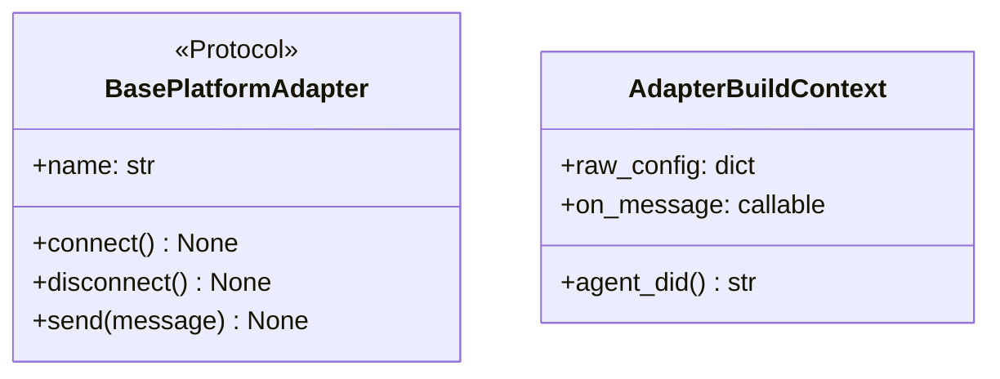

**Tier enforcement:** Unofficial adapters load with audit warning at personal/enterprise, refused at federal.

---

## LLM Providers — One Adapter File Plus TOML

One file per provider in `packages/arcllm/src/arcllm/adapters/` (16 today: anthropic, openai, azure_openai, google, cohere, deepseek, fireworks, groq, huggingface, huggingface_tgi, mistral, moonshot, ollama, together, vllm, xai).

### Adding a Provider

1. Create adapter file: `packages/arcllm/src/arcllm/adapters/my_provider.py`
2. Add provider config: `providers/my_provider.toml`
3. Register in `packages/arcllm/src/arcllm/registry.py`

See [API_REFERENCE.md](API_REFERENCE.md) for full adapter protocol.

---

## Tools — Four Transports, One Registry

`ToolRegistry` wraps every tool call with schema validation, policy, timeout, and audit.

### Tool Transports

| Transport | Value | Use Case |
|---|---|---|
| `NATIVE` | Python `@tool` function | Built-in capabilities |
| `MCP` | Model Context Protocol | External tool servers |
| `HTTP` | REST API calls | Web service integrations |
| `PROCESS` | Subprocess execution | External commands |

### Capability File Locations

```
# Built-in (package development)
packages/arcagent/tools/my_capability.py

# Global user capability
~/.arc/capabilities/my_capability.py

# Agent-specific capability
my-agent/capabilities/my_capability.py

# Agent-authored (untrusted, AST-validated)
my-agent/workspace/.capabilities/my_capability.py
```

---

## Skills — Authoring, Signing, Hub Connector

A skill is a `SKILL.md`-headed folder validated by `skill_validator.py`. Loading follows the `.arcsig` sidecar + `TofuLayer` convention.

### Skill Structure

```markdown
---
name: data-analysis
version: 1.0.0
description: Analyze CSV files for trends and anomalies.
triggers: [csv, analysis, data]
required_tools: [read_file, bash, write_file]
tier: enterprise
---

# Data Analysis Skill

## When to Use
When the user needs to analyze tabular data...

## Steps
1. Read the data
2. Validate structure
3. Analyze
4. Report
```

### Skill Loading Pipeline

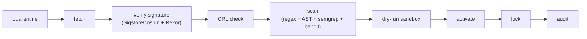

---

## The Brain Port — Bring-Your-Own Memory

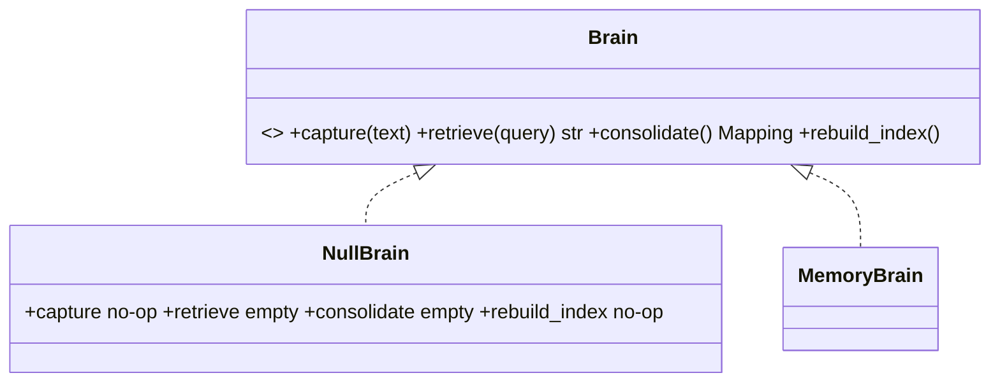

### Implementing a Brain

```python
class MyBrain:
    def capture(self, text: str) -> None:
        """Store text with embeddings."""
        ...

    def retrieve(self, query: str) -> str:
        """Retrieve relevant memories."""
        ...

    def consolidate(self) -> Mapping:
        """Consolidate memories."""
        ...

    def rebuild_index(self) -> None:
        """Rebuild the index."""
        ...
```

Configure in TOML:

```toml
[modules.memory.config]
brain = "my_package:MyBrain"
```

---

## Storage Backends

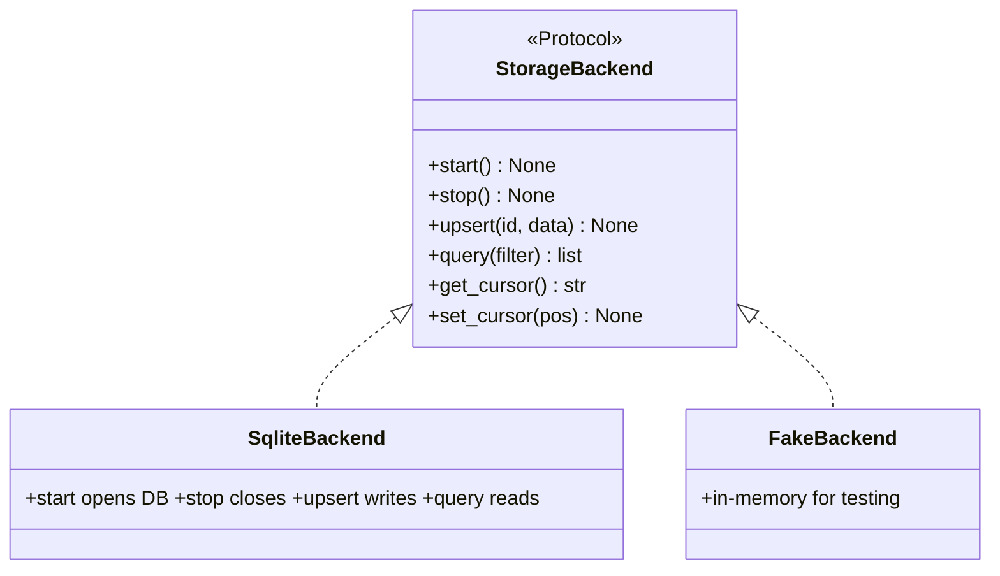

---

## Audit Sinks

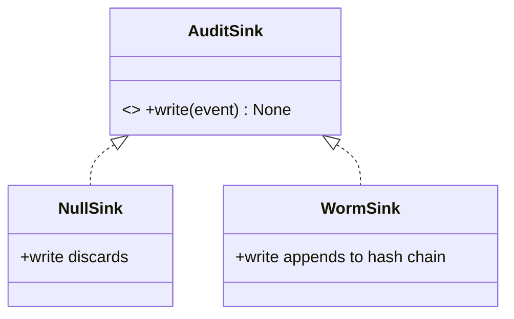

Any object with `write(event: AuditEvent) -> None` qualifies as an `AuditSink`.

---

## Policy Layers

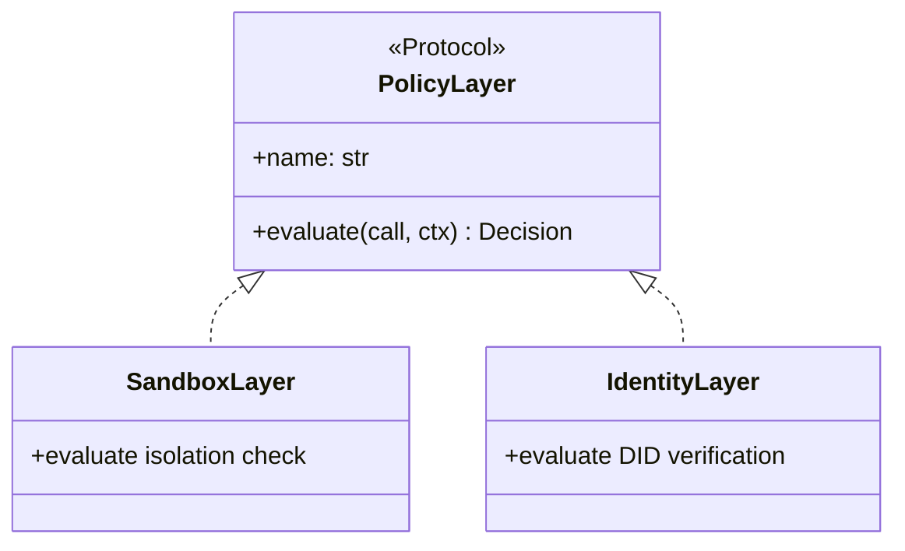

| Layer | Purpose |
|---|---|
| Identity | SSH-key invariant, signed by DID's own key holder |
| Global | Tenant-wide denylist + forbidden composition |
| Classification | Bell-LaPadula no-read-up |
| Provider | LLM token/cost/rate budget |
| Agent | Per-agent tool allowlist |
| Team | Delegation scope (federal only) |
| Sandbox | Isolation requirement check |

---

## Sandbox / Code-Exec Backends

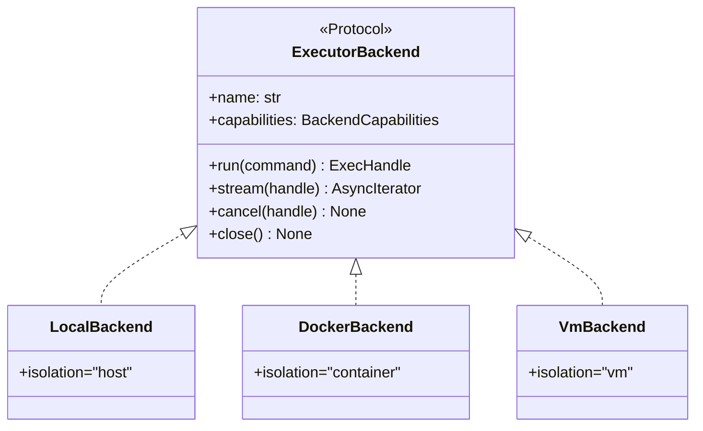

| Backend | Isolation |
|---|---|
| `local` | Host process (dev/personal) |
| `docker` | Shared-kernel container |
| `vm` | Firecracker microVM (hardware isolation) |

---

## Browser Backends

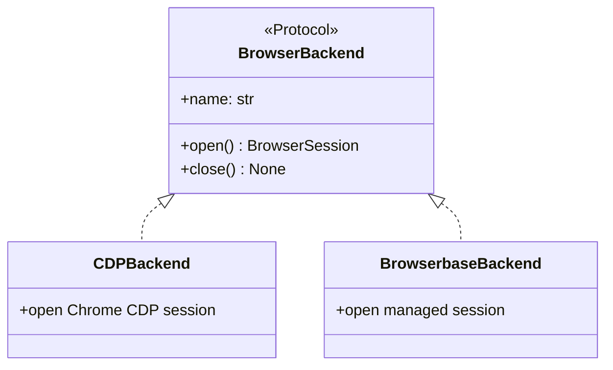

---

## Web Providers

Three providers ship: `parallel`, `firecrawl`, `tavily`. All require an API key.

---

## Prompt Overlays

`PromptResolver.resolve(package, name)` checks for agent-rooted `context/` overlay before falling back to stock. Every overlay is pinned to the deployment operator's signing key.

---

## arcui Frontend

React app in `packages/arcui/web/src/`. Build output served from `packages/arcui/src/arcui/static/`.

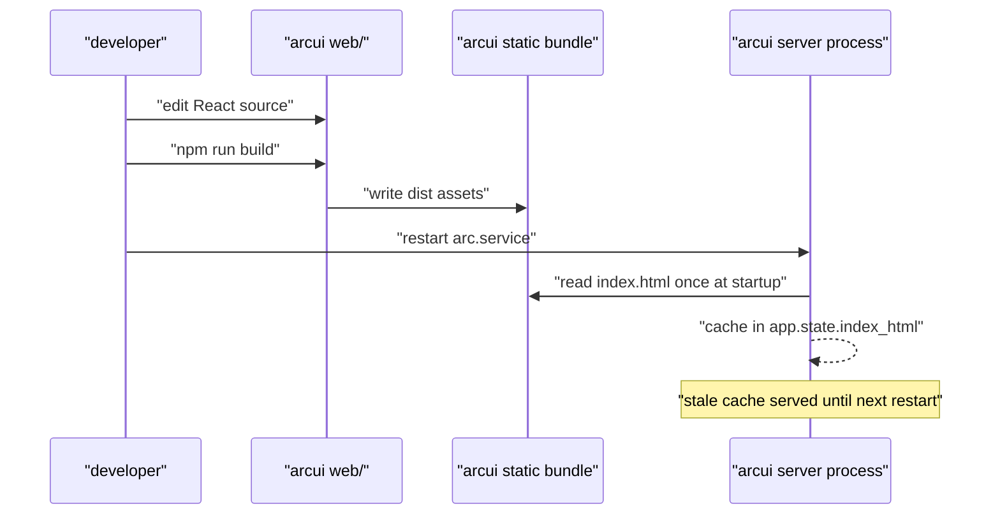

---

## Decision Table: "I Want to Add..."

| I Want to Add... | Seam | File to Copy | Must It Be Signed? |
|---|---|---|---|
| a chat platform (Discord, WhatsApp) | Gateway adapter | `arcgateway-slack/src/plugin.py` | Allowlisted at federal; unofficial loads with audit-warn below federal |
| a model provider | LLM adapter | Any file in `arcllm/adapters/` | No — trust is provider-key custody, not artifact signing |
| a tool | Capability file | `arc ext create <name>` template | Optional at personal; mandatory above personal for workspace-authored |
| a memory backend | Brain port | Implement `Brain` Protocol | No — trust is BYO allowlist gate |
| a new audit destination | Audit sink | Copy `arcui/src/arcui/audit.py` shape | No — sinks are trusted code |
| a policy rule | Policy layer | Copy `SandboxLayer` | No — layers ship in-tree |
| a scheduled behavior | `@background_task` in a module | `modules/tasks/capabilities.py` | Follows module signature rules |
| a UI panel | arcui frontend | Any `web/src/pages/*` component | No — rebuild + restart |
| a sandbox target | ExecutorBackend | `arcrun/backends/docker.py` | Yes — signed manifest, all tiers |
| a browser service | Browser backend | `browser/backends/browserbase.py` | No — gated by tier policy |

---

## How NOT to Extend Arc

| Anti-pattern | Rule Violated |
|---|---|
| Editing `arcgateway`'s registry to add platform | Platforms are packages, discovered by entry point |
| Adding ad-hoc audit fan-out | One emission point (`emit()`), sinks fan out |
| Importing `arcmemory` directly in `arcagent/core/` | Brain port is dependency inversion |
| Letting `arcrun` decide which tool ran | Separation of concerns |
| Adding `/ws` telemetry feed to arcui | arcui is read-only consumer |
| Shipping module with no `[modules.<name>]` entry | Discovered-but-not-enabled is inert |
| `@background_task` without `while True` | Runs once and silently stops |
| Trusting third-party backend via bare alias | Setuptools entry-points permanently disabled |

---

## Where to Look in the Code

| Path | What Lives There |
|---|---|
| `packages/arcagent/src/arcagent/modules/*` | 18 shipped modules |
| `packages/arcagent/src/arcagent/core/module_bus.py` | Module Bus event dispatch |
| `packages/arcagent/src/arcagent/core/module_discovery.py` | Discovered vs. enabled logic |
| `packages/arcagent/src/arcagent/extension/` | Select-one / scan-many framework |
| `packages/arcagent/src/arcagent/capabilities/capability_loader.py` | Capability-file scan + signing |
| `packages/arcagent/src/arcagent/blueprints/` | Signed config presets |
| `packages/arcgateway/src/arcgateway/adapters/registry.py` | Plugin discovery, tier gate |
| `packages/arcgateway-slack/` | Reference platform plugin |
| `packages/arcllm/src/arcllm/adapters/` | Model providers |
| `packages/arcllm/src/arcllm/modules/base.py` | Request-pipeline wrapper |
| `packages/arcagent/src/arcagent/brain/protocol.py` | Memory port |
| `packages/arcstore/src/arcstore/backends/` | Storage engines |
| `packages/arctrust/src/arctrust/audit.py` | Audit sinks |
| `packages/arctrust/src/arctrust/policy.py` | Authorization layers |
| `packages/arcrun/src/arcrun/backends/` | Sandbox backends |
| `packages/arcagent/src/arcagent/modules/browser/backends/` | Browser services |
| `packages/arcagent/src/arcagent/modules/web/` | Web providers |
| `packages/arcprompt/` | Prompt overlays |
| `packages/arcui/web/src/` | React frontend |
| `packages/arcui/src/arcui/server.py` | Static bundle serving |

---

## Runnable References

- [Identity & DID](https://github.com/joshuamschultz/Arc/blob/main/walkthroughs/arctrust/01-identity-did.ipynb)
- [Signing & Artifacts](https://github.com/joshuamschultz/Arc/blob/main/walkthroughs/arctrust/02-keypairs-signing.ipynb)
- [Policy Pipeline](https://github.com/joshuamschultz/Arc/blob/main/walkthroughs/arctrust/03-policy-pipeline.ipynb)
- [Audit Sinks](https://github.com/joshuamschultz/Arc/blob/main/walkthroughs/arctrust/04-audit-sinks.ipynb)

---

## Next Steps

- [TIERS_AND_PRESETS.md](TIERS_AND_PRESETS.md) — Configure security levels
- [PACKAGE_INDEX.md](PACKAGE_INDEX.md) — Deep dive into packages
- [SECURITY.md](SECURITY.md) — Security implementation