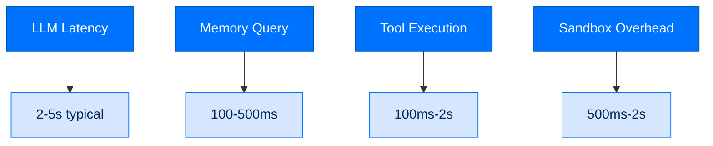
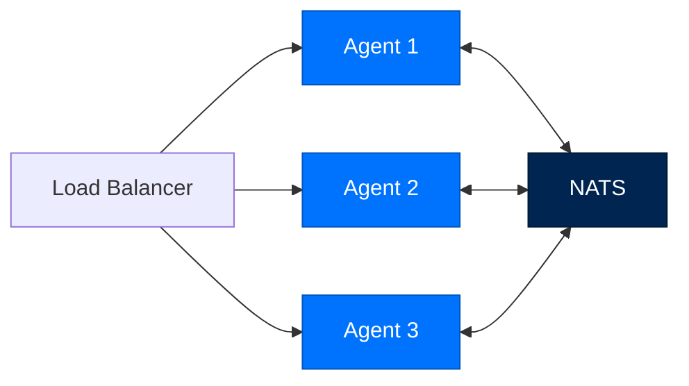

# Performance and Scaling

> **Section:** 3. Reference · **Topic:** Operations
> **Who this is for:** Operators optimizing Arc for production.
> **Read this after:** [TESTING.md](TESTING.md)
> **See also:** [DEPLOYMENT.md](DEPLOYMENT.md), [DATA_FLOW.md](DATA_FLOW.md)

---

## Performance Overview



---

## LLM Performance

### Latency Targets

| Provider | Typical Latency | Notes |
|----------|-----------------|-------|
| Anthropic | 2-5s | Claude 3/4 |
| OpenAI | 1-3s | GPT-4/4o |
| Groq | 0.5-1s | Fast inference |
| Ollama | 5-30s | Local models |
| vLLM | 1-5s | GPU-dependent |

### Optimization

```python
# Reduce context size
arc agent run my-agent "task" --max-context 10000

# Use faster model
arc agent run my-agent "task" --model groq/llama-3.1-70b

# Streaming for perceived speed
for token in client.stream(messages):
    print(token, end="", flush=True)
```

### Caching

```toml
[llm.cache]
enabled = true
ttl_seconds = 300
backend = "redis"  # or "memory"

[llm.cache.redis]
host = "localhost"
port = 6379
```

---

## Memory Performance

### Query Performance

```python
# Episodic memory - fastest
results = await memory.search(query, limit=5)  # ~100ms

# Entity memory - moderate
entity = await memory.get_entity("name")  # ~200ms

# Daily log - slowest
daily = await memory.get_daily(date)  # ~500ms (large files)
```

### Indexing Performance

```python
# Batch indexing
await memory.batch_index([
    {"content": "...", "metadata": {...}},
    {"content": "...", "metadata": {...}},
])

# Async embedding
entry_id = await memory.index(content, embed=False)  # Faster
# Embeddings added later via background job
```

### Memory Optimization

```toml
[memory]
episodic_ttl_days = 30  # Keep memory small
daily_retention_days = 365

[memory.index]
max_entries = 10000
prune_on_index = true
```

---

## Sandbox Performance

### Docker Sandbox

```python
# Typical overhead: 500ms-2s
sandbox = DockerSandbox(
    memory_limit="512m",
    cpus=1.0,
    timeout_seconds=60
)
```

### Firecracker Sandbox

```python
# Higher overhead: 1-3s startup
# But stronger isolation
sandbox = FirecrackerSandbox(
    vcpu_count=2,
    mem_size_mib=1024,
    timeout_seconds=300
)
```

### Sandbox Optimization

```toml
[security.sandbox]
# Reuse containers where possible
reuse_containers = true
# Pre-warm sandbox
prewarm = true
# Timeout tuning
timeout_seconds = 120
```

---

## Team Performance

### NATS Configuration

```toml
[team.nats]
servers = ["nats://localhost:4222"]
max_connections = 100
reconnect_wait = 2
max_reconnect_attempts = 10

[team.nats.jetstream]
max_mem = "1GB"
max_file = "10GB"
```

### Message Throughput

| Operation | Throughput |
|-----------|------------|
| Message send | 1000/sec |
| Message receive | 1000/sec |
| Entity lookup | 10000/sec |
| Task assignment | 1000/sec |

---

## Scaling Patterns

### Horizontal Scaling



### Load Balancing

```python
# Task routing distributes load
task = store.route(task, registry)
# Routes to least-loaded agent with matching capabilities
```

### Caching Strategy

```python
# Multi-layer caching
# 1. LLM response cache
# 2. Memory embedding cache
# 3. Skill validation cache
# 4. Capability metadata cache

[CACHE]
llm_ttl = 300  # 5 minutes
memory_ttl = 60  # 1 minute
skill_ttl = 3600  # 1 hour
```

---

## Resource Requirements

### Minimum Requirements

| Component | CPU | Memory | Disk |
|-----------|-----|--------|------|
| Single agent | 1 core | 512MB | 1GB |
| With sandbox | 2 cores | 1GB | 2GB |
| Team (3 agents) | 4 cores | 2GB | 5GB |
| Dashboard | 1 core | 256MB | 500MB |

### Recommended Requirements

| Component | CPU | Memory | Disk |
|-----------|-----|--------|------|
| Production agent | 2 cores | 2GB | 5GB |
| Federal tier | 4 cores | 4GB | 10GB |
| Team (10 agents) | 8 cores | 8GB | 20GB |
| High volume | 8+ cores | 16GB+ | 50GB+ |

---

## Monitoring Metrics

### Key Metrics

```python
# LLM metrics
llm_calls_total
llm_tokens_used
llm_latency_seconds

# Memory metrics
memory_queries_total
memory_hits_total
memory_index_size

# Sandbox metrics
sandbox_executions_total
sandbox_duration_seconds
sandbox_failures_total

# Team metrics
team_messages_sent
team_messages_received
team_tasks_assigned
```

### Prometheus Export

```toml
[telemetry.prometheus]
enabled = true
port = 9090
endpoint = "/metrics"
```

---

## Performance Tuning

### Connection Pooling

```toml
[llm.pool]
max_connections = 10
keepalive_seconds = 30
timeout_seconds = 60
```

### Concurrency Limits

```toml
[agent.concurrency]
max_parallel_tools = 5
max_parallel_sessions = 10
```

### Memory Limits

```toml
[memory.limits]
max_episodes = 10000
max_entities = 1000
max_daily_entries = 100000
```

---

## Profiling

### CPU Profiling

```bash
# Run with profiler
python -m cProfile -o profile.out my_script.py

# Analyze
uv run snakeviz profile.out
```

### Memory Profiling

```python
from memory_profiler import profile

@profile
async def my_function():
    ...
```

### LLM Profiling

```bash
# Enable tracing
export ARC_TRACE=1

# View timing
arc agent run my-agent "task" --profile
```

---

## Next Steps

- [Deployment](DEPLOYMENT.md) - Production deployment
- [Troubleshooting](TROUBLESHOOTING.md) - Performance issues