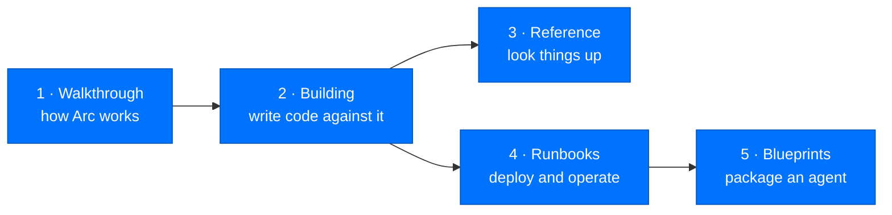

# Arc Documentation

**Arc is a security-first autonomous agent stack.** It runs one agent or a
fleet of thousands, and it is built so a deployment that starts on a laptop can
be tightened to federal stringency without being re-architected.

> **New here?** Read [What Arc Is](walkthrough/01-what-is-arc.md), then
> [Quickstart](building/quickstart.md).
> **Shipping a change today?** Go to [Building with Arc](#2-building-with-arc).
> **Lost in a term?** Keep the [Glossary](reference/glossary.md) open.

This is the complete documentation set. It has five parts.

---

## 1. Walkthrough — how Arc works

Start here if you are new, or if you need to understand *why* a piece of the
system exists. This is the guided tour: features, data flows, and the reasoning
behind each boundary.

| Guide | What it covers |
|---|---|
| [1. What Arc Is](walkthrough/01-what-is-arc.md) | The problem Arc solves and who it is for |
| [2. Architecture](walkthrough/02-architecture.md) | The layers, the whole-stack picture, and why dependencies point one way |
| [3. Anatomy of a Turn](walkthrough/03-anatomy-of-a-turn.md) | One request, end to end |
| [4. The Unified Adapter](walkthrough/04-unified-adapter.md) | How 20+ providers become one contract |
| [5. Steering and Strategies](walkthrough/05-steering-and-strategies.md) | How the loop decides what to do next |
| [6. Prompts, Tools, and Skills](walkthrough/06-prompts-tools-skills.md) | What the model is given to work with |
| [7. The Memory Lifecycle](walkthrough/07-memory-lifecycle.md) | Capture, consolidation, and analogical recall |
| [8. Where Data Lives](walkthrough/08-data-and-storage.md) | The layout on disk and the storage split |
| [9. The Workflows](walkthrough/09-workflows.md) | Scheduling, tasks, and multi-agent flows |
| [10. The Security Model](walkthrough/10-security-model.md) | Identity, signing, authorization, audit |
| [11. Extension Points](walkthrough/11-extension-points.md) | Every seam you can build on |
| [12. Configuration](walkthrough/12-configuration.md) | How an agent is configured |

Also: [data flows](walkthrough/data-flows.md) · [diagrams](walkthrough/diagrams.md)

---

## 2. Building with Arc

Everything you need to write code against Arc — classes, methods, and the
patterns that keep a change from breaking a layer boundary.

- [Quickstart](building/quickstart.md) — first agent running
- [Setup](building/setup.md) — full development environment
- [Implementation guides](building/implementation-guides.md) — common tasks, worked through
- [Writing modules](building/modules.md) — extend an agent with a new capability
- [Policy modules](building/policy-modules.md) — the `policy.py` pattern
- [Testing](building/testing.md) — unit, integration, architecture, security
- [Performance](building/performance.md) — budgets and where time goes
- [Contributing](building/contributing.md) — standards and review expectations
- [Package index](building/package-index.md) — what lives where

### Per-package documentation

Each page carries a **verified public surface** introspected from the installed
code, so every class and function listed is importable exactly as shown.

| Layer | Packages |
|---|---|
| Foundation | [arcllm](building/packages/arcllm.md) · [arcrun](building/packages/arcrun.md) · [arctrust](building/packages/arctrust.md) · [arcstore](building/packages/arcstore.md) · [arcprompt](building/packages/arcprompt.md) · [arcmodel](building/packages/arcmodel.md) |
| Agent | [arcagent](building/packages/arcagent.md) · [arcmemory](building/packages/arcmemory.md) · [arcskill](building/packages/arcskill.md) · [arcteam](building/packages/arcteam.md) |
| Surfaces | [arcgateway](building/packages/arcgateway.md) · [arcui](building/packages/arcui.md) · [arctui](building/packages/arctui.md) · [arccli](building/packages/arccli.md) · [arcmas](building/packages/arcmas.md) |
| Gateway adapters | [telegram](building/packages/arcgateway-telegram.md) · [slack](building/packages/arcgateway-slack.md) · [mattermost](building/packages/arcgateway-mattermost.md) |

---

## 3. Reference

Look things up here.

- [API reference](reference/api.md) — every public symbol, generated from the code
- [CLI reference](reference/cli.md) — every `arc` command
- [Configuration keys](reference/config.md) — every setting
- [Tiers and presets](reference/tiers-and-presets.md) — personal, enterprise, federal
- [Prompts](reference/prompts.md) — the editable system prompts
- [Security](reference/security.md) — the pillars and the full trust model
- [Troubleshooting](reference/troubleshooting.md) — when something breaks
- [Glossary](reference/glossary.md) — the vocabulary

---

## 4. Runbooks — deploying and operating Arc

**Deploy**
[Overview](runbooks/deploy/overview.md) ·
[Local](runbooks/deploy/local.md) ·
[Docker](runbooks/deploy/docker.md) ·
[Azure](runbooks/deploy/azure.md) ·
[Firecracker](runbooks/deploy/firecracker.md) ·
[Azure OpenAI](runbooks/deploy/azure-openai.md) ·
[Voice air-gap](runbooks/deploy/voice-air-gap.md)

**Operate**
[Teams](runbooks/operate/teams.md) ·
[Tasks](runbooks/operate/tasks.md) ·
[Agent features](runbooks/operate/agent-features.md) ·
[Policy and proactive engine](runbooks/operate/policy-and-proactive.md)

**Security**
[Hardening](runbooks/security/hardening.md) ·
[Signing capabilities](runbooks/signing-capabilities.md) ·
[Staging module bundles](runbooks/staging-module-bundles.md) ·
[Threat model](runbooks/security/threat-model.md) ·
[Adversarial tests](runbooks/security/adversarial-tests.md)

**Compliance mappings** — one home per framework:

| Framework | Mapping |
|---|---|
| NIST 800-53 | [Control mapping](runbooks/security/compliance-nist-800-53.md) |
| OWASP Top 10 for LLM Applications | [Control mapping](runbooks/security/compliance-owasp-llm.md) |
| OWASP Top 10 for Agentic Applications | [Control mapping](runbooks/security/compliance-owasp-agentic.md) |

---

## 5. Blueprints

[Blueprints](blueprints/blueprints.md) are config-only distribution units — a
whole agent (prompts, capabilities, skills, schedules, onboarding questions)
described without shipping code.

---

## The invariants

Four rules hold everywhere in this codebase. They are why the docs are organised
the way they are.

1. **Concerns do not mix.** LLM calls are `arcllm`. Loop execution is `arcrun`.
   The agent is `arcagent`. A layer never reaches upward.
2. **Agent state persists to the workspace**, written with direct filesystem
   I/O — never through the LLM's file tools. An agent can work in any
   directory; its brain stays home.
3. **The Four Pillars are universal.** Identity, Sign, Authorize, Audit run at
   every tier. Tier is stringency metadata, not a gate.
4. **Clean code, lean code.** No migration helpers, no compatibility shims. The
   code reflects current reality; commit messages hold the history.

Architecture Decision Records live in `.claude/architecture/decisions/` — they
are project history rather than published guides, and they stay tracked in git.
