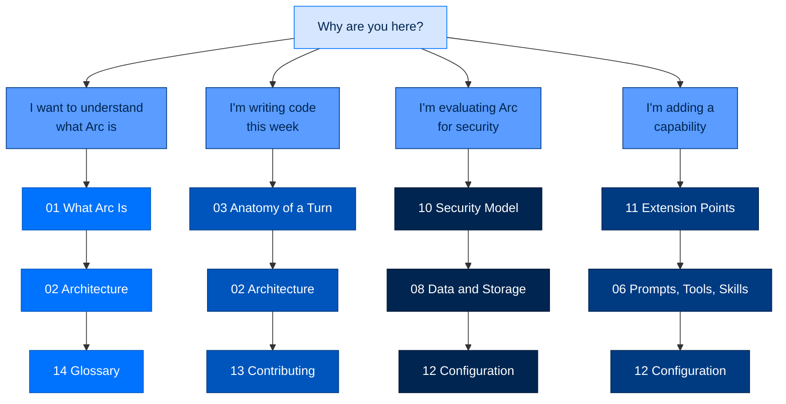

# Arc Documentation

> **New here?** Start with [1. What Arc Is](01-what-is-arc.md). It assumes nothing.
> **Need to ship a change today?** Jump to [13. Contributing](13-contributing.md).
> **Lost in a term?** Keep [14. Glossary](14-glossary.md) open in a second tab.

---

## In one breath

Arc is a stack of small Python packages for building AI agents you can deploy
where trust is non-negotiable. This folder explains how it works — first in plain
language, then in real detail, with a pointer to the exact code for every claim.

Fourteen documents, three passes each: **"In one breath"** (a non-technical
reader can finish it and explain it to someone else), **how it actually works**
(the real mechanism, with diagrams), and **where to look in the code**.

---

## The reading paths

Pick the path that matches why you're here. You do not need to read all fourteen.

| I am… | Read, in order |
|---|---|
| **New to Arc entirely** | [01](01-what-is-arc.md) → [02](02-architecture.md) → [03](03-anatomy-of-a-turn.md) |
| **A new contributor with a task** | [03](03-anatomy-of-a-turn.md) → [02](02-architecture.md) → [13](13-contributing.md) → the doc for your subsystem |
| **Non-technical or semi-technical** | [01](01-what-is-arc.md) → [14](14-glossary.md) → the "In one breath" section of anything else |
| **A security reviewer** | [10](10-security-model.md) → [08](08-data-and-storage.md) → [12](12-configuration.md) |
| **Extending Arc without forking** | [11](11-extension-points.md) → [06](06-prompts-tools-skills.md) → [12](12-configuration.md) |
| **Operating a deployed fleet** | [09](09-workflows.md) → [12](12-configuration.md) → [`deploy/`](deploy/) |
| **Working on memory** | [07](07-memory-lifecycle.md) → [08](08-data-and-storage.md) |
| **Working on the model layer** | [04](04-the-unified-adapter.md) → [05](05-steering-and-strategies.md) |

---

## The documents

### Orientation

| # | Document | What it answers |
|---|---|---|
| 1 | [What Arc Is (and Why It Exists)](01-what-is-arc.md) | What is this, who is it for, what does an agent actually do? Plain language. |
| 2 | [Architecture — The Layered Package Stack](02-architecture.md) | Which package do I change? What are the layering laws? |
| 3 | [Anatomy of a Turn](03-anatomy-of-a-turn.md) | One message, traced through every layer, naming every real function. |

### The engine

| # | Document | What it answers |
|---|---|---|
| 4 | [The Unified Adapter](04-the-unified-adapter.md) | One interface, every provider, zero vendor SDKs. How `arcllm` works. |
| 5 | [The Agentic Run](05-steering-and-strategies.md) | The loop, the strategies, steering a run in flight, budgets, sandboxes. |
| 6 | [Prompts, Tools, and Skills](06-prompts-tools-skills.md) | Where the agent's instructions and abilities actually come from. |
| 7 | [The Memory Lifecycle](07-memory-lifecycle.md) | How information gets in, gets extracted, and comes back later. |

### The record

| # | Document | What it answers |
|---|---|---|
| 8 | [Where Data Lives](08-data-and-storage.md) | Every byte Arc writes: where, what format, who reads it. |
| 9 | [The Workflows](09-workflows.md) | Every recurring end-to-end flow beyond a single chat turn. |
| 10 | [The Security Model](10-security-model.md) | Identity, signing, authorization, audit, tiers, the trifecta gate. |

### Building on Arc

| # | Document | What it answers |
|---|---|---|
| 11 | [Extension Points](11-extension-points.md) | Every seam you can hook into without forking the core. |
| 12 | [Configuration](12-configuration.md) | The whole config surface and how it resolves. |
| 13 | [Contributing](13-contributing.md) | Setup, quality gates, house rules, how work lands. |
| 14 | [Glossary](14-glossary.md) | Every Arc term, defined for a non-expert. |

---

## Also in this folder

These predate the numbered set and go deeper on narrow topics. The numbered docs
link to them rather than restating them.

| Path | What it is |
|---|---|
| [`architecture/ARCH-OVERVIEW.md`](architecture/ARCH-OVERVIEW.md) | The original "how it all fits together" note. [02](02-architecture.md) expands it into a contributor map. |
| [`architecture/decisions/`](architecture/decisions/) | Architecture Decision Records (ADR-018 onward). The binding decisions, with their reasoning. |
| [`architecture/policy-modules.md`](architecture/policy-modules.md) | The policy layer catalogue. |
| [`cli.md`](cli.md) | Full `arc …` command reference. |
| [`config-reference.md`](config-reference.md) | The config key reference. [12](12-configuration.md) is the *model*; this is the *keys*. |
| [`prompts.md`](prompts.md) | Prompt authoring and the `arcprompt` catalogue. |
| [`deploy/`](deploy/) | [single-node](deploy/single-node.md) · [docker](deploy/docker.md) · [team-building](deploy/team-building.md) |
| [`arcgateway/`](arcgateway/) | [getting-started](arcgateway/getting-started.md) · [multi-instance](arcgateway/multi-instance.md) · [security](arcgateway/security.md) |

### Runnable walkthroughs

`../walkthroughs/` holds executable Jupyter notebooks per package — the fastest
way to *see* a subsystem work rather than read about it. The numbered docs link
the relevant notebook from each section.

| Package | Notebooks |
|---|---|
| `arcllm` | 17 — core types, config, adapters, agentic loop, modules, security, traces |
| `arcrun` | 7 — ReAct, tool executor, code exec, streaming, parallel dispatch, budgets, event-chain verification |
| `arctrust` | 4 — identity/DID, keypairs and signing, policy pipeline, audit sinks |
| `arcteam` | 4 — team formation, task distribution, messaging channels, persistence |
| `arcagent`, `arcgateway`, `arcskill`, `arcui` | assorted |

---

## Conventions used across these docs

- **Every claim points at code.** Locations are written `path/to/file.py:120` so
  they're clickable. If something could not be verified against the source, it is
  marked `> ⚠️ **Unverified:**` rather than asserted.
- **Built ≠ wired.** Arc has a recurring failure mode where a correct predicate
  ships with dead activating wiring. These docs say so explicitly when it applies
  — usually "the module is dead until `[modules.<name>]` is declared in the agent's
  toml." Treat those notes as load-bearing.
- **Diagrams are mermaid**, rendered inline by GitHub and most editors, using one
  shared palette so the whole set reads as one system.
- **The house rules live in [`../CLAUDE.md`](../CLAUDE.md)** — build standards,
  the four pillars, quality gates, and the threat surfaces every component is
  designed against. [13](13-contributing.md) turns them into a checklist.

> ⚠️ `CLAUDE.md` is the project's build standard, not a code reference — a few of
> its concrete names have drifted from the source. Where these docs found a
> discrepancy, they document the *code* and flag the drift.
