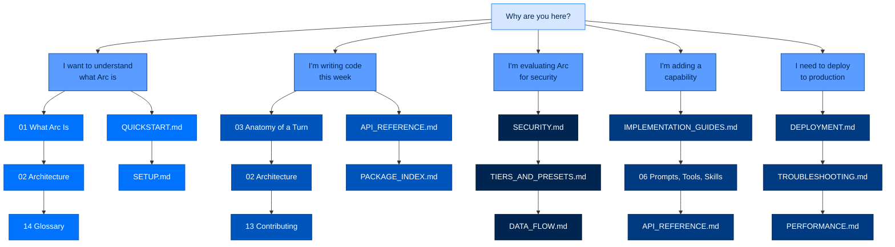

# Arc Documentation

> **New here?** Start with [Section 1: Quickstart and Basics](01-what-is-arc.md). It assumes nothing.
> **Need to ship a change today?** Jump to [Section 3: Reference](CONTRIBUTING.md).
> **Lost in a term?** Keep [Glossary](14-glossary.md) open in a second tab.

---

## Documentation Structure

This manual is organized into three sections:

| Section | Content | Documents |
|---|---|---|
| **1. Quickstart and Basics** | Get started, understand what Arc is, install and run your first agent | QUICKSTART, SETUP, BLUEPRINTS, TIERS_AND_PRESETS |
| **2. System Walkthroughs** | Deep dive into how Arc works, layer by layer | 01-14 numbered docs (What Arc Is through Glossary) |
| **3. Reference** | Detailed API, package docs, troubleshooting, deployment guides | API_REFERENCE, PACKAGE_INDEX, CONTRIBUTING, TESTING, DEPLOYMENT, etc. |

---

## Section 1: Quickstart and Basics

| Document | Purpose |
|---|---|
| [01-what-is-arc.md](01-what-is-arc.md) | What Arc is, who it's for, what an agent actually does |
| [QUICKSTART.md](QUICKSTART.md) | Create and run your first agent in 5 minutes |
| [SETUP.md](SETUP.md) | Installation, configuration, environment setup |
| [BLUEPRINTS.md](BLUEPRINTS.md) | Use and create signed agent presets |
| [TIERS_AND_PRESETS.md](TIERS_AND_PRESETS.md) | Security tiers and configuration presets |

---

## Section 2: System Walkthroughs

### Orientation

| # | Document | What it answers |
|---|---|---|
| 1 | [What Arc Is (and Why It Exists)](01-what-is-arc.md) | What is this, who is it for, what does an agent actually do? Plain language. |
| 2 | [Architecture — The Layered Package Stack](02-architecture.md) | Which package do I change? What are the layering laws? |
| 3 | [Anatomy of a Turn](03-anatomy-of-a-turn.md) | One message, traced through every layer, naming every real function. |

### The Engine

| # | Document | What it answers |
|---|---|---|
| 4 | [The Unified Adapter](04-the-unified-adapter.md) | One interface, every provider, zero vendor SDKs. How `arcllm` works. |
| 5 | [The Agentic Run](05-steering-and-strategies.md) | The loop, the strategies, steering a run in flight, budgets, sandboxes. |
| 6 | [Prompts, Tools, and Skills](06-prompts-tools-skills.md) | Where the agent's instructions and abilities actually come from. |
| 7 | [The Memory Lifecycle](07-memory-lifecycle.md) | How information gets in, gets extracted, and comes back later. |

### The Record

| # | Document | What it answers |
|---|---|---|
| 8 | [Where Data Lives](08-data-storage.md) | Every byte Arc writes: where, what format, who reads it. |
| 9 | [The Workflows](09-workflows.md) | Every recurring end-to-end flow beyond a single chat turn. |
| 10 | [The Security Model](10-security-model.md) | Identity, signing, authorization, audit, tiers, the trifecta gate. |

### Building on Arc

| # | Document | What it answers |
|---|---|---|
| 11 | [Extension Points](11-extension-points.md) | Every seam you can hook into without forking the core. |
| 12 | [Configuration](12-configuration.md) | The whole config surface and how it resolves. |
| 13 | [Contributing](13-contributing.md) | Setup, quality gates, house rules, how work lands. |
| 14 | [Glossary](14-glossary.md) | Every Arc term, defined for a non-expert. |

---

## Section 3: Reference

### Technical Reference

| Document | Coverage |
|---|---|
| [API_REFERENCE.md](API_REFERENCE.md) | All classes, methods, functions with signatures |
| [PACKAGE_INDEX.md](PACKAGE_INDEX.md) | All 18 packages with detailed documentation |
| [IMPLEMENTATION_GUIDES.md](IMPLEMENTATION_GUIDES.md) | How-to guides for common tasks |
| [DATA_FLOW.md](DATA_FLOW.md) | Architecture diagrams, turn flow, memory system |
| [SECURITY.md](SECURITY.md) | Four pillars, tiers, lethal trifecta, compliance |
| [DIAGRAMS.md](DIAGRAMS.md) | Index of all Mermaid architecture diagrams |

### Operations

| Document | Coverage |
|---|---|
| [DEPLOYMENT.md](DEPLOYMENT.md) | Production deployment, Docker, Kubernetes, air-gapped setups |
| [TROUBLESHOOTING.md](TROUBLESHOOTING.md) | Common issues, diagnostic commands, error resolution |
| [PERFORMANCE.md](PERFORMANCE.md) | Performance tuning, scaling, monitoring metrics |

### Development

| Document | Coverage |
|---|---|
| [CONTRIBUTING.md](CONTRIBUTING.md) | Development setup, architecture rules, PR process |
| [TESTING.md](TESTING.md) | Test categories, fixtures, quality gates |
| [cli.md](cli.md) | Full `arc …` command reference |
| [config-reference.md](config-reference.md) | The config key reference |
| [prompts.md](prompts.md) | Prompt authoring and the `arcprompt` catalogue |
| [modules.md](modules.md) | Module system documentation |

### Runbooks

| Document | Coverage |
|---|---|
| [runbooks/security-hardening.md](runbooks/security-hardening.md) | Security hardening procedures |
| [runbooks/spec-017-operations.md](runbooks/spec-017-operations.md) | Operations runbook |
| [runbooks/tasks-module.md](runbooks/tasks-module.md) | Task system documentation |
| [runbooks/agent-level-features.md](runbooks/agent-level-features.md) | Agent-level features |
| [runbooks/security/threat-model.md](runbooks/security/threat-model.md) | Threat model |
| [runbooks/security/adversarial-tests.md](runbooks/security/adversarial-tests.md) | Adversarial testing |
| [runbooks/security/nist-800-53-mapping.md](runbooks/security/nist-800-53-mapping.md) | NIST compliance mapping |

### Additional Guides

| Document | Coverage |
|---|---|
| [azure-openai-setup.md](azure-openai-setup.md) | Azure OpenAI provider setup |
| [firecracker-deployment.md](firecracker-deployment.md) | Firecracker microVM deployment |
| [trust-model.md](trust-model.md) | Trust model documentation |
| [voice-air-gap-setup.md](voice-air-gap-setup.md) | Air-gapped voice setup |

### Architecture Decisions

| Document | Coverage |
|---|---|
| [architecture/ARCH-OVERVIEW.md](architecture/ARCH-OVERVIEW.md) | Original architecture overview |
| [architecture/decisions/](architecture/decisions/) | Architecture Decision Records (ADRs 001-029) |
| [architecture/policy-modules.md](architecture/policy-modules.md) | Policy module catalogue |

---

## Reading Paths

Pick the path that matches why you're here:

| I am… | Read, in order |
|---|---|
| **New to Arc entirely** | [01](01-what-is-arc.md) → [SETUP.md](SETUP.md) → [QUICKSTART.md](QUICKSTART.md) → [02](02-architecture.md) |
| **A new contributor with a task** | [03](03-anatomy-of-a-turn.md) → [02](02-architecture.md) → [13](13-contributing.md) → [PACKAGE_INDEX.md](PACKAGE_INDEX.md) → [API_REFERENCE.md](API_REFERENCE.md) |
| **Non-technical or semi-technical** | [01](01-what-is-arc.md) → [14](14-glossary.md) → [QUICKSTART.md](QUICKSTART.md) |
| **A security reviewer** | [SECURITY.md](SECURITY.md) → [TIERS_AND_PRESETS.md](TIERS_AND_PRESETS.md) → [DATA_FLOW.md](DATA_FLOW.md) |
| **Extending Arc without forking** | [IMPLEMENTATION_GUIDES.md](IMPLEMENTATION_GUIDES.md) → [06](06-prompts-tools-skills.md) → [API_REFERENCE.md](API_REFERENCE.md) |
| **Operating a deployed fleet** | [DATA_FLOW.md](DATA_FLOW.md) → [DEPLOYMENT.md](DEPLOYMENT.md) → [TROUBLESHOOTING.md](TROUBLESHOOTING.md) |
| **Working on memory** | [07](07-memory-lifecycle.md) → [DATA_FLOW.md](DATA_FLOW.md) |
| **Working on the model layer** | [04](04-the-unified-adapter.md) → [05](05-steering-and-strategies.md) → [API_REFERENCE.md](API_REFERENCE.md) |

---

## Document Cross-Reference Map

The numbered docs (01-14) and comprehensive docs work together:

| Numbered Doc | Comprehensive Docs |
|-------------|-------------------|
| 01 What Arc Is | [SETUP.md](SETUP.md), [PACKAGE_INDEX.md](PACKAGE_INDEX.md) |
| 02 Architecture | [PACKAGE_INDEX.md](PACKAGE_INDEX.md), [DATA_FLOW.md](DATA_FLOW.md) |
| 03 Anatomy of a Turn | [DATA_FLOW.md](DATA_FLOW.md), [SECURITY.md](SECURITY.md) |
| 04 Unified Adapter | [DATA_FLOW.md](DATA_FLOW.md), [API_REFERENCE.md](API_REFERENCE.md) |
| 05 Steering & Strategies | [DATA_FLOW.md](DATA_FLOW.md), [API_REFERENCE.md](API_REFERENCE.md) |
| 06 Prompts, Tools, Skills | [BLUEPRINTS.md](BLUEPRINTS.md), [IMPLEMENTATION_GUIDES.md](IMPLEMENTATION_GUIDES.md) |
| 07 Memory Lifecycle | [DATA_FLOW.md](DATA_FLOW.md), [packages/arcmemory.md](packages/arcmemory.md) |
| 08 Data & Storage | [DATA_FLOW.md](DATA_FLOW.md), [packages/arcstore.md](packages/arcstore.md) |
| 09 Workflows | [DATA_FLOW.md](DATA_FLOW.md), [DEPLOYMENT.md](DEPLOYMENT.md) |
| 10 Security Model | [SECURITY.md](SECURITY.md), [TIERS_AND_PRESETS.md](TIERS_AND_PRESETS.md) |
| 11 Extension Points | [IMPLEMENTATION_GUIDES.md](IMPLEMENTATION_GUIDES.md), [API_REFERENCE.md](API_REFERENCE.md) |
| 12 Configuration | [TIERS_AND_PRESETS.md](TIERS_AND_PRESETS.md), [SETUP.md](SETUP.md) |
| 13 Contributing | [CONTRIBUTING.md](CONTRIBUTING.md), [TESTING.md](TESTING.md) |
| 14 Glossary | [PACKAGE_INDEX.md](PACKAGE_INDEX.md), [API_REFERENCE.md](API_REFERENCE.md) |

---

## Conventions

- **Every claim points at code.** Locations are written `path/to/file.py:120` so they're clickable.
- **Built ≠ wired.** A correct predicate shipping with dead activating wiring is called out explicitly.
- **Diagrams are Mermaid**, rendered inline by GitHub and most editors, using a shared color palette.
- **House rules** live in `../CLAUDE.md` — build standards, four pillars, quality gates.