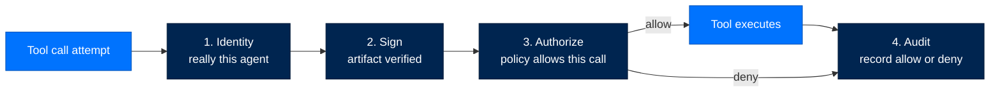
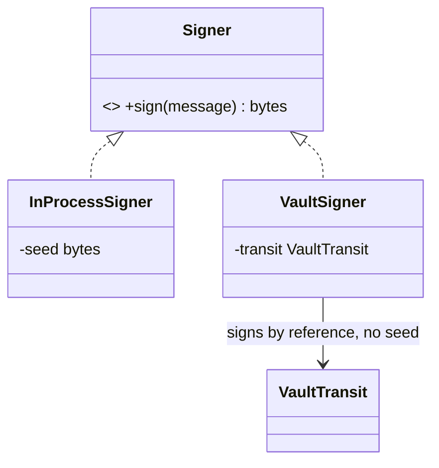
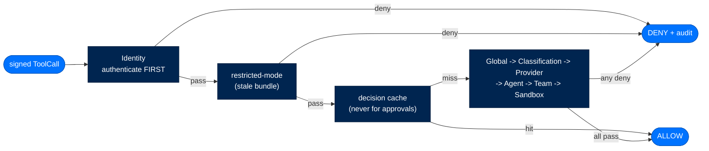
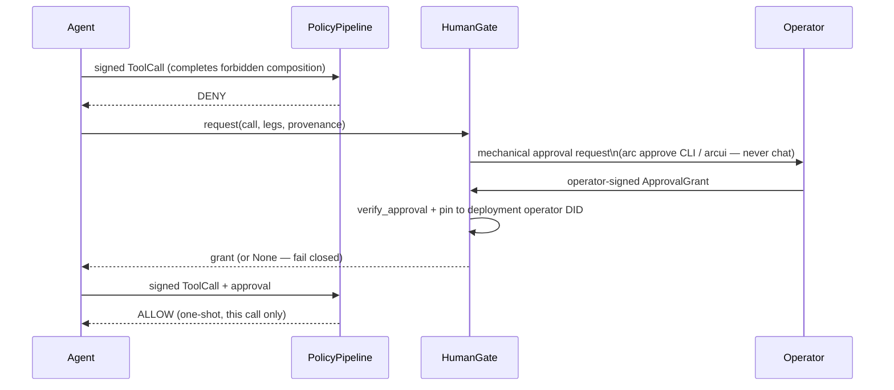
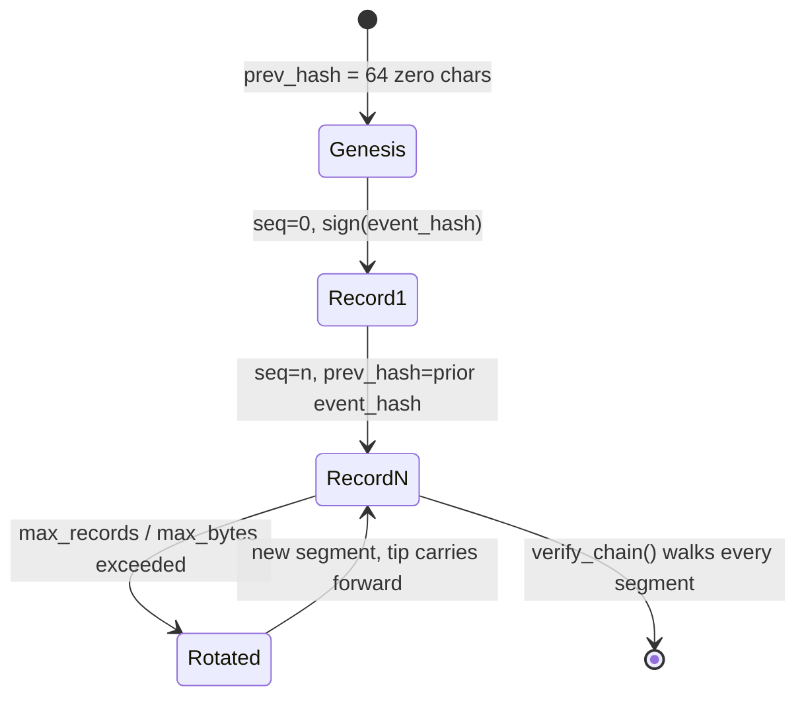

# Arc Security Reference

> **Section:** 3. Reference · **Topic:** Security  
> **Who this is for:** Operators, contributors, and auditors who need to understand Arc's security model and features.  
> **Read this after:** [SETUP.md](SETUP.md) · **Read this next:** [DATA_FLOW.md](DATA_FLOW.md)  
> **See also:** [TIERS_AND_PRESETS.md](TIERS_AND_PRESETS.md)

---

## In One Breath

Every Arc agent carries a cryptographic ID card it cannot forge (**Identity**). Every piece of code it loads — a skill, a tool, a sandbox backend — carries a signature checked again at the moment it's used, not just at install time (**Sign**). Every action it tries to take passes through a guard that can say no, and the guard's default answer to "something went wrong while deciding" is no, never yes (**Authorize**). Everything that happens — allowed or denied — is written to a logbook nobody, not even the machine's owner, can quietly edit after the fact (**Audit**).

These four guarantees are not a "federal mode" you switch on; a hobbyist's laptop agent gets them exactly like a national-lab deployment does. What changes between the two is only how strict the settings are. The floor itself never moves.

---

## The Four Pillars Are Universal

The most commonly misunderstood thing about Arc: **Identity, Sign, Authorize, and Audit are non-optional defaults at every tier**. Earlier code drifted toward gating these behind `tier == "federal"` — `UnsafeNoOp` bypasses, `skip_sandbox=True`, `require_manifest = (tier == "federal")`, empty allowlists treated as allow-all. These bypasses were removed. Security no longer depends on a config flag left in the wrong position.

**Tier is stringency metadata, not a gate.** A personal-tier agent still has a DID, still signs its artifacts, still runs a policy pipeline, still emits audit events.

| Knob | Personal | Enterprise | Federal |
|---|---|---|---|
| Trusted signers | self-signed OK + audit warn | operator-chain | operator-chain (FIPS) |
| Policy layers | Identity + Global (2) | + Classification/Provider/Agent/Sandbox (6) | + Team (7, all layers) |
| Dynamic tool creation | allowed | approval gate | denied |
| Signing algorithm | Ed25519 | Ed25519 | ECDSA-P256 (FIPS floor) |
| Approval-required tools | opt-in only | every plain tool | every tool and skill |



---

## Pillar 1 — Identity

Every agent has a DID minted from an Ed25519 keypair; `ArcAgent.__init__` requires one. Primitives live in `packages/arctrust/src/arctrust/identity.py` and `keypair.py`. Format: `did:arc:{org}:{type}/{hash}`, where `hash` is the first 8 hex chars of `sha256(public_key)` — deterministic, so `did_matches_pubkey` can check a presented key against a claimed DID.

Key files must be `0600`; `AgentIdentity.load_keys` rejects group/other-readable files outright.

### Child Identities

Child identities (spawned sub-agents) are *derived*, not independent: `derive_child_identity` runs HKDF-SHA256 over the parent's seed and a per-spawn nonce — unpredictable without the parent's private key. Clearance narrows monotonically (`child_clearance = min(requested, parent_clearance)`), so a child can never out-clear its parent.

### TOFU (Trust On First Use)

`arctrust.tofu.TofuLayer` answers "should this artifact be allowed to run," a different question from "is it authentically signed."

| Tier | Rule |
|---|---|
| Personal | Signed by the agent's own pinned key → allow. Unsigned → gated by `auto_run_agent_code`. |
| Enterprise | Unknown name → `NEW_SIGHTING` (human approves). Known + matching hash → allow. Known + drifted hash → deny (tamper). |
| Federal | Unsigned → deny outright. Signed → same human-approval gate as enterprise; self-signing attributes, never authorizes. |

---

## Pillar 2 — Sign

Every loaded artifact — skill, extension, sandbox backend, pairing, agent-authored capability — is verified **at load**, independent of any install-time check.

### Signer Protocol



**`InProcessSigner`** holds the seed in memory (Ed25519 or ECDSA-P256; personal/enterprise default).  
**`VaultSigner`** signs *by reference* through a `VaultTransit` boundary (Vault Transit, a PKCS#11 HSM, cloud KMS, or the reference `FileNotaryTransit`) — the seed never enters this process.

### Detached Artifact Signatures

`.arcsig` sidecar files contain: content SHA-256 digest, signer DID, public key, and Ed25519 signature. `verify_artifact` re-checks digest + signature + (when pinned) key identity at load.

### FIPS Floor

At federal (`require_fips=true`), refuses to run a protected crypto function unless the loaded OpenSSL is itself FIPS-140-3-validated *and* the algorithm is FIPS-approved. Only `ecdsa-p256` and `aes-256-gcm` qualify — Arc's Ed25519 (PyNaCl/libsodium) has no CMVP path, so federal forces ECDSA-P256 for signing.

---

## Pillar 3 — Authorize

`arctrust.policy.PolicyPipeline` evaluates every tool call. **First-DENY-wins. Fail-closed on exceptions** — a raising layer becomes a DENY, never a skip.



| Tier | Layer order | Layer count |
|---|---|---|
| Personal | Identity, Global | 2 |
| Enterprise | Identity, Global, Classification, Provider, Agent, Sandbox | 6 |
| Federal | Identity, Global, Classification, Provider, Agent, Team, Sandbox | 7 |

### Policy Layers

- **Identity** — SSH-key invariant (signed by the DID's own key holder); ent/fed also require pre-registration. Runs first and unconditionally.
- **Global** — tenant-wide denylist + the forbidden-composition check (lethal trifecta).
- **Classification** — Bell-LaPadula no-read-up via `classification.dominates`.
- **Provider** — LLM token/cost/rate budget ceiling.
- **Agent** — per-agent tool allowlist.
- **Team** (federal only) — delegation scope never exceeds its grant.
- **Sandbox** — required vs. available isolation (`host < container < vm`).

### The Lethal Trifecta Gate

Private data + external comms + untrusted input, together, is an exfiltration primitive. Arc models it as a context-resolved three-leg accumulator:

| Leg | Resolution |
|---|---|
| `private_data` | Any on-machine read — `file_read`, `memory`, `recall`, `user_profile`. |
| `external_comms` | Pushing agent-chosen content to an agent-chosen sink — `network_egress`, messaging, notify. |
| `untrusted_input` | Unvetted ingested content this session — `web`, `browser`, `browser_task`, `extract`, `subprocess`. |



---

## Pillar 4 — Audit

Every security-relevant action emits an `AuditEvent` through one function: `arctrust.audit.emit(event, sink)`.

### WormSink

The compliance system of record: each `write()` appends `{seq, event, prev_hash, event_hash, algorithm, signature}` to an append-only `0600` file.



- **Restart-safe** — tip/seq recovered from the file tail
- **Tamper-evident** — `verify_chain` checks hash links, signatures, seq contiguity
- **Single-writer** — exclusive `flock`; second writer raises
- **Crash-recoverable** — torn final line truncated, recovery record appended

### External Witnessing

`WitnessAnchor` submits the operator-signed checkpoint head to a second, separately-custodied medium (offline medium or Rekor-style online log). A forger with the operator key cannot retroactively remove a head from a log they don't own.

---

## Isolation & Execution Safety

Arc's ASI05 answer is a tier-routed isolation ladder:

| Rung | Backend | Class |
|---|---|---|
| `host` | `arcrun/backends/local.py` | Stripped local subprocess — dev/personal default |
| `container` | `arcrun/backends/docker.py` | Shared-kernel container |
| `vm` | `arcrun/backends/vm.py` | Firecracker microVM — hardware isolation |

The tool set is frozen for the run, not just policy-gated per call. `arcrun.registry.ToolRegistry.freeze()` seals the set before turn 0 of every run — no mutable window mid-run for injection.

---

## Cross-Agent Isolation

Arc is shared-nothing per agent. Memory state is keyed by every agent's DID, with a `contextvars.ContextVar` bound at `configure()` and rebound at every turn-dispatch entry. Fail-closed mismatch checks prevent cross-agent bleed.

---

## Threat Mapping

### OWASP Top 10 for LLM Applications (2025)

| Code | Threat | Arc Mechanism | File |
|---|---|---|---|
| LLM01 | Prompt Injection | Untrusted content tagged as `untrusted_input` leg | `capability_ledger.py` |
| LLM02 | Sensitive Info Disclosure | PII/secret redaction + length caps | `human_gate.py`, `arcui/audit.py` |
| LLM03 | Supply Chain | Signed backend manifests; entry-points disabled | `arcrun/backends/loader.py`, `arctrust/tofu.py` |
| LLM04 | Data Poisoning | ⚠️ Unverified — no dataset checksum pipeline | — |
| LLM05 | Improper Output Handling | Pre-load AST scan; sandbox ladder | `arcskill/hub/_ast_scanner.py`, `arcrun/backends/vm.py` |
| LLM06 | Excessive Agency | AgentLayer allowlists; approval gate | `arctrust/policy.py`, `approval_policy.py` |
| LLM07 | System Prompt Leakage | Prompt overlays signed + pinned to operator key | |
| LLM08 | Vector/Embedding Weaknesses | ⚠️ Unverified — lives in `arcmemory` | |
| LLM09 | Misinformation | Out of scope | — |
| LLM10 | Unbounded Consumption | ProviderLayer budget/rate ceiling; max_turns cap | `arctrust/policy.py` |

### OWASP Top 10 for Agentic Applications (2026)

| Code | Threat | Arc Mechanism |
|---|---|---|
| ASI01 | Agent Goal Hijack | Policy pipeline evaluates every call independent of agent reasoning |
| ASI02 | Tool Misuse | AgentLayer allowlists; GlobalLayer denylist + forbidden compositions |
| ASI03 | Identity & Privilege Abuse | Per-agent DID + unique keypair; child clearance narrows |
| ASI04 | Agentic Supply Chain | Signed manifests; TOFU pinning; entry-points disabled |
| ASI05 | Unexpected Code Execution | Firecracker microVM; jailer + seccomp; AST scan pre-load |
| ASI06 | Memory & Context Poisoning | Fail-closed DID-scoped memory state |
| ASI07 | Insecure Inter-Agent Comms | Ed25519/ECDSA signing |
| ASI08 | Cascading Failures | Shared-nothing per-agent state; per-run tool-set freeze |
| ASI09 | Human-Agent Trust Exploitation | HumanGate never asks via chat; grants pinned to operator DID |
| ASI10 | Rogue Agents | Tamper-evident WormSink; external witnessing at federal |

---

## Compliance Mapping

| Pillar | NIST 800-53 | Where Enforced |
|---|---|---|
| Identity | IA-2, IA-5, IA-8 | `arctrust.identity`, `ArcAgent.__init__` |
| Sign | SI-7, CM-5, CM-8 | `arctrust.keypair`, `arctrust.artifact` |
| Authorize | AC-3, AC-6, AC-4 | `arctrust.policy.PolicyPipeline` |
| Audit | AU-2, AU-3, AU-5, AU-9, AU-10, AU-11 | `arctrust.audit.WormSink` |
| FIPS floor | SC-13, IA-7 | `arctrust.fips` |

---

## ArcLLM Security Features

ArcLLM provides additional security layers for LLM communication:

### API Key Isolation

Keys are resolved at runtime from environment variables or vault backends, never stored in config files.

```toml
[provider]
api_key_env = "ANTHROPIC_API_KEY"
vault_path = "secret/data/llm/anthropic"  # Optional vault path
```

### PII Redaction

Automatically detects and redacts SSN, credit cards, emails, phone numbers, and IP addresses.

```toml
[modules.security]
enabled = true
pii_enabled = true
pii_custom_patterns = [
    { name = "EMPLOYEE_ID", pattern = "EMP-\\d{6}" },
]
```

### Request Signing

HMAC-SHA256 or ECDSA-P256 signing of request payloads for tamper detection.

```toml
[modules.security]
signing_enabled = true
signing_algorithm = "hmac-sha256"
signing_key_env = "ARCLLM_SIGNING_KEY"
```

### Audit Trail

Structured logging of every LLM interaction (metadata only by default).

```toml
[modules.audit]
enabled = true
include_messages = false  # Never log raw content in production
include_response = false
```

### Rate Limiting

Token-bucket rate limiting prevents API quota exhaustion.

```toml
[modules.rate_limit]
enabled = true
requests_per_minute = 60
burst_capacity = 60
```

---

## Contributor Security Checklist

A PR should be rejected in review if it:

- **Bypasses the policy pipeline** — any tool dispatch not routed through `PolicyPipeline.evaluate`
- **Adds an audit channel outside `emit()`** — raw `logging.info()` instead of audit record
- **Adds an unsigned load path** for backend, skill, or plugin
- **Swallows a policy error into an ALLOW** — any fallback on layer exception other than DENY
- **Puts secrets in a prompt, log, or error message**
- **Tier-gates a pillar itself** — only stringency may vary by tier
- **Introduces a state change with no audit event**

---

## Runnable References

- [Identity & DID](https://github.com/joshuamschultz/Arc/blob/main/walkthroughs/arctrust/01-identity-did.ipynb)
- [Signing & Artifacts](https://github.com/joshuamschultz/Arc/blob/main/walkthroughs/arctrust/02-keypairs-signing.ipynb)
- [Policy Pipeline](https://github.com/joshuamschultz/Arc/blob/main/walkthroughs/arctrust/03-policy-pipeline.ipynb)
- [Audit Sinks](https://github.com/joshuamschultz/Arc/blob/main/walkthroughs/arctrust/04-audit-sinks.ipynb)

---

## Where to Look in the Code

| Path | What Lives There |
|---|---|
| `packages/arctrust/src/arctrust/identity.py` | DID derivation, `AgentIdentity`, child identity |
| `packages/arctrust/src/arctrust/keypair.py` | Raw Ed25519 sign/verify/generate |
| `packages/arctrust/src/arctrust/signer.py` | `Signer` Protocol — in-process and vault-transit |
| `packages/arctrust/src/arctrust/artifact.py` | Detached `.arcsig` artifact signatures |
| `packages/arctrust/src/arctrust/operator.py` | `OperatorKey` — the audit-signing authority |
| `packages/arctrust/src/arctrust/fips.py` | Federal FIPS-140-3 startup floor |
| `packages/arctrust/src/arctrust/tofu.py` | Trust-On-First-Use source-approval gate |
| `packages/arctrust/src/arctrust/policy.py` | `PolicyPipeline`, layers, `ToolCall`, approval grants |
| `packages/arcagent/src/arcagent/tools/human_gate.py` | Trifecta human-approval pause |
| `packages/arcrun/src/arcrun/backends/` | The `host`/`container`/`vm` isolation ladder |

---

## Deployment Security Checklist

- [ ] API keys set via environment variables or vault — not in config files
- [ ] `ARCLLM_SIGNING_KEY` set if request signing is enabled
- [ ] PII redaction enabled for workflows handling user data
- [ ] Audit module enabled for compliance-required environments
- [ ] Rate limits configured per provider
- [ ] Provider TOML `base_url` values use `https://`
- [ ] `include_messages` and `include_response` left `false` in production
- [ ] Log level set to `INFO` or higher (not `DEBUG`)
- [ ] Vault TTL configured for key freshness
- [ ] Trace store directory permissions `0o700`
- [ ] JSONL trace files permissions `0o600`
- [ ] `verify_chain()` run after any suspected tampering

---

## Next Steps

- [DATA_FLOW.md](DATA_FLOW.md) — Data flow pathways
- [DEPLOYMENT.md](DEPLOYMENT.md) — Deployment guides
- [IMPLEMENTATION_GUIDES.md](IMPLEMENTATION_GUIDES.md) — Extension points