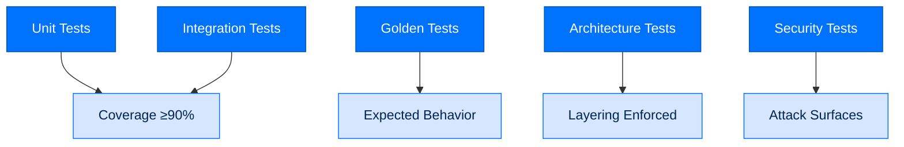

# Testing and Quality Assurance

> **Section:** 3. Reference · **Topic:** Development
> **Who this is for:** Developers writing tests for Arc.
> **Read this after:** [CONTRIBUTING.md](CONTRIBUTING.md) · **Read this next:** [PERFORMANCE.md](PERFORMANCE.md)
> **See also:** [13-contributing.md](13-contributing.md) for contribution process

---

## Testing Philosophy

Arc follows these testing principles:
- **100% type coverage** - Strict mypy everywhere
- **90%+ code coverage** - Per-package minimum
- **Golden tests** - Expected behavior verification
- **Architecture tests** - Layering constraint enforcement
- **Security tests** - Attack surface validation



---

## Test Categories

### Unit Tests

```python
# packages/arctrust/tests/test_did.py
import pytest
from arctrust.did import DID

def test_did_generation():
    did = DID.generate()
    assert did.did.startswith("did:key:")
    assert len(did.key) > 0

def test_signature_verification():
    did = DID.generate()
    signature = did.sign(b"test message")
    assert did.verify(b"test message", signature)
    assert not did.verify(b"wrong message", signature)
```

### Integration Tests

```python
# packages/arcagent/tests/test_integration.py
import pytest
from arcagent import ArcAgent

@pytest.mark.asyncio
async def test_full_turn():
    config = load_test_config()
    agent = ArcAgent(config)
    await agent.startup()
    
    result = await agent.run("Say hello")
    assert "hello" in result.content.lower()
```

### Golden Tests

```python
# packages/arcskill/tests/test_improvement.py
from arcskill.improver import golden_task_gate

def test_skill_improvement():
    # Golden test - known input/output
    trace = load_golden_trace("failing_analysis_trace.json")
    proposal = improve(skill, [trace])
    
    # Must pass golden task gate
    assert golden_task_gate.evaluate(proposal)
```

### Architecture Tests

```python
# tests/architecture/test_layering.py
import ast
import pytest

def test_no_arcagent_imports_arcgateway():
    """arcagent must not import arcgateway."""
    for file in find_python_files("packages/arcagent"):
        tree = ast.parse(file.read_text())
        for node in ast.walk(tree):
            if isinstance(node, ast.ImportFrom):
                assert "arcgateway" not in node.module
```

---

## Running Tests

### All Tests

```bash
# Run everything
uv run pytest tests/

# With coverage
uv run pytest --cov=packages --cov-report=html tests/

# Parallel
uv run pytest -n auto tests/
```

### Package-Specific

```bash
# Single package
uv run pytest packages/arctrust/tests/

# With verbose output
uv run pytest packages/arctrust/tests/ -v

# With coverage
uv run pytest packages/arctrust/tests/ --cov=packages/arctrust
```

### Specific Tests

```bash
# By name
uv run pytest packages/arctrust/tests/test_did.py::test_did_generation

# By marker
uv run pytest -m "slow" tests/
uv run pytest -m "not slow" tests/
```

---

## Test Fixtures

### Agent Fixture

```python
# tests/conftest.py
import pytest
from pathlib import Path

@pytest.fixture
def test_agent(tmp_path: Path) -> Path:
    """Create test agent."""
    agent_path = tmp_path / "test-agent"
    agent_path.mkdir()
    
    (agent_path / "arcagent.toml").write_text("""
[model]
provider = "anthropic"
id = "claude-sonnet-4-5-20250929"

[security]
tier = "personal"
""")
    
    (agent_path / "identity.md").write_text("# Test Agent")
    
    return agent_path
```

### Mock LLM

```python
@pytest.fixture
def mock_llm():
    """Mock LLM for testing."""
    class MockLLM:
        async def chat(self, messages):
            return {
                "content": "Mock response",
                "tool_calls": [],
                "usage": {"total_tokens": 100}
            }
    return MockLLM()
```

---

## Quality Gates

### Coverage Requirements

| Package | Minimum Coverage |
|---------|------------------|
| arctrust | 90% |
| arcstore | 85% |
| arcllm | 90% |
| arcagent | 85% |
| arcskill | 90% |
| arcteam | 85% |

### Type Checking

```bash
# Must pass strict mypy
uv run mypy --strict packages/arctrust
uv run mypy --strict packages/arcagent
```

### Linting

```bash
# Must pass ruff
uv run ruff check packages/
```

---

## Security Testing

### Capability Security

```python
def test_capability_sandbox():
    """Test capability runs in sandbox."""
    from arcrun.sandbox import DockerSandbox
    
    sandbox = DockerSandbox(network_disabled=True)
    result = sandbox.execute("import socket; socket.socket()")
    
    assert "Permission denied" in result.stderr
```

### Signature Verification

```python
def test_skill_signature_verification():
    """Test skill signature verification."""
    from arcskill.hub import verify_bundle
    
    with pytest.raises(SignatureInvalid):
        verify_bundle("unsigned_skill.zip")
```

### Lethal Trifecta Detection

```python
def test_lethal_trifecta_blocked():
    """Test trifecta detection."""
    from arctrust.validators import check_lethal_trifecta
    
    action = Action(
        accesses_private_data=True,
        makes_network_calls=True,
        receives_untrusted_input=True
    )
    
    assert not check_lethal_trifecta(action, tier="enterprise")
```

---

## Test Infrastructure

### Test Directories

```
tests/
├── architecture/          # Layering tests
│   ├── test_layering.py
│   └── test_dependencies.py
├── integration/           # Integration tests
│   ├── test_agent_flow.py
│   └── test_team_flow.py
├── security/              # Security tests
│   ├── test_capabilities.py
│   └── test_signatures.py
├── golden/                # Golden test fixtures
│   ├── traces/
│   └── skills/
└── conftest.py            # Shared fixtures
```

### CI Configuration

```yaml
# .github/workflows/test.yml
name: Tests
on: [push, pull_request]

jobs:
  test:
    runs-on: ubuntu-latest
    steps:
    - uses: actions/checkout@v4
    - uses: astral-sh/setup-uv@v3
    - run: uv sync --all-packages
    - run: uv run pytest --cov=packages
    - run: uv run mypy --strict packages/
    - run: uv run ruff check packages/
```

---

## Writing Good Tests

### Arrange-Act-Assert Pattern

```python
def test_my_feature():
    # Arrange
    config = create_test_config()
    input_data = {"key": "value"}
    
    # Act
    result = my_function(input_data, config)
    
    # Assert
    assert result.success
    assert result.value == "expected"
```

### Async Tests

```python
@pytest.mark.asyncio
async def test_async_operation():
    result = await async_function()
    assert result is not None
```

### Parametrized Tests

```python
@pytest.mark.parametrize("input,expected", [
    ("hello", "HELLO"),
    ("world", "WORLD"),
])
def test_transform(input, expected):
    assert transform(input) == expected
```

---

## Next Steps

- [PERFORMANCE](PERFORMANCE.md) - Performance testing
- [Package Index](PACKAGE_INDEX.md) - Package documentation