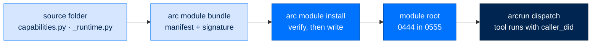

# The Module System — Signed Bundles, Folder Discovery, Config Activation

> **Building with Arc**  ·  Build  ·  page 4 of 27  
> **For** Engineers writing code against Arc  
> [← Implementation guides](implementation-guides.md)  ·  [Docs home](../README.md)  ·  [Policy modules →](policy-modules.md)



An arcagent *module* is a self-contained folder that ships a bundle of tools, hooks, and
background tasks plus the per-agent state they share. A module reaches a deployment as a
**signed bundle** and no other way. The framework then **discovers** every installed folder
by presence on disk, and **activates** only the ones the agent's config enables.

Three steps, three separate decisions:

| Step | Question it answers | What decides it |
|---|---|---|
| **Distribute** | Is this module's code even on the box? | A verified signed bundle |
| **Discover** | Which installed folders qualify as modules? | Presence of `capabilities.py` + `_runtime.py` |
| **Activate** | Which discovered modules load? | An enabled `[modules.NAME]` entry |

Keeping them separate is what makes absence provable. A module that was never installed is a
missing directory an operator can point at, not a config flag someone could flip.

This document is the builder reference: the three filesystem locations, the module contract,
the bundle format, and how to author, install, and remove a module. For one module's
operator-facing internals, see its own runbook — e.g. [Tasks](../runbooks/operate/tasks.md)
for `tasks`.

---

## The three filesystem locations

This is the core concept. A module's files land in **two** places, and the agent's own state
lives in a **third** that never holds module code at all.

| What | Where | Trust |
|---|---|---|
| Module **runtime** — `_runtime.py`, `config.py`, `__init__.py`, and any support files | `${ARC_CONFIG_DIR:-~/.arc}/runtime/current/modules/<name>/` | `0444` files inside `0555` directories, at the deployment root **outside the tool fence**. Only the operator install writes here. |
| Module **capability surface** — `capabilities.py` and `skills/` | `<agent_dir>/capabilities/modules/<name>/` | The agent's own capability root, adjudicated as **verified**: a valid signature is required at every tier. Ordinary `0644` files in `0755` directories. |
| **Agent state** — memory, sessions, `context.md`, the audit chain | `<agent_dir>/workspace/` | Written by the agent. **Never holds module code.** |

`<agent_dir>` is the directory holding the agent's `arcagent.toml`, usually
`team/<agent_id>/`. The workspace sits beneath it.

### Why runtime and capabilities are split

The two destinations exist for two different reasons.

**Runtime is deployment state.** One copy, at the deployment root, read-only. The agent runs
as an account that cannot write there, and the tool fence does not reach it.

**The capability surface is per agent.** The tools an agent may call and the skills injected
into its prompt are copied into that agent's own capability root. A skill that improves for
one agent must not silently change what every other agent on the box is told to do.

**`_runtime.py` is deliberately never copied.** Putting a module's runtime where the agent
can write would hand the agent its own execution path — the agent could rewrite the code
that runs on its behalf (ASI05 unexpected code execution, ASI06 memory and context
poisoning). The copy is an allowlist of exactly two names, `capabilities.py` and `skills/`,
rather than "everything except `_runtime.py`", so a file added to a module later cannot
silently become agent-writable code.

**The copy is the only thing the loader scans.** The shared deployment tree holds runtime
and nothing else the agent loads, so a capability that drifts for one agent is invisible to
every other agent on the box.

That copy sits somewhere the agent can write, so the loader treats a `module:<name>` root as
**verified**: a valid signature is mandatory at every tier — personal included — and it is
not relaxed by `auto_run_agent_code`, which exists for code the agent itself wrote. Edit a
copied `capabilities.py` and it stops loading until somebody re-signs it (`arc trust
approve`). No trusted root is introduced; a writable directory whose contents are trusted
without proof is exactly the hole that rule set was drawn to close. Signature sidecars
(`<file>.arcsig`) travel with the artifacts they sign, so a bundle whose capability files
were signed upstream stays signed after the copy and loads with no further operator action.

---

## The module contract

Every module is a folder with four files:

```
modules/workpad/
├── __init__.py       # public exports (usually just the Config class)
├── capabilities.py   # @tool / @hook / @background_task / @capability — the discovery signal
├── _runtime.py       # per-agent state via a contextvars.ContextVar + configure()/bind()/state()
└── config.py         # <Name>Config(ModuleConfig) — the [modules.NAME.config] schema
```

- **`capabilities.py`** is where the module's surface lives. Functions stamped with the
 decorators in `arcagent/tools/_decorator.py` — `@tool` (LLM-callable), `@hook` (bus
 subscriber), `@background_task` (interval-driven async task), `@capability` (lifecycle
 class) — are what the `CapabilityLoader` scans and registers. This is the file that is
 copied per agent.

- **`_runtime.py`** holds the module's per-agent state. State is bound to a
 `contextvars.ContextVar`, not a module global, because one process runs many agents and a
 plain global would be clobbered by whichever agent's `asyncio.Task` last called
 `configure()`. The file exposes a fixed shape: `configure(**kwargs)` (build state once at
 startup), `state()` (read it, raising if unconfigured), `bind(state_obj)` (re-set the
 ContextVar into the current task — called at the top of every turn so a hook running in a
 fresh sibling task still sees this agent's state), and `reset()` (test-only). See
 `modules/workpad/_runtime.py` for the canonical shape.

- **`config.py`** defines `<Name>Config` on the shared `ModuleConfig` base
 (`arcagent/core/module_config.py`), which sets `extra="forbid"` so a misspelled config
 key raises a validation error instead of vanishing silently. This is the schema for the
 `[modules.NAME.config]` TOML table.

- **`__init__.py`** typically exports only the Config class. Keep it thin; importing it must
 not have side effects.

**A folder is a module iff it ships both `capabilities.py` and `_runtime.py`.** That pair is
the discovery signal. It is also why the split above is clean: the half that makes a folder a
module is the half that stays at the deployment root.

### A minimal `capabilities.py`

This is the file you write for a new module. `echo` below is the module you are creating —
the `_runtime` import resolves inside your own package, exactly as it does for the shipped
modules (`workpad`, `memory`, `tasks`, …).

```python
"""Echo module — the module you are creating."""
from __future__ import annotations

from arcagent.modules.echo import _runtime
from arcagent.tools._decorator import tool


@tool(description="Echo a string back", classification="read_only")
async def echo(text: str) -> str:
    st = _runtime.state()          # read this agent's bound state
    return f"{st.config.prefix}{text}"
```

The JSON Schema for `echo` is inferred from the typed signature — module authors never
hand-write it.

### The 18 modules in the source catalog

`browser` (CDP web automation) · `connectors` (vendor-CLI connections) · `memory` (thin Brain
wiring — see below) · `messaging` (inter-agent comms via ArcTeam) · `planning` (Plan-Execute
planner) · `policy` (ACE self-learning adaptation) · `proactive` (proactive execution) ·
`pulse` (periodic ambient awareness) · `runcontrol` (run steering) · `scheduler`
(cron/interval/one-time self-scheduling) · `session` (JSONL store + FTS5 `session_search`) ·
`skills` (SkillAdapter wiring) · `tasks` (mission-control task directory) · `user_profile`
(per-user profile storage) · `voice` (STT/TTS backends) · `web` (web search + extraction) ·
`workflows` (ArcFlow wiring) · `workpad` (self-managing `context.md` maintainer).

---

## Discovery + activation

The two steps are independent and live in `arcagent/core/module_discovery.py`.

**Discovery is folder-driven, at the deployment root.** `module_root()` resolves
`${ARC_CONFIG_DIR:-~/.arc}/runtime/current/modules` on every call — never cached at import, because the env
var is routinely set after first import (tests, a service unit that exports it). A folder
qualifies iff it is a non-underscore directory containing both `capabilities.py` and
`_runtime.py` (`_is_module`). `discover_modules()` returns the sorted names of every
qualifying folder. Because discovery is by presence, the full present-set is always visible,
and nothing loads merely because it shipped somewhere.

**Activation is config-driven and DEFAULT OFF.** A discovered module *loads* only when the
agent's `arcagent.toml` carries an enabled `[modules.NAME]` entry. `active_modules(config)`
returns exactly `discovered ∩ enabled` — the single seam both the real load path
(`agent_lifecycle.configure_module_runtimes` and the scan-root loop) and any listing surface
agree on.

**File placement never encodes policy.** Materializing a bundle puts code on the box; it does
not turn anything on. The `[modules.NAME]` entry remains the sole activation signal.
`arc module install` writes that entry as part of the install, and `arc module remove` drops
it, because a materialized module no config enables is a capability sitting on disk doing
nothing.

The three states a module name can be in, from `module_statuses()`:

| `discovered` | `enabled` | Meaning |
|---|---|---|
| yes | yes | **Active** — loads: `configure()` runs, capabilities scanned + registered |
| yes | no | **Discovered-inactive** — a valid, listable, known state; nothing loads |
| no | (config enables it) | **Config names an absent folder** — logged as a warning, never loads |

That last row matters: a `[modules.typo]` entry, or a stale name whose bundle was removed,
can never load, so `_warn_config_without_folder` surfaces it once at startup as a config
error rather than failing silently.

**Contrast with the always-scanned capability roots.** Modules are one of several capability
sources the `CapabilityLoader` scans. The others — builtins, `~/.arc/state/capabilities/`, the
per-agent `capabilities/`, and the workspace `capabilities/` — are scanned unconditionally
(builtins) or by user opt-in, independent of `[modules.*]`. Modules are the config-gated
source: `agent_lifecycle.setup_capabilities` appends one `("module:<name>", modules_dir/<name>)`
scan root **per active module only**.

**A module scan root is verified, not trusted.** `module:<name>` is its own trust class
(`RootTrust.VERIFIED`): every `.py` and every `SKILL.md` under it must carry a valid
`.arcsig` sidecar signed by a key the agent has pinned, re-checked on every scan — the same
per-file mechanism skills and tools already use, so an operator has one model. It is *not*
isolated: the AST import allowlist and the ArcRun-isolated proxy exist to contain code the
model wrote, and applying them to module code stops `@hook`, `@background_task`, and
`@capability` registering at all.

Two consequences for a module author:

* `arc module bundle` writes those sidecars for you, with the key that signs the manifest.
  You do not hand-sign anything.
* Editing a module in place at `${ARC_CONFIG_DIR:-~/.arc}/runtime/current/modules/` makes it stop loading.
  That is the control working. Re-sign it with `arc trust approve <module>/<file-stem>` —
  e.g. `arc trust approve workpad/capabilities` — or rebuild and reinstall the bundle.

### `[modules.NAME]` schema

From `ModuleEntry` in `arcagent/core/config.py`:

```toml
[modules.workpad]
enabled  = true        # the load gate (default true if the table is present)
priority = 100         # module ordering hint
[modules.workpad.config]
every_n_runs = 20      # forwarded verbatim to WorkpadConfig(**config); extra keys rejected
```

The `[modules.NAME.config]` sub-table becomes `mod_entry.config` (a raw dict), which the
module's `configure()` passes to its `<Name>Config(**config)` — where `extra="forbid"`
validates it.

---

## The bundle format

A bundle is the distribution unit. It is a **directory**, conventionally named
`<module>.arcbundle`, holding three things:

```
web.arcbundle/
├── manifest.json     # the signed description
├── manifest.sig      # 64-byte detached Ed25519 signature over the manifest
└── files/            # the payload tree, mirroring the module folder
    ├── __init__.py
    ├── capabilities.py
    ├── _runtime.py
    └── config.py
```

`manifest.json` carries five fields, and every one of them is inside the signature:

| Field | Meaning |
|---|---|
| `format_version` | The signed shape. A verifier refuses a version it cannot interpret rather than guessing. |
| `module` | The module name, which becomes the installed directory name. Validated as a single path component. |
| `version` | The version string recorded for this build. |
| `issuer` | The identifier being signed for. Stamped into the signed bytes, not merely asserted beside them. |
| `files` | One entry per payload file: `{path, sha256}`. `path` is relative with no traversal; `sha256` is 64 lowercase hex characters. |

**The signature binds canonical bytes.** `manifest.canonical_bytes()` delegates to
`arctrust.canonical_json` — the same primitive arcrun already signs its backend manifests
with. A second encoder, however faithful today, is the drift that later shows up in the field
as an unexplained signature rejection. The verifier also checks that the bytes on disk *are*
the canonical form, so a re-encoded manifest cannot mean one thing to this parser and another
to the next reader of the same signed blob.

**One digest spelling.** `sha256` must be lowercase hex. Two spellings of one hash would be
two manifests equal in meaning but not in bytes, which a canonical encoding cannot reconcile.

Everything above lives in `arcbundle`, a leaf package beside `arctrust`. It imports
`arctrust` and Pydantic and nothing else — never `arcagent`. That is what lets a bundle be
built and verified on a low-side staging box with no agent stack installed.

### What verification guarantees

These are the properties a module author can rely on. They hold on every install path, and
they are enforced in `arcbundle` rather than in any command, so no surface can route around
them.

| Guarantee | What it means for you |
|---|---|
| **Nothing is written before everything verifies.** | Signature, then canonical form, then every declared file hash, then the undeclared-file sweep. Only after all of it does a `VerifiedBundle` exist, and only a `VerifiedBundle` can be materialized. |
| **A refusal leaves no partial tree.** | Verification reads; it never creates, writes, or removes. There was nothing written to leave behind. Materialize stages into a temporary sibling and publishes with one atomic rename, so a failure before that rename leaves the destination byte-identical. |
| **Undeclared payload files are refused.** | A file in `files/` the manifest never declared is unverified code riding along with verified code, and a runtime loaded by path does not care which of the two it imports. A symlink counts as undeclared whatever it points at. |
| **Path traversal is rejected.** | Manifest paths are validated as relative on parse. At read time each resolved path is re-checked against the payload root, so a symlinked directory *inside* the tree cannot land the read outside it. |
| **The bytes verified are the bytes written.** | The payload is carried in memory from verify to materialize, never re-read from the bundle directory. That closes the window between "these bytes hashed correctly" and "these bytes were written". |
| **Fail closed.** | Any exception during verification denies. Each gate converts only what it can provoke into a refusal, so an unexpected exception propagates as a denial rather than passing for a pass. |

Every outcome is audited from inside `arcbundle`, at the point it is decided:
`module.bundle.verified`, `module.signature_invalid`, `module.content_hash_mismatch`,
`module.installed`, `module.removed`. Every surface that installs a bundle records the same
fact.

---

## Authoring a module

Nothing in `core/` changes. You write a folder, bundle it, and install it.

**1. Write the folder** in the module source catalog with the four files: `__init__.py`,
`capabilities.py` (at least one `@tool`/`@hook`/`@background_task`), `_runtime.py` (a
`_State` dataclass plus `configure`/`state`/`bind`/`reset`), and `config.py`
(`<Name>Config(ModuleConfig)`). Copy `modules/workpad/` as the template.

The catalog is the checked-out `arcagent/modules/` directory. Point `ARC_MODULE_SOURCE` at
it when you are building from a checkout that is not the installed package:

```bash
export ARC_MODULE_SOURCE=~/Projects/arc/packages/arcagent/src/arcagent/modules
```

**2. Bundle it.** This signs with the deployment operator key, through the same
`arcbundle.build_bundle` release CI uses:

```bash
arc module bundle echo
```

The bundle lands in the deployment bundle store, `${ARC_CONFIG_DIR:-~/.arc}/state/bundles/`, as
`echo.arcbundle`. Pass `-o <dir>` to write it somewhere else, and `--force` to replace an
existing bundle of the same name.

**3. Install it.** Verify, materialize, copy the capability surface, and enable it — one
step:

```bash
arc module install echo --agent olivia
```

**4. Check it.**

```bash
arc module list --agent olivia
```

The table shows each module as bundled, installed, and enabled, plus the module root and the
bundle store paths.

Discovery picks the installed folder up automatically; the scan root and the `configure()`
call follow from `active_modules`. No registry edit, no import in core, no list to append
your name to.

For the offline path — building on one host and installing on another with no network
between them — see
[Staging module bundles across an air gap](../runbooks/staging-module-bundles.md).

## Removing a module

```bash
arc module remove echo --agent olivia
```

This is the exact inverse of install: it deletes the runtime tree at the deployment root,
deletes the agent's capability copies, and drops the `[modules.echo]` config entry. All three
are attempted even when one fails, because stopping at the first would leave a half-removed
module whose remaining half is still loadable. Any failure exits non-zero and names what
survived.

To deactivate without uninstalling, delete or set `enabled = false` on the `[modules.<name>]`
table. The folder stays on disk and remains *discovered*, but drops out of `active_modules`,
so it goes inert: `configure()` is never called and its capabilities are never scanned. That
is the discovered-inactive state, fully reversible by flipping `enabled` back.

---

## Self-containment rules

Modules are shared-nothing by design. The rules that keep them decoupled:

- **No cross-module imports of another module's internals.** A module never reaches into
 another module's `_runtime` or `capabilities`. Modules coordinate through the bus (`@hook`
 events) and through shared stores, not by importing each other.

- **Per-module facts are declared by the module's own `configure()` signature — core names
 no module.** `configure_module_runtimes` offers every module a fixed menu of framework
 values (`config`, `telemetry`, `workspace`, `bus`, `identity`, `policy_pipeline`,
 `egress_proxy`, `operator_signer`, …) and delivers only the ones the module's
 `configure()` actually declares as parameters:

  ```python
  sig = inspect.signature(configure_fn)
  kwargs = {name: value for name, value in available.items() if name in sig.parameters}
  configure_fn(**kwargs)
  ```

 So whether a module needs, say, the `operator_signer` is a fact the module states by
 naming that parameter — not something core special-cases. A generic module cannot harvest
 signing authority unless it explicitly asks for it (SPEC-037); the WORM-sink modules
 that do ask sign by reference under `vault_transit`, never the seed. `configure()` is
 fail-open: an exception is logged and the loop continues.

- **Shared framework pieces live in `core/` and `utils/`, not in a module.** The
 `ModuleConfig` base (`core/module_config.py`), discovery (`core/module_discovery.py`),
 the module bus, and utilities like `utils/audit.safe_audit`, `utils/io.atomic_write_text`,
 and `utils/model_helpers` are the common ground. Three modules use a pattern before it is
 extracted to `utils/`. Core stays ignorant of any specific module.

- **A module must survive its own absence.** Every module is removable with no loss of
 function to the package beyond that one capability. Nothing in core imports a module by
 name, so an uninstalled module is a missing directory, not a broken import.

---

## The pluggable-backend pattern (memory)

`memory` is the template for a module that fronts a **pluggable backend** without arcagent
knowing the backend: a thin generic adapter in arcagent, the real implementation in a
separate installable package, selected by TOML.

The module holds no memory logic. `modules/memory/config.py` names no backend — it exposes
a `brain` selector string and an **opaque `backend` dict** forwarded verbatim to whatever
backend is chosen:

```toml
[modules.memory]
enabled = true
[modules.memory.config]
brain = "arcmemory"        # "none" | an installed backend name | "module:Class" (BYO)
[modules.memory.config.backend]
# opaque, backend-defined — arcagent never reads a key here; the backend validates it
embedder = "nomic-embed-text"
```

`configure()` calls `select_brain(cfg.brain, …, backend_config=dict(cfg.backend))`
(`arcagent/brain/select.py`). The selector maps the setting to a concrete `Brain`:

- `"none"` → `NullBrain` (default; memory off, zero files, every hook short-circuits).
- a backend name → lazy-imports that package and calls its well-known
 `build_brain(context)` factory (`_PROVIDER_ENTRYPOINT = "build_brain"`). arcagent has no
 static dependency on any memory package; a missing install degrades to `NullBrain` with a
 warning rather than crashing.
- a dotted `module:Class` path → a bring-your-own `Brain`, refused before import above the
 personal tier unless operator-allowlisted (ASI04).

`Brain` itself (`arcagent/brain/protocol.py`) is a **structural Protocol** — arcagent
depends on no memory package, only on the shape. So `memory` can front `arcmemory` or any
alternative, and swapping the backend is a TOML change: the module, the module contract, and
core are all unchanged.

This is the model for future pluggable subsystems: a thin generic adapter module + a
`Protocol` boundary + a config-selected `build_<thing>` provider in a separate package. The
generic dispatch, BYO allowlist gate, dotted-path importer, and provider call all live once
in `arcagent/extension/select.py` (`select_extension` / `ExtensionPoint`), so a new seam
declares its point and reuses that machinery.

---

## See also

- [Staging module bundles across an air gap](../runbooks/staging-module-bundles.md): the
  offline build-and-carry procedure
- [Signing a gated capability](../runbooks/signing-capabilities.md): approving code an agent
  wrote for itself
- [Package index](package-index.md): where `arcbundle` sits in the layering
