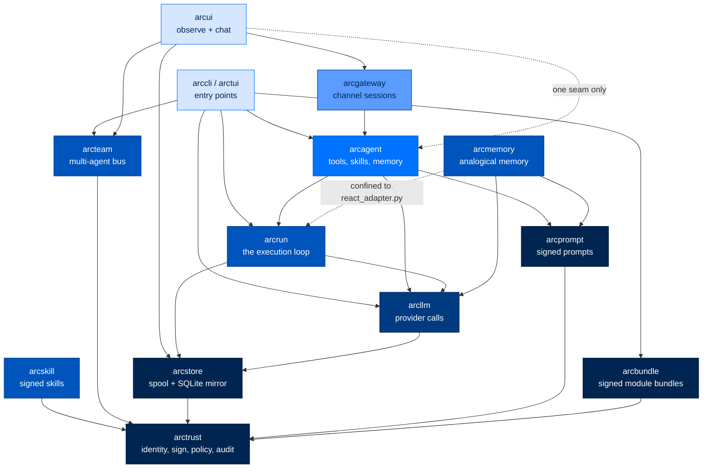
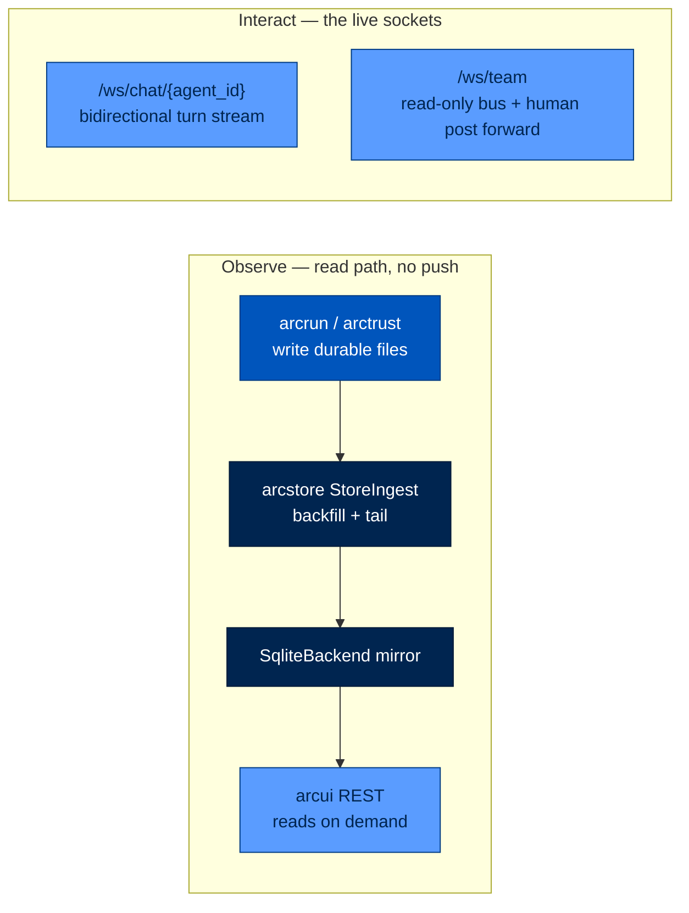
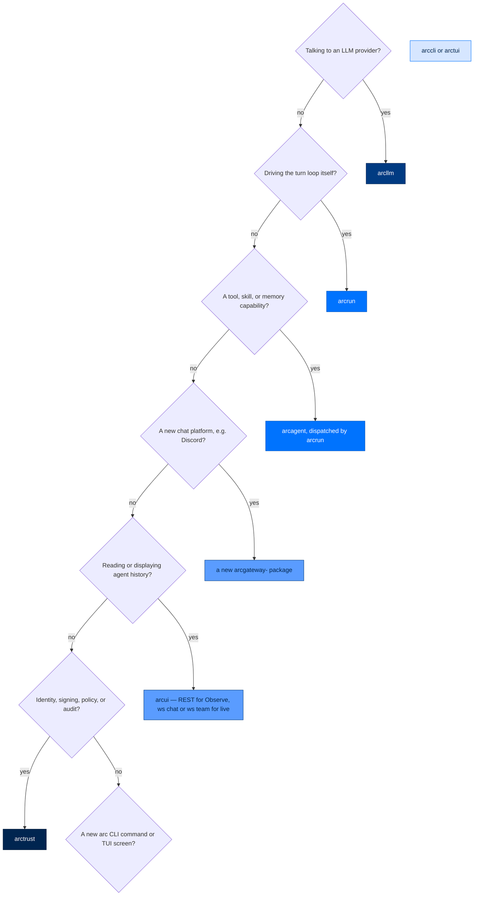

# Package Index

> **Building with Arc**  ·  Build  ·  page 9 of 27  
> **For** Engineers writing code against Arc  
> [← Contributing](contributing.md)  ·  [Docs home](../README.md)  ·  [arcllm →](packages/arcllm.md)

---

## In One Breath

Arc is not one program — it's a stack of small, single-purpose packages, each one only allowed to depend on the packages *below* it, never the ones beside or above it. Think of it like a building: the foundation (identity, signing, storage) can't lean on the walls, the walls can't lean on the roof, and the roof can't reach down and rewire the foundation. If you're adding a feature, 90% of the work is deciding which floor of the building it belongs on.

---

## The Package Inventory

The table below is the full inventory. Two entries (`arcmas`, `arcmodel`) are meta-packages/placeholders — flagged below.

| Package | Layer | Source Root | One Job | Depends On | Must Never |
|---|---|---|---|---|---|
| **arctrust** | Foundation | `packages/arctrust/src/arctrust/` | Security nucleus: DID identity, Ed25519 keypairs, `PolicyPipeline`, WORM chain | nothing in `arc*` | Import any other Arc package |
| **arcbundle** | Foundation | `packages/arcbundle/src/arcbundle/` | Signed module bundles: manifest, verify, atomic materialize, per-agent capability copy | `arctrust`, Pydantic | Import `arcagent` — or anything else in `arc*` |
| **arcstore** | Foundation | `packages/arcstore/src/arcstore/` | Operational/observability storage: append-only spool + `StorageBackend` query layer | `arctrust` | Import `arcagent`, `arcui`, `arccli`, `arcrun`, or `arcgateway` |
| **arcllm** | LLM | `packages/arcllm/src/arcllm/` | Provider-agnostic LLM calls (16 providers), telemetry, budgets, circuit breakers | `arctrust`, `arcstore` | Be called by anything except `arcrun` (and `arc llm` CLI) |
| **arcprompt** | Runtime | `packages/arcprompt/src/arcprompt/` | Editable, signed, inspectable system-prompt store | `arctrust` | Import anything above it |
| **arcrun** | Runtime | `packages/arcrun/src/arcrun/` | The execution loop — the *only* runtime path to `arcllm` | `arcllm`, `arctrust`, `arcstore` | Import `arcagent`; call `arcllm.registry.load_model()` directly |
| **arcskill** | Agent | `packages/arcskill/src/arcskill/` | Verified skill hub: signed install, scan, lock, CRL lifecycle | `arctrust` | Let `arcskill.improver` import `arcagent`, `arcllm`, or `arcmemory` directly |
| **arcmemory** | Agent | `packages/arcmemory/src/arcmemory/` | Dual-speed, four-store, analogical memory | `arctrust`, `arcllm`, `arcprompt`; `arcrun` confined to `react_adapter.py` | Import `arcagent` |
| **arcteam** | Agent | `packages/arcteam/src/arcteam/` | Multi-agent coordination: NATS bus, DID-addressed mailboxes | `arctrust` | Import `arcagent`, `arcui`, `arccli`, `arcrun`, or `arcgateway` |
| **arcagent** | Agent | `packages/arcagent/src/arcagent/` | The agent: identity + tools + skills + memory-as-tools + extensions | `arctrust`, `arcllm`, `arcrun`, `arcstore`, `arcskill`, `arcteam`, `arcmemory` | Import `arcgateway` or `arcui` |
| **arcui** | Surface | `packages/arcui/src/arcui/` | **Observe** (read agent history from `arcstore` via REST) + limited **Interact** | `arcstore`, `arcgateway`, `arcteam`, `arctrust`, `arcskill`, `arcllm` | Import `arcagent` except via `arcagent.capabilities.inventory` seam |
| **arcgateway** | Surface | `packages/arcgateway/src/arcgateway/` | Channel sessions, executor, `web` adapter; owns agent data-plane reads | `arcagent` | Import `arcui`; import platform extension directly; ship platform adapter in core |
| **arcgateway-telegram** | Surface | `packages/arcgateway-telegram/` | Telegram platform adapter plugin | `arcgateway` | Be imported by `arcgateway` core |
| **arcgateway-slack** | Surface | `packages/arcgateway-slack/` | Slack (Socket Mode) platform adapter plugin | `arcgateway` | Be imported by `arcgateway` core |
| **arcgateway-mattermost** | Surface | `packages/arcgateway-mattermost/` | Mattermost platform adapter plugin | `arcgateway` | Be imported by `arcgateway` core |
| **arccli** | Entry | `packages/arccli/src/arccli/` | The `arc …` command surface | `arcagent`, `arcteam`, `arcskill` | Import `click` outside allowlisted files |
| **arctui** | Entry | `packages/arctui/src/arctui/` | Terminal UI for Arc (Textual) | `arccli` | — |
| **arcmas** | Meta | `packages/arcmas/src/arcmas/` | ⚠️ **Meta-package only.** Pulls in `arccli` + `arcmemory` | `arccli`, `arcmemory` | — not a code package |
| **arcmodel** | Placeholder | `packages/arcmodel/src/arcmodel/` | ⚠️ **Placeholder.** Coming soon | nothing | — not a code package |

---

## The Layering Law



`arcbundle` is a leaf beside `arctrust`, and the arrow into it comes from `arccli` alone.
`arcagent` never imports it: the agent only ever *reads* an already-materialized directory,
so the nucleus stays ignorant of distribution entirely. That is also what lets a bundle be
built and verified on a staging host with no agent stack installed.

### The One Narrowed Exception

`arcui` needs the Knowledge/Capabilities "Reality Mirror" views to show what an agent *actually* loads. That requires reading `arcagent` internals. Rather than blow the boundary open, the fix is narrowed to a single seam:

> `arcui` may import **only** `arcagent.capabilities.inventory` — every other `arcagent` import from `arcui` is a forbidden layering violation.

This is enforced by an AST-based architecture test: `test_arcui_imports_arcagent_only_via_inventory_seam` in `packages/arcgateway/tests/architecture/test_imports.py`.

---

## The Two Planes

Since the arcstore operational-storage cutover and arcui push teardown, Arc keeps exactly two live surfaces:



**Observe:** Every write lands in durable files instantly. `arcstore`'s `StoreIngest` backfills into SQLite on startup, then tails for new appends. `arcui` reads on demand via REST — no polling, no subscription.

**Interact:** Two bidirectional WebSockets:
- `/ws/chat/{agent_id}` — turn stream, handled by `arcgateway`'s `WebPlatformAdapter`
- `/ws/team` — read-only bus window plus human post forward

---

## Architecture Decision Records

Repo-level ADRs live in `.claude/architecture/decisions/`, one file per decision. Others are
recorded inline in the spec that produced them, and a few sit in `.claude/adrs/`.

**The full inventory — every ADR, its status, and which number is free next — is the index at
[`.claude/architecture/decisions/README.md`](https://github.com/joshuamschultz/Arc/blob/main/.claude/architecture/decisions/README.md).**
This page deliberately does not repeat it; a second copy is a second thing to forget to update,
which is exactly how this page came to claim eleven ADRs existed when there were far more.

---

## Decision Tree: "I Want to Add X — Which Package?"



---

## LOC Budgets

```bash
make loc-budgets
```

| Budget | Scope | Ceiling | Status |
|---|---|---|---|
| G1.5 | `packages/arcagent/src/arcagent/core/*.py` | 3,500 | 3,485 — OK |
| G1.6 | arcgateway core (`runner.py`, `session.py`, `executor.py`, `adapters/base.py`) | 1,200 | 1,297 — OVER by 97 |
| G1.7 | `packages/arctrust/src/` | 3,600 | 3,780 — OVER by 180 |
| G1.7 | `packages/arcllm/src/` | 7,900 | 7,396 — OK |
| G1.7 | `packages/arcrun/src/` | 5,400 | 5,065 — OK |
| G1.7 | `packages/arcprompt/src/` | 700 | 490 — OK |

---

## Package Details

### arctrust - Security Primitives

**Layer:** Foundation  
**Dependencies:** None

#### Purpose
Cryptographic identity, signing, audit logging, and security primitives.

#### Key Classes

| Class | Purpose |
|-------|---------|
| `DID` | Ed25519 decentralized identifier |
| `Signer` | Signing protocol |
| `AuditLogger` | Operator-signed audit trail |
| `AuditRecord` | Audit record type |
| `FIPSSigner` | FIPS-compliant ECDSA-P256 signer |
| `AgentIdentity` | DID derivation, key management |
| `PolicyPipeline` | Seven-layer authorization pipeline |
| `WormSink` | Tamper-evident audit chain |

#### Key Functions

```python
DID.generate() -> DID
DID.sign(data: bytes) -> str
DID.verify(data: bytes, signature: str) -> bool
AuditLogger.log(action, actor, resource, outcome, metadata) -> AuditRecord
PolicyPipeline.evaluate(call, ctx) -> Decision
```

---

### arcbundle - Signed Module Bundles

**Layer:** Foundation — a leaf beside `arctrust`  
**Dependencies:** `arctrust` (Ed25519 + canonical JSON) and Pydantic. Nothing else, ever.

#### Purpose

The distribution unit that makes a module's **absence** provable. The `arc-agent` wheel is
byte-identical across every tier; each module ships as a separately signed bundle, verified
in full before a single byte reaches disk, and materialized read-only at the deployment root
outside every agent's tool fence.

It knows nothing about `arcagent`. The agent only reads an already-materialized directory, so
a bundle can be built or verified on a low-side box with no agent stack present.

#### Key Modules

| Module | Responsibility |
|---|---|
| `manifest` | `BundleManifest` model + canonical-JSON encoding — the on-disk shape |
| `signer` | Detached Ed25519 signature over a manifest's canonical bytes |
| `verifier` | Fail-closed verify: signature, canonical form, every file hash, undeclared-file sweep |
| `materializer` | Atomic write (stage → fsync → rename), `0444` files in `0555` directories |
| `builder` | Package a module folder into a signed `.arcbundle` |
| `capability_copy` | Per-agent copy of a module's tools + skills, and its inverse |

#### Key Functions

```python
build_bundle(source_dir, module, version, private_key, issuer, out) -> Path
verify_bundle(bundle_root, tier, trusted_issuers, sink, actor_did) -> VerifiedBundle
materialize(verified, dest_root, sink, actor_did) -> Path
copy_capabilities(module_dir, agent_dir, module) -> Path
remove(name, dest_root, sink, actor_did) -> None
remove_capabilities(agent_dir, module) -> bool
```

#### Invariants

- **Nothing is written before everything is verified.** A failed verify leaves the destination
  byte-identical to its prior state — no partial tree.
- **Fail closed.** Any exception during verification denies.
- **Module runtime is never agent-writable.** `0444` inside `0555`, at the deployment root.
- **`_runtime.py` is never copied** into the agent-writable capability root.

#### Audit Events

`module.bundle.verified` · `module.signature_invalid` · `module.content_hash_mismatch` ·
`module.installed` · `module.removed` — each emitted from inside the package at the point the
outcome is decided.

See [Writing modules](modules.md) for the author's view and
[Staging module bundles across an air gap](../runbooks/staging-module-bundles.md) for the
operator procedure.

---

### arcstore - Storage Backend

**Layer:** Foundation  
**Dependencies:** arctrust

#### Purpose
Unified storage interface for sessions, memory, tasks, and audit logs.

#### Key Classes

| Class | Purpose |
|-------|---------|
| `Store` | Main storage interface |
| `SessionStore` | Session management |
| `MemoryStore` | Memory storage |
| `TaskStore` | Task storage |
| `AuditStore` | Audit log storage |
| `StorageBackend` | Protocol for storage engines |
| `SqliteBackend` | SQLite implementation |

#### Storage Layout

```
workspace/
├── sessions/*.jsonl      # Session transcripts
├── memory/               # Memory index
├── tasks/                # Task store
└── audit/                # Audit logs
```

---

### arcllm - LLM Client

**Layer:** LLM  
**Dependencies:** arctrust, arcstore

#### Purpose
Zero-SDK HTTP client for 16 LLM providers with security modules.

#### Supported Providers

| Provider | Models | Notes |
|----------|--------|-------|
| anthropic | Claude family | Native tool support |
| openai | GPT family | Native tool support |
| azure | Azure OpenAI | Enterprise deployment |
| google | Gemini family | Vertex AI support |
| cohere | Command family | |
| mistral | Mistral family | |
| groq | Llama, Mixtral | Fast inference |
| deepseek | DeepSeek models | |
| together | Open models | |
| fireworks | FireLLaVA, etc. | |
| openrouter | Aggregation | |
| nvidia | NVIDIA models | |
| xai | Grok models | |
| moonshot | Moonshot models | |
| huggingface | HF models | |
| ollama | Local models | |
| vllm | Self-hosted | |
| tgi | HuggingFace TGI | |

#### Key Classes

| Class | Purpose |
|-------|---------|
| `LLMClient` | Provider client |
| `ChatRequest` | Request type |
| `ChatResponse` | Response type |
| `Usage` | Token usage |

#### Key Functions

```python
arcllm(provider, model, tools, **kwargs) -> LLMClient
LLMClient.chat(messages, tools, temperature, max_tokens) -> ChatResponse
LLMClient.embed(texts) -> list[list[float]]
LLMClient.count_tokens(text) -> int
```

---

### arcprompt - Prompt Engine

**Layer:** Runtime  
**Dependencies:** arctrust

#### Purpose
Prompt building, templating, and context management with signing.

#### Key Classes

| Class | Purpose |
|-------|---------|
| `PromptResolver` | Prompt resolution with overlays |
| `PromptTemplate` | Prompt templates |
| `PromptBuilder` | Dynamic prompt building |

#### Key Functions

```python
PromptResolver.resolve(package, name) -> str
build_prompt(task, context, system_prompt, skills) -> list[dict]
```

---

### arcrun - Execution Loop

**Layer:** Runtime  
**Dependencies:** arcllm, arctrust, arcstore

#### Purpose
Think-act-observe execution loop with sandboxing.

#### Key Classes

| Class | Purpose |
|-------|---------|
| `Sandbox` | Code execution sandbox |
| `DockerSandbox` | Docker-based sandbox |
| `FirecrackerSandbox` | Firecracker VM sandbox |
| `ToolRegistry` | Per-run tool registry |
| `RunState` | Execution state |

#### Key Functions

```python
run_turn(agent, task, session_id, max_turns) -> Result
Sandbox.execute(code, timeout, memory_limit) -> ExecutionResult
```

#### Sandbox Features

| Feature | Docker | Firecracker |
|---------|--------|-------------|
| Network | Disabled by default | Disabled by default |
| Memory | 512MB default | 1GB default |
| CPU | 1 core | 2 cores |
| Timeout | 60s | 300s |
| Requires | Docker daemon | KVM (/dev/kvm) |

---

### arcskill - Skill Hub

**Layer:** Agent  
**Dependencies:** arctrust

#### Purpose
Verified skill installation with Sigstore/Rekor verification.

#### Key Classes

| Class | Purpose |
|-------|---------|
| `HubConfig` | Hub configuration |
| `HubPolicy` | Policy settings |
| `TierPolicy` | Tier-specific policies |
| `HubLockFile` | Installed skills registry |

#### Install Pipeline


---

### arcskill.improver - Skill Self-Improvement

**Layer:** Agent  
**Dependencies:** arctrust, arcllm, arcrun

#### Purpose
Code repair and optimization via golden-task gate.

#### Edit Budgets

| Tier | Max Edits | Max Lines |
|------|-----------|-----------|
| Personal | 8 | 80 |
| Enterprise | 4 | 40 |
| Federal | 2 | 20 |

---

### arcmemory - Memory System

**Layer:** Agent  
**Dependencies:** arctrust, arcllm, arcstore, arcprompt

#### Purpose
Dual-speed, four-store, analogical memory: markdown source + SQLite index.

#### Key Classes

| Class | Purpose |
|-------|---------|
| `MemoryService` | Main memory interface |
| `Entity` | Entity type |
| `Episode` | Episode type |
| `DailyEntry` | Daily log entry |

#### Four Stores

| Store | Purpose |
|-------|---------|
| Episodic | Time-ordered events |
| Entity | Structured knowledge |
| Procedural | Skills and procedures |
| Daily | Daily summaries |

---

### arcteam - Multi-Agent Coordination

**Layer:** Agent  
**Dependencies:** arctrust, arcstore

#### Purpose
Entity registry, messaging, and team coordination via NATS.

#### Key Classes

| Class | Purpose |
|-------|---------|
| `EntityRegistry` | Entity management |
| `MessagingService` | Message routing |
| `TeamConfig` | Team configuration |

#### Message Types

| Type | Purpose |
|------|---------|
| `info` | General information |
| `request` | Expects reply |
| `task` | Work assignment |
| `result` | Task result |
| `alert` | Time-sensitive |
| `ack` | Acknowledgement |

---

### arcagent - Agent Framework

**Layer:** Agent  
**Dependencies:** arctrust, arcllm, arcrun, arcstore, arcskill, arcteam, arcmemory

#### Purpose
Main agent implementation with tools, skills, and memory-as-tools.

#### Key Classes

| Class | Purpose |
|-------|---------|
| `ArcAgent` | Main agent class |
| `AppConfig` | Agent configuration |
| `Result` | Task result |

#### Tool Decorator

```python
@tool(name, description, classification, version)
def my_tool(...) -> ...:
    ...
```

#### Classifications

| Classification | Meaning |
|----------------|---------|
| `read_only` | No side effects |
| `network` | Makes network calls |
| `write` | Modifies files |
| `dangerous` | System-level operations |

---

### arcui - Dashboard

**Layer:** Surface  
**Dependencies:** arcstore, arcgateway, arcteam, arctrust, arcskill, arcllm, arcagent (inventory seam only)

#### Purpose
Web dashboard for monitoring and control.

#### Planes

| Plane | Purpose |
|-------|---------|
| Observe | Read agent history via REST |
| Interact | Live chat via WebSocket |
| Manage | Control agent, view sessions |

---

### arcgateway - Chat Platform Daemon

**Layer:** Surface  
**Dependencies:** arcagent

#### Purpose
Integration with chat platforms; owns agent data-plane reads.

#### Key Classes

| Class | Purpose |
|-------|---------|
| `GatewayDaemon` | Main daemon |
| `PairingService` | Device pairing |
| `SessionRouter` | Session routing |
| `WebPlatformAdapter` | Built-in web chat |

---

### arccli - CLI Interface

**Layer:** Entry  
**Dependencies:** arcagent, arcteam, arcskill

#### Purpose
Command-line interface for all Arc operations.

#### CLI Commands

```bash
# Agent
arc agent create NAME
arc agent build NAME [--check]
arc agent chat NAME
arc agent run NAME TASK
arc agent serve NAME
arc agent status NAME

# LLM
arc llm providers
arc llm models [--tools]
arc llm validate

# Skills
arc skill list
arc skill search QUERY
arc skill create NAME

# Capabilities
arc ext list
arc ext create NAME

# Team
arc team init
arc team register ID
arc team status

# UI
arc ui start [--show-tokens]
arc ui tail [--viewer-token TOKEN]

# Blueprints
arc blueprint list
arc blueprint verify PATH
arc blueprint publish PATH

# Security
arc security status
arc security validate
```

---

### arctui - Terminal UI

**Layer:** Entry  
**Dependencies:** arccli

#### Purpose
Terminal interface for agent chat.

---

## Don't-Mix-Concerns Rules

| Symptom | Violates | Belongs In |
|---|---|---|
| Tool handler calls LLM directly | "arcrun is only path to arcllm" | `arcllm`, invoked via `arcrun` |
| Tool/skill logic in `arcrun` | "arcrun owns loop, not capabilities" | `arcagent` |
| Direct file reads from `arcgateway`/`arcui` | Data-plane ownership | `arcgateway.fs_reader` |
| `arcui` imports `arcagent` beyond inventory | One narrowed seam | `arcagent.capabilities.inventory` |
| Module-level per-agent state | `test_no_module_global_agent_state` | Per-agent instance state |
| Platform adapter in `arcgateway/adapters/` | Zero platform code in core | New `arcgateway-<platform>` package |
| `arcmemory` imports `arcagent` | Hard DAG boundary | Protocol seam injection |

---

## Architecture Tests

Run to verify layering:

```bash
pytest tests/architecture/ packages/*/tests/architecture/
```

| Test | Location | Guards |
|---|---|---|
| `test_no_arcagent_imports_arcgateway` | `tests/architecture/test_no_arcagent_imports_arcgateway.py` | `arcagent` has zero knowledge of `arcgateway` — one-way dependency |
| `test_no_arcrun_imports_arcagent` | `tests/architecture/test_no_arcrun_imports_arcagent.py` | `arcrun` has zero knowledge of `arcagent` |
| `test_no_arcrun_calls_load_model` | `tests/architecture/test_no_arcrun_calls_load_model.py` | `arcrun` never calls `arcllm.registry.load_model()` directly — model lifecycle stays in `arcllm` |
| `test_no_arcagent_import` | `packages/arcmemory/tests/architecture/test_no_arcagent_import.py` | `arcmemory` never imports `arcagent` — the hard DAG boundary |
| `test_arcui_imports_arcagent_only_via_inventory_seam` | `packages/arcgateway/tests/architecture/test_imports.py:61` | `arcui` only imports `arcagent.capabilities.inventory` |
| `test_no_arcstore_upward_imports` | `tests/architecture/test_no_arcstore_arcteam_upward_imports.py` | `arcstore`/`arcteam` never import `arcagent`, `arcui`, `arccli`, `arcrun`, or `arcgateway` |
| `test_no_click_in_arccli` | `tests/architecture/test_no_click_in_arccli.py` | No `import click` in `arccli` outside allowlist |
| `test_no_global_tool_name_mutation` | `tests/architecture/test_no_global_tool_name_mutation.py` | `arcrun` never mutates process-global tool-name state |
| `test_no_unsigned_backends_at_federal` | `tests/architecture/test_no_unsigned_backends_at_federal.py` | `arcrun.backends.loader.load_backend` calls signature verification before loading any non-builtin backend |
| `test_module_bus_priority_assignments` | `tests/architecture/test_module_bus_priority_assignments.py` | Module-bus subscription priorities (10=policy/security, 50=security, 100=default, 200=logging) |
| `test_backend_protocol_duck_typing` | `tests/architecture/test_backend_protocol_duck_typing.py` | Third-party `ExecutorBackend`s satisfy the Protocol structurally |
| `test_arccli_command_registry_minimal_surface` | `tests/architecture/test_arccli_command_registry_minimal_surface.py` | `arccli.commands` exports only `CommandDef`, `COMMAND_REGISTRY`, `resolve_command`, `commands_by_category` |
| `test_prompt_markdown_ships_in_wheels` | `tests/architecture/test_prompt_markdown_ships_in_wheels.py` | Every package with `context/` declares it under `artifacts` |
| `test_workspace_install` | `tests/architecture/test_workspace_install.py` | Canonical `uv pip install -e` sequence stays valid |
| `test_no_module_global_agent_state` | `packages/arcagent/tests/architecture/test_no_module_global_agent_state.py` | No `_runtime.py` module holds per-agent state as module-level global |
| `test_improver_no_provider_import` | `packages/arcskill/tests/architecture/test_improver_no_provider_import.py` | `arcskill.improver` imports no `arcagent`, `arcllm`, or `arcmemory` |
| `test_reuses_arctrust_comparator` | `packages/arcmemory/tests/architecture/test_reuses_arctrust_comparator.py` | `arcmemory` imports `arctrust`'s `dominates`/`parse_classification` |

---

## Where to Look in the Code

| Path | What Lives There |
|---|---|
| `packages/arctrust/src/arctrust/` | DID identity, signing, audit, tiers |
| `packages/arcllm/src/arcllm/` | Provider adapters, registry, budgets |
| `packages/arcrun/src/arcrun/` | Turn loop, backends, tool registry |
| `packages/arcagent/src/arcagent/core/` | Agent nucleus (budget-tracked) |
| `packages/arcagent/src/arcagent/capabilities/` | Capability discovery and trust |
| `packages/arcagent/src/arcagent/modules/` | Opt-in agent modules |
| `packages/arcstore/src/arcstore/` | Spool, ingest, SQLite mirror |
| `packages/arcgateway/src/arcgateway/` | Sessions, data-plane reads, web adapter |
| `packages/arcui/src/arcui/` | Dashboard API, live sockets |
| `packages/arccli/src/arccli/commands/` | CLI command registry |

---

## Next Steps

- [API_REFERENCE.md](../reference/api.md) - Detailed API documentation
- [DATA_FLOW.md](../walkthrough/data-flows.md) - Data flow pathways
- [SECURITY.md](../reference/security.md) - Security architecture