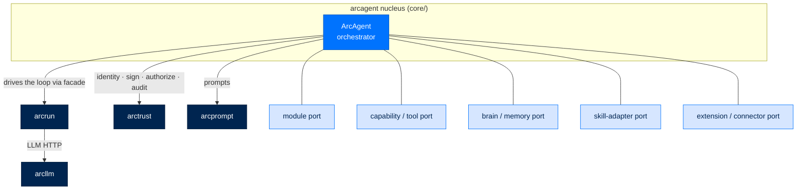
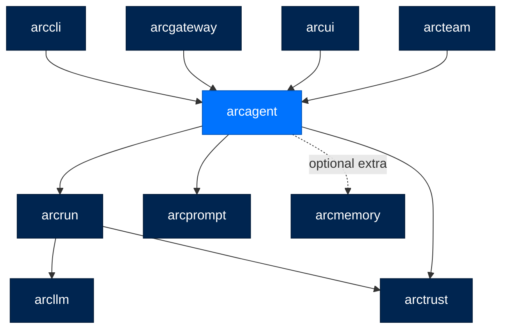
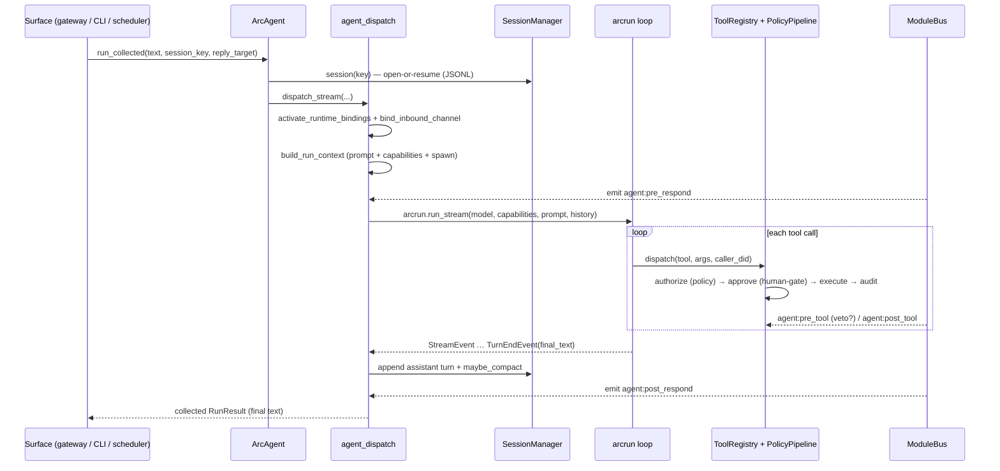
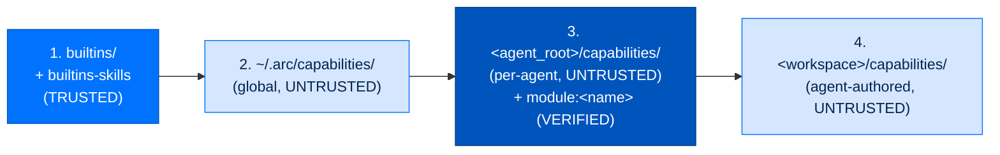

# arcagent - The Agent Nucleus

> **Building with Arc**  ·  Build  ·  page 16 of 27  
> **For** Engineers writing code against Arc  
> [← arcmodel](arcmodel.md)  ·  [Docs home](../../README.md)  ·  [arcmemory →](arcmemory.md)

---

## In one breath

`arcagent` is the part of Arc that **is the agent** — the thing that has a name,
a cryptographic identity, a memory, a set of tools, and a workspace it calls
home. It is deliberately *not* the part that talks to the model or runs the
think-act loop; that is `arcrun` below it. `arcagent`'s whole job is to stand up
an accountable, governed agent, hand `arcrun` a fully-wired set of capabilities
and a system prompt, and then account for everything the loop does: who called,
whether it was allowed, and an audit record that it happened.

Everything an agent can *do* beyond the bare loop — memory, tasks, workflows,
connectors, the scheduler, messaging, a browser — lives **outside** the nucleus,
in modules and capabilities that plug into ports. The nucleus knows the ports,
never the parts. That is why the same package is a turnkey personal assistant, an
enterprise fleet member, and a federally-hardened analyst without a fork. This
page is the *how* of that nucleus. The idea it rests on is
[The Seam Model](../../concepts/seam-model.md).



---

## Overview

`arcagent` is the **agent nucleus**. It owns:

- **Identity** — every agent has a DID; `ArcAgent.__init__` refuses to run without one.
- **Configuration** — a three-file TOML family validated by Pydantic.
- **Sessions** — a keyed pool of persistent, JSONL-backed conversations with compaction.
- **The module bus** — a priority-ordered, veto-capable async event bus modules hook into.
- **The tool registry + policy pipeline** — every tool call is authorized and audited.
- **Orchestration** — it wires `arcrun` for one turn, then captures and delivers the result.

It does **not** own the LLM call or the execution loop. Those are separate
concerns in separate packages, and keeping them separate is what lets each layer
be installed and rewritten alone (see [Concern split](#the-concern-split)).

---

## The concern split

Three concerns, three packages. The rule (repo `.claude/rules/core.md`) is that
`arcagent` never reaches past its neighbour:

| Concern | Package | `arcagent`'s relationship |
|---|---|---|
| LLM HTTP calls (17 providers, routing) | `arcllm` | **Never imported.** |
| The think-act-observe loop | `arcrun` | Used through its public facade. |
| The agent (tools, skills, modules, memory, identity, sessions) | `arcagent` | This package. |

Two facts in the code make the split real and testable:

- **`arcagent` never imports `arcllm`.** A model is loaded through
  `arcagent.utils.load_eval_model`, which returns an `arcrun.Model` by calling
  `arcrun.load_model()` — `arcrun` is the only seam `arcagent` talks to for
  models. Grep the tree and there is no `import arcllm` in `arcagent`.
- **The loop is `arcrun`'s.** `core/agent_dispatch.py` calls
  `arcrun.run_stream(...)` and yields its `StreamEvent`s. `arcagent` assembles the
  prompt and the capability set, hands them over, and reads events back — it does
  not implement a loop.

### ADR-029 — the agent's brain stays home

An agent writes two very different kinds of file, through two very different
doors:

| Writing… | How | Why |
|---|---|---|
| **Project** files (the user's repo, documents) | The LLM-facing tools (`write` / `bash` / `edit`) | Tools can open any allowed directory. |
| **Agent** state (memory, sessions, `context.md`, identity, the audit chain) | **Direct filesystem I/O to the agent's workspace** | The tools can be pointed anywhere; the agent's own brain must not be. |

Agent state is written by workspace-path I/O only, never by calling the
model-facing tools. `working_dir` can move the *tool* root (for coding agents
that operate in a launch directory), but the state fence stays `workspace +
allowed_paths`.

---

## Layer, dependencies, and the LOC budget

**Layer:** the agent nucleus. `arcagent` depends on `arcrun`, `arctrust`,
`arcprompt`, and an optional `arcmemory` extra. It is imported by `arccli`,
`arcgateway`, `arcui`, and `arcteam` — the surfaces that construct and drive
agents. It is **headless**: it runs with no gateway and no UI, and it must **not**
import `arcgateway` (an architecture test,
`tests/architecture/test_no_arcagent_imports_arcgateway.py`, fails CI if it does).



**Why the nucleus stays lean.** `core/` carries a hard budget of **< 3,500
NCLOC** — `arcagent`'s own tightening of ADR-004's "core under 5,000 LOC" rule.
The budget is a *design signal*, not a chore: when `core/` grows, the right move
is almost always to push the new behaviour down into a module or a capability,
not to raise the ceiling. Complexity lives in `modules/`, `capabilities/`, and
`extension/`; the nucleus stays small and constant so it can be read whole and
reasoned about.

---

## The nucleus (`core/`)

`ArcAgent` (`core/agent.py`) is the orchestrator. It owns every core component
and manages their lifecycle, but the heavy methods are split into sibling files
so the class file stays legible:

| File | Responsibility |
|---|---|
| `agent.py` | The `ArcAgent` class — construction, `startup`, `run`, `session`, `shutdown`. |
| `agent_lifecycle.py` | `startup`/capability wiring: `setup_capabilities`, `configure_module_runtimes`, live `set_module_enabled`. |
| `agent_dispatch.py` | The single execution path: `dispatch_stream`, `build_run_context`, per-turn binding. |
| `agent_security.py` | Operator-key custody, WORM chain paths, federal witness — the audit-authority resolvers. |
| `config.py` / `config_loading.py` | Pydantic config models + the three-file TOML composition. |
| `tool_registry.py` / `tool_policy.py` | The tool registry and the arctrust policy pipeline it dispatches through. |
| `module_bus.py` | The async event bus (`subscribe` / `emit` / `replace_handlers`). |
| `module_discovery.py` / `module_config.py` | Folder-presence discovery and config validation for modules. |
| `session_internal/` | `SessionManager` (JSONL persistence + compaction), `ContextManager`. |
| `runtime_dependencies.py` | The typed dependency menu modules draw from (ADR-033). |
| `turn_context.py` | The per-turn ambient context (`contextvars`). |
| `telemetry.py` | OTel spans + the redacting audit-event boundary. |
| `model_manager.py` | Loads the `arcrun.Model`, wires the trace store and event bridges. |
| `vault/` | The credential-resolution seam (env / file / Azure backends). |

### A turn, end to end



### The single execution path

There is **one** way a turn runs, and every surface — a Slack message, a CLI
invocation, a fired schedule, a sub-agent — funnels through it:

- `ArcAgent.run(input_text, *, session, ...)` is the only execution entry. It is
  always session-bound and always streaming. It delegates to
  `agent_dispatch.dispatch_stream`.
- `run_collected(input_text, *, session_key, ...)` opens-or-resumes the keyed
  session, streams the turn, and collects it to a final `RunResult` via
  `arcrun.collect`. This is the callback every non-streaming surface binds — it
  is published on the `agent:ready` bus event as `run_fn` so the scheduler,
  pulse, messaging inbox, and gateway all drive the agent identically.
- Inside, `dispatch_stream` serializes the *whole* turn under a per-session lock
  (`_run_coordinator.turn(session_id)`) so a later call cannot read history until
  this turn has committed its assistant response — no split-brain history across
  concurrent callers.

### `build_run_context` — assembling the turn

`agent_dispatch.build_run_context` prepares everything `arcrun` needs:

1. **Tools** — `tool_registry.to_arcrun_tools()` produces policy-wrapped,
   invocable tools.
2. **Prompt** — the tiered system prompt is assembled by `ContextManager`, with a
   harness `base` preamble and `arcrun`'s strategy prompts, all resolvable through
   an overlay-aware, operator-key-pinned prompt resolver (editable prompts,
   COMP-006).
3. **Spawn** — if `[spawn] enabled`, `make_spawn_tool` is dispatched with the
   loop's live `ToolContext` so children inherit the invoke tools and a shared
   token pool (see [Orchestration](#orchestration-sub-runs)).
4. **Capabilities** — everything is wrapped in an `AgentCapabilityProvider`
   (ADR-023) carrying the `caller_did`, tier, skills, and the audit hook. This is
   the single object `arcrun` sees.
5. It emits `agent:pre_respond` on the bus before returning.

### The per-turn context binding

A subtle, load-bearing detail. A turn runs in a **fresh sibling `asyncio.Task`**
(the gateway spawns one per turn; a cached agent's second-and-later turns never
re-run `startup`). A `ContextVar` set during startup does **not** reliably reach a
tool dispatch inside that sibling task. So at every turn-dispatch entry,
`_dispatch_stream_locked` does two things before the loop starts:

- `activate_runtime_bindings(agent)` replays every module's `_runtime.bind(state)`
  so the loop's tool dispatches see this agent's per-agent state.
- `bind_inbound_channel(...)` sets the turn's ambient context (`core/turn_context.py`):

| ContextVar | Meaning | Who reads it |
|---|---|---|
| `inbound_channel` | The `platform:chat_id` this turn arrived on | The scheduler defaults a new schedule's delivery back to this channel. |
| `overheard` | This turn came from a broadcast addressed to nobody | Memory skips *retaining* an un-addressed shared-channel message (answering is fine; keeping it is not). |
| `inbound_hop` | How many agent turns this message descends from | A mention chain between agents runs out of depth instead of forever. |
| `interactive` | A real person drove this turn (not a background self-wake) | Memory consolidation only counts real interaction as "new context". |

The run id is bound here too (`arcstore.spool.request_context`) so a step that
runs *while the prompt is assembled* — a memory recall, most of all — lands in
the same run's trace as the loop that follows it.

### Sessions and compaction (`session_internal/`)

An agent holds a **keyed pool** of sessions — one `SessionManager` per
conversation (a Slack thread, a UI tab, a CLI key, an agent-to-agent channel).
`ArcAgent.session(key)` opens-or-resumes under a lock so two concurrent callers
with the same key cannot clobber one JSONL log. Different callers are distinct,
concurrent sessions; turns *within* each still run sequentially.

- **Persistence** — messages are appended to a per-session JSONL file in the
  workspace (direct I/O, ADR-029).
- **Compaction** — `SessionManager.compact` (SPEC-029) is the single, discrete
  compactor. Between boundaries the log is append-only; when it fires it does one
  deep, debounced pass: keep a recent tail (~≤45% of the window), summarize the
  rest through the eval model into a **structured** (schema, not prose) summary,
  mask stale tool observations in the kept window, and rebuild
  `[summary, *masked_kept]`. A revision compare-and-swap stops a stale summary
  from overwriting concurrent appends. It never touches `context.md` — the
  workpad module owns that.
- **`ContextManager`** (`session_internal/context.py`) assembles the tiered system
  prompt, estimates token ratios, prunes observations, and owns the
  emergency-truncation and compaction-split maths.

### Configuration — the three-file split

`load_config(path)` (`core/config.py`) does not read one file. It composes a
**family** of three, each deep-merged over its user-wide base under
`${ARC_CONFIG_DIR:-~/.arc}`, then folds `ARCAGENT_`-prefixed environment
overrides on top:

| File (beside `arcagent.toml`) | Owns the sections |
|---|---|
| `arcagent.toml` | `agent`, `identity`, `vault`, `tools`, `modules`, `telemetry`, `context`, `session`, `security`, `capabilities`, `spawn`, `ui`, `arcstore` |
| `arcllm.toml` | `llm`, `eval`, `budget` |
| `arcrun.toml` | `arcrun` (sandbox, loop controls) |

The composed dict is validated into a single `ArcAgentConfig` Pydantic model
(`extra="forbid"` on the strict sub-models). Env overrides carry a **denylist**:
security-sensitive keys (`vault.backend`, `tools.process`, `tools.preamble`,
`tools.policy.allowed_paths`, `identity.key_dir`) can never be set from the
environment.

### The tool registry and policy pipeline

Every tool the model calls passes through `ToolRegistry` (`core/tool_registry.py`),
which dispatches in five fixed stages. The policy *engine* is not `arcagent`'s —
it re-exports and reuses `arctrust.policy` (`core/tool_policy.py` names no copy of
the checker); `arcagent`'s job is to feed it a signed call and a context and act
on the decision.


1. **Normalize** — resolve the dispatch context.
2. **Authorize** — build a `ToolCall`, **sign it with the agent identity**
   (`sign_call`), resolve its lethal-trifecta legs against the per-session
   capability ledger, and run the full `PolicyPipeline.evaluate`. Layers:
   `Global` (the lethal-trifecta forbidden composition, live at every tier),
   `Agent`, `Sandbox`, `Provider` (LLM10 budgets), `Classification` (clearance),
   `Team`. First DENY wins; exceptions fail closed. A `DENY` raises
   `PolicyDenied`, carrying the exact layer, rule, and reason.
3. **Approve** — a denied *composition* (a lethal-trifecta completion) is routed
   to the `HumanGate`, which waits for a one-shot approval **signed with the
   operator key** through the mechanical approval channel (`arc approve` / the UI
   operator surface — never agent chat, which could be forged). Then
   `agent:pre_tool` is emitted; any handler may `veto`, raising `ToolVetoedError`.
4. **Execute** — one call under the tool's `timeout_seconds`; a timeout raises a
   structured `ToolError`.
5. **Record** — emit `agent:post_tool` and write the audit envelope. An
   unidentified caller (`did:arc:unknown`) is itself an audited security event.

### Telemetry and audit

`AgentTelemetry` (`core/telemetry.py`) creates OTel spans (`arcagent.session` →
`arcagent.turn` → `arcagent.tool`, with `arcllm` spans auto-nesting under) and is
the **single redacting audit boundary**: `audit_event` always logs (even with OTel
disabled — audit is a compliance requirement, NIST 800-53 AU family) and redacts
any key matching `password|secret|token|key|credential|auth|api_key|private`.
`TelemetryAuditSink` adapts arctrust's typed `AuditEvent`s to this boundary, so
policy decisions, capability loads, and spawns all flow through one redactor.

---

## The module system (`modules/`)

A **module** is how a whole feature area — memory, tasks, a browser — plugs into
the nucleus without the nucleus knowing its name. It is the biggest port in Arc.

### A module is a folder

Discovery is by **folder presence**, not a registry (`core/module_discovery.py`).
A folder under the deployment module root qualifies as a module iff it ships both:

- `capabilities.py` — the tools, hooks, and background tasks the capability loader
  scans; and
- `_runtime.py` — the per-agent state configured at startup.

Underscore-prefixed folders never qualify. Discovery gives the *known set*;
**activation is separate and explicit** — a discovered module loads only when the
agent config carries an enabled `[modules.NAME]` entry (default OFF).
Discovered-but-disabled is a valid, listable, inert state; a config entry naming
an absent folder is surfaced as not-discovered and never loads. `active_modules`
is the single set both the real load path and any listing surface agree on.

### The decorators

Inside `capabilities.py`, four decorators (`arcagent.tools._decorator`) stamp a
frozen `_arc_capability_meta` onto functions/classes so the loader can find them
without a registration list. Metadata is **frozen** so a post-load mutation can't
escalate a classification.

| Decorator | Declares | Key parameters |
|---|---|---|
| `@tool` | An LLM-callable tool (must be `async`) | `name`, `description`, `classification` (`read_only` \| `state_modifying`, default `state_modifying` — fail-closed), `capability_tags`, `when_to_use`, `requires_skill`, `version`, `signals_completion` |
| `@hook` | A subscriber to a bus event | `event` (required), `priority=100`, `tryfirst`/`trylast` |
| `@background_task` | A periodic loop | `interval` (seconds, > 0), `name` |
| `@capability` | A class with a `setup(ctx)`/`teardown()` lifecycle | `name`, `depends_on` (topological ordering) |

There are exactly **two** tool classifications, not four: `read_only` and
`state_modifying`. The schema is inferred from the typed signature.

### ADR-033 — dependencies through the `configure` signature

There is **no DI container**. A module's `_runtime.py` exposes a
`configure(*, ...)` function, and its keyword parameters *are* its dependency
contract. `configure_module_runtimes` (`agent_lifecycle.py`) builds one
`RuntimeDependencies` menu (`core/runtime_dependencies.py`) and calls each
module's `configure` with **exactly the keys it names, and nothing else** —
least privilege by signature. A module that never names `operator_signer` never
receives it. The core names no module and holds no per-module registry: adding a
module needs no edit here.

The menu's closed vocabulary (`DependencyKey`) includes `workspace`,
`config` (the module's own `[modules.NAME.config]` table), `telemetry`, `bus`,
`tool_registry`, `identity`, `agent_did`, `tier`, `policy_pipeline`,
`egress_proxy`, `human_gate`, `operator_signer`, `agent_run_fn`,
`arcstore_opener`, `fleet`, and more. `configure` is **sync** by contract; a
module that needs async I/O keeps `configure` cheap and defers to an idempotent
`ensure_*` method under a lock (as `tasks`, `workflows`, `runcontrol`, and
`messaging` do).

Per-agent state lives on a `_State` dataclass bound to a `ContextVar` — **never a
module global** (an AST architecture test fails CI on one). Most modules use a
single `ContextVar[_State|None]` slot; `memory` and `workpad` — which hold
per-agent private data injected into prompts — use a **DID-keyed registry** whose
`state()` fails closed with an isolation-fault audit on a missing/mismatched DID
(OWASP ASI03/LLM02).

### ADR-034 — modules live, and modules are signed bundles

- **Live enable/disable.** `agent.set_module_enabled(name, enabled=…)` binds or
  unbinds *all* of a module's effects — tools, hooks, background loops, per-agent
  state — with **no restart**. The capability half rides a transactional reload
  (the `module:<name>` scan root is added/dropped and the rescan
  registers/removes its capabilities); the runtime half is the module's
  `configure` on enable and an optional `teardown` on disable.
  `enable_module_persisted` also writes the `[modules.NAME]` flag so it survives
  restarts, with rollback if live activation fails.
- **Distributed as signed bundles.** Modules are **not in the wheel**. The only
  file `modules/` ships is `__init__.py`, whose custom `__path__` spans the source
  dir and the deployment module root so imports keep resolving after source
  leaves the wheel. Each module arrives as an Ed25519-signed bundle materialized
  to `${ARC_CONFIG_DIR:-~/.arc}/modules/`. Its per-agent **capability copy** is
  written under `<agent_root>/capabilities/modules/<name>/`, and *that* copy is
  what loads (one load path, not two). `module:*` is its own trust class
  (`RootTrust.VERIFIED`): a valid signature is mandatory at **every** tier because
  the copy sits in an agent-writable directory.

### The shipped modules

Twenty-one modules ship in-tree (each a signed bundle at deploy time). Roles,
grounded in each module's `capabilities.py`/`_runtime.py`:

| Module | Role | Requires `operator_signer` |
|---|---|---|
| `memory` | The only agent-side memory wiring (SPEC-041): binds the config-selected `Brain` to recall/capture/consolidate hooks and memory tools (`memory_search`, `knowledge_*`, `document_search`, `datastore_query`, `procedure_*`). DID-keyed, fail-closed. | — |
| `tasks` | Mission-control task surface (SPEC-056) over the arcstore `TaskStore`: `create_task`/`assign_task`/`decompose_task` + dispatch and reliability loops. | ✓ |
| `workflows` | Signed-DAG authoring/run surface (SPEC-061) over arcteam's control plane: `workflow_create`/`workflow_add_node`/`workflow_run` + a process-hosted runner. | ✓ |
| `connectors` | Attaches every connection this agent was granted and runs a reconcile loop; owns connector-tool lifetimes. | — |
| `connected_data` | Connected-datastore/source ingestion + catalog-into-prompt hook (the Knowledge lifecycle). | — |
| `scheduler` | Owns the `SchedulerEngine`; CRUD tools (`schedule_create`/`_list`/`_update`/`_cancel`) that fire runs on a cadence. | — |
| `proactive` | Owns the `ProactiveEngine`; leader-elected, ticks the engine so an agent can wake itself. | — |
| `pulse` | Owns the `PulseEngine` — the agent's background heartbeat that drives self-initiated turns. | — |
| `workpad` | Sole writer of `context.md` — the open-loops cockpit injected into every system prompt. DID-keyed, fail-closed. | — |
| `policy` | Self-learning adaptation policy: six hooks observe turns and reflect (SPEC-047 cadence-gated). | — |
| `messaging` | The live team surface over arcteam: `notify_user`/`messaging_*`, a durable inbox loop, and team file sharing. | ✓ |
| `planning` | Planner-LLM surface (SPEC-040): `plan_create`/`plan_status`/`plan_replan` over a signed plan chain. | ✓ |
| `skills` | Skills wiring (SPEC-044): forwards per-turn signals to the config-selected `SkillAdapter`; runs the retire/revive sweep. | ✓ |
| `browser` | A `@capability`-owned browser lifecycle + ~20 page-driving tools (`browser_navigate`/`_click`/`_read_page`/…). | — |
| `web` | `web_search` (PII-redacted) and `web_extract` (URL-policy-checked); withholds a tool whose provider key is absent. | — |
| `voice` | STT/TTS (`transcribe`/`synthesize`) with tier air-gap enforcement and PII redaction. | — |
| `runcontrol` | Per-agent operator kill-switch: polls the shared `cancellations` dir and cancels runs. | — |
| `progress` | Turns run-progress events into channel messages (live narration). | — |
| `user_profile` | Read/write/tombstone durable user-profile facts; honours forget requests. | — |
| `session` | Owns `SessionIndex` + `IdentityGraph`; one `session_search` tool. | — |
| `capability_import` | Non-executing, agent-scoped intake of imported capability bundles — review, trust, revoke. | — |

The bus events modules hook are the seam's vocabulary: `agent:ready`,
`agent:init`, `agent:assemble_prompt`, `agent:pre_respond`, `agent:pre_tool`,
`agent:post_tool`, `agent:post_respond`, `agent:moment`, `agent:run_progress`,
`agent:shutdown`, plus module-to-module events (`memory:captured`,
`memory.consolidated`, `user.forgotten`, …).

### The module bus

`ModuleBus` (`core/module_bus.py`) is an async event bus with priority dispatch
and veto. `subscribe(event, handler, priority, module_name)` returns an opaque
`SubscriptionToken`; lower priority runs first; within a priority handlers run
concurrently via `asyncio.gather`. `_run_handler` is the single
exception-isolation boundary — a handler that raises or times out is logged and
the bus continues (fail-open for *observers*; the policy pipeline, not the bus, is
where authorization fails *closed*). `replace_handlers(module_prefix=…)` swaps
every handler a module owns inside one synchronous, await-free step, so an emitter
sees the old set or the complete new set, never a half-rebuilt bridge — this is
what makes a live module reload safe.

---

## Capabilities (`capabilities/`, SPEC-021)

Modules are the *coarse* port; **capabilities** are the fine-grained unit the
loader actually registers. A capability is a signed file (or `SKILL.md` folder) on
disk. `CapabilityLoader` (`capabilities/capability_loader.py`) scans a list of
roots and registers what it finds into a `CapabilityRegistry`.

### Scan roots and precedence (R-001)

`setup_capabilities` (`agent_lifecycle.py`) assembles the roots in precedence
order; the registry is **last-wins**, so a later root overrides an earlier one:



Each writable root contributes both `<name>` (tools directly under it) and
`<name>-skills` (its `skills/` subdir). The same root list backs the arcui
inventory seam, so a UI read and a real load scan the same roots.

### Three trust classes

`root_trust(root_name)` is the single classifier, and an unclassified root
defaults to the strictest class (fail-closed):

| Class | Roots | Signature | Containment |
|---|---|---|---|
| `TRUSTED` | `builtins`, `builtins-skills` | not required (shipped in the wheel) | none |
| `VERIFIED` | `module:*` | **mandatory at every tier** | none (module code isn't model-written) |
| `UNTRUSTED` | everything agent-writable (`global`, `agent`, `workspace`, `extension:*`) | required above personal | AST import-allowlist + `arcrun` isolation |

### The Sign gate

For any source outside the wheel, `_passes_trust_gate` re-verifies the Ed25519
`.arcsig` sidecar against pinned keys at **load time** (not install time — each
byte re-verified, no caching), then consults TOFU (trust-on-first-use):
first-sight is a recorded `NEW_SIGHTING`; a drifted signature is `DENY`; any
evaluation error denies. `artifact_signing.py` owns the sidecar convention;
`capability_signing.sign()` is the operator's one action with three durable
effects — write the sidecar, pin the signer's public key into `arcagent.toml`,
and TOFU-approve the bytes. arctrust owns the crypto; `arcagent` owns only the
convention and the gate.

### Builtins — the one trusted scan root

`builtins/capabilities/` is loaded unconditionally and first. It ships **13**
`@tool` files — seven file/exec tools (`read`, `write`, `edit`, `bash`, `grep`,
`find`, `ls`), five self-modification tools (`create_tool`, `update_tool`,
`create_skill`, `update_skill`, `reload`), and `store_secret` — plus four
self-modification skill folders. Their per-agent state (workspace, allowed_paths,
loader, identity, protected_paths, egress proxy, tier) lives in `ContextVar`s in
`builtins/capabilities/_runtime.py`, re-bound every turn — a module global would
leak one of up to 32 concurrent agents' signing identity into another (ASI03).

`AgentCapabilityProvider` (`capabilities/provider.py`) adapts the registered
tools+skills to `arcrun`'s `CapabilityProvider` contract (`advertise`/`load`/
`invoke`, ADR-023), gating workspace-authored capabilities at federal tier and
activating a tool's `requires_skill` into context.

---

## The brain seam (`brain/`)

Memory is a **port**, not a dependency. `arcagent` ships **memory-less by
default**.

- `brain/protocol.py` defines a structural, `@runtime_checkable` `Brain` Protocol
  that speaks only primitives at the boundary (`str`/`int`/`float`/`session_id`),
  so an implementation need not import `arcagent` and any backend is a drop-in.
  Its methods are the three memory speeds plus index/procedure operations:
  `capture` (fast, zero-LLM), `retrieve` (query-conditioned, clearance-gated),
  `consolidate` (slow "sleep"), `holdings`, `rebuild_index`, `list_procedures`,
  `get_procedure`, and `on_moment` (unprompted mid-loop recall).
- `NullBrain` is the zero-config default: every method is inert, and **no memory
  files are ever written**. This is what `pip install arcagent` alone runs with —
  the agent works end to end, memory is a silent no-op.
- `select_brain` (`brain/select.py`) maps the `[modules.memory] brain` setting to
  a concrete `Brain` **without naming any backend in source**: `"none"` →
  `NullBrain`; a backend name (e.g. `"arcmemory"`) → lazily import that package
  and call its well-known `build_brain(context)` factory; a dotted `module:Class`
  path → a BYO brain, refused before import above personal tier unless
  operator-allowlisted (ASI04). A missing install degrades to `NullBrain` with a
  warning rather than crashing.

`arcmemory` (the shipped memory extra) is picked by exactly this generic path —
`arcagent` imports the module the operator named and calls its factory, learning
nothing about the backend's internals. See [arcmemory →](arcmemory.md).

---

## Extension points (`extension/`)

The brain seam is one instance of a general mechanism (SPEC-047). Arc has exactly
**two seam shapes**, and the roadmap's "four families" (`extension/families.py`)
map onto them:

| Family | Shape | What it selects |
|---|---|---|
| `brain` | **select-one** | The memory backend (via `provider_entrypoint="build_brain"`). |
| `skills` | **select-one** | The skill-improver adapter (via `builtin_modules={"arcskill": …}`). |
| `tools` | **scan-many** | A filtered view of the `CapabilityRegistry`'s `@tool`s. |
| `hook-builds` | **scan-many** | A view of `@hook`/`@background_task`/`@capability` registrations. |

- A **select-one** family is an `ExtensionPoint` (`extension/point.py`) — a frozen
  descriptor of a Null default, a BYO constructor, and how a non-null choice
  resolves (either a `builtin_modules` map or a `provider_entrypoint` factory).
  `select_extension` (`extension/select.py`) is the *single* home of choice
  dispatch and the **fail-closed BYO allowlist gate**: above personal tier, a
  dotted path not on the operator allowlist is refused *before any import*
  (importing an unverified path is startup RCE, ASI04). `arcagent` never
  statically imports an extension package, so bare `pip install arcagent` boots on
  Null defaults.
- A **scan-many** family is a read-only *view* over the existing capability
  registry, filtered by decorator kind — no new loader.
- `inspect_extensions` (`extension/inspect.py`) is a pure read of what is
  selected/available/signed across all four families — the data `arc ext inspect`
  renders — probed without importing a BYO module.

### The connector seam (SPEC-062)

External systems (Google Drive, an MCP server, a vendor CLI) attach through **one
hook**: the `ExtensionAttachment` Protocol (`extension/attachment.py`), with four
methods — `requirements()` (pure declaration, no I/O), `probe()`,
`describe_tools()`, and `invoke(tool, args)`. Implementations are drop-in: an MCP
attachment (`mcp_attachment.py`, no vendor SDK), a vetted-CLI attachment
(`cli_attachment.py`, the default — "argument value is data, never syntax"), or a
native attachment (`native_attachment.py`). `ExtensionLoader` (`loader.py`) is the
single door a third-party bundle enters through; `CapabilityBridge` (`bridge.py`)
converts each `ToolSpec` into a governed `RegisteredTool`. Grants
(`grants.py`), credentials (`credentials.py`, refresh at 75% of lifetime),
secrets (`secrets.py`, `Secret(***)` in every repr), and OAuth (`oauth.py`,
`arc connector authorize`) are all fleet-scoped, deny-by-default, and live under
`arc_home()` — deliberately **not** per-agent state.

---

## Orchestration (sub-runs)

`arcrun` runs *one* loop and knows nothing about spawning.
`arcagent.orchestration` sits above `arcrun` and owns the primitives that fan a
turn out into child sub-loops.

- `make_spawn_tool(...)` builds the LLM-facing `spawn_task` tool (registered only
  when `[spawn] enabled`). The model decides at runtime to decompose into
  children; a `Semaphore` enforces `max_concurrent`, and each child runs a bounded
  sub-task with its own lower `max_turns`.
- `spawn(...)` is the structured single-child primitive. It **never raises** — a
  depth breach, missing model, or runtime error returns a `SpawnResult(status=…)`.
  It derives a child identity, clamps child clearance monotone-non-increasing to
  the parent's (no privilege escalation, SPEC-038), and runs the child through
  `arcrun.run(...)` under a wall-clock timeout, emitting `spawn.start`/
  `spawn.complete` to the bus and audit sink.
- `spawn_many(specs, ...)` runs children in parallel with a worker pool, returning
  results in spec order, capping the batch at 100, with optional `fail_fast`.
- `RootTokenBudget` (`orchestration/token_budget.py`) is the cascade. One shared
  pool is created per run (`[spawn] max_total_tokens`); each child's `max_tokens`
  is clamped to `remaining`, and `try_debit`/`settle`/`record_actual` reconcile
  reservation against actual usage under an `asyncio.Lock`. This is what stops one
  run silently spending several times its allocation (LLM10) — the bug this
  mechanism was written to kill.

---

## Identity and security

`arcagent` is where Arc's [Four Pillars](../../concepts/seam-model.md#5-every-seam-carries-the-four-pillars-at-every-tier)
become concrete at the agent seam. All four are **universal — enforced at every
tier** (ADR-019); the tier is stringency metadata, not a gate.

1. **Identity.** Every agent has a DID. `ArcAgent`'s identity is resolved in
   `startup` from config (the single source of truth), and an agent started
   without one raises `IdentityRequired` (`core/errors.py`) pointing at
   `arc agent init`. Every tool dispatch carries a `caller_did`; the call is
   **signed** with the agent identity before the policy pipeline sees it; an
   unidentified caller is an audited security event. Critically, the agent is
   **not its own audit authority** — a separate **operator key** (resolved by
   custody: on-disk seed, or vault-transit signing *by reference* where the seed
   never enters the process) signs every WORM record, so the audited subject
   cannot forge its own audit trail (SPEC-053).
2. **Sign.** Every loaded artifact — capability, skill, module bundle, extension,
   pairing — is verified against its `.arcsig` sidecar at load and re-verified when
   it changes. `module:*` requires a valid signature at every tier.
3. **Authorize.** The `PolicyPipeline` runs on every tool call, first-DENY-wins,
   fail-closed on exceptions, with the lethal-trifecta forbidden composition live
   in `GlobalLayer` at every tier and a signed human gate for a genuine
   completion.
4. **Audit.** `telemetry.audit_event` is the single, redacting emission point;
   sinks fan out to the JSONL compliance log, the operator-signed WORM chain
   (`WormSink`, encrypted at rest at federal), and (when a UI is attached) live
   observability.

**Tier is a stringency dial** (`tiers.py`). `RELAXABLE_KNOBS` declares, in one
place, every tier-relaxable knob and its federal floor: personal/enterprise may
relax `require_fips`, `custody`, budgets, import policy; federal *pins* the floor
and rejects any explicit weaker value (fail-closed, SC-13/IA-7). A granted
relaxation is audited. Federal additionally *adds* an external witness for
trace-checkpoint anchors — it never opens a weaker path.

### Against the threat surface

| Threat | How the nucleus answers |
|---|---|
| **LLM06 Excessive Agency** | Two-classification tools, explicit allowlists, first-DENY policy, and a signed human gate on lethal-trifecta completion and destructive actions. |
| **ASI03 Identity & Privilege Abuse** | Per-agent DID required at init; every call signed and carries `caller_did`; child clearance clamped monotone-non-increasing on spawn; DID-keyed, fail-closed memory/workpad state. |
| **LLM01/LLM07 Prompt & System-Prompt Injection** | System prompts are operator-key-pinned, overlay-resolved artifacts (arcprompt), not mutable text; untrusted, agent-writable capability roots are AST-validated and `arcrun`-isolated. |
| **LLM10 Unbounded Consumption** | Tier-resolved per-run token/cost budgets, the `RootTokenBudget` shared spawn pool, and per-tool timeouts. |
| **ASI04 Agentic Supply Chain** | Signed, load-time-verified capabilities and module bundles; BYO/extension paths refused before import above personal tier. |

---

## Failure modes and how to inspect

| Symptom | Likely cause | Where to look |
|---|---|---|
| `IdentityRequired` at startup | No DID in `[identity]` | Run `arc agent init`; set the DID in `arcagent.toml`. |
| `ConfigError` (`CONFIG_VALIDATION`) | A stray key (`extra="forbid"`) or a bad sibling `arcllm.toml`/`arcrun.toml` | The error names the offending key and file. |
| `PolicyDenied [layer:rule]` | A tool call the policy pipeline refused | The message carries the exact layer, rule, and reason; the WORM chain records it. |
| A tool silently no-ops | Its module is discovered but not enabled, or its provider key is absent (`web`/`voice` withhold tools) | `arc agent status NAME`; check `[modules.NAME] enabled`. |
| A capability won't load | Missing/invalid `.arcsig`, or TOFU drift | The scan logs `Capability load error <path>: <detail>`; `inspect_extensions` shows signed state. |
| `Required module <name> configuration failed` | A module's `configure` raised (every enabled module is required — the agent aborts rather than half-configure) | The cause is chained onto the `RuntimeError`. |
| Modules see none of an agent's state mid-turn | A binding not replayed (sibling-task `ContextVar`) | `activate_runtime_bindings` must run at the dispatch entry; state is per-`_runtime` `ContextVar`, never a global. |

Inspection surfaces: `arc agent status/tools/skills/sessions NAME`, the OTel spans
(`arcagent.session/turn/tool`), the JSONL audit log (`arcagent.audit`), the
per-agent WORM chain, and `inspect_extensions` for the four-family view.

---

## Worked examples

### Construct and drive an agent

```python
from pathlib import Path
from arcagent import ArcAgent, load_config

config = load_config(Path("agents/analyst/arcagent.toml"))   # composes 3 TOML files
agent = ArcAgent(config, config_path=Path("agents/analyst/arcagent.toml"))
await agent.startup()          # identity, bus, tool registry+policy, capabilities

# The single execution path: session-bound, collected to a final result.
result = await agent.run_collected(
    "Summarize this quarter's pipeline.",
    session_key="cli:analyst",           # opens-or-resumes a keyed session
)
print(result.final_text)

# A follow-up turn on the same session keeps the history.
await agent.run_collected("Now flag the three biggest risks.", session_key="cli:analyst")

await agent.shutdown()         # drains loops, closes the WORM lock, persists state
```

For streaming, iterate `agent.run(text, session=await agent.session(key))` and
read `StreamEvent`s (token … `TurnEndEvent`). There is no `chat()` method — `run`
is the only entry, and everything else is a thin wrapper over it.

### Add a module

A module is a folder with two files. Nothing in the nucleus changes.

```text
mymodule/
  capabilities.py   # the @tool / @hook / @background_task the loader scans
  _runtime.py       # configure(*, ...) + per-agent _State on a ContextVar
```

```python
# mymodule/capabilities.py
from arcagent.tools._decorator import tool, hook

@tool(name="my_action", description="Do the thing.", classification="state_modifying")
async def my_action(target: str) -> str:
    from mymodule import _runtime
    return _runtime.state().do(target)

@hook(event="agent:assemble_prompt", priority=60)
async def inject(ctx):
    ...   # add a section to this turn's prompt
```

```python
# mymodule/_runtime.py — declare deps by naming them; least privilege by signature
def configure(*, workspace, telemetry, operator_signer=None, config=None) -> None:
    _bind(_State(workspace=workspace, telemetry=telemetry, config=config or {}))
```

Then it is **discovered** (folder present) and **activated** by config:

```toml
[modules.mymodule]
enabled = true
[modules.mymodule.config]
some_option = "value"
```

To ship it to other deployments it becomes a signed bundle under
`~/.arc/modules/`; to turn it on live, `await agent.set_module_enabled("mymodule",
enabled=True)`.

---

## Configuration reference

```toml
# arcagent.toml  (composed with sibling arcllm.toml + arcrun.toml)
[agent]
name = "Analyst"
workspace = "workspace"          # agent state lives here (ADR-029)

[identity]
did = "did:key:z6Mk..."          # REQUIRED — the single source of truth

[security]
tier = "enterprise"              # personal | enterprise | federal (a stringency dial)
require_fips = false             # federal pins this true

[spawn]
enabled = true                   # register spawn_task; the model can decompose
max_concurrent = 5
max_turns = 50                   # a child's bounded cap
max_total_tokens = 500000        # shared RootTokenBudget pool (LLM10)

[tools.human_gate]
timeout_seconds = 300
auto_approve_tools = []          # tools that skip the lethal-trifecta gate

[modules.memory]                 # DEFAULT OFF — a module loads only when enabled
enabled = true
brain = "arcmemory"              # "none" (NullBrain) | backend name | module:Class

[modules.tasks]
enabled = true
```

```toml
# arcllm.toml  (sibling — owns llm / eval / budget)
[llm]
model = "anthropic/claude-sonnet-4-5"

[budget]
max_tokens = 500000
max_cost_usd = 10.0
```

| Section | File | Purpose |
|---|---|---|
| `[agent]` | `arcagent.toml` | Name, type, org, workspace path. |
| `[identity]` | `arcagent.toml` | The agent DID (required). |
| `[security]` | `arcagent.toml` | Tier + the relaxable knobs (`tiers.py`). |
| `[tools]` | `arcagent.toml` | Allowed paths, protected paths, the human gate, MCP/HTTP/process tool entries. |
| `[modules.*]` | `arcagent.toml` | Per-module `enabled` + a `config` sub-table. |
| `[spawn]` | `arcagent.toml` | Sub-run decomposition limits and the shared token pool. |
| `[capabilities]` | `arcagent.toml` | Trust posture: signature requirement, TOFU, pinned keys, BYO allowlists. |
| `[llm]` `[eval]` `[budget]` | `arcllm.toml` | Model selection, eval model, per-run budgets. |
| `[arcrun]` | `arcrun.toml` | Sandbox and loop controls. |

`ARCAGENT_`-prefixed env vars override the composed result — except the
security-sensitive denylist (`vault.backend`, `tools.process`, `tools.preamble`,
`tools.policy.allowed_paths`, `identity.key_dir`).

---

## CLI commands

```bash
# Agent lifecycle
arc agent init NAME                 # generate a DID + keypair
arc agent create NAME [--blueprint] [--model]
arc agent build NAME [--check]      # --force keeps name+DID; refuses to clobber
arc agent chat NAME [--session ID]
arc agent run NAME TASK [--json]
arc agent serve NAME

# Inspection
arc agent status NAME
arc agent tools NAME
arc agent skills NAME
arc agent sessions NAME

# Modules & trust
arc module install|enable|disable NAME
arc ext inspect | arc ext verify
arc trust approve <pin>             # TOFU-approve a capability's bytes
arc approve <id>                    # sign a one-shot human-gate approval
```

---

## API reference (essentials)

```python
class ArcAgent:
    def __init__(self, config: ArcAgentConfig, *, config_path: Path | None = None,
                 fleet: Any = None) -> None: ...

    async def startup(self) -> None: ...                       # wire everything; fail-closed
    async def session(self, key: str) -> SessionManager: ...   # open-or-resume, pooled
    def run(self, input_text: str, *, session: SessionManager,
            reply_target: str | None = None, ...) -> AsyncIterator[arcrun.StreamEvent]: ...
    async def run_collected(self, input_text: str, *, session_key: str, ...) -> RunResult: ...
    async def set_module_enabled(self, name: str, *, enabled: bool) -> str: ...
    async def reload(self) -> str: ...                         # rescan capabilities
    async def shutdown(self) -> None: ...
    @property
    def did(self) -> str: ...

def load_config(path: Path = Path("arcagent.toml")) -> ArcAgentConfig: ...
def discover_modules(modules_dir: Path | None = None) -> list[str]: ...
def select_brain(setting: str, *, workspace: Path, agent_did: str, ...) -> Brain: ...
def inspect_extensions(config, registry=None, *, trusted_public_key=None) -> list[ExtensionStatus]: ...
```

The `@tool`/`@hook`/`@background_task`/`@capability` decorators live in
`arcagent.tools._decorator` (the `tool` decorator is also re-exported on the root
facade). The `Brain` seam is `arcagent.brain` (`Brain` / `NullBrain` /
`select_brain`). `IdentityRequired` lives in `core.errors` and is imported from
there when needed.

---

## Verified public surface

> Introspected from the installed package on the current commit. Every name
> below is importable exactly as shown; full signatures are in the
> [API reference](../../reference/api.md#arcagent).

### Classes

| Class | Purpose |
|---|---|
| `ArcAgentError` | Base error for all ArcAgent failures. |
| `ConfigError` | TOML parse failure or Pydantic validation error. |
| `ContextError` | Token budget exceeded, compaction failure, or prompt assembly error. |
| `IdentityError` | Key generation, signing, verification, or DID creation failure. |
| `ModuleBusError` | Handler failure, timeout, or module lifecycle error. |
| `ToolError` | Tool execution failure, timeout, or transport error. |
| `ToolVetoedError` | Tool execution was vetoed by a pre_tool handler. |

---

## Next Steps

- [The Seam Model](../../concepts/seam-model.md) - the idea the whole nucleus rests on
- [Writing modules](../modules.md) - the builder how-to for the biggest port
- [arcrun](arcrun.md) - the loop the nucleus drives
- [arcmemory](arcmemory.md) - the shipped brain behind the memory port
- [10. The Security Model](../../walkthrough/10-security-model.md) - the Four Pillars in full
