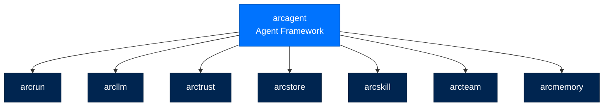
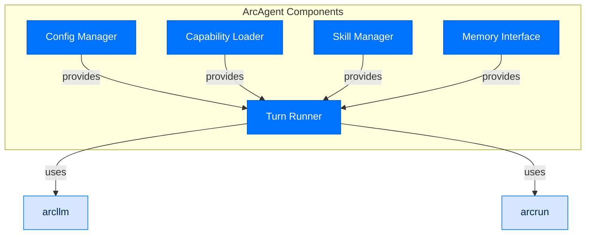
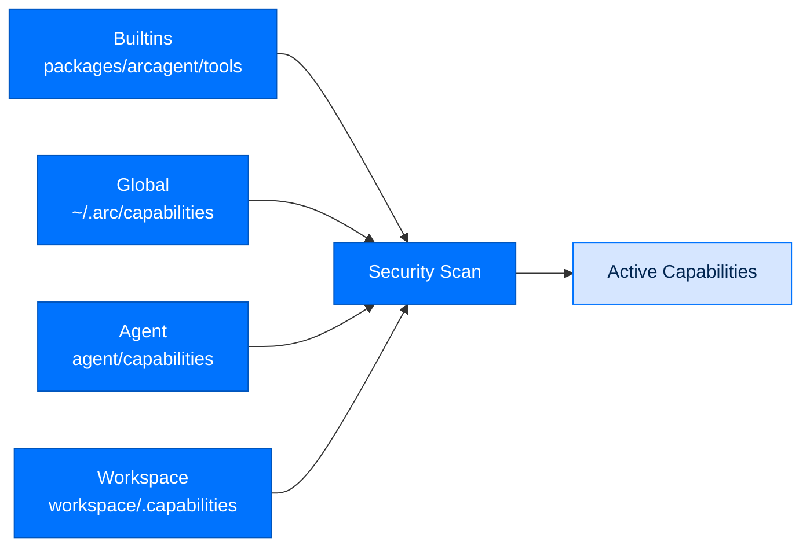
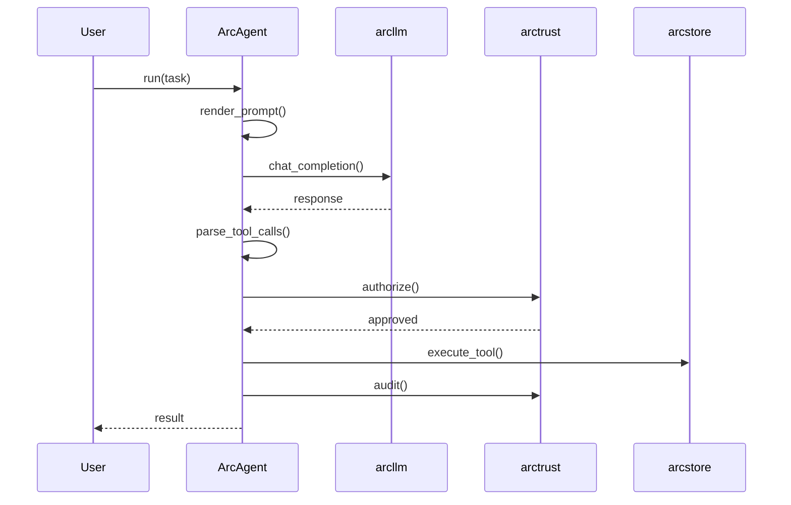

# arcagent - Agent Framework

> **Building with Arc**  ·  Build  ·  page 16 of 27  
> **For** Engineers writing code against Arc  
> [← arcmodel](arcmodel.md)  ·  [Docs home](../../README.md)  ·  [arcmemory →](arcmemory.md)

---

## Overview

`arcagent` is the main agent implementation, providing:
- **Capability system** - Tools and skills discovery
- **Configuration management** - Tier-based settings
- **Execution orchestration** - Coordinates the think-act loop
- **Identity integration** - DID-based agent identity



---

## Architecture

### Component Diagram



---

## Agent Configuration

### Full Configuration Reference

```toml
# arcagent.toml
[model]
provider = "anthropic"
id = "claude-sonnet-4-5-20250929"
max_turns = 50
temperature = 0.7

[identity]
name = "My Agent"
did = "did:key:z6Mk..."  # Loaded from keys/

[security]
tier = "enterprise"  # personal | enterprise | federal
require_fips = false

[security.validators]
auto_run_agent_code = false
require_operator_approval = true
max_file_size_mb = 100

[skills.hub]
enabled = true

[modules.skills]
adapter = "arcskill"
tier = "enterprise"

[modules.skills.improver]
change_bound.max_edits = 4
change_bound.max_lines_changed = 40
lifecycle.inactivity_window_days = 30
```

### Configuration Sections

| Section | Purpose |
|---------|---------|
| `[model]` | LLM provider and model selection |
| `[identity]` | Agent name and identity |
| `[security]` | Tier and validation settings |
| `[skills.hub]` | Skill hub enablement |
| `[modules]` | Module configuration |

---

## Capabilities System

### Loading Order



### Capability Sources

| Source | Trust Level | Override |
|--------|-------------|----------|
| Builtins | Trusted | No |
| Global (`~/.arc/capabilities`) | Trusted | Yes |
| Agent (`agent/capabilities`) | Trusted | Yes |
| Workspace (`workspace/.capabilities`) | Untrusted | Yes (but marked) |

### Capability Decorator

```python
from arcagent.tools._decorator import tool

@tool(
    name="read_file",
    description="Read a file from the workspace.",
    classification="read_only",  # read_only | network | write | dangerous
    version="1.0.0",
    timeout_seconds=30
)
def read_file(path: str) -> str:
    """Read file contents."""
    from pathlib import Path
    
    # Validate path
    workspace = Path.cwd() / "workspace"
    file_path = (workspace / path).resolve()
    
    if not file_path.is_relative_to(workspace):
        raise ValueError("Path outside workspace")
    
    return file_path.read_text()
```

### Classification Levels

| Classification | Meaning | Approval |
|----------------|---------|----------|
| `read_only` | Read-only operations | None |
| `network` | External network calls | Tier-dependent |
| `write` | File system writes | Tier-dependent |
| `dangerous` | System operations | Always |

---

## Skills System

### Skill Loading

```python
from arcagent.skilladapt import select_skill_adapter

# Load all available skills
skills = select_skill_adapter(
    agent_path=Path("my-agent"),
    config=config
)

for skill in skills:
    print(f"{skill.name}: {skill.description}")
```

### Skill Context Injection

```python
# When a skill is active, its context is injected into prompts
system_prompt = f"""
{config.system_prompt}

## Active Skill: {skill.name}
{skill.frontmatter.description}

### When to Use
{skill.frontmatter.when_to_use}

### Steps
{skill.frontmatter.steps}
"""
```

---

## Turn Execution

### Single Turn Flow



### Multi-Turn Chat

```python
from arcagent.core.agent import ArcAgent

agent = ArcAgent(config, config_path="my-agent/arcagent.toml")
await agent.startup()

# Multi-turn chat
reply = await agent.chat("Analyze the data")
print(reply.content)

reply = await agent.chat("Now summarize the key findings")
print(reply.content)

# Session persists across calls
print(f"Session ID: {agent.current_session_id}")
```

---

## Memory Integration

```python
from arcmemory import ArcMemoryBrain, build_brain

# Memory is injected into agent
memory = build_brain(agent.store)

# Index conversation
await memory.index(
    content="User asked about Q4 sales trends",
    metadata={"session_id": session_id, "turn": turn_num}
)

# Search memory in prompts
relevant = await memory.search("sales trends", k=5)
for hit in relevant:
    print(f"Memory: {hit.content}")
```

---

## Team Integration

```python
from arcteam import MessagingService, EntityRegistry

# Agent can send team messages
await messaging.send(
    sender=agent.did,
    to=["analyst-1", "reviewer-1"],
    body="Analysis complete, please review",
    msg_type="task_assigned",
    priority="high"
)
```

---

## API Reference

### Classes

```python
class ArcAgent:
    def __init__(self, config: AppConfig, config_path: Path = None): ...
    
    async def startup(self) -> None:
        """Load capabilities, initialize memory, verify identity."""
    
    async def run(self, task: str) -> Result:
        """Execute one-shot task, return result."""
    
    async def chat(self, message: str) -> Reply:
        """Multi-turn chat, return reply."""
    
    async def shutdown(self) -> None:
        """Clean shutdown, persist memory."""
    
    def capabilities(self) -> dict[str, Tool]:
        """Get available capabilities."""
    
    def skills(self) -> list[Skill]:
        """Get available skills."""

class AppConfig(TypedDict):
    model: dict
    identity: dict
    security: dict
    modules: dict

class Result(TypedDict):
    content: str
    turns: int
    cost_usd: float
    session_id: str
    tool_calls: list[ToolCall]

class Reply(TypedDict):
    content: str
    tool_calls: list[ToolCall]
```

### Functions

```python
def load_config(path: Path) -> AppConfig:
    """Load and validate agent configuration."""

def load_capabilities(agent_path: Path) -> dict[str, Tool]:
    """Load capabilities from all sources."""

def select_skill_adapter(agent_path: Path, config: AppConfig) -> list[Skill]:
    """Load available skills."""

def build_agent_prompt(
    task: str,
    context: list[dict],
    system: str,
    skills: list[Skill]
) -> list[dict]:
    """Build prompt messages for LLM."""
```

---

## CLI Commands

```bash
# Agent lifecycle
arc agent create NAME [--blueprint] [--model]
arc agent build NAME [--check]
arc agent chat NAME [--session ID]
arc agent run NAME TASK [--json]
arc agent serve NAME

# Inspection
arc agent status NAME
arc agent tools NAME
arc agent skills NAME
arc agent sessions NAME
```

---

## Next Steps

- [Implementation Guides](../implementation-guides.md) - Creating capabilities
- [API Reference](../../reference/api.md) - Complete API documentation
- [Package Index](../package-index.md) - All Arc packages

---

## Verified public surface

> Introspected from the installed package on the current commit. Every name
> below is importable exactly as shown; full signatures are in the
> [API reference](../../reference/api.md#arcagent).

### Classes

| Class | Purpose |
|---|---|
| `ArcAgentError` | Base error for all ArcAgent failures. |
| `ConfigError` | TOML parse failure or Pydantic validation error. |
| `ContextError` | Token budget exceeded, compaction failure, or prompt assembly error. |
| `IdentityError` | Key generation, signing, verification, or DID creation failure. |
| `ModuleBusError` | Handler failure, timeout, or module lifecycle error. |
| `ToolError` | Tool execution failure, timeout, or transport error. |
| `ToolVetoedError` | Tool execution was vetoed by a pre_tool handler. |

