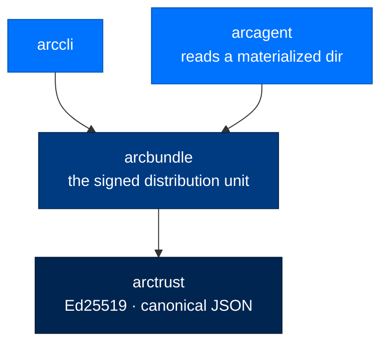

# arcbundle - Signed Module Bundles

> **Building with Arc**  ·  Build  ·  Packages
> **For** Engineers writing code against Arc
> [Docs home](../../README.md)  ·  [Package index](../package-index.md)  ·  [Writing modules →](../modules.md)

---

## In one breath

`arcbundle` is the on-disk **distribution unit** for Arc modules and extensions.
Each module ships as a separately signed `.arcbundle`, is **verified in full
before a single byte reaches disk**, is materialized read-only at the deployment
root outside every agent's tool fence, then copied per agent as tools and
skills.

It exists because packaging cannot express *absence*. `pip install arc-agent`
used to write every module to disk regardless of tier, so a federal enclave that
must not *run* the browser module still had its source sitting on the box.
Extras gate dependencies, never files, and no packaging flag installs a subset
of a wheel. `arcbundle` makes the wheel carry no module code at all — so the
`arc-agent` wheel is **byte-identical across every tier**, and what a deployment
can run is decided by which bundles were approved and installed (ADR-034). The
result an operator can point at: *absence is a directory listing, not a config
flag someone could flip.*



---

## Layer

`arcbundle` is a **leaf beside `arctrust`**. It imports `arctrust`
(Ed25519 sign/verify + `canonical_json`) and Pydantic — **nothing else, ever**.
It knows nothing of `arcagent`: the agent only ever *reads* an
already-materialized directory, so the nucleus stays ignorant of distribution
entirely, and a bundle can be **built or verified on a low-side box** that has no
agent stack present. That leaf property is the whole air-gapped-enclave story;
breaking it loses the ability to stage a bundle on a build host and carry it to a
SCIF on approved media.

The package version is `0.9.0` (SPEC-066).

---

## The bundle format

A bundle is a **directory**, conventionally named `<module>.arcbundle`, with
exactly three parts:

```text
browser.arcbundle/
├── manifest.json      # the signed description of the bundle
├── manifest.sig       # detached Ed25519 signature over the manifest's canonical bytes
└── files/             # the payload tree — every file the manifest declares
    ├── _runtime.py
    ├── capabilities.py
    ├── capabilities.py.arcsig
    ├── config.py
    ├── config.py.arcsig
    └── skills/
        └── search/
            ├── SKILL.md
            └── SKILL.md.arcsig
```

The on-disk names are constants in `arcbundle.verifier`: `MANIFEST_NAME`
(`manifest.json`), `SIGNATURE_NAME` (`manifest.sig`), and `PAYLOAD_DIR`
(`files`). This is the exact shape `verify_bundle` reads, so every bundle
`build_bundle` produces round-trips through the verifier rather than through a
second reader.

### The manifest (`arcbundle.manifest`)

`BundleManifest` is a frozen, `extra="forbid"` Pydantic model — and it is the
object that gets signed. Its validators are the first line of defense, firing at
construction so no caller can route around them:

| Field | Rule enforced in the model |
|---|---|
| `format_version` | Must equal `MANIFEST_FORMAT_VERSION` (`1`); a verifier refuses a shape it cannot interpret rather than guessing |
| `module` | `require_safe_name` — exactly one directory component (`^[A-Za-z0-9][A-Za-z0-9_-]*$`), because it becomes the directory `materialize` creates |
| `version` / `issuer` | Must not be blank |
| `files` | A list of `FileEntry`; a path declared **twice** is refused (`_paths_are_declared_once`), so no entry can silently shadow another |

Each `FileEntry` carries a relative `path` (guarded by `require_relative_path`)
and a lowercase-hex SHA-256 `sha256` (guarded to one canonical spelling, so
equality is a byte comparison).

`BundleManifest.canonical_bytes()` returns the deterministic bytes a signature
binds to. It delegates to `arctrust.canonical_json` — the *same* primitive
`arcrun` signs its backend manifests with — rather than a second encoder,
because a faithful-today second encoder is exactly the drift that later shows up
in the field as an unexplained signature rejection.

---

## Signing (`arcbundle.signer`)

`sign_manifest(manifest, *, private_key, issuer)` returns the 64-byte
**detached** Ed25519 signature over `manifest.canonical_bytes()`. Detached on
purpose: the signature never becomes part of what is signed, so there is no
envelope to strip and no self-referential field to reason about.

- The `private_key` may be a raw 32-byte Ed25519 seed **or** an `arctrust.Signer`
  — so Vault/HSM key custody, where the key never enters this process, works
  unchanged. A `Signer` configured for a non-Ed25519 algorithm is refused *here*
  rather than discovered at verify time.
- `issuer` must match `manifest.issuer`, otherwise the caller believes it signed
  something it did not (`BundleManifestError`).
- Release CI (with the Arc release key) and `--from-source` (with a locally
  generated dev key) go through this **one** function. The development path is
  the release path with a different key, never a shortcut.

---

## Verification (`arcbundle.verifier`)

`verify_bundle(root, *, tier, trusted_issuers, sink=None, actor_did=None)` runs
the whole fail-closed gate chain and returns a `VerifiedBundle`, or raises and
**writes nothing**. Two properties this module owes its callers:

- **No filesystem mutation on any path.** Verification reads; it never creates,
  writes, or removes. A refusal cannot leave a partial tree because nothing had
  been written to leave behind.
- **Fail closed.** The internal `_verify` has exactly **one `return`, on its last
  line**, reached only when every gate passed. Each gate catches precisely what
  it can provoke; an unexpected exception propagates as a denial, never mistaken
  for a pass.

The gate chain, in order:

1. **Read** `manifest.json` and the detached `manifest.sig` (a missing file is a
   refusal, not a crash).
2. **Parse** the manifest into the model — its own path and name guards fire
   here.
3. **Resolve** the issuer's public key *for this tier* (`_resolve_issuer_key`).
4. **Verify** the signature over the raw manifest bytes (`arctrust.verify`).
5. **Re-check** the raw bytes are the one canonical spelling — a re-encoded
   manifest cannot mean one thing to this parser and another to the next reader
   of the same signed blob.
6. **Hash** every declared payload file and compare with `hmac.compare_digest`;
   a symlinked directory that would land a read outside the payload root is
   refused.
7. **Sweep** for any file the manifest never declared and refuse it — an
   undeclared file is unverified code riding along with verified code, and a
   symlink counts as undeclared whatever it points at.

Only then does a `VerifiedBundle` exist — and **only a `VerifiedBundle` can be
materialized**. It carries the verified payload **bytes in memory**
(`VerifiedBundle.files`) plus the `issuer_key` that actually passed. The bytes
travel in memory so nothing is re-read from the bundle directory at write time;
that closes the window between "these bytes hashed correctly" and "these bytes
were written."

### Tiers and the dev issuer

`TIERS` is `{personal, enterprise, federal}`. The development issuer
`DEV_ISSUER` (`did:arc:dev`) — the key `--from-source` signs with — is trusted
at **personal tier only** (`DEV_ISSUER_TIERS`). That pin lives *in the verifier*,
not in a CLI flag, so **no invocation can widen it**: a dev-signed bundle cannot
verify on an enterprise or federal box no matter how it is called.

---

## Materialization — how a bundle reaches a deployment

`materialize(verified, dest_root, *, sink=None, actor_did=None)` writes a
verified bundle **atomically** and returns the module directory,
`dest_root / <module>`.

- **`dest_root` is the deployment module root**, `arctrust.module_root()` —
  `<arc_runtime>/modules` under `${ARC_CONFIG_DIR:-~/.arc}`. Modules **do not
  ship inside the wheel** (ADR-034); `arc install` materializes them from the
  signed bundles staged in `arctrust.bundles_dir()` (`<arc_state>/bundles`),
  which outlive the runtime they were materialized into.
- **Atomic write:** stage into a temporary sibling *inside* `dest_root` (same
  filesystem, so the publishing `os.replace` is a single atomic rename) →
  `fsync` each file and the staging dir (durability *before* the rename) →
  harden modes → displace any existing install to a backup → rename into place →
  restore the backup if the rename fails. A failure anywhere before the rename
  leaves the destination **byte-identical** to its prior state, and the staging
  tree is discarded in a `finally` so a refusal never litters.
- **Read-only, outside the tool fence:** files land `FILE_MODE` (`0444`) inside
  `DIR_MODE` (`0555`) directories — write for no one, including the operator
  account, so an accidental in-place edit fails loudly instead of silently
  forking a signed module. `remove(name, dest_root, …)` is the inverse and
  raises `BundleMaterializeError` if any part survives.

### Two destinations, two trust properties

| What | Where | Who may write it |
|---|---|---|
| Runtime (`_runtime.py` and its support) | `arctrust.module_root()` — `<arc_runtime>/modules/<name>/` | The operator install only — `0444` in `0555`, outside the tool fence |
| Capability surface (`capabilities.py`, `skills/`) | `<agent_dir>/capabilities/modules/<name>/` | The agent — which is why the loader adjudicates it as **verified** and requires a valid signature at every tier |

`copy_capabilities(module_dir, agent_dir, *, module)` copies only the second,
per agent, normalizing modes to `0644`/`0755` on the way (a read-only copy could
neither be removed nor signed in place). `_runtime.py` is **never copied to an
agent** — runtime is deployment state; putting it where an agent can write would
hand the agent its own execution path (ASI05/ASI06). `remove_capabilities`
returns `False` when there was nothing to remove — an agent that never enabled
the module is already in the desired state.

The `capability_dir` path rule — `<agent_dir>/capabilities/modules/<module>` —
puts every module copy under its own `modules/` namespace on purpose:
`<agent_dir>/capabilities/skills/` is already a conventional loader root, so a
module *named* `skills` copied straight under `capabilities/` once aimed the copy
at that root and blocked every reload. A namespace beats a reserved-name list the
next convention would outgrow.

---

## Building (`arcbundle.builder`)

`build_bundle(source_dir, *, module, version, private_key, issuer, out)` packages
one module folder into a signed bundle at `out`, and returns its path. It runs on
the low side — source tree, signing key, nothing else; no network, no agent
stack, no package index.

- Walks the source recursively, **never following symlinks**, skipping build
  artifacts (`__pycache__`, `.DS_Store`, `.pyc`, `.pyo`) — those differ between
  machines and would make the manifest hashes unreproducible.
- Refuses an `out` that already exists, so a build can never half-overwrite an
  earlier bundle. A source folder with no packageable files is refused too.
- Signs every **adjudicated artifact** into a detached `.arcsig` sidecar written
  *into* the payload, then writes the canonical manifest and its signature.

### Two signatures, one key

This is the core supply-chain idea and worth stating plainly:

- The **manifest** signature says *this bundle is what its issuer built*. It is
  checked once, at install, and the bundle directory can be deleted afterward.
- A per-file **`.arcsig`** sidecar beside each adjudicated artifact says *this
  file is what its issuer signed*. That is the question the capability loader
  asks on **every scan**, long after the bundle is gone: a `module:*` scan root
  is **verified, not trusted**, so an artifact whose bytes changed since it was
  signed **stops loading** — it is re-verified whenever its bytes change.

`_is_adjudicated_artifact` signs **every `.py`, not only `capabilities.py`**: the
loader imports each `.py` at a module root looking for decorated values, and an
import runs the file — signing the declared capability surface while leaving
`config.py` beside it unsigned would verify the door and not the wall. Every
`SKILL.md` too, because its text is injected straight into the agent's prompt
(LLM01 / ASI06). Because the sidecars ride inside the payload, they are covered
by the manifest signature *and* by the verifier's refusal of undeclared files —
a sidecar swapped in transit is a content-hash mismatch, never a new trust
anchor.

---

## Worked example

```python
from pathlib import Path

import arcbundle
import arctrust

issuer_key = arctrust.generate_keypair()    # Ed25519 KeyPair (.private_key / .public_key)

# 1. Low side: package a module folder into a signed bundle directory.
#    Every .py and every SKILL.md also gets a detached .arcsig sidecar,
#    written INTO the payload so the manifest signature covers it too.
arcbundle.build_bundle(
    Path("modules/browser"),
    module="browser",
    version="1.2.0",
    private_key=issuer_key.private_key,     # or an arctrust.Signer for HSM/Vault custody
    issuer="did:arc:acme",
    out=Path("browser.arcbundle"),
)

# 2. Install host: verify in full. Signature -> canonical form -> every declared
#    file hash -> no undeclared files. Any failure raises and writes nothing.
verified = arcbundle.verify_bundle(
    Path("browser.arcbundle"),
    tier="federal",
    trusted_issuers={"did:arc:acme": issuer_key.public_key},
    sink=audit_sink,
    actor_did=operator_did,
)

# 3. Write atomically from the bytes that were verified — never re-read from
#    the bundle dir. Lands 0444 inside 0555 at the deployment module root.
module_dir = arcbundle.materialize(verified, arctrust.module_root())

# 4. Per agent: copy just the tools + skills the agent may load.
#    _runtime.py is deliberately left behind.
arcbundle.copy_capabilities(module_dir, agent_dir, module="browser")
```

---

## Threat surface

`arcbundle` is a supply-chain control, so its guarantees map onto the OWASP LLM
and agentic surfaces directly:

| Threat | How `arcbundle` defends |
|---|---|
| **LLM03 Supply chain** / **ASI04 Agentic supply chain** | Every module is an Ed25519-signed bundle; the manifest signature proves provenance at install, the per-file `.arcsig` re-proves it on every capability scan. Unsigned or wrong-issuer code never loads |
| **Rollback / downgrade** | The manifest signs `version` and `issuer` into the bytes; `format_version` must equal the one shape this build reads, and the dev issuer is pinned to personal tier in the verifier so a dev-signed downgrade cannot verify on a hardened box |
| **Digest / content tampering** | Every declared file is SHA-256-checked with `hmac.compare_digest`; an altered or missing file is `BundleContentHashError`, and an **undeclared** file in the tree is refused — verified code cannot smuggle unverified code alongside it |
| **TOCTOU swap after verify** | The verified **bytes travel in memory** on `VerifiedBundle.files`; `materialize` never re-reads the bundle directory, so what was verified is what is written |
| **ASI05 Unexpected code execution** / **ASI06 memory poisoning** | Path and name guards (`require_safe_name` / `require_relative_path`) run where the value is constructed, so a manifest string can never reach a deployment-root join as an arbitrary-write primitive; module runtime lands read-only outside the tool fence |
| **Non-canonical / re-encoded manifest** | The raw bytes must be byte-identical to `canonical_bytes()`, so a signed blob cannot mean two things to two readers |
| **Audit truncation (NIST AU-5)** | The outcome events are emitted from inside the package at the decision point; a sink failure is swallowed and logged, never allowed to break the install |

---

## Failure modes

Refusals are **not** rooted in `ValueError` on purpose: Pydantic v2 converts a
`ValueError` raised inside a validator into a `ValidationError`, but the path and
name guards live *in the model*, so their refusal must survive that conversion
and reach the caller by its own name. Every error below means the same thing
operationally — **nothing was installed**:

| Exception | What it means |
|---|---|
| `BundleError` | Base of every refusal — catch this to exit non-zero on any of them |
| `BundleManifestError` | The manifest is malformed, non-canonical, or declares an unsafe path/name |
| `BundleSignatureError` | The manifest signature is absent, invalid, or from an issuer this tier does not trust |
| `BundleContentHashError` | A declared payload file is missing or altered, or the tree carries an undeclared file |
| `BundleMaterializeError` | An atomic write, a build, a per-agent copy, or an inverse remove did not complete |

---

## Audit

Five events are emitted from inside the package, each at the point the outcome is
decided, so every surface that installs a bundle records the same fact:
`module.bundle.verified`, `module.signature_invalid`,
`module.content_hash_mismatch`, `module.installed`, `module.removed`. Pass
`sink=` (and `actor_did=` where an operator is known) to `verify_bundle`,
`materialize`, and `remove`; sinks fan out from `arctrust.audit.emit` unchanged.
A refusal still names what it refused — a signature failure after the manifest
parsed reports module and issuer, which is what an auditor needs. Audit failures
are swallowed and logged, never allowed to break the install (NIST AU-5).

---

## Verified public surface

> Introspected from `arcbundle/__init__.py` on the current commit. Every name is
> importable as `arcbundle.<name>`.

**Build / verify / install:** `build_bundle`, `verify_bundle`, `VerifiedBundle`,
`materialize`, `remove`, `sign_manifest`.

**Manifest:** `BundleManifest`, `FileEntry`, `MANIFEST_FORMAT_VERSION`.

**Per-agent capabilities:** `copy_capabilities`, `remove_capabilities`,
`capability_dir`.

**Constants:** `TIERS`, `DEV_ISSUER`, `DEV_ISSUER_TIERS`, `MANIFEST_NAME`,
`SIGNATURE_NAME`, `PAYLOAD_DIR`, `FILE_MODE`, `DIR_MODE`, `CAPABILITIES_DIR`,
`CAPABILITY_FILE`, `SKILLS_DIR`, `SIGNATURE_SIDECAR_SUFFIX`.

**Errors:** `BundleError`, `BundleManifestError`, `BundleSignatureError`,
`BundleContentHashError`, `BundleMaterializeError`.

---

## Status

- **Version:** `0.9.0` (SPEC-066)
- **Runtime dependencies:** `arctrust` and Pydantic — no agent stack required to
  build or verify
- **Tests:** `packages/arcbundle/tests/` — manifest/signer/verifier gates, atomic
  materialize + remove, builder round-trip through the verifier, per-agent
  capability copy, path-guard and tier matrix, path-traversal security tests
- **Type check:** `mypy --strict` clean · **Lint:** `ruff check` clean

```bash
uv run --no-sync pytest packages/arcbundle/tests
```

---

## Next Steps

- [Writing modules](../modules.md) — authoring the module a bundle packages
- [arctrust](arctrust.md) — the Ed25519 sign/verify and `canonical_json`
  primitives this leaf is built on
- [arcagent](arcagent.md) — ADR-034, live module enable/disable, and the
  capability loader that adjudicates the per-agent copy
- [The Seam Model](../../concepts/seam-model.md) — why a module is a deletable
  part behind a port, and why its absence must be provable
