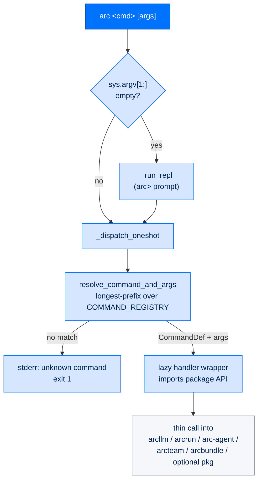

# arccli — the unified `arc` command line

> **Building with Arc**  ·  Build  ·  package spec
> **For** Engineers writing code against Arc, and operators driving it from a terminal
> [← arctui](arctui.md)  ·  [Docs home](../../README.md)  ·  [arcmas →](arcmas.md)

---

## In one breath

`arccli` is the single front door to the Arc stack — the `arc` command. It is a
**terminal / entry layer only**: it parses what you typed, resolves it to one
registered command, and calls a thin wrapper over a package API. It owns no
business logic. Every command either dispatches a one-shot (`arc <cmd> …`) and
exits, or — with no arguments — opens the interactive slash-command REPL
(`arc`).

Because it is the surface, its dependency arrows all point *down* into the
stack. It imports `arcllm`, `arcrun`, `arc-agent`, `arcbundle`, and `arcteam`
directly, and **soft-imports** `arcui` / `arcgateway` / `arctui` / `arcmemory`
so their subcommands appear only when those optional packages are installed.
Nothing in the nucleus depends on `arccli` — deleting it costs you the terminal,
nothing else. This is the same [seam discipline](../../concepts/seam-model.md)
the whole codebase runs on, applied to the CLI itself.

---

## Layer and packaging

| Fact | Value |
|---|---|
| Layer | **Surface** — top of the stack; imported by nothing in the nucleus |
| PyPI distribution | `arccmd` |
| Import package | `arccli` |
| Console script | `arc` → `arccli.main:main` |
| Console script | `arc-agent-worker` → `arccli.agent_worker:main` |
| Hard dependencies | `arcokf`, `click`, `arcllm`, `arcrun`, `arc-agent`, `arcbundle`, `arcteam`, `python-dotenv`, `prompt_toolkit`, `tomlkit` |
| Soft (optional) deps | `arcui`, `arcgateway`, `arctui`, `arcmemory` |

`click` is a hard dependency only because two delegated agent-module CLIs
(`policy`, `browser`) are Click groups (see [Agent module CLIs](#agent-module-clis)).
`prompt_toolkit` powers the REPL's line editing and completion; if it is
unavailable the REPL degrades to plain `input()`.

The second console script, `arc-agent-worker`, is **not** a user command. It is
the per-session subprocess entry point (`arccli.agent_worker:main`) that a
federal-tier `SubprocessExecutor` spawns for session isolation — its own event
loop, its own httpx pool, its own `ToolRegistry`, its own audit chain — speaking
JSON-lines over stdin/stdout. You never type it.

---

## The dispatch model

There is exactly **one** command surface and **one** resolver. Everything else
is a thin wrapper.

### `CommandDef` and `COMMAND_REGISTRY`

Every command is a frozen `CommandDef` dataclass in
`arccli.commands.registry`. Its fields:

| Field | Meaning |
|---|---|
| `name` | Canonical command name, no leading slash. May be multi-word (`"gateway pair approve"`). |
| `description` | One-line help text. |
| `category` | One of `Session`, `Configuration`, `Tools & Skills`, `Info`, `Exit` — used only by the help renderers. |
| `aliases` | Alternative names (`"?"` → `help`, `"exit"`/`"q"`/`"bye"` → `quit`). |
| `args_hint` | Short usage hint shown in help. |
| `cli_only` | True → must never appear in gateway/Telegram/Slack surfaces. |
| `gateway_only` | True → only meaningful on a running gateway. |
| `gateway_config_gate` | Config dotpath that must be truthy for the command to show in gateway help menus. |
| `handler` | The callable, attached at registration; excluded from equality/hash. |

`COMMAND_REGISTRY` is a static Python list of these — the authoritative,
single source of truth shared by `arccli`, `arcgateway`, and platform adapters
(SDD §3.11). Handlers are **lazy dispatch wrappers**: each `_xxx_handler` does
its `from arccli.commands.xxx import …` import *inside* the function, so the
registry module imports with zero dependency on any handler module. That keeps
cold start fast and breaks the circular-import risk between the surface and the
packages it drives.

### Resolution: longest-prefix matching

Two functions in `arccli.commands.registry` do all the resolving:

- `resolve_command(name)` — strips a leading `/` and whitespace, lowercases,
  then matches canonical names first and aliases second. Returns the
  `CommandDef` or `None`.
- `resolve_command_and_args(argv)` — the real entry point. Command names can be
  multi-word, so a naive `argv[0]` lookup would never match `gateway pair
  approve` unless the whole phrase were shell-quoted (which no real invocation
  does). Instead it tries the **longest word-count prefix of `argv` first**,
  walking down to a single word, and returns `(CommandDef, remaining_args)`.
  So `arc gateway pair approve CODE` resolves `gateway pair approve` and hands
  `["CODE"]` to the handler. Single-word commands are unaffected. Ambiguity is
  impossible by construction: the registry is a known static list, and the
  longest match is tried first, so a shorter name can never shadow a longer,
  more specific one.

### Two modes

`arccli.main:main` reads `sys.argv[1:]`:

- **Arguments present** → `_dispatch_oneshot(argv)`: resolve, then call
  `cmd.handler(args)` and exit. Unknown command → `arc: unknown command '…'`
  on stderr, exit 1. A registered command with no handler → exit 1.
  `KeyboardInterrupt` → exit 130. Any other exception is caught, printed as
  `arc: error in '<cmd>': <exc>`, exit 1.
- **No arguments** → `_run_repl()`: the interactive `arc>` prompt. If stdin is
  not a TTY (a pipe, CI, `arc < file`) it prints help and exits instead of
  entering a raw-mode prompt that would crash. Otherwise it builds a
  `prompt_toolkit` `WordCompleter` from the registry, prints the welcome banner
  grouped by category, and loops: each line is split into words and resolved by
  the same `resolve_command_and_args`, so multi-word names work identically in
  the REPL. `/quit` (or EOF / Ctrl-C) breaks the loop.



### Adding a command

One place, one shape. Append a `CommandDef` to `COMMAND_REGISTRY` with a lazy
`_xxx_handler` wrapper, and keep the real work in the package the wrapper calls
(e.g. `workflow` → the `arcteam` control plane). Do **not** invent a second
dispatcher. Multi-word names are fine — longest-prefix handles them for free.

The optional `tui` command is the model for a soft-import contribution:
`arccli` cannot hard-depend on `arctui` (arctui depends on arccli), so the very
bottom of `registry.py` runs `import arctui.entry` inside a `try/except
ImportError`. When arctui is installed, importing it appends its own
`CommandDef` to `COMMAND_REGISTRY`; when it is not, the CLI works unchanged
minus that one command.

---

## Command reference

Top-level commands registered in `COMMAND_REGISTRY`. "CLI-only" marks
`cli_only=True` — operator commands that must never surface in a chat gateway.

| Command | Category | CLI-only | What it does |
|---|---|:--:|---|
| `help` (`?`) | Info | ✓ | Show all commands and usage, rendered from the registry. |
| `version` (`ver`) | Info | | Print the `arccli` version. |
| `agent` | Session | | Agent lifecycle + inspection (see below). |
| `run` | Session | | Run prompts / code directly through `arcrun`, no agent directory. |
| `identity` | Configuration | ✓ | Manage the signing authority for direct `arcrun`/`arcllm` runs. |
| `init` | Configuration | ✓ | Interactive tier-based setup wizard. |
| `llm` | Configuration | | ArcLLM config, providers, models, single-turn calls. |
| `keys` | Configuration | ✓ | Provider API keys — list, set (hidden prompt), remove. |
| `runtime` | Configuration | ✓ | List installed framework versions; flip `current` (update / rollback). |
| `skill` | Tools & Skills | | Skill folders — list, create, validate, search, evals. |
| `ext` | Tools & Skills | | Capability files — list, create, install, validate, inspect, verify. |
| `connector` | Tools & Skills | ✓ | Connect an agent to an external system (see below). |
| `blueprint` | Tools & Skills | ✓ | Preset-config bootstrap — list, show, apply, verify, sign. |
| `user` | Tools & Skills | ✓ | Sign-in accounts — add, list, passwd, role, set, show, disable, enable, remove. |
| `team` | Tools & Skills | | Team messaging + registry — "Slack for agents". |
| `ui` | Tools & Skills | | ArcUI dashboard server — start, tail. |
| `store` | Tools & Skills | ✓ | Operational store lifecycle — init, status, verify, backfill, up. |
| `task` | Tools & Skills | ✓ | Mission-control tasks — create, list, edit, assign, move, complete, talk. |
| `memory` | Tools & Skills | ✓ | Agent memory maintenance — dedup, okf, status, backend health. |
| `module` | Tools & Skills | ✓ | Signed module bundles — list, install, remove, bundle. |
| `prompt` | Tools & Skills | ✓ | Editable signed system prompts — list, show, diff, edit, reset. |
| `approve` | Tools & Skills | ✓ | Mechanical operator approval for blocked agent actions. |
| `stop` | Tools & Skills | ✓ | Operator kill switch — stop a run by run id or session. |
| `trust` | Tools & Skills | ✓ | Operator approval for gated capabilities — list, approve, disapprove. |
| `capability-import` (`capability`) | Tools & Skills | ✓ | Review + operator-promote staged capability ZIPs. |
| `workflow` | Tools & Skills | ✓ | ArcFlow — list, show, create, edit, archive, run, cancel, sign, verify. |
| `install` | Session | ✓ | Install every module each agent's config enables, then verify. |
| `up` | Session | ✓ | Bring up the whole stack — preflight, modules, verify, start. |
| `gateway pair approve` | Configuration | ✓ | Approve a DM pairing code (gateway-only, gated on `security.require_pairing`). |
| `gateway pair list` | Configuration | ✓ | List pending DM pairing codes (gateway-only). |
| `gateway pair revoke` | Configuration | ✓ | Revoke a pending pairing code (gateway-only). |
| `gateway adapter list` | Configuration | ✓ | List official gateway adapter packages + install status (gateway-only). |
| `gateway adapter install` | Configuration | ✓ | Pip/uv-install `arcgateway-<name>` (telegram, slack, mattermost). |
| `gateway connect-telegram` | Configuration | ✓ | Guided: connect an agent to a Telegram bot (paste token + your user id). |
| `quit` (`exit`, `q`, `bye`) | Exit | ✓ | Exit the REPL / process. |
| `tui` | *(from arctui)* | | Launch the terminal UI — appears only when `arctui` is installed. |

> There is **no** top-level `arc config`, `arc security`, or `arc operator`
> command. Global config lives in TOML and per-agent `config` is a subcommand of
> `arc agent`; the security posture surfaces through `store`, `trust`,
> `approve`, `stop`, and `identity`; `arccli.commands.operator` is internal
> operator-key custody (used by `init` and direct `run` audit), not a command.

### `arc agent`

Dispatched by `arccli.commands.agent.agent_handler` through an argparse parser
(`_build_parser` + `_SUBCOMMAND_MAP` in `arccli.commands.agent._dispatch`).

| Subcommand | Purpose | Key options |
|---|---|---|
| `create <name>` | Scaffold a new agent directory (+ best-effort arcteam registration). | `--dir`, `--model` (default `anthropic/claude-sonnet-4-5-20250929`), `--tier` (default `personal`), `--with-code-exec`, `--no-register` |
| `build [path]` | Render the config surface / validate setup. | `--check` (validate only, write nothing), `--tier`, `--force` (regenerate, preserving DID + name) |
| `status [path]` | Config / workspace / tools / capabilities / sessions summary. | |
| `tools [path]` | List tools available to the agent. | `--json`, `--with-code-exec` |
| `skills [path]` | List discovered skill folders across scan roots. | |
| `extensions [path]` | List capability `.py` files across scan roots. | |
| `sessions [path]` | List session transcripts. | |
| `config [path]` | Show TOML config; or sync missing scaffold settings. | `--json`, `--sync`, `--team-root`, `--dry-run` |
| `memory [path]` | Straight database view of stored memory. | `--limit` (default 20), `--json` |
| `reload [path]` | Hot-reload extensions + skills. | |
| `strategies` | List available arcrun execution strategies. | |
| `events` | List all event types. | |
| `run <path> <task>` | One-shot non-interactive task execution. | `--model`, `--context`, `--json`, `--verbose`, `--max-turns`, `--session` |
| `serve [path]` | Long-running agent daemon. | `--verbose` |
| `chat [path]` | Interactive chat REPL, or one-shot with `--task`. | `--task`/`-t`, `--verbose`, `--model`, `--max-turns` (default 10), `--session-id` |

<a id="agent-module-clis"></a>
**Agent module CLIs.** `arc agent policy <path> …` and `arc agent browser
<path> …` are not argparse subcommands — they are Click groups owned by the
respective agent modules (`arcagent.modules.policy.cli`,
`arcagent.modules.browser.cli`), delegated by `_run_module_cli` before argparse
sees the args. The first positional after the module name is the agent
directory; the rest is forwarded to the Click group.

### `arc run`

Direct `arcrun` access with no agent directory (`arccli.commands.run`).

| Subcommand | Purpose |
|---|---|
| `version` | Show arcrun version + capabilities (`--json`). |
| `exec <code\|->` | Execute Python through arcrun's sandboxed executor (`--timeout`, `--max-output`, `--json`). |
| `task <prompt>` | Run one task (`--model`, `--max-turns`, `--strategy react\|code`, `--with-code-exec`, `--with-calc`, `--tool-timeout`, `--verbose`, `--show-events`, `--json`). |

### `arc llm`

ArcLLM surface (`arccli.commands.llm`): `version`, `config` (`--module`),
`providers`, `provider <name>`, `models` (`--provider`, `--tools`, `--vision`),
`prompt <text>` (`--provider`, `--model`, `--system`, `--max-tokens`),
`validate`. Every subcommand accepts `--json`.

### `arc keys`, `arc identity`

- `arc keys`: `list` (`--json`), `set <provider>`, `remove <provider>`. `set`
  reads the key through a hidden `getpass` prompt and stores it in the env file
  (`arcagent.default_env_file`); there is deliberately no `--value` flag.
- `arc identity`: `init` (create + store the signing authority, one time),
  `show` (print the current signing authority DID). Key dir defaults to
  `${ARC_CONFIG_DIR:-~/.arc}/identity`. This is the signing authority direct
  `arc run` / `arc llm` calls sign with, and the same authority that signs
  gateway pairing approvals.

### `arc connector`

Connect an agent to an external system (`arccli.commands.connector`). Every
subcommand accepts `--arc-dir`, `--data-dir`, and (where it prints data)
`--json`.

| Subcommand | Purpose |
|---|---|
| `available` | List the bundles this deployment can connect. |
| `add <bundle>` | Connect an account: prompt, probe, persist, grant (`--name`, agents). |
| `grant <instance>` | Let more agents use a connected account. |
| `revoke <instance>` | Take a connected account back from agents. |
| `auth <instance>` | Authorise an instance: hidden prompt, or the host command to run. |
| `authorize <instance>` | Sign in a connector whose own binary holds the credential. |
| `host-setup <extension>` | Install the host binaries a bundle pins, digest-verified. |
| `list` | List every connected account and who holds it. |
| `tools <instance>` | Show the verbs an instance offers. |
| `semantic <instance>` | Show / locate the editable table meanings of a connected datastore (`--path`). |
| `probe <instance>` | Prove an instance is reachable right now. |
| `doctor <instance>` | Report prerequisites, credentials, and reachability. |
| `approve <instance>` | Approve the tool contract an instance serves now. |
| `remove <instance>` | Disconnect an account, its credential, and its grants. |

### Other command groups

| Group | Subcommands (verified) |
|---|---|
| `skill` | `list`, `create <name>` (`--dir`), `validate <path>`, `search <query>`, `evals` (`--force`, `--yes`) |
| `ext` | `list`, `create <name>` (`--dir`), `install <path>`, `validate <path>`, plus inspect/verify (each with `--agent`) |
| `module` | `list` (`--agent`), `install` (`--agent`), `remove` (`--agent`), `bundle` |
| `blueprint` | `list`, `show <name>` (`--tier`, `--dir`), `apply <name>` (`--agent`, `--dir`, `--dry-run`), `verify <name>` (`--tier`, `--dir`), `sign <name>` (`--dir`) |
| `workflow` | `list` (`--all`), `show`, `create`, `edit` (`--expected-version`, `--reason`), `archive`, `unarchive`, `purge`, `run` (`--input`), `serve`, `cancel` (`--reason`), `sign`, `verify` |
| `team` | `status`, `config`, `init` (`--root`), `register`, `entities` (`--role`), `channels`, `memory-status`, `create`, `add-member`, `remove-member`, `create-channel`, `update-entity`, `send` |
| `task` | `create`, `list` (`--scope mine`, `--status`, `--owner`), `edit`, `assign`, `move`, `complete`, `talk` (most require `--actor`) |
| `ui` | `start` (`--port` 8420, `--host`, `--viewer-token`, `--operator-token`, `--max-agents`, `--show-tokens`), `tail` |
| `store` | `init`, `status` (`--json`), `verify` (`--pubkey`/`--did`), `backfill`, `up` |
| `memory` | `dedup`, `okf`, `status`, `backend` |
| `prompt` | `list` (`--agent`), `show` (`--stock`/`--agent`), `diff`, `edit` (`--file`/`--stdin`), `reset` |
| `trust` | `list` (`--agent`), `approve` (`--agent`), `disapprove` (`--agent`) |
| `capability-import` | `import <zip\|->`, `list`, `show <id> <path>`, `edit <id> <path> --content-file`, `promote <id>`, `revoke <id>` (each with `--agent`) |
| `user` | `add`, `list`, `passwd`, `role`, `set`, `show`, `disable`, `enable`, `remove` |
| `approve` | `list`, `<id>` (`--deny`) — single positional target, no subparser |
| `stop` | `list`, `<run_id>` (`--reason`), `--session <key>` |
| `runtime` | `list`, `activate <version>` |
| `install` | one-shot; `--team-root`. No flag combination installs-and-returns — use `up --check` to preflight only. |
| `up` | one-shot; `--check`, `--team-root`, `--port` 8420, `--host`. |
| `init` | one-shot wizard; `--provider`, `--quick`. |
| `gateway connect-telegram` | one-shot; `--agent` (required), `--user-id`, `--token`, `--env-file`. |

---

## Cross-cutting rules

### Secrets never touch config, logs, or an LLM

Bot tokens and API keys are read through **hidden prompts** (`getpass`, no
echo) and written **only** to the deployment env file at mode `0600`. This is
the rule in `arc keys set`, `arc connector auth`, `arc user`, and `arc gateway
connect-telegram` — the token lands in `~/.arc/arc.env` (or the KeyStore's env
file) as its provider-specific env var, `0600`, and is never placed in a TOML
config file, an audit log, an agent's chat, or anything sent to a model.
Commands that take a credential deliberately expose **no** `--value` / plaintext
flag (`--token` on `gateway connect-telegram` exists for scripting but omitting
it triggers the secure prompt). Which env var a provider needs is resolved by
`arcllm` at call time; nothing in the CLI reads the secret back.

### `--json` on data commands

Data-oriented subcommands accept `--json` for scripting (`arc llm models
--json`, `arc agent config --json`, `arc store status --json`, `arc task list
--json`, and so on). Prefer it whenever you are piping output into another tool.

### Soft-import rule

A missing optional package must **never** break the core CLI. `arcui`,
`arcgateway`, `arctui`, and `arcmemory` are imported lazily inside the handlers
or subcommands that need them (and `arctui` only via the guarded
`import arctui.entry` at the bottom of the registry). If one is absent, its
command is simply unavailable — no import error at startup, no crash on an
unrelated command.

### Handlers stay thin

`arccli` calls **into** packages; packages must never import `arccli` for core
logic (dependency inversion, enforced by architecture tests). A new user-facing
verb is a `CommandDef` plus a thin wrapper over a package API — business logic
belongs in the package, not the terminal layer.

---

## Threat surface

The CLI is an entry point into a federally-hardenable stack, so its own surface
is designed against the same [OWASP vectors](../../walkthrough/10-security-model.md)
the rest of Arc is.

- **Credential handling (LLM07 / ASI03).** Secrets enter through masked prompts
  and leave only to a `0600` env file. No `--value`/plaintext-key flag exists to
  land a secret in shell history, a config file, or a log. Nothing echoes a
  stored key back.
- **Operator authority is signed, not asserted (ASI09 / ASI03).** Operator
  actions that change what a deployment trusts — `trust`, `approve`, `blueprint
  sign`, `prompt edit`, `capability-import promote`, `gateway pair approve` —
  route through the shared operator-signed WORM audit chain
  (`arccli.commands._shared.audit_chain`) and, where signing is required, the
  operator's own Ed25519 authority. A pairing approval, for example, cannot
  succeed without an `arc identity init` authority to sign the challenge, at
  **every** tier — personal included, where the self-signed key is the trust
  anchor.
- **CLI-only commands stay off chat surfaces (ASI06 / ASI09).** `cli_only=True`
  keeps operator verbs out of Telegram/Slack menus; `gateway_only` +
  `gateway_config_gate` gate the pairing/adapter commands to a running gateway
  with the right config.
- **Fail-closed dispatch.** Unknown commands, missing handlers, and handler
  exceptions all exit non-zero with a clear stderr message rather than
  half-executing. A non-TTY REPL invocation prints help instead of entering a
  crash-prone raw-mode prompt.

---

## Failure modes and how to inspect

| Symptom | Likely cause | How to inspect |
|---|---|---|
| `arc: unknown command '<x>'` | Typo, or a multi-word name where the first word is not a registered prefix. | `arc help` for the full registry; remember longest-prefix resolves `arc gateway pair approve CODE` directly. |
| `arc: command '<x>' has no handler registered.` | A `CommandDef` was added without a handler — a bug. | Report it; check `COMMAND_REGISTRY`. |
| `arc: error in '<cmd>': <exc>` | The handler (i.e. the package call it wraps) raised. | Re-run with the subcommand's `--verbose`/`--json`; the message is the underlying exception. |
| `arc tui` missing | `arctui` is not installed. | Expected — install `arctui` to get the command back; the core CLI is unaffected. |
| `gateway pair …` errors about signing authority | No operator signing authority on the box. | `arc identity init`, then retry. |
| A gateway/ui/memory command errors on import | The optional package is absent. | Install the matching package (`arcui`, `arcgateway`, `arcmemory`). |
| REPL prints help and exits immediately | stdin is not a TTY (pipe / CI / `arc < file`). | Run interactively, or pass the command as `arc <cmd> …` one-shot. |

---

## Worked example

```bash
# 1. First-time setup (personal tier), then a signing authority for direct runs.
arc init --quick
arc identity init

# 2. Store a provider key — hidden prompt, never a flag; lands 0600 in the env file.
arc keys set anthropic
arc keys list --json

# 3. Scaffold, validate, and inspect an agent.
arc agent create researcher --tier personal
arc agent build researcher --check
arc agent tools researcher --json

# 4. Run a one-shot task against it.
arc agent run researcher "Summarise today's changelog" --json

# 5. Connect an external system and prove it is reachable.
arc connector available
arc connector add github --name work-gh --agents researcher
arc connector probe work-gh

# 6. Multi-word operator command — resolves by longest-prefix, no quoting.
arc gateway pair list
arc gateway pair approve A1B2C3D4

# 7. Or drop into the REPL for the same commands without the 'arc' prefix.
arc
arc> /help
arc> agent status researcher
arc> /quit
```

---

## See also

- [The Seam Model](../../concepts/seam-model.md) — the plug-in doctrine `arccli` follows as the surface layer
- [2. Architecture](../../walkthrough/02-architecture.md) — the layered package stack and the one-way dependency law
- [11. Extension Points](../../walkthrough/11-extension-points.md) — the ports the CLI's commands drive
- [Quickstart](../quickstart.md) — common end-to-end workflows
- [Package Index](../package-index.md) — every Arc package
