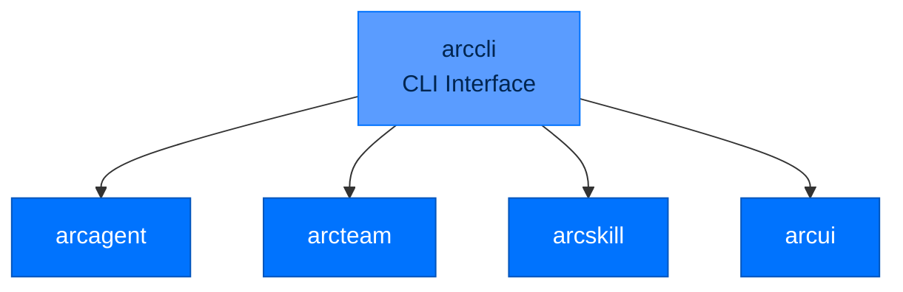

# arccli - Command-Line Interface

> **Building with Arc**  ·  Build  ·  page 26 of 27  
> **For** Engineers writing code against Arc  
> [← arctui](arctui.md)  ·  [Docs home](../../README.md)  ·  [arcmas →](arcmas.md)

---

## Overview

`arccli` provides the **command-line interface** for Arc operations:
- **Agent management** - Create, build, run, serve
- **Team coordination** - Register entities, send messages
- **Skill hub** - Discover, install, validate skills
- **UI integration** - Dashboard and streaming



---

## Command Categories

### Agent Commands

```bash
# Lifecycle
arc agent create NAME [--blueprint] [--model]
arc agent build NAME [--check]
arc agent chat NAME [--session ID]
arc agent run NAME TASK
arc agent serve NAME [--port PORT]

# Inspection
arc agent status NAME
arc agent tools NAME
arc agent skills NAME
arc agent sessions NAME
arc agent config NAME
```

### LLM Commands

```bash
arc llm providers              # List configured providers
arc llm models                 # List available models
arc llm models --tools         # Models with tool support
arc llm validate               # Test provider connectivity
arc llm estimate PRICE_PER_1M_TOKENS
```

### Skill Commands

```bash
arc skill list                   # List available skills
arc skill list --agent NAME      # Agent + global skills
arc skill search QUERY           # Search by name/description
arc skill create NAME            # Scaffold new skill
arc skill create NAME --dir PATH # Create in specific directory
arc skill validate PATH          # Validate skill structure
```

### Capability Commands

```bash
arc ext list                     # List capabilities
arc ext list --agent NAME        # Agent + global capabilities
arc ext create NAME              # Scaffold new capability
arc ext create NAME --dir PATH   # Create in specific directory
```

### Team Commands

```bash
arc team init                    # Initialize team
arc team init --root PATH       # Specify team root
arc team register ID             # Register entity
arc team register ID --name NAME --type TYPE --roles role1,role2
arc team status                  # Team status
arc team entities                # List entities
arc team entities --role ROLE    # Filter by role
arc team channels                # List channels
arc team memory-status           # Memory index status
```

### UI Commands

```bash
arc ui start                     # Start dashboard
arc ui start --show-tokens       # Show viewer tokens
arc ui start --port 8420         # Custom port
arc ui tail                      # Stream events
arc ui tail --viewer-token TOKEN   # Authenticate
arc ui tail --layer llm          # Filter by layer
```

### Blueprint Commands

```bash
arc blueprint list               # List blueprints
arc blueprint verify PATH        # Verify signature
arc blueprint publish PATH       # Sign and publish
```

### Security Commands

```bash
arc security status              # Security status
arc security validate            # Validate tier requirements
arc security audit               # Show audit trail
```

---

## Command Reference

### `arc agent create`

```bash
# Interactive
arc agent create my-agent

# With options
arc agent create my-agent \
    --blueprint researcher \
    --model anthropic/claude-sonnet-4-5-20250929 \
    --tier enterprise
```

### `arc agent build --check`

```bash
# Always use --check for validation
arc agent build my-agent --check

# Options
arc agent build my-agent --check --verbose
arc agent build my-agent --check --fix  # Auto-fix issues
```

### `arc agent chat`

```bash
# Interactive chat
arc agent chat my-agent

# Continue session
arc agent chat my-agent --session sess_123

# JSON output
arc agent chat my-agent --json

# With system prompt override
arc agent chat my-agent --system "You are a helpful assistant."
```

### `arc agent run`

```bash
# One-shot task
arc agent run my-agent "Analyze the data"

# Options
arc agent run my-agent "Task" --json      # JSON output
arc agent run my-agent "Task" --session ID  # Continue session
arc agent run my-agent "Task" --model MODEL # Override model
```

### `arc team register`

```bash
# Register agent
arc team register analyst-1 --name "Analyst" --type agent --roles analyst,reviewer

# Register user
arc team register alice --name "Alice" --type user

# Register with DID
arc team register agent-1 --name "Agent" --type agent --did did:key:z6Mk...
```

---

## Configuration

### Global Configuration

```bash
# Set global defaults
arc config set model.provider anthropic
arc config set security.tier enterprise
arc config set llm.default_model claude-sonnet-4-5-20250929

# View config
arc config list
arc config get model.provider
```

### Environment Variables

```bash
export ARC_MODEL_PROVIDER=anthropic
export ARC_SECURITY_TIER=enterprise
export ARC_LLM_DEFAULT_MODEL=claude-sonnet-4-5-20250929
```

---

## In-Chat Commands

When in `arc agent chat`:

| Command | Purpose |
|---------|---------|
| `/help` | Show available commands |
| `/tools` | List available tools |
| `/skills` | List available skills |
| `/sessions` | List past sessions |
| `/switch <id>` | Resume session |
| `/cost` | Show running cost |
| `/reload` | Reload capabilities |
| `/status` | Show agent status |
| `/quit` | Exit chat |

---

## API Reference

### Main Entry Point

```python
from arccli import main

if __name__ == "__main__":
    main()
```

### Command Modules

```python
# arccli.commands.agent
def create_agent(name: str, **kwargs) -> Path: ...
def build_agent(agent_path: Path, check: bool) -> bool: ...
def chat_agent(agent_path: Path, **kwargs) -> None: ...
def run_agent(agent_path: Path, task: str, **kwargs) -> Result: ...

# arccli.commands.team
def init_team(root: Path) -> None: ...
def register_entity(id: str, **kwargs) -> None: ...

# arccli.commands.ui
def start_dashboard(**kwargs) -> None: ...
def tail_events(**kwargs) -> None: ...
```

---

## Next Steps

- [Quickstart](../quickstart.md) - Common workflows
- [Package Index](../package-index.md) - All Arc packages

---

## Verified public surface

> Introspected from the installed package on the current commit. Every name
> below is importable exactly as shown; full signatures are in the
> [API reference](../../reference/api.md#arccli).

### Classes

| Class | Purpose |
|---|---|
| `PackageNotFoundError` | The package was not found. |

### Functions

| Function | Signature |
|---|---|
| `version` | `(distribution_name)` |

