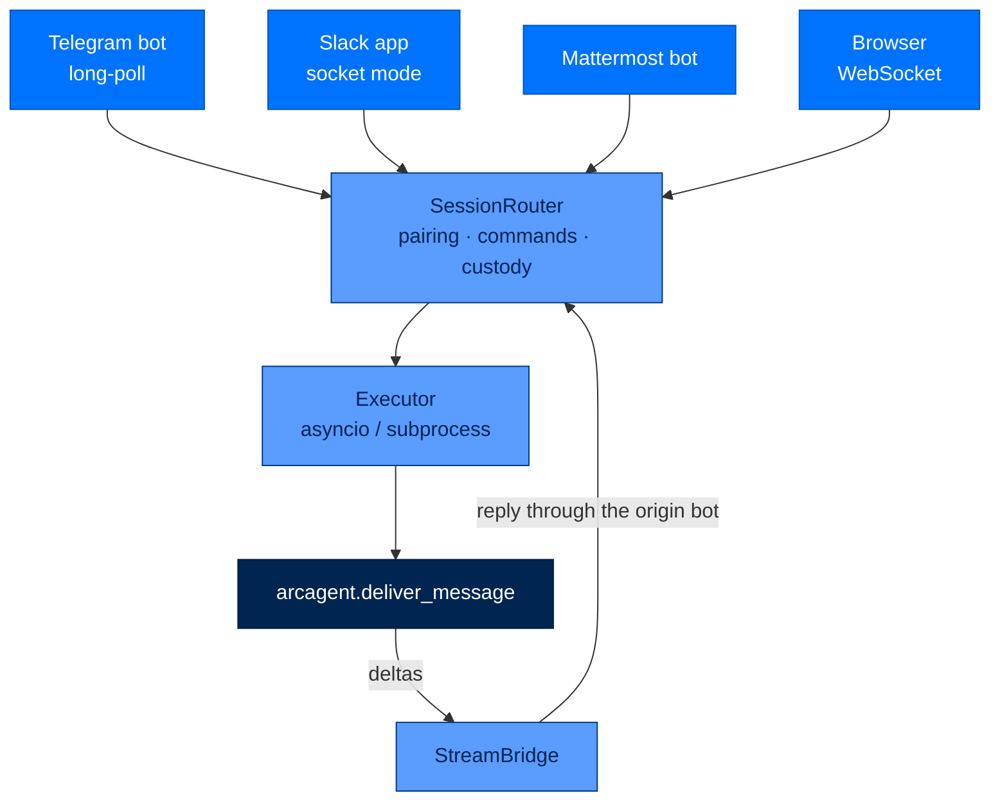
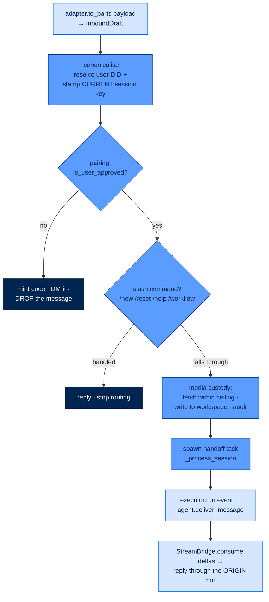

# arcgateway - Chat Platform Daemon

> **Building with Arc**  ·  Build  ·  page 20 of 27  
> **For** Engineers writing code against Arc  
> [← arcteam](arcteam.md)  ·  [Docs home](../../README.md)  ·  [arcgateway-telegram →](arcgateway-telegram.md)

---

## Overview

`arcgateway` is the long-running **surface / fleet service** that makes ArcAgents
reachable from chat platforms and the browser. It owns operator-approved pairing,
per-session task isolation, inbound media custody, cross-surface slash commands,
the SPEC-022 read-only data plane, and the SPEC-061 ArcFlow `RunnerHost`.

It **funnels every message into `arcagent`** and never bypasses the agent to call
the runtime or a model directly — `arcgateway → arcagent`, and `arcagent` owns
the loop (via ArcRun) and the LLM call (via ArcLLM). Platform SDKs
(`python-telegram-bot`, `slack-bolt`, `aiohttp`) are **optional extras** imported
lazily inside each adapter's `connect()` / `build()`, so a gateway without them
still starts.

Everything outside the gateway nucleus is a part behind a typed seam — the same
doctrine the whole stack rests on ([The Seam Model](../../concepts/seam-model.md)).
A new chat platform plugs into the **gateway port**: it is a folder, not a branch.



---

## Where it sits

`arcgateway` is a peer of `arcui` above `arcagent`. Both import `arcagent` and
its public facade only; neither reaches past it to `arcrun` or `arcllm`.

```text
arcllm          model adapter / router
   ^
arcrun          the agentic loop
   ^
arcagent        tools, skills, memory, delivery entry point
   ^        ^
arcgateway   arcui
```

- The gateway uses `import arcagent` and its public facade; it never couples to
  ArcAgent's internal layout.
- `arctrust` is the leaf every layer checks into: `arcgateway` imports it
  directly for identity, signing, audit, classification, and `arctrust.paths`
  (the one Arc-home resolver) — it is a **declared** dependency, not transitive.
- `arcstore` + `arcteam` are dependencies only for the ArcFlow `RunnerHost`
  (see [ArcFlow RunnerHost](#arcflow-the-runnerhost)).

Console script: `arcgateway` → `arcgateway.cli:main`. Package version `0.4.0`.

---

## The embedded gateway is canonical

There are two ways the gateway can exist in a process, and only one of them is a
real deployment.

**Embedded (canonical, every tier).** `arc ui start` composes the gateway
in-process via `arcgateway.bootstrap.build_for_embedded`. One process serves the
dashboard, the web-chat WebSocket, and every enabled remote adapter, wired to a
real `agent_factory` that resolves each `agent_did` against `team_root`:

```bash
arc ui start --team-root team --gateway-config ~/arc/config/gateway.toml
```

`build_for_embedded` returns an `EmbeddedGateway` named tuple — `executor`,
`session_router`, `web_adapter`, `stream_bridge`, the ensured message `broker`,
the tuple of remote `adapters`, and the `workflow_runner_host`. The arcui
lifespan stores it on `app.state` and owns `connect()` / `disconnect()` per
adapter plus `broker.aclose()` on shutdown.

**Standalone (`arcgateway start`) refuses to start, at every tier.** `cli.cmd_start`
resolves the config (so its message reflects real settings) and then exits
non-zero. It refuses because it has no working agent-execution path: on
personal/enterprise the `AsyncioExecutor` built there has no `agent_factory` (echo
stub only), and on federal the `SubprocessExecutor`'s `arc-agent-worker` ignores
the requested `agent_did` for config selection. `arcgateway stop` / `status` /
`setup` / `adapter` remain functional for managing a pre-existing daemon and for
writing a starter config.

`GatewayRunner` (the supervising daemon class) is still the real supervisor the
embedded path could use, and its `from_config` / `add_adapter` / `run` machinery
is fully implemented — the refusal is in the *CLI verb*, not the class.

---

## The inbound lifecycle

Every message walks the same path. `SessionRouter.handle` accepts either an
`InboundDraft` (from a remote adapter, artefacts still on the wire) or a finished
`InboundEvent` (from web / in-process callers), and the ordering of the stages is
load-bearing.



Why the order matters:

- **Canonicalisation first.** The router is the *sole owner* of session identity
  (REQ-304/310). Adapters supply platform identity only; a key composed anywhere
  else would be a second identity for the same `(agent, user)` pair and would skip
  the rotation generation. `_canonicalise` is synchronous (a SQLite read) so it
  runs before any `await`.
- **Pairing before everything.** No pairing → no agent response. An unapproved
  sender's message is intercepted (a code is minted and DM'd) and dropped, never
  routed.
- **Custody after pairing, deliberately.** Downloading an unpaired sender's file
  into the agent's workspace would let anyone who can find the bot put bytes on
  the operator's disk without ever being approved.

There is **no pre-await race guard in the router** (a common and dangerous place
to put one). The router holds no per-session queue: every surviving event gets
its own handoff task and is handed to the agent, which serialises the join-or-open
decision per session (`arcagent`'s `SessionRunCoordinator.delivery`). The router
keeps only `_in_flight` counts, for observability. `tests/integration/test_race_regression.py`
fires N concurrent messages at one session key and asserts exactly one run opens
with none lost.

---

## The adapter contract

The whole contract lives in `arcgateway.adapters.base` as the runtime-checkable
`BasePlatformAdapter` Protocol.

> **An adapter does three things and no more** (REQ-310):
>
> 1. **Lifecycle** — hold the platform connection: `connect()` / `disconnect()`.
> 2. **Translation** — turn one platform payload into ordered parts: `to_parts(payload)`.
> 3. **Delivery** — put parts back on the platform: `send(target, parts, *, reply_to=None)`.

Everything else — download, filename composition, size ceilings, audit, session
identity, pairing, and message splitting — belongs to the **gateway**, written
once. Four adapters each enforcing their own size cap would be four chances to
forget it. `tests/adapters/test_adapter_contract_surface.py` reads adapter sources
and fails on a second implementation of any gateway responsibility.

An adapter also carries two data attributes and one optional method:

- `name` — platform id (`"telegram"`), shared across bots of the same platform.
- `agent_did` — the DID this adapter's bot serves. The router keys its outbound
  registry by `(name, agent_did)`, so a reply returns through the **right** bot
  when several bots run one platform. `""` for a single adapter that fronts every
  agent (web).
- `send_with_id(target, message) -> str | None` — the default calls `send` and
  returns `None`; adapters whose platform returns message IDs override it so
  `StreamBridge` can edit a message in place while a turn streams.

The event-source loop (long-poll / socket / WebSocket) runs as an `asyncio.Task`
the adapter owns and `GatewayRunner`'s TaskGroup supervises, so a crash in one
adapter never kills its siblings (ASI08).

### A platform is a folder

`arcgateway.adapters.registry` is the registry, and **the filesystem is the
registry** (SPEC-065 COMP-003). A platform is `arcgateway/adapters/<name>/`
exporting a module-level `PLATFORM = AdapterSpec(...)`. `discover_adapters()`
scans the package with `pkgutil.iter_modules`, imports each candidate, and
collects its `PLATFORM`. Nothing in `registry.py` is edited to add a platform;
deleting the folder deletes the platform.

```python
# arcgateway/adapters/telegram/__init__.py
PLATFORM = AdapterSpec(
    name="telegram",
    requires=("python-telegram-bot",),   # declared, so a skip names what's missing
    supports=TelegramAdapter.supports,   # kinds/extras the gateway may use outbound
    build=build,                         # validates config, resolves token, constructs
)
```

An `AdapterSpec.build(ctx)` receives an `AdapterBuildContext` (`name`,
`raw_config`, `on_message`, `default_agent_did`, `tier`, `require_pairing`) and
either returns a `BasePlatformAdapter` or raises `AdapterUnavailableError` /
`ImportError` when its credentials or optional client are missing.

Discovery and build are resilient by design, because a folder in this package is
code executed at import time (REQ-309, ASI04):

| Condition | personal / enterprise | federal |
|---|---|---|
| Folder import raises | audited `gateway.adapter.blocked`, skipped | skipped (roster still loads) |
| Name fails `^[a-z][a-z0-9_]{0,31}$` | blocked (`deny`) | `AdapterUnavailableError` |
| Platform not in `OFFICIAL_ADAPTERS` | loads with `gateway.adapter.unverified` warning | `AdapterUnavailableError` (signed-allowlist) |
| Enabled block, no folder | `gateway.adapter.skipped`, continue | `AdapterUnavailableError` |
| `build()` raises (missing token/dep) | `gateway.adapter.skipped`, continue | `AdapterUnavailableError` |

`OFFICIAL_ADAPTERS = {"telegram", "slack", "mattermost", "web"}` is the load-time
control point where Sigstore/arctrust verification attaches. **`web` is the only
always-on core adapter** — an in-process browser adapter with no remote token.
`telegram` / `slack` / `mattermost` ship as extras:

```bash
pip install 'arcgateway[telegram]'   # installs python-telegram-bot
pip install 'arcgateway[slack]'      # slack-bolt, slack-sdk, aiohttp
pip install 'arcgateway[mattermost]' # aiohttp
```

`arc gateway adapter list` / `arc gateway adapter install <name>` drive
`arcgateway.adapters.install`, which installs the **extra** `arcgateway[<name>]`
(the folder is always present; only its client library is optional). A block may
also set `platform = "telegram"` under a distinct block name to run one telegram
bot **per agent** (`[platforms.sales_telegram]`, `[platforms.josh_telegram]`,
each with its own `token_env` + `agent_did`) — the fleet pattern.

> New chat platform → **new folder** under `adapters/`, exporting `PLATFORM`. Add
> its client to `[project.optional-dependencies]` and import it lazily in
> `build()`/`connect()`. Do not edit `registry.py`, and do not re-implement a
> gateway responsibility — the contract suite will fail you.

---

## Parts and media custody (SPEC-065)

### The part vocabulary

`arcgateway.parts` defines the normalised message shape (REQ-296): a payload of
any mix of text, images and files becomes **one envelope holding an ordered list
of typed parts**, in which text is a part like any other. Media is therefore never
a branch — a text-only message and a photo-plus-caption travel the same path.

- `TextPart(kind="text", text)` — words from the sender.
- `MediaPart(kind, mime, declared_name, ref)` — an artefact **already written to
  the agent workspace, named by reference**. `kind` is `"image" | "file" | "audio"`;
  `ref` is a workspace-relative path.
- `Part = TextPart | MediaPart` (pydantic discriminated union on `kind`).
- `flatten_text(parts)` — the words of a message for text-only surfaces; a media
  part contributes a readable line naming the artefact, never nothing.

Both models set `extra="forbid"`, so bytes cannot be smuggled in as an undeclared
field. **Media travels as a reference, never bytes** — that is what keeps a 5 MB
image out of the session JSONL, out of the queue, and out of the prompt.

### The media seam

An adapter knows only how to *fetch* an artefact off its own wire. It hands the
gateway a `PendingMedia(kind, mime, declared_name, fetch, size_bytes=None)` — a
callable plus untrusted metadata — and decides nothing else. The gateway takes
custody:

- **`MediaCustodian`** (`media_custody.py`) — for each `PendingMedia`, resolves
  the addressed agent's store, refuses early if the declared size is over the
  ceiling, calls `fetch(max_bytes)` within the ceiling, then stores. **Every
  outcome yields a part and every outcome is answered on the origin channel**
  (REQ-299): an artefact that cannot be kept still travels as a `TextPart` naming
  it, so a photo never vanishes silently. A `size_bytes` may refuse early but never
  *accept* — the bytes that actually arrive are re-measured by the store.
- **`MediaStore`** (`media_store.py`) — writes inbound artefacts into the agent
  workspace with **direct filesystem I/O**, never through the LLM-facing
  `write`/`bash`/`edit` tools (ADR-029: agent state stays home). The **sender
  names the file, the gateway composes the path** (REQ-298): `declared_name` is
  untrusted, contributes only a sanitised stem + extension, and the composed name
  is bounded to `NAME_MAX` (255) with the gateway's own fields laid down first.
  Containment is proven by resolved-ancestry, not string prefix. One
  `media.received` / `media.sent` audit event per artefact records custody — who,
  which channel, what kind, how big, where it landed — **never the bytes**.

Two ceilings, two typed errors: `MediaTooLargeError` (bytes measured and refused,
by the store) and `MediaTooLargeOnWireError` (the adapter stopped reading mid-fetch,
so the true size is deliberately unreported). The inbound ceiling is
`_MEDIA_CEILING_BYTES = 20 MiB` — the smallest cap the supported platforms impose
on a bot download (Telegram's `getFile`).

`MediaStore` also carries the harder-tier `store_stream(...)` / `claim(...)` path:
streamed quarantine → MIME sniff (magic bytes) → pluggable `AttachmentScanner`
verdict → content-addressed promotion → an `AttachmentManifest` bound to
`(owner_did, agent_did, session_key)` and a classification the workspace clearance
must dominate. `claim()` returns a `StoredMedia` only to that bound identity and
session. The web adapter uses this for browser uploads
(`bootstrap._build_web_adapter`'s `claim` closure); the federal tier refuses a
`CleanScanner` and requires a real injected scanner.

The store is resolved **per agent, never per router** (`media_store_for`): a
router serves the whole fleet, but a workspace belongs to exactly one agent, so a
single shared store would file one correspondent's files inside another agent's
readable workspace. An unresolvable DID yields `None`, and the message still
arrives with its artefacts named rather than stored.

---

## The inbound envelope

`arcgateway.executor.InboundEvent` is the pydantic envelope the gateway routes:

| Field | Meaning |
|---|---|
| `platform`, `chat_id`, `thread_id` | Source platform + conversation coordinates |
| `user_did` | Resolved cross-platform user identity (D-06) |
| `agent_did` | Target agent DID |
| `session_key` | **Empty until `SessionRouter` stamps it** — adapters must not set it |
| `message` | Flattened text projection of `parts` |
| `parts` | The canonical ordered `list[Part]` |
| `raw_payload` | Full platform payload, for audit/replay |

A model validator keeps `message` and `parts` two views of one message: `parts`
wins when present (it is the richer view), and a supplied-but-divergent `message`
is dropped with a warning rather than silently delivering a media message as its
caption alone.

`InboundDraft` (in `adapters.base`) is what a *remote* adapter hands up:
`platform`, `chat_id`, `user_did`, `agent_did`, ordered `parts` that may include
`PendingMedia`, `thread_id`, `raw_payload` — and deliberately **no `session_key`**,
because session identity is the router's alone.

---

## SessionRouter

`arcgateway.session.SessionRouter` routes each `(agent_did, user_did)` pair to one
session and streams the reply back. It re-exports `build_session_key` from
`arctrust.session_identity` — the gateway is the single owner of session identity
(D-678), and `arcui` / `arctui` / the web adapter all reach it through this module.

**Outbound registry keyed by `(platform, agent_did)`.** Keying by platform alone
collides when several bots share a platform (one Telegram bot per agent) — the
last registered would capture every reply, so a message to Olivia's bot would
answer through Sales'. `_resolve_outbound` matches the adapter's self-declared
`name` to `event.platform` and the `agent_did`, then falls back to the platform's
sole bot, then to the single registered channel (single-platform deployments and
tests). `register_adapter` is idempotent and also wires the adapter as a pairing
DM channel and a disconnect handler.

**Session rotation (`/new`).** `SessionEpochStore` (`session_epoch.py`) folds a
monotonic **generation** into the deterministic key. `current_session_key` reads
the current generation; `new_session` bumps it so the next message hashes to a
fresh, empty session log while the prior conversation stays on disk. The epoch DB
sits beside the pairing DB so "New session" survives a restart. `_canonicalise`
routes every entry point through the current key, so a surface that supplied a
stale key still lands on the pair's current session.

**Cross-surface slash commands.** `arcgateway.commands` is one registry
(`build_default_registry`) every adapter feeds through `handle()` — a leading
`/token` is dispatched here and never reaches the executor; an unknown token falls
through as ordinary text. Commands run *after* pairing (an unapproved user cannot
rotate sessions or enumerate commands). Built-ins: `/new` (alias `/reset`) and
`/help`. A `WorkflowProvider` turns each deployment workflow into a `/name` command
that runs deterministically, bypassing the LLM; built-ins always win a name clash.
`command_specs()` is the one list every `/` menu is built from (Telegram
`setMyCommands`, the Slack manifest, arcui autocomplete).

**Programmatic dispatch.** `dispatch_and_await(event, *, timeout=120.0)` is the
request/response companion to `handle()` for FastAPI hosts, CLI demos, and
inter-agent orchestrators: it runs the same pairing + identity resolution, then
yields the executor's `Delta` stream directly instead of delivering through an
adapter. Unpaired `user_did` raises `PermissionError`.

`SessionRouter` is **single-threaded asyncio, not thread-safe** — every state
mutation happens in synchronous code between awaits.

---

## The executor seam

`arcgateway.executor.Executor` is the Protocol all executors satisfy. `run(event)`
is a coroutine that **returns** an `AsyncIterator[Delta]` (it is *not* itself an
async generator), so a caller can `await executor.run(event)` to detect
auth/connection failure before consuming any delta.

- **`AsyncioExecutor`** (personal / enterprise) — runs ArcAgent in-process. Given
  an `agent_factory`, it hands each message to
  `agent.deliver_message(caller_did, message, session_key, reply_target,
  reply_label, on_handle, **parts)` and adapts the reply of any turn that opened
  into `Delta`s. It makes **no decision about the run** — no interrupt flag crosses
  this seam; the agent joins the in-flight turn or opens a new one (REQ-302/303/312).
  A `DeliveryStreamSource` agent streams via `stream_delivered_message(...)`
  instead. An empty-but-finished turn still emits "(the agent finished without a
  reply)" so the user is never left in the dark; an error fails closed with a
  redacted `[agent-error]` token (no paths/URLs/secrets — LLM02/LLM07). With no
  `agent_factory` it falls back to an echo stub (tests/dev only).
- **`SubprocessExecutor`** (federal) — spawns `arc-agent-worker`
  (`python -m arccli.agent_worker`) per session under `RLIMIT_AS` / `RLIMIT_CPU` /
  `RLIMIT_NOFILE` (`ResourceLimits`: 512 MB, 60 s, 256 fds), applied via
  `preexec_fn`. Lives in `executor_subprocess.py` and is re-exported from
  `executor` for import compatibility.
- **`NATSExecutor`** — multi-instance scaling, **deferred with no ETA**, split into
  `executor_nats.py` to keep the core within the LOC budget (ADR-004).

`Delta(kind, content, is_final, turn_id, sequence, status)` is the flat streaming
chunk: `kind` is `"token" | "tool_call" | "done"`; the terminal `Delta(kind="done",
is_final=True)` always closes a stream.

### StreamBridge

`arcgateway.stream_bridge.StreamBridge.consume(deltas, target, adapter)` bridges
the delta stream to platform delivery with flood control:

- Edit-capable adapters (Telegram/Slack/Mattermost expose `edit_message` +
  `send_with_id`) get a `...` placeholder that is edited in place, batched by
  `EDIT_TOKEN_BUFFER_SIZE` (20 tokens) or `EDIT_INTERVAL_MS` (1500 ms). After
  `FLOOD_STRIKE_LIMIT` (3) consecutive edit failures it **switches to
  final-send-only** for the turn (`gateway.message.flood_disabled`).
- Send-only transports that expose the optional `send_delta` capability (the web
  adapter's `dispatch_delta`, FastAPI SSE) get ordered token + terminal frames
  and real-time output (`buffer_threshold=0`).
- Long replies **split** via the shared `adapters._text.split_for_platform`
  (splitting is the gateway's), editing the placeholder to the first chunk and
  sending overflow as follow-ups — never truncating, never duplicating.

---

## Delivery and channel delivery

`arcgateway.delivery.DeliveryTarget` is the string-addressable outbound address:
`platform:chat_id` or `platform:chat_id:thread_id`, chosen to survive TOML config
round-trips (`deliver_to = "telegram:joshs-channel"`) and CLI args without quoting.

`arcgateway.channel_delivery.make_channel_deliver_fn(session_router, agent_did)`
bridges a scheduler's plain `deliver_to` string to a real send. The scheduler (in
`arcagent`) cannot import `DeliveryTarget` (`arcagent` must not depend on
`arcgateway`), so it records a string; this module parses it and calls
`SessionRouter.send`. `agent_did` binds one closure per agent so a fired schedule
or `notify_user` goes out through **that** agent's bot. A malformed target is
logged and dropped — delivery is fail-open, so a stale `deliver_to` never fails a
run. `SessionRouter.send(target, message, *, agent_did="")` is the agent-initiated
outbound path (fired schedules, proactive notifications) and no-ops with a warning
when no adapter serves the pair.

---

## Pairing

`arcgateway.pairing.PairingStore` is the SQLite-backed DM pairing store (default
`~/.arc/gateway/pairing.db`, `0600`). No pairing → no agent response, and **raw
user IDs are never persisted** — only `sha256(f"{platform}:{user_id}")[:16]`.

Policy constants: 8-char codes from `PAIRING_ALPHABET =
"ABCDEFGHJKLMNPQRSTUVWXYZ23456789"` (no ambiguous `0/O/1/I`); 1-hour TTL; max 3
pending per platform; 1 mint per user per 10 minutes; 5 failed approvals → 1-hour
platform lockout. `PairingStore` composes `PairingThrottle` (rate-limit + lockout)
and `PairingSignatureVerifier` (Ed25519). All SQLite runs via
`asyncio.to_thread()` so the event loop never blocks on disk.

**A signature is REQUIRED at every tier** — not federal-only. Tier selects the
*trust anchor stringency*, never whether the signature is checked (four-pillar
mandate, ASI07 inter-agent trust):

| Tier | Trust anchor | Missing signature |
|---|---|---|
| personal | self-signed operator key (tier-1 anchor) | refused |
| enterprise | operator key | warn audit, then refused |
| federal | key must chain to operator/issuer anchors; `approver_did` required before lookup | refused |

The operator signs the challenge `sha256(code + minted_at_iso)` —
`build_pairing_challenge(code, minted_at)` is exposed so `arc gateway pair sign`
produces identical bytes. A missing or invalid signature refuses the approval **and
records a failure against the platform lockout counter**, so bogus signatures
cannot probe for valid codes. Real methods: `async mint_code(platform,
platform_user_id) -> PairingCode`; `async verify_and_consume(code,
approver_did=None, signature=None, *, platform_hint=None) -> PairingCode | None`;
`async is_approved(...)`, `list_pending()`, `revoke(code)`, `cleanup_expired()`.

`arcgateway.session_pairing.PairingInterceptor` runs the gate before routing.
`is_user_approved` checks the in-memory allowlist first (no round-trip), then a
**live** `pairing_approvals` SQLite lookup — so `arc gateway pair approve`, run by
a separate CLI process against the same DB, takes effect on the gateway's very next
message with no in-process state to refresh. `web` is a **trusted platform**
exempt from DM pairing: every `/ws/chat` connection is already gated by arcui's
viewer/operator token, so a second pairing dance would lock the operator out of
their own dashboard. `handle_unpaired_user` mints a code and DMs it (or the
rate-limit / platform-full / locked message) through the platform adapter.

`GatewayRunner` schedules `cleanup_expired()` every 600 s inside its TaskGroup when
a `PairingStore` is set.

---

## Binding a bot to an agent

`arcgateway.connect.connect_telegram(...)` is the shared core behind
`arc gateway connect-telegram` (arccli) and the arcui settings panel. It:

- validates the token against `^\d{5,}:[A-Za-z0-9_-]{30,}$` (nothing is written on
  a bad token),
- stores it in the gateway's **env file** under a per-agent var
  `TELEGRAM_BOT_TOKEN_<SLUG>` at `0600` — **never** in `gateway.toml` and **never**
  through the LLM (LLM07),
- writes a per-agent `[platforms.<slug>_telegram]` block with `platform =
  "telegram"`, the `token_env`, the bound `agent_did`, and `allowed_user_ids`, and
  turns `require_pairing` on.

This lives in `arcgateway` (not `arccli`) because it mutates gateway config, and
`arcui` — which also needs it — depends on `arcgateway`, never on `arccli`. A bot
token must never be echoed, logged, or routed through an agent chat.

---

## SPEC-022 data plane

The gateway is also the **single read-only chokepoint** for `team/<agent>/` files
consumed by arcui's fleet and file views. **arcui must not touch `team/`
directly** — it goes through these modules.

- **`fs_reader`** — the sole read API: `read_file(...)` and `list_tree(...)`, and
  **nothing that writes** (a structural test forbids adding a write helper). Path
  traversal is blocked at one chokepoint by `resolve()` + ancestry check (symlink
  escapes caught); reads are capped at `MAX_READ_BYTES` (1 MiB); trees are depth-
  and entry-capped (10 / 5000) and hide dotfiles. Text/JSON return inline; other
  types return base64 with a real MIME. Every read emits `gateway.fs.read` /
  `gateway.fs.tree` (NIST AU-2). `scope` accepts `"agent" | "team" | "shared"`;
  only `"agent"` is wired (the others raise `NotImplementedError` — forward-compat).
- **`team_roster`** — `list_team(team_root, online_ids)` discovers agents by the
  presence of `arcagent.toml` (both `arc agent create <name>` bare dirs and the
  legacy `<name>_agent/` layout), merges each agent's own TOML + `[ui]` block with
  live online status, and returns `RosterEntry` rows including the absolute
  `workspace_path`. One bad TOML is logged and skipped — the fleet stays
  observable.
- **`fs_watcher`** — `WatcherManager` with ref-counted lazy lifecycle (no idle CPU
  when nobody's watching, a `max_watchers` cap against fork explosion). It maps
  file changes to domain events (`config:updated`, `policy:bullets_updated`,
  `session:changed`, `traces:updated`, …) via `_WATCH_MAP`, reparsing `policy.md`
  once for bullet payloads. `watchfiles` (inotify/kqueue) is preferred with a
  2-second mtime-poll fallback. Every change emits `gateway.fs.changed`.

---

## ArcFlow: the RunnerHost

`arcgateway.workflow_runner_host` hosts exactly one ArcFlow `WorkflowRunner` per
process (SPEC-061 COMP-009). It is constructed inside `build_for_embedded` — the
**agent side of the fleet service** — and **never from arcui's lifespan**. That
placement is the whole point (REQ-230): **workflow execution must not require the
dashboard process to be running.** The module has zero import of `arcui`, enforced
by `tests/unit/test_workflow_runner_host.py`.

- `start_runner_host(*, tier, runner_factory=None) -> RunnerHost | None` builds and
  starts the singleton, then **publishes the runner to the agent tool surface**
  via `arcagent.set_workflow_runner(runner)` — without which the gateway would host
  a live runner while the agent's `workflow_run` tool reports "no runner" and
  nothing errors (the silent-seam failure this code exists to prevent).
- It is **fail-open**: a checkout without arcteam's engine, or an unreachable
  ArcStore, logs a warning and returns `None` so the rest of the gateway still
  boots.
- `RunnerHost.start` refuses a second instance in the same process
  (`RunnerAlreadyActiveError`, REQ-231) — two runners must never advance the same
  frontier. Cross-process correctness is ArcStore's fenced lease; `_active` is only
  local bookkeeping.
- The real runner is resolved lazily by name (`importlib`) against the
  `WorkflowRunnerProtocol` (`run_forever` / `aclose`), resolves node owners and a
  narrator on the **same NATS bus the agents use**, and holds no model / makes no
  LLM call.

Cron `[trigger]` blocks on a workflow materialise an owner-scoped schedule; the
runner ticks the frontier and narrates to team channels.

---

## Configuration

`arcgateway.config.GatewayConfig` (pydantic) loads `gateway.toml`. Token *values*
are always read from environment variables at runtime — the file stores only the
env-var **name**, never the secret (NIST SC-28 / CMMC MP.3).

```toml
[gateway]
tier = "personal"                       # personal | enterprise | federal
agent_did = "did:arc:agent:default"     # gateway-wide default agent
# runtime_dir = "~/.arc/gateway/run"

[security]
require_pairing = false                 # DM pairing gate (web is always exempt)

[platforms.web]
enabled = true                          # the only always-on core adapter
# agent_did = "..."                     # overrides [gateway].agent_did for web
# max_connections = 50                  # 1..10000
# idle_timeout_seconds = 3600           # 60..86400
# max_frame_bytes = 65536               # 1024..1048576

[platforms.telegram]
enabled = true
token_env = "TELEGRAM_BOT_TOKEN"
allowed_user_ids = [123456789]
# agent_did = "..."                     # per-bot override (one bot per agent)

[platforms.slack]
enabled = true
bot_token_env = "SLACK_BOT_TOKEN"
app_token_env = "SLACK_APP_TOKEN"
allowed_user_ids = ["UABC123"]

[platforms.mattermost]
enabled = true
server_url = "https://mattermost.internal.example.gov"
bot_token_env = "MM_BOT_TOKEN"
allowed_channel_ids = ["channelid1"]

[pairing]
# db_path = "~/.arc/gateway/pairing.db"
```

`web` is the only platform the config core models (`WebPlatformConfig`); every
other `[platforms.<name>]` block is captured generically (`extra="allow"`) and
handed as a raw dict to its adapter plugin, which owns its own schema.
`effective_agent_did(platform)` resolves a per-platform `agent_did` override over
the gateway default. `remote_blocks()` yields every non-web block for the registry.

`arcgateway setup` writes a starter `gateway.toml` (personal tier, `0600`).

---

## CLI commands

```bash
# Canonical: embedded gateway (every tier)
arc ui start --team-root team --gateway-config ~/arc/config/gateway.toml

# Bind one Telegram bot to one agent (token → env 0600, never config)
arc gateway connect-telegram ...

# Pairing (approval carries an Ed25519 signature at every tier)
arc gateway pair list                # list pending codes
arc gateway pair sign <CODE>         # produce the operator signature
arc gateway pair approve <CODE>      # approve + consume a pending code
arc gateway pair revoke <CODE>       # revoke a code

# Adapter extras (installs arcgateway[<name>])
arc gateway adapter list
arc gateway adapter install telegram [--upgrade]

# Standalone daemon management (start REFUSES at every tier)
arcgateway start                     # exits non-zero — use the embedded path
arcgateway stop [--runtime-dir DIR]  # SIGTERM the PID in gateway.pid
arcgateway status [--runtime-dir DIR]
arcgateway setup                     # write a starter gateway.toml
```

`GatewayRunner` writes `gateway.pid` atomically at startup (refusing to start over
a live PID — `GatewayAlreadyRunning`) and a `.clean_shutdown` marker on graceful
exit, so a supervisor can tell a clean stop from a crash.

---

## Public API surface

Exactly what `import arcgateway` exports (`__all__`):

| Symbol | Purpose |
|---|---|
| `GatewayRunner` | Supervises adapters, routes to the `SessionRouter` |
| `SessionRouter` | Per-`(agent, user)` routing, custody, commands, rotation |
| `InboundEvent` | Normalised inbound envelope (`parts` + flattened `message`) |
| `Delta` | One streamed executor chunk |
| `Executor` / `AsyncioExecutor` | Executor Protocol + in-process implementation |
| `DeliveryTarget` | Parsed `platform:chat_id[:thread_id]` address |
| `TextPart` / `MediaPart` / `Part` | The part vocabulary |
| `flatten_text` | Parts → the text projection |
| `MediaStore` / `StoredMedia` / `MediaTooLargeError` | Workspace custody + audit |
| `AttachmentManifest` / `AttachmentClaimError` / `AttachmentQuotaError` / `AttachmentValidationError` | Streamed-upload custody |
| `GatewayApprovalNotificationSink` | Delivers operator approval prompts to a channel |
| `build_session_key` | Re-exported from `arctrust.session_identity` |

`SubprocessExecutor` / `ResourceLimits` are importable from `arcgateway.executor`;
`build_for_embedded` / `EmbeddedGateway` from `arcgateway.bootstrap`;
`start_runner_host` / `RunnerHost` from `arcgateway.workflow_runner_host`; the
adapter contract (`BasePlatformAdapter`, `AdapterSpec`, `InboundDraft`,
`PendingMedia`, `discover_adapters`, `build_adapters`) from `arcgateway.adapters`.

---

## Tier matrix

Tier is **stringency metadata, not a gate** (ADR-019). Every tier identifies,
signs, authorizes, and audits.

| Aspect | personal | enterprise | federal |
|---|---|---|---|
| Executor | `AsyncioExecutor` | `AsyncioExecutor` | `SubprocessExecutor` (per-session subprocess) |
| Subprocess limits | n/a | n/a | `RLIMIT_AS` 512 MB, `RLIMIT_CPU` 60 s, `RLIMIT_NOFILE` 256 |
| Pairing signature | required, self-signed anchor | required, warn-then-refuse on missing | required, chains to operator/issuer anchors |
| Unofficial adapter | loads with `unverified` audit | loads with `unverified` audit | blocked (`AdapterUnavailableError`) |
| Enabled adapter unbuildable | skipped, reason audited | skipped, reason audited | **fails closed** — refuses to start |
| Attachment scanner | `CleanScanner` ok | `CleanScanner` ok | real scanner **required**; `CleanScanner` rejected |

---

## Threat surface

Design every boundary here for an attacker already inside (see
[The Security Model](../../walkthrough/10-security-model.md) and
[the threat surface](../../reference/security.md)).

| Threat | Mitigation in this package |
|---|---|
| **LLM07 System-prompt / secret leakage** | Bot tokens live in the env file (`0600`) under a per-agent var — never in config, never through the LLM (`connect.py`); agent errors reach the channel as a redacted `[agent-error]`, detail in logs only |
| **LLM05 Improper output handling** | `declared_name` is untrusted; the gateway composes the path, sanitises the stem, and proves inbox containment by resolved ancestry (`media_store.py`) |
| **LLM10 Unbounded consumption** | 20 MiB media ceiling with mid-fetch abort; web `max_frame_bytes` / `max_connections` caps; bounded per-socket queues with drop-oldest |
| **ASI04 Agentic supply chain** | Adapter names regex-validated; a folder that fails import is audited and skipped; `OFFICIAL_ADAPTERS` is the federal signed-allowlist point |
| **ASI07 Insecure inter-agent comms** | Ed25519 signature **required at every tier** on pairing approval; failures counted toward lockout |
| **ASI08 Cascading failures** | One `asyncio.Task` per adapter under a TaskGroup; a crash marks the adapter failed for the reconnect watcher, siblings survive |
| **ASI09 Human-agent trust** | `GatewayApprovalNotificationSink` labels approval prompts; agents never impersonate; pairing keeps a human operator in the loop |
| **Media custody boundary** | Custody runs **after** pairing, so an unpaired sender can never write bytes to the operator's disk; artefacts are references, never inline bytes |
| **Federal platform blocking** | Unofficial platforms and unbuildable enabled adapters are hard startup errors at federal — no silently-served subset |
| **Path traversal / data-plane read** | `fs_reader` is the sole, write-free chokepoint; `resolve()` + ancestry blocks `..` and symlink escape; size/depth/entry caps |
| **PII in audit** | User IDs are stored and logged only as `sha256(...)[:16]`; codes are logged as `code_id`, never raw |

### Audit events

`arcgateway.audit.emit_event` is the single arctrust emission point (ADR-019;
`configure_sink()` at startup, `NullSink` by default), and `telemetry.emit_audit`
dual-logs to stdlib loggers. Real event families:

- Runner: `gateway.runner.start` / `gateway.runner.stop`
- Adapter: `gateway.adapter.{loaded,skipped,blocked,unverified,connect,disconnect,fail,register,unregister,auth_rejected,shared_default_agent_did}`
- Pairing: `gateway.pairing.{minted,approved,denied,expired,revoked,locked_out,signature_verified,signature_invalid}`
- Session / commands: `gateway.session.{rotated,executor_choice}`, `gateway.command.{dispatched,workflow}`
- Messages: `gateway.message.{received,sent,delivered,dropped,final_sent,flood_disabled,turn_summary,deduped}`
- Media: `media.received`, `media.sent`, `attachment.{validated,received,claimed,rejected}`
- Data plane: `gateway.fs.{read,tree,changed}`; web replay: `gateway.replay.{evicted,dropped_backpressure,dropped_dead}`

---

## Failure modes and how to inspect

| Symptom | Likely cause | Where to look |
|---|---|---|
| Bot receives messages, agent never replies | user not paired | `gateway.pairing.minted` in the audit trail; `arc gateway pair list`; DM the user got |
| `arcgateway start` exits non-zero | by design — no standalone agent path | use `arc ui start --team-root --gateway-config` |
| Reply goes to the wrong bot | outbound key collision | confirm each `[platforms.*]` block has its own `agent_did`; `gateway.adapter.shared_default_agent_did` warning |
| Photo arrives but "nothing happens" | adapter filtered non-text, or no workspace | the sender should get a "named only" reply; check `media.received` vs a custody warning; never register `MessageHandler(filters.TEXT)` |
| Enabled platform silently absent | missing extra/token (personal/ent) | `gateway.adapter.skipped` names the missing `requires`; `arc gateway adapter list` |
| Federal gateway refuses to start | unofficial or unbuildable enabled adapter | `AdapterUnavailableError` in logs — fix the block or install the extra |
| Workflows never progress | arcteam engine absent, or runner not published | `start_runner_host` warning; `_publish_to_agent_tools` WARNING = `workflow_run` sees no runner |
| Streaming stops mid-reply on Telegram | 3-strike edit flood fallback | `gateway.message.flood_disabled` — the final message still sends |
| Duplicate gateway on one token | second process long-polling | Telegram "terminated by other getUpdates"; PID-file `GatewayAlreadyRunning` |

---

## A worked example: a photo from Telegram

1. A paired user sends a captioned photo to their agent's Telegram bot. The
   adapter's `to_parts` returns `[TextPart("caption"), PendingMedia(kind="image",
   fetch=…)]` inside an `InboundDraft` — **no bytes downloaded yet**.
2. `SessionRouter.handle` receives the draft, `_canonicalise` resolves the DID and
   stamps the current session key. `PairingInterceptor.is_user_approved` returns
   `True` (allowlist or live SQLite).
3. No slash command matches, so `MediaCustodian.take` runs: the caption `TextPart`
   passes through; the `PendingMedia` is fetched within the 20 MiB ceiling and
   `MediaStore.store` writes it to `<workspace>/inbox/<date>/…` with direct I/O,
   emitting `media.received`. The custodian returns a `MediaPart` whose `ref`
   points into the workspace.
4. The router spawns a handoff task; `AsyncioExecutor.run` calls
   `agent.deliver_message(...)` with `parts=[caption, image-ref]`. The agent
   serialises the turn, materialises the artefact only for the provider call that
   needs it (COMP-009), and streams `Delta`s back.
5. `StreamBridge.consume` delivers the reply, editing the placeholder in place, and
   `_resolve_outbound` routes it back through **the same bot** the message hit —
   Telegram answers on Telegram.

---

## See also

- [The Seam Model](../../concepts/seam-model.md) — the gateway port among all the others
- [11. Extension Points](../../walkthrough/11-extension-points.md) — the full catalog of real ports
- [Implementation guides](../implementation-guides.md) — writing a custom adapter
- [Deployment overview](../../runbooks/deploy/overview.md) — production deployment
- [Security model](../../reference/security.md) — the threat surface in full
- [arcgateway-telegram](arcgateway-telegram.md) · [arcgateway-slack](arcgateway-slack.md) · [arcgateway-mattermost](arcgateway-mattermost.md) — per-platform adapters
- [API reference](../../reference/api.md#arcgateway) — introspected public surface
