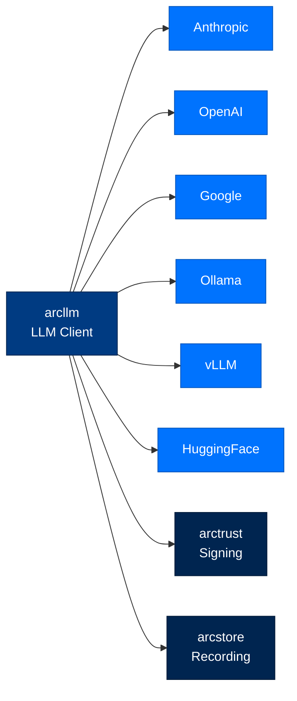
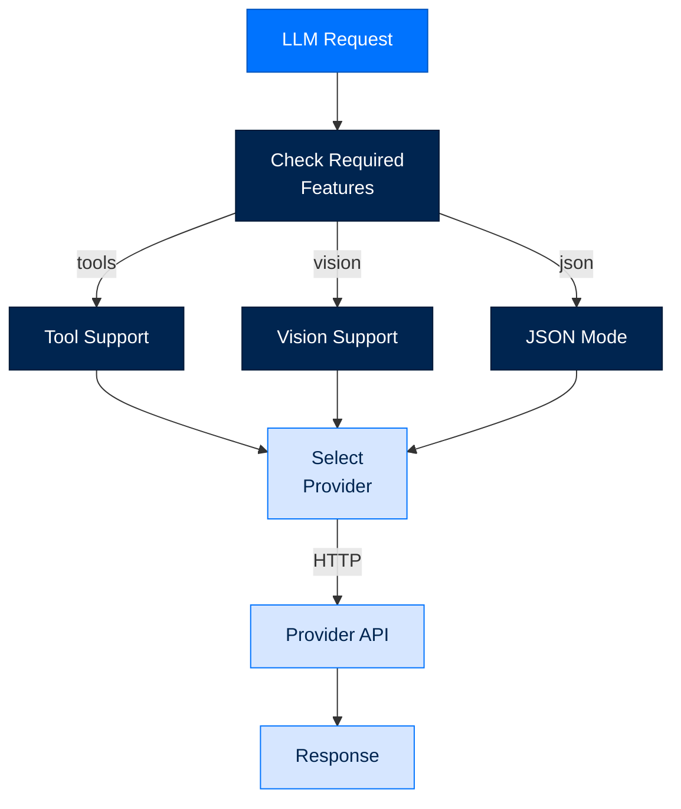

# arcllm - LLM Client

> **Building with Arc**  ·  Build  ·  page 10 of 27  
> **For** Engineers writing code against Arc  
> [← Package index](../package-index.md)  ·  [Docs home](../../README.md)  ·  [arcrun →](arcrun.md)

---

## Overview

`arcllm` is a **zero-SDK HTTP client** for 16+ LLM providers. It provides:
- **Unified interface** across all providers
- **Direct HTTP calls** - no vendor SDK dependencies
- **Tool support** - function calling across providers
- **Streaming** - real-time token streaming
- **Cost tracking** - automatic token usage



---

## Supported Providers

### Cloud Providers

| Provider | Models | Tool Support | Notes |
|----------|--------|--------------|-------|
| **anthropic** | Claude 3/4 family | ✅ Native | Recommended default |
| **openai** | GPT-4/4o family | ✅ Native | |
| **azure** | Azure OpenAI | ✅ Native | Enterprise deployment |
| **google** | Gemini 1.5/2.0 | ✅ Native | Vertex AI |
| **cohere** | Command R+ | ✅ Native | |
| **mistral** | Mistral/Large | ✅ Native | |
| **groq** | Llama 3/Mixtral | ✅ Native | Fast inference |
| **deepseek** | DeepSeek models | ✅ Native | |
| **together** | Open models | ✅ Native | |
| **fireworks** | FireLLaVA, etc. | ✅ Native | |
| **openrouter** | Aggregation | ✅ Native | |
| **nvidia** | NVIDIA models | ✅ Native | |
| **xai** | Grok models | ✅ Native | |
| **moonshot** | Moonshot models | ✅ Native | |

### Self-Hosted Providers

| Provider | Models | Tool Support | Notes |
|----------|--------|--------------|-------|
| **huggingface** | HF models | ✅ Native | TGI recommended |
| **ollama** | Local models | ✅ Native | No API key needed |
| **vllm** | Any OpenAI-compatible | ✅ Native | GPU required |
| **tgi** | HuggingFace TGI | ✅ Native | Text Generation Inference |

---

## Basic Usage

### Simple Chat

```python
import arcllm

# Create client
client = arcllm(
    provider="anthropic",
    model="claude-sonnet-4-5-20250929"
)

# Chat completion
response = client.chat([
    {"role": "user", "content": "Hello, who are you?"}
])

print(response.content)  # "I'm Claude, an AI assistant..."
print(response.usage.total_tokens)  # Token count
```

### With Tools

```python
import arcllm, Tool

client = arcllm(
    provider="anthropic",
    model="claude-sonnet-4-5-20250929",
    tools=[
        Tool(
            name="get_weather",
            description="Get current weather",
            parameters={
                "type: object": {
                    "properties": {
                        "location": {"type": "string"}
                    }
                }
            }
        )
    ]
)

response = client.chat([{"role": "user", "content": "What's the weather in SF?"}])

if response.tool_calls:
    for call in response.tool_calls:
        print(f"Tool: {call.name}")
        print(f"Args: {call.arguments}")
```

### Streaming

```python
import arcllm

client = arcllm(provider="anthropic", model="claude-sonnet-4-5-20250929")

# Stream tokens
for token in client.stream([{"role": "user", "content": "Tell me a story"}]):
    print(token, end="", flush=True)
```

---

## Provider Configuration

### Configuration File

```toml
# ~/.arc/config/providers/anthropic.toml
[provider]
name = "anthropic"
base_url = "https://api.anthropic.com/v1"
api_key_env = "ANTHROPIC_API_KEY"

[[models]]
id = "claude-sonnet-4-5-20250929"
context_window = 200000
max_output = 8192
supports_tools = true
supports_vision = true
input_price_per_1m = 3.00
output_price_per_1m = 15.00

[[models]]
id = "claude-opus-4-20250929"
context_window = 200000
max_output = 8192
supports_tools = true
input_price_per_1m = 15.00
output_price_per_1m = 75.00
```

### Environment Variables

```bash
# Required per provider
ANTHROPIC_API_KEY=sk-ant-...
OPENAI_API_KEY=sk-...
GOOGLE_API_KEY=...
COHERE_API_KEY=...
MISTRAL_API_KEY=...
GROQ_API_KEY=...
DEEPSEEK_API_KEY=...
TOGETHER_API_KEY=...
FIREWORKS_API_KEY=...
OPENROUTER_API_KEY=...
NVIDIA_API_KEY=...
XAI_API_KEY=...
MOONSHOT_API_KEY=...
HF_API_KEY=...
```

---

## Embeddings

```python
import arcllm

client = arcllm(provider="openai", model="text-embedding-3-small")

# Generate embeddings
embeddings = client.embed([
    "Hello world",
    "Goodbye world"
])

# embeddings is list[list[float]]
print(len(embeddings))  # 2
print(len(embeddings[0]))  # 1536 (for small model)
```

### Embedding Providers

| Provider | Models | Dimensions |
|----------|--------|------------|
| openai | text-embedding-3-* | 256-3072 |
| anthropic | (via OpenAI compatible) | |
| voyage | voyage-* | 1024 |
| cohere | embed-english-v3.0 | 1024 |

---

## Cost Tracking

```python
import arcllm

client = arcllm(provider="anthropic", model="claude-sonnet-4-5-20250929")

response = client.chat(messages)

# Usage tracking
print(f"Input tokens: {response.usage.prompt_tokens}")
print(f"Output tokens: {response.usage.completion_tokens}")
print(f"Total tokens: {response.usage.total_tokens}")

# Cost estimation
cost = client.estimate_cost(
    prompt_tokens=response.usage.prompt_tokens,
    completion_tokens=response.usage.completion_tokens
)
print(f"Cost: ${cost:.4f}")
```

### Pricing Configuration

```python
# Model pricing (per 1M tokens)
PRICING = {
    "anthropic/claude-sonnet-4-5-20250929": {
        "input": 3.00,
        "output": 15.00
    },
    "openai/gpt-4o": {
        "input": 5.00,
        "output": 15.00
    }
}
```

---

## Error Handling

```python
import arcllm, ArcLLMError, QueueTimeoutError, ArcLLMAPIError

client = arcllm(provider="anthropic", model="claude-sonnet-4-5-20250929")

try:
    response = client.chat(messages)
except QueueTimeoutError as e:
    print(f"Rate limited: {e.retry_after}s")
except ArcLLMAPIError as e:
    print(f"Context overflow: {e.tokens_used}/{e.context_limit}")
except ArcLLMError as e:
    print(f"LLM error: {e}")
```

### Error Types

| Error | When | Recovery |
|-------|------|----------|
| `QueueTimeoutError` | 429 response | Exponential backoff |
| `ArcLLMAPIError` | Tokens exceed limit | Truncate context |
| `AuthenticationError` | Invalid API key | Check credentials |
| `ArcLLMError` | General error | Log and retry |

---

## API Reference

### Functions

```python
def arcllm(
    provider: str = None,
    model: str = None,
    tools: list[Tool] = None,
    temperature: float = 0.7,
    max_tokens: int = None,
    **kwargs
) -> LLMClient:
    """Create LLM client for provider."""

def estimate_cost(
    provider: str,
    model: str,
    prompt_tokens: int,
    completion_tokens: int
) -> float:
    """Estimate cost for token usage."""
```

### Classes

```python
class LLMClient:
    def chat(
        self,
        messages: list[dict],
        tools: list[Tool] = None,
        temperature: float = 0.7,
        max_tokens: int = None,
        json_mode: bool = False
    ) -> LLMResponse: ...
    
    def stream(
        self,
        messages: list[dict],
        **kwargs
    ) -> Iterator[str]: ...
    
    def embed(self, texts: list[str]) -> list[list[float]]: ...
    
    def count_tokens(self, text: str) -> int: ...
    
    def estimate_cost(
        self,
        prompt_tokens: int,
        completion_tokens: int
    ) -> float: ...

class Tool(TypedDict):
    name: str
    description: str
    parameters: dict

class LLMResponse(TypedDict):
    content: str
    tool_calls: list[ToolCall]
    usage: Usage
    model: str
    provider: str

class Usage(TypedDict):
    prompt_tokens: int
    completion_tokens: int
    total_tokens: int
```

---

## Provider Selection Logic



---

## Next Steps

- [Data Flow](../../walkthrough/data-flows.md) - LLM in the execution loop
- [API Reference](../../reference/api.md) - Complete API documentation
- [Package Index](../package-index.md) - All Arc packages

---

## Verified public surface

> Introspected from the installed package on the current commit. Every name
> below is importable exactly as shown; full signatures are in the
> [API reference](../../reference/api.md#arcllm).

### Classes

| Class | Purpose |
|---|---|
| `AnthropicAdapter` | Translates ArcLLM types to/from the Anthropic Messages API. |
| `ArcLLMAPIError` | Raised when a provider API returns an HTTP error. |
| `ArcLLMConfigError` | Raised on configuration validation failure. |
| `ArcLLMEmbeddingUnavailableError` | Raised when no embedder is available for an ``embed()`` call. |
| `ArcLLMError` | Base exception for all ArcLLM errors. |
| `ArcLLMGuardrailError` | Raised when GuardrailsModule finds a structural violation in block mode. |
| `ArcLLMInjectionError` | Raised when InjectionModule detects a prompt-injection pattern in block mode. |
| `ArcLLMParseError` | Raised when tool call arguments cannot be parsed. |
| `ArcLLMTraceIntegrityError` | Raised when an encrypted trace envelope fails tamper-evidence checks. |
| `ArcLLMTraceNotFoundError` | Raised by ``load_for_replay`` when no record matches the given trace_id. |
| `AuditModule` | Wraps invoke() to log audit metadata for compliance and debugging. |
| `AwsSecretsManagerBackend` | VaultBackend backed by AWS Secrets Manager. |
| `Azure_OpenaiAdapter` | Azure OpenAI Service adapter. |
| `BaseAdapter` | Concrete base class for provider adapters. |
| `BaseModule` | Base class for ArcLLM modules. |
| `CohereAdapter` | Thin alias for Cohere's OpenAI-compatible API. |
| `DeepseekAdapter` | Thin alias for DeepSeek's OpenAI-compatible API. |
| `DefaultsConfig` | Global defaults from [defaults] section. |
| `Delta` | One frame from a streaming LLM response. |
| `EmbeddingProvider` | One backend that turns texts into vectors. arcmemory depends on this, never on a concrete provider (mirrors ``LLMProvider`` for co |
| `EmbeddingResponse` | Normalized embedding result — vectors plus their shape and provenance. |
| `EncryptedEnvelope` | Envelope-encrypted trace bodies at rest ( D-438). |
| `EndpointConfig` | One endpoint in a load-balanced pool ( [[endpoints]]). |
| `FallbackModule` | Falls back to alternative providers when the primary fails. |
| `FireworksAdapter` | Thin alias for Fireworks AI's OpenAI-compatible API. |
| `GlobalConfig` | Loaded global config.toml — defaults + module toggles. |
| `GoogleAdapter` | Translates ArcLLM types to/from the Google Gemini OpenAI-compatible API. |
| `GroqAdapter` | Thin alias for Groq's OpenAI-compatible API. |
| `GuardrailsModule` | Validates the resolved response's STRUCTURE only — schema, regex, length, stop-list. Semantic guardrails stay in `arcagent`/`arcrun` (`ADR-429` in `.claude/specs/015-content-guardrails/SDD.md`, a spec-local record — not a repo-level ADR). |
| `HuggingfaceAdapter` | Thin alias for HuggingFace's OpenAI-compatible Inference API. |
| `Huggingface_TgiAdapter` | Thin alias for HuggingFace Text Generation Inference (TGI). |
| `ImageBlock` | Models |
| `InjectionModule` | Scans inbound content for prompt-injection signals before the provider. |
| `JSONLTraceStore` | Append-only JSONL store with SHA-256 hash chain and daily rotation. |
| `LLMProvider` | Helper class that provides a standard way to create an ABC using inheritance. |
| `LLMResponse` | Models |
| `LoadBalancerModule` | Distributes invoke() calls across a pool of same-provider endpoints. |
| `LocalEmbedder` | Offline ``sentence-transformers`` backend (default all-MiniLM-L6-v2). |
| `Message` | Models |
| `MistralAdapter` | Translates ArcLLM types to/from the Mistral API. |
| `ModelMetadata` | Per-model metadata from provider TOML [models.*] sections. |
| `ModuleConfig` | Module toggle config. Extra fields preserved for module-specific settings. |
| `MoonshotAdapter` | Thin alias for Moonshot AI's OpenAI-compatible API. |
| `NoneEmbedder` | Sentinel backend — always signals 'no embedder available'. |
| `OllamaAdapter` | Thin alias for Ollama's OpenAI-compatible API. |
| `OpenaiAdapter` | Translates ArcLLM types to/from the OpenAI Chat Completions API. |
| `OtelModule` | Creates root 'arcllm.invoke' span with GenAI semantic convention attributes. |
| `PoolExhaustedError` | Raised when every endpoint in a pool is unhealthy. |
| `ProviderConfig` | Loaded provider TOML — connection settings + model metadata + endpoint pool. |
| `ProviderEmbedder` | Optional remote embeddings endpoint (OpenAI-compatible ``/embeddings``). |
| `ProviderSettings` | Provider connection settings from [provider] section. |
| `QueueFullError` | Raised when queue backpressure rejects a call. |
| `QueueModule` | Concurrency-limiting wrapper with backpressure and send-time timeout. |
| `QueueTimeoutError` | Raised when a call exceeds the send-time timeout. |
| `RateLimitModule` | Acquires a token from a per-provider bucket before each invoke(). |
| `ReplayRequest` | A byte-exact, reconstructed LLM request. Data only — no I/O. |
| `ResponseFormat` | Structured-output enforcement hint, OpenAI-compatible shape. |
| `RetryModule` | Retries transient failures with exponential backoff + jitter. |
| `SecurityModule` | Per-invoke security middleware: PII redaction + request signing. |
| `TelemetryModule` | Wraps invoke() to log timing, token usage, and cost. |
| `TextBlock` | Models |
| `TogetherAdapter` | Thin alias for Together AI's OpenAI-compatible API. |
| `Tool` | Models |
| `ToolCall` | Models |
| `ToolCallDelta` | Incremental tool-call fragment from a streaming response. |
| `ToolResultBlock` | Models |
| `ToolUseBlock` | Models |
| `TraceEncryptionConfig` | Envelope-encryption settings for trace bodies at rest ( D-438). |
| `TraceRecord` | Single LLM call record. Immutable, hashable, serializable. |
| `TraceRetentionConfig` | Retention purge bounds for rotated trace files ( D-440). |
| `TraceStore` | Protocol for trace persistence backends. |
| `Usage` | Models |
| `VaultConfig` | Vault backend configuration from [vault] section. |
| `VaultResolver` | Resolve API keys from vault with TTL cache and env var fallback. |
| `VllmAdapter` | Thin alias for vLLM's OpenAI-compatible API. |
| `XaiAdapter` | Thin alias for xAI's OpenAI-compatible API. |

### Functions

| Function | Signature |
|---|---|
| `clear_cache` | `() -> None` |
| `clear_embedder_cache` | `() -> 'None'` |
| `async embed` | `(texts: 'list[str]', *, model: 'str', provider: 'EmbeddingProvider \| None' = None, backend: 'str' = ` |
| `async load_for_replay` | `(traces_dir: pathlib.Path, trace_id: str, *, wrapping_key_resolver: collections.abc.Callable[[str], ` |
| `load_global_config` | `() -> arcllm.config.GlobalConfig` |
| `load_model` | `(provider: str, model: str \| None = None, *, budget_scope: str \| None = None, on_event: collections.` |
| `load_provider_config` | `(provider_name: str) -> arcllm.config.ProviderConfig` |
| `load_telemetry_retention_config` | `() -> arcllm.config.TraceRetentionConfig` |
| `resolve_embedder` | `(model: 'str', *, backend: 'str' = 'local', base_url: 'str \| None' = None, api_key: 'str' = '') -> '` |
| `supports_tools` | `(provider: 'str', model: 'str') -> 'bool'` |
| `tool_capable_models` | `(provider: 'str') -> 'list[str]'` |

