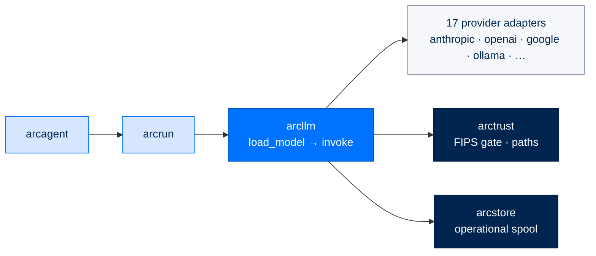

# arcllm - The Provider-Agnostic LLM Layer

> **Building with Arc**  ·  Build  ·  page 10 of 27  
> **For** Engineers writing code against Arc  
> [← Package index](../package-index.md)  ·  [Docs home](../../README.md)  ·  [arcrun →](arcrun.md)

---

## In one breath

`arcllm` is the **bottom of the stack** and the only package that talks to a
model provider over the wire. It turns "call an LLM" into one typed contract —
`load_model(...)` returns an object with an `async invoke(...)` — and hides
seventeen providers, prompt caching, retries, budgets, embeddings, and
tamper-evident tracing behind it. It is a **standalone provider/router
implementation**: `pip install arcllm` on its own works, and `arcllm` knows
*nothing* about the ReAct loop (`arcrun`), the agent (`arcagent`), gateways, or
UIs. Everything above it imports *down*; nothing here imports *up*.



**The concern boundary (by policy):**

| Concern | Package | arcllm's rule |
|---|---|---|
| LLM HTTP / wire | **arcllm** | Owns it entirely. Every provider call in the whole stack lands here. |
| The agentic loop | arcrun | arcllm never runs a loop, never decides a next step. |
| Tools, memory, identity policy | arcagent | arcllm holds no agent state, no ReAct, no tool execution. |

`arcrun → arcllm`; `arcagent → arcrun` only. A higher layer never reaches past
its neighbour — `arcagent` calls the model through the ArcRun facade, never
`import arcllm`. This is the seam the [seam model](../../concepts/seam-model.md)
calls the **LLM port**: the core above depends on the *shape* (`load_model` +
`LLMProvider`), never on a vendor.

---

## The call surface

There is exactly one way in: **`arcllm.load_model(...)`** (in
`registry.py`). It returns a
long-lived `LLMProvider` object. Create it once, reuse it for many calls — each
`load_model()` opens a new `httpx` connection pool, so never call it
per-request.

```python
import arcllm
from arcllm import Message, Tool

async with arcllm.load_model("anthropic", "claude-sonnet-5") as model:
    resp = await model.invoke(
        [
            Message(role="system", content="You are a helpful analyst."),
            Message(role="user", content="Summarize Q3 in one line."),
        ]
    )
    print(resp.content)          # the text
    print(resp.usage.total_tokens)
    print(resp.cost_usd)         # filled in by the telemetry wrapper
```

### `LLMProvider` — the contract everything returns

`LLMProvider` (an ABC in `types.py`)
is the object `load_model` hands back and the shape every adapter and every
wrapper module satisfies:

```python
class LLMProvider(ABC):
    @property
    def name(self) -> str: ...          # "anthropic", "openai", …
    @property
    def model_name(self) -> str: ...    # resolved model id
    async def invoke(self, messages, tools=None, *,
                     response_format=None, **kwargs) -> LLMResponse: ...
    async def invoke_stream(self, messages, tools=None, *,
                            response_format=None, **kwargs) -> AsyncIterator[Delta]: ...
    def validate_config(self) -> bool: ...
    async def close(self) -> None: ...
```

- **`invoke`** is a single, blocking (awaited) call → one `LLMResponse`.
- **`invoke_stream`** yields `Delta` frames. The *default* implementation on
  the base class calls `invoke()` once and yields a **single Delta** carrying
  the whole response — so a consumer can treat streaming and non-streaming
  providers identically; an adapter that speaks a real streaming wire overrides
  it to yield per-token deltas. This "unbreakable single-event fallback" is the
  seam-model rule *"the default is correct with zero config"* made concrete.
- **`close()`** releases the httpx pool. The object is an async context manager
  (`__aenter__`/`__aexit__` in `adapters/base.py`),
  which is the recommended way to guarantee the pool is released.

### Streaming and the `StreamAccumulator`

Adapters own wire parsing and yield provider-neutral `Delta` frames; the
`StreamAccumulator` (in `types.py`) owns *reconstruction* — feed it deltas with
`.add(delta)` and call `.build()` to get the same `LLMResponse` a blocking
`invoke()` would have produced, including stitched-together streamed tool calls.
It deliberately guards two real bugs: a zero-argument tool call streams no
argument text and must resolve to `arguments={}` (not a decode failure), and
conflicting/incomplete tool-call fragments raise `ArcLLMStreamProtocolError`
with a **provider-neutral** message that leaks no model output.

### Structured output (`response_format`)

`invoke(..., response_format=...)` takes one OpenAI-shaped hint
(`ResponseFormat` in `types.py`): `{"type": "json_object"}` or
`{"type": "json_schema", "json_schema": {...}}`. Each adapter renders that one
hint into *its* provider's shape — the openai-wire family forwards a
`response_format` field; **Anthropic has no server-side JSON mode**, so its
adapter translates the schema into a *forced tool call* (`structured_output`)
under the hood. When a response parses to a schema-matching object it lands on
`LLMResponse.parsed_content`. Callers pass the same kwarg everywhere; the
adapter absorbs the provider difference.

---

## The always-on router

`load_model` **always returns a `RoutingModule`** — never a bare adapter (see
`registry.py`, and the package's design contract). This removed an old
"adapter-or-router" fork where routing and load-balancing fought over one slot
and the loser was silently dropped.

- **One declared model** → the router is a zero-cost dict lookup in front of a
  single adapter. You pay nothing for it.
- **Several declared routes** → it *chooses* per call.

Selection is a fixed four-tier ladder (highest first, from
`modules/routing.py`):

1. **Pin** — the caller passed `route="..."`. Background jobs (memory
   consolidation, evals) that must not be guessed say so explicitly.
2. **Tool continuity** — a `tool_result` answering a tool call this router
   already dispatched **must** go back to the model that asked for it. This is a
   correctness lock, not a preference; ids are unique per call, so concurrent
   sessions sharing one router never collide.
3. **Phrases** — semantic match of the last user message against each route's
   example phrases (needs an embedder), above a similarity threshold.
4. **Default** — the declared default route.

Tier 2 is what makes tier 3 affordable: an agent turn is one user message plus
ten-to-twenty-five tool round-trips, and only the first call is unlocked, so a
routing embedding is paid **once per turn**, not once per call.

### Provider selection + the `[providers.<name>]` base_url override

A provider name (`"anthropic"`) resolves by **convention**, not a registry the
core edits (`_get_adapter_class` in `registry.py`): the name maps to module
`arcllm.adapters.<name>` and class `<Name>Adapter`. Adding a provider means
adding a file, never adding an `if name == ...` branch.

Connection settings come from a packaged TOML at
`arcllm/providers/<name>.toml`, but a deployment overrides them **without
editing the installed package**. `load_provider_config`
(`config.py`) deep-merges a
`[providers.<name>]` table from `${ARC_CONFIG_DIR:-~/.arc}/arcllm.toml` over the
packaged file:

```toml
# ~/.arc/arcllm.toml — point a provider at your own endpoint
[providers.openai]
base_url = "https://litellm.internal:4000/v1"
```

The merged result is validated like any other config, so **an override cannot
buy itself a rule the package would refuse** — for example, a remote `base_url`
must be HTTPS. `_enforce_https_for_remote` allows plain HTTP only where a packet
provably cannot leave a private network: `localhost`, single-label service names
(`http://litellm:4000`), and private-overlay IP literals (a Tailscale
`100.64.0.0/10` address, parsed — not pattern-matched, so `100.80.x.evil.com`
is correctly rejected).

### The 17 providers

Every adapter is direct `httpx` — **no vendor SDKs** (a hard package rule).
Adapters split into two families: a handful translate a bespoke wire, and the
rest are thin aliases over an OpenAI-compatible endpoint.

| Provider (config name) | Adapter class | Wire / notes |
|---|---|---|
| `anthropic` | `AnthropicAdapter` | Native Messages API; explicit prompt-cache breakpoints; recommended default |
| `openai` | `OpenaiAdapter` | Native Chat Completions; server-side JSON mode |
| `google` | `GoogleAdapter` | Gemini over its OpenAI-compatible surface |
| `mistral` | `MistralAdapter` | Native Mistral API |
| `azure_openai` | `Azure_OpenaiAdapter` | Azure OpenAI Service deployment |
| `cohere` | `CohereAdapter` | OpenAI-compatible alias |
| `deepseek` | `DeepseekAdapter` | OpenAI-compatible alias |
| `groq` | `GroqAdapter` | OpenAI-compatible alias; fast inference |
| `together` | `TogetherAdapter` | OpenAI-compatible alias |
| `fireworks` | `FireworksAdapter` | OpenAI-compatible alias |
| `moonshot` | `MoonshotAdapter` | OpenAI-compatible alias |
| `xai` | `XaiAdapter` | Grok, OpenAI-compatible alias |
| `litellm` | `LitellmAdapter` | Any model behind a LiteLLM proxy |
| `huggingface` | `HuggingfaceAdapter` | HF Inference API (OpenAI-compatible) |
| `huggingface_tgi` | `Huggingface_TgiAdapter` | HF Text Generation Inference |
| `vllm` | `VllmAdapter` | Any OpenAI-compatible self-hosted server |
| `ollama` | `OllamaAdapter` | Local models, no API key required |

> The set is exactly the seventeen TOMLs in `arcllm/providers/` with a matching
> adapter in `arcllm/adapters/`. `list_provider_keys()` reports each provider's
> API-key env var by globbing that directory, so a new provider is answerable
> the moment it ships — there is no second, drifting copy of the map.

### Model IDs and per-model metadata

Each provider TOML declares a `default_model` plus a `[models.<id>]` table per
model (`ModelMetadata` in `config.py`): `context_window`, `max_output_tokens`,
`supports_tools`, `supports_vision`, `supports_thinking`, `supports_temperature`
(Claude-5 models reject non-default sampling params, so the adapter omits
`temperature` from the wire when this is false), `input_modalities`, and the four
`cost_*_per_1m` prices. `model=None` in `load_model` falls back to
`default_model`. Passing `tools=` to a model whose metadata says
`supports_tools = false` raises loudly at invoke time (`_check_tool_capability`
in `adapters/base.py`) rather than silently returning tool-JSON-as-text — "the
most expensive class of arcllm bug to debug."

---

## The wire-control types arcllm owns

These types are the **single canonical contract** for LLM I/O across the whole
stack. They are *exported through the `arcllm` root facade and imported by the
layers above* — never redefined per-layer (a package rule, and the reason
`arcrun`/`arcagent` speak the same `Message`/`LLMResponse`/`Delta` arcllm does).
All live in `types.py` unless noted.

| Type | Kind | What it carries |
|---|---|---|
| `Message` | request | `role` (system/user/assistant/tool) + `content` (str or content blocks) |
| `TextBlock`, `ImageBlock`, `ToolUseBlock`, `ToolResultBlock` | request/response | the `ContentBlock` discriminated union (multimodal + tool turns) |
| `Tool` | request | a tool definition sent to the model (`name`, `description`, `parameters`) |
| `ResponseFormat` | request | the one structured-output hint (text / json_object / json_schema) |
| `LLMResponse` | response | `content`, `tool_calls`, `usage`, `model`, `stop_reason`, `thinking`, `cost_usd`, `parsed_content`, `metadata` |
| `ToolCall` | response | a resolved tool call (`id`, `name`, `arguments` dict) |
| `Usage` | response | `input`/`output`/`total` tokens + `cache_read`/`cache_write`/`reasoning` tokens |
| `StopReason` | response | normalized across providers: `end_turn`/`tool_use`/`max_tokens`/`stop_sequence`/`content_filter` |
| `Delta` | stream | one streaming frame — partial `text`, a `ToolCallDelta`, `usage`, `stop_reason` |
| `ToolCallDelta` | stream | an incremental tool-call fragment (string argument bytes being assembled) |
| `StreamAccumulator` | stream | reconstructs a full `LLMResponse` from `Delta` frames |
| `LLMProvider` | contract | the ABC `load_model` returns and every adapter/module satisfies |
| `EmbeddingResponse`, `EmbeddingProvider` | embeddings | normalized vectors + the backend ABC (in `embeddings.py`) |
| `TraceRecord`, `EncryptedEnvelope`, `TraceStore` | telemetry | the hash-chained call record + its store contract (in `trace_store.py`) |

The design intent: a caller builds one `Message` list and one `Tool` list and
gets one `LLMResponse` back **regardless of provider**, so a model swap changes a
string, never a call site.

---

## Embeddings

arcllm owns embedding **inference and nothing else** (SPEC-041,
`embeddings.py`). It persists,
indexes, and ranks nothing — `arcmemory` does that, and depends only on the
`EmbeddingProvider` ABC, never a concrete backend (mirroring how it depends on
`LLMProvider` for completions).

### The one entry point

```python
resp = await arcllm.embed(
    ["chunk one", "chunk two"],
    model="all-MiniLM-L6-v2",
    backend="local",              # "local" | "provider" | "none"
    operation="embed:ingest",     # the trace label — see below
    telemetry={"budget_scope": "agent:sales-007", "agent_did": did},
)
resp.vectors   # list[list[float]]
resp.dims      # 384 for all-MiniLM-L6-v2
resp.usage     # Usage(input_tokens=…, output_tokens=0)
```

### Three backends (`resolve_embedder`)

- **`local`** — `LocalEmbedder`, the default. Offline, deterministic
  `sentence-transformers` model, default **all-MiniLM-L6-v2 (384 dims)**, via the
  optional `arcllm[local]` extra. Vectors are L2-normalized so downstream cosine
  == dot. The model loads lazily on first `embed` (importing arcllm never pulls
  torch), and the CPU-bound encode is offloaded with `asyncio.to_thread` so the
  event loop is never blocked. Backends are cached per model to avoid a
  cold-start reload every call. This is the federal / air-gapped path.
- **`provider`** — `ProviderEmbedder`, an optional remote OpenAI-compatible
  `/embeddings` endpoint for enterprises with a hosted embedder.
- **`none`** — `NoneEmbedder`, a sentinel that *always* raises
  `ArcLLMEmbeddingUnavailableError`. This lets a deployment declare **explicitly**
  that embeddings are off, so `arcmemory` degrades to BM25 + graph rather than
  silently guessing. The same typed error is raised when the `[local]` extra is
  simply absent — a clean "none" signal, never a bare `ImportError` crash. This
  is "degrade loud," an invariant the memory system depends on.

### An embed becomes a telemetry record

Every embed rides the **same budget + telemetry plumbing as a completion** and
emits one `SpoolRecord` of kind `llm_call` (`_emit_telemetry` in
`embeddings.py`), so embed spend aggregates onto the agent's shared budget:

- `model` = the embedding model; `provider` = the backend label
  (`local` / `provider` / `custom`); `cost_usd`; `input_tokens` from the token
  estimate; `completion_tokens = 0`.
- `extra['operation']` **and** `response_body['operation']` carry the caller's
  short label so a trace can be filtered by *what the embed was for* — `embed:*`
  (e.g. `embed:consolidate`, `embed:ingest`) vs `retrieve:*` (e.g.
  `retrieve:recall`). Never content — a bare purpose string.
- The request body carries `count` + `total_chars` always, and up to the first 8
  inputs truncated to 500 chars **only when raw-body capture is on** (mirroring
  the completion path's gate). The output **vectors are never stored** — only
  their shape (`embedding_dims` + `count`).

### Token / char accounting

Input tokens for `local` are a cheap, deterministic whitespace-word estimate
(`_count_tokens`, ≥1 per non-empty text) — it feeds cost arithmetic only, never
the model, so no tokenizer download. `provider` backends trust the endpoint's
reported `prompt_tokens` when present, else fall back to the same estimate.

---

## Budget, cost, caching, retries, timeouts

`load_model` composes a **stack of wrapper modules** around the router, each a
`LLMProvider` wrapping the next. Module kwargs decide what wraps: `True` (enable
with `config.toml` defaults), `False` (force off), a `dict` (enable, merged over
defaults), or `None` (use the `config.toml` enabled flag). The **only**
module ON by default is `retry` (`DEFAULT_ON_MODULES` in `registry.py`) — a 429
or dropped connection is the normal weather of a network call, and an LLM
request is idempotent, so retrying is safe; everything that changes *what the
model sees* or *what the caller may do* stays a deliberate opt-in.

### Stacking order (load-bearing)

`load_model` builds, outermost first:

```
Otel → Queue → Telemetry → Audit → Guardrails → Injection →
Security → CircuitBreaker → Retry → Fallback → RateLimit →
[Router → LoadBalancer → Adapter]
```

The order is not cosmetic (ADR-422/ADR-430): **Injection sits above Security** so
it scans the *original* inbound text before PII/secret redaction can obscure an
encoded attack; **Guardrails sits just inside Audit** so the audit trail records
the very response guardrails validated. The router is always innermost, with a
load-balanced pool living *under* a route so routing and load-balancing can both
be on at once (`_build_route_adapter`).

### Cost & token accounting

- Prices come from the per-model TOML metadata, injected into the telemetry
  config automatically (`_apply_telemetry`). `calculate_cost`
  (`telemetry_cost.py`)
  bills input, output, cache-read, and cache-write tokens each at their own
  `per_1m` rate.
- Because the router runs *below* telemetry, a per-route price table
  (`_route_pricing`) is resolved up front and keyed by `provider/model`, so a
  call that took a cheaper (or local) lane is billed at *that* lane's price — not
  the default route's. Without it, switching to a local model would look
  identical in the ledger to not switching.
- `LLMResponse.cost_usd` is stamped by the telemetry wrapper.

### Budgets (LLM10 — unbounded consumption)

When `budget_scope` and any limit are set, `TelemetryModule` enforces spend:
a **pre-flight** worst-case estimate before the call and a **post-deduct** after,
against per-scope accumulators (`telemetry_budget`). Limits are `monthly_limit_usd`,
`daily_limit_usd`, `per_call_max_usd`, with `enforcement="block"` (raise
`ArcLLMBudgetError`, fail-closed) or `"warn"`. Embeds share the same
accumulator, so a scope's completion and embed spend add up together.

### Prompt caching

Provider-level, config-driven (`ProviderSettings.enable_prompt_caching`, default
**on** — a pure cost/latency win on a stable prefix) with `cache_ttl` of `"1h"`
(default) or `"5m"`. Only adapters with explicit cache breakpoints (Anthropic)
read these; OpenAI-wire adapters ignore them. Anthropic caps a request at 4
breakpoints, so its adapter budgets them across the last tool, the conversation
tail, and up to two system segments (`_extract_system`), ordered most-stable
first so a late change still reads the earlier segments' cache. Cache hit/write
tokens flow back through `Usage.cache_read_tokens` / `cache_write_tokens` and are
billed and surfaced separately.

### Retries, timeouts, and the other resilience modules

| Module | Default when on | Guards |
|---|---|---|
| `RetryModule` (on by default) | 3 retries (6 for 429s), exponential backoff + jitter, retryable codes `429/500/502/503/529` | transient provider failure |
| `RateLimitModule` | per-provider token bucket | your own call rate |
| `QueueModule` | `max_concurrent=2`, `call_timeout=180s`, `max_queued=10` FIFO | bounded concurrency + backpressure; `QueueFullError` / `QueueTimeoutError` |
| `CircuitBreakerModule` | CLOSED/OPEN/HALF_OPEN per provider | a flapping provider |
| `FallbackModule` | alternate providers | primary hard-down |
| `LoadBalancerModule` | weighted / health-aware / sticky over a `[[endpoints]]` pool | `PoolExhaustedError` when all unhealthy |

The terminal adapter itself carries a **180s httpx send-side timeout** — long
multi-tool agentic turns with a 100k-token context routinely take 60-90s on one
round trip, and the older 60s default failed those legitimate calls.

---

## Telemetry: the record the observe plane reads

Two independent sinks capture every call; either, both, or neither is wired.

1. **The arcstore operational spool** — a `SpoolRecord` of kind `llm_call`,
   emitted on by default (`_record_spool` in `modules/telemetry.py`). This is
   what the **arcui observe plane** reads to render the live model-call feed.
   Fields: `model`, `provider`, `agent_label`, `actor_did`, `prompt_tokens`,
   `completion_tokens`, `cache_read_tokens`, `cache_write_tokens`, `cost_usd`,
   `latency_ms`, `outcome` (`ok`/`error`), `request_id`, and a flat `extra`.
   Raw `request_body`/`response_body` ride `extra` **only when raw-body capture
   is on** — upstream `capture_tool_io` (arcagent/arcmemory) threads into
   arcllm's `store_raw_bodies`; metadata-only is the federal/CUI default. A call
   that *raises* still records an `error` row with the known model and a bounded
   reason, so a failure is a diagnosable `<model> / error: <reason>` line, never
   a bare `— / error / 0ms`.

   > Token nuance: with prompt caching, Anthropic reports `input_tokens` as only
   > the *new* tokens (a fully-cached prompt can show ~2), so the spool's
   > `prompt_tokens` is the **summed** context (`input + cache_read +
   > cache_write`) to reflect true prompt size, while the split persists
   > separately for hit-rate math.

2. **The tamper-evident `TraceRecord` chain** — the forensic body-of-record
   (`trace_store.py`). A
   `TraceStore` is optional (wired via `load_model(trace_store=...)` and/or the
   `on_event` callback). `JSONLTraceStore` is an append-only JSONL store with a
   **SHA-256 hash chain** (each record's hash covers the prior record's, so
   in-place mutation or reordering on disk is detectable), **daily rotation**,
   and files at `<agent_root>/traces/` outside the agent's tool sandbox (NIST
   AU-9, `0700`/`0600`). A `TraceRecord` carries full request/response bodies by
   default (`store_raw_bodies`, SPEC-016 D-435) plus timing sub-phases
   (`phase_timings`: prompt-assembly / llm-call / post-processing), `cost_usd`,
   token split, `stop_reason`, `status`, `attempt_number`/`retry_group_id`,
   `agent_did`, `budget_scope`, a verbatim `lineage` token, and a
   `classification` watermark.

Bodies are built **exactly once** per outcome (`_prepare_bodies`) and shared by
both sinks. Raw bodies are byte-capped (256KB default) with a cheap length-hint
short-circuit so a 100k-token context is never fully serialized just to discard
it; an oversized request keeps the *system messages* (each capped) so the
assembled prompt stack stays readable, and reports the true original size.

`agent_did` / `agent_label` resolve task-locally: a spawned child binds its own
identity on its asyncio task via `agent_identity(...)` (a ContextVar, snapshotted
per `asyncio.Task`), so concurrent `spawn_many` children attribute their calls to
*themselves* without rebuilding the provider chain — and without the
cross-attribution a process global would cause.

---

## Threat surface

arcllm is the boundary where private data meets an external service, so it
carries specific OWASP-LLM mitigations by construction:

- **LLM07 / LLM02 — no secrets in prompts or logs.** API keys resolve from a
  vault-backed `VaultResolver` (TTL cache) with an env-var fallback, and a
  vault-resolved key is preferred so secrets stay out of `os.environ` (NIST
  AU-9). Endpoint identity strings and audit records store only the *source*
  of a key (env-var name or vault path), never the value (`_endpoint_identity`,
  D-457). `ArcLLMAPIError.__str__` truncates provider error bodies so verbose
  upstream errors don't leak into logs. The package deliberately loads only the
  **operator's cwd `.env`**, never a package-internal `.env`, so an editable
  install can't leak the framework's dev key into a deployment.
- **LLM05 — never execute raw output.** arcllm returns *data*
  (`LLMResponse`); it never runs a tool or evaluates model text. Tool execution
  and output handling live above, in arcrun/arcagent. `GuardrailsModule`
  (structure-only: JSON schema, regex allow/deny, length, stop-list) can validate
  the final response, but semantic guardrails stay upstream.
- **LLM01 / ASI06 — prompt injection.** `InjectionModule` (opt-in) scans
  inbound user + tool-result content *before* the provider call and above
  Security so it sees pre-redaction text. Classification labels and lineage are
  attacker-influenceable persisted metadata, so they're NFKC-normalized and
  length-capped before storage.
- **LLM10 — unbounded consumption.** Token budgets, per-call/daily/monthly cost
  ceilings, concurrency caps + backpressure, circuit breakers, and hard
  timeouts (above).
- **Trace confidentiality (federal).** Trace bodies can be sealed at rest with
  AES-256-GCM envelope encryption (`EncryptedEnvelope`); the wrapping key
  resolves once at construction (never per call), the algorithm passes the
  arctrust FIPS gate when `require_fips=true`, and construction **fails closed**
  if encryption is enabled but no key resolved — it never falls back to
  plaintext. AAD binds each ciphertext to its record identity so it can't be
  transplanted (`ArcLLMTraceIntegrityError`, D-448).

Everything fails **closed**: a missing required key, an unresolved wrapping key,
or a budget breach raises rather than degrading silently.

---

## Failure modes & how to inspect a call

### The exceptions (all subclass `ArcLLMError`)

| Exception | When |
|---|---|
| `ArcLLMConfigError` | missing/invalid provider config, missing required key, bad `response_format`, tools passed to a non-tool model |
| `ArcLLMAPIError` | provider returned an HTTP error (`status_code`, `provider`, `retry_after` on the attribute) |
| `ArcLLMParseError` | tool-call arguments couldn't be parsed |
| `ArcLLMStreamProtocolError` | stream frames couldn't form a valid response (provider-neutral, leaks nothing) |
| `ArcLLMBudgetError` | a configured budget limit would be exceeded (`scope`, `limit_type`, dollars) |
| `QueueFullError` / `QueueTimeoutError` | backpressure rejected the call / send-time timeout |
| `ArcLLMEmbeddingUnavailableError` | no embedder available (the "none" signal) |
| `ArcLLMTraceNotFoundError` / `ArcLLMTraceIntegrityError` | replay target missing / sealed trace failed tamper checks |

### Inspecting a model call in the trace

1. **Live** — the arcui observe plane reads the arcstore spool; each `llm_call`
   row shows model, provider, agent, tokens (in/out/cache), cost, latency, and
   outcome. With `store_raw_bodies` on, the row's `extra` carries the actual
   request/response.
2. **Forensic** — when a `JSONLTraceStore` is wired, every call is a
   hash-chained `TraceRecord` under `<agent_root>/traces/traces-YYYY-MM-DD.jsonl`
   with full bodies (or an `EncryptedEnvelope`) and `phase_timings`.
   `verify_chain()` proves internal consistency; `store.get(trace_id)` fetches
   one record; `arcllm.load_for_replay(traces_dir, trace_id)` reconstructs a
   byte-exact `ReplayRequest`. (The hash chain proves no on-disk record was
   mutated or reordered; proving no *head* record was removed needs the external
   signed anchor via the `checkpoint_sink` — an AU-9/AU-10 limitation documented
   on the store.)

---

## Worked examples

### A completion with a tool

```python
import arcllm
from arcllm import Message, Tool

weather = Tool(
    name="get_weather",
    description="Current weather for a city.",
    parameters={"type": "object",
                "properties": {"city": {"type": "string"}},
                "required": ["city"]},
)

async with arcllm.load_model("anthropic", "claude-sonnet-5",
                             agent_did="did:arc:sales-007",
                             budget_scope="agent:sales-007") as model:
    resp = await model.invoke(
        [Message(role="user", content="What's the weather in Denver?")],
        tools=[weather],
    )
    if resp.stop_reason == "tool_use":
        for call in resp.tool_calls:
            print(call.name, call.arguments)   # get_weather {'city': 'Denver'}
    print(resp.usage.input_tokens, resp.usage.output_tokens, resp.cost_usd)
```

### Streaming

```python
async with arcllm.load_model("openai", "gpt-4o") as model:
    async for delta in model.invoke_stream(
        [Message(role="user", content="Tell me a two-line story.")]
    ):
        if delta.text:
            print(delta.text, end="", flush=True)
```

### An embed, budgeted and labeled

```python
resp = await arcllm.embed(
    ["The Q3 pipeline grew 22%.", "Churn held flat."],
    model="all-MiniLM-L6-v2",
    operation="embed:ingest",
    telemetry={"budget_scope": "agent:sales-007",
               "agent_did": "did:arc:sales-007"},
)
print(resp.dims, len(resp.vectors))   # 384 2
```

---

## Package layout & entry points

```
src/arcllm/
  registry.py      # load_model + convention-based adapter discovery (always returns a router)
  types.py         # Message, Tool, LLMResponse, Delta, LLMProvider — the shared contract
  config.py        # layered TOML: packaged defaults + ~/.arc/arcllm.toml [providers.<name>] overrides
  embeddings.py    # embed() + resolve_embedder (lazy; arcllm[local] all-MiniLM backend)
  adapters/        # 17 httpx provider adapters
  providers/       # per-provider TOML catalogs (models, pricing, capabilities)
  modules/         # routing, retry, fallback, rate_limit, load_balancer, circuit_breaker,
                   #   telemetry (+ budget/cost), audit, security, injection, guardrails, queue, otel
  trace_store.py   # hash-chained JSONL capture;  trace_query.py = filtered read + replay
  vault.py / backends/   # VaultResolver + secret backends (e.g. aws_secrets)
```

- **Eager imports** (`import arcllm` pulls these): `load_model`, the message /
  tool / response / stream types, config loaders, exceptions. No httpx or torch
  at import time.
- **Lazy imports** (`__getattr__` in `__init__.py`): adapters, wrapper modules,
  embeddings (`embed`, `resolve_embedder`), trace store + replay
  (`load_for_replay`). So importing arcllm never drags in a provider SDK
  surface, torch, or a crypto backend you didn't ask for.
- **Optional extras**: `arcllm[local]` (on-device embeddings, pulls
  sentence-transformers/torch), `arcllm[otel]`, `arcllm[trace-encryption]`,
  `arcllm[injection-semantic]`, `arcllm[guardrails-schema]`. arcllm imports and
  *functions* without any of them, degrading the affected capability to a typed
  signal — never a crash.

---

## Next Steps

- [The Seam Model](../../concepts/seam-model.md) — why the LLM port looks like this
- [arcrun](arcrun.md) — the loop that sits directly on top of arcllm
- [arcmemory](arcmemory.md) — the one consumer of `embed()`
- [Data Flow](../../walkthrough/data-flows.md) — the LLM call inside a full turn
- [Package Index](../package-index.md) - All Arc packages

---

## Verified public surface

> Introspected from the installed package on the current commit. Every name
> below is importable exactly as shown; full signatures are in the
> [API reference](../../reference/api.md#arcllm).

### Classes

| Class | Purpose |
|---|---|
| `AnthropicAdapter` | Translates ArcLLM types to/from the Anthropic Messages API. |
| `ArcLLMAPIError` | Raised when a provider API returns an HTTP error. |
| `ArcLLMConfigError` | Raised on configuration validation failure. |
| `ArcLLMEmbeddingUnavailableError` | Raised when no embedder is available for an ``embed()`` call. |
| `ArcLLMError` | Base exception for all ArcLLM errors. |
| `ArcLLMGuardrailError` | Raised when GuardrailsModule finds a structural violation in block mode. |
| `ArcLLMInjectionError` | Raised when InjectionModule detects a prompt-injection pattern in block mode. |
| `ArcLLMParseError` | Raised when tool call arguments cannot be parsed. |
| `ArcLLMStreamProtocolError` | Raised when provider stream frames cannot form a valid response. |
| `ArcLLMTraceIntegrityError` | Raised when an encrypted trace envelope fails tamper-evidence checks. |
| `ArcLLMTraceNotFoundError` | Raised by ``load_for_replay`` when no record matches the given trace_id. |
| `AuditModule` | Wraps invoke() to log audit metadata for compliance and debugging. |
| `AwsSecretsManagerBackend` | VaultBackend backed by AWS Secrets Manager. |
| `Azure_OpenaiAdapter` | Azure OpenAI Service adapter. |
| `BaseAdapter` | Concrete base class for provider adapters. |
| `BaseModule` | Base class for ArcLLM modules. |
| `CircuitBreakerModule` | Per-provider CLOSED/OPEN/HALF_OPEN circuit breaker. |
| `CohereAdapter` | Thin alias for Cohere's OpenAI-compatible API. |
| `DeepseekAdapter` | Thin alias for DeepSeek's OpenAI-compatible API. |
| `DefaultsConfig` | Global defaults from [defaults] section. |
| `Delta` | One frame from a streaming LLM response. |
| `EmbeddingProvider` | One backend that turns texts into vectors (mirrors ``LLMProvider``). |
| `EmbeddingResponse` | Normalized embedding result — vectors plus their shape and provenance. |
| `EncryptedEnvelope` | Envelope-encrypted trace bodies at rest (D-438). |
| `EndpointConfig` | One endpoint in a load-balanced pool ([[endpoints]]). |
| `FallbackModule` | Falls back to alternative providers when the primary fails. |
| `FireworksAdapter` | Thin alias for Fireworks AI's OpenAI-compatible API. |
| `GlobalConfig` | Loaded global config.toml — defaults + module toggles. |
| `GoogleAdapter` | Translates ArcLLM types to/from the Google Gemini OpenAI-compatible API. |
| `GroqAdapter` | Thin alias for Groq's OpenAI-compatible API. |
| `GuardrailsModule` | Validates the resolved response's STRUCTURE only — schema, regex, length, stop-list. |
| `HuggingfaceAdapter` | Thin alias for HuggingFace's OpenAI-compatible Inference API. |
| `Huggingface_TgiAdapter` | Thin alias for HuggingFace Text Generation Inference (TGI). |
| `ImageBlock` | Multimodal image content block. |
| `InjectionModule` | Scans inbound content for prompt-injection signals before the provider. |
| `JSONLTraceStore` | Append-only JSONL store with SHA-256 hash chain and daily rotation. |
| `LitellmAdapter` | Any model behind a LiteLLM proxy (OpenAI-compatible). |
| `LLMProvider` | The ABC ``load_model`` returns; every adapter and wrapper module satisfies it. |
| `LLMResponse` | Normalized completion result across providers. |
| `LoadBalancerModule` | Distributes invoke() calls across a pool of same-provider endpoints. |
| `LocalEmbedder` | Offline ``sentence-transformers`` backend (default all-MiniLM-L6-v2, 384 dims). |
| `Message` | One conversation message (role + content/blocks). |
| `MistralAdapter` | Translates ArcLLM types to/from the Mistral API. |
| `ModelMetadata` | Per-model metadata from provider TOML [models.*] sections. |
| `ModuleConfig` | Module toggle config. Extra fields preserved for module-specific settings. |
| `MoonshotAdapter` | Thin alias for Moonshot AI's OpenAI-compatible API. |
| `NoneEmbedder` | Sentinel backend — always signals 'no embedder available'. |
| `OllamaAdapter` | Thin alias for Ollama's OpenAI-compatible API. |
| `OpenaiAdapter` | Translates ArcLLM types to/from the OpenAI Chat Completions API. |
| `OtelModule` | Creates root 'arcllm.invoke' span with GenAI semantic convention attributes. |
| `PoolExhaustedError` | Raised when every endpoint in a pool is unhealthy. |
| `ProviderConfig` | Loaded provider TOML — connection settings + model metadata + endpoint pool. |
| `ProviderEmbedder` | Optional remote embeddings endpoint (OpenAI-compatible ``/embeddings``). |
| `ProviderKey` | Which environment variable one packaged provider reads its key from. |
| `ProviderSettings` | Provider connection settings from [provider] section. |
| `QueueFullError` | Raised when queue backpressure rejects a call. |
| `QueueModule` | Concurrency-limiting wrapper with backpressure and send-time timeout. |
| `QueueTimeoutError` | Raised when a call exceeds the send-time timeout. |
| `RateLimitModule` | Acquires a token from a per-provider bucket before each invoke(). |
| `ReplayRequest` | A byte-exact, reconstructed LLM request. Data only — no I/O. |
| `ResponseFormat` | Structured-output enforcement hint, OpenAI-compatible shape. |
| `RetryModule` | Retries transient failures with exponential backoff + jitter. |
| `Route` / `RoutingDecision` / `RoutingPolicy` / `RoutingRequest` | Routing primitives (the always-on router). |
| `SecurityModule` | Per-invoke security middleware: PII redaction + request signing. |
| `StreamAccumulator` | Reconstructs a full ``LLMResponse`` from ``Delta`` frames. |
| `TelemetryModule` | Wraps invoke() to log timing, token usage, and cost; enforces budgets. |
| `TextBlock` | Plain-text content block. |
| `TogetherAdapter` | Thin alias for Together AI's OpenAI-compatible API. |
| `Tool` | A tool definition sent to the model. |
| `ToolCall` | A resolved tool call returned by the model. |
| `ToolCallDelta` | Incremental tool-call fragment from a streaming response. |
| `ToolResultBlock` / `ToolUseBlock` | Tool turn content blocks. |
| `TraceEncryptionConfig` | Envelope-encryption settings for trace bodies at rest (D-438). |
| `TraceRecord` | Single LLM call record. Immutable, hashable, serializable. |
| `TraceRetentionConfig` | Retention purge bounds for rotated trace files (D-440). |
| `TraceStore` | Protocol for trace persistence backends. |
| `Usage` | Token counts (input/output/total + cache/reasoning). |
| `VaultConfig` | Vault backend configuration from [vault] section. |
| `VaultResolver` | Resolve API keys from vault with TTL cache and env var fallback. |
| `VllmAdapter` | Thin alias for vLLM's OpenAI-compatible API. |
| `XaiAdapter` | Thin alias for xAI's OpenAI-compatible API. |

### Functions

| Function | Signature |
|---|---|
| `load_model` | `(provider: str, model: str \| None = None, *, budget_scope=None, on_event=None, trace_store=None, agent_label=None, agent_did=None, lineage=None, routing=…, retry=…, …) -> LLMProvider` |
| `async embed` | `(texts: list[str], *, model: str, provider: EmbeddingProvider \| None = None, backend: str = 'local', operation: str = 'embed', telemetry=None, on_event=None) -> EmbeddingResponse` |
| `resolve_embedder` | `(model: str, *, backend: str = 'local', base_url: str \| None = None, api_key: str = '') -> EmbeddingProvider` |
| `supports_tools` | `(provider: str, model: str) -> bool` |
| `tool_capable_models` | `(provider: str) -> list[str]` |
| `load_provider_config` | `(provider_name: str) -> ProviderConfig` |
| `load_global_config` | `() -> GlobalConfig` |
| `load_telemetry_retention_config` | `() -> TraceRetentionConfig` |
| `list_provider_keys` | `() -> tuple[ProviderKey, ...]` |
| `model_config_path` | `() -> Path` |
| `async load_for_replay` | `(traces_dir: Path, trace_id: str, *, wrapping_key_resolver=…) -> ReplayRequest` |
| `agent_identity` | `(agent_did: str \| None, agent_label: str \| None = None)` — task-local identity binding for trace attribution |
| `clear_cache` | `() -> None` |
| `clear_embedder_cache` | `() -> None` |
