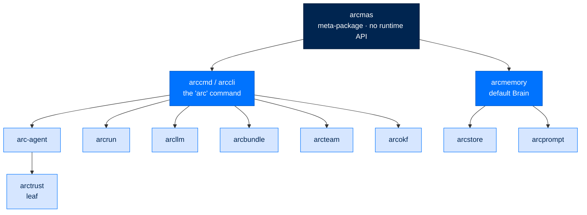

# arcmas - Full-Stack Meta-Package

> **Building with Arc**  ·  Build  ·  page 27 of 27  
> **For** Engineers writing code against Arc  
> [← arccli](arccli.md)  ·  [Docs home](../../README.md)

---

## In one breath

`arcmas` is not code — it is an **install vehicle**. Its whole job is one line:
`pip install arcmas`, and the full Arc core runtime stack arrives on your machine
in one resolve. It contains no product logic, exports nothing but `__version__`,
and is imported by no other package for anything. It is the "turnkey whole" half
of Arc's composability promise made concrete: a meta-package whose only content is
its dependency list.

It does this the honest way — by declaring **two** direct dependencies and letting
the rest come transitively through the dependency graph, rather than hand-listing
a dozen pins that would drift out of date. The two direct deps are `arccmd` (the
`arc` CLI) and `arcmemory` (the scaffold-default Brain). Everything else the core
needs is already a dependency of those.



---

## Where it fits

An **install-meta** layer — it sits *above* everything only in the packaging
sense, and *below* nothing in the import sense. No layer imports `arcmas` to run
logic; it is touched only when the "one install" dependency contract changes.

The composability doctrine
([The Seam Model](../../concepts/seam-model.md)) names four audiences the stack
must serve at once. `arcmas` is the answer to exactly one of them — the
**non-technical user who wants everything, working, with zero configuration**. The
other three audiences are served by installing layers individually, which the same
codebase supports without a fork.

---

## What one `pip install arcmas` actually resolves

This is the part earlier drafts of this page got wrong, so it is stated precisely.
`arcmas` declares two direct dependencies (`pyproject.toml`):

```toml
dependencies = [
    "arccmd>=0.2",     # the `arc` CLI (import name: arccli)
    "arcmemory>=0.1",  # dual-speed memory — the scaffold-default Brain
]
```

The **core runtime stack** arrives transitively through those two graphs:

| Package | Arrives via | What it does |
|---|---|---|
| `arctrust` | leaf under `arcllm`/`arcrun`/`arc-agent` | Ed25519 identity (DID), signing, policy pipeline, audit emission |
| `arcllm` | `arccli`, `arcmemory` | Provider-agnostic LLM calls over direct HTTP |
| `arcrun` | `arccli`, `arcmemory` | The async think → act → observe loop |
| `arc-agent` *(import `arcagent`)* | `arccli` | The agent — DID-required, tools, skills, sessions, module bus |
| `arcbundle` | `arccli` | Signed config-only distribution units (blueprints) |
| `arcteam` | `arccli` | Multi-agent messaging — registry, channels, signed audit |
| `arcokf` | `arccli`, `arcmemory` | Typed document contract for knowledge |
| `arcstore` | `arcmemory` | The durable record every surface reads from |
| `arcprompt` | `arcmemory` | Signed, overlay-able system prompts |
| `arcmemory` | direct | Journal + episodic index + entity graph; the default Brain |
| `arccli` *(dist `arccmd`)* | direct | The unified `arc` command-line tool |

### What it does **not** pull in

These are separate installs by design. `arcmas` does **not** depend on them:

| Package | Install | Why it is separate |
|---|---|---|
| `arcgateway` (+ `telegram`/`slack`/`mattermost` adapters) | `pip install 'arcgateway[telegram]'` | The chat-platform daemon is an optional surface |
| `arcui` | `pip install arcui` | The web dashboard is an optional surface |
| `arcskill` | `pip install arcskill` | Verified skill install/lifecycle is an optional supercharger |
| `arctui` | `pip install arctui` | The terminal UI is an optional surface |
| `arcmodel` | `pip install arcmodel` | Model-management scaffolding, not part of the core resolve |

The `arc gateway`, `arc ui`, and `arc skill` command *groups* still appear in the
CLI after a plain `arcmas` install — but each needs its package present before it
can run. The command is the seam; the implementation is the separate install.

> **Corrections from the previous draft.** This page used to claim `arcmas`
> "installs all 18 Arc packages" and drew edges to `arctui`, `arcui`,
> `arcgateway`, its adapters, `arcskill`, and `arcmodel`. None of those are
> `arcmas` dependencies. The real resolve is the ~11 core packages above.

---

## Meta-package, not a library

`arcmas` has no runtime API. Its source is a single `__init__.py` carrying a
`__version__` and a docstring, plus a `py.typed` marker. You never write
`from arcmas import …` for anything real.

After installing, you work through the **underlying** packages, using Arc's one
root import per layer (qualified names — a seam rule, not a style preference):

```python
import arcllm     # standalone model router
import arcrun     # the loop (knows arcllm)
import arcagent   # the agent (uses the arcrun facade)
```

…and you drive the whole thing from the CLI the install put on your PATH:

```bash
arc init                                   # tier + provider + key wizard
arc agent create my-agent --model anthropic/claude-sonnet-4-5-20250929
arc agent chat my-agent
```

For the surface commands, add the surface: `pip install arcui` before
`arc ui start`, `pip install 'arcgateway[telegram]'` before `arc gateway …`.

---

## When to use arcmas vs. individual layers

| You are… | Install | Why |
|---|---|---|
| A user who wants the whole assistant, zero setup | `pip install arcmas` | One resolve, CLI ready, memory on by default |
| A developer who wants only the LLM router | `pip install arcllm` | The bottom port never drags the ports above it in |
| A developer who wants the loop, no agent | `pip install arcrun` | Pulls `arcllm`, stops there |
| A developer embedding a full agent, no CLI | `pip install arc-agent` | The agent + its `arcrun`/`arcllm`/`arctrust` deps |
| An operator adding a surface to a core install | `pip install arcui` / `arctui` / `arcgateway[...]` / `arcskill` | Surfaces compose onto the core without changing it |

The rule of thumb: reach for `arcmas` when you want **everything at once and don't
want to think about the graph**. Reach for an individual package when you want
**one layer and nothing above it** — which the dependency-points-one-way-never-up
law guarantees you can have.

---

## Threat surface

`arcmas` ships no code, so it adds no runtime attack surface of its own. Its
security relevance is purely **supply-chain** (`LLM03` / `ASI04`): a meta-package
is a single name that pulls a dozen others, so a compromised or confused
`arcmas` pin could redirect the whole resolve. Mitigations are the standard ones —
the packages it names are the real Arc packages, versions are pinned with floors,
and the runtime security (identity, signing, policy, audit) lives in `arctrust`
and rides every seam of the packages it installs, not in the meta-package. Keeping
this package honest — its README and pins matching what a single `pip install`
truly resolves — is itself the safeguard against a misleading install surface.

---

## Next steps

- [The Seam Model](../../concepts/seam-model.md) — the composability doctrine `arcmas` embodies
- [Package Index](../package-index.md) — every package, individually
- [Setup](../setup.md) · [Quickstart](../quickstart.md) — first run after install

---

## Verified public surface

> Introspected from the installed package on the current commit. Every name
> below is importable exactly as shown; full signatures are in the
> [API reference](../../reference/api.md#arcmas).

`arcmas` exposes only `__version__` at the top level — by design. It is a
dependency aggregator with no product runtime API; use the underlying packages
(`arcagent`, `arcllm`, `arcrun`, `arctrust`, …) and the `arc` CLI it installs.
