# arcmas - Full Stack Metapackage

> **Building with Arc**  ·  Build  ·  page 27 of 27  
> **For** Engineers writing code against Arc  
> [← arccli](arccli.md)  ·  [Docs home](../../README.md)

---

## Overview

`arcmas` is the **metapackage** that installs the complete Arc stack:

```mermaid
flowchart TB
    classDef meta fill:#002550,stroke:#001A38,color:#FFFFFF
    classDef pkg fill:#0073FE,stroke:#0055BC,color:#FFFFFF

    arcmas[arcmas<br/>Metapackage]:::meta --> pkg1[arccli]:::pkg
    arcmas --> pkg2[arctui]:::pkg
    arcmas --> pkg3[arc-agent]:::pkg
    arcmas --> pkg4[arcrun]:::pkg
    arcmas --> pkg5[arcllm]:::pkg
    arcmas --> pkg6[arcmodel]:::pkg
    arcmas --> pkg7[arctrust]:::pkg
    arcmas --> pkg8[arcstore]:::pkg
    arcmas --> pkg9[arcmemory]:::pkg
    arcmas --> pkg10[arcskill]:::pkg
    arcmas --> pkg11[arcteam]:::pkg
    arcmas --> pkg12[arcui]:::pkg
    arcmas --> pkg13[arcgateway]:::pkg
    arcmas --> pkg14[arcgateway-telegram]:::pkg
    arcmas --> pkg15[arcgateway-slack]:::pkg
    arcmas --> pkg16[arcgateway-mattermost]:::pkg
```



---

## Installation

### Full Stack

```bash
pip install arcmas
```

This installs:
- All 18 Arc packages
- All dependencies
- CLI entry points

### Version Pinning

```bash
# Install specific version
pip install arcmas==1.0.0

# Install latest
pip install arcmas --upgrade

# Install from source
pip install -e .
```

---

## Package Composition

### Core Stack

| Package | Purpose |
|---------|---------|
| `arctrust` | Security primitives |
| `arcstore` | Storage backend |
| `arcllm` | LLM client |
| `arcmodel` | Model registry |
| `arcprompt` | Prompt engine |
| `arcrun` | Execution loop |
| `arcskill` | Skill hub |
| `arcmemory` | Memory system |
| `arcteam` | Multi-agent coordination |
| `arcagent` | Agent framework |

### Surface Stack

| Package | Purpose |
|---------|---------|
| `arccli` | CLI interface |
| `arctui` | Terminal UI |
| `arcui` | Web dashboard |
| `arcgateway` | Chat platform daemon |

---

## Usage

### After Installation

```bash
# Initialize
arc init

# Create agent
arc agent create my-agent

# Chat
arc agent chat my-agent
```

### Python Import

```python
from arcagent.core.agent import ArcAgent
from arcteam import MessagingService
import arcllm
from arctrust import generate_did, AuditEvent
```

---

## Next Steps

- [Package Index](../package-index.md) - All packages detailed
- [Setup](../setup.md) - Configuration guide

---

## Verified public surface

> Introspected from the installed package on the current commit. Every name
> below is importable exactly as shown; full signatures are in the
> [API reference](../../reference/api.md#arcmas).

`arcmas` exposes no public top-level Python symbols — it is used through its
submodules or its console entry point.

