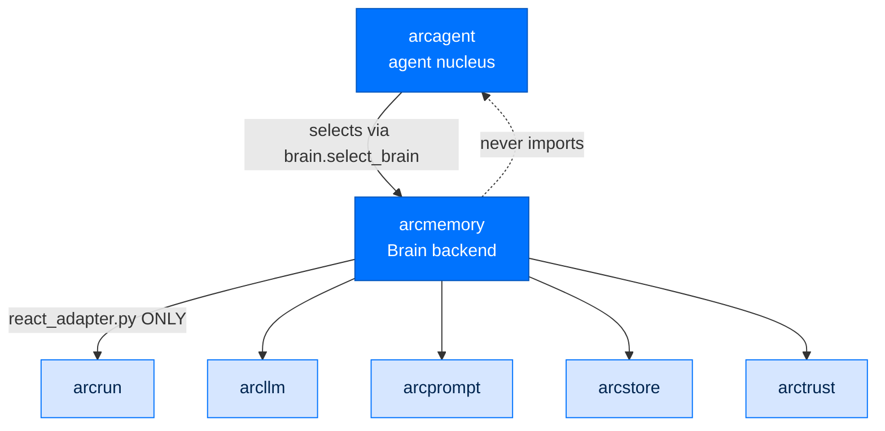
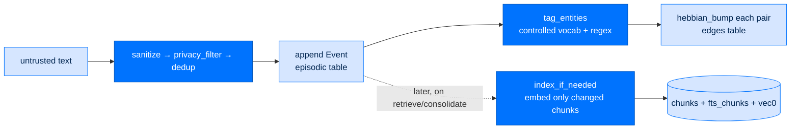
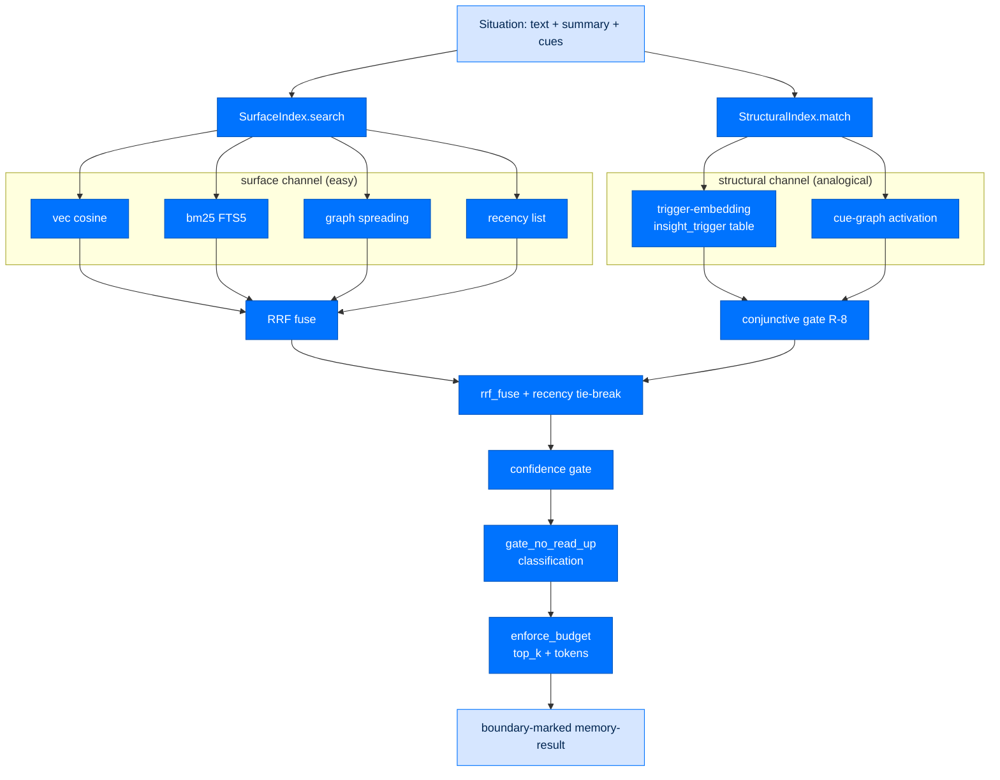

# arcmemory - Memory System

> **Building with Arc**  ·  Build  ·  page 17 of 27  
> **For** Engineers writing code against Arc  
> [← arcagent](arcagent.md)  ·  [Docs home](../../README.md)  ·  [arcskill →](arcskill.md)

---

## What arcmemory is

`arcmemory` is Arc's **dual-speed analogical memory** substrate (SPEC-041). It is
the package that lets an agent *remember* — and it is built so you can always see
what it remembers.

Four ideas define it, and every module serves one of them:

- **Glass-box markdown is the source of truth.** Everything the agent durably knows
  lives in human-readable Markdown under `<workspace>/memory/`: an episodic event
  stream, semantic entity cards, procedures, insights, life-events, and daily notes.
  You can open any of them.
- **The SQLite index is disposable.** `<workspace>/memory/index.db` is a derived
  cache (FTS/BM25, vectors, the entity graph) that makes search fast. It can be wiped
  and rebuilt from the Markdown with no loss (`index/rebuild.py`). If index and files
  disagree, the files win.
- **Fast capture is zero-LLM.** `capture()` sanitizes, dedups, appends a raw event,
  tags entities, and bumps the graph — constant cost regardless of store size, with
  **no** embedding and **no** model call (`capture.py`).
- **Consolidation is agentic "sleep."** Off the hot path, a bounded ReAct agent folds
  a window of raw events into durable facts, insights, procedures, and life-events
  (`consolidate.py` → `agent_consolidate.py`), then hygiene dedups and repairs the
  glass-box files.

> **Read the concept first.** The two-layer model (truth vs. index), the exact index
> tables, scope isolation, the recall flow, and the threat surface are explained for a
> general reader in [Memory, the Index, and Scope](../../concepts/memory-index-and-scope.md).
> This page is the **package engineering reference** — the modules, seams, entry
> points, config surface, and contracts. Where the two overlap, this page cites the
> code and links there for the mental model.

> **Current in 0.10:** durable memory is workspace-local by default; an optional
> PostgreSQL/pgvector index (`PostgresIndexBackend`) implements the same removable
> `IndexBackend` port, and signed knowledge can be promoted from personal scope to
> `arc_team()/shared/knowledge`. See the package
> [README](https://github.com/joshuamschultz/Arc/blob/main/packages/arcmemory/README.md#personal-and-fleet-shared-knowledge)
> and [setup guide](https://github.com/joshuamschultz/Arc/blob/main/packages/arcmemory/SETUP.md).

> **Fleet boundary:** ArcMemory is team-agnostic. It owns canonical knowledge
> documents, index/embed/search/provenance/revoke mechanics, and the public collection
> contracts. ArcTeam supplies fleet membership, promotion authorization, shared
> lifecycle, and backend policy through those contracts; neither package reaches into
> the other's internals. See [fleet layering](../../concepts/fleet-layering.md).

---

## Where it sits



- **Below `arcagent`.** arcmemory implements arcagent's structural `Brain` Protocol and
  **never imports `arcagent`** (guarded by `tests/architecture/test_no_arcagent_import.py`).
  It speaks primitives (`str`/`int`/`float`) at its edge and its own Pydantic types inside.
- **Dependencies point one way.** It depends on `arctrust` (identity, sign, authorize,
  audit, classification ladder), `arcllm` (embeddings + distillation), `arcprompt`
  (stock prompts), `arcstore` (approval store), `arcokf` (collection-index contract),
  and `arcrun` — but `arcrun` is confined to **one** module, `react_adapter.py`, so a
  future harness is a sibling adapter rather than a package-wide refactor.
- **Selected, never wired-in.** arcagent ships memory-less (`NullBrain`). A deployment
  turns memory on with `[modules.memory] brain = "arcmemory"`; arcagent lazily imports
  the named backend and calls its well-known `build_brain(context)` factory
  (`packages/arcagent/src/arcagent/brain/select.py`). arcagent learns no arcmemory field name.

### Install shapes

`arcmemory` is `pip install arcmemory` (import name `arcmemory`; PyPI `arcmemory`).
Optional extras, all degrade-not-crash when absent:

| Extra | Adds | Absence |
|---|---|---|
| `arcmemory[local]` | on-device embeddings (`arcllm[local]`) — the federal air-gap path | `vec0` exists but stays empty → BM25 + graph recall |
| `arcmemory[docs]` | `PdfExtractor` / `DocxExtractor` / `XlsxExtractor` (pypdf, python-docx, openpyxl) | those media types raise `ExtractionUnavailable`, one skipped object |
| `arcmemory[postgres]` | `PostgresIndexBackend` (asyncpg + pgvector) | selecting it raises a clear `RuntimeError` naming the extra |
| `arcmemory[vec]` | no-op alias — `sqlite-vec` is now a base dependency | n/a |

---

## The Brain port — the contract arcagent depends on

`ArcMemoryBrain` (`brain.py`) is one brain per agent workspace, bound to an
`agent_did` at construction (`ArcMemoryBrain.__init__` raises without one — *no memory
without identity*). A per-call `session_id` narrows the [scope](../../concepts/memory-index-and-scope.md#scope-the-one-thing-that-keeps-memory-safe).
It wires the three speeds over the stores + indices, and the embedder/distiller/model
seams are **injected, optional** — with none present it still runs (capture is zero-LLM
regardless; recall degrades to BM25 + graph; consolidation is a no-op).

### The structural `Brain` Protocol

These are the methods arcagent's `Brain` Protocol declares (`arcagent/brain/protocol.py`);
`ArcMemoryBrain` satisfies each structurally.

| Method | What it does |
|---|---|
| `capture(text, *, kind, salience, classification, session_id)` | Fast, zero-LLM capture of one untrusted observation. Delegates to `FastCapture`. |
| `retrieve(query, *, clearance, top_k, budget, summary, cues, session_id) -> str` | Single-pass, clearance-gated, boundary-marked recall. Returns the injectable `<memory-result>` text (empty when nothing survives the gate). Never raises on a missing embedder. `summary`/`cues` feed the analogical channel with no new LLM call. |
| `consolidate(*, session_id) -> Mapping` | Slow "sleep." arcmemory owns the cadence: the caller's poll heartbeat invokes it every trigger; it decides internally which pass to run (recovery / nightly hygiene / interval consolidation / no-op). Returns mutation counts + a human `episode_summary`. |
| `holdings(*, limit, session_id) -> list[str]` | Publishable `name — predicate: value` pointers to durable knowledge (unclassified only) so a channel router can find the agent holding a topic without waking it. |
| `rebuild_index(*, session_id)` | Re-derive the disposable indices from the glass-box files + stream (`IndexRebuilder`). |
| `list_procedures(*, session_id) -> str` | Every playbook's slug + trigger + counters, WITHOUT its steps — the affordable "is there already a way we do this?" index. |
| `get_procedure(slug, *, session_id) -> str` | One playbook in full, and **records the use** (`ProceduralStore.increment_use`) — reading *is* the use. |
| `on_moment(kind, *, cues, text, clearance, top_k, budget, session_id) -> str` | Deterministic detected-moment recall (see [Proactive recall](#proactive-recall)). |

### The extended surface (beyond the base contract)

`ArcMemoryBrain` also exposes methods the host's memory module and the connected-data
lifecycle call directly:

| Method | What it does |
|---|---|
| `recall(...) -> list[RecallCard]` | Same fast, gated, bounded pass as `retrieve`, but returns typed glass-box cards **with** provenance and outbound `[[links]]` (the agent-side `recall` tool renders these). Retrieval is **not** agentic. |
| `authorize(operation, *, caller_did) -> bool` | Provider-side ACL gate: the bound agent (and the empty caller) may act on its own memory; a denial is audited (`memory.acl.denied`). |
| `register_source` / `register_datastore` / `register_sqlite_datastore` / `unregister_datastore` | Register a connected source (semantic Entity) or a read-only `DatastorePort`; each datastore carries the classification it was trusted at. |
| `propose_mapping(source_id, ...) -> SourceMapping` | Phase-1 heuristic proposal, staged as a SPEC-035 approval row when an `ApprovalStore` is given. |
| `ingest_batch(source_id, records, ...) -> IngestResult` | Zero-trust-capped (`ingest_max_batch` enforced **before** the auth envelope), mapping-routed, idempotent ingest. |
| `document_search(query, *, source_id, clearance, ...) -> list[DocHit]` | Per-source doc-pool search, classification-gated (no-read-up). |
| `datastore_query(source_id, op, table, args, *, clearance, ...) -> object` | Dispatch to a registered `Datastore.query` — never executes agent SQL; no-read-up against the datastore's label. |

Every ingest/mapping/datastore method runs through `_guard(...)` — an
identity + policy + audit envelope that fails **closed** (a DENY decision or any
policy exception writes nothing and emits a deny event; the payload never carries raw
arguments).

---

## Package map

```
src/arcmemory/
  brain.py              # ArcMemoryBrain — the Brain port
  provider.py           # build_brain — arcagent's generic seam entrypoint
  capture.py            # FastCapture (zero-LLM fast path)
  retrieve.py           # Retriever (single-pass, gated recall) + fusion/attribution
  consolidate.py        # Consolidator (the "sleep" orchestrator)
  agent_consolidate.py  # run_agentic_consolidation — bounded ReAct engine (default)
  tools.py              # build_memory_tools — signed/authorized/audited memory tools
  react_adapter.py      # run_react_loop — the SOLE arcrun touchpoint
  distill.py            # Distiller seam + resolve_entity (search-before-write)
  arcllm_seam.py        # ArcLLMEmbedder / ArcLLMDistiller (arcllm-backed seams)
  hygiene.py            # dedup_workspace / repair_backlinks / alias merge
  curate.py             # deterministic conversation-only distillation filter
  operator.py           # MemoryOperator — typed read/search/mutate facade (arcui)
  security.py           # sanitize / privacy_filter / gate_no_read_up / boundary_mark
  acl.py                # SessionACL — cross-session visibility policy
  degrade.py, status.py # loud once-per-process degrade + operator status readout
  db.py                 # MemoryDB — per-agent SQLite (self-migrating schema)
  config.py             # MemoryConfig — tiered dynamics constants + budgets
  types.py              # Pydantic models crossing every store/index boundary
  detectors.py          # model-free proactive moment detectors + working set
  stores/               # episodic / semantic / procedural / insight / events / daily / provenance
  index/                # backend / surface / structural / graph / rebuild / source
  # -- connected data (SPEC-073) --
  connected_data.py     # ConnectedDataService — approval-gated document ingestion
  mapping.py            # source→home proposal + SPEC-035 approval + mapping-as-facts
  ingest.py             # ingest_batch / route_batch — capped, ordered, idempotent
  doc_index.py          # DocIndex — per-source document pools + document_search
  datastore.py          # DatastorePort + SqliteDatastore (read-only, allowlisted)
  profile.py            # ProfileReviewStore — reviewed, provenance-bearing profile facts
  extract.py, chunk.py  # per-type extractors + recursive/AST chunkers
  blob_ontology.py, semantic_layer.py, collection_index.py, sync.py, timeline.py,
  adapter.py, adapters/, router.py, sinks.py, slug.py, tagging.py, fusion.py, mdfile.py
  context/              # stock prompts (distill_* / consolidate_agent / consolidate_steps)
```

---

## The stores — glass-box truth

Six stores own the Markdown truth under `<workspace>/memory/`. Two persist to the
SQLite substrate instead (the raw stream and provenance are not glass-box files).

| Store | On disk | Holds | Key methods |
|---|---|---|---|
| `EpisodicStore` | `episodic` table (SQLite) | the append-only raw event stream, per-scope monotonic `seq` | `append`, `events`, `page`, `count`, `get`, `update_text`, `update_salience`, `delete` |
| `SemanticStore` | `memory/entities/<slug>.md` + graph edges | entity cards; facts as `predicate: value .conf date \| was: prior` | `read`, `write_fact`, `merge_into`, `add_link`, `slugs`, `aliases_index`, `resolve` |
| `ProceduralStore` | `memory/procedures/<slug>.md` | how-to cards; numbered steps with `xN` corroboration | `read`, `upsert`, `write`, `list_summaries`, `increment_use`, `slugs` |
| `InsightStore` | `memory/insights/<id>.md` | minted abstractions: `trigger` + `cues[]` + `instances[]` | `read`, `write`, `all_ids`, `path_for` |
| `EventStore` | `memory/events/<slug>.md` | the **user's** life-events (meeting/sale/call); `date` ≠ `recorded` | `read`, `upsert`, `slugs` |
| `DailyNotesStore` | `memory/daily-log/YYYY-MM-DD.md` | curated meeting-minutes day notes (never the transcript) | `read`, `merge`, `write`, `days` |
| `ProvenanceStore` | `items` + `item_provenances` tables | canonical-item dedup + **per-provenance** classification | `record`, `provenances`, `readable_provenances`, `remove`, `remove_source` |

Two invariants recur across the stores and are worth stating once:

- **Additive, never destructive.** A changed fact folds the prior value into a `was:`
  trail (`SemanticStore.merge_facts`); a merged entity keeps the folded card's name in
  `aliases` (`merge_into`); an omitted procedure step survives unless explicitly named
  in `dropped` (`merge_steps`); a day's notes union additively (`DailyNotesStore.merge`).
  The record is auditable because nothing is silently overwritten.
- **Classification can only rise.** A life-event, an insight, and a day's notes each
  inherit the *dominating* classification of the episodes they generalize
  (`security.dominating_classification`) — a derived memory can never launder a
  classified conversation down to a lower clearance, and an unknown label keeps it
  fail-closed at federal.

Corroboration is one shared curve everywhere: `confidence = 1 - e^(-gamma*hits)`
(`types.confidence_from_hits`, default `gamma = 0.536` → 3 hits ≈ 0.8 = `known`). A
fact's stored confidence never decays; a separate *currency* view discounts it by age
(`fact_half_life_days`) so only currency decides which value leads.

---

## The index internals

The disposable index is one SQLite file per agent (`MemoryDB`, `db.py`) whose schema is
created idempotently and self-migrates new columns via `_ensure_columns`. Tables:
`episodic`, `chunks`, `fts_chunks` (FTS5), `vec0` (`sqlite-vec`, guarded), `edges`,
`insight_trigger`, `items` / `item_provenances`. The `vec0` table has **no scope
column** — scope isolation for vector search comes from a join to `chunks` (see the
[concepts page](../../concepts/memory-index-and-scope.md#scope-the-one-thing-that-keeps-memory-safe)).

### Capture → index



Capture (`FastCapture.capture`) never embeds. The vectors are filled lazily and
incrementally by `SurfaceIndex.index_if_needed()`, which compares each chunk's stored
`content_hash` and re-embeds **only** what changed (LLM10 — a mostly-unchanged
workspace is nearly free).

### Query → recall



- **`SurfaceIndex`** (`index/surface.py`) answers "what past text *looks like* this query"
  four ways — vec cosine over `vec0`, BM25 over `fts_chunks`, spreading activation from
  the query's tagged entities, and a recency ranked list — fused with Reciprocal Rank
  Fusion (`1/(k+rank)`, k=60). Recency is a **fourth ranked list**, not a score
  multiplier, so RRF stays scale-free. `_ensure_curated_present` promotes one curated
  card into the last slot when raw events would otherwise take every one.
- **`StructuralIndex`** (`index/structural.py`) is the analogical centerpiece — it works
  in *abstraction space*, not surface space, over what a minted `Insight` carries that a
  raw episode lacks: a mechanism-level `trigger` (embedded into the **separate**
  `insight_trigger` table so surface noise cannot drown it) and abstract `cues` (graph
  nodes). A candidate must clear **both** channels (conjunctive gating, R-8) before
  promotion — which is why a never-recurring `guessed` insight silently decays out as
  its cue edges fall below the forget floor. An optional cross-encoder `Reranker` reorders
  the small candidate set (enterprise/federal always; personal only on a tight margin).
- **`Retriever`** (`retrieve.py`) is the single bounded read path: fuse → confidence-gate
  (`guessed` → "verify first") → `gate_no_read_up` (classification) → optional time
  window → `enforce_budget` (top_k then token budget, lowest-ranked dropped first) →
  `render_recalls` (boundary-marked). It is **deliberately not agentic**: one pass, no
  re-query. `_emit_recall_attribution` writes which *cards* a recall surfaced (the unit
  of retrieval-improvement credit) as a `memory.recall_attributed` audit event.
- **`WeightedGraph`** (`index/graph.py`) owns the single `edges` table
  (`scope, src, dst, kind, weight, salience, last_hit, hits`). `hebbian_bump` strengthens
  saturating (`w ← w + alpha·m·(1 - w/W)`); `spreading_activation` flows over edges with
  an ACT-R fan penalty (`S - ln(fan)`, high-degree cues contribute less — built-in
  anti-poison), hop-capped and deterministic; `decay` applies salience-slowed exponential
  forgetting (`lambda_eff = lambda·(1 - beta·salience)`) and deletes edges below
  `forget_floor`; `rename_node` repoints edges for a cue/entity merge, summing colliding
  weights. Every edge is scope-bound — activation never crosses scope (LLM08).
- **`IndexBackend`** (`index/backend.py`) is the pluggable low-level chunk/fts/vec store
  behind an async `@runtime_checkable` Protocol. `SqliteIndexBackend` (default, per-agent
  file) and `PostgresIndexBackend` (pgvector, a shared server with `(scope, chunk_id)` PK
  and HNSW/GIN indexes) are the two concretes; `open_index_backend(name, ...)` selects by
  `MemoryConfig.index_backend`. `vec_search` is **scope-isolated by a join to `chunks`**
  on both backends — the fix for a prior global `vec0` scan that leaked one agent's chunk
  ids into another's search (LLM08).
- **`IndexRebuilder`** (`index/rebuild.py`) re-derives `fts_chunks` + `vec0` + `edges`
  from the Markdown files + raw stream. Its wipe is **scoped** — it deletes only
  `self._scope.key`'s rows (for `vec0`, by selecting the scope's chunk ids first, since
  `vec0` has no scope column) so a rebuild for one connected source never empties the
  recall cache. This module also defines the `Embedder` Protocol
  (`async embed_texts(texts) -> list[list[float]]`, injected, never imported),
  `EmbeddingUnavailableError` (a *wired* embedder that cannot serve), and `embed_or_none`
  — the single degrade funnel that turns "no embedder" or "unavailable" into a `None`
  vector channel plus a loud once-per-process warning.
- **`iter_source_chunks`** (`index/source.py`) is the one canonical walk shared by the
  incremental and bulk indexers so they cannot drift. It yields, in fixed order,
  `memory/index.md` (only if the collection index validates — a tampered one is skipped,
  degrading to ordinary recall rather than becoming trusted instructions), then every
  `*.md` under `entities/insights/procedures/events/daily-log` as `file:<rel-path>`
  chunks, then every raw event as an `event:<event_id>` chunk.

### Traces label their embeds

Every embed call rides an operation label through a `contextvar`
(`index/rebuild.current_embed_operation`), so a model trace distinguishes cheap query
recall (`retrieve:surface`, `retrieve:structural`) from corpus maintenance
(`embed:index-surface`, `embed:index-structural`, `embed:consolidate-*`, `embed:ingest`).
A big embed in a run's trace is then identifiable as maintenance, not the run's own step.

---

## Configuration

arcmemory owns its own config surface. arcagent forwards
`[modules.memory.config.backend]` verbatim as an opaque `backend_config` dict; `provider.build_brain`
validates it so arcagent never learns an arcmemory field name.

```toml
[modules.memory]
brain = "arcmemory"          # turns memory on (default "none" = NullBrain)

[modules.memory.config.backend]
embed_backend = "local"      # local (on-device) | provider (remote endpoint) | none
embed_model   = ""           # override the default embed model
embed_base_url = ""          # provider backend only (key via ARC_EMBED_API_KEY env)
distill_provider = ""        # arcllm provider for consolidation/distillation ("" = off)
distill_model    = ""
capture_tool_io  = true      # capture memory-tool args/results (personal default true)

[modules.memory.config.backend.dynamics]
# any MemoryConfig field overrides the tier default, re-validated by arcmemory
consolidate_interval_minutes = 60
```

Credentials never touch the TOML: a `provider` embed backend reads its key from the
`ARC_EMBED_API_KEY` environment variable only (LLM07). The remote Postgres DSN likewise
resolves from `ARC_MEMORY_PG_DSN`.

### The `MemoryConfig` surface

`MemoryConfig` (`config.py`) is a frozen Pydantic model. `MemoryConfig.for_tier(tier)`
returns the personal / enterprise / federal variant — **tier is stringency metadata, not
a gate**: every tier still captures, decays, gates, and audits; federal writes slower,
decays slower, demands more corroboration, and caps consumption harder.

| Field | Default | Controls |
|---|---|---|
| **Hebbian write** | | |
| `alpha` | 0.3 (fed 0.15, ent 0.2) | edge write-rate — slower where poisoning risk is higher |
| `saturation` | 1.0 | `W`, the normalized edge-weight ceiling |
| **Decay** | | |
| `lambda_fast` | 0.15 | recent-context edge decay per day |
| `beta` | 0.6 (fed 0.5) | salience damping on decay (rare-but-vital edges live longer) |
| `forget_floor` | 0.02 (fed 0.05) | edge weight below which it is forgotten |
| **Confidence** | | |
| `gamma` | 0.536 (fed 0.7) | confidence growth (3 hits → ~0.8) |
| `known_threshold` | 0.8 | confidence at/above which a memory becomes `known` |
| `fact_half_life_days` | 180 | days for a fact's **currency** to halve (stored evidence is kept) |
| **Entity de-dup** | | |
| `entity_merge_threshold` | 0.93 (fed 0.97) | write-time cosine to auto-fold a same-type name |
| `entity_merge_candidate_threshold` | 0.80 (fed 0.85) | wider cosine forming a candidate cluster for LLM confirmation |
| `entity_disambiguate_min` | 0.60 | floor of the "ambiguous near match" band worth one LLM disambiguation call |
| **Structural retrieval** | | |
| `struct_trigger_min` | 0.25 | min trigger-embedding cosine for channel (a) |
| `struct_activation_min` | 0.0 | min cue-graph activation for channel (b) |
| `fan_strength` / `max_hops` | 1.6 / 3 | ACT-R fan effect strength / spreading hop cap |
| `rerank_margin` | 0.05 | personal-tier rerank only when top1/top2 margin is below this |
| `enrich_stream_radius` | 1 | raw-stream events kept either side of each instance |
| **Capture** | | |
| `dedup_window` | 128 | windowed dedup — recent hashes retained |
| `max_event_chars` | 2000 | sanitize size cap per event |
| **Consolidation** | | |
| `consolidate_interval_minutes` | 60 | minimum minutes between light consolidation runs |
| `consolidate_engine` | `agentic` | DISTILL engine — `agentic` (ReAct) degrades to `pipeline` |
| `consolidate_agent_max_turns` | 16 (fed 12) | ReAct turn cap (LLM10) |
| `consolidate_agent_max_tokens` | 20000 (fed 14000) | ReAct token cap (LLM10) |
| `consolidate_agent_timeout_seconds` | 180 (fed 120) | wall-clock cap for one agentic pass |
| `distill_max_input_tokens` | 100000 | max estimated tokens per distill call before chunking (`None` = off) |
| **Input curation** | | |
| `curate_input` | true | feed distillation only the session conversation |
| `curate_conversation_kinds` | `{user, respond}` | the event kinds distillation keeps; all others dropped |
| **Proactive recall (SPEC-071/072)** | | |
| `proactive_max_cards` | 3 (fed 2) | max cards a proactive injection may surface |
| `proactive_dedup_window` | 5 | turns a proactively-injected card stays suppressed |
| `working_set_enabled` | true | accumulate a per-session working set for the detectors |
| `working_set_max` / `working_set_decay_turns` | 32 / 5 | working-set bound / turns a cue survives |
| `temporal_enabled` | true | establishment stamps, supersession, recency tie-break, timeline |
| **Data-source ingestion (SPEC-073)** | | |
| `doc_chunk_tokens` / `doc_chunk_overlap` | 512 / 0.10 | recursive-splitter chunk size / overlap fraction |
| `doc_rerank_margin` | 0.05 | doc-index rerank gate (distinct from recall `rerank_margin`) |
| `doc_search_top_k` | 10 | default chunks returned by `document_search` |
| `doc_search_min_score` | 0.0 | drop `document_search` hits below this fused score |
| `ingest_max_batch` | 1000 (fed 500) | max records per `ingest_batch` (zero-trust cap, LLM10) |
| `backfill_max_age_days` | 90 (fed 30) | oldest object age pulled on first sync |
| `backfill_max_object_bytes` / `_total_bytes` / `_objects` | 10 MB / 5 GB / 50000 | per-object / total-byte / object-count backfill caps |
| `index_backend` | `sqlite` | document/chunk backend selector (`sqlite` \| `postgres`) |
| **Per-capability off-switches** (each restores exact prior behavior) | | |
| `doc_search_enabled` | true | the document-search axis (gates read **and** write) |
| `datastore_enabled` | true | the structured-datastore axis |
| `source_sync_enabled` | true | living per-source incremental sync |

---

## Consolidation — the "sleep" path

`Consolidator` (`consolidate.py`) orchestrates one bounded pass over a *window* of the
raw stream. `ArcMemoryBrain.consolidate()` owns the cadence: on each poll heartbeat it
runs recovery if a prior run was interrupted, escalates to **nightly hygiene** the first
call after the local date rolls over, otherwise runs a light consolidation at most once
per `consolidate_interval_minutes`, and is a no-op inside both windows. Cadence stamps
persist to `.consolidate-last-run` / `.hygiene-last-run` so the gates survive a restart.

The window is first **curated** (`curate.py`) to the session conversation only
(`{user, respond}` by default) — tool frames and operational plumbing are dropped
*before* the LLM call, so the model literally cannot distill the agent's own machinery
into a fact or insight. Then the DISTILL step runs.

### Two engines, degrade never loses data

- **Agentic (default).** `run_agentic_consolidation` (`agent_consolidate.py`) runs a
  bounded ReAct loop over the signed memory tools: it reads the episodes, **searches
  existing cards before writing**, extracts facts / insights / procedures / life-events,
  merges duplicates, links related memories, and stops. Caps are tight (turns, tokens,
  wall-clock — LLM10). The system prompt is `arcprompt`'s stock `consolidate_agent`.
- **Pipeline (fallback + `engine="pipeline"`).** A deterministic sequence of single-shot
  structured completions (`_distill_pipeline`). Each step is isolated: a malformed LLM
  response for one distiller degrades **that step** to empty and the rest still run —
  a single bad response can no longer cost the agent a whole day of memory.

Agentic degrades to pipeline on a loop breach, timeout, arcrun-absence, or no model
wired — the whole window is finished by the pipeline distiller, so **no data is lost**
(`memory.consolidation_degraded` is emitted). Crash safety: an `in_progress` manifest is
written before any file mutation and cleared only on success; recovery rebuilds the index
from the files that landed and clears the marker.

After distillation the pass decays unreinforced edges, merges near-duplicate cues,
merges duplicate entities and procedures, and reindexes touched chunks. Every mutation
emits an `AuditEvent` (REQ-034), so the whole cycle is reconstructable from a
tamper-evident chain.

### Entity / procedure de-dup is confirm-gated, never embedding-alone

A false merge is worse than a duplicate, so `merge_entities` never folds on embedding
similarity alone. Two independent signals form a *candidate* cluster: same-type names
whose cosine clears the wide `entity_merge_candidate_threshold`, **or** an exact
case-insensitive name match regardless of type (the fix for a card whose `entity_type`
drifted between writes). Each cluster of ≥ 2 then goes to a bounded LLM confirmer:
`find_contradictions` for exact same-name/same-type clusters (asked twice — any flag
counts), or `confirm_entity_merges` for similarity-only clusters. Only confirmed
sub-groups fold, into the richest survivor, with graph edges repointed. De-dup **degrades
loudly** — no embedder or no confirmer emits a `memory.dedup_skipped` audit and merges
nothing, and every pass emits `memory.dedup_pass` counts so "ran, found nothing" is
distinguishable from "never ran."

### Hygiene

`run_hygiene` runs the light pass then day-level, file-driven reconciliation:
`_merge_entities_deterministic` (folds alias-related duplicates without an embedder),
`repair_backlinks` (reciprocal wiki-link edges), and `dedup_workspace` (collapse
pre-canonicalization duplicate cards across stores). Standalone helpers
`dedup_workspace`, `repair_backlinks`, and `discover_workspaces` are exported for
operator tooling.

### The management rule (D-726)

Background self-wakes (the pulse tick, the proactive scheduler, consolidation itself)
must **not** drive maintenance cadence — only real turns do. Every background maintainer
gates its counters on `turn_context.interactive()`. Counting background churn instead is
what produced a consolidation cost runaway; see the
[concepts page](../../concepts/memory-index-and-scope.md#the-management-rule-adr-d-726).

---

## Memory tools — the agentic write surface

The agentic sleep loop reaches durable memory **only** through the tools built by
`build_memory_tools(...)` (`tools.py`). Each is a small op over the existing stores, so
an agentic write and a pipeline write land in the identical glass-box files. Reads
(`recall_surface`, `recall_structural`, `read_card`, `list_procedures`,
`read_procedure`, `search_similar_entity`, `neighbors`, `list_recent_episodes`) are
`read_only`; writes (`write_fact`, `merge_entities`, `link`, `record_insight`,
`record_procedure`, `record_event`, `set_alias`) are `state_modifying`.

Every tool's `execute` is wrapped with **sign → authorize → audit** (mirroring
`arcagent.core.tool_registry`):

1. build a `ToolCall` (agent DID, session, classification);
2. `sign_call` it with the memory-agent identity;
3. `await policy_pipeline.evaluate(...)` — first-DENY-wins, any exception is a deny;
4. only on ALLOW run the store op;
5. emit one `AuditEvent` per call (allow **or** deny).

Fail-closed rules: no pipeline configured → allow (still audited) — the only relaxation;
pipeline configured but no signer → a `state_modifying` call is **denied**
(`unsigned`), a read may still run. The neutral `MemoryTool` dataclass carries no
`arcrun` import; `react_adapter.py` maps it onto an `arcrun.Tool`.

---

## The ArcLLM seams

`arcmemory` depends on `arcllm` but keeps its core index/retrieve/consolidate modules
provider-free by talking to two **injected** seams, bridged onto arcllm in `arcllm_seam.py`
and wired by `provider.build_brain`:

- **`ArcLLMEmbedder`** implements the `Embedder` Protocol over `arcllm.embed`. It is
  **async and loop-safe** — awaited on the existing event loop with no `asyncio.run` /
  new loop / blocking thread (arcllm's local embedder offloads the encode via
  `asyncio.to_thread`). `backend` selects `local` (on-device, the air-gap path),
  `provider` (a remote OpenAI-compatible `/embeddings` endpoint), or `none`. An
  unavailable or misconfigured backend becomes `EmbeddingUnavailableError`, which the
  `embed_or_none` funnel collapses to a dropped vector channel — a TOML typo degrades
  recall, never crashes it.
- **`ArcLLMDistiller`** implements the `Distiller` Protocol (`distill.py`) with bounded,
  single-shot structured completions (no agentic loop): `extract_facts`, `mint_insights`,
  `extract_procedures`, `extract_events`, `summarize_day`, `disambiguate_entity`,
  `confirm_entity_merges`, `find_contradictions`, `consolidate_steps`. A **fresh**
  provider is loaded per call and invoked directly (`await provider.invoke(...)` — the
  arcllm model is not an async context manager). `unwrap_envelope` peels single-key /
  self-repeated JSON envelopes that some providers emit, the fix for a class of "no
  facts / merge nothing" false-negatives that silently aborted whole sleep passes. All
  seam calls carry telemetry so they ride the SPEC-038 budget/circuit-breaker (LLM10).

Both seams stay **deferred**: a distill provider / model factory is built only when a
consolidation actually runs, so memory costs no provider key at *startup* — an agent
that never consolidates still boots.

`resolve_entity` (`distill.py`) is the search-before-write identity resolver used by both
the tools and the pipeline: exact-slug / recorded-alias (deterministic, embedder-free) →
same-type embedding fold above `entity_merge_threshold` → one LLM disambiguation call for
an ambiguous near match → otherwise a genuinely new slug. It never raises when the
embedder/distiller is absent.

---

## Connected data (SPEC-073)

arcmemory is the vendor-neutral destination layer for connected sources. A connection is
not complete when its interactive tools work — it must also become **searchable agent
knowledge** through the canonical lifecycle. ArcMemory verifies the exact
operator-approved mapping and writes only the selected homes:

| Home (`MemoryHome`) | ArcMemory behavior |
|---|---|
| `memory` | reuses the exact `ingest_batch` dedup/order/append path — becomes ordinary recall |
| `document` | extracts, sanitizes, chunks, and indexes into the source's **isolated doc pool** |
| `datastore` | registers a live read-only `DatastorePort`; rows are **not** copied into RAG |
| `blob` | maintains a coarse folder/type ontology (Entity+Fact), reconciles deletion tombstones |
| `profile` | stages an inferred fact for operator review; only approved facts are recallable |

### Mapping approval is durable, not timer-expiring

`ConnectedDataService` (`connected_data.py`) is the approval-gated, idempotent writer.
A source's routing is staged as a SPEC-035 `PendingApproval` row (`mapping.py`) and stays
un-committable until an operator resolves it `approved` (fail-closed otherwise). The
crucial property: **`expires_at` bounds only the pending window** — an unacted request
auto-cancels, but an operator-approved mapping is *durable*. It lapses only when the
mapping *structure* changes, which re-derives a new `call_hash` and re-triggers approval —
never on a timer. Once approved, the mapping is persisted as ordinary additive facts on a
per-source `mapping-<id>` entity (`commit_mapping`), so a changed mapping keeps a `was:`
trail.

`ingest()` verifies the exact mapping (`source_id` + `revision` + `content_hash` + still
approved) before any write, enforces the classification and byte caps, and processes one
object version idempotently: last-writer-wins by monotonic `revision`, extraction through
the narrow per-type allowlist (`extract.py`, no universal "sniff-and-convert" RCE
surface), `document_sanitize` (which *defangs* forged `<memory-result>` markers and
audits any injection span it drops), then fan-out to the approved homes. Deletion
tombstones remove document/blob membership, episodic events, provenance, and staged
profile facts. `complete_snapshot` deletes active objects absent from a fully successful
sync; `purge_source` irreversibly removes every artifact of a disconnected source.

### Doc-scope isolation (LLM08)

`DocIndex` (`doc_index.py`) gives each connected source its own **document pool** —
`doc_scope(agent_did, source_id)` yields the key `<did>:doc:<source_id>`, distinct from
the bare `<did>` recall scope and from every other source's doc scope. `DocIndex` writes
through `IndexBackend` directly (never pulling the agent's own memory files into a doc
pool) and reads through `SurfaceIndex.search` scoped to exactly one source — so a
`document_search` bounded to one source can never surface another's chunks, and never
touches `retrieve`. It stores only chunk text + a pointer, never the raw file bytes.

### Structured datastores stay live

`DatastorePort` (`datastore.py`) is a typed async read port; the agent selects an
allowlisted op (`get_record` / `find` / `list`) and a schema member introspected via
stdlib PRAGMA — it can never submit raw SQL (enforced by
`test_no_public_method_accepts_a_raw_sql_string_parameter`). `SqliteDatastore` executes
only SELECT/PRAGMA/COUNT against a read-only connection. The introspected schema is
persisted as `db_table` entities; `semantic_layer.py` overlays an operator-editable TOML
of table/column *meanings* that can narrow but never widen what an agent sees.

### Profile facts are reviewed

`ProfileReviewStore` (`profile.py`) implements the `ReviewPort`: connected content may
*propose* a profile fact but cannot change profile context directly. Every candidate is
staged `pending`; only an operator-`approved` fact becomes readable to profile context or
recall, and approvals supersede prior values reversibly (`undo` restores the superseded
fact). Provenance and classification ride every fact; `context`/`recall` gate per
clearance.

---

## Security & threat surface

The full model — cross-agent leakage, no-read-up, boundary-marking, secrets-never-indexed,
memory-write poisoning — is in the
[concepts page](../../concepts/memory-index-and-scope.md#threat-surface). The
package-level mechanisms:

- **Untrusted-content boundary (`security.py`, ASI06 / LLM01).** Every capture runs
  `sanitize` (NFKC normalize → strip zero-width/invisible/control chars → drop
  instruction-hijack spans → cap length) → `privacy_filter` (redact secret-shaped
  tokens — API keys, private-key headers, `password:` forms) → windowed `Deduper`.
  Document bodies additionally run `document_sanitize`, which defangs forged
  `<memory-result>` / `<knowledge-document>` markers and audits injection drops.
- **No-read-up (`gate_no_read_up`, LLM06 / classification).** Recall is gated by mapping
  each memory's label onto the **arctrust** ladder (`parse_classification` +
  `dominates`) — arcmemory owns *no* comparator. `strict=True` at federal fails an
  unlabeled memory closed; every drop emits a `recall.dropped` audit carrying only a
  content *hash*. Insight enrichment folds only `readable_within` neighbors, so
  enrichment can never smuggle a higher-classified neighbor past the gate.
- **Boundary marking (`boundary_mark` / `render_recalls`, LLM01).** Recalled text and
  connected documents are wrapped as inert `<memory-result>` DATA with a preamble that
  tells the model never to treat them as instructions.
- **Scope isolation (LLM08).** One SQLite file per agent; every derived-index row carries
  its scope; every search filters `WHERE scope = ?`, including the `vec0 → chunks` join.
  Connected sources live in their own doc scopes.
- **Cross-session visibility (`acl.py`).** `SessionACL.cross_session_visibility`
  (`private` / `shared-with-agent` / `shared-with-others-via-agent`) is read from YAML
  frontmatter; unknown/unparseable values fall back to the tier default (federal =
  `private`, per NIST 800-53 AC-3 / CMMC). `authorize()` audits every denial.
- **Loud degrade (`degrade.py` / `status.py`).** A missing vector channel is announced
  once per process per reason (`warn_once`), surfaced by `semantic_degraded()` and the
  `semantic_status` / `probe_index_backend` readouts behind `arc memory status`. The
  `recall.degraded` per-query audit remains the compliance trail.

---

## Failure modes & how to inspect

Because memory is glass-box, you can verify every claim above:

- **Read the truth:** open the files under `<workspace>/memory/{entities,insights,procedures,events,daily-log}`.
- **Inspect the index:** `sqlite3 <workspace>/memory/index.db` — a healthy recall scope
  has non-zero `chunks` (`SELECT scope, count(*) FROM chunks GROUP BY scope`); zero there
  means the cache was wiped and lookups will re-embed until it repopulates.
- **Check the semantic channel:** `arc memory status` runs a real embed probe (never
  fakes "live" from an import) and reports `indexed_chunks` vs `embedded_chunks` per
  workspace — the gap that reveals an embedder that is live but a never-rebuilt index.

Degrade paths, all non-crashing:

- **No embedder / `sqlite-vec` not loaded** → vector recall off, BM25 + graph answer,
  `recall.degraded` audited.
- **No distiller / model** → deterministic consolidation, or a no-op when neither is wired.
- **A malformed distiller response** → that one step degrades to empty; the rest of the
  pass and the daily notes still run.
- **Index corrupt or interrupted** → `rebuild_index()` / crash recovery re-derives it,
  **scoped**, from the additive Markdown trail — so a poisoned index cannot outlive the
  rebuild meant to fix it.

Documented, real incidents (kept on purpose — see the
[concepts page](../../concepts/memory-index-and-scope.md#known-failure-modes-documented-so-we-learn-from-them)):
a rebuild that emptied sibling scopes (fixed by scoping the wipe), background churn that
drove maintenance cadence (fixed by the D-726 interactive gate), and a connector card that
read from a different database than the writer used.

---

## Proactive recall

Besides the pull-based `retrieve()`/`recall()`, the brain can decide — on its own,
deterministically — whether a detected moment in the conversation is worth surfacing
unprompted. No embedder or LLM sits on this hot path; a model-free detector per moment
`kind` (`detectors.py`) decides whether to fire, then reuses the same gated recall.

```python
# arcagent hands memory a detected moment: a task starting, a known entity
# named, the topic shifting, or (SPEC-072) a decision point mid-loop.
text = await brain.on_moment(
    "entity_seen",
    cues=["acme-corp"],
    text="Let's revisit the Acme contract",
    clearance="unclassified",
    top_k=3,
    budget=512,
    session_id="sess_123",
)
if text:
    # an injectable <memory-result> block — inject into the prompt/context
    print(text)
```

- `kind` — `task_start`, `entity_seen`, `topic_shift`, or `decision_point`.
- Returns `""` when nothing fires or nothing novel survives dedup — a missed recall,
  never a blocked turn.
- **Working set (SPEC-072):** a bounded, decaying, per-session set of entities "in play"
  feeds the detectors, so a moment can fire on an entity named a prior turn even when the
  latest message omits it (`_augment_query` folds the missing cue into the search text).
  Off-switch: `MemoryConfig.working_set_enabled`.
- **Temporal reasoning (SPEC-072):** every recall carries `established` (WHEN it was
  written); a superseded fact shows current vs. prior rather than being overwritten;
  recency breaks ranking ties. Off-switch: `MemoryConfig.temporal_enabled`.
- **Mid-loop decision recall (SPEC-072):** a `decision_point` moment (opt-in) reaches the
  model between loop steps rather than at prompt assembly.

Full mechanics: [Memory Lifecycle](../../walkthrough/07-memory-lifecycle.md#proactive-recall-detected-moments-working-set-and-time).

---

## Worked example — wire the brain, capture, recall

In production arcagent wires the brain for you via `build_brain`. To construct one
directly (a script, a test, an operator tool):

```python
from arcmemory import ArcMemoryBrain, ArcLLMEmbedder

brain = ArcMemoryBrain(
    workspace="/agents/executor/workspace",
    agent_did="did:arc:local:executor/abc123",   # required — no memory without identity
    embedder=ArcLLMEmbedder(backend="local"),     # None → BM25 + graph recall
    # distiller=..., model_factory=..., identity=..., policy_pipeline=...
)

# 1) Fast, zero-LLM capture (no embedding, constant cost).
await brain.capture(
    "Acme signed the Q4 renewal; Alice is the new champion.",
    kind="observation",
    salience=0.8,
    session_id="sess_123",
)

# 2) Query-conditioned, clearance-gated, boundary-marked recall.
context = await brain.retrieve(
    "who owns the Acme account?",
    clearance="unclassified",
    top_k=5,
    session_id="sess_123",
)
# context is injectable <memory-result> text (empty if nothing survives the gate)

# 3) Structured glass-box recall — cards WITH provenance + [[links]].
cards = await brain.recall("Acme renewal", session_id="sess_123")
for c in cards:
    print(c.source, c.kind, c.confidence, c.links, c.established)

# 4) Slow "sleep" — fold the session into durable facts/insights/procedures.
result = await brain.consolidate(session_id="sess_123")
print(result["episode_summary"])
```

For the operator/read side (arcui's Knowledge view), use `MemoryOperator` — a typed
facade over the same DB that returns Pydantic records (`MemoryRecord`, `EntityRecord`,
`LinkRecord`, `MemoryPage`) and honest `MutationResult`s (`applied` | `error`, never a
partial), delegating `search` to the production `Retriever` so results rank exactly as
recall does.

---

## Verified public surface

> Introspected from the installed package on the current commit. Every name below is
> importable exactly as shown; full signatures are in the
> [API reference](../../reference/api.md#arcmemory).

### Classes

| Class | Purpose |
|---|---|
| `ACLViolation` | Raised when a memory operation violates the session ACL. |
| `AgenticResult` | Outcome of one agentic consolidation pass. |
| `ArcLLMDistiller` | arcmemory `Distiller` seam backed by an arcllm structured completion. |
| `ArcLLMEmbedder` | arcmemory `Embedder` seam backed by `arcllm.embed` (async, loop-safe). |
| `ArcMemoryBrain` | arcmemory's implementation of arcagent's structural `Brain` seam. |
| `Bundle` | The bounded, boundary-marked result of a single retrieval pass. |
| `Confidence` | Whether a memory may be acted on directly or must be verified first. |
| `ConnectedDataService` | Approval-gated, idempotent connected-document writer for one agent. |
| `ConsolidationResult` | Summary of one slow-path consolidation run (audit + observability). |
| `Consolidator` | Orchestrates one bounded consolidation run for a single agent scope. |
| `DedupReport` | Everything dedup did (or would do) for one workspace. |
| `Distiller` | The bounded structured-completion seam. Injected, never imported. |
| `Embedder` | Vector seam: turn texts into fixed-width vectors. Injected, not imported. |
| `EmbeddingUnavailableError` | A *wired* embedder that cannot serve this call — arcmemory degrades. |
| `Entity` | A person/place/project — a node in the semantic graph. |
| `EntityDisambiguator` | The single-method seam used by search-before-write identity resolution. |
| `EntityRecord` | One semantic entity as the operator view sees it. |
| `EpisodicStore` | Append + read the raw event stream for one scope. |
| `Event` | One raw episodic event — the high-volume append-only stream row. |
| `EventStore` | Read/write life-event cards for one scope. |
| `Fact` | A compact semantic fact-triplet about an entity. |
| `FastCapture` | Wires the deterministic capture pipeline for one scope. |
| `IndexRebuilder` | Re-derives fts_chunks + vec0 + edges from files + the raw stream. |
| `Insight` | A minted abstraction — the centerpiece store. |
| `InsightStore` | Read/write insight cards for one scope. |
| `LifeEvent` | A thing that HAPPENED in the user's life. |
| `MemoryConfig` | Immutable dynamics constants + budgets for one deployment tier. |
| `MemoryDB` | Opens/creates the per-agent index DB and owns its schema. |
| `MemoryOperator` | Public read/mutation facade over one agent's memory database. |
| `MemoryTool` | A neutral tool spec — arcrun-agnostic (the adapter maps it onto arcrun). |
| `ProceduralStore` | Read/write how-to cards for one scope. |
| `Procedure` | A how-to card — a repeatable process, findable by its trigger. |
| `Recall` / `RecallCard` | One retrieved item (injectable) / a glass-box card WITH provenance + links. |
| `Reranker` | Cross-encoder seam (D-9): score how well a situation instances each candidate. |
| `Retriever` | One bounded retrieval path over the surface + structural indices. |
| `Scope` | Per-agent, shared-nothing isolation key. |
| `SemanticStore` | Read/write entity markdown + maintain the wiki-link graph. |
| `SessionACL` | Access control list for a session. |
| `Situation` | The current turn abstracted for structural retrieval. |
| `StructuralIndex` / `SurfaceIndex` | The analogical trigger+cue channel / the fused vec+bm25+graph+recency channel. |
| `WeightedGraph` | Hebbian/decay/spreading dynamics over the per-agent `edges` table. |

(Also exported: the `Connected*` object/lifecycle models, the `Profile*` review types,
the distiller candidate/extraction shapes, the hygiene report types, and the
`SemanticStatus` / `WorkspaceVectors` readouts — see `arcmemory.__all__`.)

### Functions

| Function | Signature |
|---|---|
| `build_brain` | `(context: dict) -> ArcMemoryBrain` — the provider entrypoint |
| `build_memory_tools` | `(*, workspace, db, config, caller_did, session_id, identity, policy_pipeline, ...) -> list[MemoryTool]` |
| `boundary_mark` / `render_recalls` | `(recall) -> str` / `(recalls) -> str` |
| `gate_no_read_up` | `(recalls, *, clearance, strict, actor_did, tier, audit_sink) -> list[Recall]` |
| `confidence_from_hits` | `(hits, gamma) -> float` |
| `dedup_workspace` / `repair_backlinks` / `discover_workspaces` | workspace hygiene helpers |
| `extract_facts` / `mint_insights` / `extract_events` / `resolve_entity` | the pipeline distillation entrypoints |
| `run_agentic_consolidation` / `run_react_loop` | the agentic engine + its sole arcrun adapter |
| `semantic_status` / `semantic_degraded` / `reset_degrade_warnings` | the degrade readouts |
| `sqlite_vec_loadable` | probe whether the vector extension loads in this interpreter |
| `extract_acl_from_session_data` | build a `SessionACL` from session metadata |

---

## Next Steps

- [Memory, the Index, and Scope](../../concepts/memory-index-and-scope.md) - the conceptual model
- [The Memory Lifecycle](../../walkthrough/07-memory-lifecycle.md) - capture → recall → sleep in the running agent
- [The Seam Model](../../concepts/seam-model.md) - why every capability is a plugin
- [Package Index](../package-index.md) - all Arc packages
