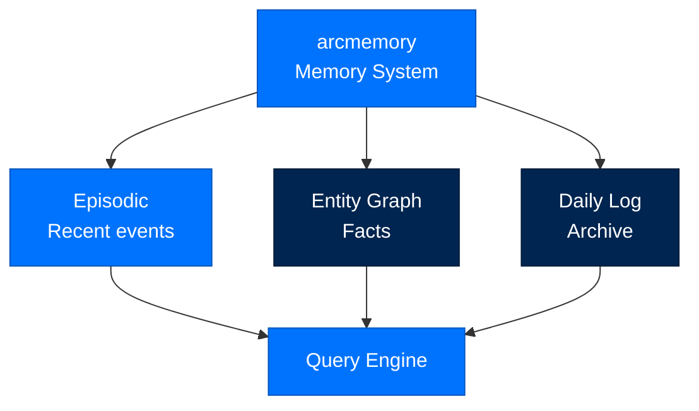
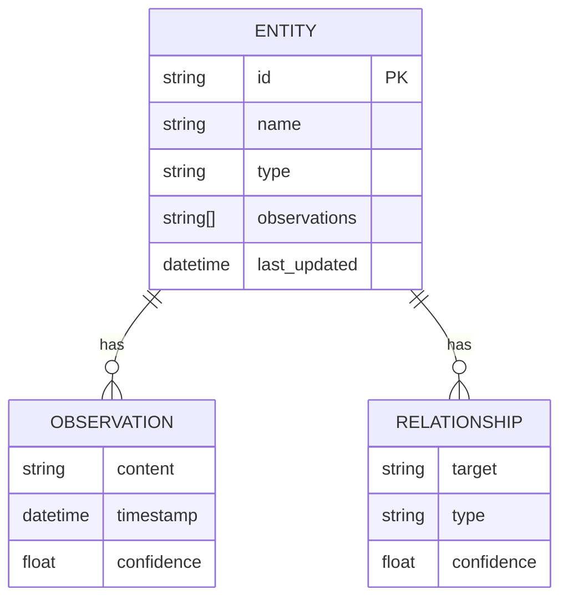
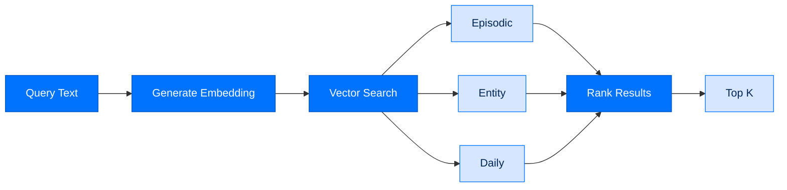

# arcmemory - Memory System

> **Building with Arc**  ·  Build  ·  page 17 of 27  
> **For** Engineers writing code against Arc  
> [← arcagent](arcagent.md)  ·  [Docs home](../../README.md)  ·  [arcskill →](arcskill.md)

---

## Overview

> **Current in 0.9:** durable memory remains workspace-local; an optional
> PostgreSQL/pgvector index implements the same removable index port, and signed
> knowledge can be explicitly promoted from personal scope to
> `arc_team()/shared/knowledge`. See the package
> [README](../../../packages/arcmemory/README.md#personal-and-fleet-shared-knowledge)
> and [setup guide](../../../packages/arcmemory/SETUP.md).

`arcmemory` provides **dual-speed memory** for agents:
- **Episodic memory** - Recent events, high recall
- **Entity graph** - Persistent facts about people/things
- **Daily log** - Long-term archival storage
- **Memory queries** - Semantic search over memory



---

## Memory Types

### Episodic Memory

High-recall storage for recent events:

```python
from arcmemory import ArcMemoryBrain, build_brain

memory = build_brain(store)

# Index an episode
episode_id = await memory.index(
    content="User asked about Q4 sales trends",
    metadata={
        "session_id": "sess_123",
        "turn": 5,
        "type": "user_query"
   }
)

# Search episodes
results = await memory.search("sales trends", k=10)
for hit in results:
    print(f"Episode: {hit.content}")
    print(f"Score: {hit.score}")
```

### Entity Graph

Persistent facts about entities:

```python
from arcmemory import Entity

# Create entity
entity = Entity(
    id="acme-corp",
    name="Acme Corporation",
    type="organization",
    observations=[
        "Founded in 1948",
        "Headquarters in New York",
        "Revenue: $1.2B in 2023"
    ]
)

await memory.upsert_entity(entity)

# Query entity
acme = await memory.get_entity("acme-corp")
for obs in acme.observations:
    print(f"Observation: {obs}")

# Entity relationships
entity.relationships.append(
    Relationship(
        target="alice",
        type="employs",
        confidence=0.9
    )
)
```

### Daily Log

Long-term archival storage:

```python
# Daily entries are written automatically
# Format: YYYY-MM-DD.jsonl

daily = await memory.get_daily("2026-07-31")
for entry in daily:
    print(f"{entry.timestamp}: {entry.content}")
```

---

## Memory Operations

### Indexing

```python
# Index with embedding
entry_id = await memory.index(
    content="Important finding about customer churn",
    metadata={
        "session_id": "sess_123",
        "importance": "high",
        "tags": ["churn", "customer", "analysis"]
    },
    embed=True  # Generate embedding
)
```

### Searching

```python
# Semantic search
results = await memory.search(
    query="customer retention strategies",
    k=5,
    min_score=0.7
)

# Filter by metadata
results = await memory.search(
    query="sales",
    filter={"tags": ["q4", "forecast"]}
)
```

### Memory Hit

```python
class MemoryHit(TypedDict):
    id: str
    content: str
    score: float
    metadata: dict
    timestamp: str
```

---

## Entity Operations

### Entity Structure



### Entity Types

| Type | Description |
|------|-------------|
| `person` | Human individual |
| `organization` | Company, team, group |
| `concept` | Abstract idea |
| `location` | Geographic place |
| `event` | Occurrence |

---

## Query Engine

### Search Pipeline



### Query Options

```python
results = await memory.search(
    query="project timeline",
    k=10,                    # Top 10 results
    min_score=0.6,           # Minimum similarity
    include_episodic=True,   # Search episodic
    include_entities=True,    # Search entities
    include_daily=True,      # Search daily log
    filter={                 # Metadata filter
        "session_id": "sess_123"
    }
)
```

---

## Proactive Recall

Besides the pull-based `search()` above, the brain can also decide — on its
own, deterministically — whether a detected moment in the conversation is
worth surfacing unprompted. No embedder or LLM sits on this path; a model-free
detector per moment `kind` decides whether to fire, then reuses the same
gated recall as `search()`.

```python
# arcagent hands memory a detected moment: a task starting, a known entity
# named, the topic shifting, or (SPEC-072) a decision point mid-loop.
text = await memory.on_moment(
    "entity_seen",
    cues=["acme-corp"],
    text="Let's revisit the Acme contract",
    clearance="unclassified",
    top_k=3,
    budget=512,
    session_id="sess_123",
)
if text:
    # an injectable <memory-result> block — inject into the prompt/context
    print(text)
```

- `kind` — `task_start`, `entity_seen`, `topic_shift`, or `decision_point`.
- Returns `""` when nothing fires or nothing novel survives dedup — a missed
  recall, never a blocked turn.
- **Working set (SPEC-072):** a bounded, decaying, per-session set of entities
  "in play" feeds the detectors, so a moment can fire on an entity named a
  prior turn even when the latest message omits it. Off-switch:
  `MemoryConfig.working_set_enabled` (default on).
- **Temporal reasoning (SPEC-072):** every recall carries `established`
  (WHEN it was written); a superseded fact shows current vs. prior rather
  than being overwritten; recency breaks ranking ties. Off-switch:
  `MemoryConfig.temporal_enabled` (default on).
- **Mid-loop decision recall (SPEC-072):** a `decision_point` moment
  (opt-in — `pre_plan` default site, `pre_tool` also opt-in) reaches the model
  between loop steps rather than at prompt assembly.

Full mechanics: [Memory Lifecycle](../../walkthrough/07-memory-lifecycle.md#proactive-recall-detected-moments-working-set-and-time).

---

## Memory Configuration

```toml
[modules.memory]
enabled = true
episodic_ttl_days = 30
daily_retention_days = 365

[memory.embedding]
provider = "openai"
model = "text-embedding-3-small"
cache_enabled = true
```

---

## API Reference

### Classes

```python
class ArcMemoryBrain:
    def __init__(self, store: MemoryStore): ...
    
    async def index(
        self,
        content: str,
        metadata: dict = None,
        embed: bool = True
    ) -> str: ...
    
    async def search(
        self,
        query: str,
        k: int = 5,
        min_score: float = 0.0,
        **filters
    ) -> list[MemoryHit]: ...
    
    async def get_entity(self, name: str) -> Entity: ...
    async def upsert_entity(self, entity: Entity) -> None: ...
    async def get_daily(self, date: str) -> list[DailyEntry]: ...

class Entity(TypedDict):
    id: str
    name: str
    type: str
    observations: list[str]
    last_updated: str

class MemoryHit(TypedDict):
    id: str
    content: str
    score: float
    metadata: dict
    timestamp: str
```

---

## Memory Lifecycle

```mermaid
flowchart LR
    classDef phase fill:#0073FE,stroke:#0055BC,color:#FFFFFF

    Create[Create<br/>index()]:::phase --> Store[Store<br/>arcstore]:::phase
    Store --> Query[Query<br/>search()]:::phase
    Query --> Retrieve[Retrieve<br/>get_entity()]:::phase
    Retrieve --> Update[Update<br/>upsert_entity()]:::phase
    Update --> Store
```

---

## Next Steps

- [Data Flow](../../walkthrough/data-flows.md) - Memory in the system
- [API Reference](../../reference/api.md) - Complete API documentation
- [Package Index](../package-index.md) - All Arc packages

---

## Verified public surface

> Introspected from the installed package on the current commit. Every name
> below is importable exactly as shown; full signatures are in the
> [API reference](../../reference/api.md#arcmemory).

### Classes

| Class | Purpose |
|---|---|
| `ACLViolation` | Raised when a memory operation violates the session ACL. |
| `AgenticResult` | Outcome of one agentic consolidation pass. |
| `ArcLLMDistiller` | arcmemory ``Distiller`` seam backed by an arcllm structured completion. |
| `ArcLLMEmbedder` | arcmemory ``Embedder`` seam backed by ``arcllm.embed`` (async, loop-safe). |
| `ArcMemoryBrain` | arcmemory's implementation of arcagent's structural ``Brain`` seam. |
| `Bundle` | The bounded, boundary-marked result of a single retrieval pass. |
| `Confidence` | Whether a memory may be acted on directly or must be verified first. |
| `ConsolidationResult` | Summary of one slow-path consolidation run (audit + observability). |
| `Consolidator` | Orchestrates one bounded consolidation run for a single agent scope. |
| `DedupReport` | Everything dedup did (or would do) for one workspace. |
| `Distiller` | The bounded structured-completion seam. Injected, never imported. |
| `Embedder` | Vector seam: turn texts into fixed-width vectors. Injected, not imported. |
| `EmbeddingUnavailableError` | A *wired* embedder that cannot serve this call — arcmemory degrades. |
| `Entity` | A person/place/project — a node in the semantic graph. |
| `EntityDisambiguator` | The single-method seam used by search-before-write identity resolution. |
| `EntityRecord` | One semantic entity as the operator view sees it. |
| `EpisodicStore` | Append + read the raw event stream for one scope. |
| `Event` | One raw episodic event — the high-volume append-only stream row. |
| `EventCandidate` | One thing-that-happened the distiller proposes (the structured-output shape). |
| `EventExtraction` | The structured result of the life-event-extraction completion. |
| `EventStore` | Read/write life-event cards for one scope. |
| `Fact` | A compact semantic fact-triplet about an entity. |
| `FactCandidate` | One fact the distiller proposes for a window (the structured-output shape). |
| `FactExtraction` | The structured result of the fact-extraction completion. |
| `FastCapture` | Wires the deterministic capture pipeline for one scope. |
| `GroupMerge` | One canonical slug and the variant files that collapse onto it. |
| `IndexRebuilder` | Re-derives fts_chunks + vec0 + edges from files + the raw stream. |
| `Insight` | A minted abstraction — the centerpiece store. |
| `InsightBundle` | The enriched neighborhood of one matched insight (SDD 7 "spot, then enrich"). |
| `InsightCandidate` | One insight the distiller proposes (the minted-abstraction shape). |
| `InsightMint` | The structured result of the insight-minting completion. |
| `InsightStore` | Read/write insight cards for one scope. |
| `LifeEvent` | A thing that HAPPENED in the user's life — a meeting, a sale, a call, a shipment. |
| `LinkRecord` | A navigable edge from a memory or entity to a linked node. |
| `MemoryACLConfig` | Tier-driven defaults for cross-session visibility. |
| `MemoryConfig` | Immutable dynamics constants + budgets for one deployment tier. |
| `MemoryDB` | Opens/creates the per-agent index DB and owns its schema. |
| `MemoryOperator` | Public read/mutation facade over one agent's memory database. |
| `MemoryPage` | A page of episodic memories plus the totals needed to paginate. |
| `MemoryRecord` | One episodic memory as the operator view sees it. |
| `MemoryTool` | A neutral tool spec — arcrun-agnostic (the adapter maps it onto arcrun). |
| `MutationResult` | The honest result of a single mutation — applied or error. |
| `MutationStatus` | Outcome of a facade mutation. There is no ``partial``. |
| `ProceduralStore` | Read/write how-to cards for one scope. |
| `Procedure` | A how-to card — a repeatable process, findable by its trigger. |
| `ReactOutcome` | The engine-neutral result of one bounded ReAct run. |
| `Recall` | One retrieved item, ready to be boundary-marked and injected. |
| `RecallCard` | A glass-box recall result — a ranked card WITH provenance and links. |
| `Reranker` | Cross-encoder seam (D-9): score how well the situation instances each candidate. |
| `Retriever` | One bounded retrieval path over the surface + structural indices for a scope. |
| `Scope` | Per-agent, shared-nothing isolation key. |
| `SemanticStatus` | The full readout: both halves of the channel, plus per-agent coverage. |
| `SemanticStore` | Read/write entity markdown + maintain the wiki-link graph for one scope. |
| `SessionACL` | Access control list for a session. |
| `Situation` | The current turn abstracted for structural retrieval. |
| `StoreReport` | Per-store (entities/procedures/insights) dedup outcome for one workspace. |
| `StructuralIndex` | Trigger-embedding + cue-graph spreading over minted insights for one scope. |
| `StructuralResult` | The bounded structural-channel result: confidence-gated recalls + degrade flag. |
| `SurfaceIndex` | Incremental surface index + fused search for one agent scope. |
| `SurfaceResult` | The bounded surface-channel result: ranked recalls + a degrade flag. |
| `TimeWindow` | The slice of the raw stream one consolidation run reads. |
| `WeightedGraph` | Hebbian/decay/spreading dynamics over the per-agent ``edges`` table. |
| `WorkspaceVectors` | How much of one agent's index actually carries a vector. |

### Functions

| Function | Signature |
|---|---|
| `boundary_mark` | `(recall: 'Recall') -> 'str'` |
| `build_brain` | `(context: 'dict[str, Any]') -> 'ArcMemoryBrain'` |
| `build_memory_tools` | `(*, workspace: 'Path \| str', db: 'MemoryDB', config: 'MemoryConfig', caller_did: 'str', session_id: ` |
| `confidence_from_hits` | `(hits: 'float', gamma: 'float') -> 'float'` |
| `dedup_workspace` | `(workspace: 'Path', *, apply: 'bool') -> 'DedupReport'` |
| `discover_workspaces` | `(root: 'Path') -> 'list[Path]'` |
| `extract_acl_from_session_data` | `(session_data: 'dict[str, Any]', config: 'MemoryACLConfig', owner_did: 'str' = '') -> 'SessionACL'` |
| `async extract_events` | `(episodes: 'list[Event]', *, distiller: 'Distiller', store: 'EventStore', graph: 'WeightedGraph', sc` |
| `async extract_facts` | `(events: 'list[Event]', *, distiller: 'Distiller', store: 'SemanticStore', config: 'MemoryConfig', e` |
| `gate_no_read_up` | `(recalls: 'list[Recall]', *, clearance: 'Classification', strict: 'bool', actor_did: 'str', tier: 's` |
| `async mint_insights` | `(events: 'list[Event]', facts: 'list[Fact]', *, distiller: 'Distiller', store: 'InsightStore', graph` |
| `render_recalls` | `(recalls: 'list[Recall]') -> 'str'` |
| `repair_backlinks` | `(store: 'SemanticStore') -> 'int'` |
| `reset_degrade_warnings` | `() -> 'None'` |
| `async resolve_entity` | `(store: 'SemanticStore', *, slug: 'str', name: 'str', entity_type: 'str', embedder: 'Embedder \| None` |
| `async run_agentic_consolidation` | `(*, episodes: 'list[Event]', model: 'object', tools: 'list[MemoryTool]', config: 'MemoryConfig', act` |
| `async run_react_loop` | `(*, model: 'Any', tools: 'list[MemoryTool]', system_prompt: 'str', task: 'str', max_turns: 'int', ma` |
| `semantic_degraded` | `() -> 'bool'` |
| `async semantic_status` | `(workspaces: 'Sequence[Path]' = (), *, embedder: 'Embedder \| None', backend: 'str' = 'local') -> 'Se` |
| `sqlite_vec_loadable` | `() -> 'bool'` |
