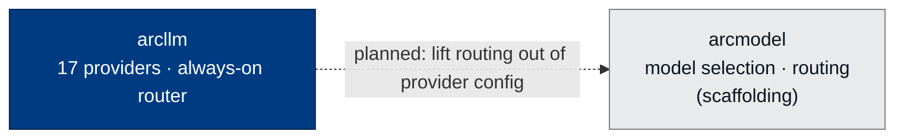

# arcmodel - Model Management and Routing

> **Building with Arc**  ·  Build  ·  page 15 of 27
> **For** Engineers writing code against Arc
> [← arcprompt](arcprompt.md)  ·  [Docs home](../../README.md)  ·  [arcagent →](arcagent.md)

---

## In one breath

`arcmodel` is a **reserved, early-scaffolding package**. It is the intended
future home for cross-tenant model *selection*, capability *discovery*, and
tiered *routing* — concerns that today live inside `arcllm` provider configs.
As shipped on this commit, the package installs and exports **`__version__`
only**. There is no public API, no class, and no function to call yet.

This page is deliberately honest about that. Everything below the "Current
state" section describes what the package *will* become, not what it does now.
If you are looking for the model layer that actually works today, that is
[`arcllm`](arcllm.md) — its always-on router already picks and calls a model on
every turn.



The dotted edge is planned, not wired. Nothing imports `arcmodel`, and
`arcmodel` declares no Arc dependency.

---

## Current state

| Fact | Value (verified on this commit) |
|---|---|
| Version | `0.0.2` (`arcmodel.__version__`) |
| Public symbols | none — only `__version__` |
| Arc dependencies | none declared |
| Reverse dependencies | none — nothing imports it |
| Source files | `src/arcmodel/__init__.py` only |
| Tests | none |
| `pyproject` status classifier | `Development Status :: 1 - Planning` |

The entire source of the package is:

```python
"""arcmodel — Arc model management. Coming soon."""

__version__ = "0.0.2"
```

That is not an omission in this document — it is the package. The package-local
`CLAUDE.md` states the rule plainly: *"Status = early scaffolding. Do not invent
a public API or dump ad-hoc routing here without an explicit product/design
decision."*

---

## What `arcllm` provides today vs. what `arcmodel` is reserved for

The division of labor is the reason `arcmodel` exists as a name before it exists
as code: the two concerns are genuinely different, and keeping them separate
keeps `arcllm` a clean provider adapter.

| Concern | Lives today in | Reserved for `arcmodel` |
|---|---|---|
| Talking to a provider's wire API (17 providers) | `arcllm` | stays in `arcllm` |
| Per-call model choice on a single turn | `arcllm` router (`load_model` always returns a router) | — |
| `[providers.<name>]` `base_url` overrides | `arcllm` config | stays in `arcllm` |
| **Cross-tenant** model catalogs with ACLs | — | `arcmodel` |
| **Capability discovery** — query a provider for its current lineup, prices, context windows | — | `arcmodel` |
| **Tier-aware fallback** — federal-only models for sensitive calls, open models otherwise | — | `arcmodel` |
| **Cost-bounded selection** — downgrade automatically as a running budget nears a ceiling | — | `arcmodel` |
| **Per-call eligibility rules** — "this call requires SOC2-certified hosting" | — | `arcmodel` |

The near-term guidance from the package's own rules: **extend the `arcllm`
registry/config for immediate needs.** Real provider HTTP stays in `arcllm`
until `arcmodel` has a defined, spec-owned seam with `arcllm`.

---

## Intended shape (not yet built)

When a spec owns this package, it is expected to sit **beside `arcllm`**,
lifting routing and model-selection concerns out of provider configs. The
planned scope, from the package README and `CLAUDE.md`:

- **Capability-aware routing** — pick the right model per call (tools / vision /
  long context / JSON mode).
- **Tier-aware fallback** — federal-only models for sensitive calls, open models
  for the rest.
- **Cost-bounded selection** — downgrade to a cheaper model as the running
  budget approaches a threshold.
- **Multi-tenant model registries** — per-organization catalogs with ACLs, so an
  org sees only its approved models.
- **Capability discovery** — query providers for the current model lineup,
  prices, and context windows.
- **Per-call eligibility** — compliance predicates that narrow the candidate set
  before selection.

None of these have a class or function on this commit. Treat the list as a
design target, not an API.

---

## Worked example

The only thing you can do with `arcmodel` today is read its version:

```python
import arcmodel

print(arcmodel.__version__)   # "0.0.2"
```

Any snippet that constructs a registry, looks up model metadata, or estimates a
cost from `arcmodel` is describing a package that does not exist yet. For a
real, callable model layer, use `arcllm`:

```python
import arcllm

# arcllm's router is always-on: load_model returns a router that picks and
# calls a concrete provider model per request.
router = arcllm.load_model("anthropic/claude-sonnet-4-5")
```

See [arcllm](arcllm.md) for the shipped model surface, including the
`[providers.<name>]` `base_url` override and the always-on router.

---

## Working here

If you are the engineer who finally builds this package:

1. **Start from a spec** (PRD/SDD) — the package rules forbid growing a public
   API without an explicit product/design decision.
2. **Define the contract with `arcllm` first** — the seam between "which model"
   (`arcmodel`) and "call this model" (`arcllm`) is the whole design.
3. **Grow the package deliberately.** An empty package is not an invitation to
   park unrelated routing code; keep concern purity intact so `arcllm` stays a
   standalone provider adapter.

---

## Verified public surface

> Introspected from the installed package on the current commit.

`arcmodel` exposes **no public Python symbols** other than `__version__`. It has
no console entry point and no submodules. When the package grows a real API,
this section and the [API reference](../../reference/api.md) will list it.

---

## Next Steps

- [arcllm](arcllm.md) — the model layer that works today (17 providers,
  always-on router)
- [Package index](../package-index.md) — all Arc packages
- [The Seam Model](../../concepts/seam-model.md) — why routing belongs behind a
  contract, not a core `if provider == …` branch
