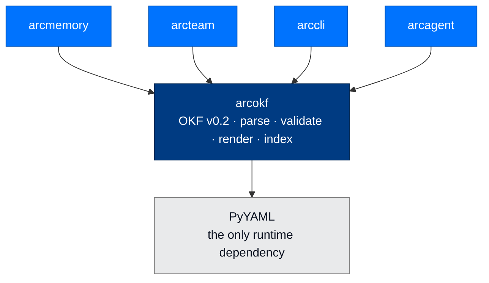

# arcokf - The Typed Document Contract for Knowledge

> **Building with Arc**  ·  Build  ·  Packages
> **For** Engineers writing code against Arc
> [Docs home](../../README.md)  ·  [Package index](../package-index.md)  ·  [arcmemory →](arcmemory.md)

---

## In one breath

`arcokf` is Arc's dependency-light **Open Knowledge Format (OKF) v0.2**
contract — the typed boundary that turns a folder of Markdown into a corpus a
store can trust. It parses a knowledge document (Markdown with a YAML
frontmatter carrying a non-empty string `type`), rejects malformed YAML and
unsafe links, and returns **structured diagnostics** so a fail-closed store can
report every problem before it writes an invalid artifact.

It is a **near-leaf contract package**. Its only runtime dependency is PyYAML;
it imports **no Arc package at all**, not even `arctrust`. Dependencies point one
way — a consumer such as `arcmemory` imports `arcokf`, and `arcokf` never imports
a consumer — which is what lets an importer, a workspace, or a third-party
plugin validate a knowledge document with no agent, memory engine, or crypto
stack installed.



---

## Why a separate contract package

`arcokf` is deliberately **not** part of `arcmemory`. OKF is the canonical
document boundary shared by workspaces, shared knowledge, importers, and
third-party plugins — and every one of those consumers must be able to validate
a document *without* installing a memory engine. Keeping the contract in a leaf
package means either side of the seam — the format, or the store that uses it —
can be removed or rewritten behind the same `parse` / `render` / `validate`
functions without breaking the other.

The one required field is what does the work. A knowledge document is Markdown
with YAML frontmatter carrying a **non-empty string `type`**. That single field
is the difference between a typed corpus and a pile of notes: a store can refuse
to write anything that would not parse back.

---

## The v0.2 document shape

```markdown
---
type: Entity
title: Arc
tags: [agent, platform]
---
# Arc

Arc is an accountable agent framework.
```

Reserved workspace files — `context.md`, `index.md`, `log.md` — may omit
frontmatter, and are **refused if they try to become typed concept documents**
(they carry operational state, not knowledge). Operational TOML, JSON, JSONL,
signature, and audit files are not OKF documents and sit intentionally outside
this contract.

The bounds are constants in `arcokf.core`, and every one exists to stop an
input from becoming a denial-of-service:

| Constant | Value | Why |
|---|---|---|
| `MAX_DOCUMENT_BYTES` | 2,000,000 | A knowledge document is a document, not a data dump |
| `MAX_FRONTMATTER_BYTES` | 256,000 | Metadata is metadata; the body carries the content |
| `MAX_NESTING` | 32 | Bounds the recursive structure walk |
| `MAX_ALIASES` | 16 | Stops YAML alias expansion (the "billion laughs" class) |
| `VERSION` | `"0.2"` | The contract version this build implements |

---

## Documents and validation (`arcokf.core`)

The core module parses and validates one document at a time. The design choice
that shapes the whole API: **validation returns diagnostics, it does not raise**
— because a store about to write a batch of documents needs to know *everything*
wrong with them before it writes any. An exception reports the first problem and
destroys the rest of the pass; a `ValidationResult` reports all of them and
leaves the write to the caller.

| Symbol | What it does |
|---|---|
| `Document` | Frozen dataclass: `metadata` mapping, Markdown `body`, optional source `path` |
| `validate(source, *, path=None)` | Validate `str` or `bytes`. **Never raises** — returns a `ValidationResult` |
| `parse(source, *, path=None)` | Validate, then return the `Document`; raises `OKFValidationError` if invalid |
| `render(document)` | Serialize to `---` frontmatter (sorted keys, unicode preserved) + body, **re-validating the result before returning it** so `render` never hands back a bad artifact |
| `lint(path)` | Validate one UTF-8 file from disk, keeping its POSIX path on every diagnostic. An unreadable file is a diagnostic, not an exception |
| `ValidationResult` | `valid` flag, `diagnostics` tuple, and the `Document` — present only when the result is clean |
| `Diagnostic` | Frozen `code` / `message` / `path` triple |
| `DiagnosticCode` | The `StrEnum` of every refusal reason |
| `OKFValidationError` | Raised by `parse` / `render`; carries the full `diagnostics` tuple |

The two entry points — `validate` (never raises) and `parse` (raises on
invalid) — exist for two call sites. Use `parse` where invalid input must stop
the caller cold; use `validate` or `lint` where a caller needs to collect and
report structured diagnostics first.

### The diagnostic codes

The eleven members of `DiagnosticCode` are machine-routable by the calling
store — each names exactly one refusal reason:

`invalid_utf8`, `invalid_frontmatter`, `duplicate_key`, `missing_type`,
`invalid_type`, `document_too_large`, `frontmatter_too_large`,
`nesting_too_deep`, `too_many_aliases`, `wiki_link`, `reserved_document`.

### The hardened YAML loader

Frontmatter is parsed by a `SafeLoader` subclass built in `core.py`, not by a
default loader. Three hardening properties come from it:

- **No arbitrary object construction, ever** — it is a `SafeLoader`, so a
  frontmatter tag cannot instantiate a Python object.
- **Duplicate-key refusal** — a repeated frontmatter key is a `duplicate_key`
  diagnostic, not a silent last-write-wins overwrite (the loader's mapping
  constructor rejects it).
- **Alias-bomb ceiling** — more than `MAX_ALIASES` (16) aliases stops
  composition, defeating the billion-laughs expansion attack (`_compose_node`).

A body containing a wiki-link (`[[target]]`) fails validation with a `wiki_link`
diagnostic: `[[…]]` is not a standard OKF link, so shipping one would ship a
dangling reference rather than a real link.

---

## Collection indexes (`arcokf.index`)

A collection index is deliberately a plain reserved `index.md`. Machine-readable
HTML entry comments (`<!-- arcokf:entry:{…} -->`) make validation unambiguous,
while the adjacent Markdown links stay useful to a person browsing the folder.
`arcokf` only renders and validates an index; the **owning store decides when to
write one**.

| Symbol | What it does |
|---|---|
| `CollectionEntry` | One authorized document: relative `path`, `title`, SHA-256 `digest`, one-line `summary` |
| `render_collection_index(entries)` | Render the canonical index — sorted by path, with a whole-inventory SHA-256 and a per-entry JSON comment |
| `validate_collection_index(index, root=None)` | Parse and canonicality-check an index; with a `root`, also re-inventory the tree, re-digest every listed file, and re-lint it as OKF |
| `inventory_documents(root)` | Deterministically enumerate the authorized documents under `root` |
| `document_entry(path, root)` | Build one entry for a single document without walking its siblings; returns `None` when the document is invalid or not `unclassified` |
| `CollectionIndexValidation` | `valid`, `error`, and the parsed `entries` tuple |
| `CollectionIndexError` | Raised internally for any entry that cannot be represented safely; surfaced as `error` text on the validation result |

The short aliases `render_index` and `validate_index` live on the submodule
(`arcokf.index`) for a store's convenience; the explicit names are the
documented public API off the package root.

Three properties make the index tamper-evident rather than merely tidy:

- **Canonical round-trip check.** `_parse_index` re-renders the entries it just
  parsed and compares the result to the file **byte for byte**. Anything a hand
  edit could do — reordering, an added link line, a tweaked summary, a swapped
  digest — changes those bytes, so tamper detection needs no separate signature.
- **Hash-verifiable inventory.** One SHA-256 digest covers the whole canonical
  entry list, and each entry carries a per-document digest. A stale or edited
  corpus is detectable without re-reading every file; `validate_collection_index`
  with a `root` re-inventories the tree and refuses a stale or tampered index.
- **Classification floor.** Only a document explicitly labelled
  `classification: unclassified` enters a shared index (`document_entry` returns
  `None` otherwise). A missing, malformed, or elevated label is silently omitted,
  so an index can never advertise the existence of something its readers may not
  see. A higher-clearance collection gets its own owner and its own index.

Path guards run at entry construction (`_validate_entry`): absolute paths, `..`
traversal, non-`.md` suffixes, reserved names (`index.md`, `context.md`,
`log.md`), and operational directories (`.git`, `.arc`, `audit`, `secrets`,
`credentials`, …) are all refused before an entry is ever accepted.

---

## Worked example

```python
from pathlib import Path

from arcokf import Document, lint, parse, render, validate

# 1. Author a typed document. `type` is the one required frontmatter field.
document = Document({"type": "Entity", "title": "Arc"}, "# Arc\n")

# 2. Render it — frontmatter is emitted with sorted keys, and the result is
#    validated before it is returned, so render() never hands back a bad artifact.
encoded = render(document)
assert validate(encoded).valid

# 3. Parse it back. parse() raises OKFValidationError on invalid input.
parsed = parse(encoded)
assert parsed.metadata["type"] == "Entity"

# 4. Lint a file on disk. lint() never raises — it returns every diagnostic
#    so a fail-closed store can report all of them and write nothing.
result = lint(Path("workspace/knowledge/arc.md"))
if not result.valid:
    for diagnostic in result.diagnostics:
        print(diagnostic.code, diagnostic.message, diagnostic.path)
```

Building and verifying a collection index over a folder of documents:

```python
from pathlib import Path

from arcokf import (
    inventory_documents,
    render_collection_index,
    validate_collection_index,
)

root = Path("workspace/knowledge")

# Enumerate the authorized `unclassified` documents and render the canonical index.
entries = inventory_documents(root)
(root / "index.md").write_text(render_collection_index(entries), encoding="utf-8")

# Later: verify the index is canonical AND every listed file still hashes correctly.
validation = validate_collection_index(root / "index.md", root)
assert validation.valid, validation.error
```

---

## How Arc consumes it

`arcmemory` is the primary consumer, and it reaches `arcokf` through a single
choke point rather than scattering parse calls across the engine:

- **`arcmemory.mdfile`** is *"the single place that reads, renders, and"* writes
  a frontmatter document. It imports `Document`, `OKFValidationError`, `parse`,
  and `render` from `arcokf`, so every memory file is a validated OKF v0.2
  document on the way in and out.
- **`arcmemory.collection_index`** wraps `inventory_documents`,
  `render_collection_index`, `document_entry`, and `validate_collection_index`
  to keep a knowledge folder's `index.md` in sync and tamper-checked.
- **`arcteam`** (shared knowledge and per-agent memory storage), **`arccli`**
  (agent create / run), and several **`arcagent` modules** (workpad,
  user_profile) validate documents through the same contract.

Because the contract is a leaf, any of these can be rewritten behind the
unchanged `parse` / `render` / `validate` functions without touching `arcokf`.

---

## Threat surface

OKF is where untrusted knowledge enters the agent, so its refusals map directly
onto the OWASP LLM and agentic surfaces:

| Threat | How `arcokf` defends |
|---|---|
| **LLM04 Data poisoning** | A poisoned or malformed document fails validation and is never written; a store can refuse an entire batch on the first diagnostic without a partial commit |
| **ASI06 Memory / context poisoning** | The canonical round-trip check and per-document digests make an edited corpus detectable without re-reading it; a hand-tampered `index.md` fails canonicality |
| **Classification laundering** | The classification floor lets only `unclassified` documents into a shared index; a missing or elevated label is omitted, never listed |
| **Path traversal / arbitrary read** | Entry construction refuses absolute paths, `..` segments, reserved names, and operational directories before an entry exists |
| **Denial of service** | Hard bounds on document size, frontmatter size, nesting depth, and YAML aliases stop oversized inputs and alias bombs at parse time |
| **Unsafe links** | A `[[wiki-link]]` in a body is a `wiki_link` refusal — a non-standard link never ships as a dangling reference |

---

## Failure modes

- **Invalid input to `parse` / `render`** → `OKFValidationError`, carrying the
  full `diagnostics` tuple. Every problem is on the exception, not just the first.
- **Invalid input to `validate` / `lint`** → a `ValidationResult` with
  `valid=False` and a populated `diagnostics` tuple; **no exception**, and
  `result.document` is `None`.
- **Unreadable file passed to `lint`** → an `invalid_utf8` diagnostic on the
  result (the `OSError` is captured, not raised).
- **Tampered or stale collection index** → `validate_collection_index` returns
  `CollectionIndexValidation(valid=False, error=…)`; the underlying
  `CollectionIndexError` is surfaced as `error` text, never raised to the caller.

Every failure mode leaves the decision — and the write — with the caller. That
is the point of the contract.

---

## Verified public surface

> Introspected from `arcokf/__init__.py` on the current commit. Every name is
> importable as `from arcokf import <name>`.

**From `arcokf.core`:** `VERSION`, `Document`, `Diagnostic`, `DiagnosticCode`,
`ValidationResult`, `OKFValidationError`, `validate`, `parse`, `render`, `lint`.

**From `arcokf.index`:** `CollectionEntry`, `CollectionIndexValidation`,
`CollectionIndexError`, `render_collection_index`, `validate_collection_index`,
`inventory_documents`, `document_entry`, plus the submodule aliases
`render_index` and `validate_index`.

---

## Status

- **Contract version:** OKF v0.2 (`VERSION == "0.2"`)
- **Runtime dependency:** PyYAML only — no Arc imports
- **Tests:** `packages/arcokf/tests/` (`test_okf.py`, `test_index.py`)
- **Type check:** `mypy --strict` clean · **Lint:** `ruff check` clean

```bash
uv run --no-sync pytest packages/arcokf/tests
```

---

## Next Steps

- [arcmemory](arcmemory.md) — the primary consumer; the dual-speed memory engine
  that stores every file as a validated OKF document
- [Package index](../package-index.md) — all Arc packages
- [The Seam Model](../../concepts/seam-model.md) — why the document format is a
  leaf contract, not a feature of the memory engine
