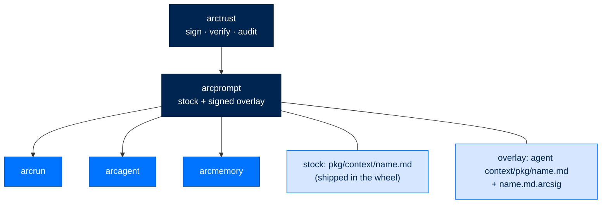
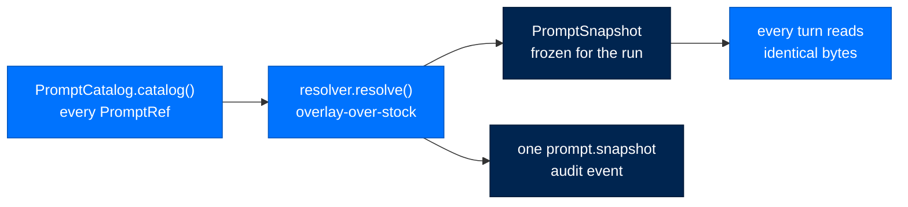

# arcprompt - Editable, Signed System Prompts

> **Building with Arc**  ·  Build  ·  page 14 of 27
> **For** Engineers writing code against Arc
> [← arcstore](arcstore.md)  ·  [Docs home](../../README.md)  ·  [arcmodel →](arcmodel.md)

---

## In one breath

`arcprompt` is where an agent's **system prompts live as protected artifacts**
instead of string literals buried in code. Every packaged prompt ships as a
markdown file with YAML frontmatter — a *stock* prompt — inside the package that
owns it. An operator may override any one of them with a signed markdown
*overlay*, and resolution is exactly two layers: overlay if present and valid,
otherwise stock, first match wins. The effective set is resolved **once per run**
and frozen, so every turn of a run sees the identical bytes, and one audit event
records the source, digest, and signer of every prompt the run used.

That is the whole idea: a system prompt is control-plane instruction, not
ordinary mutable text. Editing a file on disk cannot change what an agent
believes, because an overlay only takes effect when it carries a valid Ed25519
signature from the **deployment operator's** key — and a present-but-broken
overlay fails **loud**, never silently falling back to stock. This is the seam
that lets a non-technical user run entirely on stock with zero setup, lets an
operator tune a prompt through a signed edit, and lets a federal auditor attribute
a run's behavior to exact bytes — all without any of them touching code.

`arcprompt` is a **leaf**: it imports only `arctrust`, and the packages that own
prompts (`arcrun`, `arcagent`, `arcmemory`) import *it*. It never imports a
consumer. A decoupled consumer that must stay leaf-clean — `arcskill` is the
example — is *handed* overlay-aware resolution as a plain callable rather than
importing `arcprompt` at all.



---

## Where prompts live

A prompt has two possible homes, checked in a fixed order.

| Layer | Location | Signed? | Who authors it |
|---|---|---|---|
| **Stock** | `packages/<pkg>/src/<pkg>/context/<name>.md`, shipped in the wheel | No — nothing signs packaged text | The package maintainer |
| **Overlay** | `<agent_root>/context/<package>/<name>.md` with a detached `<name>.md.arcsig` sidecar | Yes — Ed25519, pinned to the operator key | The deployment operator, through `arc prompt edit` or arcui |

Stock is the normal path — most deployments have no overlays at all, and a
package named in the scan list but not installed is simply skipped. The overlay
root is the agent's `context/` directory, which sits **inside the agent config
root but outside the workspace subtree** that the agent's own file tools are
confined to. An agent cannot write its own overlay with the `write` tool; only an
operator holding the signing key can author one.

`DEFAULT_PROMPT_PACKAGES` is the fixed set of prompt-shipping packages the
catalog scans: `arcrun`, `arcagent`, `arcmemory`, `arcskill`. Adding a new
prompt-shipping package means adding it to that tuple.

---

## The prompt model

A prompt file is markdown with a YAML frontmatter block:

```markdown
---
name: consolidation_system
description: Instructs the memory consolidation pass.
tunable: true
---
You are the consolidation pass. Merge the day's episodic traces...
```

`parse_prompt(raw, *, source, signer_did=None)` turns the raw bytes into a frozen
`PromptDocument`. `PromptFrontmatter` validates the three fields:

- **`name`** and **`description`** — required strings.
- **`tunable`** — defaults to `True`; it is *inert metadata* in v1 (parsed and
  preserved, enforces nothing until a future optimizer exists).

Two rules make the model trustworthy:

1. **Version identity is the digest of the raw file bytes**, computed with
   `arctrust.artifact.content_sha256` and stored as `PromptDocument.sha256`. An
   authored `version:` field is *ignored* (`extra="ignore"` on the frontmatter
   model). The digest is taken over the same bytes an overlay's `.arcsig` signs,
   so a document's `sha256` and its signature manifest agree by construction.

2. **The newline rule.** The stored `body` is the text after the frontmatter with
   exactly one trailing newline removed, and `render_prompt(...)` writes a body
   verbatim followed by a single terminating newline. The round-trip
   `parse_prompt(render_prompt(C, ...)).body == C` holds for any body `C`,
   including one that already ends in a newline — the property that makes prompt
   authoring and the byte-identity migration provably faithful.

An empty body, malformed frontmatter, non-UTF-8 bytes, or frontmatter that is not
a YAML mapping all raise `PromptUnparseable` — a prompt file is never accepted
half-parsed.

---

## Loading a stock prompt

A package loading its *own* shipped prompt does not need overlay machinery. It
calls one of two convenience entry points:

- `load_stock(package, name) -> str` returns the prompt **body**.
- `load_stock_document(package, name) -> PromptDocument` returns the full parsed
  document (frontmatter, body, digest).

`arcrun`, `arcagent`, and `arcmemory` all take this path for their built-in
prompts. `PromptCatalog` is the discovery layer over the whole set:
`PromptCatalog().catalog()` returns a sorted list of `PromptRef` (package, name,
description, stock path) for every discoverable stock prompt — this is what lists
a prompt that has no overlay.

Every lookup validates that `package` and `name` are safe single path components
before any filesystem access. A separator, a NUL, a bare `.` or `..` — anything
that could traverse out of the packaged `context/` directory or an agent's
overlay root — raises `PromptMissing` rather than reading an arbitrary `.md`
file. This check lives at the arcprompt chokepoint (`_ensure_safe`), so no caller
(an arcui route, a CLI argv, an agent) can turn a prompt lookup into an arbitrary
file read regardless of its own diligence (SEC-04).

---

## Overlays: sign, pin, verify

Overlay-aware resolution is `PromptResolver`, constructed **once per agent** and
held for the run — never re-deriving posture or re-reading a key per call. It
carries four things:

```text
PromptResolver(
    overlay_root=<agent_root>/context,   # where operator overlays live
    trusted_public_key=<operator key>,   # the single pinned Ed25519 verify key
    posture=TrustPosture.PERSONAL|ENTERPRISE|FEDERAL,
    catalog=PromptCatalog(),             # stock fallback
)
```

`resolve(package, name)` checks the two layers in order and returns the first
match as a `PromptDocument`:

| Situation | Outcome |
|---|---|
| No overlay file present | Stock, silently — the normal path |
| Overlay present and signature valid | Overlay |
| Overlay present but broken / unsigned / wrong-key | **Raise** `PromptUnsigned` — never a silent fall-through to stock |
| Stock absent when it is needed | `PromptMissing` — a packaging error naming the wheel and the missing file |

Verification is delegated to `SignatureVerifier`, a thin wrapper over
`arctrust.artifact.verify_artifact`. Two properties make it a real floor:

- **Verification is unconditional at every tier.** There is no bypass flag; a
  `personal` agent verifies an overlay exactly as a `federal` one does. Posture
  is recorded for the audit trail, it does not gate whether to verify.
- **Pinning is mandatory.** A `None` pinned key makes `verify()` return `False`,
  not skip — an unpinned gate would accept *any* self-consistent signature, so
  an attacker could self-sign a malicious overlay with a random keypair. A
  missing pin therefore fails closed: stock still resolves, but no overlay is
  ever honored.

The pinned key is the **deployment operator's** public key, not the agent's own
DID. Overlays are authored and signed by the operator (through arcui's signing
authority or `arc prompt edit`); pinning the operator key here is exactly what
makes an operator override verify while an agent-authored file does not.

---

## Freezing a run: snapshot and provenance

At run start the agent resolves the complete prompt set once and freezes it. That
is `snapshot(resolver, refs, *, actor_did, sink, request_id=None)`, which returns
an immutable `PromptSnapshot` — a mapping of `(package, name)` to its resolved
`PromptDocument` — and emits **exactly one** audit event with action
`prompt.snapshot`.

Every turn of the run reads from that frozen snapshot, so an overlay file changed
mid-run has no effect until the *next* run; a per-turn re-read could shift a
prompt between turns with no single version to attribute. The provenance event
enumerates every prompt with its `package`, `name`, resolution `source`
(`stock`/`overlay`), `sha256`, and — for overlays — the resolved `signer_did`.
The event's `tier` is the resolver's held posture and each `signer_did` is the
overlay's real signer: both are *resolved* values, never a hardcoded default, so
a federal agent's audit trail never reads a personal/default value.



---

## Relationship to the arcagent system prompt

`arcprompt` owns *storage and resolution*; the **consuming agent owns assembly**.
The wiring lives in arcagent's run-start prompt context module.

- At agent setup, arcagent builds one `PromptResolver` pinned to the operator's
  key (`build_prompt_resolver`), degrading an unknown tier to `personal` rather
  than raising, and returning `None` for the pinned key on a bare/test agent so
  overlays are refused (fail-closed) while stock still resolves.
- At run start, arcagent calls `snapshot_run_prompts(...)`, which resolves
  `PromptCatalog().catalog()` and emits the one provenance event through a small
  adapter onto the agent's telemetry audit sink.
- The frozen snapshot then backs a `(package, name) -> body` closure
  (`snapshot_resolver`) that is passed into arcrun's `get_strategy_prompts(...)`
  and used for arcagent's own assembled sections. Every prompt in the assembled
  system prompt therefore comes from the single run-frozen snapshot — the same
  bytes the provenance event recorded.

The seam between packages is the `PromptResolve` type — `Callable[[str, str], str]`,
i.e. `(package, name) -> effective body`. `arcrun.get_strategy_prompts` accepts a
`resolve: PromptResolve = load_stock` parameter: handed the snapshot closure it
serves overlay-aware bytes; handed nothing it defaults to stock. This is how a
consumer that never imports `arcprompt` still honors an operator override — it is
given the resolution, it does not reach for it.

---

## A prompt is a protected artifact

Treating a system prompt as ordinary editable text is the vulnerability, not the
feature. `arcprompt` is the mitigation for two OWASP-relevant threats.

| Threat | How arcprompt answers it |
|---|---|
| **LLM07 — System-prompt leakage & tampering** | Prompts are content-addressed (`sha256` over raw bytes) and, for overlays, signed. A tampered overlay fails verification and the run refuses it; the provenance event records the exact digest and signer of what actually ran, so a leaked or altered prompt is detectable after the fact. |
| **ASI06 — Memory & context poisoning** | An agent's own file tools are fenced to the workspace subtree; the overlay root sits outside it. An agent cannot write itself a new system prompt by editing a file, because only an operator-key-signed overlay is honored, and a broken one fails loud rather than silently taking effect. |

The doctrine, in one line: **direct filesystem edits never change what an agent
trusts.** A prompt overlay is control-plane instruction; it is verified before
its text can enter a model context, at every tier, with no bypass.

---

## Failure modes and inspection

All failures are typed exceptions under `PromptError` — Arc surfaces failures
loudly, never as a silent fallback.

| Exception | Cause | What it means |
|---|---|---|
| `PromptUnparseable` | Malformed frontmatter, empty body, non-UTF-8, or non-mapping YAML in a stock or overlay file | The file is not a valid prompt; fix the bytes |
| `PromptUnsigned` | An overlay has no `.arcsig` sidecar, an unparseable manifest, or a signature that fails against the pinned key | A deliberate override will not vanish unnoticed — it stops the run instead |
| `PromptMissing` | A requested stock prompt is not packaged, or an identifier is not a safe path component | A packaging error (declare the file in artifacts) or a rejected traversal attempt |

Inspect and edit prompts through the `arc prompt` CLI:

```bash
arc prompt list             # every prompt, marked stock / overridden
arc prompt show <pkg> <name>  # print the stock or effective body
arc prompt diff <pkg> <name>  # unified diff of stock vs effective
arc prompt edit <pkg> <name>  # author + sign an operator overlay
arc prompt reset <pkg> <name> # remove the overlay; resolve to stock next run
```

`edit` is the only path that writes an overlay, and it signs the result with the
operator key so the next run's resolver will accept it. `reset` removes the
overlay so resolution falls back to stock on the following run.

---

## Worked example: override a memory prompt, safely

An operator wants the memory consolidation prompt to add a house style rule.

1. **Author and sign the overlay.** `arc prompt edit arcmemory consolidation_system`
   opens the effective body, and on save writes
   `<agent_root>/context/arcmemory/consolidation_system.md` plus a detached
   `consolidation_system.md.arcsig` signed with the operator key. Under the hood
   the bytes are produced by `render_prompt(body, name=..., description=...)` and
   the signature covers those exact bytes.

2. **Nothing changes yet.** The overlay only takes effect at the *next* run start,
   when the resolver freezes a new snapshot. A run already in flight keeps its
   frozen bytes.

3. **Next run resolves overlay-over-stock.** `PromptResolver.resolve("arcmemory",
   "consolidation_system")` finds the overlay, `SignatureVerifier` checks it
   against the pinned operator key, and the overlay `PromptDocument` (with its
   `signer_did`) is returned. The `prompt.snapshot` audit event records
   `source="overlay"`, the new `sha256`, and the operator's `signer_did`.

4. **If the sidecar is deleted or corrupted.** The next run raises
   `PromptUnsigned` for that prompt rather than silently reverting to stock — the
   operator's intent is never dropped without a trace. `arc prompt reset` is the
   deliberate way back to stock.

5. **A decoupled consumer sees it too.** If the overridden prompt belonged to
   `arcskill`, arcskill would still never import `arcprompt`; arcagent hands it the
   snapshot-backed `PromptResolve` closure, so the operator's edit reaches
   arcskill's prompt while arcskill stays a clean leaf.

---

## Verified public surface

> Every name below is importable from `arcprompt` exactly as shown on the current
> commit; full signatures are in the [API reference](../../reference/api.md#arcprompt),
> and the prompt authoring/overlay guide is in
> [Reference · Prompts](../../reference/prompts.md).

### Classes

| Class | Purpose |
|---|---|
| `PromptCatalog` | Enumerate stock prompts across a fixed set of installed packages. |
| `PromptRef` | A discovered stock prompt: package, name, description, stock path — enough to list and locate without loading overlays. |
| `PromptDocument` | A resolved prompt: validated frontmatter, body, derived `sha256`, source, and (overlay) signer DID. |
| `PromptFrontmatter` | Validated frontmatter (`name`, `description`, `tunable`); an authored `version` is ignored. |
| `PromptResolver` | Overlay-over-stock, first-match-wins resolution against a pinned key and held posture. |
| `PromptSnapshot` | Immutable per-run mapping of `(package, name)` to its resolved document. |
| `SignatureVerifier` | Verify an overlay's detached signature against a single pinned public key; unpinned fails closed. |
| `TrustPosture` | `personal` / `enterprise` / `federal` — stringency carried for provenance, not a verification gate. |
| `PromptError` | Base class for every arcprompt failure. |
| `PromptUnparseable` | Malformed frontmatter or empty body. |
| `PromptUnsigned` | Overlay signature missing, invalid, or wrong-key. |
| `PromptMissing` | A packaged stock prompt is absent, or an identifier is unsafe. |

### Functions and types

| Name | Signature / shape |
|---|---|
| `load_stock` | `(package: str, name: str) -> str` — the stock prompt body |
| `load_stock_document` | `(package: str, name: str) -> PromptDocument` |
| `parse_prompt` | `(raw: bytes, *, source: Source, signer_did: str \| None = None) -> PromptDocument` |
| `render_prompt` | `(body: str, *, name: str, description: str, tunable: bool = True) -> bytes` |
| `snapshot` | `(resolver, refs, *, actor_did, sink, request_id=None) -> PromptSnapshot` |
| `PromptResolve` | `Callable[[str, str], str]` — the `(package, name) -> body` seam a consumer accepts |
| `DEFAULT_PROMPT_PACKAGES` | `("arcrun", "arcagent", "arcmemory", "arcskill")` |

---

## Next steps

- [The Seam Model](../../concepts/seam-model.md) — why every capability, prompts included, plugs into a typed port
- [The Security Model](../../walkthrough/10-security-model.md) — how the Four Pillars ride every seam
- [arcskill →](arcskill.md) — the decoupled consumer that is *handed* overlay-aware resolution
- [Package Index](../package-index.md) — all Arc packages
