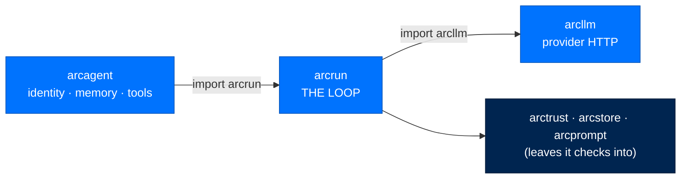
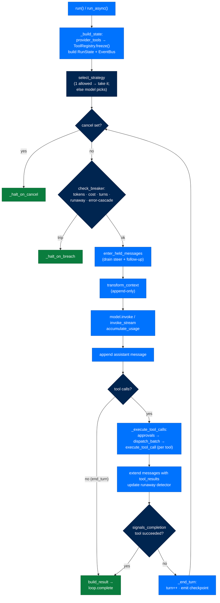

# arcrun - Execution Loop

> **Building with Arc**  ·  Build  ·  page 11 of 27  
> **For** Engineers writing code against Arc  
> [← arcllm](arcllm.md)  ·  [Docs home](../../README.md)  ·  [arctrust →](arctrust.md)

---

## In one breath

`arcrun` is the **runtime loop**. Give it a model, a set of capabilities, a
system prompt, and a task, and it runs the think → act → observe cycle — call
the model, dispatch the tools the model asked for, feed the results back,
repeat — until the task finishes, a budget trips, or an operator stops it. It
streams every step as it happens, hands back a control handle so a run can be
steered or cancelled mid-flight, and emits a tamper-evident chain of events so
you can prove after the fact exactly what the loop did.

It owns **the loop and nothing else**. It does not know how to talk to a
provider's HTTP API (that is `arcllm`, one layer down). It does not own an
agent's identity, memory, skills, or sessions (that is `arcagent`, one layer
up). Between those two, `arcrun` is the one place a model call turns into a
sequence of decisions and actions.



---

## The concern boundary

Arc's non-negotiable rule is that three concerns never mix (by policy).
`arcrun` sits in the middle of the split:

| Concern | Package | What it must **not** do |
|---|---|---|
| LLM calls (17 providers, HTTP, streaming, cost) | `arcllm` | know about loops or agents |
| **Loop execution** (turns, dispatch, budgets, events) | **`arcrun`** | know about a provider's wire API or an agent's brain |
| Agent (tools' origin, skills, memory, sessions, identity) | `arcagent` | own loop or LLM-call logic |

Concretely:

- `arcrun` calls the model through a duck-typed handle (`model.invoke` /
  `model.invoke_stream`) — it never `import`s a provider SDK. The `arcrun.model`
  module is a thin **re-export** of the `arcllm` facade so a caller can reach
  the model types through one root import.
- `arcrun` never persists anything itself. It *emits* checkpoints and events; a
  caller (the agent's `SessionManager`, arcstore) writes them. It holds no key
  material and resolves no `~/.arc` path — the host injects a `RunSeal` and a
  `work_dir` when a run needs to sign or persist.
- `arcrun` never decides *whether* an action is allowed on trust grounds. It
  records **who** asked (`caller_did` / `actor_did`) and lets the caller's
  policy layer make the call. It is, in its own words, "a dumb but *identified*
  queue."

ADR-032 is the load-bearing consequence: **every model call in the stack has
one owner — `arcrun`.** No layer above holds a provider handle. That is why the
package exposes `run_oneshot` and `run_structured` (below) — so a gate, label,
or plan that needs a model but not a loop still goes through `arcrun`.

---

## Layer and dependencies

**Depends on** (one way, never up):

- `arcllm` — the model facade, re-exported through `arcrun.model`.
- `arctrust` — audit events (`AuditEvent`, `emit`) for stream lifecycle; imported
  lazily and fail-open so audit never breaks a run.
- `arcstore` — the operational spool (`arcstore.spool`, `arcstore.records`) that
  loop and tool events are mirrored to, and `request_context` for run-id
  correlation.
- `arcprompt` — stock strategy/prompt markdown under `arcrun/context/`, resolved
  through `load_stock` so an operator overlay is honored.

**Imported by:** `arcagent` (through the `import arcrun` facade only — never a
deep import), and nothing lower. The one-way layering is enforced by
`tests/test_layering.py` and the repo's AST architecture guards; a reverse or
skip-level import fails the build.

---

## Every module, and what it owns

```
src/arcrun/
  __init__.py          # public facade — one flat re-export surface
  loop.py              # run / run_async / run_oneshot / run_structured + RunHandle
  streams.py           # run_stream / collect / stream_llm_response + StreamEvent types
  state.py             # RunState — per-run mutable state, budgets, breakers, queues
  types.py             # Tool, ToolContext, ParentRunContext, LoopResult, SandboxConfig
  checkpoint.py        # LoopCheckpoint + to_checkpoint / apply_checkpoint (SPEC-043)
  capabilities.py      # CapabilityProvider Protocol, StaticProvider, provider_tools
  registry.py          # ToolRegistry — the per-run, frozen tool collection
  executor.py          # execute_tool_call — the one per-tool dispatch pipeline
  parallel_dispatch.py # BatchClassifier + dispatch_batch / dispatch_ready
  events.py            # EventBus, Event, verify_chain — SHA-256 hash chain
  ledger.py            # ToolExecutionLedger — exactly-once tool execution
  sandbox.py           # Sandbox — per-tool permission gate (allowlist + check callback)
  model.py             # re-export of the arcllm model facade
  prompts.py           # get_strategy_prompts — model-facing strategy guidance
  _messages.py         # SystemPrompt alias + message-construction helpers
  strategies/          # react (default) · code · dynamic · oneshot · plan_execute + selection
  dynamic/             # restricted-Python orchestration: grammar · host · interpreter · journal · seal
  builtins/            # execute_python / contained_execute_python / run_shell / task_complete
  backends/            # ExecutorBackend seam: local · docker · vm(firecracker) · loader · policy
  context/             # stock system-prompt / strategy markdown (via arcprompt)
```

| Module | Responsibility |
|---|---|
| `loop.py` | The blocking (`run`) and non-blocking (`run_async`) entry points, the tiny bounded entries (`run_oneshot`, `run_structured`), and `RunHandle` (steer / follow-up / cancel / result). Pure orchestration — `_build_state` wires everything, `_select_then_run` guarantees a terminal event. |
| `streams.py` | `run_stream` wraps the loop and yields typed `StreamEvent`s; `collect` drains a stream to a `RunResult`; `stream_llm_response` streams one model call with no loop. |
| `state.py` | `RunState`: the mutable heart of a single run — messages, token/cost counters, turn count, circuit-breaker state, steer/follow-up queues, deadline, cancel machinery, injected hooks. `Injection` tags each steer/follow-up with its `caller_did`. |
| `types.py` | The public contracts: `Tool`, `ToolContext`, `ParentRunContext` (immutable snapshot passed to a tool), `LoopResult`, `SandboxConfig`. |
| `checkpoint.py` | `LoopCheckpoint` (immutable turn-boundary snapshot) and `to_checkpoint` / `apply_checkpoint`. Deterministic resume; fail-closed on a changed tool set. |
| `capabilities.py` | `CapabilityProvider` — the Protocol the loop actually runs against (ADR-023). `provider_tools` turns an `advertise()` manifest into the internal tool list; `StaticProvider` adapts a plain `list[Tool]`. |
| `registry.py` | `ToolRegistry` — built once, `freeze()`d before turn one, immutable for the run. Memoizes the arcllm schema list so the provider cache prefix stays byte-stable. |
| `executor.py` | `execute_tool_call` — the single per-tool pipeline every strategy shares: digest → permission check → schema-validate → ledger → execute-with-timeout → events. |
| `parallel_dispatch.py` | `BatchClassifier` decides if a turn's calls may run concurrently; `dispatch_batch` runs them parallel (semaphore-bounded) or sequential, fail-closed. |
| `events.py` | `EventBus` emits a SHA-256 **hash-chained** event log; `verify_chain` proves tamper-evidence; lifecycle/tool events mirror to the arcstore spool (fail-open). |
| `ledger.py` | `ToolExecutionLedger` — idempotent, exactly-once tool execution keyed on a canonical invocation key (replay-safe across a crash/resume). |
| `sandbox.py` | `Sandbox` — a lightweight **permission gate** run before every tool: allowlist plus an optional async `check` callback, deny-by-default when configured, fail-safe on callback error. |
| `strategies/` | The pluggable loop shapes and the selector (below). |
| `dynamic/` | The restricted-Python orchestration subsystem (below) — the one place model-authored *code* runs, behind a whitelist grammar. |
| `builtins/` | arcrun-owned tools: `execute_python`, `contained_execute_python`, `run_shell`, `task_complete`, and the container error hierarchy. |
| `backends/` | The `ExecutorBackend` seam and its `local` / `docker` / `vm` implementations plus the federal-aware `load_backend`. |

---

## The run, end to end

Everything a caller does begins at one of four entry points in `loop.py`.

| Entry point | Shape | Use it for |
|---|---|---|
| `run(...)` | blocking → `LoopResult` | the simple "run this and give me the answer" call |
| `run_async(...)` | returns a `RunHandle` immediately | when you need to steer or cancel a live run |
| `run_stream(...)` | async iterator of `StreamEvent` | UI/CLI that shows progress as it happens |
| `run_oneshot(...)` / `run_structured(...)` | one bounded model call, no loop | a gate, label, tiebreak, or forced-schema extraction |

`run` is a thin wrapper over `run_async` — it starts the loop, optionally hands
the live `RunHandle` to an `on_handle` callback (the kill-switch seam), then
awaits the result. `run_stream` in turn wraps `run` and bridges its `EventBus`
into typed stream events. So the blocking, steerable, and streaming paths are
**one code path** — they cannot drift.

### The turn (ReAct, the default strategy)



Reading the loop in `strategies/react.py::react_loop`:

1. **Top of turn.** If cancelled → `_halt_on_cancel`. Then the unified
   `check_breaker` folds every hard cap into one O(1) check: `max_cost`,
   `max_tokens`, `max_turns`, `runaway_loop`, `error_cascade`. A trip →
   `_halt_on_breach`.
2. **Enter held messages.** `state.enter_held_messages()` drains the steer and
   follow-up queues into the message list as `user`-role turns — the **only**
   injection point, so a steered message can never land between an assistant
   `tool_use` and its `tool_result`.
3. **Transform context** (optional caller hook), then **call the model** —
   streaming (`_stream_model_call`) when a `stream_event` sink is set, otherwise
   `model.invoke`. Every call is awaited through `state.await_work`, which binds
   it to the run's deadline and cancel event.
4. **Accumulate usage** — token counts and cost land on `RunState` immediately,
   because the breaker and the budget read the same counters (LLM10).
5. **Build the assistant message**, then branch: `end_turn` with no tool calls →
   `build_result`; otherwise **dispatch the tool calls**.
6. **Observe** — tool results extend the message list; the runaway detector is
   fed this turn's call signatures.
7. **Completion check** — if a tool flagged `signals_completion=True` actually
   ran successfully, its validated arguments become the `completion_payload`
   and the loop ends. Otherwise `_end_turn` bumps the turn count, emits
   `turn.end`, fires the checkpoint hook, and loops.

### StreamEvent

`run_stream` yields a small typed hierarchy (`streams.py`):

| Event | Meaning |
|---|---|
| `ToolStartEvent(name)` | the model called a tool |
| `ToolEndEvent(name, status)` | that tool finished |
| `TokenEvent(text)` | a fragment of visible response text |
| `TurnEndEvent(...)` | emitted **exactly once**, last — carries `final_text`, `turns`, `tool_calls_made`, `cost_usd`, `tokens_used`, and the terminal `completion_payload` / `completion_tool` |

`collect(stream)` drains an iterator to a `RunResult` carrying the same
authoritative totals — so a one-shot caller (CLI, scheduler) that only wants the
final answer drives the exact same streaming path a live UI does. `TurnEndEvent`
is the authority; if a stream ever ends without one, `collect` falls back to the
concatenated token text.

### RunHandle — steering and cancellation

`run_async` returns a `RunHandle` the moment the task is created — **before**
strategy selection runs, so a cancel arriving during the (model-call-costing)
selection has something to reach. The handle exposes:

- `steer(caller_did, message)` — inject after the current tool, at the next turn
  boundary.
- `follow_up(caller_did, message)` — inject at end-of-turn before returning.
- `cancel(caller_did, reason)` — hard stop: drains the queues, sets the cancel
  event, cancels active work. `caller_did` is **required** so the kill switch is
  attributable (ASI09/ASI10).
- `result()` — await the `LoopResult`.

Both steer and follow-up carry a verified `caller_did`; arcrun records it in the
audit chain at the drain point but **does not authorize** it — that policy call
is the caller's.

### Completion, always

`_select_then_run` in `loop.py` wraps the whole run in a **robustness
invariant: every run terminates.** Whatever unwinds a strategy — a provider
error after retries, a security refusal (`SealBroken`), a cancel, a bug — the
universal `loop.complete` event is emitted exactly once (with an `error` field
when the strategy failed), then the exception re-raises. This closes the single
largest historical cause of "stuck" runs: a strategy that died without leaving
an end-of-run marker, so the run dangled "running" then "stale" forever.

---

## Strategies — the loop's shape is a plug-in

A strategy *is* the loop body. `strategies/__init__.py` defines the `Strategy`
ABC (a `name`, optional `prompt_guidance` / `description` pulled from stock
markdown, an `auto_selectable` flag, and an async `__call__`). Every `.py` file
under `strategies/` that defines a concrete `Strategy` subclass is
**auto-discovered and registered by name** (`_load_strategies` scans the
package with `pkgutil`) — there is no central list to edit. Add a file, the
strategy exists; delete it, it is gone; a duplicate name is a hard error, never
silent shadowing.

Because the scan root is in-tree, it ships and is **signed with the release
wheel** — discovery adds no untrusted-load surface. A third-party, unsigned
strategy would arrive through the separate signature-verified module path, never
this scan.

| Strategy | `name` | Auto? | What the loop does |
|---|---|---|---|
| **ReAct** (default) | `react` | yes | `ReactStrategy` — the think→act→observe loop above. The fallback for everything. |
| **Code** | `code` | yes | `CodeExecStrategy` — prepends a code-first system-prompt prefix (`code_exec_prefix`), then runs the *same* ReAct loop; pairs with the `execute_python` builtin for computation/data work. |
| **Dynamic** | `dynamic` | yes | `DynamicStrategy` — the model authors one short orchestration **script**; the engine validates and runs it deterministically, turning `agent()` / `parallel()` calls into bounded child runs. For ad-hoc tasks needing several coordinated investigations. |
| **Plan-execute** | `plan_execute` | **no** (by name) | `PlanExecuteStrategy` — runs a set of independent, ready plan branches concurrently, each branch fully gated. The Executor half of an LLMCompiler split; opt-in (e.g. ArcFlow) via `run_ready(items, runner)`. |
| **OneShot** | `oneshot` | **no** (by name) | `OneShotStrategy` — one bounded model call, no tools, no iteration. Backs `run_oneshot`. |

`oneshot` and `plan_execute` set `auto_selectable = False`: being installed is
not the same as being a candidate for an arbitrary task, so the selector never
offers them — a caller asks for them by name.

### How one is selected or pinned

`select_strategy(allowed, model, state)` decides:

- `allowed=None` ⇒ **every auto-selectable strategy is on the table.** The
  default is open: each run is its own chance to pick the shape that fits, so an
  operator *narrows* deliberately rather than opting in to capability already
  installed. The cost is one selection model call per run — the intended trade.
- Exactly one allowed ⇒ take it, no model call.
- More than one ⇒ the model is given a `select_strategy` tool with the allowed
  enum and each strategy's one-line description, and picks. The selection call's
  usage is counted (it is real spend the breaker must see). Any error or a
  non-matching answer **falls back to `react`**.

A caller pins a strategy by passing `allowed_strategies=["dynamic"]`.

### The seam

The whole strategy surface is one contract: `async __call__(model, state,
sandbox, max_turns) -> LoopResult`. Every strategy ends by calling
`react.build_result`, which is why `loop.complete` fires exactly once no matter
which strategy ran. Strategy copy (the model-facing "when to use me" text) lives
as markdown under `context/`, resolved through `arcprompt` so an operator
overlay is honored — never inline in Python.

### The dynamic strategy in depth (model-authored code, safely)

The dynamic strategy is the only place a model's *code* executes, so it is
built as a security boundary, not a convenience (`arcrun/dynamic/`, and the
security policy flags the grammar as "a security boundary, not a style
choice"). The flow (`strategies/dynamic.py`):

1. One forced `emit_script` model call authors a script (first shot + exactly
   **one** correction attempt).
2. `dynamic.validate.dry_run` parses and validates it against the frozen
   grammar. A rejected script is **fail-open**: it degrades to the ordinary
   ReAct loop. (A wrong script is a planning miss, not a run-ending fault.)
3. The validated script is executed by the interpreter, its `agent()` /
   `parallel()` calls bound to real bounded child runs via
   `dynamic.binding.RunHost`.
4. The outcome is mapped to a `LoopResult` — and **only `completed` reads as
   success.** A paused or failed script is reported as such, never dressed up
   as a completion.

The safety rests on two artifacts:

- **The grammar** (`dynamic/grammar.py::parse_script`) is a whitelisted subset
  of Python. No `import`, no attribute access, no `eval`, no call to anything
  the host did not place in the namespace, no clock/randomness/environment read.
  An unsupported construct fails at **parse time**, so it can never reach
  evaluation. Names must already exist (a reach for `os` is a parse error);
  method calls dispatch through a fixed table (`ALLOWED_METHODS`) rather than
  `getattr`; even `**` is banned (`10**10**10` is a one-token memory bomb) and
  script size/nesting/expression-depth are capped (LLM01, ASI05, LLM10).
- **The host boundary** (`dynamic/host.py::ScriptHost` Protocol) is the *only*
  surface a script can reach the world through — `spawn`, `spawn_many`, `phase`,
  `log`, `budget`, `scratch_read`, `scratch_write`, plus `complete` / `pause`.
  Auditing "what can a generated script do" is reading one Protocol. Child runs
  are bounded (`DEFAULT_AGENT_CALLS=32`, ceiling `MAX_AGENT_CALLS=256`,
  `MAX_PARALLEL=64`, `MAX_HOST_CALLS=1000`) and `capability_mode` can only ever
  *narrow* the child's tools from the parent's frozen registry.

The subsystem is a defence-in-depth pipeline, each stage cheaper-to-fail than
the next:

1. **Dry run** (`dynamic/validate.py::dry_run`) executes the *real* interpreter
   against a `StubHost` — zero tokens, zero child agents, zero disk — and turns
   every failure into a verdict rather than raising. A script that cannot pass
   the dry run never costs anything.
2. **The interpreter** (`dynamic/interpreter.py::execute_script`) walks the AST
   under its own budgets: `MAX_OPS = 1_000_000` per run, string/container size
   caps, and pre-allocation guards that refuse memory bombs *before* they
   allocate. It never uses `getattr`; methods dispatch through type-keyed tables.
   Child `agent()` calls default to **`capability_mode="read_only"`** (LLM06
   least-privilege) and can only ever narrow the parent's tools; each child's
   token/cost ceiling is set to the parent's *remaining headroom*, so a fan-out
   cannot each claim the full budget (`dynamic/binding.py::RunHost`).
3. **The journal** (`dynamic/journal.py`) makes resume mean *replay*:
   re-executing the same script returns recorded host results for calls already
   made — exactly-once, dense, append-only. Its seq-0 provenance hash binds the
   journal to the exact script that produced it, so a grammatically-valid
   *substituted* script diverges loudly (`JournalDivergence`) rather than
   silently continuing.
4. **The seal** (`dynamic/seal.py`, `RunSeal` / `SealSigner` / `SealBroken`)
   gives the operator custody of the two files a resume trusts. It binds a
   signature to the exact script bytes (`bound_to`) so a script and its journal
   seal as one unit; the signing directory must sit *outside* the agent
   workspace (the audited subject cannot be its own authority). arcrun holds no
   key material — the `SealSigner` is injected by the host (in-process, vault, or
   HSM); injecting nothing is a symmetric no-op so personal and federal run one
   path.

A script pinned in the agent's own writable workspace is therefore
**re-validated and signature-checked on every resume**. A tampered pin or a
tampered journal (`JournalTampered`, itself a `SealBroken`) is **fail-closed** —
allowed to end the run rather than become a silent retry that hands an attacker
the do-over they wanted. (These files sit in agent-writable space precisely
because an agent holding `write` or `bash` could edit them between runs;
integrity, not validation, is what answers that.)

---

## Capabilities — what the loop can call

The loop does not take a flat `list[Tool]`. It takes a **`CapabilityProvider`**
(ADR-023, `capabilities.py`) — a Protocol with three methods:

- `advertise() -> list[CapabilitySpec]` — a lean manifest (name · kind · "use
  when" · schema; **no bodies**). This is all that enters the model's tool list.
- `load(name, *, caller_did) -> str | None` — lazily fetch a skill's heavy body
  only when the model reaches for it.
- `invoke(name, args, *, caller_did) -> CapabilityResult` — dispatch a call,
  routed through the provider's *own* trust/policy layer.

This keeps arcrun oblivious to where capabilities come from or how they are
trusted. `provider_tools(provider, caller_did=...)` builds the internal tool
list: `kind="tool"` specs become `Tool`s whose `execute` routes to
`provider.invoke`; `kind="skill"` specs are folded under a single built-in
`use_skill` meta-tool that splices a body in on demand (an unused skill costs
~one menu line of context). A provider may also expose `raw_tools()` for
capabilities that need the loop's live `ToolContext` (depth/budget/cancellation
— e.g. `spawn`).

`StaticProvider` adapts a fixed `list[Tool]` for the simple case (tests,
in-process tool sets) with no lazy loading and no external trust layer.

### The tool registry is frozen for the run

`ToolRegistry` (`registry.py`) is built from the provider's advertised tools and
**`freeze()`d by `_build_state` before turn one**. A frozen registry is
immutable for the whole run:

- The tool set stays **byte-stable**, so the provider prompt-cache prefix
  (tools → system → messages) is never invalidated mid-run.
- No tool can be **injected past** the point the caller fixed the set — closing
  the mid-run tool-injection surface (ASI04 supply chain, LLM06 excessive
  agency). An `add`/`remove` after freeze raises and emits
  `tool.mutation_denied`. Dynamic capability belongs to a pre-run rebuild or a
  child run with its own registry, never a live mutation.

---

## Tool dispatch — one gated pipeline

Every tool call, in every strategy, flows through
`executor.py::execute_tool_call`. There is no ad-hoc `gather` anywhere. The
pipeline, in order:

1. Emit `tool.start` with a **content digest** (sha256 + byte size) of the
   arguments, computed once at source.
2. **Permission check** through the `Sandbox` gate (`sandbox.py`): allowlist +
   optional async `check` callback, deny-by-default when configured, a callback
   exception treated as denial (fail-safe).
3. **JSON-schema validate** the arguments against the tool's `input_schema`. A
   validation failure returns an error tool-result — the model can retry — and
   never runs `execute`. (This is also why a `signals_completion` tool with bad
   args does *not* end the loop.)
4. **Ledger** (when a `ToolExecutionLedger` is injected): a canonical invocation
   key gives exactly-once semantics. A completed prior intent **replays** its
   recorded outcome (`tool.replayed`) instead of re-running the side effect; an
   in-doubt intent demands reconciliation (fail-closed).
5. **Execute** `tool.execute(args, ctx)` inside `state.await_work` (bound to the
   run deadline and cancel event) and an optional per-tool `timeout`.
6. Emit `tool.end` with the result digest/size; the raw body rides the event
   **only** under `store_raw_bodies` (off by default — bodies stay out of memory
   and the spool).

The tool receives a `ToolContext` carrying a `ParentRunContext` — an
**immutable** snapshot of the invoking run (run id, depth/max-depth for
child-run lineage, a detached copy of the usage counters). A tool reads the
parent's budget and lineage without ever importing or mutating engine internals.

### When calls run in parallel

`parallel_dispatch.py` decides. `BatchClassifier.classify` returns
"parallelize" only when **every** call in the turn is `read_only` *and* no two
calls share a path-like argument (the obvious write-then-read race). Anything
state-modifying, unknown, or path-sharing runs **sequentially** — fail-closed, a
tool's default `classification` is `"state_modifying"` so an unclassified tool
never parallelizes by accident (SPEC-043 REQ-034). Parallel batches run through
an `asyncio.Semaphore`-bounded `ParallelDispatcher` (`max_parallel`, default 10),
preserve submission order, and never abort the batch on one failure.
`dispatch_ready` is the same fan-out exposed for a caller orchestrating its own
plan frontier.

---

## Budgets, breakers, and cancellation

`arcrun` is where **unbounded consumption (LLM10 / ASI10)** is contained. All of
it converges on `check_breaker` in `react.py` — one top-of-turn hook, one
terminator vocabulary:

| Cap | Field | Trip reason |
|---|---|---|
| Token ceiling | `max_tokens` | `max_tokens` |
| Cost ceiling | `max_cost_usd` | `max_cost` |
| Turn ceiling | `max_turns` (default **25**) | `max_turns` |
| Runaway loop | `max_repeat` | `runaway_loop` |
| Error cascade | `max_consecutive_errors` | `error_cascade` |

- **Token** is the primary ceiling — present on both streaming and non-streaming
  paths. **Cost** is a best-effort secondary (priced, non-streaming responses).
  Both are read off the same counters `accumulate_usage` updates every turn.
- The **runaway detector** (`_update_runaway`) tracks the streak of identical
  call *signatures* (sha256 of name + canonical args). A turn issuing distinct
  signatures is progress and resets the streak, so a legitimate parallel fan-out
  is never mistaken for a loop.
- The **error-cascade** counter trips after N consecutive tool failures.
- A `None` threshold **disables** that breaker (personal tier may relax);
  federal supplies **non-relaxable floors**. Tier is stringency, not a different
  code path.

Every trip flows through the one terminator factory (`builtins/task_complete`,
`make_budget_breach_args`) so a capped run yields the same structured
`completion_payload` + human-visible summary as any other halt — and the breach
summary becomes the loop's own final text, so every content consumer (CLI,
gateway, finalizer) sees words, not silence.

**Cancellation** is layered on top: `RunHandle.cancel` sets `state.cancel_event`
and cancels in-flight work; `state.await_work` is the choke point that makes
every model call, tool call, and approval await cancellable and deadline-bound
(`RunDeadlineExceededError`, `RunWorkCancelledError`). A cancel produces the
structured `_halt_on_cancel` terminal, attributed to `cancelled_by`.

**Human-in-the-loop (SPEC-043).** Before dispatching a call to a tool named in
`approval_required_tools`, the loop **suspends** and awaits
`approval_provider(tc)`. A returned grant proceeds; `None` **fails closed** (the
call is not dispatched). arcrun mints and verifies nothing — the provider is
bound to the host's human-approval gate.

---

## Checkpoints and resume (SPEC-043)

arcrun **emits** a `LoopCheckpoint` at each turn boundary through an injected
`on_checkpoint` hook — it never persists. The caller (the agent's
`SessionManager` as JSONL, arcstore WORM at enterprise/federal) writes it
durably. With no hook the branch is skipped entirely — zero hot-path overhead.

A `LoopCheckpoint` (`checkpoint.py`) is a small immutable snapshot: run id,
strategy, turn count, token/cost/tool counters, the **frozen tool-name set**,
the completion payload, and the caps. The message transcript is carried for
in-process resume but **excluded** from `to_record()` — the caller already
persists it, so duplicating it inline would bloat every checkpoint.

**Resume** (`apply_checkpoint`, wired through `resume_from` in `_build_state`)
rebuilds the `RunState` from a fresh, frozen registry and restores the scalar
fields, then re-enters the loop at the saved turn. Because the message list
already carries every completed turn, resume **redoes no work and re-executes no
side effects** — "replay" here means deterministic resume, not re-running.
Crucially it is **fail-closed**: if the reconstructed registry's tool-name set
differs from the checkpoint's, resume is refused — a changed tool surface is a
poisoned resume (ASI06).

---

## Events, audit, and observability

Every action is an event. `EventBus` (`events.py`) appends each `emit` to an
in-memory log where each `Event` carries `prev_hash` and `event_hash` — a
**SHA-256 hash chain**. `verify_chain(events)` walks the chain and reports the
first break (self-hash mismatch, chain break, or sequence gap), so
`LoopResult.verify_integrity()` can prove the record of a run was not tampered
with after the fact.

Serialization is deliberately defensive: an unserialisable value in an event's
`data` is recorded as its string form rather than raising — **observing an
action must never be able to stop it** (NIST AU-2 is a guarantee about
recording, not a veto).

Two side-channels ride the bus, both **fail-open** and gated on a `spool_actor_did`:

- **`run_event`** — lifecycle markers (`strategy.selected`, `turn.start`,
  `turn.end`, `loop.complete`, `loop.completed`) mirrored to the arcstore
  operational spool (SPEC-026). `loop.complete` is the **universal terminal**
  (every run, every strategy); `loop.completed` fires only on the
  structured-completion / breaker paths and carries the breach *reason*.
- **`tool_event`** — `tool.start` / `tool.end` / `tool.error` mirrored with the
  executor's digests (SPEC-028). Routine start/end may be probabilistically
  **sampled**; errors never are. Bodies ride only under `store_raw_bodies`.

Stream lifecycle (`stream.start` / `stream.end`) additionally emits `arctrust`
`AuditEvent`s when an `audit_sink` is injected, and a duck-typed `ui_reporter`
receives run events with **no `arcui` import** (layer purity — the caller
injects). Every one of these is wrapped so a telemetry fault can never break the
run it observes (NIST AU-5), and error logs record the exception *type* only,
never a message that could echo a body (LLM02/LLM07).

---

## Security and threat surface

`arcrun` is the hottest path in the stack and treats itself as running with an
active attacker already inside.

| Threat | Where arcrun answers it |
|---|---|
| **LLM10 / ASI10 — unbounded consumption** | The unified `check_breaker`: token/cost/turn caps + runaway + error-cascade, federal floors non-relaxable. `run_oneshot`/`run_structured` bound one-off calls with a turn/token ceiling and optional timeout. |
| **LLM05 / ASI05 — executing raw model output** | The loop **never** `eval`s model text. The only place model-authored code runs is the dynamic strategy, behind a parse-time whitelist grammar and a single `ScriptHost` effect surface. Python builtins (`execute_python`) run only through the `ExecutorBackend` sandbox (below). |
| **ASI04 / LLM06 — supply chain & excessive agency** | The `ToolRegistry` is **frozen** before turn one: no mid-run tool injection, byte-stable set. Strategies are discovered only from the signed in-tree scan root. |
| **ASI06 — memory/context poisoning** | Steered messages enter as `user` role only, never system, and only at a turn boundary. Resume is refused if the tool set changed. The dynamic journal/seal refuse a tampered replay. |
| **ASI09 / ASI10 — trust exploitation & rogue runs** | Cancel/steer/follow-up all carry a required `caller_did` recorded in the tamper-evident chain — the kill switch is attributable. arcrun records identity but **authorizes nothing** (fail-safe separation of duties). |
| **LLM01 — prompt injection** | The system prompt is always rebuilt fresh and never carried from old messages; held/untrusted content is `user`-role data, never instructions. |
| **LLM02 / LLM07 — sensitive disclosure** | Tool bodies stay out of events/spool unless `store_raw_bodies`; telemetry error logs record the exception *type* only; the `arcrun.model` facade normalizes a provider error to a coarse `kind` and **never surfaces the provider's response body** (it can echo request fragments or credentials). |
| **AU — audit integrity** | Hash-chained events, `verify_chain`, fail-open side-channels, type-only error logs. |

`actor_did` / `caller_did` thread accountability through the whole run: the
`EventBus` spools under it, injections are attributed to it, and cancels name it
— without arcrun ever making a trust decision that belongs to the host.

### Code execution backends

`execute_python` (`builtins/execute.py::make_execute_tool`) and `run_shell` do
**not** run code in-process. They dispatch through the `ExecutorBackend` seam
(`backends/base.py`, a `@runtime_checkable` Protocol with `run` / `stream` /
`cancel` / `close` and a `BackendCapabilities` declaration):

- `LocalBackend` — host subprocess, isolation `none`. Each command runs in a
  fresh process group so `cancel` kills the whole tree (no orphaned
  grandchildren). For a trusted personal host only.
- `DockerBackend` / `contained_execute_python` — a locked-down container:
  non-root (`nobody`), no network, read-only rootfs, `cap_drop=ALL`,
  `no-new-privileges`, `tmpfs /tmp` `noexec,nosuid`, memory/cpu/pids limits.
- `VmBackend` — a Firecracker microVM with its own guest kernel behind KVM,
  launched through the **jailer** (namespaces, chroot, cgroups, seccomp, drop to
  uid 65534) — never bare `firecracker`. The hardware-isolation floor for ASI05.

Two layers choose the backend. First, tier routing
(`builtins/execute.py::resolve_execution_backend`) picks the floor: **federal →
`vm`** (no relaxation; missing KVM is fail-closed `VmUnavailableError`, never a
weaker substitute), **enterprise → `docker`** (may relax only to the container
floor), **personal → `docker`** default (may relax to `local` — an audited
"sandbox off"). Second, `load_backend` (`backends/loader.py`) discovers and
**verifies** the chosen backend: the three built-ins are always trusted; every
non-built-in requires a signed `allowed_backends` manifest **at all tiers**
(Ed25519 signature + per-name membership + content-hash, all checked *before*
the third-party module is imported), and entry-point loading is permanently
refused (`FederalBackendPolicyError` / `BackendSignatureError`). `backends/policy.py`
holds the pure tier decisions (`require_manifest` is always `True`; the tier
knob controls which *issuers* are trusted, not *whether* to verify).

Code is always staged **inside** the isolation boundary: the source is piped
over stdin to `python3 -` (or injected via a tar stream to the container),
never written to a host path the guest cannot see. The seam is a real port — a
new backend is a new implementation of the Protocol, never an `if backend == …`
branch in the loop.

> **Note on the container model.** The real container/VM isolation lives in
> `backends/`, invoked through the `run_shell` / `make_execute_tool` builtins.
> `arcrun.sandbox.Sandbox` is a *different, lighter* thing: a per-tool
> permission gate (allowlist + `check` callback), not a container.

---

## Failure modes and how to inspect them

| Symptom | Likely cause | Where to look |
|---|---|---|
| Run ends immediately with `completion_payload.error` | a breaker tripped, or a strategy unwound | `loop.completed` (`reason`) and the `error` field on `loop.complete` |
| Run "stuck" then "stale" | historically, a strategy died without a terminal | now impossible — `_select_then_run` guarantees `loop.complete`; check its `error` field |
| A `signals_completion` tool didn't end the loop | its args failed schema validation | the `tool.error` "invalid params" event; the model gets the error to retry |
| Resume raises "tool-name set changed" | the capability set differs from the checkpoint | `apply_checkpoint` fail-closed guard (ASI06) |
| A tool never ran in parallel | it isn't `read_only`, or shares a path arg | `BatchClassifier` verdict `reason` |
| Dynamic script fell back to ReAct | script rejected by the grammar dry-run | `dynamic.rejected` / `dynamic.fallback` events |
| Suspicious event log | tamper | `LoopResult.verify_integrity()` → `ChainVerificationResult.first_broken_index` |

The `LoopResult` carries the full `events` list; `verify_integrity()` runs the
chain check. For live inspection, wire `on_event` (every `Event`), a
`stream_event`/`ui_reporter` bridge, or read the arcstore spool the run mirrored
into.

---

## A short worked example

```python
import arcrun

# 1. A model handle (arcrun re-exports the arcllm facade: load_model(provider, model)).
model = arcrun.load_model("anthropic", "claude-sonnet-4")

# 2. Wrap a plain tool list as a CapabilityProvider.
async def _add(args, ctx) -> str:
    return str(args["a"] + args["b"])

tools = [
    arcrun.Tool(
        name="add",
        description="Add two integers.",
        input_schema={
            "type": "object",
            "properties": {"a": {"type": "integer"}, "b": {"type": "integer"}},
            "required": ["a", "b"],
        },
        execute=_add,
        classification="read_only",   # eligible for parallel dispatch
    )
]
capabilities = arcrun.StaticProvider(tools)

# 3. Blocking run — provider-agnostic loop, bounded, audited.
result = await arcrun.run(
    model,
    capabilities,
    system_prompt="You are a careful arithmetic assistant.",
    task="What is 2 + 2, then 10 + 5?",
    max_turns=10,
    max_tokens=50_000,          # LLM10 ceiling
    actor_did="did:arc:demo",   # accountability threads through every event
)

print(result.content)           # the model's final text
print(result.tokens_used, result.cost_usd)
assert result.verify_integrity().valid   # the event chain is intact
```

Streaming instead, with a live kill switch:

```python
handle_box = {}
async for ev in arcrun.run_stream(
    model=model,
    capabilities=capabilities,
    system_prompt="You are a careful assistant.",
    task="Investigate and summarize.",
    on_handle=lambda h: handle_box.__setitem__("h", h),  # expose the RunHandle
):
    match ev:
        case arcrun.ToolStartEvent(name=name):
            print(f"→ calling {name}")
        case arcrun.TokenEvent(text=text):
            print(text, end="")
        case arcrun.TurnEndEvent(turns=turns, cost_usd=cost):
            print(f"\n[done in {turns} turns, ${cost:.4f}]")

# From elsewhere: await handle_box["h"].cancel("did:arc:operator", "changed my mind")
```

A decision that needs a model but not a loop (still owned by arcrun, ADR-032):

```python
verdict = await arcrun.run_oneshot(
    model, user="Is this text spam? Answer yes or no.", max_tokens=4
)
```

---

## Verified public surface

> Introspected from the installed package (`arcrun.__version__ == "0.11.0"`).
> Every name below is importable exactly as `from arcrun import <name>`.

### Entry points

| Name | Signature (abbreviated) |
|---|---|
| `run` | `(model, capabilities, system_prompt, task, *, max_turns=25, allowed_strategies=None, max_tokens=None, max_cost_usd=None, actor_did=None, resume_from=None, on_checkpoint=None, on_handle=None, ...) -> LoopResult` |
| `run_async` | same args → `RunHandle` (non-blocking) |
| `run_stream` | `(*, model, capabilities, system_prompt, task, ...) -> AsyncIterator[StreamEvent]` |
| `run_oneshot` | `(model, *, user, system="", max_tokens=8, timeout=None, ...) -> LoopResult` |
| `run_structured` | `(model, messages, *, tool, max_tokens=None, timeout=None) -> dict` |
| `collect` | `(stream) -> RunResult` |
| `stream_llm_response` | `(*, model, messages, tools=None, **invoke_kwargs) -> AsyncIterator[StreamEvent]` |

### Core classes

| Class | Purpose |
|---|---|
| `RunHandle` | Live control: `steer` / `follow_up` / `cancel` / `result` / `state`. |
| `LoopResult` | Final result of a run: `content`, `turns`, `tool_calls_made`, `tokens_used`, `strategy_used`, `cost_usd`, `events`, `completion_payload` / `completion_tool`; `verify_integrity()`. |
| `RunResult` | The `collect()`-reconstructed streamed result. |
| `CapabilityProvider` / `CapabilitySpec` / `CapabilityResult` | The ADR-023 loop contract and its manifest/outcome types. |
| `StaticProvider` | Adapt a fixed `list[Tool]` to the contract. |
| `Tool` / `ToolContext` / `ParentRunContext` | The tool contract and the snapshots passed to `execute`. |
| `ToolRegistry` | The per-run, frozen tool collection. |
| `Strategy` | Base class for execution strategies (`available_strategies()` lists the registered set). |
| `LoopCheckpoint` | Immutable turn-boundary snapshot (`to_checkpoint` / `apply_checkpoint`). |
| `EventBus` / `Event` / `ChainVerificationResult` | The hash-chained event log and `verify_chain`. |
| `ToolExecutionLedger` + `ToolExecutionIntent` / `ToolExecutionOutcome` / `ToolLedgerEntry` | Exactly-once tool execution. |
| `RunSeal` / `SealSigner` / `SealBroken` | Signing/verification of the dynamic strategy's script + journal. |
| `SandboxConfig` | The `Sandbox` permission-gate config (`allowed_tools`, `check`). |
| `StreamEvent` / `TokenEvent` / `ToolStartEvent` / `ToolEndEvent` / `TurnEndEvent` | The stream event hierarchy. |
| `SystemPrompt` | Alias for a system prompt (string or ordered segments). |

### Errors

`StructuredCallError` (a forced `run_structured` returned no tool call),
`SealBroken` (a script/journal signature failed), and the container backend
hierarchy `SandboxError` → `SandboxOOMError` / `SandboxTimeoutError` /
`SandboxRuntimeError` / `SandboxUnavailableError`, plus `ExecutionIsolationError`.

### Helpers

`load_model` and the re-exported arcllm model types (`Model`, `Message`,
`ToolCall`, `Usage`, `LLMResponse`, …), `make_execute_tool` / `run_shell`
(builtin code-exec tools), `provider_tools`, `detached_context`,
`get_strategy_prompts`, `system_messages`, `available_strategies`,
`dispatch_ready`, `verify_chain`.

---

## Next steps

- [The Seam Model](../../concepts/seam-model.md) — why the strategy, capability, and backend ports are plug-ins
- [arcllm](arcllm.md) — the provider layer arcrun calls down into
- [arctrust](arctrust.md) — the identity/sign/authorize/audit primitives arcrun records against
- [Package index](../package-index.md) — all Arc packages
