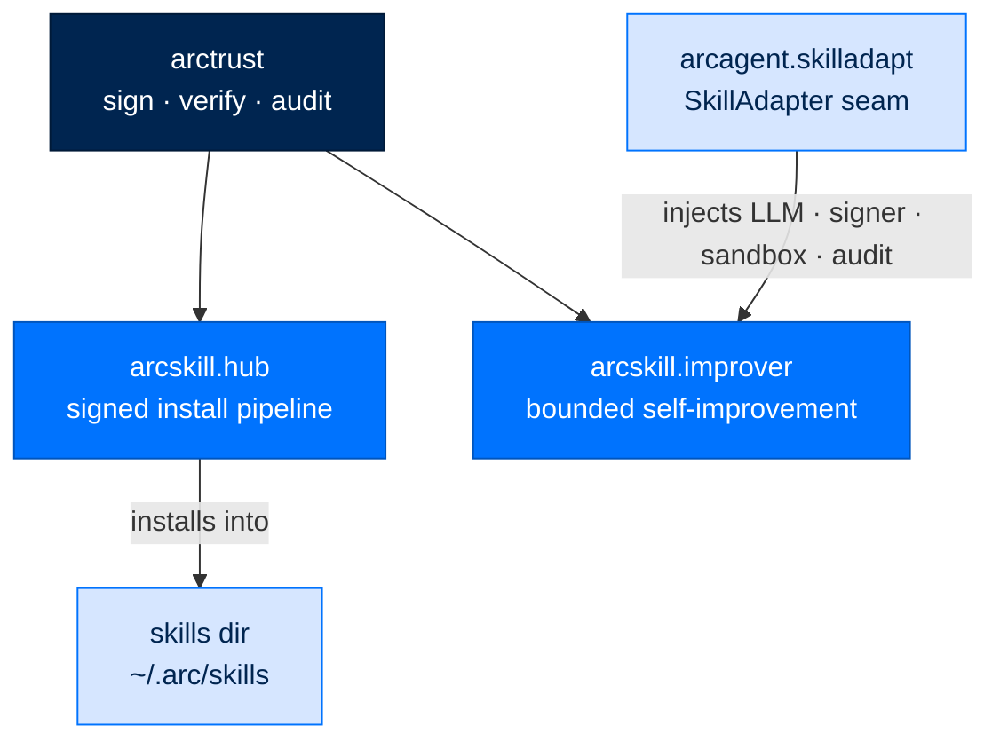

# arcskill - The Verified Skill Hub

> **Building with Arc**  ·  Build  ·  page 18 of 27
> **For** Engineers writing code against Arc
> [← arcmemory](arcmemory.md)  ·  [Docs home](../../README.md)  ·  [arcteam →](arcteam.md)

---

## In one breath

`arcskill` is the **optional supercharger** for skills. A bare `pip install
arcagent` already discovers and loads local skill folders on its own — arcskill
is what you add when you want two more things: a **supply-chain-secure install
channel** for skills that come from outside the box, and a **self-improvement
loop** that lets a skill get better from its own usage under bounded, gated,
signed control.

Those are its two subpackages, and they are independent. `arcskill.hub` is a
verify-before-activate install pipeline — fetch a signed skill bundle into
quarantine, check its Sigstore signature and Rekor inclusion proof, scan its
code and text for danger, run it once in a sandbox, and only then move it into
the skills directory and record it in a tamper-evident lock file. It is **inert
until `[skills.hub] enabled = true`**. `arcskill.improver` is the engine behind
the `SkillAdapter` seam arcagent exposes; it watches how a skill performs and,
when usage warrants, proposes a bounded code-repair patch that must pass a
golden-task gate before it is applied.

Both are pure logic over `arctrust` (plus Pydantic/YAML). arcskill imports no
`arcagent`, no `arcllm`, no `arcprompt` — the LLM, the signer, the sandbox, and
the audit sink all enter through injected Protocol seams that arcagent wires. The
skill *hub* (a registry such as SkillVault) is a separate product; arcskill ships
only the **connector** to it.



---

## Where it sits

`arcskill` depends only on `arctrust`. It is used *from* three places, and it
never reaches back up into any of them:

- **arcagent** selects `arcskill.improver` behind the `SkillAdapter` seam and
  wires its seams through `arcagent.skilladapt`.
- **The CLI** drives the hub install/verify pipeline and the local `arc skill`
  discovery commands.
- **arcui** surfaces installed skills and hub status.

The hub's install pipeline, scanner, and lifecycle tasks activate only on
explicit opt-in — the code ships with arcskill but does nothing until config
enables it. The improver keeps free of any direct provider import (an
architecture test enforces it); the LLM reaches it only through an injected seam.

---

## The skill model

A **skill** is a folder with a `SKILL.md` manifest whose YAML frontmatter carries
at least a `name`, and usually a `version` and `description`:

```markdown
---
name: sales-forecaster
version: 1.2.0
description: Projects pipeline revenue from a CRM export.
---
# Sales Forecaster
Steps the model follows when this skill is invoked...
```

**Discovery and loading is arcagent's job**, not arcskill's. arcagent's
capability loader scans a fixed precedence of roots — `global`, then the agent's
`capabilities/`, then its `workspace/capabilities/` — and loads every folder that
carries a valid `SKILL.md`. The `arc skill` CLI lists what that discovery finds:

```bash
arc skill list [--agent DIR]     # discovered skill folders, by precedence
arc skill search "query"         # match by name or description
arc skill create NAME [--dir P] [--global]   # scaffold SKILL.md + references/ scripts/ templates/
arc skill validate PATH          # validate a folder or its SKILL.md
arc skill evals ...              # list / edit / regen a skill's golden eval suite
```

A scaffolded skill is deliberately **unsigned**: a stub whose next instruction is
to edit it, and a signature over a stub is invalidated by the first edit anyway.
Signing enters when a skill is *distributed* — which is what the hub is for.

Where a skill comes from external distribution, it arrives as a **signed bundle**:
a `skill.tar.gz` accompanied by a Sigstore sidecar (`skill.tar.gz.sigstore`,
or the legacy `skill.sigstore`). The bundle may carry a `MODULE.yaml` declaring a
`test_fixture` command — the thing the sandbox dry-run executes to prove the skill
imports and runs cleanly. That bundle is what the hub verifies, sandboxes, and
installs.

---

## The hub connector

`arcskill.hub` is the client end of a skill registry; the registry itself
(SkillVault or another) is a separate product. The connector points at one or
more **sources**, each an entry in `[[skills.hub.sources]]`:

```toml
[skills.hub]
enabled = false                    # master switch — nothing runs until true

[skills.hub.tier]
level = "federal"                  # "federal" | "enterprise" | "personal"

[skills.hub.policy]
require_signature   = true
require_slsa_level  = 3            # 0-3; federal minimum is 3
require_scan_pass   = true
install_path        = "cli_only"   # blocks any agent-driven install (D-08)
[skills.hub.policy.max_findings_allowed]
critical = 0
high     = 0
medium   = 2

[[skills.hub.sources]]
name            = "arc-official"
type            = "github"         # "github" | "registry" | "wellknown" | "local"
repo            = "arc-foundation/skills"
trust           = "builtin"        # builtin | trusted | community | local
signer_identity = "https://github.com/arc-foundation/skills/.github/workflows/publish.yml@refs/heads/main"
signer_issuer   = "https://token.actions.githubusercontent.com"

[skills.hub.revocation]
crl_url                     = "https://skills.arcagent.dev/v1/crl.json"
crl_refresh_interval_seconds = 3600
fail_closed_if_unreachable   = true
```

`HubConfig` (a Pydantic model, not a dict) is the parsed form. It is **disabled by
default** — `install()` raises `HubDisabled` unless `enabled = true`. Federal
tier is not a separate code path; it is the same pipeline run at maximum
stringency (`is_federal` flips signature, SLSA, sandbox, and CRL requirements to
their strict values).

At federal, only sources on the configured allowlist are permitted — an unlisted
source name raises `SourceNotAllowed`.

---

## The install pipeline

`install(name, source_name, config, *, install_base=None, lock_path=None)` runs
eight stages against a quarantine directory and returns an `InstallResult`. Any
stage that raises is caught, the quarantine is cleaned up, and the result comes
back with `success=False` and an `error` — the failure surfaces in the result,
it does not crash the caller.

```mermaid
flowchart LR
    classDef gate fill:#002550,stroke:#001A38,color:#FFFFFF
    classDef term fill:#D6E6FF,stroke:#0073FE,color:#002550

    A["1 fetch<br/>to quarantine"]:::gate --> B["2 verify signature<br/>Fulcio + Rekor + SLSA"]:::gate
    B --> C["3 CRL check<br/>revoked?"]:::gate
    C --> D["4 scan<br/>regex + text + AST + tools"]:::gate
    D --> E["5 dry-run<br/>sandboxed fixture"]:::gate
    E --> F["6 activate<br/>quarantine to skills dir"]:::gate
    F --> G["7 lock<br/>write lock entry"]:::gate
    G --> H["8 audit<br/>structured event"]:::term
```



**2 · Verify signature** — `verify_bundle(...)` uses the `sigstore` Python
package to check the Fulcio certificate chain, the OIDC signer identity, and the
Rekor transparency-log inclusion proof, then parses any SLSA in-toto attestation
for a build level. Identity policy is tiered: federal *requires* both
`signer_identity` and `signer_issuer` and pins them; an unconfigured non-federal
source still verifies the full cert chain and Rekor proof but relaxes only the
SAN/issuer pin, emitting an audit warning through `_AuditedAnyIssuerPolicy`.
Sigstore's `UnsafeNoOp` is **never** used — it would skip the chain check. When
the `sigstore` package is absent, federal raises `SigstoreUnavailable`;
personal/enterprise warn-skip with `VerifyResult(skipped=True)`.

**3 · CRL check** — the bundle's content hash is checked against a cached
Certificate Revocation List. A hit raises `SignatureInvalid`; an unreachable CRL
raises `CRLUnreachable` when `fail_closed_if_unreachable` is set (federal
default).

**4 · Scan** — `scan(bundle_path, config)` extracts the bundle to a temp dir and
runs up to five passes: a Hermes-derived regex bank, a text-field injection scan
(descriptions, README, SKILL.md), a custom AST visitor for dynamic
`__import__`, and — when installed — semgrep and bandit. It returns a `ScanResult`
(a NamedTuple) with a `verdict` of `safe` / `caution` / `dangerous`. A `dangerous`
verdict with `require_scan_pass` raises `ScanVerdictFailed`. Critical auto-blocks
include remote fetch-and-exec (`curl | sh`) and writes to control-plane files
(agent identity, policy, and known AI-assistant config files) — the covert-config-persistence
vector (ASI06).

**5 · Dry-run** — `run_dry_run(bundle_path, config)` executes the skill's
`test_fixture` in a sandbox. **Federal requires a Firecracker microVM** and raises
`SandboxRequired` if the host has no KVM/jailer; personal/enterprise fall back to
Docker, and to a scan-only skip (with a loud audit warning) when neither is
available. RestrictedPython is explicitly prohibited — it has known escape CVEs.

**6-8 · Activate, lock, audit** — the tarball is extracted with PEP 706
`filter="data"` (symlinks, special files, and traversal blocked) into the skills
dir, a `SkillLockEntry` is written, and a structured audit record is emitted.

---

## Load-time re-verification

Install-time and load-time are different trust boundaries: a signed bundle can be
tampered on disk in between. Following the kernel-module / `jarsigner` precedent,
`verify_artifact_at_load(...)` recomputes the content hash from the bytes on disk
**now** and runs the same `verify_bundle` core, so a post-install byte change
fails the load. Revocation is enforced at boot too: `check_revocation_on_boot(config)`
quarantines any installed skill whose hash has landed in the CRL, and the module
bus consults `should_unload(name)` before loading a skill so a revoked one is
never made available. A background `start_crl_refresh_task(config)` keeps the CRL
fresh and quarantines new hits as they appear.

---

## The lock file

Every hub-installed skill is recorded in `HubLockFile`, written atomically
(temp-file + `os.replace`, then `chmod 0o600`) so a crash never leaves a partial
record. Its location is `~/.arc/skills/.hub/lock.json` (resolved through
`arctrust.paths.skills_dir`).

```json
{
  "version": 1,
  "skills": {
    "arc-official/sales-forecaster": {
      "content_hash": "9f2c...",
      "rekor_uuid": "18274655",
      "slsa_level": 3,
      "scan_verdict": "safe",
      "install_path": "/home/user/.arc/skills/arc-official__sales-forecaster",
      "files": ["SKILL.md", "MODULE.yaml", "skill.py"],
      "installed_at": "2026-08-26T14:30:00Z",
      "updated_at": "2026-08-26T14:30:00Z",
      "quarantined": false
    }
  }
}
```

`HubLockFile` exposes `load` / `save`, `add_or_update`, `quarantine` /
`is_quarantined`, `remove`, and `installed_names`. A file that will not parse
raises `HubLockFileCorrupted` rather than being silently reset — at federal a
caller must not continue on an unknown lock state.

---

## The improver

`arcskill.improver` is the engine behind arcagent's `SkillAdapter` seam. It is
change-bound, eval-gated, and provider-free — the LLM, signer, sandbox, and audit
all enter as injected Protocols (`LLMInvoker`, `Signer`, `EvalRunner`, `Mutator`,
plus an `ApprovalProvider`). `ArcSkillImprover` is the `SkillAdapter`-shaped
facade; `ImproverConfig` is its configuration.

**How it runs.** arcagent forwards primitive per-turn signals — each observed tool
call, each turn boundary, an improvement trigger, and a lifecycle sweep. When a
skill crosses its usage threshold, the improver runs a bounded improvement pass in
a caught background task, so a failing optimization never touches the agent loop.
A proposed code-repair patch must pass the skill's **golden-task gate** (its eval
suite, run in the injected sandbox) before it is applied, and the applied bundle
is re-signed through the injected `Signer` so the hub re-verifies it at reload.

**Change bounds are a hard, tier-scaled ceiling.** They live in
`guardrails.TIER_BOUNDS`; `ChangeBoundConfig` fields may only **tighten** them
(the resolver takes the `min` of an override and the tier ceiling), so the federal
floor is non-relaxable by construction:

| Tier | max edits/step | max lines changed | max files touched | edit schedule |
|---|---|---|---|---|
| Personal | 8 | 80 | 3 | constant |
| Enterprise | 4 | 40 | 2 | cosine |
| Federal | 2 | 15 | 1 | cosine |

**Lifecycle and suites** are configured alongside:

```toml
[modules.skills]
adapter = "arcskill"               # "none" (default) | "arcskill" | dotted BYO path

[modules.skills.improver.change_bound]
max_edits         = 4              # only tightens the tier ceiling
max_lines_changed = 40

[modules.skills.improver.lifecycle]
inactivity_window_days        = 30     # Curator retire/revive sweep window
failure_floor                 = 0.5    # success-rate floor before retire
improve_attempts_before_retire = 3
min_uses_before_retire        = 5

[modules.skills.improver.suite]
autogen   = true                   # bootstrap a golden suite for suite-less skills
min_cases = 3
flake_runs = 5
```

`ImproverConfig` also carries the trace-collection knobs (`min_traces`,
`optimize_after_uses`, `capture_args` — off by default, hash-only, and hash-only
always at federal), the optimization-engine limits (`max_iterations`,
`stagnation_limit`), and `exempt_tags` (`security-critical`, `compliance`, `auth`)
that hold a skill out of mutation entirely. Retire is reversible — disable and
retain lineage, never a destructive delete.

---

## Operating the improver (H-042)

Everything above describes the mechanism. This section is for the person who
has to actually watch it run, seed it, and approve what it proposes.

**The loop does nothing until a skill has a golden suite.** `ArcSkillImprover`
is wired end-to-end from the day `adapter = "arcskill"` is set, but the golden-
task gate (`EvalGate`, above) is fail-closed: a code mutation with no
`evals/` suite is blocked at every tier, and a prose mutation with no suite is
only auto-allowed (audit-warn) at personal tier — enterprise/federal block
that too. So the eval-bootstrap is not optional polish, it is the on-ramp:

1. **A human authors ≥3 golden cases** in `<skill>/evals/test_*.py` — plain
   pytest functions that assert something true about the skill's own
   contract (see `blueprints/personal-assistant/skills/daily-brief/evals/
   test_golden.py` for a worked example: three cases pinning the five-item
   cap, the fact/inference labeling, and the quiet-day short-circuit — the
   properties that make that skill's output trustworthy). A file whose
   module docstring carries no `@generated` marker classifies
   human-authored (`arcskill.improver.evalgate`).
2. Once ANY cases exist, a **prose** mutation's gate runs — it's a suite,
   not a count, that unlocks prose. `sweep_suites()` will also
   auto-generate cases for a suite-less skill
   (`[modules.skills.improver.suite] autogen = true`), and those
   machine-authored anchors run and count toward strict-improvement too.
   **Code-repair** mutation is stricter: it additionally requires
   `min_golden_cases` (default 3) cases, and at enterprise/federal only
   human-authored cases count toward that floor — machine anchors alone
   never unlock code mutation there. Ship the first few cases by hand if
   you want either gate live immediately rather than waiting on autogen.
3. A mutation only *applies* on **strict improvement**: at least one
   previously-failing golden case must now pass, and none may regress. No
   suite, no gate, no unlock — a "no-op forever" skill is not broken, it is
   simply one you have not seeded yet.

**The Curator's three sweeps**, run on the same periodic tick
(`[modules.skills] sweep_poll_seconds`, default hourly):

| Sweep | What it does | Reversible? |
|---|---|---|
| `review_lifecycle` | Retires a skill that's been idle past `inactivity_window_days`, or has failed past `improve_attempts_before_retire` attempts below `failure_floor`. | Yes — the improver's `revive(skill_name)`. Lineage is retained; nothing is deleted. |
| `sweep_suites` | Bootstraps a golden suite for any suite-less skill, most-used first. | N/A — additive only. |
| `review_consolidation` | Flags two active skills whose `SKILL.md` bodies are near-duplicates, proposes a merged skill, and — only if the merge passes **both** originals' golden suites with zero regressions — applies it to the survivor and marks the absorbed skill `merged`. | Yes — same lineage/revive mechanism as retire. The absorbed skill's own file is untouched; only its lifecycle state changes. |

A retired or merged skill is excluded from the agent's offering
(`retired_skills()`) but its history is never destroyed — `revive()` undoes
either transition and restores the prior `active_candidate_id`. **As shipped,
`revive` has no `arc skill` CLI verb or ArcUI button** — today it's reachable
only by calling `ArcSkillImprover.revive(skill_name)` directly (the same gap
retire already had before H-042; consolidation inherited it rather than
introducing it). Rollback (below) does have both a route and a UI — reviving
a wrongly-retired-or-merged skill in the meantime means driving the improver
from a script, or rolling the survivor's candidate back and leaving the
absorbed skill's lifecycle state as-is.

**Reviewing and approving.** At personal tier, mutations, retirements, and
consolidations apply automatically with an audit event (no human in the
loop — "audit-warn", not "audit-block"). At enterprise tier, code mutations
and consolidations require approval; at federal tier, *everything* does
(prose, code, retire, revive, consolidate). Every gated action surfaces the
same way any other Lethal-Trifecta-style gate does:

```bash
arc approve list          # see what's waiting — skill mutations show tool
                           # "skill.mutation:<action>" (e.g.
                           # skill.mutation:skill.lifecycle.consolidate)
arc approve <id>          # sign a grant with the operator key
arc approve <id> --deny   # refuse it
```

A denial with no approver wired at all is not silent — it's an audited
`denied_no_approver` event, so "nothing happened" is always traceable to a
specific missing wire, not a mystery.

**Inspecting what actually changed.** Every applied mutation — prose,
code-repair, or a Curator consolidation — lands as one more candidate in
that skill's version timeline, visible in ArcUI's skill drawer under the
**Versions** tab: pick any two versions (A/B) to see the real unified diff
between their `SKILL.md` bodies before deciding whether to roll back.
Rollback is itself just another gated, audited mutation
(`POST .../skills/{name}/rollback`) — it flips which candidate is active, it
does not re-run the gate.

**Managing eval suites from the CLI** (`arc skill evals`, `arccli.commands.
skill_evals`):

```bash
arc skill evals <skill_path>                        # list cases + provenance
arc skill evals edit <skill_path> <file> [--force]   # edit a case in $VISUAL/$EDITOR;
                                                      # warns on suite-floor breach or
                                                      # passing-anchor loss before commit
arc skill evals regen <skill_path> [--yes]           # preview a diff of what regenerating
                                                      # the machine-authored files would
                                                      # touch (actual regen needs a live
                                                      # agent — run it from inside one)
```

Editing a machine-generated file by hand — even without a `@generated`
removal — reclassifies it human-authored the moment its bytes no longer
match the harness manifest (`evals/.manifest.json`), which is exactly the
"a human edited this" signal the gate trusts.

---

## The SkillAdapter seam

arcagent ships **improver-less by default**, mirroring the memory `Brain` seam.
`arcagent.skilladapt.SkillAdapter` is a structural Protocol speaking only
primitives (`str` / `int` / `None`) at the boundary, so an implementation need not
import arcagent and arcagent never imports an arcskill type. The default is
`NullSkillAdapter`: every method is inert, **no traces stored, no mutations, no
files ever written**. That is what `pip install arcagent` alone runs with — the
agent works end to end, improvement is a silent no-op.

`select_skill_adapter(...)` maps the `[modules.skills] adapter` setting to a
concrete adapter:

- `"none"` → `NullSkillAdapter` (default).
- `"arcskill"` → `arcskill.improver.ArcSkillImprover`, lazily imported; a partial
  install without the improver degrades back to `NullSkillAdapter` with a warning.
- a dotted class path → a user-supplied BYO adapter, refused above personal tier
  unless operator-allowlisted (ASI04).

The `SkillAdapter` methods are `observe`, `on_turn_end`, `maybe_improve`,
`review_lifecycle`, `sweep_suites`, `review_consolidation` (H-042), and
`retired_skills` — the last excludes both retired **and merged-away** skills
from the agent's offering. arcagent hands the arcskill improver a
prompt-resolve closure (from `arcprompt`, via arcagent) so operator prompt edits
reach the improver's own prompts, while arcskill still never imports `arcprompt`.

---

## Threat surface

The hub is the supply-chain boundary for skills; the improver is a controlled
self-modification path. Both are designed against the OWASP LLM and agentic
threat surfaces.

| Threat | How arcskill answers it |
|---|---|
| **LLM03 — Supply chain** | Signed bundles (Sigstore + Fulcio + Rekor inclusion proof), SLSA build-level enforcement, and a multi-pass scanner gate every install; the lock file is a tamper-evident inventory. |
| **ASI04 — Agentic supply chain** | Verify-before-activate, load-time re-verification, CRL revocation with fail-closed federal behavior, and a sandboxed dry-run before a skill can ever run. BYO improver adapters are allowlist-gated above personal. |
| **ASI05 — Unexpected code execution** | The dry-run runs in a Firecracker microVM (federal) or Docker, never in-process; RestrictedPython is prohibited for its escape CVEs. Tarball extraction blocks symlinks and path traversal. |
| **ASI06 — Memory & context poisoning** | The scanner critical-auto-blocks writes to control-plane files (agent identity, policy, and known AI-assistant config files) and text-field prompt injection. |
| **LLM10 — Unbounded consumption** | Improver change bounds cap edits/lines/files per step; the golden-task gate and background isolation keep a runaway optimization off the agent loop. |

Every stage that decides trust fails **closed** at federal: absent sigstore,
unreachable CRL, or unavailable sandbox all block the install rather than waving
it through.

---

## Failure modes and inspection

Hub failures are typed under `HubError`:

| Exception | Cause |
|---|---|
| `HubDisabled` | The hub is off (`enabled = false`) and hub code was reached |
| `SourceNotAllowed` | The requested source is not on the configured allowlist |
| `SignatureInvalid` | Cert-chain, OIDC-identity, Rekor, missing bundle, SLSA-below-required, or CRL-hit failure |
| `SigstoreUnavailable` | The `sigstore` package is absent at federal tier |
| `CRLUnreachable` | The CRL endpoint is unreachable and fail-closed is set |
| `SandboxRequired` | Federal requires Firecracker but the host has none |
| `ScanVerdictFailed` | The scanner verdict blocks install (carries the offending findings) |
| `HubLockFileCorrupted` | The lock file on disk cannot be parsed |

Inspect an install through the returned `InstallResult` — it carries the `fetch`,
`verify`, `scan_result`, `dry_run`, `install_path`, and `error` from every stage
it reached, so a `success=False` result tells you exactly which gate stopped it.
`arc skill list` shows discovered local skills; the lock file at
`~/.arc/skills/.hub/lock.json` is the inventory of hub-installed ones. A skill
whose hash is revoked shows `quarantined: true` and is moved under a `revoked/`
directory.

---

## Worked example: install an external skill at federal tier

An operator wants `arc-official/sales-forecaster` on a federal box.

1. **Configure and enable.** `[skills.hub] enabled = true`, `tier.level = "federal"`,
   and an `arc-official` source with `signer_identity` + `signer_issuer` pinned.
   Federal refuses an unlisted source and refuses a source missing its identity.

2. **Run the pipeline.** `install("arc-official/sales-forecaster", "arc-official",
   config)` fetches the bundle to quarantine, then verifies the Sigstore signature
   — full Fulcio chain, the pinned OIDC identity, the Rekor inclusion proof, and a
   SLSA level `>= 3`. A level below 3 raises `SignatureInvalid`.

3. **Revocation, scan, sandbox.** The content hash is checked against the CRL
   (unreachable → `CRLUnreachable`, because federal is fail-closed). The scanner
   runs all passes; a `dangerous` verdict raises `ScanVerdictFailed`. The
   `test_fixture` runs in a Firecracker microVM — no KVM means `SandboxRequired`,
   not a silent skip.

4. **Activate and record.** The bundle extracts into
   `~/.arc/skills/arc-official__sales-forecaster`, a `SkillLockEntry` captures the
   hash, `rekor_uuid`, `slsa_level`, and `scan_verdict`, and one audit event is
   emitted. `install()` returns `InstallResult(success=True)`.

5. **Every subsequent load re-checks.** At each boot, load-time re-verification
   recomputes the on-disk hash and re-runs verify, and `check_revocation_on_boot`
   quarantines the skill immediately if its hash ever appears in the CRL — so a
   tampered or revoked skill never silently keeps running.

---

## Verified public surface

> `arcskill`'s stable surface lives under `arcskill.hub`, `arcskill.lock`, and
> `arcskill.improver`; the top-level namespace exports only `__version__`. Full
> signatures are in the [API reference](../../reference/api.md#arcskill).

### `arcskill.hub`

| Name | Purpose |
|---|---|
| `install` / `uninstall` / `update` | The signed install pipeline (returns `InstallResult`) |
| `HubConfig`, `TierPolicy`, `HubPolicy`, `SkillSource`, `RevocationConfig`, `FindingsAllowed` | Parsed TOML configuration models |
| `scan`, `ScanResult`, `Finding` | The multi-pass security scanner and its results |
| `verify_bundle`, `VerifyResult` | Sigstore/Rekor/SLSA verification |
| `run_dry_run`, `DryRunResult` | The sandboxed dry-run |
| `check_revocation_on_boot`, `quarantine_skill`, `should_unload`, `start_crl_refresh_task` | Revocation & lifecycle |
| `HubDisabled`, `SourceNotAllowed`, `SignatureInvalid`, `SigstoreUnavailable`, `CRLUnreachable`, `SandboxRequired`, `ScanVerdictFailed`, `HubLockFileCorrupted` | Typed errors |

### `arcskill.lock`

| Name | Purpose |
|---|---|
| `HubLockFile` | The atomic, `0o600` lock file: `load`/`save`/`add_or_update`/`quarantine`/`remove`/`installed_names` |
| `SkillLockEntry` | One installed skill's record |

### `arcskill.improver`

| Name | Purpose |
|---|---|
| `ArcSkillImprover` | The `SkillAdapter`-shaped self-improvement facade |
| `ImproverConfig` | Improver configuration (change-bound, lifecycle, suite, trace, engine) |

---

## Next steps

- [The Seam Model](../../concepts/seam-model.md) — why skills, the improver, and the hub are all plug-in ports
- [The Security Model](../../walkthrough/10-security-model.md) — the Four Pillars and how they ride every seam
- [Extension Points](../../walkthrough/11-extension-points.md) — the full catalog of ports, the `SkillAdapter` among them
- [arcprompt](arcprompt.md) — the signed-prompt seam the improver is handed
- [Package Index](../package-index.md) — all Arc packages
