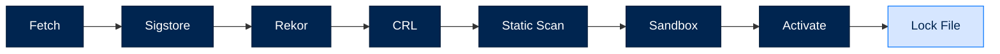
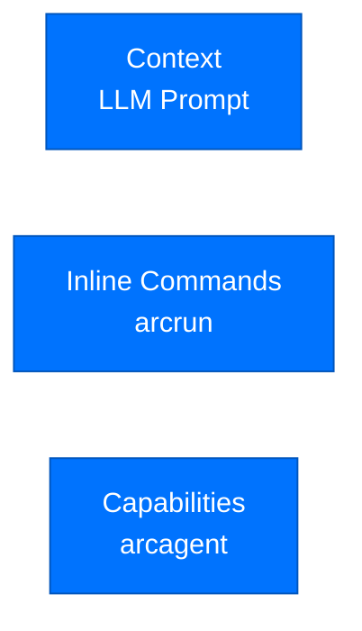
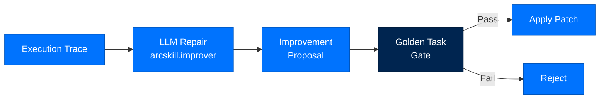
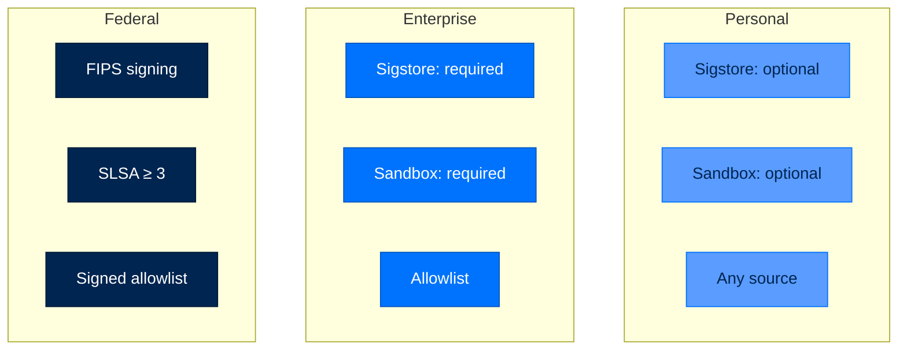

# arcskill - Skill Hub

> **Building with Arc**  ·  Build  ·  page 18 of 27  
> **For** Engineers writing code against Arc  
> [← arcmemory](arcmemory.md)  ·  [Docs home](../../README.md)  ·  [arcteam →](arcteam.md)

---

## Overview

`arcskill` provides **supply-chain-secure skill installation**:
- **8-gate install pipeline** - Verify before activate
- **Sigstore signing** - Transparent signatures
- **Static analysis** - AST + regex + semgrep + bandit
- **Sandboxed dry-run** - Behavior verification
- **Lock file** - Tamper-evident inventory



---

## The Install Pipeline

### Gate 1: Fetch to Quarantine

```python
# Fetch to isolated directory
quarantine_path = Path("/tmp/skill-quarantine/uuid")
# Nothing visible until activation
```

### Gate 2: Sigstore Signature

```python
from arctrust.artifact import verify_artifact

result = verify_artifact(skill_bundle, issuer_did)
if not result.valid:
    raise SignatureInvalid(result.error)
```

### Gate 3: Rekor Inclusion Proof

```python
from arctrust.witness import TransparencyLogWitness, WitnessAnchor

if not TransparencyLogWitness().verify(result.signature, result.rekor_uuid):
    raise SignatureInvalid("Not in transparency log")
```

### Gate 4: CRL Check

```python
from arcskill.hub.lifecycle import check_revocation_on_boot

if check_revocation_on_boot(skill_cert_fingerprint):
    raise CRLUnreachable("Certificate revoked")
```

### Gate 5: Static Scan

```python
from arcskill.hub.scanner import scan

result = scan(skill_source)
if result.verdict == "fail":
    raise ScanVerdictFailed(result.findings)
```

### Gate 6: Sandboxed Dry-Run

```python
from arcrun.sandbox import Sandbox

sandbox = Sandbox()
try:
    sandbox.execute(skill_test_code)
except Exception:
    raise SandboxRequired("Skill behavior check failed")
```

### Gate 7: Atomic Activation

```python
# Atomic rename on POSIX
quarantine_path.rename(active_path)
```

### Gate 8: Lock File Entry

```python
lock_file.add_skill(
    name="data-analysis",
    version="1.0.0",
    content_hash=result.hash,
    rekor_uuid=result.rekor_uuid,
    slsa_level=result.slsa_level
)
```

---

## Skill Types

### Three Target Types



#### 1. Context Skills

```markdown
---
name: domain-expert
type: context
---

# Domain Expert

You are an expert in financial analysis...
```

#### 2. Inline Commands

```markdown
---
name: quick-analysis
type: inline
---

```python
def analyze(data):
    return {"summary": str(data.describe())}
```
```

#### 3. Persistent Capabilities

```markdown
---
name: file-analyzer
type: capability
---

```python
@tool(name="analyze_file",...)
def analyze_file(path: str) -> dict:
    ...
```
```

---

## Skill Self-Improvement

### Improver Pipeline



### Configuration

```toml
[modules.skills.improver]
change_bound.max_edits = 4
change_bound.max_lines_changed = 40
lifecycle.inactivity_window_days = 30
```

### Edit Budgets by Tier

| Tier | Max Edits | Max Lines | Notes |
|------|-----------|-----------|-------|
| Personal | 8 | 80 | Can relax |
| Enterprise | 4 | 40 | Configurable |
| Federal | 2 | 20 | Non-relaxable |

---

## Lock File

### Structure

```json
{
  "version": 1,
  "skills": {
    "data-analysis": {
      "version": "1.2.0",
      "content_hash": "sha256:a3f2c1...",
      "rekor_uuid": "24296fb24b8ad77a...",
      "slsa_level": 3,
      "signing_cert_fingerprint": "sha256:...",
      "scan_verdict": "pass",
      "installed_at": "2026-04-28T14:30:00Z",
      "install_path": "/home/user/.arc/skills/data-analysis"
    }
  }
}
```

### Location

```
~/arc/state/skills/.hub/lock.json
```

---

## CLI Commands

```bash
# Discover
arc skill list [--agent NAME]
arc skill search "query"

# Create
arc skill create NAME [--dir PATH] [--global]

# Validate
arc skill validate PATH

# Manage (via Python API)
arc skill install NAME --source URL
arc skill uninstall NAME
```

---

## API Reference

### Functions

```python
async def install(
    skill_name: str,
    source_url: str,
    config: HubConfig
) -> SkillMetadata:
    """Install skill through verified pipeline."""

def uninstall(skill_name: str) -> None:
    """Uninstall skill."""

def scan(
    source: Path,
    rules: list[str] = None
) -> ScanResult:
    """Static scan of skill code."""

def check_revocation_on_boot() -> list[str]:
    """Check CRL on startup."""
```

### Classes

```python
class HubConfig(TypedDict):
    enabled: bool = False
    tier: str = "personal"
    allowed_sources: list[str] = None
    require_sigstore: bool = True
    require_rekor: bool = True

class HubLockFile:
    def add_skill(self, metadata: SkillMetadata) -> None: ...
    def get_skill(self, name: str) -> SkillMetadata: ...
    def remove_skill(self, name: str) -> None: ...
    def verify_integrity(self) -> bool: ...

class ScanResult(TypedDict):
    verdict: str  # "pass" | "warn" | "fail"
    findings: list[Finding]
    score: float
```

---

## Tier-Based Policies



---

## Next Steps

- [Security Model](../../reference/security.md) - Verification requirements
- [API Reference](../../reference/api.md) - Complete API documentation
- [Package Index](../package-index.md) - All Arc packages

---

## Verified public surface

> Introspected from the installed package on the current commit. Every name
> below is importable exactly as shown; full signatures are in the
> [API reference](../../reference/api.md#arcskill).

### Classes

| Class | Purpose |
|---|---|
| `PackageNotFoundError` | The package was not found. |

### Functions

| Function | Signature |
|---|---|
| `version` | `(distribution_name)` |

