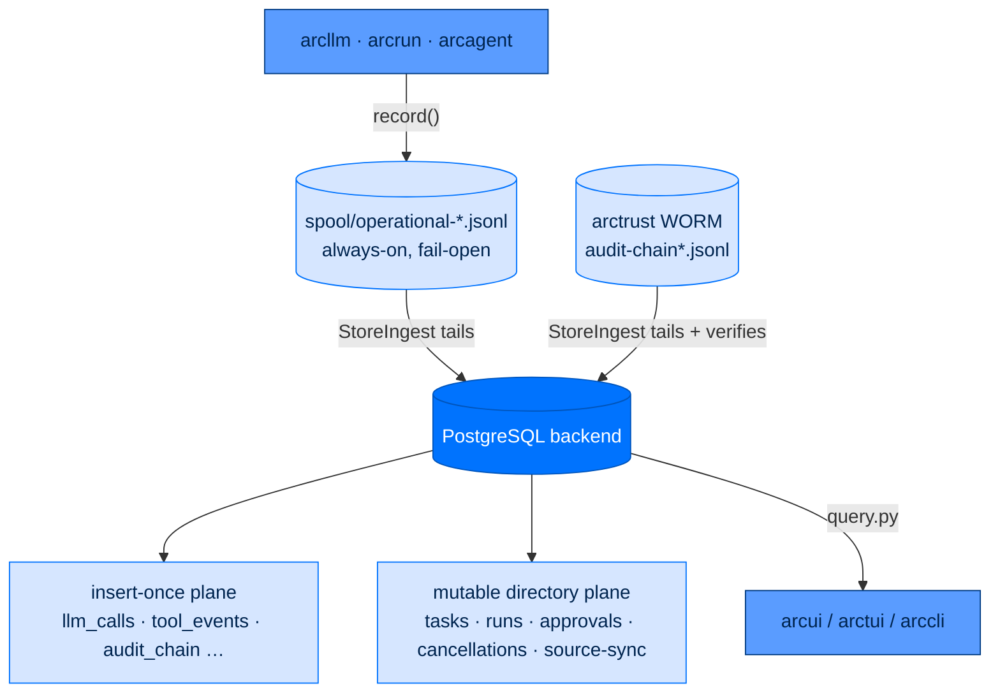

# arcstore - Operational Data Plane

> **Building with Arc**  ·  Build  ·  page 13 of 27  
> **For** Engineers writing code against Arc  
> [← arctrust](arctrust.md)  ·  [Docs home](../../README.md)  ·  [arcprompt →](arcprompt.md)

---

## Overview

`arcstore` is Arc's **operational / observability data plane** — the always-on
place every layer above it records what happened and reads it back. It has two
halves that meet in one queryable database:

- **The spool** — an always-on, append-only JSONL file (`spool.py`,
  `records.py`). Every `arcllm` / `arcrun` / `arcagent` action writes one durable
  line the instant it happens, **fail-open**, whether or not any database,
  server, or UI is running. Metadata only by default — no prompt or response
  bodies.
- **The durable backend** — one PostgreSQL database (`backends/postgres.py`) that
  holds two planes: the **insert-once** mirror of the spool + arctrust WORM
  chain (tailed in by `ingest.py`), and the **mutable directory plane**
  (`mutable_records`) that backs tasks, runs, approvals, cancellations, and
  connected-source sync.

`arcstore` depends only on `arctrust`. It imports nothing else from Arc, so it
sits just above the cryptographic floor and gives every layer one consistent
place to durably record and retrieve operational state.



### Layer and import direction

**Data plane.** The dependency edge points one way and never reverses:

```
arctrust  ←  arcstore  ←  { arcllm, arcrun, arcagent, arcteam, arcgateway, arcui, arccli, … }
```

`arcstore` must never import an agent, loop, LLM-provider, UI, or gateway
package. The invariant is enforced by
`tests/architecture/test_no_arcstore_arcteam_upward_imports.py` and the
import-isolation unit tests. This is what keeps the "call a direct `arcllm` now,
spin up the store later, still see the call" guarantee true — every entry point
resolves the same data dir and reads the same spool.

---

## The two planes at a glance

| | Insert-once (operational) plane | Mutable directory plane |
|---|---|---|
| **Written by** | `record()` → spool file → `StoreIngest` mirror | `mutable_*` backend ops via the domain stores |
| **Tables** | `llm_calls`, `run_events`, `agent_events`, `tool_events`, `spawn_events`, `audit_chain`, `skill_candidates`, `skill_candidate_bodies` | `mutable_records` (one row per `collection`+`key`) |
| **Row identity** | content-derived `record_id` / `event_hash` (`INSERT … DO NOTHING`) | `(collection, key)` primary key, overwritten in place |
| **Mutation** | none — append + idempotent replay | `update_if` / `merge` / `increment` / conditional claim |
| **Read via** | `arcstore.query` (`recent`, `audit_records`, …) | the domain store `list` / `get` methods |
| **Purpose** | timeline, cost/token history, tamper-evident audit | live coordination state: task board, workflow runs, HITL approvals, kill switches, sync cursors |

The spool is the **write-ahead source of truth** for the operational plane; the
backend is a queryable projection that can be rebuilt from the durable files.
The mutable plane has no file behind it — it lives only in PostgreSQL, because it
is coordination state that many processes read and write concurrently.

---

## The spool (`spool.py`, `records.py`)

### Contract

`record(rec: SpoolRecord, *, path: Path | None = None) -> None` appends one
newline-terminated JSON line and returns. It is designed to be impossible to
break the audited call:

- **Single-syscall append.** It uses `os.write` of one newline-terminated record
  through `os.open(..., O_WRONLY | O_APPEND | O_CREAT, 0o600)`. On local
  filesystems the inode mutex serializes concurrent appenders, so no `fcntl` lock
  is needed. `file.write` is deliberately avoided — CPython can split a large
  write into 4 KB chunks and break that atomicity.
- **Fail-open (AU-5 / NFR-3).** Any exception is logged at WARNING and swallowed.
  Telemetry must never raise into the call it is recording. This is the single
  most important property of the spool: a broken disk, a full volume, or a
  permissions error degrades observability, never the agent.
- **Owner-only mode.** The file is `0o600` and re-`fchmod`ed after open, because
  the spool may carry sensitive metadata (NFR-5).
- **No per-record `fsync`.** The contract is "survives *process* crash", not "OS
  crash". Hard durability is the arctrust WORM's job, not the spool's.
- **Daily rotation.** Files are `spool/operational-YYYY-MM-DD.jsonl`, giving the
  ingester a clean per-file inode/offset cursor model.

### Run correlation without threading

A task-local `contextvars.ContextVar` (`_request_id_var`) carries the run's
correlation id so every record emitted inside a run shares one `request_id`
without each producer threading it through its call stack:

- `request_context(request_id)` — a context manager `arcrun` binds around a run.
  A record with no explicit `request_id` inherits the active one; an explicit id
  always wins.
- `current_request_id()` — lets a producer decide whether an operation even
  belongs to a run before spooling it (an orphan `tool_event` with no run to
  attach to is simply not written).

A `ContextVar` (not a global) is what keeps concurrent runs isolated —
`asyncio.Task` snapshots the context at creation, so spawned children carry
their own copy.

### The `SpoolRecord` schema

A single **flat, frozen** Pydantic model (one record = one JSONL line, NFR-1),
**metadata only by default** (SPEC-026 FR-4 / AC-4.5 — no prompt or response
text; raw-body capture is an explicit, audited opt-in handled upstream in
`arcllm`, never here).

| Field group | Fields | Notes |
|---|---|---|
| Discriminator | `kind` | one of `llm_call`, `run_event`, `agent_event`, `tool_event`, `spawn_event` — drives the target table |
| Identity | `actor_did`, `ts`, `request_id` | `ts` auto-populated at creation; `request_id` inherited from context |
| llm_call | `model`, `provider`, `agent_label`, `prompt_tokens`, `completion_tokens`, `cache_read_tokens`, `cache_write_tokens`, `cost_usd`, `latency_ms`, `outcome` | cache split lets a consumer compute hit-rate = `cache_read / (input + cache_read)` (SPEC-029) |
| run/agent | `name` | step / phase / event name |
| tool_event | `tool_name`, `phase` (`start`/`end`/`error`), `args_digest`, `args_size`, `result_digest`, `result_size` | digests are sha256 of **content**, computed at source in `arcrun.executor`; align to OTel GenAI semconv |
| spawn_event | `parent_did`, `child_did`, `role`, `depth` | the operational parent→child edge |
| Extension | `extra: dict` | flat str/int/float/bool/None values only |

`record_id` (a property) is the **stable, content-derived identity** for
idempotent ingest — `sha256(kind|actor_did|ts|request_id|phase|name)[:32]`. It is
never a byte offset or row id (those change on rotation). `phase` and `name` are
folded into the hash so two distinct events of one run under one actor at the
same `ts` do not collide and silently drop on `INSERT … DO NOTHING`
(SPEC-028 review EDGE-3).

### Reading the spool

- `read(path)` — iterate `SpoolRecord`s from a file, logging and skipping any
  torn/corrupt line rather than aborting the stream (safe because the spool is
  operational telemetry; the compliance record is the WORM's).
- `read_from_offset(path, offset)` / `read_complete_segments(path, offset)` — the
  **torn-tail byte-cursor** algorithm shared by the spool and WORM readers. It
  returns only fully-newline-terminated lines and a `new_offset` that advances
  past them, so a crash mid-write leaves the partial final line unconsumed and
  the store persists a resumable cursor. This is what makes ingest crash-safe.

---

## StoreIngest — the file tailer (`ingest.py`)

`arcstore` is a **pure file-tailer**. It owns no sink in `arctrust.audit.emit()`
and no live wire. `StoreIngest` only reads the two durable files — the spool and
the arctrust WORM — and mirrors them into the queryable backend.

| Method | Behavior |
|---|---|
| `backfill()` | one full `scan_once()` from each file's persisted cursor (UC-1/UC-2 recovery) |
| `start()` | backfill, then launch the background tail loop as a managed `asyncio.Task` |
| `stop()` | cancel the tail loop cleanly (no orphaned task) |
| `scan_once()` | ingest new lines from every spool + WORM + skill-candidate file since the last cursor |

Crash-safety mirrors a write-ahead log: a **per-file byte cursor** lives in
`arcstore_cursors` (`spool:<name>`, `worm:<name>`, `skillmf:<skill>`). On restart
the scan resumes from the last cursor instead of re-reading. Replay is harmless
because every row is keyed by a content-derived id and inserted with
`ON CONFLICT DO NOTHING`, so at-least-once ingest never duplicates rows
(AC-3.3). The tail loop is itself fail-open — a `scan_once` exception is logged
and the loop continues.

**WORM verification on ingest.** Each WORM segment is verified independently with
`arctrust.verify_chain`, and each mirrored `audit_chain` row carries that
segment's `verified` verdict, `seq`, hashes, signature, and the event's
`request_id`/`extra` (SPEC-073 run correlation). A fleet writes per-agent chains
(`audit-chain-<agent>.jsonl`), so ingest globs `audit-chain*.jsonl`
unconditionally rather than gating on the bare filename.

`_scan_skills` additionally mirrors the arcskill candidate store
(`<workspace>/skill_traces/<skill>/candidates/`) keyed off the manifest mtime,
with a path-safe candidate-id allowlist so a poisoned manifest id can never drive
a read outside `candidates/` (ASI02/ASI06 defense).

---

## The mutable directory plane (`mutable_records`)

The coordination half of the store is one table:

```sql
mutable_records (
    collection text NOT NULL,
    key        text NOT NULL,
    value      jsonb NOT NULL,
    updated_at timestamptz NOT NULL DEFAULT now(),
    PRIMARY KEY (collection, key)
)
```

Unlike the insert-once operational tables, rows here are **overwritten in
place** — one `collection` per directory entity (`tasks`, `runs`, `approvals`,
`cancellations`, `connected_source_sync`, `workflow_runner_leases`, …), one row
per entity id. Every domain store is a thin, typed directory over this table; the
whole coordination system rides these primitives (declared on the
`ArcStoreBackend` Protocol in `backends/base.py`):

| Backend op | What it does |
|---|---|
| `mutable_write` | upsert a row (`INSERT … ON CONFLICT DO UPDATE`) |
| `mutable_read` | read one row by `(collection, key)`; stamps `updated_at` onto the returned value |
| `mutable_query` | list a collection, filtered by a dotted-path `where` dict (JSON `#>` equality, `IS NOT DISTINCT FROM` so `None` matches JSON `null`) |
| `mutable_delete` | hard-delete one row |
| `mutable_merge` | server-side `value = value || patch::jsonb` — patches disjoint fields atomically, no read-modify-write clobber |
| `mutable_increment` | atomic `jsonb_set` arithmetic on numeric leaves (dotted paths); the reserve/settle budget counters ride this |
| `mutable_create_batch` | `INSERT … DO NOTHING` across a whole batch in one transaction, returning current stored state per id — idempotent per row id |
| `append_if_absent` | CAS-append one item to a JSON array only if absent, bumping a `length_field` in the same step |
| **`update_if`** | **the compare-and-swap primitive** — `UPDATE … WHERE <condition>`; returns whether exactly one row changed |
| `update_if_increment` | conditional patch **and** increment in one transaction |
| `*_with_outbox` | the write and a row in `approval_outbox` land in one transaction (see Outbox below) |

### The conditional-claim pattern

`update_if` is the heart of every race-safe transition in Arc. Because the
`WHERE` re-checks the expected state **inside PostgreSQL's own atomic step**, two
contending writers resolve to exactly one winner and the loser no-ops rather than
clobbering. Every domain store expresses its contended transitions this way:

```python
won = await backend.update_if(
    "tasks", task_id,
    {"owner_did": agent_did, "status": "in_progress"},   # patch
    where={"owner_did": None, "status": candidate.status},  # snapshot must still hold
    actor_did=agent_did,
    absent_where={"owner_did": agent_did, "status": "in_progress"},  # one-in_progress cap
)
```

`absent_where` adds a second guard — the write also requires that **no other**
row matches a condition — taken under a `pg_advisory_xact_lock` so the check and
the write cannot straddle two transactions. `TaskStore.claim_next` uses it to
enforce the "one `in_progress` task per owner" cap that a read-then-write could
never hold safely.

Every `mutable_*` write emits an AU-2/AU-3 audit event through the optional
`sink`, **fail-open** (AU-5): a sink outage logs a warning but never blocks the
durable write.

### The transactional outbox

`update_if_with_outbox` / `mutable_write_with_outbox` write the row **and** a row
in `approval_outbox` in one transaction, so an event to propagate can never be
lost between the state change and the notification (no dual-write gap). Consumers
claim work with `claim_outbox` (`FOR UPDATE SKIP LOCKED`, a 60s lease), then
`ack` / `nack` (with backoff) / `reject`. `mail_outbox` is the same machinery for
the Agent Mail adapter (`enqueue_mail` / `claim_mail` / `ack_mail` / `nack_mail`
/ `dead_letter_mail`). This is how `ApprovalStore` and the inbox surfaces get
at-least-once delivery without a message bus in the leaf data plane.

### The runner fence (`mutation_fence.py`)

An ArcFlow workflow runner holds a lease (`workflow_runner_leases` collection). A
`RunnerFence(owner_id, token, expires_at)` can be passed into any mutable write;
the backend validates it with `SELECT … FOR UPDATE` on the lease row **inside the
same transaction** as the write (`_assert_fence_current`). Because the lock is on
the lease row itself — not a preflight read — a replacement runner acquiring the
next token cannot slip between the check and the protected write. A stale fence
raises `MutationFenceRejectedError`.

---

## Domain stores

Each store owns a frozen Pydantic model and a thin directory class over one
`mutable_records` collection. All mutation goes through the store (read the
durable row, write a new one); nothing holds a live model and edits it in place.
Each depends on a **narrow local Protocol** (e.g. `MutableTaskBackend`), not the
concrete backend — `base.StorageBackend` predates the mutable plane, so a local
Protocol keeps the store structurally typed without widening the shared contract.

### `TaskStore` (`tasks.py`) — collection `"tasks"`

Durable backing for SPEC-056 Mission Control. A task created by an agent tool,
the CLI (`arc task`), or the arcui kanban is the **same row** visible to all
three.

**`Task` model** (selected fields):

| Field | Meaning |
|---|---|
| `id`, `title`, `description` | identity + free text, **NFKC-normalized + injection-sanitized on construction** |
| `status` | `backlog` → `todo` → `in_progress` → `review` → `done` / `failed` |
| `priority` | `low` / `medium` / `high` / `critical` — claim order, critical first |
| `owner_did`, `creator_did` | single nullable owner + immutable creator |
| `parent_id`, `blocked_by` | decomposition parent + dependency-DAG edges |
| `run_id` | the dispatched run's id, stamped in the same atomic write that starts the task |
| `started_at`, `completed_at`, `duration_seconds` | lifecycle timing the board's DONE-TODAY / AVG-TIME metrics read |
| `attempts`, `max_attempts`, `last_error`, `next_attempt_at` | retry-engine state (count, ceiling, last failure, backoff gate) |
| `timeout_seconds`, `cancel_requested` | per-task wall-clock cap + operator stop signal |
| `requires_review` | opt-in human gate — a completed task lands in `review`, not `done` |
| `output`, `resolution`, `classification` | structured result, short note, no-write-down bound (default `UNCLASSIFIED`) |

**Board-move invariants** — the semantics that must be preserved when editing
`tasks.py`:

- **Only the dispatch claim (`start_task` / `claim_next`) may enter
  `in_progress`.** `_OPERATOR_MOVE_STATUSES` deliberately excludes it, so an
  operator board move can never fake a run.
- **A currently-`in_progress` task cannot be board-moved, assigned, or edited** —
  an operator never yanks a live run out from under its owner (ASI08/NFR-4).
- **Every contended transition is a status-conditional `update_if`** — `claim_next`,
  `start_task`, `assign`, `route`, `requeue`, `dead_letter`, `set_status`,
  `approve_review`, `reject_review`, `request_cancel` all snapshot the current
  status into the `WHERE` so exactly one writer wins and the loser no-ops.
- **The one-`in_progress`-per-owner cap** is enforced in the same atomic step via
  `absent_where`, except for dependency-chain relatives (`_is_chain_relative`:
  a shared/parent `parent_id` or a `blocked_by` edge), which are the same piece
  of work and exempt (FR-5).
- **`create_batch` is idempotent per id** — a crashed workflow runner replaying
  the same batch gets back the existing rows rather than duplicating them
  (ArcFlow frontier materialization derives each id from `(run_id, node_id)`).
- **Dependency safety** — `deps_met`, `deps_would_cycle` (forward-walk cycle
  check), and `children` enforce an acyclic DAG so an unsatisfiable task is
  rejected before it is written.

Free text is sanitized **by construction** in the field validators: over-length
rejected, zero-width homoglyph separators stripped, a hard injection-pattern
allowlist always fires (every tier, every path), and a URL/email gate that is
**closed by default** and opened only per-construction via
`context={"allow_external_refs": True}` for personal/enterprise tiers
(ADR-019 tier = stringency). Reads trust the stored row (external-ref policy is
an ingest-time gate, not a storage invariant), but the hard injection patterns
still run on every load.

### `RunStore` (`runs.py`) — collection `"runs"`

The SPEC-061 ArcFlow execution substrate — one durable `Run` per execution of a
signed `workflow.toml` DAG. A run gets its own collection rather than a new spool
kind, because the operational `SpoolKind` set is closed and carries no run
identity.

**`Run` aggregate:** `id`, `workflow_id`, `workflow_version`, `content_hash`
(the exact signed definition), `status` (`pending` → `running` → `waiting_gate` →
`done`/`failed`/`cancelled`), `initiator_did`/`runner_did`, a `RunBudget`
(reserve-then-settle token + wall-clock counters), an append-only
`path_taken: list[PathEntry]` with `path_len`, and a `settled` idempotency
ledger.

| Method | Purpose |
|---|---|
| `create` / `get` / `list` | insert; fetch by id; list by `workflow_id` / `status` |
| `transition` | status-conditional `update_if` on `expected_status` — the loser gets `"conflict"` |
| `append_path_entry` | CAS-append one `PathEntry` on `path_len` via `append_if_absent` — a plain merge would replace the whole array, not append. An untaken branch has no row at all (lazy materialization = honest trace) |
| `reserve_budget` / `settle_budget` | hold budget before a node dispatches, then move actual usage from reserved into spent atomically — the two never double-count |
| `settle_budget_once` | claim a `settlement_key` via `update_if_increment` on `settled_len` so a retried settle applies exactly once (bounded CAS-retry loop) |

### `ApprovalStore` (`approvals.py`) — collection `"approvals"`

The mechanical human-in-the-loop spine (SPEC-035). When a trifecta-completing
call is blocked, the agent's `HumanGate` writes a `pending` `PendingApproval`
row; an operator resolves it **out-of-band** (`arc approve` CLI, arcui) by
attaching an operator-signed `ApprovalGrant` in wire form
(`arctrust.policy.grant_to_wire`). The agent polls, verifies the grant against
the operator's public key, and proceeds or fails closed. **Approval never travels
over agent chat**, so a prompt-injected or foreign message can't forge it.

`PendingApproval` carries `call_hash` (binds an eventual grant to exactly this
call), redacted `arguments` (WHAT), and `provenance` (which prior tool calls lit
each trifecta leg, WHY) — both already redacted/bounded by the agent; the store
treats them as opaque. `resolve()` is **conditional on `status == "pending"`** so
two operators (or an operator and the timeout sweep) can't double-resolve one
request — the loser no-ops and returns `None`. `grant` is set only on `approved`.
Both `create` and `resolve` use the transactional **outbox** so a resolution is
delivered exactly once.

### `CancelStore` (`cancellations.py`) — collection `"cancellations"`

The operator kill switch (`arc stop`, arcui). Surfaces run in **separate
processes** from the agent, so an in-process handle registry can never reach the
run. The operator writes a `pending` `CancelRequest` (named by `run_id` and/or
`session_key` — at least one required, enforced at construction); a per-agent
watcher observes it, resolves the matching live `RunHandle`, and calls
`RunHandle.cancel(caller_did, reason)` — a cooperative, attributable stop
(ASI09/ASI10). `resolve()` is conditional on `pending` so two overlapping watcher
ticks apply it exactly once; `expire_stale(ttl_seconds=…)` ages out requests
whose target never materialized through the same conditional claim, so a
concurrently-applying watcher tick still wins.

### `SourceSyncState` (`source_sync.py`) — collection `connected_source_sync`

Durable connected-data-source sync state with **compare-and-fence** semantics, so
an incremental sync survives restarts and a stale worker can never commit
progress. Two implementations satisfy the `SourceSyncBackend` Protocol:
`ArcStoreSourceSyncStore` (over the PostgreSQL backend's atomic primitives) and
`InMemorySourceSyncStore` (a lock-protected fake).

`SourceSyncState`: `agent_did`, `source_id`, `cursor`, `status`
(`idle`/`running`/`complete`/`failed`/`cancelled`/`lease_lost`/`awaiting_mapping`),
`pages`, `bytes_processed`, `fencing_token`, `generation`, `error_code`. A worker
`acquire_lease`s (bumping the fencing token), `commit_page`s idempotently under
that token (the page is deduped by `page_id`; a stale token is rejected),
`renew_lease`s, and `release_lease`s. `reset` / `purge` only fire when no live
lease is held; `purge` bumps `generation` to fence an old source incarnation.

> **Known gap — PROB-009 (OPEN).** `connected_source_sync` has **no
> `last_synced_at` column**, and none of `SourceRuntimeStatus` / `SyncState` /
> `SourceSyncState` carries the attribute the connector card's `_status_wire`
> reads — so the arcui card always shows "Never". The `pages` / `bytes_processed`
> counters *are* cumulative and durable here, but on a real deployment they are
> written to the **agent-runtime DSN** and the card reads the **observe/arcui
> DSN** (see the two-DB split below), so the card reads a database the sync never
> wrote. The fix is scoped: a schema field + migration for `last_synced_at`,
> reconciling the two DSNs, and wiring an index-derived count — not a tail-end
> patch.

---

## The PostgreSQL backend (`backends/postgres.py`)

`PostgresBackend` is the **one production backend**; all state lives in
PostgreSQL. Local PostgreSQL and Supabase use the same adapter — the only
difference is the DSN and a couple of pooling flags.

### DSN resolution and TLS

The DSN is **never persisted in config**. `ArcStoreConfig.postgres_settings()`
resolves a runtime secret from `ARCSTORE_DATABASE_URL` (or an injected
`SecretStr`, e.g. a vault-backed credential referenced by
`database_credential_ref`) and validates it (`config.py`):

- Scheme must be `postgres`/`postgresql` with a hostname, else
  `ArcStoreConfigurationError` — **there is no SQLite production fallback**.
- `sslmode` defaults to `prefer` for localhost, `require` for external hosts.
  **External hosts reject `disable`/`allow`/`prefer`** — TLS is mandatory off-box.
- **Supabase:** port `5432` is the direct connection; port `6543` is the
  Supavisor **transaction pooler**, which sets `statement_cache_size = 0` because
  prepared statements do not survive transaction pooling.

### Pool settings

From `ArcStoreConfig`: `pool_min_size` (default 1), `pool_max_size` (default 10,
validated ≥ min), `command_timeout` (30s), `connect_timeout` (10s). The pool is
created migrated (schema applied in one transaction on first connect).

**One shared pool per DSN per process.** Every store in every agent module
constructs its own `PostgresBackend`; without sharing, a six-agent node would
open dozens of pools and exhaust PostgreSQL's connection slots — a self-inflicted
resource-exhaustion outage (ASI08/LLM10). `_SHARED_POOLS` is keyed by DSN and
reference-counted; the last `stop()` for a DSN closes the pool. The registry
rebinds to the running event loop (a new loop starts from an empty registry),
because asyncpg pools and locks bind to the loop that created them.

### Schema (migrations `v1`–`v7`)

`migrate(connection)` applies versioned SQL. The tables:

- **Operational (insert-once):** `llm_calls`, `run_events`, `agent_events`,
  `tool_events`, `spawn_events` (all `LIKE llm_calls`), `audit_chain`,
  `skill_candidates`, `skill_candidate_bodies` — keyed by `record_key`,
  `INSERT … DO NOTHING`. `arcstore_cursors` holds ingest byte offsets.
- **Mutable:** `mutable_records` (PK `(collection, key)`).
- **Outbox:** `approval_outbox`, `mail_outbox`.
- **Connected sources:** `connected_source_sync`, `connected_source_pages`.
- **Inbox:** `inboxes`, `inbox_threads`, `inbox_messages`, `inbox_handoffs`.

Writes are guarded by `_require_table` against the `STORE_TABLES` allowlist, and
`query` only permits `ts`/`ts ASC`/`ts DESC` ordering — no arbitrary SQL from a
caller. All predicate values are parameterized dotted-path JSON comparisons
(`_where_clauses`), never string-interpolated.

### The in-memory `FakeBackend` (`backends/memory.py`)

`FakeBackend` is a **lock-protected, contract-complete** implementation of the
entire `ArcStoreBackend` Protocol used to test every backend-neutral domain
store without a database. It shares the exact dotted-path `where` semantics and
CAS behavior, so a test that passes against the fake exercises the same logic the
Postgres backend runs. `InMemorySourceSyncStore` plays the same role for
source-sync. Contract tests
(`tests/unit/test_arcstore_backend_contract.py`) run against both so the fake can
never drift from the real backend.

---

## Config (`config.py`)

`ArcStoreConfig` is the **one canonical `[arcstore]` block** — `arcllm`, `arcrun`,
`arccli`, and `arcagent` all *reference* it and `resolve_data_dir`, never
redefine them (AC-7.3): one schema, one resolver, one precedence rule.

| Field | Default | Purpose |
|---|---|---|
| `enabled` | `True` | the single on/off gate producers and the agent lifecycle check before recording or spinning up ingest |
| `data_dir` | `""` | spool/store root (empty = resolve default) |
| `database_credential_ref` | `""` | vault reference for the DSN secret |
| `pool_min_size` / `pool_max_size` | 1 / 10 | asyncpg pool bounds |
| `command_timeout` / `connect_timeout` | 30 / 10 | seconds |
| `store_raw_bodies` | `False` | opt-in raw prompt/response capture (upstream in arcllm) |
| `rotation` / `retention` / `sample_rate` | `daily` / `""` / `1.0` | spool file lifecycle |

`resolve_data_dir(configured)` is the **single shared precedence rule** (SPEC-026
§13.2): `ARCSTORE_DATA_DIR` env  >  configured `[arcstore].data_dir`  >
`arctrust.paths.store_dir()`. Every entry point calls this same function so a
direct `arc llm` call and a later `arc agent serve` agree on the spool/store
path — divergent paths would silently fragment history (D-013).

---

## The two-DB split reality

On a real deployment there are typically **two ArcStore databases** — the same
schema, two DSNs:

- The **agent-runtime DSN** — what each agent process writes its tasks, runs,
  approvals, spooled/ingested telemetry, and source-sync state into.
- The **observe / arcui DSN** — what the dashboard and CLI read from.

When those DSNs differ, a collection written on the runtime side is **empty** on
the observe side unless something reconciles them. This is the second root cause
of PROB-009 (the connector card reading `connected_source_sync` from a DB the
sync never wrote). The operative rule from the problem log:

> **State must be written and read through the same path and the same DB.** A
> status field no writer sets reads as a permanent default; a collection the
> reader's DB never received reads as empty.

When adding a surface that reads mutable-plane state, confirm it reads the DSN the
writer actually wrote to.

---

## Threat surface

`arcstore` is the durable memory of the whole system, so it is designed against
tampering, races, and leakage:

- **Authenticate + authorize every query and mutation.** Every `mutable_*` write
  takes an `actor_did` and emits an AU-2/AU-3 audit event attributing the change;
  higher layers gate the call through `arctrust.policy` before it reaches the
  store. Reads and writes are scoped by DID/collection, never a shared credential.
- **No SQLite production fallback.** The DSN validator rejects anything that is
  not a real PostgreSQL URL, and external hosts must use TLS — there is no
  quiet-degrade path to a local file in production.
- **Race-safety on claims (confused-deputy / double-resolve).** Two operators
  cannot double-resolve one approval; two watchers cannot double-apply one
  cancel; two agents cannot both claim one task; two runners cannot both advance
  one run frontier. Each is a status-conditional `update_if` (plus `absent_where`
  / `pg_advisory_xact_lock` for cross-row caps), so the guarantee is the
  database's, not a hopeful read-then-write.
- **Outbox integrity.** State change and its notification land in one
  transaction, so a crash cannot leave a resolved approval undelivered or deliver
  a notification for a change that rolled back. Consumers lease with
  `FOR UPDATE SKIP LOCKED` and ack/nack, giving at-least-once delivery with no
  lost or duplicated effects.
- **Injection-hardened free text.** Task/run prose is NFKC-normalized, zero-width
  stripped, and pattern-rejected **at construction on every path** (LLM01/ASI06),
  with URLs/emails fail-closed by default.
- **Fail-closed fences, fail-open audit.** A stale runner fence rejects the write
  (`MutationFenceRejectedError`); a failed audit-sink emission is logged and
  swallowed so it can never block the durable write (AU-5). These pull in opposite
  directions on purpose: integrity of the *write* is non-negotiable, availability
  of the *side-channel* is.
- **Backup / export leakage.** The spool is `0o600` and metadata-only by default;
  raw bodies are an audited opt-in. Any dump of the store or spool is sensitive
  data — encrypt at rest and in transit, and treat exports as classified to the
  highest row they contain.

---

## Failure modes and how to inspect

| Symptom | Likely cause | How to inspect |
|---|---|---|
| A call happened but the UI never shows it | ingest not running, or reading a different DSN/data-dir | check `arcstore_cursors` advanced for `spool:<file>`; confirm the same `resolve_data_dir` and DSN on producer and reader |
| Duplicate-looking timeline rows | two events collided on `record_id` | verify `phase`/`name` distinguish them (EDGE-3); they are folded into the hash |
| Task stuck in `in_progress` | owner died mid-run | the stuck-reclaim watcher `requeue`s past `started_at` staleness; inspect `mutable_records` where `collection='tasks'` |
| Approval never proceeds | grant not delivered, or verification failed | read `approval_outbox` status; confirm the agent verifies the grant against the operator key |
| Connector card shows 0 / "Never" | PROB-009 (missing field + two-DB split) | query `connected_source_sync` on **both** DSNs; the runtime DSN holds the real `pages`/`bytes_processed` |
| `PostgresBackend is not started` | `start()` not called before a read/write | call `store.start()` (or the store's `start()` seam) after constructing your own backend |

**Inspecting the mutable plane directly** (any collection is one SQL query):

```sql
-- Every task and its live status
SELECT key, value->>'status' AS status, value->>'owner_did' AS owner
FROM mutable_records WHERE collection = 'tasks' ORDER BY updated_at DESC;

-- Pending human approvals
SELECT key, value->>'tool' AS tool, value->>'status' AS status
FROM mutable_records WHERE collection = 'approvals' AND value->>'status' = 'pending';

-- Recent LLM cost/token history (insert-once plane)
SELECT payload->>'ts', payload->>'model', payload->>'cost_usd'
FROM llm_calls ORDER BY ts DESC LIMIT 20;
```

---

## A short worked example

Spool a call now, tail it into the backend later, and read it back — the core
"call first, store second" guarantee:

```python
from pathlib import Path
from arcstore import SpoolRecord, record, read, resolve_data_dir, spool_path

# 1. Producer side — always-on, fail-open, no DB required.
record(SpoolRecord(
    kind="llm_call",
    actor_did="did:key:z6Mk...",
    model="claude-opus-4",
    provider="anthropic",
    prompt_tokens=1200,
    completion_tokens=340,
    cost_usd=0.021,
    outcome="ok",
))

# 2. Read straight from the durable file (no backend involved).
for rec in read(spool_path(data_dir=resolve_data_dir())):
    print(rec.kind, rec.model, rec.cost_usd)
```

Later, a store process tails the same files into PostgreSQL and the UI queries
them:

```python
from arcstore.backends import open_backend
from arcstore.ingest import StoreIngest
from arcstore import query, resolve_data_dir

backend = open_backend()              # PostgresBackend from ARCSTORE_DATABASE_URL
await backend.start()                 # opens the shared pool, applies migrations

data_dir = resolve_data_dir()
ingest = StoreIngest(
    backend,
    spool_dir=data_dir / "spool",
    worm_dir=data_dir / "audit",
)
await ingest.start()                  # backfill from cursors, then tail

# The UI reads through the thin query API — never a driver cursor.
recent_calls = await query.recent(backend, "llm_call", limit=20)
audit = await query.audit_records(backend, limit=50)
```

And a task moves across the board race-safely:

```python
from arcstore.tasks import Task, TaskStore

tasks = TaskStore(backend, sink=audit_sink)
await tasks.create(Task(id="t-1", title="Summarize Q3 report", creator_did=operator_did))

# One agent self-claims the highest-priority ready task — atomically.
task, outcome = await tasks.claim_next(agent_did="did:key:agentA")
# outcome == "assigned"; a second concurrent claimer gets "no_tasks_available"

await tasks.finish("t-1", status="done", resolution="posted summary", actor_did="did:key:agentA")
```

---

## Public surface

Off the package root (`arcstore`):

- **Spool** — `SpoolRecord`, `record`, `read`, `spool_path`
- **Paths / config** — `resolve_data_dir`, `ArcStoreConfig`
- **Source sync** — `SourceSyncState`, `SourceSyncStatus`, `SourceSyncLease`,
  `SourceSyncBackend`, `ArcStoreSourceSyncStore`, `InMemorySourceSyncStore`
- **Inbox / mail** — `Inbox`, `Thread`, `Message`, `Handoff`, `MailOutbox`,
  `PostgresMailOutbox`, and the durable inbox projection types
- **Approval dispatch** — `ApprovalNotificationDispatcher`,
  `ApprovalDispatcherConfig`, `ApprovalNotification`

Domain APIs live under their submodules: `arcstore.tasks` (`Task`, `TaskStore`),
`arcstore.runs` (`Run`, `RunStore`, `PathEntry`, `RunBudget`), `arcstore.approvals`
(`PendingApproval`, `ApprovalStore`), `arcstore.cancellations` (`CancelRequest`,
`CancelStore`), plus `arcstore.ingest` (`StoreIngest`) and `arcstore.query` for
the tailer and read API, and `arcstore.backends` for `open_backend`,
`PostgresBackend`, and the in-memory `FakeBackend`.

```bash
pip install arcstore                 # spool + PostgreSQL backend
```

Provision with `scripts/install-postgres.sh` for a local operator, or point at a
managed PostgreSQL URL. See the
[ArcStore Postgres runbook](../../runbooks/deploy/arcstore-postgres.md) for the
protected-environment setup, Supabase direct/pooler URLs, health/schema smoke
check, and idempotent deploy flow.

---

## Next Steps

- [The Seam Model](../../concepts/seam-model.md) - Why every implementation is replaceable
- [arctrust](arctrust.md) - The cryptographic floor arcstore sits on
- [Data Flow](../../walkthrough/data-flows.md) - How data moves through Arc
- [Package Index](../package-index.md) - All Arc packages

---

## Verified public surface

> Introspected from the installed package on the current commit. Every name
> below is importable exactly as shown; full signatures are in the
> [API reference](../../reference/api.md#arcstore).

### Classes

| Class | Purpose |
|---|---|
| `ArcStoreConfig` | The one canonical `[arcstore]` block + pool/DSN settings. |
| `SpoolRecord` | Immutable, flat operational telemetry record (metadata-only by default). |

### Functions

| Function | Signature |
|---|---|
| `read` | `(path: 'Path') -> 'Iterator[SpoolRecord]'` |
| `record` | `(rec: 'SpoolRecord', *, path: 'Path \| None' = None) -> 'None'` |
| `resolve_data_dir` | `(configured: 'str \| Path \| None' = None) -> 'Path'` |
| `spool_path` | `(*, data_dir: 'Path \| None' = None) -> 'Path'` |
</content>
