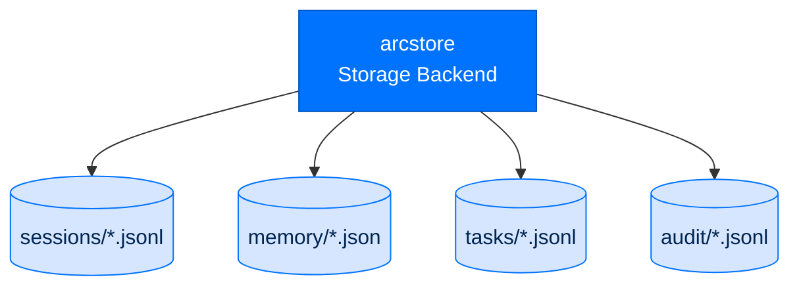
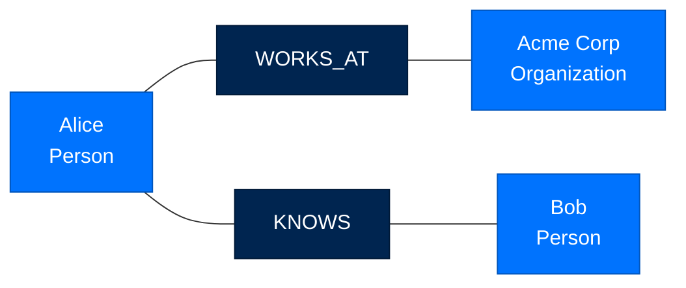
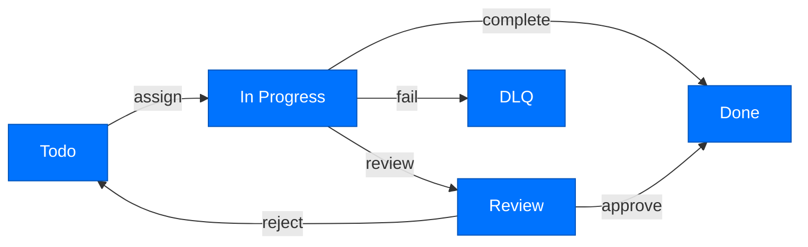

# arcstore - Storage Backend

> **Building with Arc**  ·  Build  ·  page 13 of 27  
> **For** Engineers writing code against Arc  
> [← arctrust](arctrust.md)  ·  [Docs home](../../README.md)  ·  [arcprompt →](arcprompt.md)

---

## Overview

`arcstore` provides unified storage interfaces for all Arc data:
- **Sessions** - Conversation transcripts with JSONL format
- **Memory** - Episodic, entity, and daily storage
- **Tasks** - Durable task coordination state
- **Audit** - Security event logs

Storage is designed for:
- **Durability** - Atomic writes, never partial state
- **Replayability** - Session transcripts can be replayed
- **Audit trail** - Every change is traceable
- **Multi-process** - Safe concurrent access



---

## Storage Layout

```
workspace/
├── sessions/
│   ├── 2026-07-31.jsonl       # Session transcripts
│   └── 2026-08-01.jsonl
├── memory/
│   ├── episodic.json            # Recent episodes index
│   ├── entities.json            # Entity graph
│   └── daily/
│       ├── 2026-07-31.jsonl   # Daily log
│       └── 2026-08-01.jsonl
├── tasks/
│   ├── todo.jsonl               # Pending tasks
│   ├── done.jsonl               # Completed tasks
│   ├── review.jsonl             # Waiting review
│   └── dlq.jsonl                # Dead letter queue
└── audit/
    ├── actions.jsonl              # Tool executions
    ├── skills.jsonl               # Skill events
    └── security.jsonl             # Security events
```

---

## Session Storage

### Session Format

```json
{
  "id": "sess_01H7XQ2K3M4N5P6Q7R8S9T0",
  "created_at": "2026-07-31T10:00:00Z",
  "turns": [
    {
      "id": "turn_1",
      "timestamp": "2026-07-31T10:00:01Z",
      "role": "user",
      "content": "Analyze the data"
    },
    {
      "id": "turn_2",
      "timestamp": "2026-07-31T10:00:05Z",
      "role": "assistant",
      "content": "I'll analyze the data...",
      "tool_calls": [
        {
          "id": "call_1",
          "name": "read_file",
          "arguments": {"path": "data.csv"}
        }
      ]
    },
    {
      "id": "turn_3",
      "timestamp": "2026-07-31T10:00:10Z",
      "role": "tool",
      "content": "File contents...",
      "tool_call_id": "call_1"
    }
  ]
}
```

### Session API

```python
from arcstore import read, record

store = Store(Path("workspace"))
sessions = store.sessions()

# List sessions
all_sessions = sessions.list()
for s in all_sessions:
    print(f"{s.id}: {s.created_at} - {len(s.turns)} turns")

# Create new session
session = sessions.create()
print(f"New session: {session.id}")

# Get session
session = sessions.get("sess_01H...")

# Append turn
sessions.append_turn(session.id, {
    "role": "user",
    "content": "Hello"
})

# Replay session
for turn in session.turns:
    print(f"[{turn.role}] {turn.content}")
```

---

## Memory Storage

### Entity Graph



```python
from arcstore import read, record

store = Store(Path("workspace"))
memory = store.memory()

# Entity operations
entity = await memory.get_entity("alice")
entity.observations.append("Prefers Python over JavaScript")
await memory.upsert_entity(entity)

# Episode operations
episodes = await memory.get_episodes(limit=100)
for ep in episodes:
    print(f"{ep.id}: {ep.content[:50]}...")

# Daily log
daily = await memory.get_daily("2026-07-31")
for entry in daily:
    print(f"{entry.timestamp}: {entry.content}")
```

### Memory Types

| Type | Purpose | TTL |
|------|---------|-----|
| Episodic | Recent events, high recall | 30 days |
| Entity | Persistent facts, graph | Forever |
| Daily | Long-term archival | Forever |

---

## Task Storage

### Task Lifecycle



### Task API

```python
from arcstore import read, record

store = Store(Path("workspace"))
tasks = store.tasks()

# List pending tasks
todo = tasks.list_todo()
for t in todo:
    print(f"{t.id}: {t.description}")

# Assign task (atomic)
task = tasks.assign("task_123", "agent-analyst")
print(f"Assigned to: {task.owner}")

# Complete task
task = tasks.complete("task_123", {"result": "success"})
print(f"Completed: {task.outcome}")

# Auto-route task
task = tasks.route(new_task, capability_registry)
print(f"Routed to: {task.owner}")

# Get dead letter queue
dlq = tasks.list_dlq()
```

### Task States

| State | File | Description |
|-------|------|-------------|
| `todo` | `tasks/todo.jsonl` | Pending assignment |
| `in_progress` | `tasks/in_progress.jsonl` | Being worked |
| `review` | `tasks/review.jsonl` | Awaiting approval |
| `done` | `tasks/done.jsonl` | Completed |
| `dlq` | `tasks/dlq.jsonl` | Dead letter queue |

---

## Audit Storage

### Audit Event Types

```python
# Tool execution
{
    "action": "tool_execution",
    "actor": "did:key:...",
    "resource": "web_search",
    "outcome": "success",
    "metadata": {"query": "...", "duration_ms": 1250}
}

# Skill activation
{
    "action": "skill_activate",
    "actor": "did:key:...",
    "resource": "data-analysis",
    "outcome": "success",
    "metadata": {"version": "1.0.0"}
}

# Security event
{
    "action": "lethal_trifecta_blocked",
    "actor": "did:key:...",
    "resource": "dynamic_tool",
    "outcome": "blocked",
    "metadata": {"reason": "private_data + external_comms + untrusted_input"}
}
```

### Audit API

```python
from arcstore import read, record

store = Store(Path("workspace"))
audit = store.audit()

# Write audit record
record = audit.write({
    "action": "tool_execution",
    "actor": "did:key:...",
    "resource": "read_file",
    "outcome": "success"
})

# Query by action
tool_events = audit.query(action="tool_execution")

# Query by actor
agent_events = audit.query(actor="did:key:...")

# Verify integrity
assert audit.verify_integrity()
```

---

## Concurrency Safety

### Atomic Writes

```python
import json
from pathlib import Path
import tempfile

def atomic_write(path: Path, data: dict):
    """
    Write atomically using temp file + rename.
    Never leaves partial state on crash.
    """
    path.parent.mkdir(parents=True, exist_ok=True)
    
    # Write to temp file
    with tempfile.NamedTemporaryFile(
        mode='w',
        dir=path.parent,
        delete=False,
        suffix='.tmp'
    ) as f:
        json.dump(data, f)
        temp_path = Path(f.name)
    
    # Atomic rename
    temp_path.rename(path)
```

### File Locking

```python
import fcntl

class LockedFile:
    def __init__(self, path: Path):
        self.path = path
        self.file = open(path, 'a+')
    
    def __enter__(self):
        fcntl.flock(self.file.fileno(), fcntl.LOCK_EX)
        self.file.seek(0)
        return self.file
    
    def __exit__(self, *args):
        fcntl.flock(self.file.fileno(), fcntl.LOCK_UN)
        self.file.close()
```

---

## API Reference

### Classes

```python
class Store:
    def __init__(self, root: Path): ...
    
    def sessions(self) -> SessionStore: ...
    def memory(self) -> MemoryStore: ...
    def tasks(self) -> TaskStore: ...
    def audit(self) -> AuditStore: ...

class SessionStore:
    def list(self) -> list[SessionMeta]: ...
    def create(self) -> Session: ...
    def get(self, session_id: str) -> Session: ...
    def append_turn(self, session_id: str, turn: Turn) -> None: ...

class MemoryStore:
    async def get_entity(self, name: str) -> Entity: ...
    async def upsert_entity(self, entity: Entity) -> None: ...
    async def get_episodes(self, limit: int = 100) -> list[Episode]: ...
    async def append_episode(self, episode: Episode) -> None: ...
    async def get_daily(self, date: str) -> list[DailyEntry]: ...

class TaskStore:
    def list_todo(self) -> list[Task]: ...
    def assign(self, task_id: str, owner: str) -> Task: ...
    def complete(self, task_id: str, result: dict) -> Task: ...
    def route(self, task: Task) -> Task: ...
    def list_dlq(self) -> list[Task]: ...

class AuditStore:
    def write(self, event: dict) -> AuditRecord: ...
    def query(self, **filters) -> list[AuditRecord]: ...
    def verify_integrity(self) -> bool: ...
```

### Types

```python
class Session(TypedDict):
    id: str
    created_at: str
    turns: list[Turn]

class Turn(TypedDict):
    id: str
    timestamp: str
    role: str  # "user" | "assistant" | "tool"
    content: str
    tool_calls: list[ToolCall] = None
    tool_call_id: str = None

class Entity(TypedDict):
    id: str
    name: str
    type: str  # "person" | "organization" | "concept"
    observations: list[str]
    last_updated: str

class Task(TypedDict):
    id: str
    description: str
    owner: str = None
    status: str  # "todo" | "in_progress" | "review" | "done"
    created_at: str
    updated_at: str
    result: dict = None
    requires_review: bool = False
```

---

## Next Steps

- [Data Flow](../../walkthrough/data-flows.md) - How data moves through Arc
- [API Reference](../../reference/api.md) - Complete API documentation
- [Package Index](../package-index.md) - All Arc packages

---

## Verified public surface

> Introspected from the installed package on the current commit. Every name
> below is importable exactly as shown; full signatures are in the
> [API reference](../../reference/api.md#arcstore).

### Classes

| Class | Purpose |
|---|---|
| `ArcStoreConfig` | The one canonical ``[arcstore]`` block (that teardown, §13.1). |
| `SpoolRecord` | Immutable operational telemetry record. |

### Functions

| Function | Signature |
|---|---|
| `read` | `(path: 'Path') -> 'Iterator[SpoolRecord]'` |
| `record` | `(rec: 'SpoolRecord', *, path: 'Path \| None' = None) -> 'None'` |
| `resolve_data_dir` | `(configured: 'str \| Path \| None' = None) -> 'Path'` |
| `spool_path` | `(*, data_dir: 'Path \| None' = None) -> 'Path'` |
| `store_db_path` | `(data_dir: 'str \| Path \| None' = None) -> 'Path'` |

