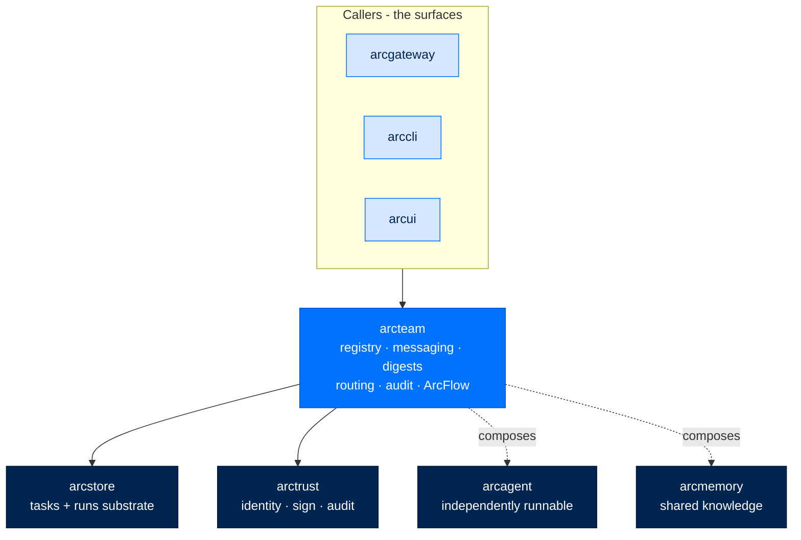
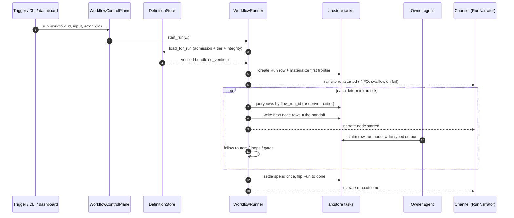

# arcteam - Multi-Agent Coordination & ArcFlow

> **Building with Arc**  ·  Build  ·  page 19 of 27  
> **For** Engineers writing code against Arc  
> [← arcskill](arcskill.md)  ·  [Docs home](../../README.md)  ·  [arcgateway →](arcgateway.md)

---

## In one breath

`arcteam` is the layer that lets **many independently-running agents behave like
one team** — and the home of **ArcFlow**, the deterministic workflow engine
(SPEC-061). It gives a fleet four things: a place to look up who is who (the
DID-keyed **entity registry**), a signed, audited way to talk (**channels**,
**DMs**, and **AgentMail**), a cheap way to decide *who should answer* a question
without asking every agent (**digests** + **relevance-triage routing**), and a
way to run a **named, signed graph of work** that survives a restart (ArcFlow).

It does **not** run an agent, call an LLM, or drive the ReAct loop. Those are
`arcagent`, `arcllm`, and `arcrun`. arcteam orchestrates; it never becomes the
brain. The one rule that keeps every part of it honest: **work moves as a durable
task row, never inside a message body.** A message is only ever a wake-signal or
a piece of narration — if every message a run ever sent were dropped, the run
still reaches its end.



---

## Layer and dependency direction

**Coordination / workflows.** `arcteam` depends **downward** on
[`arcstore`](arcstore.md) (the durable task and run substrate) and
[`arctrust`](arctrust.md) (identity, signing, audit primitives), plus NATS and
Pydantic. It **never** imports `arcagent`, `arcrun`, `arcllm`, `arcgateway`,
`arccli`, or `arcui`.

It is imported *by* the surfaces that need coordination: `arcgateway` (which owns
the runner's process lifecycle), `arccli` (the `arc` command), and `arcui` (the
dashboard). An agent gets fleet capability through hooks — it never owns the
engine.

### Fleet composition points the other way

This is the alpha fleet invariant (by design, and
[fleet layering](../../concepts/fleet-layering.md)): the direction is
**`arcteam → arcagent`** and **`arcteam → arcmemory`**. arcteam composes agents
and their memory; **neither `arcagent` nor `arcmemory` may import `arcteam`.**

An agent declares a thin seam — `arcagent.fleet` — for the few things it cannot
do alone: turn a handle into a DID, ask who is available, drop a notice in
another agent's inbox. `arcteam.agent_fleet.FleetDirectoryAdapter` is arcteam
*answering* that seam. Orchestration knows about agents; an agent never knows
about orchestration.

---

## Owns vs does not own

| Concern | arcteam | Not arcteam |
|---------|---------|-------------|
| Team roster, channels, DMs | Yes | Individual agent lifecycle |
| Inter-agent messaging (wake + narration) | Yes | Carrying work in message bodies |
| Relevance-triage: agents publish digests, a ranker picks the responder | Yes | Asking each agent "is this relevant to you?" (ADR-032) |
| Workflow definition + deterministic runner | Yes | LLM sequencing / an orchestrator agent |
| Task / run substrate | Uses `arcstore` | Reimplementing a DAG engine |
| Signing workflows | Operator-pinned signature | An agent self-signing as "verified" |
| Runner process lifecycle | No — lives in `arcgateway` | Requiring the dashboard to run |

---

## Package layout

```
src/arcteam/
  types.py          # Message, Entity, Channel, Cursor, AuditRecord, URI parsing
  registry.py       # EntityRegistry — the DID-keyed roster + sole address resolver
  messenger.py      # MessagingService — signed pull/push messaging, channels, DLQ
  mentions.py       # @handle extraction + resolution (routes AND joins on resolve)
  digest.py         # AgentDigest / DigestStore — pointers an agent publishes
  routing.py        # BM25 + dense RRF ranking of digests -> who should answer
  audit.py          # AuditLogger — tamper-evident chained signature per record
  crypto.py         # Ed25519 message signing + replay window
  team.py           # Team model + DID-keyed TeamStore
  mail.py           # AgentMailService — durable agent-to-agent mail
  storage.py        # StorageBackend protocol + MemoryBackend (tests)
  agent_fleet.py    # answers the arcagent.fleet seam
  backends/nats.py  # NatsBackend (JetStream) — the production substrate
  memory/           # TeamMemoryService — shared team knowledge
  workflow/         # ArcFlow (SPEC-061) — see below
```

---

## Part 1 — Coordination

### Entities and the DID registry

Every participant — agent or human — is an `Entity` (`arcteam.types`). arcteam
**never mints identities**; a DID is sourced from `arctrust` and handed in. The
DID is the storage key, and the model is fail-closed: **no entity exists without
a DID.** There are exactly two entity types — `EntityType.AGENT` and
`EntityType.USER`. (There is no `SYSTEM` type.)

An `Entity` requires `did`, `handle`, `id`, `name`, and `type`. The `handle` is
the unique display name used for `@mention` and URI addressing
(`agent://<handle>`), and its uniqueness is enforced at registration.
`public_key` is the hex Ed25519 verify key used to check that entity's message
signatures; `workspace_path` and `clearance` are optional.

```python
from arcteam import EntityRegistry, Entity, EntityType

registry = EntityRegistry(backend, audit)

await registry.register(Entity(
    did="did:arc:local:analyst/abc",   # sourced from arctrust
    handle="analyst",                  # unique; drives @analyst and agent://analyst
    id="agent://analyst",
    name="Senior Analyst",
    type=EntityType.AGENT,
    public_key="a1b2...",              # verifies this entity's signatures
    roles=["analyst", "reviewer"],
))
```

`registry.register` rejects a duplicate DID **or** a duplicate handle, and audits
`entity.registered`. `EntityRegistry` is also the **sole address resolver**
(`arcteam.registry.resolve` / `resolve_ref`, REQ-002): an `@handle`,
`agent://handle`, `user://handle`, bare handle, or raw `did:` resolves to a DID;
a group ref (`channel://name`, `role://name`) addresses a stream and passes
through unchanged; an unknown entity ref raises the typed `UnknownHandle` — never
a silent drop.

### Channels, DMs, and the messaging service

`MessagingService` (`arcteam.messenger`) is the signed, audited, pull-**and**-push
transport over a `StorageBackend`. Its `send` takes a fully-formed `Message`
object (not keyword fields):

```python
from arcteam import MessagingService
from arcteam.types import Message, MsgType, Priority

svc = MessagingService(backend, registry, audit, signer=message_signer)

await svc.send(Message(
    sender="analyst",
    to=["channel://ops"],
    body="Q4 numbers are ready for review. @reviewer please take a look.",
    msg_type=MsgType.INFO,
    priority=Priority.NORMAL,
))
```

On `send`, the service takes **one registry snapshot** and reuses it for every
resolution in the message (sender, `@`-targets, recipient clearance). It assigns
`id`/`ts`/`thread_id`, records `@mentions`, signs the finalized envelope, and
routes one stream write per recipient. A URI maps to a NATS-safe stream:
`channel://ops → arc.channel.ops`, `agent://a1 → arc.agent.a1`,
`role://proc → arc.role.proc`.

Message classification (`MsgType`) and priority:

| `MsgType` | Meaning | | `Priority` | Behaviour |
|-----------|---------|---|-----------|-----------|
| `info` | information | | `low` | background / narration |
| `request` | needs a reply | | `normal` | default |
| `task` | work assignment | | `high` | time-sensitive |
| `task_assigned` | durable task assigned | | `critical` | interrupt |
| `result` | task completion | | | |
| `alert` | urgent notice | | | |
| `ack` | acknowledgement | | | |

**Consumption is where trust is enforced.** `receive` (pull) and `subscribe`
(durable push) verify every message *unconditionally*, whether or not this
service can itself sign: the Ed25519 signature must verify against the *signer's*
registered public key, and the declared `sender` must resolve to the same DID as
`signer_did` (so a peer cannot forge `sender=agent://alice` under its own key).
Any failure quarantines the message to the Dead Letter Queue and drops it from
the batch. `subscribe` also re-resolves channel membership on a timer, so adding
an agent to a channel from the dashboard takes effect without a restart.

Membership is always compared **by DID**, so an entity matches whether it joined
by handle, URI, or DID. A `channel://` send refuses a non-member sender (DLQ
`not_channel_member`).

### Mentions route *and* join

`arcteam.mentions` is small but load-bearing. `extract_mentions` is a pure regex
pass for `@handle` tokens; `apply_mentions` resolves them to DIDs, sets
`action_required`, and raises priority to at least `HIGH`. A resolved mention
does two things (SPEC-055 / REQ-004):

1. **It routes.** It scopes which channel members wake at all, and it is fanned
   into each mentioned entity's inbox (`_fanout_mentions_to_inboxes`) so the
   addressee wakes *regardless of channel membership*.
2. **It joins.** The same mention pulls a mentioned non-member *into* the channel
   it was named in (bounded by that channel's clearance), so its reply is not
   later refused as `not_channel_member`. Wake and reply stay symmetric.

An **unresolvable** `@handle` is treated as prose. A surface with a human on the
other end should call `unresolved_mentions` first and refuse, because silently
dropping a bad handle turns an addressed message into an un-addressed broadcast.

### Digests + relevance-triage routing (ADR-032)

The naive way to decide *who should answer* a question in a channel is to ask
each agent "is this relevant to you?". That is O(N) model calls where **no call
can see any candidate but its own**, and each agent answers from nothing —
because its memory is private and invisible to teammates. This is the defect
ADR-032 exists to fix, and it once hid a routing bug for four days.

The fix has two halves:

**`arcteam.digest` — pointers, never contents.** Each agent publishes an
`AgentDigest`: a list of `DigestEntry` *pointers* (a title, the proper nouns in
an artifact, the project tags) written **at ingest**, one per thing it filed. It
carries no contents. `summarize_artifact` derives an entry mechanically (no model
call) — a title plus `extract_entities` (acronyms, CamelCase, capitalised words),
because a rare all-caps token like `NNL` is the strongest signal a document has
about what it is. A digest is capped at `MAX_ENTRIES` (200) and an agent may only
ever write its own (the key is derived from the DID on the digest). Storage rides
the same `StorageBackend` seam as the registry.

**`arcteam.routing` — one deterministic ranking.** `prefilter` ranks every
published digest against the question at once, with no model call:

- **BM25 (lexical)** via `BM25Plus(delta=0)` — the half that anchors on the exact
  rare token where dense retrieval is weakest. Sharing a query term is checked
  *explicitly* (not inferred from a positive score), and a relative `above_floor`
  cut (`MIN_SCORE_RATIO = 0.3`) drops a candidate whose only tie is a preposition.
- **Dense (cosine)** — added recall for a paraphrased question. It runs **only**
  when both the query vector and digest vectors are supplied; with no embedder,
  the ranking is lexical-only rather than failing.
- **Reciprocal Rank Fusion** (`RRF_K = 60`) combines the two by *position*, not
  magnitude, so a BM25 score and a cosine never have to be made commensurable.

Because the ranking is deterministic in its inputs, every channel member computes
the **same** answer independently and only the winner wakes — no coordinator, no
race. `is_ambiguous` judges the top two on the *retrieval evidence* (not the
fused score) and hands genuinely-tied questions to the model. `default_responder`
guarantees someone answers a message nothing else claimed: the channel's named
`responder` if still a member, else the lexicographically-first agent in the room
— arbitrary but deterministic, so exactly one answers rather than none or all.

### Durable mail — AgentMail

`MessagingService` is the signed transport; `AgentMailService` (`arcteam.mail`)
is the **durable** facade that composes it with `arcstore` so a message appears
in an inbox and survives a restart. Gateway chat sessions never use this path.

```python
from arcteam.mail import AgentMailService, MailSendRequest

result = await mail.send(MailSendRequest(
    sender="agent://analyst",
    sender_did=analyst_did,
    to=("agent://executor",),
    body="Please analyze the Q4 data.",
    idempotency_key="q4-analysis-1",
))
# result.status is "sent" or "pending" — both are durable.
```

The facade signs the envelope, then calls arcstore's atomic
`record_event_with_outbox` seam: every participant's inbox copy and the outbox
row are written in one transaction, and a supervised `MailDeliveryWorker` claims
outbox rows with leases, retries transient transport failures, and dead-letters
exhausted ones. Retry with the same `idempotency_key` after a `pending` result.

### Tamper-evident audit (AU-10)

`AuditLogger` (`arcteam.audit`) appends an `AuditRecord` per operation, each
carrying a **chained asymmetric signature** over `prev_signature ||
canonical(record)` using an `arctrust` `Signer` (Ed25519 / ECDSA-P256, **not** a
symmetric HMAC). This is non-repudiable: the verifier holds only the operator
*public* key, so it can prove origin without ever holding signing material.
`verify_chain` re-checks every record against the **known operator public key**,
never the key embedded in a record — so a record re-signed under a substituted
key fails, and a sequence gap is detectable because `audit_seq` is inside the
signed payload. arcteam owns *what* to sign and *when*; the primitive lives in
`arctrust`.

---

## Part 2 — ArcFlow (the workflow engine, SPEC-061)

A workflow is a **named, semi-permanent, signed graph of nodes**. An agent
authors one from conversation, a human edits it in an IDE, or an operator builds
it in the dashboard — one canonical artifact (`workflow.toml`), one validator,
one draft-then-sign lifecycle. The `arcteam.workflow` subpackage owns the
**definition and its deterministic execution**; it never sequences the graph with
a model.

The load-bearing invariant: **nothing here can confer signed status.** Parsing
and validating a perfect definition yields `status="draft"`. Only the out-of-band
operator signature turns it into `"signed"`.

### The definition model (`workflow.models`)

`WorkflowDefinition` is a frozen Pydantic model of the parsed `workflow.toml`. It
carries `id` (immutable — it names the bundle directory and every schedule / run
/ signature), `version`, `name`, `owner`, an optional narration `channel`, an
optional `budget`, an optional `trigger`, an optional typed `input`, and a tuple
of `nodes`. **Nodes carry no LLM wire-control fields** — model and temperature
live with the agent; a node may force the loop `strategy` but never the model.

Two projections come out of a parsed definition, deliberately different:

- `to_document()` is *faithful* — it round-trips back through `parse_definition`
  and is what is written to disk.
- `canonical_document()` is *normalized* — nodes and `needs` sorted, empty and
  absent fields dropped. The content hash a signature binds to is taken over
  **this** projection, never over raw TOML bytes, because TOML has no canonical
  form and a formatter rewriting an inline table would otherwise drop a signed
  workflow to draft over whitespace.

The five node kinds (`NODE_KINDS`):

| Kind | Class | What it is |
|------|-------|-----------|
| `agent` | `AgentNode` | An **Infer** step: a bounded agent run with a file-referenced `prompt` and optional `skill`. |
| `tool` | `ToolNode` | A **Derive** step: exactly one declared `tool` call with wired `args`. |
| `script` | `ScriptNode` | A **Derive** step: sandboxed deterministic `script` code. |
| `router` | `RouterNode` | Declared branch selection — `mode="rules"` (predicates) or `mode="llm"` (choice among declared route ids). |
| `gate` | `GateNode` | A **human decision**, resolvable only through the control plane, never by a tool. |

Every node shares `NodeBase` fields: `needs` (upstream ids), `join` (`all`
default, or `any`), `when` (a predicate), `loop_back_to` + `max_iterations` (a
declared bounded loop), `output_schema`, `artifacts`, `strategy`, `timeout_s`,
`max_attempts`, and `deliver_to` (see below). Quotas are enforced: `MAX_NODES`
= 200, `MAX_DEFINITION_BYTES` = 256 KB — because the binding limit is the
per-agent serial dispatcher (LLM10).

### The whitelisted predicate grammar (`workflow.predicates`) — no `eval`

`when` conditions and router routes are the only place a workflow makes a
decision from data, so this is a **security boundary, not a convenience parser.**
It is hand-written recursive descent over a whitelisted AST of exactly four node
types — path, literal, comparison, boolean — and there is **deliberately no
production** for a call, an attribute walk, an import, an assignment, a
comprehension, or arithmetic. An unsupported construct fails at *parse* time and
can never reach evaluation (ASI05 / LLM05).

Two further rules keep it honest:

- **Only `$nodes` and `$input` exist as roots.** There is no clock, no
  randomness, no environment read — so a signed definition means the same thing
  on every host. A node path must read an output: `$nodes.<id>.output.<field>`.
- **Paths resolve by mapping lookup, never `getattr`.** A scope value's Python
  attributes are invisible to the grammar, which makes traversal into an object
  graph *impossible* rather than merely discouraged.

Operators are `== != < <= > >= in "not in"`, combined with `and` / `or` / `not`.
`MAX_EXPRESSION_LENGTH` (1000) is refused before tokenizing and `MAX_DEPTH` (32)
bounds nesting (both LLM10). Evaluation fails **closed**: an absent path or a
meaningless comparison raises `PredicateEvaluationError` rather than collapsing to
`False`, because a silently-false router condition takes a branch nobody chose.
`evaluate` is the single seam every caller uses.

### The typed value resolver (`workflow.resolver`) — not string interpolation

Wiring an upstream node's output into a downstream tool call is the single
highest-value injection surface in the feature, so this module removes the
possibility rather than warning about it:

- a reference resolves to the **typed value** it names — an int stays an int, a
  mapping stays a mapping;
- a string that *contains* a reference without *being* one raises
  `TextualInterpolationError` — refused, never substituted;
- there is **no** interpolation, formatting, or rendering helper anywhere in the
  module, so there is nothing to reach for when the refusal is inconvenient.

`resolve_args` walks a tool-argument tree and binds each whole-string reference to
its value. Downstream instructions reach a node as structured prompt sections
with the value attached — never concatenated into instruction text (LLM01). The
validator uses `embedded_reference_strings` and `malformed_reference_strings` to
catch `$nodes.x.output.y` spliced inside text, or a `$nodes.x.company` that
forgot `.output`, at authoring time — where a model can repair it, not mid-run.

### Whole-graph static validation (`workflow.validator`)

Every authoring surface runs **one** validator over the *whole* graph before any
write, in memory, returning every problem at once as `ValidationIssue`s that each
name the node, field, observed value, and *admissible alternatives* (the
alternatives drive the largest share of a model's repair success, REQ-222).

The checks comparable engines defer to runtime and then debug forever are exactly
the ones caught here statically:

- **The join deadlock.** A node whose `needs` span mutually exclusive routes of
  one router waits forever under `join="all"`, because only one branch runs. It
  is rejected with `join="any"` named as the fix.
- **Undeclared cycles.** A cycle is legal only when *declared*: every
  strongly-connected component larger than one node must be entered by exactly
  one `loop_back_to`, all members share that one counter, and the back-edge must
  carry `max_iterations`. Nested/overlapping loops are refused in v1. (Tarjan's
  SCC is iterative so a long chain cannot exhaust the stack.)
- **Statically-unsatisfiable output references.** A node reading
  `$nodes.X.output.*` where X is not a transitive dependency — or sits on a
  branch it can never co-occur with — can never bind, so it is refused.

It also confines every `artifacts` and file (`prompt` / `script` / `schema`) path
inside the bundle (`confine`), checks references against a `KnownReferences`
roster of real agents / tools / skills (empty rosters skip, because partial
knowledge is normal), and enforces the quotas.

### The deterministic frontier runner (`workflow.runner`)

`WorkflowRunner` is the progressor, and three properties define every method:

1. **No LLM, no orchestrator agent.** Progression is deterministic code. The only
   model call anywhere near a workflow happens *inside* a node, run by the agent
   that owns it. An `llm` router is not an exception — it is a node whose output
   enum is the declared route ids, and the runner merely follows the choice it
   recorded.
2. **The task-row write *is* the handoff (D-538).** Materializing a node's row
   with its owner set is how work moves. Everything else is one-way.
3. **Nothing is remembered, everything is re-derived.** The frontier is
   recomputed each tick from run-scoped task rows plus the Run's `path_taken`, so
   a runner that died mid-materialization completes the frontier instead of
   duplicating it, and a completed node is *replayed, never re-executed*. The
   idempotency anchor is `node_task_id(run_id, node_id, iteration)` — a
   deterministic key, so two runners deciding the same frontier compute the same
   id.

One `advance` tick settles spend, decides every node (`needs` + `join` → run /
skip / wait), follows completed routers and declared loops, resolves gates an
operator has since decided, **materializes the reachable frontier as durable task
rows**, then rolls terminal node states into the Run. `run_forever` ticks every
active run until cancelled; a poisoned run is isolated and, after
`advance_failure_threshold` consecutive failures, terminalized — while a whole-
tick failure is counted and escalated loudly (audit + a channel post) but *never*
stops the loop, so a transient store blip self-heals.

Guardrails the runner enforces at dispatch, even for a bundle that reached it
un-validated: `tier` arrives at construction (never per-node), an **unsigned
definition is refused above personal tier**, a bundle whose bytes drifted under
its signature is refused (integrity), run ids and node ids are proved to be names
and never paths, `budget` token / wall-clock ceilings fail **closed** on an
unreadable start time, and a cross-process `WorkflowRunnerLease` fences every
state-mutating tick so two processes never both advance the same run.

### Handoff = task row; messaging = wake + narration

The `RunNarrator` (`workflow.narrator`) posts run transitions to the workflow's
bound channel. Every message it sends is narration-class: addressed to a channel,
`INFO` / `LOW`, **no mentions** (a mention would wake an agent), and a delivery
failure is *swallowed*, never raised — because nothing about a run's progress may
depend on a message arriving. The task row already **is** the handoff; the
channel only carries the story. `assert_channel_binding` validates the binding
once at run start (a bare channel name saved by an older UI is reported clearly
rather than blowing up mid-run).

### One control plane for three surfaces (`workflow.control_plane`)

An agent's builder tools, the operator CLI, and the dashboard are all *callers*.
There is exactly **one** implementation of what "create a workflow" or "start a
run" means — `WorkflowControlPlane` — so the surfaces cannot drift. Validation,
versioning, draft lifecycle, and audit emission happen once, on the way through,
for everyone. Its operations: `create`, `edit` (against the version the editor
actually saw — a stale edit is refused, never merged), `archive` / `unarchive`,
`purge`, `run`, `resolve_gate`, and `cancel`.

Two rules it enforces on everybody equally:

- **Authoring never confers trust.** Every mutation lands as `draft`.
- **Every operation names its actor** and emits exactly one audit event carrying
  that identity and the construction-time tier.

`resolve_gate` is the *only* path to a gate decision (REQ-246) — no agent-callable
tool reaches it. Its three outcomes are not a task approve/reject:
`return_for_revision` sends the reviewed work back to whoever produced it *with
notes* and the run continues, which no task status can express, so the decision
is written on the row and the runner acts on it.

### The definition store and signing gate (`workflow.store`)

A bundle is a directory:

```
<root>/<workflow_id>/
    workflow.toml            the definition
    workflow.toml.arcsig     detached operator signature over the bundle
    archived.json            present only while archived
    versions/<n>.toml        every prior revision, retained (+ its .arcsig)
    schemas/ prompts/ scripts/
```

Three rules make this component what it is:

- **Agents and dashboards author drafts; only the operator signs.** If the
  authoring process could also sign, prompt injection could author an
  exfiltration pipeline and bless it (LLM06 / ASI04). Every write here produces
  `status="draft"`; the only path to `"signed"` is `sign_definition`, which
  demands an operator private key that never enters an agent process.
- **Verification pins the operator key.** `_pinned_signature` accepts the sidecar
  *only* when it verifies against the pinned operator public key. Accepting the
  sidecar's own embedded key would be trust-on-first-use (LLM03). Ask
  `bundle.is_verified` for the trust question, **not** `status` — `status` folds
  lifecycle and trust together (an archived bundle can be validly signed), and
  reading trust off it has already produced two security defects here.
- **Deletion is archival.** `archive` hides a workflow, disables its trigger, and
  refuses new runs while retaining the bundle, every version, and all run
  history. `purge` is a separate operator-only action that refuses while any run
  still references the definition, and — when forced — records in the audit chain
  that history is henceforth unrenderable.

`load_for_run` applies admission (not archived) *then* the dispatch gates
(integrity + tier); `load_for_dispatch` applies only the dispatch gates, so
archiving a workflow refuses new runs but never strands runs already in flight.
The signature covers `canonical_bytes` — the canonical definition *plus a manifest
of every referenced file* (`workflow.serialize`) — so editing a prompt or a script
invalidates it exactly as editing the graph does. Writes are transactional:
companion files are resolved and confined *before* any byte is written, so a
refused save leaves a signed bundle's manifest hash untouched.

### The run/task substrate adapters (`workflow.stores`)

The runner speaks narrow contracts; `arcstore` owns the durable plane. These
adapters are the join. Two facts about the split matter:

- **The Run row and the runner's journal are different records.** arcstore's
  `PathEntry` records a node's *terminal outcome* (the trace a dashboard renders);
  the runner additionally keeps idempotency bookkeeping (what it materialized,
  settled, looped) in a companion row it owns.
- **Skips and router choices only exist in the Run path.** An untaken branch
  never becomes a task row, so the Run's `path_taken` is the only record that a
  branch was considered and not taken.

`WorkflowRunStore.list_for_workflow` returns the canonical `Run` rows for one
workflow **newest-first**: the store returns rows in an opaque insertion order a
reader cannot follow, so this one seam every surface reads through sorts them by
`created_at` descending (an ISO-8601 UTC string, so a string sort is
chronological; a run with no start time sorts last).

### Triggers become schedules; the host owns the process

A workflow declares *when* it runs in its own `[trigger]` table, but the only
thing that actually fires cron is the scheduler store. The bridge lives in
`arcagent`'s scheduler module (`workflow_sync.py`, SPEC-061 COMP-017) and runs in
**one direction**: a triggered workflow becomes a `workflow_run` schedule entry
(id prefixed `wf:`) in `schedules.json`, so it fires *and* an operator can see and
tune it there. `reconcile_workflow_schedules` is the startup backfill
(create-if-absent, never overwrite an operator's edit); `sync_workflow_schedule`
is the push the builder calls the moment a trigger is set, rewriting only the
*timing* and preserving the operator's `enabled` / delivery / timeout.

**`deliver_to` pins a node's notifications.** A cron or scheduled run arrives on
*no* channel, so a node's `notify_user` would otherwise fall back to whatever chat
the operator last used. `deliver_to = "telegram:12345"` on a node — carried in the
**signed** bundle — makes the run's summary land on the same gateway target every
time, and a model cannot redirect it.

**Runner process lifecycle lives in `arcgateway`, not here** (REQ-230): execution
must not require the dashboard. `arcgateway.workflow_runner_host` constructs the
runner via `build_workflow_runner` and keeps it alive with
`WorkflowRunnerService`; `arcteam` provides the engine, never its process.

### A workflow run, end to end



### A worked example (`workflow.toml`)

A lead-research workflow: collect a domain, analyze it, gate on a human, then
publish. Every value crosses between nodes as a **typed reference**, never spliced
text; the gate is resolved only through the control plane.

```toml
[workflow]
id = "lead-research"
owner = "analyst"
channel = "channel://sales"
description = "Research a lead and publish an approved brief"

[trigger]
type = "manual"

[input]
schema = "schemas/lead.json"

[[node]]
id = "collect"
kind = "tool"
tool = "web_extract"
args = { url = "$input.company_url" }      # typed binding, not interpolation

[[node]]
id = "analyze"
kind = "agent"
agent = "analyst"
needs = ["collect"]
prompt = "prompts/analyze.md"
output_schema = "schemas/brief.json"
when = "$nodes.collect.output.status == 'ok'"

[[node]]
id = "review"
kind = "gate"
gate = "brief-approval"
needs = ["analyze"]

[[node]]
id = "publish"
kind = "agent"
agent = "analyst"
needs = ["review"]
prompt = "prompts/publish.md"
deliver_to = "telegram:12345"              # pinned in the signed bundle
```

Authoring lands this as `draft`; an operator signs it out of band; the runner
then refuses to dispatch it un-verified above personal tier. `collect` runs, its
typed output binds into `analyze`, the run reaches `review` and parks as
`waiting_gate`, a human resolves the gate through the control plane, and `publish`
delivers its summary to the pinned channel.

---

## Threat surface

arcteam is a coordination boundary between mutually-distrusting agents, so it is
designed against an attacker already inside (by the security policy,
[seam model](../../concepts/seam-model.md)).

| Vector | Mitigation in arcteam |
|--------|----------------------|
| **Forged inter-agent messages (ASI07)** | Every message is Ed25519-signed over its canonical envelope; consumption verifies the signature against the *signer's registered* key **and** binds `sender == signer_did`. Verification is unconditional — a keyless receiver still rejects forgeries. |
| **Replay (ASI07)** | A `nonce` + `ts` sliding window (`ReplayCache`, default 300 s) rejects re-submitted captures; the `hop` counter is inside the signed fields so a mention chain terminates and cannot be cleared. |
| **Agent self-signing a workflow (LLM06 / ASI04)** | Authoring only ever produces `draft`. Signing is out-of-band with an operator key that never enters an agent process, and verification is **pinned** to that key — a self-signed or foreign-signed bundle is refused above personal tier. |
| **Supply-chain drift (LLM03)** | The signature covers the canonical definition *and* a manifest of every referenced file; any drift under the signature fails closed at dispatch. |
| **Code execution via a condition (ASI05 / LLM05)** | The predicate grammar has no call, import, attribute walk, or environment read; unsupported constructs fail at parse time. |
| **Injection via wiring (LLM01)** | References bind as typed values; a reference embedded in a string is refused, and there is no interpolation helper to reach for. |
| **Classification laundering (AC-4)** | `send` enforces no-write-down against recipient / channel / role clearance, fail-closed at federal on an unresolvable clearance. |
| **Unbounded consumption (LLM10)** | `MAX_NODES` (200), `MAX_DEFINITION_BYTES` (256 KB), predicate length / depth ceilings, run token and wall-clock budgets, the per-agent serial dispatcher. |
| **Confused-deputy task ownership (ASI03)** | A node's owner is resolved through the registry; a runner with no registry refuses every run rather than handing a row to a default DID. |
| **Audit truncation / repudiation (AU-9 / AU-10)** | Chained per-record asymmetric signatures; `verify_chain` detects reordering and re-signing under a substituted key. |

---

## Failure modes and how to inspect

**Messaging** — a message that cannot travel is never silently dropped; it lands
in the Dead Letter Queue with a reason. Common reasons: `bad_signature`,
`replay`, `not_channel_member`, `unparseable_envelope`, `handler_failed`,
`classification_refused`, `body_too_large`, `invalid_address`. An unknown handle
raises the typed `UnknownHandle` at send time. Transient downstream backpressure
raises `RetryableDeliveryError` — the message is *not* acked and redelivers,
rather than being lost or looping forever.

*Inspect:* `svc.dlq_list(limit=...)` for quarantined traffic;
`audit.verify_chain()` to confirm the audit log is intact;
`svc.list_channel_messages(name)` for a flat channel history.

**Workflows** — authoring errors come back as `ValidationIssue`s (node, field,
observed, admissible) inside `WorkflowValidationError` / `WorkflowParseError`, so
a repair pass sees every problem at once. `StaleEditError` means two editors
raced. At run time: `UnsignedWorkflowRefusedError` (unsigned above personal tier),
`WorkflowIntegrityError` (bytes drifted under a signature), `WorkflowArchivedError`
(no new runs), a `failed` Run with a `stalled:` resolution (a reachable node never
materialized), and budget exhaustion (`budget exhausted: tokens|cost|wall clock`).
A repeatedly-failing engine emits `workflow.runner.degraded`; a poisoned run
emits `workflow.run.advance_failed` and is terminalized.

*Inspect:* `WorkflowRunStore.list_for_workflow(id)` (newest-first) and `.get(run_id)`
for Run status and the `path_taken` trace; the `arc` CLI workflow commands
(`arccli`) and the arcui workflow plane render the same control-plane operations;
every runner action is an audit event (`workflow.run.started`,
`workflow.node.materialized`, `workflow.route.selected`, `workflow.gate.resolved`,
`workflow.run.finished`).

---

## Storage backends

The messenger, registry, digest store, and audit log all share one
`StorageBackend` protocol (`arcteam.storage`): a JSON record store
(`read` / `write` / `query` / `list_keys`) plus append-only streams with durable
consumers (`append_auto_seq` / `read_stream` / `open_consumer`, mirroring
JetStream ack-floor semantics for REQ-021 resume). Two implementations ship:

- **`NatsBackend`** (`arcteam.backends.nats`) — the production substrate over NATS
  JetStream: durable streams, KV records, durable consumers.
- **`MemoryBackend`** (`arcteam.storage`) — dict-backed, no filesystem, for tests.

A custom backend implements the same `StorageBackend` protocol; nothing in
arcteam knows a concrete backend class.

---

## Related packages

- [arcstore](arcstore.md) — the durable tasks + runs substrate ArcFlow writes to.
- [arctrust](arctrust.md) — identity, signing, and audit primitives (leaf).
- [arcgateway](arcgateway.md) — owns the runner process and relays narration out.
- [arccli](arccli.md) / [arcui](arcui.md) — the CLI and dashboard surfaces that
  call the one control plane.
- [Seam model](../../concepts/seam-model.md) · [Fleet layering](../../concepts/fleet-layering.md)

---

> [← arcskill](arcskill.md)  ·  [Docs home](../../README.md)  ·  [arcgateway →](arcgateway.md)
