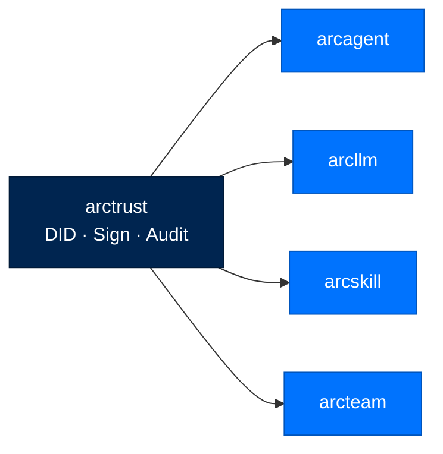
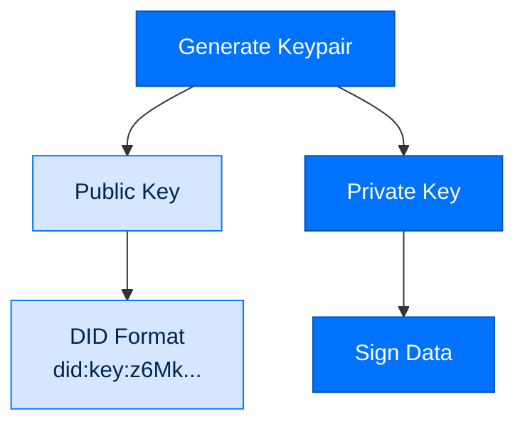

# arctrust - Security Primitives

> **Building with Arc**  ·  Build  ·  page 12 of 27  
> **For** Engineers writing code against Arc  
> [← arcrun](arcrun.md)  ·  [Docs home](../../README.md)  ·  [arcstore →](arcstore.md)

---

## Overview

`arctrust` is the cryptographic foundation of Arc, providing:
- **Ed25519 Decentralized Identifiers (DIDs)** for agent identity
- **Sigstore signature verification** for artifact integrity
- **Operator-signed audit trails** for non-repudiable logging
- **FIPS-compliant cryptography** for federal deployments

This is the only package with **zero Arc dependencies** — it is the root of trust.



---

## Core Concepts

### Decentralized Identifiers (DID)



Every agent gets a DID at creation time:

```python
from arctrust import generate_did, generate_keypair

# Generate a new identity
did = DID.generate()
# did.did = "did:key:z6Mk..."  (public verification)
# did.key = "z6Mk..."          (base58 public key)

# Sign a message
signature = did.sign(b"Hello, world!")

# Verify (anyone can do this with the public DID)
is_valid = did.verify(b"Hello, world!", signature)  # True
```

### Key Storage

Keys are stored with strict permissions:

```
~/.arc/keys/
├── agent_did.key      # 0600 permissions
├── operator.key       # 0600 permissions
└── skill_issuer.key   # 0600 permissions
```

```python
from arctrust.keypair import KeyPair

store = KeyPair(Path("~/.arc/keys"))
did = store.load_agent_did()  # Loads and validates permissions
```

---

## Audit System

### Operator-Signed Chain

```mermaid
flowchart LR
    classDef record fill:#0073FE,stroke:#0055BC,color:#FFFFFF
    classDef link fill:#002550,stroke:#001A38,color:#FFFFFF

    R1[Record 1<br/>sig1]:::record --> R2[Record 2<br/>sig2]:::record
    R2 --> R3[Record 3<br/>sig3]:::record
    sig1[sign(prev_sig + record1)]:::link --> R1
    sig2[sign(prev_sig + record2)]:::link --> R2
    sig3[sign(prev_sig + record3)]:::link --> R3
```

Every audit record chains to the previous:

```python
from arctrust.audit import AuditEvent, emit

# Initialize with operator's signing key
audit = AuditEvent(operator_signer)

# Log an action
record: AuditRecord = audit.log(
    action="tool_execution",
    actor="did:key:z6Mk...",  # Agent's DID
    resource="web_search",
    outcome="success",
    metadata={"query": "quantum computing", "duration_ms": 1250}
)

# Verify chain integrity
assert audit.verify_chain()  # True if chain is valid
```

### Audit Record Structure

```json
{
  "id": "audit_01H7XQ2K3M4N5P6Q7R8S9T0",
  "timestamp": "2026-07-31T10:30:00Z",
  "prev_signature": "ed25519:6Mk...previous...",
  "action": "tool_execution",
  "actor": "did:key:z6MkAgent...",
  "resource": "web_search",
  "outcome": "success",
  "metadata": {
    "query": "quantum computing",
    "duration_ms": 1250,
    "cost_usd": 0.003
  },
  "operator_signature": "ed25519:6Mk...operator..."
}
```

---

## Signature Verification

### Sigstore Integration

```python
from arctrust.artifact import verify_artifact

# Verify a signed artifact
result = verify_artifact(
    bundle_path="skill-1.0.0.bundle",
    issuer_did="did:key:z6MkIssuer..."
)

if result.valid:
    print(f"SLSA Level: {result.slsa_level}")
    print(f"Rekor UUID: {result.rekor_uuid}")
else:
    raise SecurityError(f"Invalid signature: {result.error}")
```

### Rekor Inclusion Proof

```python
from arctrust.witness import TransparencyLogWitness, WitnessAnchor

# Verify signature is in transparency log
inclusion = TransparencyLogWitness().verify(
    signature=result.signature,
    rekor_uuid=result.rekor_uuid
)

assert inclusion.verified  # True if in public log
```

---

## FIPS Compliance

### Federal Tier Cryptography

```python
from arctrust.fips import assert_fips_if_required, fips_backend_active

# Check FIPS availability
if fips_backend_active():
    signer = FIPSSigner(vault_client)
    signature = signer.sign(data)  # Uses ECDSA-P256
```

### FIPS Requirements

| Requirement | Personal/Enterprise | Federal |
|-------------|---------------------|---------|
| Algorithm | Ed25519 | ECDSA-P256 |
| Key Size | 256-bit | 256-bit |
| Hash | SHA-256 | SHA-256 |
| Validation | Self-signed OK | FIPS-validated only |

---

## API Reference

### Classes

```python
class DID:
    did: str              # Full DID string
    key: str              # Base58 public key
    
    @classmethod
    def generate() -> DID: ...
    
    def sign(self, data: bytes) -> str: ...
    def verify(self, data: bytes, signature: str) -> bool: ...

class AuditEvent:
    def __init__(self, signer: Signer): ...
    
    def log(
        self,
        action: str,
        actor: str,
        resource: str,
        outcome: str,
        metadata: dict = None
    ) -> AuditRecord: ...
    
    def verify_chain(self) -> bool: ...

class Signer(Protocol):
    def sign(self, data: bytes) -> str: ...
    def public_key(self) -> str: ...

class FIPSSigner(Signer):
    def __init__(self, vault_client): ...
```

### Types

```python
class AuditRecord(TypedDict):
    id: str
    timestamp: str
    prev_signature: str
    action: str
    actor: str
    resource: str
    outcome: str
    metadata: dict
    operator_signature: str

class SignatureResult(TypedDict):
    valid: bool
    slsa_level: int
    rekor_uuid: str
    error: str = None
```

### Functions

```python
def load_operator_key(path: Path) -> Signer: ...
def load_agent_did(path: Path) -> DID: ...
def verify_artifact(bundle_path: Path, issuer_did: str) -> SignatureResult: ...
def TransparencyLogWitness().verify(signature: str, rekor_uuid: str) -> InclusionProof: ...
def compute_content_hash(data: bytes) -> str: ...
```

---

## Security Considerations

### Key Protection

- Keys stored with `0600` permissions
- Never logged or serialized
- Operator key separate from agent keys
- FIPS mode requires hardware-backed keys

### Chain Integrity

```python
def verify_chain_integrity(log_path: Path) -> bool:
    """
    Verify audit chain has not been tampered with.
    Returns False if any record has been modified.
    """
    records = load_audit_records(log_path)
    for i, record in enumerate(records[1:], 1):
        expected_prev = records[i-1].operator_signature
        if record.prev_signature != expected_prev:
            return False
    return True
```

---

## Testing

```python
# tests/test_did.py
def test_did_generation():
    did = DID.generate()
    assert did.did.startswith("did:key:")

def test_signature_verification():
    did = DID.generate()
    signature = did.sign(b"test")
    assert did.verify(b"test", signature)
    assert not did.verify(b"wrong", signature)

# tests/test_audit.py
def test_audit_chain():
    signer = TestSigner()
    audit = AuditEvent(signer)
    
    r1 = audit.log("action1", "actor1", "res1", "success")
    r2 = audit.log("action2", "actor2", "res2", "success")
    
    assert audit.verify_chain()
```

---

## Next Steps

- [Security Model](../../reference/security.md) - Full security architecture
- [API Reference](../../reference/api.md) - Complete API documentation
- [Package Index](../package-index.md) - All Arc packages

---

## Verified public surface

> Introspected from the installed package on the current commit. Every name
> below is importable exactly as shown; full signatures are in the
> [API reference](../../reference/api.md#arctrust).

### Classes

| Class | Purpose |
|---|---|
| `AgentIdentity` | Ed25519 identity with DID and sign/verify capabilities. |
| `AppendOnlyMediumWitness` | Offline/air-gapped witness: append the head to a second custodied file. |
| `ArcTrustFipsError` | The federal FIPS floor was not met — refuse to proceed (fail-closed). |
| `ArtifactSignature` | Detached signature manifest written beside a signed artifact. |
| `AuditEvent` | Immutable structured audit event. |
| `AuditSink` | Protocol for audit event sinks. |
| `CapabilitySource` | Source bundle to evaluate. |
| `ChildIdentity` | Derived identity for a spawned child agent. |
| `Classification` | US Government classification hierarchy (total order, low to high). |
| `ClassificationLayer` | No-read-up gate at the tool surface — a pure predicate. |
| `ClearanceContext` | Caller clearance + resource classification for a call — filled by arcagent. |
| `Decision` | Immutable result of a policy evaluation. |
| `FileNotaryTransit` | Reference :class:`VaultTransit`: signs via a separate notary process. |
| `InProcessSigner` | Signs in-process with a seed held in memory (Ed25519 or ECDSA-P256). |
| `KeyPair` | Immutable Ed25519 keypair. |
| `NullSink` | No-op audit sink. Events are discarded immediately. |
| `OperatorKey` | Ed25519 audit-signing credential for a deployment. |
| `OperatorKeyIntegrityError` | The operator key is missing-after-present, symlinked, mis-owned, or swapped. |
| `PolicyContext` | Runtime context for policy evaluation. |
| `PolicyLayer` | Single decision boundary within the pipeline. |
| `PolicyPipeline` | Ordered, short-circuiting, fail-closed policy evaluator. |
| `Signer` | A source of non-repudiable signatures over arbitrary bytes. |
| `SignerConfig` | Config that selects a signer: custody model + algorithm + key reference. |
| `SignerError` | A signer could not be constructed or a custody invariant was violated. |
| `TofuDecision` | Outcome of a TOFU evaluation. |
| `TofuLayer` | Per-tier source-approval gate. |
| `ToolCall` | Immutable request to invoke a tool. |
| `TransparencyLogWitness` | Online Rekor-style witness — a thin submitter over an injected transport. |
| `TrustStoreError` | Trust-store load, permission, or key-format failure. |
| `ValidatorEntry` | A single TOFU-approved validator script (R-042 / R-043). |
| `ValidatorsConfig` | ``[security.validators]`` block — TOFU policy state. |
| `VaultSigner` | Signs by reference through a :class:`VaultTransit`; the seed never enters this process. The public key is cached from th |
| `VaultTransit` | The out-of-process signing boundary (sign-by-reference). |
| `WitnessAnchor` | External witness for an operator-signed checkpoint head. |
| `WitnessDivergenceError` | The local operator-signed head is not attested by the external witness. |
| `WormSink` | Durable, append-only, Ed25519-signed hash-chained audit log. |

### Functions

| Function | Signature |
|---|---|
| `algorithm_is_fips_approved` | `(algorithm: 'str') -> 'bool'` |
| `approve` | `(config_path: 'Path', *, name: 'str', source: 'str', approver: 'str', timestamp: 'str') -> 'Validato` |
| `approve_source` | `(validators: 'ValidatorsConfig', *, name: 'str', source: 'str', approver: 'str', timestamp: 'str') -` |
| `arc_home` | `() -> 'Path'` |
| `assert_fips_if_required` | `(*, require_fips: 'bool', algorithm: 'str') -> 'None'` |
| `build_pipeline` | `(*, tier: '_Tier', agent_registry: 'dict[str, bytes] \| None' = None, global_deny_rules: 'dict[str, s` |
| `build_signer` | `(config: 'SignerConfig', *, seed: 'bytes \| None' = None, vault_transit: 'VaultTransit \| None' = None` |
| `canonical_json` | `(obj: 'Any') -> 'bytes'` |
| `content_sha256` | `(content: 'bytes') -> 'str'` |
| `default_operator_key_path` | `() -> 'Path'` |
| `derive_child_identity` | `(*, parent_sk_bytes: 'bytes', spawn_id: 'str', wallclock_timeout_s: 'float \| None' = None, parent_cl` |
| `disapprove` | `(config_path: 'Path', *, name: 'str') -> 'bool'` |
| `dominates` | `(clearance: 'Classification', resource: 'Classification') -> 'bool'` |
| `emit` | `(event: 'AuditEvent', sink: 'AuditSink') -> 'None'` |
| `fips_backend_active` | `() -> 'bool'` |
| `generate_did` | `(verify_key: 'VerifyKey', *, org: 'str', agent_type: 'str') -> 'str'` |
| `generate_keypair` | `() -> 'KeyPair'` |
| `hash_source` | `(source: 'str') -> 'str'` |
| `invalidate_cache` | `() -> 'None'` |
| `load_issuer_pubkey` | `(did: 'str', *, trust_dir: 'Path \| None' = None) -> 'bytes'` |
| `load_operator_pubkey` | `(did: 'str', *, trust_dir: 'Path \| None' = None) -> 'bytes'` |
| `load_validators` | `(config_path: 'Path') -> 'ValidatorsConfig'` |
| `parse_classification` | `(value: 'str', *, strict: 'bool') -> 'Classification'` |
| `parse_did` | `(did: 'str') -> 'dict[str, str]'` |
| `persist_validators` | `(config_path: 'Path', validators: 'ValidatorsConfig') -> 'None'` |
| `read_verified_anchor` | `(chain_path: 'Path', public_key: 'bytes', *, action: 'str' = 'trace.checkpoint', genesis_tip: 'str' ` |
| `register_operator` | `(did: 'str', public_key: 'bytes', *, trust_dir: 'Path \| None' = None, notes: 'str' = '') -> 'None'` |
| `sign` | `(message: 'bytes', private_key: 'bytes') -> 'bytes'` |
| `sign_artifact` | `(content: 'bytes', *, signer_did: 'str', private_key: 'bytes') -> 'ArtifactSignature'` |
| `validate_did` | `(did: 'str') -> 'str'` |
| `verify` | `(message: 'bytes', signature: 'bytes', public_key: 'bytes') -> 'bool'` |
| `verify_artifact` | `(content: 'bytes', manifest: 'ArtifactSignature', *, trusted_public_key: 'bytes \| None' = None) -> '` |
| `verify_chain` | `(path: 'Path', public_key: 'bytes', *, genesis_tip: 'str' = '000000000000000000000000000000000000000` |
| `verify_local_head_witnessed` | `(local_checkpoint: 'dict[str, Any] \| None', witness: 'WitnessAnchor', *, federal: 'bool') -> 'None'` |
| `verify_signature` | `(algorithm: 'str', message: 'bytes', signature: 'bytes', public_key: 'bytes') -> 'bool'` |
| `worm_policy_sink` | `(sink: 'AuditSink') -> 'Callable[[str, dict[str, Any]], None]'` |

