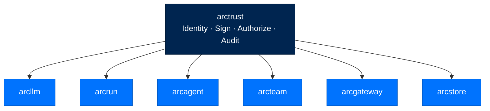
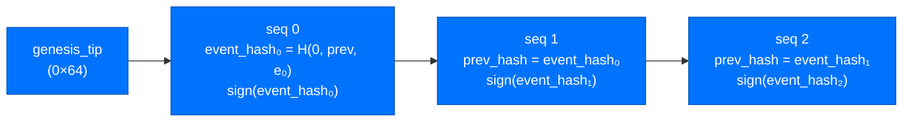
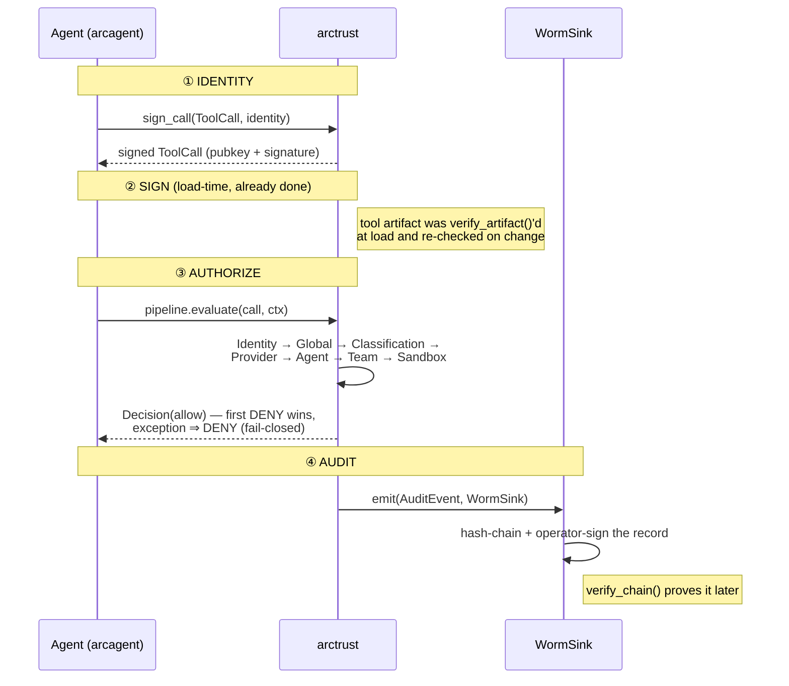

# arctrust - The Cryptographic Foundation

> **Building with Arc**  ·  Build  ·  page 12 of 27
> **For** Engineers writing code against Arc
> [← arcrun](arcrun.md)  ·  [Docs home](../../README.md)  ·  [arcstore →](arcstore.md)

---

## In one breath

`arctrust` is the **leaf** of the Arc dependency graph — the one package every
other package trusts and that trusts none of them. It owns the four primitives
that make an agent action *accountable*: a cryptographic **Identity** (a DID
bound to an Ed25519 key), a **Sign**/verify seam over every loaded artifact, an
**Authorize** pipeline that gates every tool call, and an **Audit** chain that
records what happened in a form no one can silently rewrite. These are the
**Four Pillars** (ADR-019), and they are universal — present at every tier, not
bolted on for federal.

Nothing here imports another Arc package. That is not an accident of layering;
it is the property that lets identity, signing, policy, and audit be shared by
`arcllm`, `arcrun`, `arcagent`, `arcteam`, and `arcgateway` without any of them
pulling the others in. The rule is enforced by `tests/test_layering.py`.



The public surface is imported one way: `import arctrust`. Dependencies are
PyNaCl (Ed25519), PyCA `cryptography` (ECDSA-P256 / FIPS), and Pydantic 2 —
**no Arc imports**.

---

## The Four Pillars, and who consumes them

Each pillar is a primitive here and a consumer relationship upstairs. arctrust
provides the machinery; the layers above *call* it — they never re-implement it.
Identity, Sign, Authorize, and Audit belong here and are not reimplemented
upstairs.

| Pillar | Primitive in arctrust | Consumed by |
|--------|----------------------|-------------|
| **Identity** | `AgentIdentity`, `generate_did`, `did_matches_pubkey`, `derive_child_identity` | `ArcAgent.__init__` requires a DID; every tool dispatch carries `caller_did`; `arcteam` signs inter-agent messages with the identity seed |
| **Sign** | `Signer` seam (`build_signer`), `sign_artifact` / `verify_artifact`, `canonical_json` | `arcagent`'s capability loader signs artifacts on write, re-verifies at load; `arcprompt` signs prompt overlays; `arcbundle`/`arcskill` verify signed bundles |
| **Authorize** | `PolicyPipeline`, `build_pipeline`, `ToolCall`, `Decision`, `ApprovalGrant`, `ScenarioGrant` | `arcagent.core.tool_registry` evaluates the pipeline before every tool call; the concrete agent-specific layers plug into the Protocol |
| **Audit** | `AuditEvent`, `emit`, `WormSink`, `verify_chain` | every security-relevant operation in every package emits an event; `arcui` mirrors it live; `arc store verify` re-checks the chain |

**Tier is stringency metadata, not a gate.** The same four pillars run at
personal, enterprise, and federal. What changes is *how strict* each is — FIPS
crypto, a signed agent registry, all seven policy layers, an external audit
witness. The dial turns the stringency up; it never adds or removes a pillar.

---

## Pillar 1 — Identity

### The DID format

Arc uses its own DID method, **not** `did:key` or `did:web`:

```
did:arc:{org}:{agent_type}/{hash}
         │      │            └─ first 8 hex chars of SHA-256(public_key)
         │      └─ role: executor, planner, child, approver, …
         └─ deployment org: default, doe, operator, …
```

The hash suffix is a **fingerprint of the public key** (`identity.py:
did_from_public_key`). This is the binding that makes a DID un-spoofable: a
caller claiming a DID must present the public key whose `sha256[:8]` matches, and
must prove possession of the matching private key with a signature.
`did_matches_pubkey` does the fingerprint check in constant time (`hmac.compare_digest`)
and never raises — a malformed DID is simply `False`.

### AgentIdentity — the canonical identity object

`AgentIdentity` (`identity.py`) is an Ed25519 identity with a DID and
sign/verify. It has two modes:

- **Full** — carries a `SigningKey`; `can_sign` is `True`.
- **Verify-only** — constructed from a public key alone; `sign()` raises.

```python
import arctrust

# Generate a fresh identity (new keypair + derived DID)
identity = arctrust.AgentIdentity.generate(org="default", agent_type="executor")
# identity.did  → "did:arc:default:executor/1a2b3c4d"

signature = identity.sign(b"hello")            # 64-byte Ed25519 signature
identity.verify(b"hello", signature)           # True

# Persist / reload with enforced permissions
identity.save_keys(key_dir)                     # dir 0700, .key 0600, .pub 0644
reloaded = arctrust.AgentIdentity.load_keys(identity.did, key_dir)
```

`load_keys` **rejects insecure permissions** — a key file readable by group or
other raises `ValueError`, because loose permissions signal tampering or
misconfiguration. `from_config` resolves the DID from an `arcagent.toml`,
generating and persisting a new identity when the `did` field is empty (the
config file is the single source of truth for an agent's DID).

### Non-exportable keys — the signing-capability seam

Raw private key material is never handed around casually. Code receives a
*capability to sign*, not the seed:

- The private `SigningKey` is a name-mangled `_signing_key` attribute. Callers
  never touch it directly.
- The **one auditable seam** for reading seed bytes is the `signing_seed`
  property, used only where a downstream signer must reconstruct the key (e.g.
  `arcteam`'s message signer). It raises on a verify-only identity.
- Under vault custody there is **no seed to hand out at all** — see Pillar 2.

### Operator key ≠ agent identity

This distinction is enforced by the type system. `OperatorKey` (`operator.py`)
is the deployment's **audit authority**. It is deliberately *not* an
`AgentIdentity`: it exposes only `seed` and `public_key` — **no `sign`, no
`did`**. It is "a notary seed, not an entity."

Why the separation exists: it closes the finding where the *audited subject was
the audit authority*. If an agent signed its own tamper-evident history, an
actor holding the agent's seed could re-sign a rewritten chain and `verify_chain`
would still pass. Every WORM audit chain is therefore signed by an operator key
that no agent identity ever holds.

`OperatorKey.load` is hardened against custody attacks:

| Attack | Mitigation |
|--------|-----------|
| Covert erasure (`rm operator.key` + restart to mint a clean chain) | A missing key when a `.pub` sentinel or a prior chain exists → **fail closed**, never regenerate (AU-9) |
| Bootstrap race (agent + CLI both start) | `O_CREAT｜O_EXCL` atomic create; the loser adopts the winner's key — never a split chain |
| Symlink redirect / TOCTOU | Reads use `O_NOFOLLOW`; ownership + parent-dir permissions verified; created `0600` in one syscall |
| Out-of-band key swap | The loaded key's fingerprint is checked against the recorded `.pub`; a mismatch raises `OperatorKeyIntegrityError` |

### Child identities — bounded delegation

`derive_child_identity` mints a short-lived identity for a spawned child agent
via HKDF-SHA256 over the parent seed and a per-spawn nonce (`spawn_id`). Two
properties matter:

- **Unpredictable + unique** (ASI-03): a child key cannot be guessed without the
  parent seed, and cannot be reused across spawns.
- **Clearance never widens** (SPEC-038 REQ-022): `child_clearance = min(requested,
  parent_clearance)`. A child can never out-clear its parent; the federal
  hard-deny on an over-request is the caller's job, the clamp is here.

The child DID suffix is `sha256(child_public_key)[:8]` — the same fingerprint
rule as every other DID, so a child's signed calls pass `IdentityLayer` exactly
like a top-level agent's.

---

## Pillar 2 — Sign

### The Signer seam — one Protocol, two custody models

Every non-repudiable signature Arc emits resolves through a `Signer`
(`signer.py`). The verifier only ever needs `public_key` and `algorithm`; the
private material lives behind `sign()`.

```python
@runtime_checkable
class Signer(Protocol):
    @property
    def public_key(self) -> bytes: ...
    @property
    def algorithm(self) -> str: ...          # "ed25519" | "ecdsa-p256"
    def sign(self, message: bytes) -> bytes: ...
```

Two implementations sit behind it:

- **`InProcessSigner`** — holds the seed in memory. Ed25519 (PyNaCl) is the
  personal/enterprise default; ECDSA-P256 (PyCA `cryptography`) is the
  FIPS/federal option.
- **`VaultSigner`** — signs **by reference**. It hands the message to a
  `VaultTransit` boundary (Vault Transit, a PKCS#11 HSM, cloud KMS, or the
  reference `FileNotaryTransit`) and receives a signature. **The seed never
  enters this process.** `VaultTransit` deliberately exposes no seed accessor.

`build_signer(config, *, seed, vault_transit)` is the config-selected factory,
and it **fails closed**: `vault_transit` custody with no transit client is a
hard `SignerError`, *never* a silent fallback to in-process signing even when a
seed is present (NFR-3). This is the mechanism behind "credentials never touch
the filesystem" at federal — the seed is custodied out-of-process and the code
holds only a signing handle.

ECDSA signatures are emitted in canonical **low-S** form and high-S encodings
are rejected on verify, so an adversary cannot forge a second valid encoding of
an existing signature. `verify_signature(algorithm, …)` is the single
algorithm-dispatched entry point shared by every verifier; an unknown algorithm
returns `False` (never a raise, never a default).

### Artifact signing — content-addressed, verified at load and on change

`sign_artifact` / `verify_artifact` (`artifact.py`) implement detached
signatures over arbitrary bytes. A signed artifact carries an `ArtifactSignature`
manifest (serialised to a `.arcsig` sidecar):

```python
manifest = arctrust.sign_artifact(content, signer_did=did, private_key=seed)
# ArtifactSignature(artifact_sha256="sha256:…", signer_did=…,
#                   public_key=<hex>, signature=<hex>, algorithm="ed25519", signed_at=…)

ok = arctrust.verify_artifact(content, manifest, trusted_public_key=pinned_key)
```

`verify_artifact` returns `True` only when **all** hold: the content digest
matches (content-addressing), the signature verifies under the manifest's *own
recorded* `algorithm`, and — when a `trusted_public_key` is pinned — the
manifest key equals it. It never raises; any malformed field collapses to
`False`. The algorithm is dispatched, never assumed, so relabelling a manifest
can only ever *refuse* it.

**Honest semantics** (stated in the module itself): a valid signature proves the
bytes are *unmodified since the signer wrote them* and *attributes* them to the
signer's DID key. It does **not** prove the content is safe — a compromised
signer produces a perfectly valid signature over malicious bytes. Safety belongs
to the TOFU gate and the execution sandbox, never to this primitive.

This is the seam `arcagent`'s capability loader uses to re-verify agent-authored
tools at load and again when a file changes — a direct filesystem edit to a tool
never changes what the agent trusts, because the signature no longer matches.

### canonical_json — the byte form every signature commits to

A signature over structured data is only meaningful if signer and every verifier
serialise it to the *same bytes*. `canonical_json` (`canonical.py`) is that one
serializer: `sort_keys=True`, most-compact separators, `ensure_ascii=True`, and
**no `default=` coercion** (a non-serialisable value fails loudly rather than
drifting into a different byte form). Anything hashed for signing goes through it
— the core rule "anything hashed for signing must go through `canonical_json`".

### TOFU — trust-on-first-use for self-executing code

`TofuLayer` (`tofu.py`) gates capability **load** (distinct from tool
*invocation*, which is Pillar 3). It answers "may this source run for the first
time?" per tier:

- **personal** — signed with the agent's own pinned key → `ALLOW`; else gated by
  the `auto_run_agent_code` toggle.
- **enterprise** — match by name: new name → `NEW_SIGHTING` (prompt the human);
  known name + matching hash → `ALLOW`; known name + drifted hash → `DENY` (tamper).
- **federal** — a valid signature is the *floor* (unsigned → `DENY`), then the
  same human-approval gate as enterprise. A self-signature attributes code; it
  does not authorize it.

Approvals persist only in the `[security.validators]` block of `arcagent.toml`
(`validators.py`), which lives at agent root, **never in the workspace**, and
which the agent has no write access to — only a human operator updates it via
`arc trust approve`.

### Transparency witness — the federal anti-rollback residual

The operator key closes "audited subject == audit authority", but a holder of
the operator seed could still re-sign a *local* chain. The federal mitigation
(`witness.py`) is an **external** witness the key-holder does not control:

- `AppendOnlyMediumWitness` — offline/air-gapped: append the operator-signed
  checkpoint head to a second, separately-custodied append-only medium (opened
  `O_WRONLY｜O_APPEND｜O_CREAT｜O_NOFOLLOW`, never truncated). MUST NOT live in the
  operator-key directory.
- `TransparencyLogWitness` — an online Rekor-style submitter over an injected
  transport, for deployments with network egress.

A forger with the operator key can rewrite the local chain but cannot
retroactively remove the head from a log they do not own, so a rollback past the
last witnessed anchor is **detectable**. `verify_local_head_witnessed` fails
closed at federal startup (`WitnessDivergenceError`); non-federal tiers warn.

---

## Pillar 3 — Authorize

### The PolicyPipeline

`PolicyPipeline` (`policy.py`) is an **ordered, short-circuiting, fail-closed**
evaluator. It holds the engine and the contract types; the concrete
agent-specific layer *content* is assembled by `build_pipeline`. Three
invariants define it:

1. **First-DENY-wins.** Layers run in order; the first `DENY` short-circuits and
   is returned with structured context (which layer, which rule, what inputs —
   R-014).
2. **Fail-closed on exceptions.** Any layer that raises is caught and converted
   to `DENY` (`rule_id="layer_error"`, R-012). A raising gate never means
   "allow".
3. **Authentication runs first, before any short-circuit.** The `IdentityLayer`
   is evaluated *before* the restricted-mode check and *before* the decision
   cache, so an unsigned or forged call can never be handed a safe-set `ALLOW` in
   restricted mode nor a cache-hit `ALLOW` minted for a validly-signed call.

The decision cache key binds the signature fingerprint, the session
capabilities, and a digest of the mutable context state — so a cached `ALLOW` is
never replayed across a different signer, nor past a budget/clearance that has
since moved.

### The layers and the tier matrix

`build_pipeline(*, tier, …)` assembles exactly the right layers for a tier.
Identity runs first at **every** tier (authentication is universal, ADR-019):

| Layer | Enforces | personal | enterprise | federal |
|-------|----------|:---:|:---:|:---:|
| `IdentityLayer` | call is signed by the holder of its claimed DID; enterprise/federal also require the DID be in the admitted registry | ● | ● | ● |
| `GlobalLayer` | tenant-wide tool denylist + forbidden capability compositions (the Lethal Trifecta gate) | ● | ● | ● |
| `ClassificationLayer` | Bell-LaPadula no-read-up over the clearance ladder | | ● | ● |
| `ProviderLayer` | per-provider token/cost/rate budgets (LLM10) | | ● | ● |
| `AgentLayer` | per-agent tool allowlist | | ● | ● |
| `TeamLayer` | role scope + delegation-grant ceiling (ASI03) | | | ● |
| `SandboxLayer` | tool verified + isolation available (ASI04/ASI05) | | ● | ● |

Personal runs 2 layers, enterprise 6, federal 7. `SandboxLayer` is listed after
`Team` in the federal order.

### The configured-gate rule

This is the single principle that keeps a two-layer personal pipeline from
being either brittle or insecure. Every relaxable layer follows it:

> **No policy configured → ALLOW. Configured-but-blind → DENY.**

- With **no** budget/clearance/isolation policy configured, the layer is a
  genuine no-op and allows — absence of a policy is not a violation.
- Once a policy **is** configured but the telemetry it needs is missing, the
  layer **fails closed**. A real budget with a blind meter cannot be proven
  within bounds; enforced classification with no clearance labels cannot prove
  no-read-up.

`build_pipeline` is the *single authority* for the federal floor: it forces
`classification_enforced=True` at federal regardless of the operator flag, and
makes `personal` the only relaxable tier. The floor never depends on an operator
remembering to set a flag.

### ToolCall attestation

A `ToolCall` is authenticated only when its `signature` is a valid Ed25519
signature over `signing_bytes()` under `public_key`, **and** that public key's
fingerprint matches `agent_did` (`verify_call`, three required conditions, all
fail-closed). The `public_key`/`signature` pair is deliberately excluded from
`signing_bytes()` — they *are* the attestation, they cannot also be inside what
is attested. `sign_call` overwrites `agent_did` with the signer's own DID, so a
caller cannot sign content while claiming a different identity.

### ApprovalGrant — one-shot human approval

When the `GlobalLayer` blocks a forbidden capability composition (the Lethal
Trifecta: private data + external comms + untrusted input), a human can unlock
*exactly that one call* with an `ApprovalGrant`:

- Minted by an **operator authority** over the hash of exactly one `ToolCall`
  (`sign_approval`), signed with the operator's own key.
- `verify_approval` requires four conditions, all fail-closed: the approver is
  **not** the agent's own DID (**ASI09 — no self-approval**), the `call_hash`
  binds to exactly this call (one-shot), the key fingerprint matches the approver
  DID, and the signature verifies under the grant's recorded algorithm.
- Approval-bearing calls bypass the decision cache entirely, so a cached
  composition `DENY` can never defeat the human-approval flow.

### ScenarioGrant — standing approval for recurring automation

A one-shot grant is spent the moment the arguments change — right for a human at
a keyboard, fatal for a nightly workflow (every night is a different call, so it
would re-prompt an operator who is asleep and die on the tool deadline).

A `ScenarioGrant` binds instead to the **five facts that make an action the same
scenario each time**: the acting agent, the tool, the forbidden composition being
waived, the automated `origin` (`workflow:<id>` / `schedule:<id>`), and the
external `connection`. Everything else (arguments, session, run id) is free to
vary.

`origin` is the safety key. Interactive work carries **no origin** and therefore
matches no grant, so a waiver earned by automation never silently covers a
free-form chat request. `verify_scenario_grant` fails closed on any field
mismatch, on a `None` origin/connection, and on self-approval (ASI09). Grants are
**verified here, never loaded here** — candidates arrive on
`PolicyContext.scenario_grants` from `arcagent`, exactly as clearance and session
capabilities do. arctrust does no I/O.

---

## Pillar 4 — Audit

### AuditEvent — the structured record

`AuditEvent` (`audit.py`) is a frozen Pydantic schema answering *who did what to
what, when, and with what outcome*: `actor_did`, `action` (dotted, e.g.
`tool.call`, `policy.evaluate`), `target`, `outcome`, and optional
`classification` / `tier` / `request_id` / `payload_hash`. The timestamp
auto-populates at creation. Raw payloads are never stored — only a `payload_hash`
(AU-9 minimization).

### emit — the single, fail-open emission point

```python
arctrust.emit(event, sink)
```

`emit` dispatches one event to one sink and **swallows every sink error** (NIST
AU-5: the audit system must never interrupt the operation being audited). A
failing sink is logged at WARNING and never re-raised.

Fan-out is by composition, not by one god-sink. The `worm_policy_sink` adapter
turns the policy pipeline's flat `(event_type, payload)` callback into an
`AuditEvent` routed through `emit`, so a policy decision lands as one
tamper-evident chain record. Live observability (`arcui`'s UI bridge sink)
subscribes as an additional sink upstairs. `WormSink` is the durable system of
record that **superseded** the older unchained `JsonlSink` and the
in-memory-only `SignedChainSink` — one durable, tamper-evident write-once record
instead of two partial ones.

### WormSink — the tamper-evident WORM chain

`WormSink` is the compliance system of record: a durable, append-only,
Ed25519-signed **hash chain** on disk. Each `write()` appends one JSON line
`{seq, event, prev_hash, event_hash, algorithm, signature}` to a `0600` file.



Every `event_hash` is `SHA-256(canonical_json({seq, prev_hash, event}))` and is
Ed25519/ECDSA-signed by the **operator** key. The hash commits the link
(`prev_hash`), the position (`seq`), and the content (`event`) at once — changing
any of the three is detectable. Guarantees:

- **Restart-safe** — `chain_tip`/`seq` recovered from the file tail on
  construction (unlike the old in-memory chain).
- **Tamper-evident** — `verify_chain` checks hash links, the signature of every
  record, sequence contiguity from 0 (no mid-deletion), `prev_hash` chaining, and
  the genesis anchor.
- **Single-writer** — an exclusive `flock` for the sink's lifetime; a second
  writer on the same active file raises (forked chains are an integrity hazard).
- **Crash-recoverable** — a torn final line is truncated and an explicit signed
  `audit.worm.recovery` record appended (silent truncation is indistinguishable
  from adversarial truncation).
- **Bounded** — rotates to seq-named segments so verification streams rather than
  holding the whole chain in RAM.
- **Sealed at rest** — with a `RecordCipher`, each record's captured content is
  encrypted *before* it is hashed (D-577), so the chain commits to the ciphertext
  and `verify_chain` still passes **without the sealing key**.

`verify_chain(path, public_key, *, genesis_tip=…)` is the lock-free read path
(`arc store verify`). Supplying an out-of-band `genesis_tip` detects head
replacement (anti-genesis-substitution). `read_verified_anchor` closes the one
gap `verify_chain` cannot — it proves the chain is internally consistent, then
returns the newest signed `trace.checkpoint` payload so a caller can prove a live
store was not rolled back past the last anchor.

### No erasure in a federal audit store

The audit chain is **append-only by construction** and never rewrites history.
Compliance retention is expressed as retention/rotation of whole segments, never
as crypto-shredding or in-place deletion of a record — deleting a record breaks
`seq` contiguity and fails `verify_chain`. Removing content is done by *sealing*
it at rest (`RecordCipher`), which keeps the record — and the chain's integrity
proof — intact.

---

## Classification

`classification.py` owns the one ordered ladder for the whole codebase; siblings
import it and never redefine it.

```python
class Classification(IntEnum):     # total order, low → high
    UNCLASSIFIED = 0
    CUI          = 1
    CONFIDENTIAL = 2
    SECRET       = 3
    TOP_SECRET   = 4
```

- **`dominates(clearance, resource)`** — `clearance >= resource`. The
  Bell-LaPadula "no read up" / "no write down" predicate shared by the
  `ClassificationLayer`, the inter-agent messenger, and egress checks (NIST
  AC-4).
- **`parse_classification(value, *, strict)`** — `strict=True` (federal): an
  unknown or empty label **raises** (fail closed, never default-permissive).
  `strict=False` (personal/enterprise): unknown → warn + `UNCLASSIFIED`.

Compartments/caveats (NOFORN, SCI) are deliberately out of scope for now.

---

## Tiers as a stringency dial

The same primitives run everywhere; a small set of config floors turn the
stringency up. No pillar is added or removed between tiers.

| Concern | personal | enterprise | federal |
|---------|----------|------------|---------|
| **Signing algorithm** | Ed25519 (PyNaCl) | Ed25519 | **ECDSA-P256**, FIPS-validated backend |
| **Key custody** | in-process seed (`0600`) | in-process or vault | **vault_transit** — seed never in-process |
| **FIPS floor** | off | off | `require_fips=true` → `assert_fips_if_required` fails closed unless the backend is CMVP-validated *and* the algorithm is FIPS-approved |
| **Policy layers** | 2 (Identity, Global) | 6 | **7** (adds Team) |
| **Agent admission** | any validly self-signed key | signed **allowlist/registry** required | signed registry required |
| **Classification** | relaxable (no-op when blind) | honors operator flag | **enforced** fail-closed floor |
| **Audit** | operator-signed WORM chain | WORM chain | WORM chain **+ external witness** (anti-rollback) |
| **TOFU** | signed-or-toggle | name+hash approval | signature floor **+** operator approval |

Note on FIPS: Arc's Ed25519 is PyNaCl/libsodium, which has no CMVP validation
path, so `assert_fips_if_required` **refuses Ed25519 at federal** and forces
`ecdsa-p256` (`aes-256-gcm` is the approved encryption algorithm). The gate reads
the linked OpenSSL provider's FIPS flag; a PyPI-wheel OpenSSL is never validated,
so a federal deployment links a system CMVP module.

---

## Paths — the ONE arc-home resolver

`arctrust.paths` is the single source of truth for `~/.arc`. Two directories,
and which is which is the whole design:

| Directory | Holds | Belongs to |
|-----------|-------|-----------|
| `~/.arc` | the install — runtime, config, state | **Arc** (disposable) |
| `~/arc` | the fleet, plus the source tarball beside it | **the operator** |

The home is split by **lifecycle** so an update is "install the new one and flip
the symlink": `runtime/` is replaced wholesale, `config/` is preserved, `state/`
(operator key, identity, trust store, arcstore, bundles) is **never touched**.
`arc_team` sits deliberately *outside* the home so deleting `~/.arc` cannot reach
a running agent's memory.

**Two rules the whole codebase depends on:**

1. **Never compose an arc-home path by hand.** Every path is a named accessor
   (`trust_dir()`, `operator_dir()`, `config_file("arcagent.toml")`,
   `module_root()`, …). `arc_home() / "operator"` reads the *pre-split* location;
   after a migration that silently loses the operator signing key, and **every
   WORM chain it signed becomes unverifiable**. Enforced by
   `tests/architecture/test_arc_home_single_resolver.py` — `paths.py` and
   `home_migration.py` are the only exempt files.
2. **Resolve per call, never at import.** `ARC_CONFIG_DIR` is routinely exported
   *after* the module loads (by a service unit, a test, `arc up`). A module-level
   constant would freeze the wrong value.

---

## Threat surface — how the backbone defends itself

arctrust is where the OWASP LLM/Agentic mitigations are actually implemented.
Each row is grounded in a specific mechanism above.

| Threat | Vector | Mitigation in arctrust |
|--------|--------|------------------------|
| **Forged DID** (ASI03) | Claim a DID you don't own | DID suffix = `sha256(public_key)[:8]`; `did_matches_pubkey` + a valid signature prove key possession. `IdentityLayer` denies any call where the presented key doesn't match the claimed DID |
| **Key theft** (ASI03) | Read the seed off disk / out of memory | `VaultSigner` signs by reference — the seed never enters the process. In-process seeds are `0600`, `_signing_key` is name-mangled, seed exposure is one auditable seam |
| **Replay** (ASI07) | Re-submit a captured approval/call | `ApprovalGrant` is one-shot (bound to `call_hash`); `ScenarioGrant` binds five scenario facts + a non-interactive `origin`; the decision cache key binds the signature fingerprint |
| **Self-approval** (ASI09) | Agent approves its own forbidden action | `verify_approval` / `verify_scenario_grant` reject any grant whose `approver_did == agent_did` |
| **Audit truncation** (AU-9) | Delete records to hide activity | Hash chain + contiguous `seq` from 0 — any gap fails `verify_chain`; a torn tail writes a signed recovery marker; `read_verified_anchor` detects head removal |
| **Audit forgery** | Re-sign a rewritten chain | Chains are signed by the **operator** key, never an agent key; `OperatorKey.load` fails closed on covert erasure and key swap; federal adds an external witness |
| **Rollback / downgrade** | Restore an old chain / substitute genesis | Out-of-band `genesis_tip` detects head replacement; the transparency witness detects rollback past the last witnessed anchor |
| **TOCTOU after verify** | Swap a file after it was verified | Artifacts are re-verified at load **and on change**, not just at install; operator-key reads use `O_NOFOLLOW` and recheck ownership |
| **Supply-chain / unauthorized code** (LLM03/ASI04) | Drop a malicious tool in the workspace | `TofuLayer` gates load per tier; a self-signature attributes but does not authorize; federal requires operator approval of every new artifact |
| **Fail-open gate** (LLM06) | Make a policy layer crash to allow | Any layer exception → `DENY` (R-012); configured-but-blind gates fail closed |
| **Budget exhaustion** (LLM10) | Run past cost/rate ceilings | `ProviderLayer` denies over-budget once a limit is configured; an unknown provider label fails closed at enterprise/federal |
| **Signature malleability** | Forge a second valid encoding | ECDSA emitted low-S; high-S rejected on verify; algorithm dispatched, never assumed |

### The Four Pillars on a single tool dispatch



---

## Worked example — sign an artifact, gate a call, audit it

```python
import arctrust

# ── ① IDENTITY ────────────────────────────────────────────────
agent    = arctrust.AgentIdentity.generate(org="default", agent_type="executor")
operator = arctrust.OperatorKey.generate()          # audit authority ≠ agent

# ── ② SIGN — sign an artifact, then re-verify it ──────────────
tool_src = b"def add(a, b): return a + b\n"
manifest = arctrust.sign_artifact(
    tool_src, signer_did=agent.did, private_key=agent.signing_seed
)
assert arctrust.verify_artifact(tool_src, manifest)        # True
assert not arctrust.verify_artifact(tool_src + b"# evil", manifest)  # tamper → False

# ── ③ AUTHORIZE — build a pipeline and evaluate a signed call ─
from arctrust.policy import ToolCall, PolicyContext, sign_call

pipeline = arctrust.build_pipeline(
    tier="personal",
    agent_registry={agent.did: agent.public_key},
)
call = sign_call(
    ToolCall(
        tool_name="add",
        arguments={"a": 2, "b": 3},
        agent_did=agent.did,
        session_id="s-1",
        classification="UNCLASSIFIED",
    ),
    agent,
)
ctx = PolicyContext(tier="personal", policy_version="v1", bundle_age_seconds=0.0)
decision = await pipeline.evaluate(call, ctx)
assert decision.outcome == "allow"          # signed by the DID it claims

# An unsigned call is denied fail-closed by the IdentityLayer, first.

# ── ④ AUDIT — write one tamper-evident, operator-signed record ─
sink = arctrust.WormSink(audit_path, operator.into_signer())
arctrust.emit(
    arctrust.AuditEvent(
        actor_did=agent.did, action="tool.call",
        target="add", outcome=decision.outcome,
    ),
    sink,
)
assert sink.verify_chain()                  # chain intact, signature valid
```

---

## Verified public surface

> Introspected from the installed package on the current commit. Every name
> below is importable exactly as shown; full signatures are in the
> [API reference](../../reference/api.md#arctrust).

### Classes

| Class | Purpose |
|---|---|
| `AgentIdentity` | Ed25519 identity with DID and sign/verify capabilities. |
| `AppendOnlyMediumWitness` | Offline/air-gapped witness: append the head to a second custodied file. |
| `ArcTrustFipsError` | The federal FIPS floor was not met — refuse to proceed (fail-closed). |
| `ArtifactSignature` | Detached signature manifest written beside a signed artifact. |
| `AuditEvent` | Immutable structured audit event. |
| `AuditSink` | Protocol for audit event sinks. |
| `CapabilitySource` | Source bundle to evaluate (TOFU). |
| `ChildIdentity` | Derived identity for a spawned child agent. |
| `Classification` | US Government classification hierarchy (total order, low to high). |
| `ClassificationLayer` | No-read-up gate at the tool surface — a pure predicate. |
| `ClearanceContext` | Caller clearance + resource classification for a call — filled by arcagent. |
| `Decision` | Immutable result of a policy evaluation. |
| `FileNotaryTransit` | Reference `VaultTransit`: signs via a separate notary process. |
| `InProcessSigner` | Signs in-process with a seed held in memory (Ed25519 or ECDSA-P256). |
| `KeyPair` | Immutable Ed25519 keypair. |
| `NullSink` | No-op audit sink. Events are discarded immediately. |
| `OperatorKey` | Ed25519 audit-signing credential for a deployment (not an agent identity). |
| `OperatorKeyIntegrityError` | The operator key is missing-after-present, symlinked, mis-owned, or swapped. |
| `PolicyContext` | Runtime context for policy evaluation. |
| `PolicyLayer` | Single decision boundary within the pipeline (Protocol). |
| `PolicyPipeline` | Ordered, short-circuiting, fail-closed policy evaluator. |
| `RecordCipher` | Seals a WORM record's captured content at rest (D-577). |
| `ScenarioGrant` | Operator-signed standing approval for one recurring automated scenario. |
| `Signer` | A source of non-repudiable signatures over arbitrary bytes (Protocol). |
| `SignerConfig` | Config that selects a signer: custody model + algorithm + key reference. |
| `SignerError` | A signer could not be constructed or a custody invariant was violated. |
| `TofuDecision` | Outcome of a TOFU evaluation (ALLOW / DENY / NEW_SIGHTING). |
| `TofuLayer` | Per-tier source-approval gate (gates capability *load*, not invocation). |
| `ToolCall` | Immutable request to invoke a tool. |
| `TransparencyLogWitness` | Online Rekor-style witness — a thin submitter over an injected transport. |
| `TrustStoreError` | Trust-store load, permission, or key-format failure. |
| `User` / `UserStore` | Human user identities (OPERATOR / VIEWER roles). |
| `ValidatorEntry` | A single TOFU-approved validator script (R-042 / R-043). |
| `ValidatorsConfig` | `[security.validators]` block — TOFU policy state. |
| `VaultSigner` | Signs by reference through a `VaultTransit`; the seed never enters this process. |
| `VaultTransit` | The out-of-process signing boundary (sign-by-reference, Protocol). |
| `WitnessAnchor` | External witness for an operator-signed checkpoint head (Protocol). |
| `WitnessDivergenceError` | The local operator-signed head is not attested by the external witness. |
| `WormSink` | Durable, append-only, Ed25519-signed hash-chained audit log. |

### Functions (selected)

| Function | Signature |
|---|---|
| `generate_did` | `(verify_key, *, org, agent_type) -> str` |
| `parse_did` | `(did) -> dict[str, str]` |
| `validate_did` | `(did) -> str` |
| `derive_child_identity` | `(*, parent_sk_bytes, spawn_id, wallclock_timeout_s=None, parent_clearance=…, requested_clearance=None) -> ChildIdentity` |
| `generate_keypair` | `() -> KeyPair` |
| `sign` | `(message, private_key) -> bytes` |
| `verify` | `(message, signature, public_key) -> bool` |
| `build_signer` | `(config, *, seed=None, vault_transit=None) -> Signer` |
| `verify_signature` | `(algorithm, message, signature, public_key) -> bool` |
| `sign_artifact` | `(content, *, signer_did, private_key) -> ArtifactSignature` |
| `verify_artifact` | `(content, manifest, *, trusted_public_key=None) -> bool` |
| `content_sha256` | `(content) -> str` |
| `canonical_json` | `(obj) -> bytes` |
| `build_pipeline` | `(*, tier, agent_registry=None, global_deny_rules=None, …) -> PolicyPipeline` |
| `dominates` | `(clearance, resource) -> bool` |
| `parse_classification` | `(value, *, strict) -> Classification` |
| `emit` | `(event, sink) -> None` |
| `verify_chain` | `(path, public_key, *, genesis_tip=…) -> bool` |
| `read_verified_anchor` | `(chain_path, public_key, *, action="trace.checkpoint", genesis_tip=…, cipher=None) -> dict｜None` |
| `worm_policy_sink` | `(sink) -> Callable[[str, dict], None]` |
| `assert_fips_if_required` | `(*, require_fips, algorithm) -> None` |
| `sign_scenario_grant` / `verify_scenario_grant` | operator-signed standing grant mint / verify |
| `arc_home` / `trust_dir` / `operator_dir` / `config_file` / … | the ONE arc-home resolver — never compose a path by hand |

---

## Package rules (from the package's design contract)

- **Never** add an import of another Arc package — this is the leaf.
- **Never compose an arc-home path by hand** — call the accessor.
- Identity, Sign, Authorize, Audit belong here — do not reimplement upstairs.
- Grants are **verified** here, never **loaded** here.
- Operator key ≠ agent identity; keep that distinction sharp.
- Anything hashed for signing goes through `canonical_json` (or the artifact path).

---

## Next Steps

- [The Seam Model](../../concepts/seam-model.md) — why every pillar rides every port
- [10. The Security Model](../../walkthrough/10-security-model.md) — the Four Pillars across the whole stack
- [arcrun](arcrun.md) · [arcstore](arcstore.md) — the neighbours that consume these primitives
- [Package Index](../package-index.md) — all Arc packages
