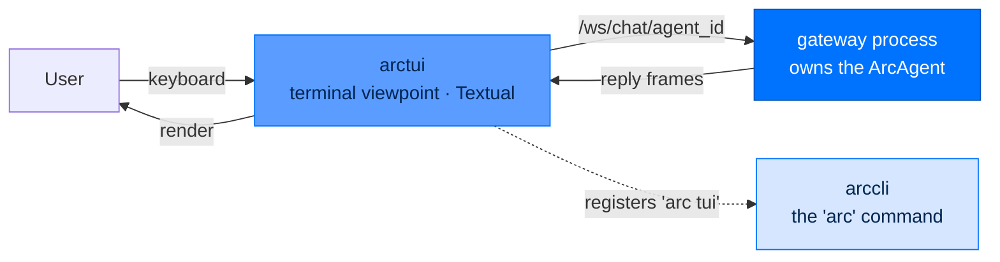
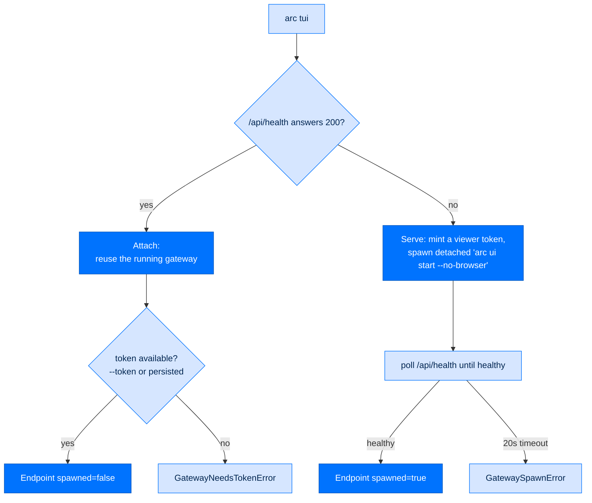

# arctui - Terminal UI

> **Building with Arc**  ·  Build  ·  page 25 of 27  
> **For** Engineers writing code against Arc  
> [← arcui](arcui.md)  ·  [Docs home](../../README.md)  ·  [arccli →](arccli.md)

---

## In one breath

`arctui` is a terminal **viewpoint** onto a running agent — a Textual app that
draws the conversation in your shell. It is deliberately *not* the owner of the
agent. The agent lives inside a gateway process (`arc ui start` /
`arc team serve`); the TUI attaches to it over the very same `/ws/chat/{agent_id}`
WebSocket the browser dashboard and every chat-platform adapter use. Type in the
terminal, and your words ride that socket to the one true agent; its reply rides
back and renders. Close the terminal and the agent keeps running — you closed a
window, not the process.

That single rule (**SPEC-058: viewpoint, never owner**) is the whole design.
Constructing an `ArcAgent` inside the TUI would grab a second single-writer WORM
lock on the agent's audit chain — the exact collision `arcgateway.fleet` warns
about. So the TUI never builds an agent. It resolves an *endpoint* and talks
through a thin transport seam.



---

## Where it fits

A **surface / terminal-UI** layer. Nothing in the stack depends on it; it depends
downward and attaches sideways to the gateway. Its declared dependencies
(`pyproject.toml`):

| Dependency | Why |
|---|---|
| `textual>=0.80,<2` | The full-screen terminal app framework |
| `websockets>=13` | The attach transport uses `websockets.asyncio.client` (added in 13.0) |
| `arccmd>=0.4` | The `arc` CLI — the TUI registers `arc tui` into its command registry and reuses its slash commands |
| `arc-agent` | `app.py` imports `arcagent` directly for the connector seam types (an allowed downward dep, declared rather than leaned on transitively) |

The registration is intentionally soft in both directions. `arccli` cannot
hard-depend on `arctui` (that would be a cycle, since `arctui` depends on the CLI),
so `arccli`'s command registry does a guarded `import arctui.entry` inside a
`try/except` — the CLI works with or without the TUI installed. The TUI, in turn,
appends its command to the registry the moment `arctui.entry` is imported.

---

## The entry point: `arc tui`

Importing `arctui.entry` runs `_register_tui_command()`, which appends a
`CommandDef(name="tui", category="Session", cli_only=True, …)` to the CLI's
`COMMAND_REGISTRY` (idempotently — it returns early if a `tui` command already
exists). From then on, `arc tui` is a first-class subcommand.

```bash
arc tui                                  # attach to a local gateway, or spawn one
arc tui --agent employee                 # pick a roster agent by id or display name
arc tui --team coding                    # roster from the global fleet ~/arc/coding
arc tui --root ~/.arc/work               # explicit roster + spawn root (--team-root alias)
arc tui --url http://host:8420 --token <viewer-token>   # attach to a remote gateway
```

> **Accuracy note.** The package ships **no** `arc-tui` console script — there is
> no `[project.scripts]` table in its `pyproject.toml`. The launcher is the
> registered `arc tui` subcommand. `arctui.entry` also exposes a `main(args)`
> function (and an `if __name__ == "__main__"` guard, so `python -m arctui.entry`
> works), but it is not wired as a standalone executable.

`main()` runs `asyncio.run(_run(argv))`, exiting `0` on a clean shutdown or
`KeyboardInterrupt`, and `1` on any unexpected error.

---

## Attach-or-serve

This is the heart of the launcher, and worth getting exactly right. When you run
`arc tui`, `serve.ensure_gateway` decides between two paths by probing the target
`{host}:{port}` (default `127.0.0.1:8420`):



- **Attach** — `probe_health` gets a `200` from `{base_url}/api/health` (an
  auth-exempt route). The TUI reuses that gateway. It still needs a **viewer
  token**: `--token`, or the loopback token `arc ui start` persisted to
  `ui_token_file()` (read by `read_persisted_token`). No token → `GatewayNeedsTokenError`.
- **Serve, then attach** — nothing is listening. `ensure_gateway` mints a fresh
  token (`mint_token` = `secrets.token_hex(32)`), calls `_spawn_gateway` to launch
  a detached `python -m arccli ui start --team-root … --host … --port …
  --viewer-token … --no-browser` (`start_new_session=True`, stdio to `DEVNULL`,
  and `ARC_WORKING_DIR` set to the launch cwd), then polls `/api/health` every
  `0.3s` until healthy or a `20s` deadline (`GatewaySpawnError`).

The resolved handle is an `Endpoint` frozen dataclass: `base_url`, `token`,
`agent_id`, `spawned` (True when this process owns teardown), and an optional
`process` `Popen` handle.

The explicit `--url` path (in `entry._resolve_endpoint`) is **attach-only, never
spawn**: it takes the token you pass (or the persisted one) and connects. A
`SEC-23` guard warns if you would send the viewer token over cleartext `http` to a
non-loopback host — use `https` or an SSH tunnel.

---

## The render seam: `ChatTransport` + `TurnEvent`

`transport.py` defines the one contract the UI renders against — a
`runtime_checkable` `Protocol`, so no base class and no import of a concrete type:

- `ChatTransport.send_turn(text) -> AsyncIterator[TurnEvent]` — send one user
  turn, stream the reply. It yields zero or more `message`/`error` events, then
  exactly one `done` as the final item.
- `ChatTransport.aclose()` — release the connection, idempotent.
- `TurnEvent(kind, text)` where `kind` is `"message"` (reply text), `"error"`
  (turn failed), or `"done"` (terminator, empty text).

Keeping the app coupled to this small shape — not to the WebSocket client — is
what lets a future in-process or NATS transport drop in without touching a line of
render code. It is the same seam idea the whole stack is built on
([The Seam Model](../../concepts/seam-model.md)).

The one production transport is `gateway_client.GatewayChatClient`, a WebSocket
`ChatTransport` onto `/ws/chat/{agent_id}`:

1. `connect()` maps the HTTP base to a `ws://` / `wss://` URL, opens the socket,
   sends `{"token": <viewer-token>}`, and expects a `{"type": "ready", …}` frame.
   Anything else raises `GatewayAuthError` (fail-loud).
2. `send_turn(text)` sends `{"type": "message", "text": …}`. The web adapter is
   send-only, so the gateway accumulates the turn's tokens and delivers **one**
   final agent frame (`{"type": "message", "from": "agent", "text": …}`) —
   "block-at-turn". Non-agent frames (`ready`/`ping`) are skipped; an `error`
   frame becomes a `TurnEvent("error", …)`. A `300s` recv ceiling keeps a dead
   server from hanging the UI forever.

---

## What it renders

`app.ArcTUI` is a Textual `App[None]` with a three-panel layout:

```
┌───────────────────────── Header (agent · gateway · turns) ──────────────────────┐
├────────────────────────────────────┬────────────────────────────────────────────┤
│ Transcript (TranscriptView)         │ Activity (ActivityView)                     │
│  You: analyze the data              │  read_file(data.csv)                        │
│  Agent: I'll analyze…               │  …bounded tool-call row buffer…             │
├────────────────────────────────────┴────────────────────────────────────────────┤
│ Input (InputComposer) — multi-line, slash-aware autocomplete                     │
└──────────────────────────────────── Footer ─────────────────────────────────────┘
```

| Component | Responsibility |
|---|---|
| `ArcTUI` (`app.py`) | The Textual app: composes the panels, drives turns through the transport, dispatches slash commands, tracks the turn count in the header |
| `TranscriptView` (`transcript.py`) | Renders the conversation with live delta streaming (`start_streaming` / `append_delta` / `finish_streaming`); markdown-lite (bold / italic / code) |
| `ActivityView` (`activity.py`) | Tool-call activity panel, a bounded row buffer |
| `InputComposer` (`input_composer.py`) | Multi-line input with slash-aware autocomplete and in-session history; posts a `SubmitMessage` (prose) or `CommandMessage` (slash) |
| `command_completer.py` | Slash-command autocomplete sourced from the `arccli` registry |
| `connect.py` / `connect_screen.py` | `/connect` and `/connections` (SPEC-064) — connector setup in masked modals |
| `prompts.py` | Approval / clarify / secret-input modals |
| `theme.py` | Palette tokens + TCSS (`build_tcss`); overridable via `[tui.theme]` in agent config |

**Turn flow.** Prose → `InputComposer` submits → `ArcTUI._send_to_agent` (a
`@work(exclusive=True)` task, so turns queue rather than overlap) →
`transport.send_turn(text)` → each `TurnEvent` streams into `TranscriptView`. With
no transport attached, the app echoes a stub reply — that is **no-agent mode**, not
a crash.

### Keys and commands (verified against source)

Only two key bindings exist (`app.BINDINGS`):

| Key | Action |
|-----|--------|
| `Ctrl+C` | Quit |
| `Ctrl+L` | Clear the transcript |

Slash commands handled **locally** by the TUI:

| Command | Purpose |
|---------|---------|
| `/help` | List commands (built-ins + everything in the `arccli` registry) |
| `/clear` | Clear the transcript |
| `/quit` | Exit (aliases: `/exit`, `/q`, `/bye`) |
| `/connect` | Connect this agent to an external system (masked modal) |
| `/connections` | Show what it is already connected to |

Any other `/command` falls through to `arccli.commands.registry.resolve_command`
and runs its handler in a worker thread; an unrecognized one prints
`Unknown command`. So the full slash vocabulary is whatever the installed CLI
registers — the TUI does not invent its own `/tools`, `/sessions`, or `/cost`.

---

## Folder trust

Launching `arc tui` inside a project directory offers to **trust** that folder for
the served agent. On yes, `trust.grant_folder` appends the resolved directory to
the agent's `[tools.policy].allowed_paths` in its `arcagent.toml`, so a coding
agent can read and write the project.

The grant is **persistent, not in-memory** — the agent runs in the gateway
process, not the TUI, so the TUI cannot mutate live policy. Writing the toml
*before* the spawn path serves the agent is what makes the grant take effect; an
already-running gateway picks it up on its next restart. On a non-interactive
stdin the folder is left untrusted (the secure default), and anything but an
explicit `y`/`yes` declines. Folder strings are escaped as TOML basic strings
before interpolation (`SEC-01`: this list is security policy the runtime trusts,
so no injection).

---

## Threat surface

Being a viewpoint, not an owner, is itself the primary containment: the TUI holds
no keys, writes no audit chain, and enforces no policy. It authenticates *to* the
gateway, which does all four Four-Pillar jobs. The seams that still matter here:

| Surface | Concern | Mitigation |
|---|---|---|
| Viewer token in transit (`LLM02`, `ASI07`) | The token is the first WS frame; over cleartext `http` to a non-loopback host it is exposed | `SEC-23` warning; loopback default; `https`/`wss` mapping; SSH-tunnel guidance |
| Token at rest | A same-user TUI must reuse `arc ui start`'s token | Persisted `0600` at `ui_token_file()` |
| Folder-trust write (`ASI03`, `LLM05`) | A folder name could inject TOML into a policy file the runtime trusts | Every path rendered as an escaped TOML string; declined by default on non-interactive stdin |
| Dual ownership / audit-chain collision (`ASI08`) | A second `ArcAgent` would grab a second WORM lock | The TUI never constructs an agent — attach-only, by construction |
| Detached spawn | The spawned gateway is a subprocess with a token on its argv | Fixed argv, no shell (`S603`), stdio to `DEVNULL`, `start_new_session`; token minted per-spawn |
| `/connect` credential entry | The CLI connect handler prompts with `getpass` against the terminal Textual owns | `D-586`: `/connect` is served by masked in-TUI modals and **never** routed to the CLI handler; install/probe/rollback stays behind `arcagent.Connections` |

---

## Failure modes (all graceful)

The launcher is built to boot **something** rather than crash:

- **Empty roster** — `resolve_agent` reason `empty`: "No agents under `<root>`. Run
  `arc agent create <name>` first." → no-agent mode.
- **Ambiguous name** — reason `ambiguous`: lists candidates, asks for `--agent`.
- **Unknown name** — reason `unknown`: names what you asked for and lists what
  exists.
- **Gateway unreachable / attach fails** — `_build_transport` catches the
  exception and boots no-agent mode with the reason on the status line.
- **Running gateway, no token** — `GatewayNeedsTokenError` tells you to pass
  `--token` or start it with `arc ui start`.
- **Spawn never healthy** — `GatewaySpawnError` after the 20s deadline.
- **Missing optional dependency** — the Textual import is lazy, so a broken TUI
  install never breaks unrelated `arc` subcommands.

No-agent mode still runs the full UI; it simply shows the reason where live agent
output would be. That is intentional degradation, not an error.

---

## A worked example

You are in `~/projects/report` and have one agent in the global fleet.

```bash
cd ~/projects/report
arc tui --agent analyst
```

1. `entry._resolve_team_root` resolves the roster root (here the default
   `~/arc/team`); `resolve_agent(name="analyst", …)` selects the agent.
2. `_maybe_prompt_trust` asks: *Trust this folder for the agent to read/write?
   `~/projects/report` [y/N]*. You answer `y`; the directory is appended to the
   agent's `allowed_paths`.
3. `_resolve_endpoint` finds nothing on `127.0.0.1:8420`, so `ensure_gateway`
   mints a token and spawns `arc ui start --no-browser` with
   `ARC_WORKING_DIR=~/projects/report`, then waits for `/api/health`.
4. A `GatewayChatClient` connects to `ws://127.0.0.1:8420/ws/chat/analyst`,
   completes the token handshake, and the TUI opens.
5. You type *Summarize `q3.csv`*. The text rides `send_turn`; the agent (running in
   the gateway, with your folder now trusted) reads the file and replies; the reply
   streams into the transcript. Close the TUI — the gateway and agent keep running.

---

## Next steps

- [The Seam Model](../../concepts/seam-model.md) — why the transport is a Protocol
- [arcui](arcui.md) — the gateway/dashboard the TUI attaches to
- [Quickstart](../quickstart.md) · [Package Index](../package-index.md)

---

## Verified public surface

> Introspected from the installed package on the current commit. Every name
> below is importable exactly as shown; full signatures are in the
> [API reference](../../reference/api.md#arctui).

`arctui` exposes only `__version__` at the top level. Everything else is reached
through its submodules (`arctui.entry`, `arctui.app`, `arctui.serve`,
`arctui.gateway_client`, `arctui.transport`, `arctui.roster`, `arctui.trust`) or
the `arc tui` command it registers.
