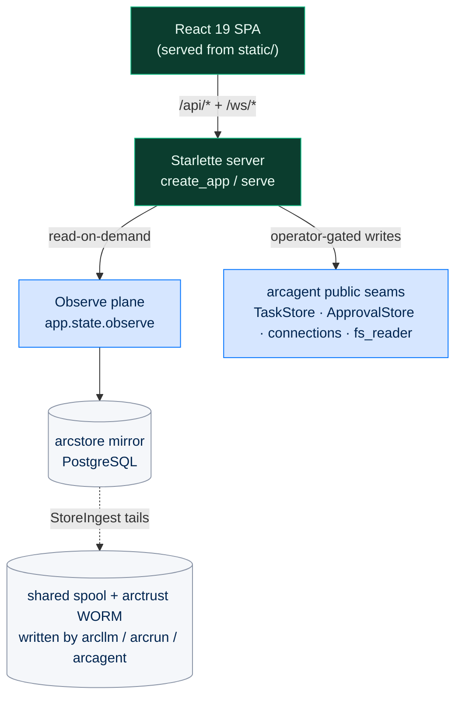
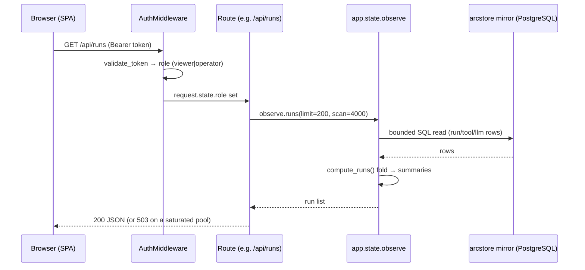

# arcui - Dashboard

> **Building with Arc**  ·  Build  ·  page 24 of 27  
> **For** Engineers writing code against Arc  
> [← arcgateway-mattermost](arcgateway-mattermost.md)  ·  [Docs home](../../README.md)  ·  [arctui →](arctui.md)

---

## In one breath

`arcui` is the **multi-agent dashboard** — a Starlette server plus a React 19
single-page app that lets one operator **observe and operate** a whole fleet
from a browser. It is a *surface*: it reads the shared PostgreSQL-backed
`arcstore` operational record on demand, and every change it makes goes through
`arcagent`'s public seams. It never runs a loop, never calls a model, and never
reaches past the agent into `arcrun` or `arcllm`.

Two ideas define the package, and both are hard rules, not preferences:

1. **Read-on-demand, not live-push (SPEC-026 FR-5).** There is no agent
   telemetry socket, no `EventBuffer`, no `RollingAggregator`. Producers
   (`arcllm` / `arcrun` / `arcagent`) already write the durable record to the
   arcstore spool and the `arctrust` WORM files. arcui runs its own `StoreIngest`
   over those files into a PostgreSQL mirror and answers every panel with a plain
   SQL read at request time. The database *is* the aggregate.

2. **Two tokens, operator-gated mutations.** Every `/api/*` call carries a bearer
   token that maps to exactly one of two roles — `viewer` (read) or `operator`
   (read + control). Reads are open to either role; every state change is gated
   on `operator` and audited to a signed WORM chain.

`arcagent` must run headless with none of this present. Deleting `arcui` removes
the dashboard and removes no agent capability.



---

## Layer and dependency direction

**Surface / dashboard.** `arcui` sits at the top of the stack alongside
`arcgateway`. It may depend downward on `arcgateway`, `arcstore`, `arcteam`,
`arctrust`, and `arcskill`; it views and interacts with `arcagent` through that
package's public facade and seams. The forbidden moves — enforced by
architecture tests, not intentions:

| Rule | Meaning |
|---|---|
| **Never bypass the agent** | arcui does not `import arcrun` or `import arcllm`. It sees LLM activity only as rows the producers already wrote, and drives agents only through `arcagent`'s public surface. |
| **Never invert the dependency** | `arcagent`, `arcrun`, `arcllm` must not import `arcui`. The wiring is one-way: `arcui → embedded gateway → agents`. |
| **No direct `team/` filesystem access (SPEC-022)** | arcui contains zero direct `team/` reads and zero `watchfiles`. Every agent-workspace file reaches the browser through `arcgateway.fs_reader`'s single audited chokepoint. A regression test (`tests/test_arcui_no_team_imports.py`) fails if that boundary is crossed. |
| **Headless-clean** | Workflow execution, the loop, and the model must never require this process. The workflow `RunnerHost` lives in `arcgateway`; arcui only *views* it. |

The package is launched mainly via `arc ui start` (from `arccli`).

---

## The public surface

`arcui` exports exactly three names from its root — nothing else is public API:

```python
from arcui import create_app, serve, attach_llm
```

| Name | Signature (from `arcui.server`) | Role |
|---|---|---|
| `create_app` | `(*, auth_config=None, config_controller=None, agent_info=None, max_agents=100, team_root=None, gateway_config=None, messaging_service=None, team_post_forwarder=None, team_stream_interval=1.0, data_dir=None, workspace_dir=None, allow_external_task_refs=False, workflow_control_plane=None, gate_control_plane=None, approval_operator_target=None, attachment_scanner_factory=None, arcstore_config=None, arcstore_secret=None, arcstore_backend=None, inbox_service=None, inbox_delivery_port=None, inbox_clearance="UNCLASSIFIED") -> Starlette` | Build the Starlette app with all routes, middleware, and shared `app.state`. Every argument is keyword-only; every default yields a safe standalone app. |
| `serve` | `(llm=None, *, host="127.0.0.1", port=8420, config_controller=None, auth_config=None) -> None` | One-liner: `create_app(...)` then `uvicorn.run(...)`. |
| `attach_llm` | `(app, instance, label=None) -> None` | Walk an `LLMProvider`'s module stack (via `arcagent.iter_model_modules`) so `/api/circuit-breakers`, `/api/budget`, and `/api/queue` can report live module state. There is **no** event push here — the name is retained for call-site compatibility. |

> The old public surface described in earlier drafts — `DashboardServer`,
> `ViewerToken`, `start_dashboard`, `generate_token`, `observe`/`interact`/
> `manage`/`admin` scopes, a `/ws` telemetry stream, a `CORS_ORIGINS` list — does
> not exist. None of those symbols are importable. The real surface is the three
> functions above.

### `create_app` and the lifespan

`create_app` assembles the route list (each `routes/` module exposes a `routes`
list that is splatted in), mounts `/assets` static files when `static/` exists,
reads `static/index.html` **once** into `app.state.index_html`, and installs
`AuthMiddleware`. It then defines a Starlette **lifespan** that, on startup:

- starts `app.state.observe` (the arcstore mirror ingest) and the shared task
  backend — both fail-open, so a store problem yields empty reads rather than a
  dead dashboard;
- when a `gateway_config` **and** `team_root` are both present, composes the
  in-process gateway runtime via `arcgateway.bootstrap.build_for_embedded`
  (executor, session router, web/slack/telegram adapters, broker), calls
  `install_embedded_agent_hooks`, and attaches the workflow plane;
- builds the embedded `arcteam` messaging service (`build_messaging_service`)
  when a `team_root` exists and none was injected, plus the `/ws/team`
  forwarder and the agent-mail worker;
- starts the read-only `TeamBusObserver` that feeds the `/ws/team` stream;
- starts the approval-notification dispatcher.

On shutdown it cancels those tasks, closes any backend *it* opened (an injected
one owns its own lifecycle), stops the Observe ingest, releases the mutation
WORM `flock`, and disconnects the embedded adapters in reverse.

`serve()` calls `create_app()` with defaults, optionally `attach_llm`, and runs
uvicorn. `arc ui start` (in `arccli`) is the real entry point — it loads the
deployment `.env`, **requires** a configured PostgreSQL backend
(`_require_arcstore_backend`), builds an `AuthConfig`, resolves `./team` as the
default `team_root`, auto-builds a web-chat `GatewayConfig`, starts the
always-on fleet, and on a loopback bind opens the browser pre-authenticated
with the viewer token in the URL **hash** (never sent to the server).

---

## Two-token authentication

`arcui.auth` owns the whole model. Tokens live in **process memory** — there is
no on-disk token file the server reads (the CLI may persist the loopback viewer
token `0600` purely so a same-user `arc tui` can attach).

- **`AuthConfig`** holds a `viewer_token` and an `operator_token` (each a
  `secrets.token_hex(32)` if not supplied) plus a `SessionRegistry` for
  email/password sign-ins. `validate_token` checks sessions **first** (a
  signed-in person carries a DID), then the operator token, then the viewer
  token, using `hmac.compare_digest` (constant-time). Roles are `"operator"`
  (read + control) and `"viewer"` (read).
- **`AuthMiddleware`** gates every `/api/*` route. Non-API paths pass through
  with `role=None`. Only `/api/health`, `/api/auth/login`, and `/api/auth/mode`
  are reachable without a token. Missing token → `401 {"error": "Missing token"}`;
  invalid → `401 {"error": "Invalid token"}`; valid → `request.state.role` is set.
- **`SessionTracker`** emits `ui.session_start` at-most-once per
  `(token-hash, remote_addr)` with five federal-required fields (`session_id`,
  `uid`, `username`, `remote_addr`, `auth_method`) and hands each request a
  stable `session_id` for mutation attribution. Tokens are SHA-256 hashed before
  storage; both internal stores are bounded LRUs (`ARCUI_MAX_SESSIONS`,
  `ARCUI_MAX_BOOTSTRAP_MARKERS`).

The static viewer/operator tokens are the break-glass path — for automation,
first boot before any account exists, and an unreadable user store. On top of
them, `routes/auth_routes.py` adds real sign-in: `POST /api/auth/login` (email +
password → a session token carrying the person's DID), `logout`, `me`,
`PATCH /api/auth/me` (edit your own display name / handle / chat pairings), and
`GET /api/auth/mode` (does this deployment have accounts yet). Managing *other*
users is `arc user` on the box, never a route.

---

## The Observe plane — read-on-demand

`arcui.observe.Observe` is arcui's read-only view of the durable operational
record. It owns a per-instance arcstore mirror and a `StoreIngest` that tails
the shared `spool/` and `worm/` directories (everything the producers wrote,
whether or not arcui was running) into a PostgreSQL operational view. The server
lifespan calls `start()`/`stop()`; every read is a synchronous
request→response. `Observe.__init__` depends only on the `StorageBackend`
Protocol, so the store can be swapped without touching this plane.

### The reads (`observe.py`)

| Method | Reads | Notes |
|---|---|---|
| `traces(agent, limit=50)` | `llm_calls` rows, newest first | List is **metadata-only** — raw request/response bodies (`~100KB+` each) are omitted; filtered on `agent_label`. |
| `trace(trace_id)` | one `llm_calls` row | Single-trace **detail** sets `include_bodies=True` → `request` / `response` / `messages` / `tools` (absent under the federal/CUI default). |
| `audit(agent, target, limit=100)` | `audit_chain` | Ordered by `seq DESC`. |
| `run_recalls(run_id)` | `audit_chain` `memory.recall_attributed` for one `request_id` | The cards a run's memory brain surfaced (SPEC-073). |
| `tasks(owner_did, status)` | `TaskStore.list` over the mutable plane | Cast to the narrow `MutableTaskBackend` Protocol. |
| `stats` / `timeseries` / `performance` / `cost_efficiency` | `llm_calls` in a window | Aggregated on read in one pass — see `observe_stats.py`. |
| `runs(agent, limit=200, scan=4000)` | `run_events` + `tool_events` + `llm_calls` | Folds rows into per-run summaries; **`scan` is bounded** (see below). |
| `timeline(run_id, limit=1000)` | four tables joined on `request_id == run_id` | Merged in Python, sorted by `ts` — no SQL UNION. |
| `spawn_tree(root_did)` | `spawn_events` | Flat edges rebuilt into a parent→child tree, depth-capped. |
| `llm_by_identity(window)` | `llm_calls` grouped by identity | Cost lives at the leaf; a parent never absorbs its children's spend. |
| `skill_versions` / `skill_candidate_body` | arcskill candidate store + skills WORM | Only when `workspace_dir` is set (SPEC-054). |

Window keys are `1h` / `24h` / `7d` / `30d`; the `ts >= cutoff` bound is pushed
into the store so the window filter runs in SQL.

### Store-side aggregation (`observe_stats.py`)

These are **pure functions over plain dicts** — one `llm_calls` row each — so
they carry no backend coupling and are trivially testable. `compute_stats`
rolls up cost/tokens/errors/latency percentiles by model, provider, and agent;
`compute_timeseries` buckets to the chart granularity each window expects;
`compute_runs` / `_finalize_run` fold run/tool/llm rows into per-run summaries
and assign an **honest status**: `completed` (reached `loop.complete`),
`limited` (hit a turn/cost/token cap — not a crash), `running`, `stale`
(no terminal and idle past 15 min), or `error` (died without completing). A
single recovered tool error mid-run never paints the whole run red.

---

## Routes

Every route module exposes a `routes` list. All live under `/api/*` (gated by
`AuthMiddleware`) except the two WebSockets and the SPA shell. Grouped by concern:

### Observe / telemetry (read-only, any role)

| Path | What it returns |
|---|---|
| `GET /api/traces`, `GET /api/traces/{trace_id}` | LLM-call list (metadata) and single-trace detail. |
| `GET /api/stats`, `/api/stats/timeseries`, `/api/performance` | Windowed rollups; `?agent_id=` scopes to one agent. |
| `GET /api/circuit-breakers`, `/api/budget`, `/api/queue` | Live module state walked by `attach_llm`. |
| `GET /api/cost-efficiency`, `/api/stats/by-identity` | Per-model efficiency ranking; per-identity spend. |
| `GET /api/runs`, `/api/runs/{run_id}/timeline`, `/api/runs/{run_id}/recalls`, `/api/spawn-tree` | Run list, merged timeline, recall attribution, spawn lineage (SPEC-028). |
| `GET /api/export` | CSV/JSON export from the mirror. |
| `GET /api/health`, `/api/info` | Liveness (carries the deployed `bundle` filename) and agent identity. `/api/health` is auth-exempt. |

### Fleet and agents

- `GET /api/agents`, `GET /api/agents/{id}` — the in-memory `AgentRegistry` of
  connected agents (registrations are lost on restart and re-established).
- `routes/team_pages.py` — fleet aggregations that walk the roster and read each
  agent's files through `fs_reader`: `/api/team/roster`, `/api/team/policy/*`,
  `/api/team/tasks`, `/api/team/tools-skills`, `/api/team/audit`.
- `routes/agent_detail/` — the per-agent tabs (see below).

### Operator-gated mutations

| Surface | Routes | Delegates to |
|---|---|---|
| **Tasks** | `POST /api/team/tasks`, `PATCH`/`DELETE /api/tasks/{id}`, `/api/tasks/{id}/{cancel,move,approve,reject}` | `TaskStore` (SPEC-056). |
| **Approvals** | `GET /api/approvals`, `/api/approvals/{id}/{approve,deny}`, notification list/ack | `ApprovalStore` + `arctrust` operator key (see below). |
| **Cancellations** | `GET`/`POST /api/cancellations` | `CancelStore` — parks a stop request for a per-agent watcher (the run is in a separate process). |
| **Connectors / connected data** | `/api/connectors/*`, `/api/connections/*`, `/api/agents/{id}/knowledge/*` mapping approvals | `arcagent.connections` and the connected-source lifecycle; mappings are staged as hash-bound approvals, never written by the UI. |
| **Provider keys** | `GET /api/keys`, `PUT`/`DELETE /api/keys/{env_var}` | The fleet `.env` key store — a key **value** never leaves the box (D-583). |
| **Trust** | `/api/trust/{gated,source,approve,disapprove}` | `arcagent`'s signed capability-trust seam (the `arc trust` half). |
| **Capability imports** | `/api/agents/{id}/capability-imports/*` | Quarantine/staging + signed promotion; a stale review is rejected. |
| **Workflows** | `/api/workflows*`, `/api/workflow-runs/*`, `/api/workflow-tasks/{id}/gate` | The workflow control plane (SPEC-061 — see below). |
| **Config editors** | `/api/config`, `/api/arcllm-config`, `/api/system-config/{file}`, per-agent `/api/agents/{id}/config/*` | TOML edited with `tomlkit` to preserve comments. |
| **Gateway** | `POST /api/gateway/restart` | Restarts the `arc.service` process (arcui *is* that process, so it cannot restart itself — it delegates). |
| **Attachments** | `POST /api/agents/{id}/attachments` | Web-chat upload → the agent's own `MediaStore` (see below). |

### Approvals — the two behaviors worth knowing

`routes/approvals.py` is the arcui half of mechanical HITL (SPEC-035). Approval
never rides on agent chat (forgeable); minting a grant is an `operator`-role
action, signed with the on-box `~/.arc/operator` key the agent pins to.

- **Workflow-sign self-reaping.** A `workflow_sign` request binds to a workflow
  definition's **content hash**. Once the definition is edited, that request can
  never be approved — the operator would be signing something they never read.
  `_reap_stale_workflow_signs` runs on every `GET /api/approvals`: any
  `workflow_sign` row whose hash no longer matches the current definition (or
  whose definition is gone) resolves itself `expired` and drops out of the queue,
  so stale requests can't pile up. Approving a *live* `workflow_sign` request is
  the one approval whose grant is not the whole effect — it **signs the bundle**,
  in this operator-authenticated path, never through the control plane (an agent
  can only write the request; REQ-224).

### The web-chat attachment store

`create_app` installs `app.state.attachment_store_for(agent_did)`, which resolves
the agent's workspace from the roster and returns a
`arcgateway.media_store.MediaStore` rooted at `<agent_dir>/workspace/` (per agent,
never shared — ADR-029). `upload_attachment` authenticates the caller, derives
the owner DID and session key, streams the file in, and returns an
`AttachmentManifest` with an opaque `att_...` id. The chat WebSocket then accepts
only those opaque ids on a message frame.

### Agent-detail tabs (`routes/agent_detail/`)

Each handler is a thin delegator into `arcgateway.fs_reader` /
`arcgateway.policy_parser`; **no arcui code opens a `team/` file directly**. The
surface (`/api/agents/{id}/...`) covers `config` + config-file GET/PATCH,
`files/tree` + `files/read` (GET/PUT), `skills` (+ detail / evals / versions),
`prompts` (+ rubric / detail / PUT / DELETE), `tools`, `capabilities`,
`sessions` + `sessions/{sid}` replay, `inbox` (threads / search / messages /
reply / handoffs), `stats`, `traces`, `audit`, `policy` (+ bullets / stats),
`tasks`, `schedules` + `schedules/{sid}` PATCH, `channels`, and
`connect-telegram`.

**The current-session marker.** `GET /api/agents/{id}/sessions` names which
session is live. The chat socket writes to `SessionRouter.current_session_key`
(rotation-aware, follows `/new`), so `_current_session_key` re-derives that same
key from the caller's viewer token and returns it as `current_session_key` in the
list — otherwise a client re-deriving the generation-0 base key would load a
stale conversation after a rotation. On a read-only deployment (no
`session_router`) the list is still valid, just without the marker.

---

## The two WebSockets

SPEC-026 FR-5 removed the agent telemetry socket. **Exactly two** WebSockets
remain, and neither is a live-push telemetry pipeline:

### `/ws/chat/{agent_id}` — bidirectional agent chat

A thin proxy between the browser and
`arcgateway.adapters.web.WebPlatformAdapter` (`routes/chat_ws.py`). The handshake
is accepted, the client sends `{"token": "<bearer>"}`, and only `viewer` /
`operator` roles may upgrade — `agent` tokens are rejected (ASI03). The route
owns the token: it feeds `derive_viewer_did(token)` exactly once, builds
`chat_id = session_router.current_session_key(agent_did, user_did)`, and hands the
socket to `register_socket`. The adapter is secret-free — the token never reaches
it. `chat_id == session_key`: identical across web/slack/telegram for the same
(agent, user) pair, and the same identifier `arcagent`'s SessionManager writes
under, so history replays on reconnect. `?since_seq=N` (bounded to defeat an
O(n²) big-int DoS) requests replay of missed frames.

### `/ws/team` — read-only bus view + one-way human post

`routes/team_ws.py` drains `app.state.team_stream` (a `TeamStreamHub` fed by the
read-only `TeamBusObserver`) and pushes each rendered frame to the browser —
frames carry **handles, never DIDs**, and mark `@mentions` (REQ-062). A
`{"type": "post", ...}` frame is handed to `app.state.team_post_forwarder` — the
arcteam-owned callable that signs and routes it as the human entity. arcui
derives the human's identity from the viewer token and passes it through; it
never signs or routes. Same auth as `/ws/chat`.

> The `arc ui tail` CLI subcommand still tries to connect to a bare `/ws`
> endpoint with a `subscribe` / `auth_ok` handshake. That endpoint was the
> telemetry socket SPEC-026 FR-5 deleted, so no such route exists on the server
> — `tail` is vestigial. Use `arc ui start` and the Activity screens; observe
> data over HTTP with the `/api/traces` / `/api/runs` reads.

---

## Embedded fleet, messaging, and the workflow seam

`arc ui start` runs the fleet **in the arcui process** (personal/enterprise
tier; federal isolates each session in its own subprocess and is out of scope
for the in-process path). Five support modules make that work:

- **`embedded_agents.py`** — `install_embedded_agent_hooks` wraps the embedded
  executor's `agent_factory` with a bounded LRU cache (`~50MB`/agent, 32 default)
  and per-DID single-flight locks, and registers each loaded agent in
  `app.state.agent_registry` so it shows LIVE. `adopt_agent` seeds an
  already-started fleet instance into that cache so the executor never builds a
  **second** instance that would collide on the agent's single-writer WORM audit
  lock.
- **`messaging.py`** — `build_messaging_service` constructs the embedded
  `arcteam` `MessagingService` (`NatsBackend → AuditLogger → EntityRegistry →
  MessagingService`) over the managed NATS the gateway started. The operator
  audit key is **never minted here** (`generate_if_absent=False`) — an observer
  must not bootstrap the deployment's signing key; a missing key or unreachable
  broker returns `(None, None, None)` and the team routes surface an explicit
  `team_messaging_unavailable` rather than a fabricated empty list.
  `build_team_post_forwarder` is the `/ws/team` post path.
- **`team_stream.py`** — `TeamStreamHub` (per-socket, per-channel fan-out with
  drop-oldest backpressure and a replay ring) and `TeamBusObserver` (the single
  read-only bus subscriber SPEC-031 allows — it reads and renders, never sends).
- **`workflow_plane.py`** — `DashboardWorkflowPlane` is the one adapter between
  the route layer's Protocols and `arcteam`'s real `WorkflowControlPlane`. It
  holds no operational logic: every mutation is one call into the same control
  plane the CLI and agent tools use, every read one call into the definition or
  run store. `build_dashboard_plane` wires it from the runner the fleet already
  hosts. When no runner is hosted, `app.state.workflow_control_plane` stays
  `None` and every workflow route degrades to `503` — arcui never fabricates
  workflow behavior.
- **`registry.py`** — the in-memory `AgentRegistry`; no persistence, per-agent
  telemetry read on demand from the mirror by `agent_label`.

---

## The React SPA

The frontend lives in `web/` (React 19 + Vite + shadcn / Tailwind v4, the 2027
control-plane design language — graphite + emerald). `npm run build` compiles it
into `src/arcui/static/`, and **those built assets are committed** so the package
works air-gapped with no CDN. `create_app` mounts `/assets` and serves
`static/index.html`, substituting a per-process `{{ARC_BUILD_ID}}` into asset
URLs and `sw.js` so the browser refetches on every restart; a `_spa_fallback`
serves the shell for any browser-router path (so deep links resolve) while
keeping `/api/*` and `/ws/*` as real 404s.

> **Restart the server after any `web/` rebuild.** `index.html` is read into
> `app.state.index_html` **once at startup** and served from that in-memory
> cache. A fresh build on disk is not picked up until the process restarts, and
> deep links can 404 until then. `/api/health` returns the deployed `bundle`
> filename precisely so a long-lived tab can detect it is running code the
> server no longer has.

---

## Configuration

### The two-database reality

arcui requires a configured PostgreSQL `arcstore` backend
(`ARCSTORE_DATABASE_URL`); `arc ui start` refuses to launch without it
(`_require_arcstore_backend`). Since the ArcStore split there are **two DSNs per
box**: the agent-runtime arcstore DSN the agents write through, and the
observe/arcui DSN this dashboard reads. `create_app` resolves its backend from
`arcstore_config` / `arcstore_secret` (or an injected `arcstore_backend`), and
the Observe ingest tails the shared `spool/` + `worm/` files into the observe
DB. When the two DSNs are not reconciled, a reader can look at a DB the writer
never wrote — the class of bug behind PROB-009 (a connector card reading
"0 batches / Never" from a defaulted-empty row).

### The shared pool, bounded scans, and graceful 503

The mutation stores and the Observe reads share **one** bounded asyncpg pool. A
fast-polling read that scans tens of thousands of JSONB rows is therefore a
self-inflicted DoS on every sibling panel. This actually happened — **PROB-010**:
Activity, Approvals, and Model-usage panels showed "Failed to fetch" and 2–5s+
loads because `Observe.runs()` folded `3 × 20,000 = 60,000` rows every ~4s,
starving the pool until sibling queries surfaced as 500s. The fixes are the rule
for this package:

- **Bound every scan.** `runs()` scans `4000` rows per table (still far more than
  the 200 runs shown), not 20,000.
- **Degrade, don't 500.** The three reads are wrapped so a saturated pool returns
  a clean `503` ("temporarily unavailable"), never an unhandled 500.

### Audit — one signed emission point

Every UI-originated mutation calls `emit_mutation_audit` (never `audit_event`
directly), which records to two surfaces: the ephemeral `UIAuditLogger` (JSON
log + OTel span, with key- and value-level credential redaction) **and**, when an
operator key is present, the signed `MutationWormWriter` chain
(`worm/audit-chain-arcui.jsonl`) the Observe ingest tails onto the Security
screen. The WORM writer holds a lifetime exclusive `flock`, hence its own
per-writer filename distinct from each agent's chain. No operator key → degrade
to log + OTel; the key is never minted from the observer.

---

## Threat surface

| Vector | Mitigation in arcui |
|---|---|
| **Forged control action** | Mutations are `operator`-role only and audited; a viewer attempt is recorded `denied`. Grants are signed with the on-box operator key an agent pins to — a viewer session or foreign process cannot mint one. |
| **Agent-token privilege escalation (ASI03)** | Both WebSockets reject `agent` tokens; only `viewer`/`operator` may upgrade. |
| **Signing an unread workflow (confused deputy)** | `workflow_sign` binds to the definition's content hash; an edit since the request refuses the approve and self-reaps the stale row. Neither the UI nor an agent can sign — both can only ask (REQ-224). |
| **Direct `team/` reach-through (SPEC-022)** | Zero direct filesystem access; all agent files go through `arcgateway.fs_reader`'s audited chokepoint, proven by `test_arcui_no_team_imports.py`. |
| **Token leakage** | Viewer token rides the URL **hash** (never sent to the server, never in access logs); tokens are process-memory and SHA-256-hashed in the tracker; audit values are redacted by key name and content pattern. |
| **Session non-repudiation (NIST AU-3)** | `ui.session_start` binds each session to a named OS user (`uid` + `username`), and every mutation to `actor_role` + `session_id`. |
| **Bootstrapping a signing key from a reader** | The operator key is loaded `generate_if_absent=False` everywhere; absence degrades loudly, it never mints authority. |
| **Resource exhaustion** | Bounded scans + shared-pool-aware `503`; bounded LRUs on sessions, bootstrap markers, and the embedded-agent cache. |

### A dashboard read, end to end



The producers wrote those rows to the shared spool/WORM earlier; the ingest
already tailed them into the mirror. No agent was contacted for this read.

---

## Failure modes and how to inspect

| Symptom | Likely cause | How to check |
|---|---|---|
| Panels "Failed to fetch" / slow | Shared-pool saturation from an over-broad scan (PROB-010) | Watch for `503` on `/api/runs` / `/api/approvals`; confirm `scan` bounds; check pool size. |
| Sidebar/UI is stale after a rebuild | `index.html` cached at startup | Restart the server; compare `/api/health` `bundle` against the tab's loaded script. |
| Team Chat reads empty but `arc team channels` lists rooms | No embedded messaging service wired | Look for the `team messaging unavailable: no operator audit authority` / `broker unreachable` error log; routes return `team_messaging_unavailable`. |
| Every workflow screen answers `503` | No workflow runner hosted, so `workflow_control_plane` is `None` | Confirm the gateway hosts a `RunnerHost`; see the `no workflow runner hosted here` log line. |
| Web-chat attachment 404 "agent workspace unavailable" | `attachment_store_for` could not resolve the agent's workspace | Verify the agent is in the roster and `team_root` is set. |
| Runs show `error` that actually finished / `limited` that crashed | Status derivation in `_finalize_run` | `completed` = reached `loop.complete`; `limited` = hit a cap; `stale` = no terminal + idle 15 min. |
| Connector card shows "0 batches / Never" | Two-DB DSNs not reconciled (PROB-009) | Confirm the sync writer and the observe reader point at the same DB. |
| `arc ui tail` cannot connect | It targets the deleted `/ws` telemetry socket | Expected — read over HTTP instead. |

---

## A worked example

Stand up a standalone dashboard against an existing arcstore data dir and read
its telemetry over HTTP:

```python
from arcui import create_app
from arcui.auth import AuthConfig

auth = AuthConfig({"viewer_token": "v-demo", "operator_token": "o-demo"})
app = create_app(auth_config=auth)   # standalone: no team, no gateway, no chat
# serve with: uvicorn.run(app, host="127.0.0.1", port=8420)
```

```bash
# Any read needs a bearer token; the viewer token is enough.
curl -s -H "Authorization: Bearer v-demo" \
     'http://127.0.0.1:8420/api/runs?limit=50'          # bounded fold, newest first
curl -s -H "Authorization: Bearer v-demo" \
     'http://127.0.0.1:8420/api/stats?window=24h'        # aggregated on read

# A mutation needs the operator token; the viewer token is denied (and audited).
curl -s -X POST -H "Authorization: Bearer o-demo" \
     'http://127.0.0.1:8420/api/approvals/abc123/approve'
```

In a real deployment you would run `arc ui start` instead: it requires
PostgreSQL, discovers `./team`, wires the in-process gateway + fleet, and opens a
pre-authenticated browser tab on loopback.

---

## See also

- [The Seam Model](../../concepts/seam-model.md) — why every capability arcui touches is a replaceable part behind a typed contract
- [10. The Security Model](../../walkthrough/10-security-model.md) — the Four Pillars arcui rides at every route
- [`arcstore`](arcstore.md) — the durable record arcui mirrors and reads
- [`arcgateway`](arcgateway.md) — the embedded runtime, adapters, and `fs_reader` chokepoint arcui composes
- [API reference](../../reference/api.md#arcui) — introspected public signatures
- [Package Index](../package-index.md) — all Arc packages

---

> **Building with Arc**  ·  Build  ·  page 24 of 27  
> [← arcgateway-mattermost](arcgateway-mattermost.md)  ·  [Docs home](../../README.md)  ·  [arctui →](arctui.md)
